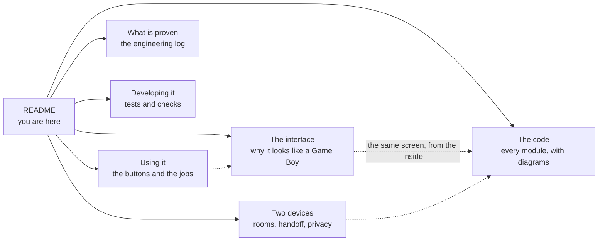

# crystal-pilot mobile

[](https://github.com/minormending/crystal-pilot-mobile/actions/workflows/checks.yml)
[](LICENSE)
[](https://minormending.github.io/crystal-pilot-mobile/)

An exploration: **can the [crystal-pilot](https://github.com/minormending/crystal-pilot)
auto-pilot run on an Android phone itself**, rather than on a Mac with the phone
as a remote?

**It is live: https://minormending.github.io/crystal-pilot-mobile/** — open it
on your phone and it asks which of three people you are. Android will offer to
install it to the home screen.

## Start here

| you | what you need | what to take |
| --- | --- | --- |
| **You want to run it** | a `.gbc` and a `.sym`, both out of your own [pokecrystal](https://github.com/pret/pokecrystal) build | *I have the game files* |
| **Your other device is already playing** | five characters. **No ROM on this one.** | *Watch my other device* |
| **You are just looking** | nothing | *I'm just looking*, or [The code](docs/CODE.md) |

The middle row is the one people miss, so it is worth saying twice: a device
that is only **watching needs no game files at all**. The picture goes straight
from your other device over WebRTC, and its pad works from here if that device
hands it over. Load nothing, type the code, and the game is on your phone.

The first row is the one with a real cost, and it is better said than
discovered: **no game files are distributed here, and none ever will be** —
not in this repo, not by the site. So "can I just try it" is *not without
building the ROM yourself*, which is a `make` in the pokecrystal disassembly and
gives you both files at once. `tools/check-app` fails the build if a ROM, save
or symbol file is ever committed, and CI runs it on every push.

Between two of your own devices a room code also carries the **save**, so you
can put one down and pick the other up — that one needs the ROM on both, because
the ROM never travels. What does travel, and what never does, is set out in
[Two devices, one game](docs/DEVICES.md#what-leaves-the-device-and-when).

## Does it work

Short answer: yes, in the browser — and this repo is a working spike that proves
the hard part. It boots a Pokémon Crystal ROM on the device, reads the game's
live state through the disassembly's symbol file, and drives it with synthetic
input. No app store, no NDK, no cable.


That screenshot is the app running in a phone-sized browser, having booted the
ROM and played through the intro on its own. The header reads `map 24.7` —
`PLAYERS_HOUSE_2F`, the bedroom — which is exactly where the desktop pilot's
bootstrap lands. Same address, same value, different emulator.

## Where things are

This file is the short version: who it is for, what it is, why a browser, and
how to run it. Everything else has a page of its own.

| | |
| --- | --- |
| **[Using it](docs/USING.md)** | the controls, tap-to-walk, starting a game, hunting, healing, your save, slots and undo, updates |
| **[The interface](docs/INTERFACE.md)** | why it is shaped like a Game Boy: the fixed screen and pad, the ranked offers, the two doors, three layouts, colour |
| **[Two devices, one game](docs/DEVICES.md)** | what the page remembers, room codes, handing the save over, watching the other screen, and what leaves the device |
| **[What is proven](docs/PROVEN.md)** | the engineering log — what has been run and measured, what broke, the twelve defects five audits found by reading, and the traps in the emulator core |
| **[Developing it](docs/DEVELOPING.md)** | the tests, the checks that run without a ROM, and serving it locally |
| **[The code](docs/CODE.md)** | a walkthrough of every module, written for someone who has not seen it before, with mermaid diagrams for the decision trees — how a step is taken, how a walk is planned, how a map crossing works, how a battle and a catch play out |



## Why a browser at all

Measured rather than guessed, on an M-series Mac:

| Approach | Speed | Memory access | Save states | Could I test it? |
| --- | --- | --- | --- | --- |
| PyBoy (the desktop pilot) | ~28,000 fps (470×) | yes, bank-qualified | yes | yes |
| **WasmBoy in a browser** | **2,197 fps (37×)** | **yes** | **yes** | **yes** |
| serverboy (pure JS, Node) | 3,185 fps (53×) | yes | no | yes |
| Native Android app (Kotlin + NDK core) | fastest in principle | n/a | n/a | **no** |
| Termux + Python + PyBoy | unknown | yes | yes | **no** |

The last two are the interesting rejections.

**A native app** would be fastest, and the NDK and cmake are even installed on
this machine — but there is no Gradle, no Android Studio, no emulator image and
no device here, so none of it could be run, let alone tested. It also means
rewriting ~7,500 lines of Python into Kotlin *and* wrapping a C emulator core
through JNI. Highest cost, and nothing to show for it until the very end.

**Termux** would reuse every line of the existing Python, which is genuinely
tempting. But PyBoy ships 54 compiled Cython extensions and Android is not
manylinux, so it means building all of them against bionic with clang, plus
numpy and SDL2 — and then there is still no touch interface, because the
pilot's front ends are a terminal CLI and an SDL keyboard menu.

**The browser** wins on the thing that actually matters here: it is the only
option that runs on the phone *and* can be developed and verified without one.
37× real time means a three-hour grind takes about five minutes on a desktop,
and perhaps fifteen on a phone. Slower than the 470× the desktop pilot manages,
but the pilot is still doing hours of work while you wait for a coffee.

## Running it

Open **https://minormending.github.io/crystal-pilot-mobile/**, take *I have the
game files*, and pick your ROM and `.sym`. Both files stay in the browser, which
is also why hosting this publicly is fine: no game data is served, only the app.
Nothing is uploaded unless you press *Share*, and even then the ROM never is —
see [What leaves the device](docs/DEVICES.md#what-leaves-the-device-and-when).

If your other device already has the game running, take *Watch my other device*
instead and type the code it is showing. That one needs no files at all.

It is a static site with no build step, so it also runs from any directory:

```bash
python3 -m http.server 8124
```

Build the ROM and symbol file yourself from the
[pokecrystal](https://github.com/pret/pokecrystal) disassembly. The details —
why GitHub Pages suits it, what HTTPS is needed for, and how to run the checks —
are in [Developing it](docs/DEVELOPING.md).

## Keeping the prose honest

Sections that describe code carry a hash of the files they cover, so
`tools/docs-check` can name the ones that need re-reading after a change. A
pre-commit hook runs it; enable it once per clone with
`git config core.hooksPath .githooks`.

`tools/check-app` runs the rest of what can be checked without a ROM: that every
module parses, that the offline shell matches what is on disk, that the markup
closes, that the palette still meets contrast in both themes, and that no game
file has been committed. CI runs both on every push — and nothing more, because
driving the game needs a ROM built from the disassembly and none is
distributed.

## Licence

**GPL-3.0-or-later**, unlike the MIT-licensed desktop pilot. That is not a
preference: the emulator core this ships, [WasmBoy](https://github.com/torch2424/wasmBoy),
is GPL-3.0-or-later, and a web app that bundles it is a combined work. The other
core measured, serverboy, is GPL-2 — every browser Game Boy core worth using is
copyleft, so any real version of this inherits it.

## If this were taken further

In the order that would pay off:

1. ~~**Port the bootstrap** so the loop can be exercised end to end.~~ Done, and
   then some: `run` reaches the grass with a starter, and `eggErrand` goes on to
   the Poké Balls, which is what made catching testable at all.
2. ~~**Import a `.sav`** from the desktop pilot, so the two halves share progress
   rather than each playing the opening again.~~ Done, in both directions. The
   guess about how was right: SRAM cannot be written, so bringing a save in
   means writing the library's per-cartridge IndexedDB record and re-loading the
   cartridge — which is also how loading a slot works, and why both leave you at
   the title screen's CONTINUE.
3. ~~**Port the collision map and pathfinding.**~~ ~~It is what makes Pokémon
   Center healing, and therefore unattended grinding, possible.~~ ~~The
   remaining work there is the route between maps rather than the route across
   one.~~ Both done — see [Tap to walk](docs/USING.md#tap-to-walk) for the collision map, and
   `gen2/world.js` for the map graph.
4. **Then reconsider native.** If 15× real time on a phone turns out to be too
   slow in practice, a JNI core is the fix — but by then the task logic exists
   in a portable form and the rewrite is only the platform layer.
