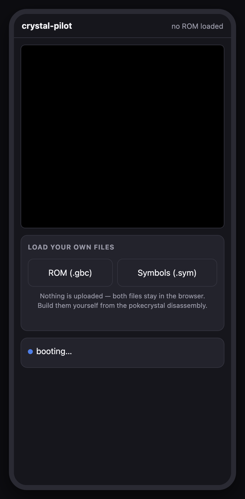
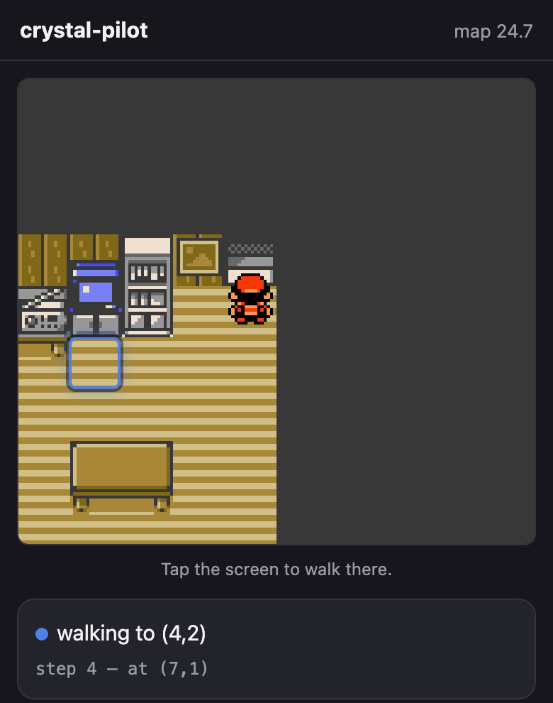
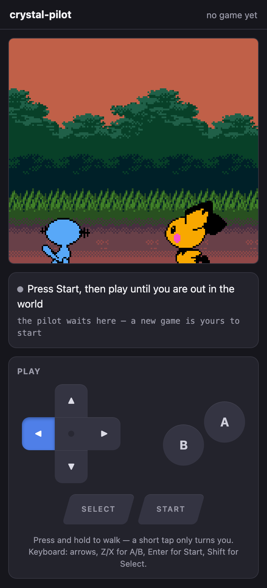

# crystal-pilot mobile

[](https://github.com/minormending/crystal-pilot-mobile/actions/workflows/checks.yml)
[](LICENSE)
[](https://minormending.github.io/crystal-pilot-mobile/)

An exploration: **can the [crystal-pilot](https://github.com/minormending/crystal-pilot)
auto-pilot run on an Android phone itself**, rather than on a Mac with the phone
as a remote?

**It is live: https://minormending.github.io/crystal-pilot-mobile/** — open it
on your phone, pick your own ROM and `.sym`, and it runs. Android will offer to
install it to the home screen.

Short answer: yes, in the browser — and this repo is a working spike that proves
the hard part. It boots a Pokémon Crystal ROM on the device, reads the game's
live state through the disassembly's symbol file, and drives it with synthetic
input. No app store, no NDK, no cable.



That screenshot is the app running in a phone-sized browser, having booted the
ROM and played through the intro on its own. The header reads `map 24.7` —
`PLAYERS_HOUSE_2F`, the bedroom — which is exactly where the desktop pilot's
bootstrap lands. Same address, same value, different emulator.

## The code

**[docs/CODE.md](docs/CODE.md)** explains the code and the reasoning inside it,
with mermaid diagrams for the decision trees — how a step is taken, how a walk
is planned, how a map crossing works, how a battle and a catch play out, and how
the interface's two modes fit together.

It is written for someone who has not seen the codebase before, with the harder
material — addresses, measurements, and the failures that motivated a design —
folded into collapsible *Advanced detail* sections so the main thread stays
readable.

Sections that describe code carry a hash of the files they cover, so
`tools/docs-check` can name the ones that need re-reading after a change. A
pre-commit hook runs it; enable it once per clone with
`git config core.hooksPath .githooks`.

`tools/check-app` runs the rest of what can be checked without a ROM: that every
module parses, that the offline shell matches what is on disk, that the markup
closes, that the palette still meets contrast in both themes, and that no game
file has been committed. CI runs both on every push — and nothing more, because
driving the game needs a ROM built from the disassembly and none is
distributed.

## How the options actually compared

Measured rather than guessed, on an M-series Mac:

| Approach | Speed | Memory access | Save states | Could I test it? |
| --- | --- | --- | --- | --- |
| PyBoy (the desktop pilot) | ~28,000 fps (470×) | yes, bank-qualified | yes | yes |
| **WasmBoy in a browser** | **2,197 fps (37×)** | **yes** | **yes** | **yes** |
| serverboy (pure JS, Node) | 3,185 fps (53×) | yes | no | yes |
| Native Android app (Kotlin + NDK core) | fastest in principle | n/a | n/a | **no** |
| Termux + Python + PyBoy | unknown | yes | yes | **no** |

The last two are the interesting rejections.

**A native app** would be fastest, and the NDK and cmake are even installed on
this machine — but there is no Gradle, no Android Studio, no emulator image and
no device here, so none of it could be run, let alone tested. It also means
rewriting ~7,500 lines of Python into Kotlin *and* wrapping a C emulator core
through JNI. Highest cost, and nothing to show for it until the very end.

**Termux** would reuse every line of the existing Python, which is genuinely
tempting. But PyBoy ships 54 compiled Cython extensions and Android is not
manylinux, so it means building all of them against bionic with clang, plus
numpy and SDL2 — and then there is still no touch interface, because the
pilot's front ends are a terminal CLI and an SDL keyboard menu.

**The browser** wins on the thing that actually matters here: it is the only
option that runs on the phone *and* can be developed and verified without one.
37× real time means a three-hour grind takes about five minutes on a desktop,
and perhaps fifteen on a phone. Slower than the 470× the desktop pilot manages,
but the pilot is still doing hours of work while you wait for a coffee.

## What is proven, and what is not

Proven, and visible in the screenshot:

- a 2 MB Crystal ROM boots in the browser
- the symbol file parses to exactly the same symbols the Python version reads —
  58,456 of them from the build this was measured against, and the count is a
  property of that build rather than of either implementation: run both parsers
  over a newer `.sym` and they still agree with each other, at a different total
  with `wPartyMon2 - wPartyMon1 == 0x30` as expected
- **game state reads correctly**: `wMapGroup`/`wMapNumber` at `0xDCB5` return
  `24, 7` after the intro, matching the desktop pilot exactly
- synthetic input works — the intro was played through by the app, not by hand
- `wMapStatus == 2` distinguishes "the world is live" from "the party happens to
  be loaded", the same signal the desktop version needed
- save states and battery saves are both available from the core
- **the collision map decodes correctly**: the same 48 tiles of PLAYERS_HOUSE_2F
  come out byte-for-byte identical to the desktop pilot's reading of the same
  room — two implementations, one in Python over PyBoy and one in JS over
  WasmBoy, agreeing exactly

- **a new game start to finish**: title screen, Oak's speech, your own choice of
  starter out of Elm's lab, and out to the grass on Route 29 in about a minute
- **a grind**: Lv5 to Lv7 in five battles, seven seconds
- **a hunt**: found a RATTATA after five encounters, running from the four it
  did not want

- **healing**: two places, and it works out which is nearer — Elm's computer in
  his lab, or the nurse in Cherrygrove's Pokémon Center — then comes back to
  where it was working with the party at full HP

**Catching is now proven too**, from a fresh ROM with nothing carried in:
starter, grind to Lv8 healing itself at Cherrygrove when it ran low, the egg
errand, five Poké Balls, back to Route 29, and `caught SENTRET Lv3 with 1 POKé
BALL` — party CYNDAQUIL and SENTRET, four balls left.

Getting there meant playing the errand the game actually gates balls behind. The
Mart wants a Pokédex; the only free ball on the ground is on Route 31, and the
road there is shut. Route 30's one-tile corridor north is filled by Youngster
Joey and two Rattata sprites, all three conditional on `EVENT_ROUTE_30_BATTLE` —
which is *clear* on a new game, so the objects are there until it gets set. It is
a deliberate roadblock, and returning the Mystery Egg is what lifts it.

Which makes Route 31 the long way round, because the same errand ends with
`giveitem POKE_BALL, 5` in Elm's lab, from a `coord_event` the player only has to
stand on. Mr. Pokémon's house is at Route 30 (17, 5), on the *east* side — the
half the roadblock does not touch. So `eggErrand` walks there, takes the egg,
heals, walks home through the rival battle in Cherrygrove, hands the egg to Elm
and steps onto the aide's tile.

None of that is navigable without the world graph, and most of it broke the first
time it was tried. What the errand taught, in order:

* **You cannot run from a trainer.** The pilot only knew how to flee, so it stood
  in the rival battle losing HP until something fainted. `wBattleMode` says which
  kind a battle is — 1 wild, 2 trainer — and trainers are fought now. Wild ones
  are still run from, because a walk that stopped to win every encounter would
  spend the party on Pokémon it never wanted.
* **A battle that has ended is not a battle that was won.** Whiting out ends one
  too, and reading that as a win let a grind report five straight victories with
  the party at 0 HP, then wake up in bed wondering why the map had changed.
* **A grind that cannot heal trains something to death.** Where a Pokémon Center
  *is* is map knowledge `tasks.js` deliberately does not carry, so the caller
  passes in a way to heal and the grind uses it instead of stopping.
* **Elm phones the moment you leave Mr. Pokémon's.** A script taking the controls
  reads as "refused", which a crossing treated as terrain and gave up on.
* **A doorway is not always across a room.** `through` walked with a budget sized
  for a lab; Mr. Pokémon's door is fifty tiles up a route, through grass.
* **`wCurItem` is written a frame after `wCurPocket`.** Acting on the stale value
  walked the cursor off the end of a one-item list — and the pack does not wrap,
  so DOWN past the last item sits on CANCEL forever.
* **The pack cannot open while text is still running.** `throwBall` was called
  straight after the encounter and pressed into the "wild SENTRET appeared"
  message, which reported as not being able to find the ball. `flee` had always
  waited for the menu; this had not.

A second pass, this time deliberately going after the paths that had never been
run rather than the one that had. Ten more, and the pattern in them is that the
happy path hid every one:

* **The grind could not sustain itself.** Pacing for an encounter wanders, and
  after a handful of battles the player is no longer standing in the grass -- so
  the next pace found nothing and the whole thing stopped after five battles
  claiming there was no grass, in the middle of a route covered in it. Worse, it
  wandered far enough to cross into Cherrygrove, where looking for grass is
  hopeless by definition. Grinding to Lv14 now takes 75 battles and recovers
  from wandering off four or five times on the way.
* **Healing stranded the grind it was meant to rescue.** `healUp` walked to
  Cherrygrove and stopped there -- a town, no grass -- so a grind that healed
  resumed in a place it could never find a fight. It walks back now.
* **A move with no PP was chosen forever.** The move menu does not open while a
  message is up, and the cursor reads 0 then; the code skipped move selection in
  that case and fell through to pressing A, which picked the first move -- the
  one with no PP -- producing the same message. Eighty-four "battles" in one
  grind were that single refusal going round. Confirming only when the cursor is
  actually on the intended move breaks it.
* **Out of PP was not a reason to heal**, though a Pokémon Center restores PP
  too, and the alternative is Struggle hurting the thing being trained.
* **A stalled grind spent its whole budget stalling.** Five unresolved battles in
  a row is a stall, not bad luck, and it stops now.
* **Stop did nothing.** The button sets a flag on `tasks`, and `bootstrap.js`
  never read it -- so during a bootstrap or the errand you watched it walk to
  Cherrygrove and back with no way out. Every long loop checks it now, and every
  walk is handed it so it stops between steps rather than at the end of a leg.
* **A stop was then reported as a failure** -- "could not leave Route 29 going
  RIGHT" -- which blames the map for a decision the user made.
* **The errand run twice walked the whole thing again and lied about it.** Forty
  seconds to Mr. Pokémon's and back, then "got POKé BALL x5" -- the same five
  from the first go. Its success test was "are there balls in the bag" rather
  than "did we gain any". The aide hands his over once, so having any at all
  means there is nothing to do.
* **The grind button never passed the healing hook it was given**, so the fix for
  healing existed and was wired to nothing.
* **`travelTo` reported "no way ... by edges"** using raw map numbers, after the
  graph had grown doors.

A third pass went at catching under pressure -- filling a party rather than
taking one Pokémon -- and found that the single catch which had proved the
feature had been luck. Five balls could go in for nothing:

* **`menuIsLive` insisted on `wBattleMenuCursorPosition === 0`.** That register
  holds the action last chosen, not whether the menu is waiting: it is 0 until
  the first choice of a battle and keeps the choice afterwards. So the test
  matched only the opening turn of a battle and was false for every turn after.
  `awaitBattleMenu` therefore spent 150 presses and returned null, `flee` could
  not tell a refusal from an escape, and `watchThrow` could not see a Pokémon
  break free -- which is where the five balls went. Measured at a menu that was
  plainly live and taking input, it read 3. The 150-press ceiling in
  `awaitBattleMenu` had been raised from 40 to paper over this.
* **Then the fix over-corrected.** The cursor alone does not identify the battle
  menu, because the pack parks it at (1, 1) too -- so a ball in mid-air read as
  a fresh menu and the throw was abandoned while the game was still saying "used
  the POKé BALL". Which menu is *drawn* settles it: measured, the battle menu is
  34 items with its box at row 12, the pack is 5 items at row 1, and the pack
  mid-throw is 2 at row 0.
* **`wBalls` does not decrement until the battle ends.** A Pokémon can already
  be caught and the bag still read five. So `stats.spent`, computed from a
  mid-battle read, reported nonsense -- and an interim attempt to detect throws
  that never happened, by comparing ball counts, was built on the same false
  premise and had to come back out. Throws are counted as throws now, and every
  round's count matches the bag delta exactly.
* **Running out of balls mid-catch blamed the pack**, reporting it could not find
  a ball rather than saying it had used them all.

That left one thing that was the game being the game rather than a defect: a
full-health target genuinely resists a Poké Ball, and the pilot threw at
everything untouched. Three attempts, five balls, nothing caught. So it weakens
things now, which is the game's own tactic:

* `romdata` reads the **Moves** table out of the cartridge -- seven bytes an
  entry, power at offset two -- because the point is to pick the *gentlest*
  attack, and without the power there is no way to tell which that is. Leading
  with whatever is in slot one knocks out the thing being caught.
* Status moves are excluded by having no power at all, which is the whole
  distinction: LEER would otherwise rank as the gentlest attack available and
  weaken nothing, forever.
* **The pilot learns how hard it hits, and remembers it for the rest of the
  hunt.** A threshold on its own is not a safe place to stop -- against a Lv2
  RATTATA one swing carries it from above the line to zero, and a fainted
  Pokémon cannot be caught by anything. Measured: that is exactly what happened
  on the first version. So a knockout is itself a measurement, and every target
  afterwards whose HP is already inside that range gets thrown at rather than
  hit. Kept outside the per-encounter scope on purpose, because the one swing
  that cannot be guarded is the first one.
* Weakening spends no ball, so it is bounded -- otherwise a move that kept
  missing would loop for good with the ball budget never moving.

Result, from a fresh ROM in one run: **three caught, one ball each, no
knockouts**, then a grind of 46 battles won out of 46 with the party intact. An
earlier run caught four out of four for five balls. The same species before the
feature took five balls and caught nothing at all.

Two things had to be corrected on the way, both because a measurement disagreed
with what had been written down:

* Gen 2 does *not* mark fixed-damage moves with a power of 1, the way the first
  version of this assumed -- DRAGON_RAGE reads 40 and takes 40, so ranking by
  power sorts them about right anyway and no special case is needed.
* A chip that ends badly can leave the move menu open, and `menuIsLive` cannot
  tell that from the battle menu because they share the same box. The pack was
  then opened from inside the move list and the throw could not find a ball, so
  weakening now backs out before it throws.

Weakening also made a party bigger than one easy to have for the first time, and
that immediately turned up something that had been waiting all along: **the
pilot did not know what to do when the Pokémon on the field faints.** Gen 2 does
not offer a choice about it -- the lead goes down, the game asks "Which
POKéMON?" and waits -- and with a party of one it never came up, because the
battle simply ended. The first time a bigger party lost its lead, the pilot sat
in front of that prompt reporting a stuck battle for as long as it was allowed
to. Three separate things had to be right:

* **"No HP" and "no Pokémon on the field yet" read identically.** At "Wild
  PIDGEY appeared!" the battle mon is not loaded and both hp and maxHp are zero,
  so keying off hp alone fired at the start of every battle -- five stuck
  battles in four tenths of a second, having sent nothing out. It takes maxHp as
  well now.
* **That screen's cursor is not in memory anywhere I could find.** wMenuCursorY
  stays pinned at 1 on it, wPartyMenuCursor and wCurPartyMon never move, and
  diffing all 8 KB of work RAM across a press turns up 87 changed bytes with no
  index among them -- the arrow is drawn from sprite data. So it does not read
  the cursor: it steps down to the slot it wants, confirms, and checks whether
  something is actually on the field. Which is the better test regardless,
  because choosing a fainted Pokémon is *refused* with "There's no will to
  battle!" and no cursor reading would have predicted that.
* **The screen ignores the presses the battle menu takes.** At five frames every
  direction was swallowed, so every confirm landed on the fainted lead and the
  pilot was told no, repeatedly. It wants about twelve, *and* a pause between
  presses -- the prompt arrives with "CYNDAQUIL fainted!" still running and a
  direction sent into that is dropped. Pressed by hand with a gap between each
  one it worked first time, which is what pointed at the timing rather than the
  buttons.

A fourth pass left the game logic alone and went at the page itself, which had
never been tested at all. The two worst things found all session were here:

* **Backgrounding the app killed the emulator for good.** The idle loop re-armed
  itself only from inside its own animation-frame callback, and a frame already
  pending when a page is hidden never arrives -- so the chain was simply lost.
  The loop died on the first background and the game stayed frozen ever after,
  including back in the foreground, where the only way out was a reload. It
  looks exactly like a crash and is not one: tasks kept working, because they
  step the emulator themselves. Measured: zero animation frames scheduled in
  three seconds by a page whose loop was supposedly running. It re-arms on every
  visibility change now, with a generation counter so ten transitions in a row
  leave one chain rather than ten -- checked, because two chains stepping the
  same core would be a worse bug than the one being fixed.
* **Any error in a task bricked the interface.** Each handler set a `running`
  flag, disabled its button and cleared both at the end -- which only happened
  if nothing threw. One exception and the button stayed disabled for good, the
  status sat frozen on "grinding to Lv13" with no error shown anywhere, and
  `running` stuck true so nothing else would start either. Indistinguishable, to
  the person holding the phone, from a task still working. The five handlers now
  share one `runTask` that owns the lifecycle in a `finally` and puts the error
  in the status bar; verified by making a task throw and watching the app carry
  on.
* **Tasks would run with no game started**, reporting "no way from map 0.0 to
  Route 30" -- honest, but not much help. They ask for a live world first.
* **The hunt button contradicted the screen.** Its label was only put back when
  something *had* been chosen and then stopped being available. Going indoors
  clears the choice and leaves the label reading "Nothing to hunt here"; coming
  back out to a route re-drew the four species but never took that back, so the
  button sat disabled directly under a list of things to hunt. Both the label
  and the enabled state are derived from what is chosen now, which is also what
  keeps `runTask` from lighting the button up after a grind with nothing picked.
* A step that never returns can no longer wedge the loop on its own either.

Verified working while looking, and worth saying so because each was a candidate:
the level stepper clamped to 2–100 (the stepper has since been replaced by
presets, for reasons in *Layout*); keyboard input reaches the emulator
including two keys at once; the species list tracks the map and the in-game
clock; and a bag holding Ultra, Great and Poké Balls picks the Poké Ball — the
cheapest that will do, so a better ball is not spent on a Rattata by accident.

Two things went the other way and are worth recording as *not* bugs, because
both looked like one: the Catch button re-enables itself through `refreshBag`,
and the idle loop advancing nothing while the page is hidden is deliberate --
the animation-frame stand-in is clamped by the browser to about one tick a
second, which is there so the core's own waits finish, not to run a game.

* **Calibration can be confidently wrong, and that made crossings flaky.** The
  decode is checked against one tile — the one the player stands on — and one
  tile is not enough to pin an offset down. Step out of a door and the player is
  still *on* the warp mid-transition: the real offset does not match there, and
  one of the fallbacks can match by luck. `crossEdge` picks its candidate exits
  once, and taken during those few frames the edge it measured belonged to
  whatever map was still loaded, so every later attempt walked at tiles that had
  never been openings — failing without being wrong about anything it could see.
  The snapshot has to hold still now: same offset, same player tile, twice in a
  row. The candidates are also worked out after the approach rather than before
  it. Two failing crossings were caught in a log — both starting on a doorway,
  at Mr. Pokémon's and at the Pokémon Center — and both cross first time now,
  across two runs with no retries at all.
* **`findGrass` reported success from wherever it had been stopped.** Walking to
  grass walks *through* grass, so something jumps out on the way; it ran out of
  candidates and returned true standing three tiles clear of any. It checks the
  tile underfoot now.

## The part that had to be redesigned

The desktop pilot hangs its whole design on CPU hooks: the game's own routines
announce when they want input, so `BattleMenu` firing *is* the signal that the
battle menu opened. No browser Game Boy core offers breakpoints.

So the same questions are answered by watching memory instead:

| Question | Hook (desktop) | Polled address (here) |
| --- | --- | --- |
| is the battle menu up? | `BattleMenu` | `wMenuCursorX/Y` become 1..2 while `wBattleMenuCursorPosition` is still 0 |
| is the move menu up? | `MoveSelectionScreen` | `wMenuCursorY` is 1..4 during a battle |
| is a script running? | — | `wScriptMode != 0` |
| is the world live? | — | `wMapStatus == 2` |

What carries over unchanged is the hard-won lesson underneath: **read the live
cursor and step toward the target**. Gen 2 menus wrap, so counting presses from
an assumed starting position silently picks the wrong thing.

## Two traps worth knowing

Both cost real time here, and both fail quietly rather than loudly:

1. `_getWasmMemorySection(start, end)` does not reliably honour its range — it
   was observed returning the core's entire ~10 MB linear memory instead of the
   32 KB asked for. Index that as though it were the slice and every read is
   offset, producing plausible-looking rubbish rather than an error.
2. `_getWasmConstant('WORK_RAM_LOCATION')` returns `undefined` until a ROM is
   loaded. Fetch it during `config()` and every later read is silently empty.

`app/gb.js` guards against both.

## Starting a game is yours, not the pilot's

If the ROM has no save, the app boots it, hands you the buttons, and waits. It
does not play the intro for you.

That is deliberate. An auto-pilot can only answer a prompt by pressing A, and
the intro's NAME menu defaults to NEW NAME -- which opens the letter grid, where
pressing A repeatedly spells `AAAAA`. Your character, your name. The pilot's
panel stays hidden until `wMapStatus` says the world is live, and then it
appears on its own.

Automated runs have nobody to press A, so they opt in with `?autostart=1`, and
even then they take one of the game's own names (CHRIS/MAT/ALLAN/JON, or
KRIS/AMANDA/JUANA/JODI) rather than typing one. `NamePlayer` stores those
directly, with no naming screen involved.

The same reasoning applies one step further in, which is why **Start a new game
for me** is two presses rather than one. The first plays the intro, walks
downstairs, out of the house and into Elm's lab, hears Elm out so the three
balls go live, and stops with you standing in front of the middle one. Which
starter you want is the one real decision in the opening; a tool that plays the
boring parts should hand that back rather than answer it. The second press walks
out to the grass once you have chosen, and refuses with *pick a starter first*
if you have not.

It also tells you which ball is which, because the game does not: they are three
identical sprites, and the name only appears once you are already talking to
one. Left to right on the table is Cyndaquil, Totodile, Chikorita — read off
`ElmsLab.asm`, where they sit at x = 6, 7 and 8, and confirmed by picking each
one.

`boot.run(name)` still plays straight through when a starter is named, which is
what the automated runs use; `boot.run()` with nothing named is the hand-over.

## Tap to walk

Tap anywhere on the screen and the pilot walks there.



That is a walk in progress: the ring is the tile that was tapped, the player is
five steps into the route, and the status says where it is going and where it
has got to.

The ring is placed from the *camera*, not from the player's coordinate, and the
difference is visible in that shot — it is drawn between tile boundaries because
the screen is mid-scroll. Measured frame by frame, the camera starts sliding at
frame 11 of a step and has moved the full 16 pixels by frame 22, but `wXCoord`
does not change until frame 23. A marker positioned from the coordinate
therefore holds still for almost the whole of every step while the world slides
out from under it, which looks exactly like the destination drifting away.
`wPlayerBGMapOffsetX/Y` is the camera itself and moves smoothly, so the marker
stays on its tile.

The overworld is drawn in 16×16 tiles, so the 160×144 screen is 10×9 of them and
the player is always the one at (4, 4) — the camera keeps them centred rather
than clamping at map edges. That makes a tap a map coordinate, and `app/collision.js`
turns the map into something you can search: Gen 2 keeps the loaded blocks in
`wOverworldMapBlocks` and the per-quadrant collision values in ROM at
`wTilesetCollisionAddress`, which together give the collision byte for any tile.
Ledges are one-way, so a route never plans a hop it could not walk back.

The decode is checked against the game rather than trusted. `wPlayerTileCollision`
is the collision of the tile the player is standing on, so every step compares
the two and stops if they disagree — a wrong decode does not throw, it silently
paths through walls. As a cross-check the same 48 tiles read here match the
desktop pilot's reading of the same room exactly.

Two things had to be learned again in the browser, because each produced a walk
that ended somewhere plausible but wrong:

- **Coordinates change when the game commits to a step, not when it finishes.**
  Returning then reports a tile the player has not reached, and the next press
  lands mid-stride — so every step performed the *previous* one. Steps now wait
  for the player to come to rest.
- **A path is a plan, and plans go stale.** Following one blindly meant a single
  missed step put every later step in the wrong place while the walk still
  reported success. The route is re-planned from where the player actually is,
  every step.

Tapping a door, staircase or cave walks onto it and goes through: those fire the
moment you step on them, and the transition takes a few frames longer than the
step, so the walk waits for it and reports the map it came out on rather than
the tile it left from. A tap is still a tile on the map in front of you — it
will not route you through a door to somewhere on another map.

It also distinguishes the ways a walk can end, because they mean different
things: a wild battle, a tile with no route to it, a doorway that changed the
map underneath, and *the game refusing input at all* — walk downstairs into
Mom's script and every direction is blocked, which is not the map's fault and
should not be reported as one.

## Starting from nothing

There is a **Start a new game for me** button on a fresh ROM. It plays the
intro, walks downstairs, out of the house and into Elm's lab, and stops at the
table so you can choose your own starter; a second press carries on out to the
grass on Route 29. About a minute in total, and the point of it is that
everything else needs a party to be worth running. Why it stops there rather
than picking for you is under *Starting a game is yours, not the pilot's*.

The route is the desktop pilot's, and each leg says which map it expects to land
on rather than assuming, because a bootstrap that drifts off course ends up
mashing A at a wall.

## Hunting

Pick a species and the pilot walks the grass until it turns up, running from
everything else, then hands you the battle.

The list is only what that route has **at that hour**, which needs two things
the phone does not have a disassembly for. Both come out of the cartridge
instead: species names from `PokemonNames`, and the encounter tables from
`JohtoGrassWildMons`, whose layout is three blocks of seven — morning, day,
night. Checked against the desktop pilot's reading of the same tables: Route 29
gives HOPPIP, PIDGEY, SENTRET, RATTATA in the morning and HOOTHOOT, RATTATA
after dark, entry for entry.

Grass only, deliberately. The pilot walks; it does not surf, so a route's water
table is full of Pokémon it could pace the grass all day without meeting.

Catch does the same walking and then throws balls, counting them **out of the
bag** rather than trusting a tally — the two coming apart is the failure worth
catching, and the desktop pilot shipped exactly that bug once, reporting two
balls while three left the bag. It refuses up front if the party is full, since
the sixth catch would go to the PC. The nickname prompt is answered *no*: it
defaults to yes, and yes opens the letter grid, where anything that can only
press A spells AAAAA.

Item names come out of the ROM too, and they are not laid out like the species
names: `PokemonNames` is a fixed-width table, `ItemNames` is packed with `@`
between entries. Reading it at a stride drifts a character further out every
entry — ULTRA BALL came back as `LTRA BALL`, GREAT BALL as `AT BALL`.

Hunting is watched working: with a starter in tow on Route 29 it found a RATTATA
after five encounters, running from two PIDGEY and two SENTRET on the way. So is
catching, once `eggErrand` has been round for the balls.

Two bugs surfaced while measuring that, both from walking into people:

* **A single refused step could end a walk.** A tile that refused went into the
  avoid set for good. Where the only way through is one tile wide — Route 30's
  corridor north — banning it made the goal unreachable, so the walk gave up
  before the three-refusal counter could notice it was the same obstacle twice.
  Planning now falls back: around the obstacles, then without the object list,
  then without the refusals.
* **The collision map is terrain only**, so an NPC read as open floor and every
  plan walked into them. `CollisionMap.occupied` now reads `wMapObjects` — its
  coordinates are stored four higher than the map's own, checked against the
  player — and those tiles are preferred-against rather than treated as walls,
  because an object hidden by its event flag still has an entry. Its output
  matches the disassembly's `object_event` lists on Route 29 and Route 30, in
  order.

## Layout

The app does two jobs and used to look identical doing both: you play it by
hand, or you send the pilot off to work for ninety seconds. Measured on a
375 × 812 viewport with a game running, the page was 1537px — 1.89 screens —
with the emulator at the top and everything that starts or stops the pilot at
the bottom. There was no scroll position from which you could watch the game and
reach the thing that stops it.

`main` was `display:block`, so source order was the only order. It is a column
flex now and the order is a decision:

| | directly under the screen | then |
| --- | --- | --- |
| **Playing** | the pad | status, the jobs, the party |
| **Piloting** | the run state and Stop | the jobs, then the pad, dimmed |

Playing puts the pad against the screen. Piloting gives that band to the run
state instead and drops the pad below the fold, dimmed — pressing it would be
fighting the pilot for the same emulator, so it should not look available. The
switch is one class on `<body>`, set where `running` was already set: that flag
had always existed and gated every handler, and nothing in the layout used it.

Tap-to-walk deliberately does not switch modes. It sets `running`, because the
idle loop must stand down and no job may start on top of it, but a walk lasts a
couple of seconds and reordering the page under a thumb that just tapped it
would cost more than the dimming is worth.

### The pilot's jobs are a list, not a toolbar

`runTask` opens with `if (running) return null`, so only one job can ever be
underway. These were never four independent buttons — they are one mutually
exclusive choice, and a row of buttons is the wrong shape for that. The old
arrangement kept the fiction by hand, and the lists disagreed: grinding locked
Hunt but not Catch or the errand; catching locked Hunt and grinding but not the
errand. That bookkeeping is gone.

It measured badly too. Content-sized flex rows gave the four actions four
different widths — 207, 110, 167 and 86 — inside a 351px card, which made
Catch, the most consequential thing in it, the smallest target on screen.

Three rows now, each a name, what it would actually do, and one small
affordance. Only the ready job takes the accent, because a list where everything
shouts is worse than the grid it replaced:

```
Grind   CYNDAQUIL → Lv10          Start
Hunt    HOPPIP · here now         Start
Catch   no Poké Balls yet         Get
```

Catch owns its prerequisite. The errand used to be a peer button *below* Catch,
beside bag advice that contradicted it — and it is a one-time thing anyway: run
it twice and it returns *already carrying 5 ball(s)* without moving. It is
Catch's empty state instead, so the row that says you need balls is the row that
fetches them.

Two other things went with it. *Pick one to look for* was a filled accent
primary button that was disabled and did nothing, sitting below the chips that
were the real control — the chips are the control, and the rows report readiness.
And the level stepper, four buttons and up to four taps to say Lv10, became the
targets people pick, two of them relative to the party's own level.

### What the pilot is doing

There were two Stop buttons, one per card, at 1181px and 1463px down the page —
so during a ninety-second grind neither was on screen, and two identical buttons
in different cards asked a question nobody should have to hold: *which one stops
which thing.* There is one, under the screen, only while something runs.

The pilot's account of itself was a single label that overwrote itself, with a
second line left over from whatever ran before — "ready" sitting above a stale
"finding grass". The errand walks four maps, heals twice and fights a rival, and
all of it arrived as one string. It already emitted the right events and they
were being thrown away.

Three lines now, newest last, cleared when a run *starts* rather than when it
finishes: the last thing the pilot said is the most useful thing on screen once
it has stopped. Consecutive repeats collapse, because several legs say "heading
left" and a stack of identical lines reads as being stuck rather than as making
progress.

Net effect, measured the same way: the page went from 1537px to 1424px and the
pad card from 341px to 257px, and the screen, the pad, the status line and the
run log now all sit above the fold — where before the fold landed inside the pad
and both Stops were some 500px below it. It got shorter while gaining a run log
and three job state lines, because the duplicate Stop, two prose footers and the
stepper all went.

## Two places to heal

Elm has a healing machine in his lab, and it works from the moment you take a
starter — `bg_event 2, 1` in `ElmsLab.asm`, gated on
`EVENT_GOT_A_POKEMON_FROM_ELM`, a yes/no and then `special HealParty`. No
Pokédex, no Pokémon Center, no fee. It is easy to miss, and the pilot used to
walk to Cherrygrove for everything.

Which of the two is nearer is not a fixed answer. Elm's lab is in New Bark, the
Center is in Cherrygrove, and Route 29 runs between them — so it flips depending
on which end of that route you are standing on, which happens to be the route
the pilot spends nearly all of its time on.

Counting legs of the world graph gets this wrong, and wrong in the common case.
By legs the Center is one hop from Route 29 and the lab is two, so the Center
wins everywhere. But a hop west means walking the whole sixty-tile width of the
route through grass, while the lab — from the eastern end, where the bootstrap
leaves you — is six tiles and a door. So the cost is the tiles to the edge the
route would actually leave by, plus a flat charge for each further leg.
Measured standing at x=53 of 60 on Route 29, that picks the lab at a cost of 31
against the Center's 53, and healing a fainted party took 1.8 seconds.

Below about x=25 the answer swings back to Cherrygrove, which is the point of
computing it rather than picking a favourite.

## Colour

Two palettes, named by the job each colour does. Dark is the base, because that
is what this app is: a Game Boy screen looked at in the evening. Light is for
the people whose phone is set that way.

There is no palette switcher for the *screen*, and that is deliberate: this
ROM's header reads `0xc0`, Game Boy Color only, so Crystal supplies its own
colours and uses them to tell things apart. A DMG green wash would destroy
information, and the core exposes no palette API to do it with anyway.

The interface theme is a different question, and the order mattered. A second
theme multiplies a palette rather than resolving one, and this palette had four
measurable failures in it — so those were fixed first, on one palette, and the
light set was derived afterwards from the roles rather than from the old
values. Doing it the other way round would have doubled the work and shipped
both halves broken.

What was actually wrong:

* **Ordinary buttons were filled with `--panel`** — the exact colour of the card
  holding them, 1.00:1 — and leaned on a 1.27:1 border to be visible at all.
  The comment in that stylesheet already said *"a button the same colour as its
  container reads as a label"*, and applied it only to the D-pad keys. `--raise`
  is that lesson applied to everything pressable.
* **White on the accent was 3.80:1**, so the label on every Start button in the
  app failed. `--action` at `#4269c9` passes at 5.13:1 and still steps clear of
  a card at 3.04:1. Darker blues pass more easily and go muddy.
* **Stop read at 3.93:1** — the one control you want in a hurry.
* **Select and Start read at 4.41:1**: `--dim` is legible on the page and on a
  card, but not on a raised key, which is where those two live. They have their
  own ink now.

And one thing that was not a contrast problem at all: **`--accent` meant six
unrelated things** — the primary action, a selected species, a selected level, a
held key, where you tapped, and something running. When everything important is
the same blue, blue has stopped signalling anything. Filled controls that carry
a label are `--action`; `--accent` is now only used where there is no text on it
(the running dot, the slider, links); and where you tapped is `--mark`, a warm
amber, deliberately not a control colour — as the accent blue it read as one
more button sitting on the map.

Every pair is checked in both themes: no text combination under 4.5:1, no
meaningful edge under 3:1. Removing the old under-the-screen `.speed` block also
fixed a cascade collision it was causing — it still set `margin-top:10px`, which
the header rule did not override, so the header's speed control carried a stray
margin.

Three things about light are not simply the dark values flipped:

* **A pressable cannot be lighter than a white card.** On dark, `--raise` steps
  up and carries the affordance on its own. On light it steps *down* and the
  border does more of the work.
* **The gamepad needs a bigger step than the buttons do**, because it is drawn
  as one connected cross with no borders at all — the fill is the only thing
  separating it from the card. `--key` stopped being an alias of `--raise` for
  that reason. The first attempt gave each cell its own outline instead, which
  worked and was wrong: it turned the cross back into the four loose boxes the
  original CSS says it is not.
* **`--mark` is identical in both.** Where you tapped sits on the game's own
  picture, not on any surface of ours, so it is not the theme's business.

The control is three-state — auto, light, dark — and lives in the card with
*How this works* rather than the header. The header is for where you are and
how fast the game is running; a theme is neither, and it is set once. Putting it
there also overflowed 375px, wrapping the title and truncating the location.

## Controls

Eight on-screen buttons: the D-pad, A, B, Select and Start. **Press and hold** —
Gen 2 turns you before it walks you, so a tap in a new direction only turns you,
and each tap after that moves a single tile. Holding walks.



That is the app mid-hand-off: a ROM booted, the intro left alone for the player,
and LEFT held down — which is what the lit key means.

**These three screenshots predate the layout and colour work below**, so they
show the older arrangement: the pad beneath a speed slider rather than beneath
the screen, four action buttons where there is now a list of jobs, and the old
palette. The controls themselves are unchanged. They want retaking on a real
device, which is also the only place the emulator picture can be captured — a
backgrounded tab does not paint the canvas, so a screenshot taken from a test
harness has a black rectangle where the game should be. The held state is read
back from the emulator's own set of held buttons, so pressing `Z` on a keyboard
lights up the same A button a thumb would.

The pad sits directly under the screen, which is what the hardware does and
what anyone opening this expects. Header, screen, hint and the whole pad measure
596px against an 812px viewport, so both halves of the console fit above the
fold with room over.

There is no TAB button. On the desktop pilot, TAB opens an in-game menu because
the only surface there is the emulator window; here the pilot's controls are the
page itself, in a list below the pad, so the game never has to be interrupted to
reach them. While a job is running the pad dims and stops taking input — it
would be fighting the pilot for the same joypad — and one Stop appears under the
screen for as long as there is something to stop. See *Layout* above.

A keyboard works on the same page, which is what makes it testable on a desktop:

| Key | Button |
| --- | --- |
| Arrow keys | D-pad |
| `Z` or `A` | A |
| `X` or `S` | B |
| `Enter` | Start |
| `Shift` or `Backspace` | Select |

Buttons release on `pointerup`, `pointercancel`, `pointerleave` and on window
blur, so a direction cannot get stuck down after your thumb slides off the
button or you switch apps mid-press.

## Running it

Easiest: open **https://minormending.github.io/crystal-pilot-mobile/** and pick
your ROM and `.sym`. Both files stay in the browser — nothing is uploaded, which
is also why hosting this publicly is fine: no game data is served, only the app.

It is a static site with no build step, so it runs anywhere that serves files:

```bash
python3 -m http.server 8124
```

GitHub Pages suits it particularly well. The emulator core inlines its
WebAssembly as base64 in a single JS file, so there is no separate `.wasm` to
serve and no MIME type to configure, and it uses no `SharedArrayBuffer`, so it
does not need the cross-origin isolation headers Pages cannot set. Every path is
relative, so the `/crystal-pilot-mobile/` project subpath works untouched.

The HTTPS matters: service workers need a secure context, so on Pages the app
installs to the home screen and opens offline — which it will not do over plain
HTTP on your network. Bump `CACHE` in `sw.js` when you change the shell, or
browsers will keep serving the old one.

Build the ROM and symbol file yourself from the
[pokecrystal](https://github.com/pret/pokecrystal) disassembly.

## Licence

**GPL-3.0-or-later**, unlike the MIT-licensed desktop pilot. That is not a
preference: the emulator core this ships, [WasmBoy](https://github.com/torch2424/wasmBoy),
is GPL-3.0-or-later, and a web app that bundles it is a combined work. The other
core measured, serverboy, is GPL-2 — every browser Game Boy core worth using is
copyleft, so any real version of this inherits it.

## If this were taken further

In the order that would pay off:

1. ~~**Port the bootstrap** so the loop can be exercised end to end.~~ Done, and
   then some: `run` reaches the grass with a starter, and `eggErrand` goes on to
   the Poké Balls, which is what made catching testable at all.
2. **Import a `.sav`** from the desktop pilot, so the two halves share progress
   rather than each playing the opening again.
3. ~~**Port the collision map and pathfinding.**~~ ~~It is what makes Pokémon
   Center healing, and therefore unattended grinding, possible.~~ ~~The
   remaining work there is the route between maps rather than the route across
   one.~~ Both done — see *Tap to walk* below for the collision map, and
   `app/world.js` for the map graph.
4. **Then reconsider native.** If 15× real time on a phone turns out to be too
   slow in practice, a JNI core is the fix — but by then the task logic exists
   in a portable form and the rewrite is only the platform layer.
