# How crystal-pilot mobile works

An auto-pilot for Pokémon Crystal that runs in a phone browser. This document
explains the code and the decisions inside it.

## How to read this

The main text is written for someone who has not seen this codebase before. You
should not need to know anything about Game Boy internals to follow it.

Wherever there is more to the story — a measurement, a trap, an address, a
reason the obvious approach does not work — it is folded away like this:

<details>
<summary><b>Advanced detail:</b> what goes in these</summary>

The expansions hold the things that cost time to find out: exact memory
addresses, the failure that motivated a design, numbers measured off the running
game, and the cases where the straightforward implementation is quietly wrong.
Skip them on a first read; come back when you need to change something.

</details>

Everything here is checked against the code rather than remembered. If a section
and the code disagree, the code is right and the section is a bug — see
[Keeping this honest](#10-keeping-this-honest).

## Contents

1. [The one idea](#1-the-one-idea)
2. [The shape of it](#2-the-shape-of-it)
3. [The layers, bottom up](#3-the-layers-bottom-up)
4. [Taking one step, and planning a walk](#4-taking-one-step-and-planning-a-walk)
5. [Crossing to the next map](#5-crossing-to-the-next-map)
   · [How the tasks are arranged](#5a-how-the-tasks-are-arranged)
6. [Battles](#6-battles)
7. [Catching something](#7-catching-something)
   · [Three that act on where you are](#7a-three-that-act-on-where-you-already-are)
   · [Saving, and getting the save out](#7b-saving-and-getting-the-save-out)
   · [Slots, undo, and bringing a save in](#7c-slots-undo-and-bringing-a-save-in)
8. [The errands](#8-the-errands)
9. [The interface](#9-the-interface)
   · [Colour](#colour) · [What it remembers](#what-it-remembers)
   · [Sharing between your own devices](#sharing-between-your-own-devices)
   · [Handing the save over](#handing-the-save-over)
   · [Watching the other device's screen](#watching-the-other-devices-screen)
   · [What a handoff replaces](#what-a-handoff-replaces-and-where-it-goes)
   · [The symbol file stops travelling](#the-symbol-file-stops-travelling)
   · [The code that came from somewhere else](#the-code-that-came-from-somewhere-else)
10. [Keeping this honest](#10-keeping-this-honest)
11. [Things that look like bugs and are not](#11-things-that-look-like-bugs-and-are-not)

---

## 1. The one idea

The pilot **reads the game's memory** rather than looking at its picture.

A Game Boy game keeps everything it knows in memory: where you are, what is in
your party, how much HP the thing in front of you has. The pokecrystal
disassembly gives every one of those locations a name, and a build of it emits a
`.sym` file listing them. Feed the pilot that file and it can ask the game
direct questions instead of guessing from pixels.

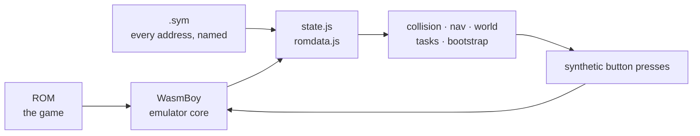

That loop is the whole program. Everything else is detail about how each box
answers its question.

<details>
<summary><b>Advanced detail:</b> why this and not screen-scraping</summary>

Reading pixels would mean OCR on a 160×144 screen, and it could not answer the
questions that actually matter — *what species is this*, *what is behind that
wall*, *which tile is a doorway*. Those are not on screen at all.

The cost is a hard dependency on a `.sym` from the same build as the ROM.
`Symbols.require()` fails at load rather than mid-task if a name is missing, so
a mismatched pair is a sentence on the loader instead of a mystery three minutes
into a grind.

The desktop sibling ([crystal-pilot](https://github.com/minormending/crystal-pilot))
does the same thing with PyBoy, and additionally sets **CPU hooks** — the game
tells it when the battle menu opens. No browser core offers breakpoints, so
everything here is polled instead. That single difference is the source of most
of the subtleties in sections 6 and 7.

</details>

---

## 2. The shape of it

<!-- covers-api: app/main.js app/bootstrap.js app/tasks.js app/nav.js app/world.js app/collision.js app/state.js app/romdata.js app/symbols.js app/gb.js @ 409418ac980b -->

Twenty modules. Arrows point from a module to the ones it imports.

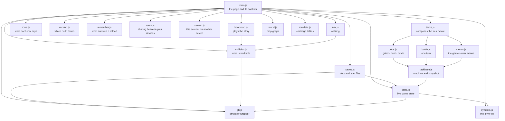

| Module | Answers |
| --- | --- |
| `gb.js` | "run some frames", "read memory", "hold this button" |
| `symbols.js` | "where does `wPartyCount` live?" |
| `state.js` | "what is happening right now?" |
| `romdata.js` | "what is species 155 called?" |
| `collision.js` | "can I stand there, and how do I get there?" |
| `nav.js` | "walk to this tile" |
| `world.js` | "which map is west of here?" |
| `tasks.js` | composes the four below into one `Tasks` |
| `taskbase.js` | "give me a snapshot", "settle down", "where is the cursor?" |
| `menus.js` | "open START and save", "answer the intro" |
| `battle.js` | "choose a move", "throw a ball", "what happened?" |
| `jobs.js` | "grind to level 12", "catch a Sentret" |
| `bootstrap.js` | "start a new game", "fetch Poké Balls" |
| `saves.js` | "keep this in slot 2", "put that .sav into the cartridge" |
| `rows.js` | "why is that button greyed out?" |
| `version.js` | "which build am I running?" |
| `remember.js` | "what did they choose last time?" |
| `room.js` | "what has my other device chosen?" |
| `stream.js` | "can I watch, and play, from the other one?" |
| `main.js` | everything the person holding the phone touches |

The dependency direction is the design: **nothing below `tasks.js` knows what a
task is, and nothing below `bootstrap.js` knows the name of a single map.**

<details>
<summary><b>Advanced detail:</b> the one boundary worth defending</summary>

`tasks.js` deliberately does **not** know where a Pokémon Center is, where grass
is, or how to get anywhere. That knowledge lives in `bootstrap.js`, which owns
the map constants.

The seam is a set of callbacks passed into the task options:

```js
tasks.grind(0, target, {
  heal:    () => boot.healUp(),
  regrass: () => boot.backToGrass(),
});
```

This is not decoration. Both hooks were added after real failures: a grind that
could not heal trained a Pokémon to death, and a grind whose pacing wandered off
the grass starved five battles in while standing on a route covered in it. Both
needed map knowledge that `tasks.js` should not have, and passing a function in
was cheaper than moving the boundary.

</details>

---

## 3. The layers, bottom up

### `gb.js` — the emulator

<!-- covers: app/gb.js @ 8a62b88ab9c9 -->

Wraps WasmBoy. Runs frames, reads work RAM, holds and releases buttons.

The important part of its interface is that **buttons are held, not tapped**:
`hold('LEFT')`, then `release('LEFT')`. Gen 2 turns you before it walks you, so
a short press in a new direction only turns you on the spot.

<details>
<summary><b>Advanced detail:</b> what this core will and will not do</summary>

**`_getWasmMemorySection` returns a copy, not a live view.** You cannot write to
it and have the game notice. That is why nothing here injects items or party
members — everything is earned by pressing buttons, including the five Poké Balls
in section 8. Measured rather than assumed: two calls for the same range return
different objects with different buffers, the core exposes no writer at all, and
writing through the copy resolves without error and changes nothing.

**Save states can be taken here and cannot be put back, so the two methods
offering them were removed.** The precise reason took two tries to get right,
and the first answer was wrong in a way worth recording.

What the code shipped with looked broken outright: `saveState()` resolved with
`{wasmboyMemory, date, isAuto}` whose four memory fields were all `undefined` —
the right shape holding nothing — and `loadState()` threw on it. Neither was
called from anywhere, which is the only reason it went unnoticed.

The `undefined` fields were not the real story. They come from the library's
memory module, which this app never initialises because it steps frames itself
and never calls `play()`. Call `play()` once and `saveState()` returns
everything populated — cartridge RAM 32768, Game Boy memory 65536, internal
state 1024, palette 128 — and persists it, so `getSaveStates()` lists them back.

`loadState()` is the half that genuinely does not work. It rejects with
`undefined` on states the library created itself, fetched from its own
IndexedDB, handed to its own API with every buffer the right length. That is
what makes a state useless here, not the copy semantics above: a snapshot you
can never return to is not a save state. Slots hold battery saves instead — see
[section 7c](#7c-slots-undo-and-bringing-a-save-in).

**The battery save is the one that *can* work**, because it only needs reading.
`batterySave()` used to return `this.core.getSavedMemory()`, which is
`[{saveStates}]` — the record WasmBoy persists to IndexedDB, not save data, and
not writable to a file. It now locates `CARTRIDGE_RAM_LOCATION` the same way
`start()` locates work RAM and returns 32768 bytes, which is Crystal's battery
and the same size as the desktop's `.sav`. It reads all zeroes until the game
commits an in-game save; `saveGame` in [section 7b](#7b-saving-and-getting-the-save-out)
is what makes it hold one. Verified against real save data rather than only for
size: a battery this read produced was written to a file, opened in the desktop
pilot under PyBoy, and read back the same game — Route 29, `CYNDAQUIL Lv5
20/20` — and then imported back into this app, which loaded it.

**A full snapshot costs the same as reading eight bytes**, so polling loops do
not need trimming. Measured in the browser: `readWram()` 0.043 ms,
`readBytes(addr, 8)` 0.030 ms, a whole `snap()` including the decode 0.031 ms —
a battle turn at 120 polls is about 4 ms. The cost is the round trip to the
worker, not the payload, and the eight kilobytes ride along for nothing. Worth
writing down because the obvious optimisation is to read fewer bytes, and it
would buy nothing.

The comment above warns the core has been seen ignoring the range it was asked
for. Four probes at different moments all came back with exactly the 8192 bytes
requested, so that is not happening now — but the normalisation stays, because
one afternoon's probes are not evidence it never happens.

**Frames must be stepped differently when the page is hidden.** `_runNumberOfFrames`
awaits `pause()`, which needs an animation frame, and a hidden page does not get
them. So `run()` splits:

```js
async run(n = 1) {
  if (!document.hidden) { await this.core._runNumberOfFrames(n); return; }
  for (let i = 0; i < n; i++) await this.core._runWasmExport('executeFrame', []);
}
```

Reads are deliberately small. `readBytes(addr, len)` exists alongside
`readWram()` because a step polls coordinates every couple of frames, and
pulling a whole 8 KB snapshot that often costs more than the emulation it is
watching.

</details>

### `symbols.js` — where things live

<!-- covers: app/symbols.js @ 67ab125c0fa4 -->

Parses the `.sym` file into `name → { bank, addr }`. First definition wins;
later duplicates are aliases and locals.

### `state.js` — what the game is doing right now

<!-- covers: app/state.js @ 07c21b8020de -->

One snapshot, many answers: `inBattle`, `party`, `pos`, `onGrass`,
`worldLoaded`, `menu`, `balls`, and the enemy's HP.

<details>
<summary><b>Advanced detail:</b> the signals that are not what they look like</summary>

- **`worldLoaded` is `wMapStatus == 2`, not "is there a party".** The CONTINUE
  screen restores party and coordinates *before* the map exists, so waiting on
  party data starts pressing buttons while still in the menus.
- **`wMenuCursorY` reads 3 while idle in a field**, so it cannot be used alone to
  mean "a menu is open". `wWindowStackSize > 0` is the reliable signal, exposed
  as `windowOpen`.
- **`menuItems` and `menuTop` identify *which* menu is drawn** — see section 6,
  where confusing the pack for the battle menu cost five Poké Balls.
- **`wBalls` does not settle until a battle ends.** A Pokémon can already be
  caught while the bag still reads five. Never difference the bag mid-battle.

</details>

### `romdata.js` — what the cartridge knows

<!-- covers: app/romdata.js @ f218aefa92d9 -->

Species names, item names, wild-encounter tables, move power. All read out of
the ROM, not shipped as a copy, so they cannot drift from the build being driven.

<details>
<summary><b>Advanced detail:</b> table layouts, and the one that bites</summary>

- `PokemonNames` — fixed width 10, terminated by `$50`.
- `ItemNames` — **variable length**, packed, each ended by `@`. Reading at a
  fixed stride drifts one character further out per entry: `ULTRA BALL` came
  back as `LTRA BALL`, `GREAT BALL` as `AT BALL`. `itemName()` walks the
  terminators.
- `JohtoGrassWildMons` — per map: group, number, three rates, then **three
  blocks of seven** `(level, species)` pairs for morning, day and night.
  Time-of-day matters: Route 29 trades Pidgey and Sentret for Hoothoot after
  dark, and offering a species that cannot appear sends a hunt after something
  that was never there.
- `Moves` — 7 bytes each, **effect at offset 1, power at offset 2**.
  `isChipMove()` needs both. Status moves have power 0, which rules them out.
  But eleven moves lie about their power: Gen 2 computes their damage rather
  than scaling it, so it stores them at 0 or 1 — which puts Guillotine, Horn
  Drill and Fissure *ahead* of Tackle when ranking ascending. Asked for the
  weakest damaging move, the first version returned a one-hit KO. They are
  excluded by effect id (`38, 40, 87, 88, 89, 144`), read out of the cartridge's
  own move table rather than counted from the disassembly's `const_def` order.
  This is **not** the same as "fixed damage": `EFFECT_STATIC_DAMAGE` really does
  store its damage as its power, so Dragon Rage reads 40, takes 40, and ranks
  correctly.
- `0x54` is a one-byte ligature for `POKé`.

</details>

### `collision.js` — what you can walk on

<!-- covers: app/collision.js @ bcf56deca762 -->

Decodes the loaded map into "can I stand on this tile", and does breadth-first
pathfinding over the result. This is what turns walking from trial and error
into a plan.

<details>
<summary><b>Advanced detail:</b> the decode, and why one check is not enough</summary>

`wOverworldMapBlocks` holds the loaded map's blocks; each tileset's per-quadrant
collision values sit in ROM at `wTilesetCollisionAddress`. Indexing comes from
`GetBlockLocation` in `home/map.asm`:

```
stride   = wMapWidth + 6
index    = 1 + stride * (1 + ((y + oy) >> 1)) + ((x + ox) >> 1)
quadrant = ((y + oy) & 1) * 2 + ((x + ox) & 1)
```

`calibrate()` checks its own arithmetic by reproducing `wPlayerTileCollision`,
the collision of the tile the player is standing on. **That check is necessary
and not sufficient.** A wrong offset can reproduce that one byte by luck, most
easily where the value is a common one — measured on a doorway mid-transition,
the true offset did not match and a fallback did, so the whole map decoded
shifted and a route that existed looked walled off. It fails by producing a
*confident* map rather than an error.

So `Bootstrap.settled()` requires the answer to hold still: same offset, same
player tile, twice in a row, a few frames apart.

Two more things the map alone will not tell you:

- **Ledges are one-way.** A ledge tile can be stood on; it is *leaving* one in
  the hop direction that moves two tiles irreversibly. `pathTo` never includes a
  hop, so a planned route can always be walked back.
- **The map is terrain only.** NPCs read as open floor. `occupied()` reads
  `wMapObjects` — sixteen 16-byte entries, coordinates stored four higher than
  the map's own — and those tiles are *preferred against* rather than treated as
  walls, because an object hidden by its event flag still has an entry.

</details>

### `nav.js` — walking

<!-- covers: app/nav.js @ 9d1b6ede4f12 -->

`step()` takes one tile. `walkTo()` gets to a tile, re-planning every step.

### `world.js` — which map adjoins which

<!-- covers: app/world.js @ 5e2c55feb792 -->

The map graph, read out of the cartridge: edge connections *and* warps, so it can
route out of a building rather than only across a route.

<details>
<summary><b>Advanced detail:</b> lazily, because there is no map count in the ROM</summary>

Each map header points at a map-attributes block whose tail is a bitmask of
connected sides plus one 12-byte struct per connection naming the map beyond it.
Warps live in the map's event block: two filler bytes, a count, then five bytes
per warp — `y`, `x`, the destination warp index, and the group and number of the
map it leads to.

Nothing is loaded up front. The ROM carries no table of how many maps a group
holds — the disassembly knows that from constants the cartridge does not have —
so walking every map is impossible. It is also unnecessary: connections name
their neighbours, so expanding outward from wherever the player is reaches
everything walkable and nothing else.

Checked against `data/maps/attributes.asm`: Cherrygrove gives
`UP → Route 30, RIGHT → Route 29`; Route 31 gives `DOWN → Route 30, LEFT →
Violet`. Warps check out too — Mr. Pokémon's house at `(2,7)` and `(3,7)`,
Route 30's door to it at `(17,5)`.

</details>

---

## 4. Taking one step, and planning a walk

<!-- covers: app/nav.js app/collision.js @ 2e522063e501 -->

### One step

A step is **not** "press the button for N frames". Fixed-length presses go
wrong in both directions: too short and the press is spent turning, too long and
you take a second step into grass you did not plan for.

So `step()` holds the direction until the coordinate actually changes, then
stops — and then waits for the player to come to rest before reporting.

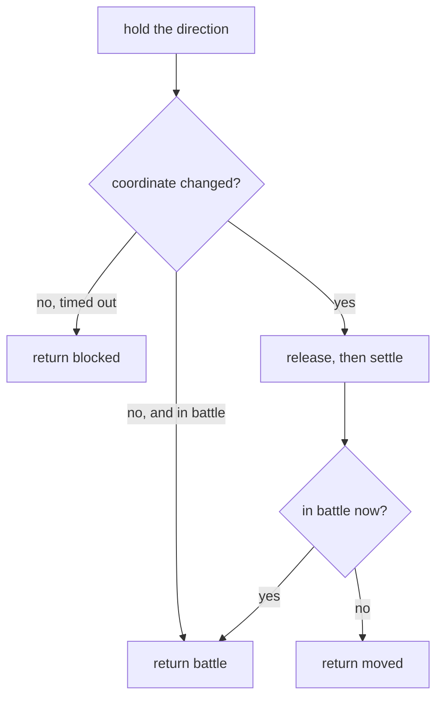

`blocked` is an answer, not a failure: it is how a plan discovers that something
the collision map cannot see — an NPC — is standing in the way.

<details>
<summary><b>Advanced detail:</b> why "settle" needs two things, not one</summary>

The coordinates change when the game **commits** to a step, not when it
finishes. Returning at that moment reports a tile the player has not reached,
and the next press lands mid-stride while the game still holds the previous
direction — so every step performed the one before it.

Waiting on the coordinate alone is still not enough. `restState()` watches the
coordinate *and* the camera (`wPlayerBGMapOffsetX/Y`), because the camera is
still sliding when the coordinate has already changed: measured, settling on the
coordinate alone returned with the camera six pixels short of rest. Anything
reading the screen at that moment — or working out which tile a tap meant — is
reading a world that is still moving.

At rest the camera offset is `48 - 16 * coord`. It slides during frames 11–22 of
a step while the coordinate changes at frame 23.

</details>

### Planning a walk

`walkTo()` re-plans from where the player actually is, **every step**. A path is
a plan and plans go stale; following one blindly means a single missed step puts
every later step in the wrong place while the walk still reports success.

The planning itself gives up one assumption at a time:

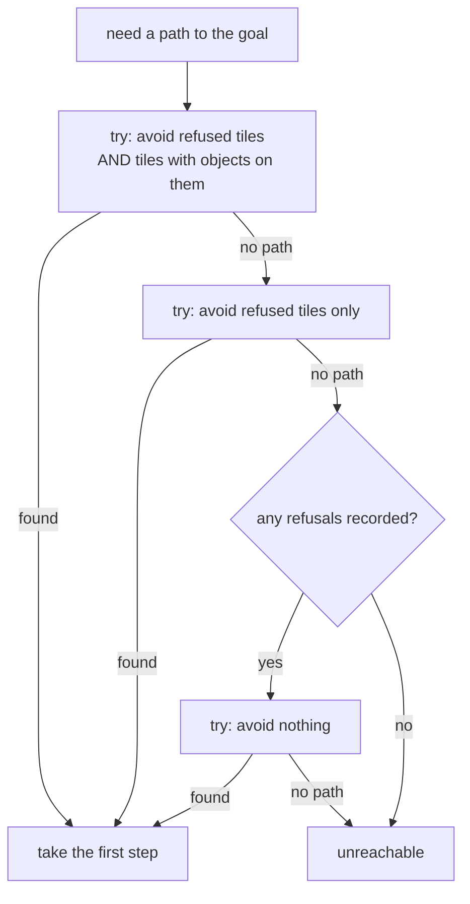

Being too careful and being too trusting fail in opposite directions, so it
tries both in order.

<details>
<summary><b>Advanced detail:</b> the bug that produced the third tier</summary>

Originally a tile that refused a step went into `avoid` **for good**. On Route
30 the only corridor north is one tile wide, so banning it made the goal
unreachable — and the walk gave up before the three-refusal counter could ever
notice it was the same obstacle twice. The log was unambiguous once instrumented:

```
path 6,26->6,0 avoid=0 = 36 steps
step LEFT -> blocked @6,26
path 6,26->6,0 avoid=1 = NULL          <- one refusal sealed the route
```

Dropping the object list second is the right order because that list is what the
map *placed*, not what is really there: an object hidden by its event flag still
has an entry, so treating those as walls seals corridors that are open.

`walkTo` returns `stopped` as one of `null | battle | unreachable | refused |
decode | cancelled | stuck | warped`. `warped` matters: a goal is a tile on one
particular map, and stepping onto a doorway changes the map underneath, at which
point those coordinates mean somewhere else entirely.

</details>

---

## 5. Crossing to the next map

<!-- covers: app/bootstrap.js app/world.js @ 2ecf6f282297 -->

A connection spans only part of a shared edge, so "walk west until something
happens" does not work. `crossEdge()` closes the distance in stages, then tries
the openings.

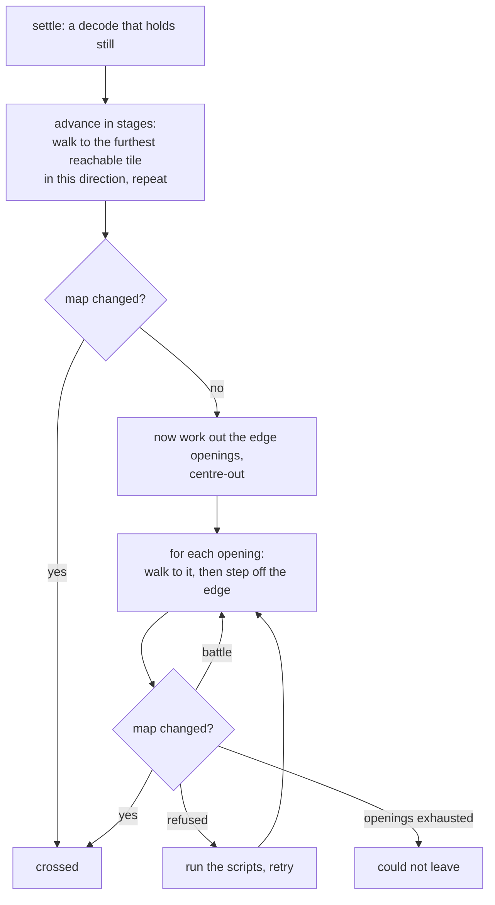

Three things in that diagram were each a separate bug.

<details>
<summary><b>Advanced detail:</b> all three, in the order they were found</summary>

**1. Openings are found centre-out, and filtered before sorting.** Sorting the
whole edge and taking the nearest few tried eight walls in a row: New Bark's west
side only opens at rows 8, 9, 12 and 13, and the player leaves the lab at row 3,
so every candidate near them is fence. Centre-out because a route's connection
sits inland of its corners.

**2. The staged advance exists because a route is longer than one plan.** Route
30 is fifty-four tiles top to bottom and fenced with ledges, so the opening at
the far end is not reachable in one plan from the near end. `furthestToward()`
BFSes from the player and returns the reachable tile furthest in the wanted
direction; the crossing walks there and asks again.

**3. The openings are computed *after* the advance, not before.** This was the
real cause of what looked like flakiness. Coming through a door, the decode has
not settled — and an edge measured then belongs to whatever map was still
loaded. Two failing crossings were caught in a log, both starting on a doorway
(Mr. Pokémon's, and the Pokémon Center), both spending every attempt walking at
tiles that had never been openings. With the settle and the re-measure, six
crossings in a row cross first time.

**Warp carpets are directional.** Most warps fire the moment you step on them.
Carpets do not: `CheckDirectionalWarp` wants the way the carpet points — `0x70`
DOWN, `0x76` LEFT, `0x78` UP, `0x7e` RIGHT. Standing on one and pressing
anything else simply walks you off it, which is what made the front door of the
player's house look like a wall that could be reached but never opened.
`CollisionMap.pushFor()` returns the required direction.

</details>

### Travelling further than one map

`travelTo()` asks the graph for a route and walks one leg at a time, re-asking
from the map it actually landed on. A leg that fails is retried up to three
times — measured, the same leg failed on one run and worked on the next, so one
refusal is not an answer.

---

## 5a. How the tasks are arranged

`tasks.js` used to be one class: 1335 lines, thirty-seven methods, five
unrelated jobs. It is now four files and a line of composition.

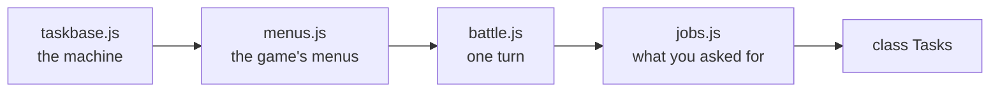

Split by what a method is *about*, not by size. `taskbase.js` talks to the
emulator — the snapshot, the settle, the cursor read. `menus.js` drives menus
the game already had: the intro, START, saving. `battle.js` is one turn:
choosing an action, a move, a ball, and reading what happened. `jobs.js` is the
handful of things a person actually asks for, and is the only file the interface
calls into.

<details>
<summary><b>Advanced detail:</b> why mixins, and what the split had to preserve</summary>

**They are mixins rather than collaborators** — `withJobs(withBattle(withMenus(
TaskBase)))` — because `this` has to keep meaning the same object. Every method
here reaches for `this.gb`, `this.snap()`, `this.say()`; splitting into objects
that hold each other would have meant several hundred lines of delegation whose
only purpose is to look like a refactor. The prototype chain reads
`Tasks → WithJobs → WithBattle → WithMenus → TaskBase`, and each class is named
so a stack trace says which one a frame came from.

**Nothing was retyped.** The methods were moved by extracting their exact line
ranges, comments included, so the diff is a move rather than a rewrite. The
public surface was then compared before and after: nothing lost, two helpers
gained.

**The safety net came first.** This split landed the commit after the tests did,
and that order was the point — nineteen tests and eight static checks make a
mechanical move of 1300 lines something you can verify rather than hope about.
The service worker's shell check caught the four new files immediately, which is
exactly the kind of thing a move like this forgets.

**Stop unwinds rather than being polled for.** Every loop that drives the
machine goes through `step()` or `push()` on the base, and those throw
`Cancelled` if Stop has been pressed — before advancing and after. That makes
cancellation one decision instead of seventeen: the loops used to check
`this.cancelled` only in the outer jobs, so a Stop pressed during `awaitQuiet`
did nothing for 250 polls. Measured in the browser afterwards: it now unwinds in
0.9 ms. Jobs still handle the tidy case themselves and return their own message;
`runTask` catches the sentinel for the case where it interrupts a primitive, and
reports it as a stop rather than as a failure.

**One table says what a capture outcome means.** `captureHere` reports a code
and two callers translated it — a switch in `catchHere`, an if-chain in
`catch_` — which had drifted to eleven cases against six. `CAPTURE_OUTCOMES`
holds the message and a `stop` flag, that flag being the only thing the two
callers legitimately disagree about: a knockout ends a single catch and is bad
luck to a hunt that can go and find another.

**`menuCursor()` is the one behaviour change.** The two-line incantation for
reading the menu window appeared five times in the save-driving code; it is one
method on the base now. That is a read of a handful of bytes rather than the
eight kilobytes a full snapshot copies, which is worth keeping distinct.

</details>

## 6. Battles

<!-- covers: app/tasks.js app/taskbase.js app/battle.js app/jobs.js app/state.js @ 62990af890a8 -->

### Is it our turn?

Everything in a battle depends on knowing when the game is waiting for a
choice. Getting this wrong is the single most expensive mistake in this
codebase, so it is worth understanding exactly.

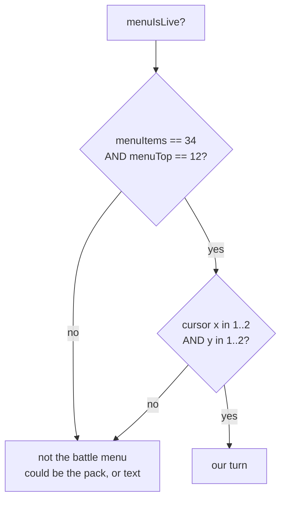

<details>
<summary><b>Advanced detail:</b> the two wrong versions, and what each cost</summary>

**Version one required `wBattleMenuCursorPosition == 0`.** That register holds
the action *last chosen*, not whether the menu is waiting: it is 0 until the
first choice of a battle and keeps that choice afterwards. So the test matched
only the opening turn and was false for every turn after. Measured at a menu
plainly live and taking input, it read 3.

That one line broke four things at once: `awaitBattleMenu` spent 150 presses and
returned null, `flee` could not tell a refusal from an escape, `fightBattle`
could not see its turn come round, and `watchThrow` could not see a Pokémon
break free. The 150-press ceiling had been raised from 40 to paper over it.

**Version two used the cursor alone.** But the pack parks the cursor at `(1,1)`
too — so a ball in mid-air read as a fresh menu, and the throw was abandoned
while the game was still saying "used the POKé BALL". That is how a single catch
attempt could burn five balls and catch nothing.

Which menu is *drawn* settles it. Measured:

| state | `wMenuDataItems` | `wMenuBorderTopCoord` |
| --- | --- | --- |
| battle menu | 34 | 12 |
| pack | 5 | 1 |
| pack, mid-throw | 2 | 0 |
| post-catch text | 2 | 7 |

The move menu shares the battle menu's box, and that is fine — both mean the
game is waiting on us.

</details>

### Playing out a battle

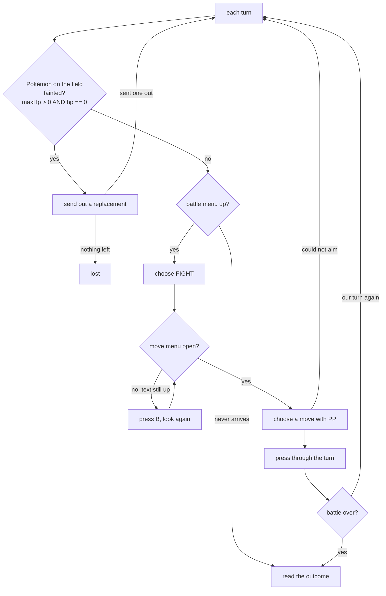

<details>
<summary><b>Advanced detail:</b> four traps in that one flow</summary>

**"Not in battle any more" is not "won".** Whiting out ends the battle too, and
reading that as a win let a grind report five straight victories with the party
at 0 HP, then wake up in bed wondering why the map had changed. `_outcome()`
checks whether every party member is at 0 HP.

**A move with no PP is chosen forever.** The move menu does not open while a
message is up, and the cursor reads 0 then — so move selection was skipped and
the A-mashing fallback picked the first move, the one with no PP, producing the
same message. **Eighty-four "battles" in one grind were that single refusal
going round.** `chooseMove` now confirms only when the cursor really is on the
move it meant, and `fightBattle` presses B and looks again rather than pressing
A into a message.

**Out of PP is a reason to heal**, not to fight on: the game forces Struggle,
which hurts the thing being trained, and a Pokémon Center restores PP.

**A fainted lead is a prompt, not a state.** Gen 2 does not offer a choice — the
lead goes down, the game asks "Which POKéMON?" and waits. With a party of one it
never came up because the battle simply ended. Three separate things had to be
right:

- *"No HP" and "no Pokémon loaded yet" read identically.* At "Wild PIDGEY
  appeared!" the battle mon is not loaded and both `hp` and `maxHp` are zero, so
  keying off `hp` alone fired at the start of every battle — five stuck battles
  in four tenths of a second, having sent nothing out.
- *That screen's cursor is not in memory anywhere findable.* `wMenuCursorY`
  stays pinned at 1 on it, `wPartyMenuCursor` and `wCurPartyMon` never move, and
  diffing all 8 KB of work RAM across a press turns up 87 changed bytes with no
  index among them — the arrow is drawn from sprite data. So `sendOut()` does
  not read the cursor: it steps down to the slot it wants, confirms, and checks
  whether something is actually on the field. Which is the better test anyway,
  because choosing a fainted Pokémon is *refused* with "There's no will to
  battle!" and no cursor reading would have predicted that.
- *The screen ignores the presses the battle menu takes.* At five frames every
  direction was swallowed, so every confirm landed on the fainted lead. It wants
  about twelve frames **and** a pause between presses — the prompt arrives with
  "CYNDAQUIL fainted!" still running and a direction sent into that is dropped.

**You cannot run from a trainer.** `wBattleMode` is 1 for wild and 2 for
trainer. `escapeBattle()` fights trainers and flees wild ones — a pilot that
only knew how to flee stood in the rival battle losing HP until something
fainted.

</details>

---

## 7. Catching something

<!-- covers: app/tasks.js app/jobs.js app/battle.js app/romdata.js @ 02003213a83a -->

Catching is the most involved loop, because a Poké Ball's odds turn on how much
HP is left. Throwing at a full-health target is mostly throwing balls away.

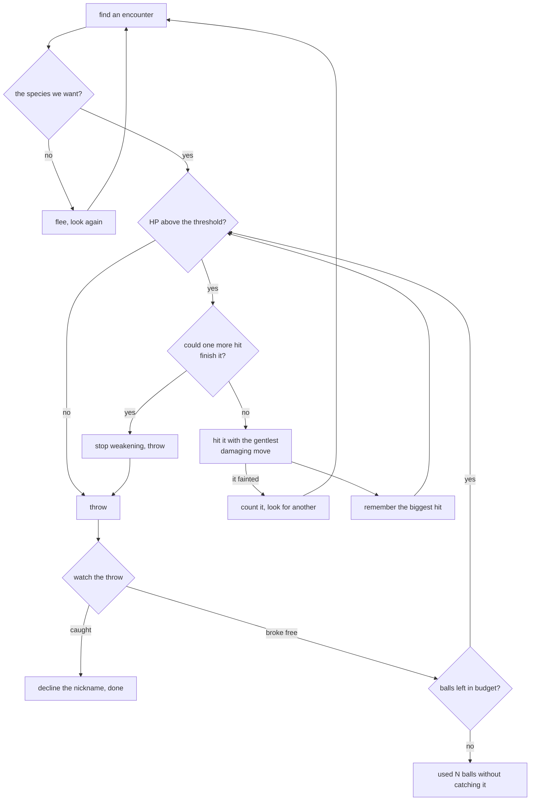

<details>
<summary><b>Advanced detail:</b> the learning, and why it is not per-encounter</summary>

**The gentlest attack, not the first one.** That is why `romdata` reads the move
table at all — leading with whatever is in slot one knocks out the thing being
caught, and a fainted Pokémon cannot be caught by anything. "Gentlest" cannot be
read off the power byte alone, though: see [the move table](#romdatajs--what-the-cartridge-knows) for
the eleven moves that store 0 or 1 while taking half the bar, your level in HP,
or all of it. The memory below cannot cover for that one — it learns from the
swing it just took, so opening with Guillotine teaches it the maximum and costs
the target to do it.

**The threshold alone is not a safe stopping point.** Against a Lv2 Rattata one
swing carries it from above the line to zero. So the pilot remembers the biggest
hit it has landed and refuses to swing when the target's HP is already inside
that range.

**That memory lives outside the per-encounter scope on purpose.** The one swing
that cannot be guarded is the *first* one, so a knockout is itself a
measurement: it tells the pilot its own damage, and every target afterwards
whose HP is already inside that range gets thrown at rather than hit. Measured —
the first version knocked out a Lv2 Rattata; hoisting the value fixed it, and
the following run caught four out of four with no knockouts.

Weakening spends no ball, so it is bounded at eight swings, or a move that kept
missing would loop for good with the ball budget never moving.

**A knockout usually arrives as `ended`, not as `fainted`.** `chip()` checks
whether it is still in a battle before it reads the enemy's HP, because it has
to — the enemy struct reads zero once the battle is over, so trusting that zero
would call every finished battle a knockout. The consequence is that a knockout
which beats the poll comes back as `ended`, and treating that as "work out what
happened later" reports it as a spent ball budget: the wrong reason, and the
guard learns nothing from the one measurement worth having. What tells the two
apart is our *own* party, which still answers after the battle ends — lead still
standing means the target went down, lead at zero means we did. The desktop
pilot had the same bug and reported seven kills as "got away" before a live hunt
caught it.

**Throws are counted as throws, not as bag deltas.** `wBalls` only settles when
the battle ends, so an interim attempt to detect throws that never happened by
comparing ball counts was built on a false premise and had to come back out.
With throws counted directly, every round's count matches the bag delta exactly:
`thrown=1 bag 5→4`, `thrown=2 bag 4→2`.

**A chip that ends badly can leave the move menu open**, and `menuIsLive` cannot
tell that from the battle menu — they share the same box. The pack was then
opened from inside the move list and the throw could not find a ball, so
weakening backs out before it throws.

**The nickname prompt is answered *no*.** The "do you want this one?" box that
precedes it defaults to yes, which is what we want; the nickname box does not.

</details>

---

## 7a. Three that act on where you already are

<!-- covers: app/tasks.js app/jobs.js app/menus.js app/bootstrap.js @ 70fdc2a5193d -->

Grind, hunt and catch all go *looking* for something. These three do the obvious
thing with the situation you are already in, and take no parameters:

| Command | Does | Refuses when |
| --- | --- | --- |
| **Battle** | plays out the battle you are in, wild or trainer | you are not in one |
| **Catch this one** | weakens and throws at the wild Pokémon in front of you | not in a battle · it is a trainer's · party full · no balls |
| **Heal** | goes to the nearer heal place and comes back | you are in a battle · nothing is hurt |

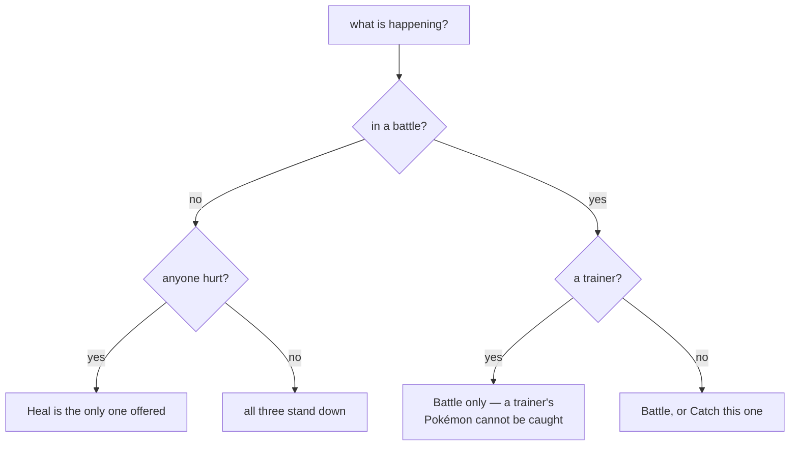

Each row in the interface says which of those it is, so the reason a thing is
unavailable is on screen rather than discovered by pressing it.

<details>
<summary><b>Advanced detail:</b> what was extracted, and what was not</summary>

**`captureHere` is the battle-facing half of `catch_`**, split out because it is
now also a command. `catch_` finds the species and delegates per encounter; the
standalone version skips the finding.

The split matters for one thing in particular: `catch_` passes a shared
`memory` object holding the biggest hit landed so far, because when hunting, the
one swing that cannot be guarded is the *first* one — a knockout is itself a
measurement that every later target benefits from. Called on its own there is no
earlier encounter to learn from, so it starts cold. That is correct rather than
a limitation, but it does mean a single `Catch this one` on a very low-level
target can still knock it out where a hunt would not.

**`battleHere` is a guard and a report around `fightBattle`**, not new battle
logic. Everything in [section 6](#6-battles) applies — the fainted-lead prompt,
trainers being unfleeable, PP exhaustion — because it is the same engine.

**`healNow` likewise wraps `healUp`**, which already chooses between Elm's
computer and the Pokémon Center by distance. It refuses in a battle rather than
pressing buttons hopefully, and reports "already at full health" as a success
rather than an error, because nothing needed doing.

**Two constants moved to `state.js` while doing this.** `TRAINER_BATTLE` and
`MAX_PARTY` were each defined in more than one module — a magic `2` and a magic
`6` stated in three places between them. `state.js` is the module whose job is
interpreting memory values, so they live there now and the others import them.
This surfaced as a plain `ReferenceError` the first time `captureHere` ran,
which is worth knowing: the syntax check in `tools/check-app` parses every
module but cannot see an undefined reference. That class of bug only shows up by
running the thing.

</details>

## 7b. Saving, and getting the save out

<!-- covers: app/tasks.js app/taskbase.js app/battle.js app/jobs.js app/state.js @ 62990af890a8 -->

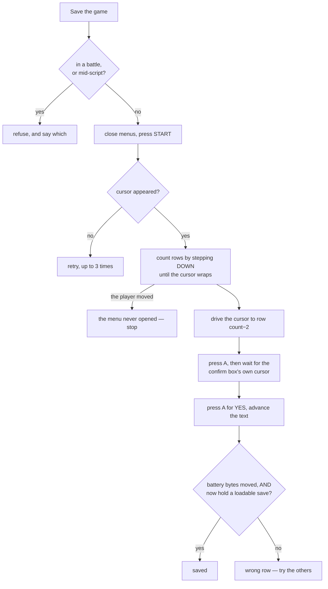

Saving is driven through the real menu rather than by writing SRAM. It could not
be done any other way here — this core is readable but not writable — and it
should not be anyway: Crystal validates a save with two check bytes and a
checksum it computes as it writes, so a save the game did not make itself is a
save the game does not trust.

`Download .sav` then hands the battery over as a file, which is how a phone
session leaves the tab.

<details>
<summary><b>Advanced detail:</b> why the evidence is the bytes</summary>

**The row is counted, not remembered.** The START menu grows as the game goes on
— no POKéDEX or POKéGEAR at the start — so a fixed row number lands on OPTION
once they appear. Rows are counted by stepping DOWN until the cursor repeats,
and SAVE is `count - 2`, because the last three are always SAVE, OPTION, EXIT.
If the first guess opens the pack instead, the others are tried.

**Counting rows is also how it notices the menu never opened.** If those DOWN
presses are reaching the world rather than a menu, the player walks — which in
grass starts a wild battle and makes saving impossible. So the position is
checked after each press, and a move means stop.

**Success is the battery changing, not the presses landing.** The desktop pilot
watches its `SaveGameData` hook fire; there are no hooks in a browser. So this
reads 32KB of cartridge RAM before and after and requires two things: that the
bytes moved, and that what they now hold is a save the cartridge would load.
Either test alone is too weak — the first accepts a half-written battery, the
second accepts a save that was already there while this attempt did nothing.

**"Is there a save?" is Crystal's own test**, from `engine/menus/save.asm`:
`sCheckValue1 == 99 && sCheckValue2 == 127`. `GameState.saveIsPresent` resolves
both out of the symbol file — an SRAM symbol carries a bank, so the offset into
the flat 32KB is `bank * 0x2000 + (addr - 0xA000)`.

Counting non-zero bytes does **not** work, and it was the first thing written: a
battery never saved to still reads five non-zero bytes, so "any non-zero byte
means there is a save" calls a blank cartridge saved. It made a genuine first
save report itself as a repeat, and it would have let `Download .sav` hand over
a file every emulator opens as "no save file".

**The button names are checked statically now.** The first version of this
driver used `press('Start')` and `press('Down')`. Every other call site in the
app is uppercase, and the core ignores a key it does not recognise — so the
press ran, took its frames and did nothing, and the failure surfaced as "could
not get the game to save", which points at the menu rather than at the presses.
`tools/check-app buttons` now rejects any name outside the eight the core knows,
checked against the on-screen pad's own `data-btn` values.

**Verified across both halves of the project.** The app played a new game to
Route 29 with a Lv5 Cyndaquil, saved, and those 32768 bytes were loaded in the
desktop pilot under PyBoy — which read back Route 29, `CYNDAQUIL Lv5 20/20`,
Tackle and Leer. Two emulators, two implementations, one save file.

</details>

## 7c. Slots, undo, and bringing a save in

<!-- covers: app/saves.js @ 4d332255b465 -->

Three slots a person picks, plus one the pilot writes before every job. A slot
holds a **battery save** — the 32KB the cartridge writes — and not a machine
state, and everything odd about how slots behave follows from that.

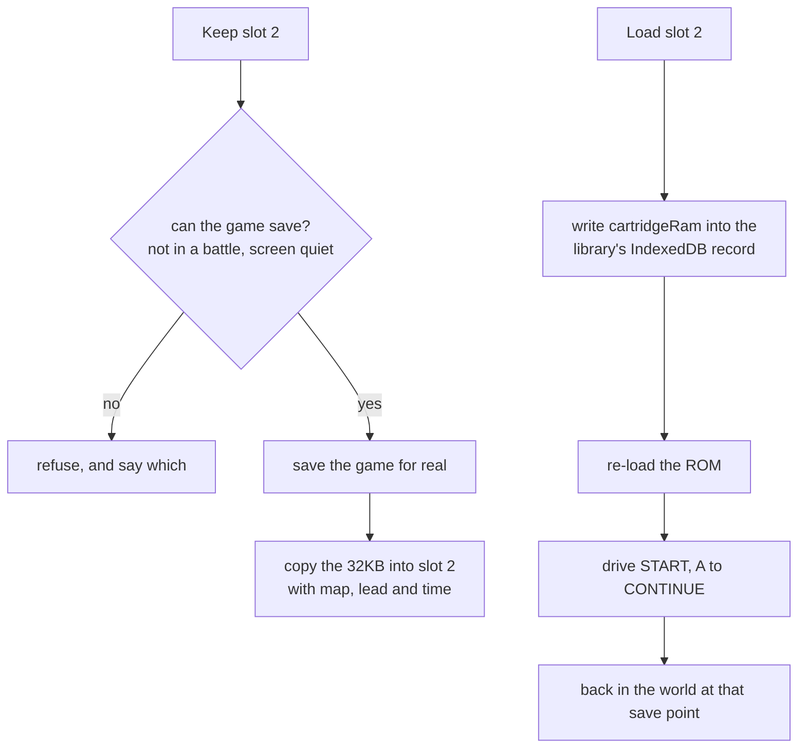

**Why not machine states.** WasmBoy will capture one — after a `play()` its
`saveState()` returns all four memory regions populated, and it even persists
them — but it will not put one back. `loadState()` rejects with `undefined`,
measured on states the library created itself, fetched from its own IndexedDB
and handed to its own API with every buffer the right length. A snapshot you
can never return to is no use as a slot. The desktop pilot has real states,
which is why *its* slots can be taken mid-battle and these cannot.

**What that costs, plainly:** keeping a slot saves your game, loading one puts
you at that save point rather than an exact moment, and a job that runs *inside*
a battle — Battle, Catch this one — cannot have an undo point at all. The rows
say so instead of offering an undo that would do something else.

<details>
<summary><b>Advanced detail:</b> writing a battery, and the traps around it</summary>

**Writing the battery is the one piece of cleverness.** The core is readable and
not writable, so the bytes cannot simply be poked in. The library keeps a
per-cartridge record in IndexedDB and calls `loadCartridgeRam` when a ROM loads,
which pushes that record's `cartridgeRam` into the core. So installing a save
means writing that record and re-loading the ROM — which is also why loading a
slot leaves you at the title screen, and why `continueFromTitle` drives CONTINUE
for you.

**The record is addressed by the key the library already used**, and only
derived from `_getCartridgeInfo().header` when there is none. Both work; they
are not equally well evidenced. Writing under an existing key is the path that
was watched loading a real save back into a real game; the derivation is
reasoning about how the library builds its key. The proven one is primary and
the other covers first visits.

**That record belongs to the library, so it is opened with no version and no
upgrade callback.** Naming a version means a `VersionError` the day the library
bumps its own, and an upgrade callback would have us inventing its schema —
creating a database it then finds already there and wrong. Our own database is
the only one we version.

**`install` refuses on a hidden page.** Re-loading the ROM goes through the
library's `pause()`, which awaits an animation frame, and a hidden page is given
none — so the call never returns. `run()` already branches on this for frame
stepping and there is no equivalent escape here, so it refuses with a reason
rather than hanging. A person pressing Load is looking at the page; the check
only bites a backgrounded tab.

**A refused undo does not spend the undo point.** Whatever the reason — hidden
page, empty slot — the point stays where it was, so the next attempt still has
somewhere to go back to.

**Losing an undo point is reported, not just logged.** `canSave` settling too
early once let a job run with nothing to go back to, and the reason scrolled out
of the three-line run log while the row still read "nothing to undo yet" — which
is what it says when no job has run at all. The row now distinguishes the two,
because that failure is only otherwise discovered by reaching for the undo.

</details>

## 8. The errands

<!-- covers: app/bootstrap.js @ 7ea837455a0e -->

### Starting a new game

Two presses, because the middle of it is not the pilot's decision.

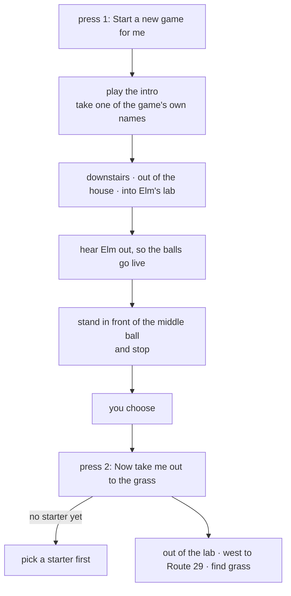

Which of the three you want is the one real decision in the opening, and a tool
that plays the boring parts should hand that back rather than answer it. The app
also tells you which ball is which, because the game does not — they are three
identical sprites and the name only appears once you are already talking to one.
Left to right: **Cyndaquil, Totodile, Chikorita** (`ElmsLab.asm`, x = 6, 7, 8).

### Where to heal

There are two places, and which is nearer flips depending on where you stand.

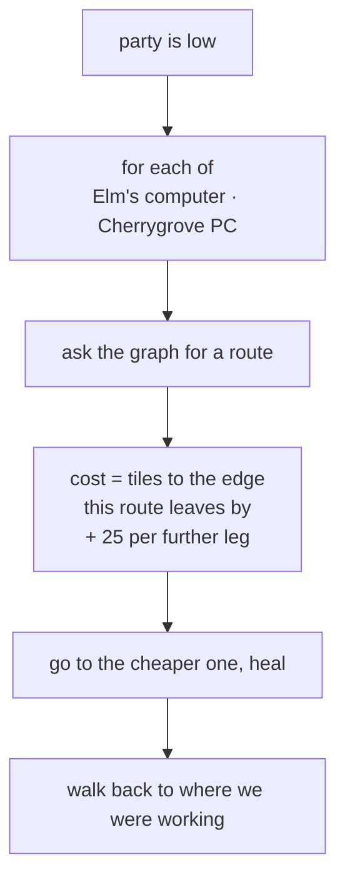

<details>
<summary><b>Advanced detail:</b> why leg-counting gets this wrong</summary>

Elm has a healing machine in his lab and it works from the moment you take a
starter — `bg_event 2, 1` in `ElmsLab.asm`, gated on
`EVENT_GOT_A_POKEMON_FROM_ELM`, a yes/no and then `special HealParty`. No
Pokédex, no Pokémon Center, no fee.

Counting legs of the world graph picks wrong in the common case. By legs the
Center is one hop from Route 29 and the lab is two, so the Center wins
everywhere — but a hop west is the whole sixty-tile width of the route through
grass, while the lab from the eastern end, where the bootstrap leaves you, is six
tiles and a door.

Measured standing at x=53 of 60 on Route 29: the lab costs 31 against the
Center's 53, and healing a fainted party took 1.8 seconds. Below about x=25 the
answer swings back to Cherrygrove, which is the point of computing it.

**Healing has to come back.** It used to end standing in Cherrygrove, which has
no grass in it, so a grind that healed itself resumed in a town and stopped on
the next breath saying it could not find any wild Pokémon — with a full-health
party, one map away from the route it had been working.

</details>

### Getting Poké Balls

The game gates them deliberately, and the route round it is not the obvious one.

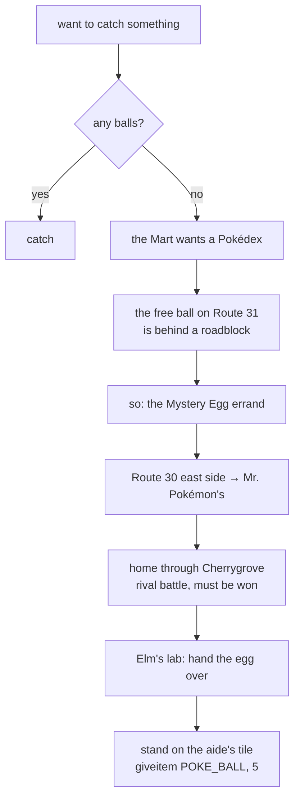

<details>
<summary><b>Advanced detail:</b> the roadblock, and why Route 31 is the long way</summary>

Route 30's one-tile corridor north is filled by Youngster Joey at `(5,26)` with
two Rattata sprites at `(5,24)` and `(5,25)`, all three conditional on
`EVENT_ROUTE_30_BATTLE` — which is **clear** on a new game, so the objects are
there until it gets set. It is a deliberate roadblock, and returning the Mystery
Egg is what lifts it.

Which makes Route 31 the long way round, because the same errand ends with
`giveitem POKE_BALL, 5` in Elm's lab, from a `coord_event` the player only has
to stand on. Mr. Pokémon's house is at Route 30 `(17,5)` — on the *east* side,
the half the roadblock does not touch.

The errand is idempotent: run it twice and it returns *already carrying 5
ball(s)* without moving. It used to walk the whole thing again and report
success without gaining a ball, because its success test was "are there balls in
the bag" rather than "did we gain any".

</details>

---

## 9. The interface

<!-- covers: app/main.js index.html @ 8d32514c0fb1 -->

The app does two jobs and used to look identical doing both: you play it by
hand, or you send the pilot off to work for ninety seconds.

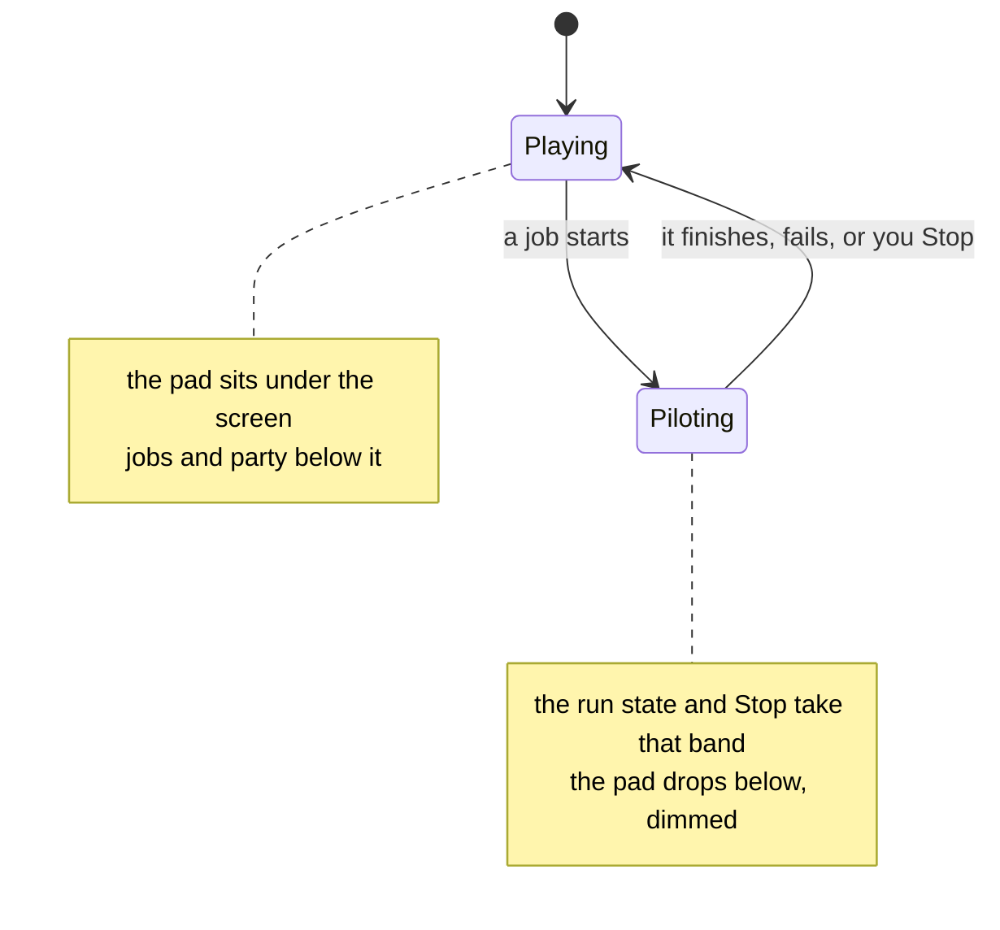

**The machine is furniture; only the middle moves.** `main` is a three-row grid
— the screen, a scrolling flow, the pad — sized in `dvh`, and the page itself
does not scroll at all. Before this the pad was a card among cards, so on a
short phone the buttons scrolled away from the screen they drive, and in
landscape the two could not both be on screen at any scroll position.

| | holds | scrolls |
| --- | --- | --- |
| `.stage` | the screen and the tap hint | never |
| `.flow` | status, the jobs, the save, the party, settings | yes, and only this |
| `.padwrap` | the eight buttons | never |

The switch that used to reorder the pad is gone with it: a task dims the pad
rather than moving it, because it no longer has anywhere to move and a thumb
should find it in the same place either way. Which card sits at the top of the
flow is still worth switching, and still is.

The pilot's jobs are a **list, not a toolbar**, because `runTask` opens with
`if (running) return null` — only one job can ever be underway, so they are one
mutually exclusive choice.

**What a row says is decided somewhere it can be tested.** `rows.js` takes the
game state and the handful of choices the person has made, and returns text and
an enabled flag for each row; `main.js` applies that to the DOM and nothing
more. Before the split it was one 89-line function with fifty-odd `textContent`
assignments interleaved with the reasoning, which is why none of the "why is
that greyed out?" logic had ever been tested.

Two rows used to set their `blocked` class by reading their own button's
`disabled` property back out of the DOM. That happened to work and meant the
class and the button could in principle disagree; both now come from one flag,
and the browser was checked to confirm they agree on every row.

**The running version sits in the header, with the app's name.** Everything
else in the app needs a game; this does not, and the question it answers — is
this the build I just deployed? — is asked most often when there is no ROM
loaded at all. It spent three versions in the settings card, which `maybeStart`
reveals, so reading it cost picking a 2MB ROM and a symbol file first. `check-app`
asserts the markup is inside `<header>` for that reason.

The header wraps rather than clips. Name, version, Update, location and speed
come to more than 375px once a game is running and a newer build exists, and
without `flex-wrap` the speed slider's `1×` was cut in half by the right edge.
Nothing wraps in the ordinary case; `.where` carries `min-width:0` so the
location is what gives first, being the one item that reads fine truncated.

Moving Update up there is why it now asks before it runs, but only when
`romBytes` is set. The question is built from what is true at the time rather
than written once: with the files kept the reload brings them and the last save
back, so the cost is the current moment; without them it is that plus two file
pickers. With nothing loaded it does not ask at all, because there is nothing
to lose and the prompt would only be in the way.

An earlier version of this said the battery survives a reload by itself. It
does not — see *What it remembers* below, which is also why it does now.

**Landscape takes the pad apart.** At 844 × 390 the old page ran to six screens
and the pad started at 575px, so the game and the buttons that drive it could
not both be seen at any scroll position — and stacking them the way portrait
does does not fit either: a 236px pad and a 43px header leave the screen 81px.
So under `max-height: 520px` the pad's own parts are lifted into the page grid
with `display: contents` and placed the way a handheld is held — D-pad left, A
and B right, screen between them, Select and Start beneath it, and the cards
in the width that is left.

```
"dpad screen face flow"   144px  332px  120px  208px
"dpad menus  face flow"
```

Keyed on height rather than `orientation`, because what breaks is a short
viewport: a tablet held sideways is landscape and has room to spare.

<details>
<summary><b>Advanced detail:</b> three cascade traps in one media query</summary>

Every one of these looked right in the file and was wrong in the browser, and
all three have the same shape: a media query does not add specificity, so a
later rule wins.

**The block sat above the `canvas` rules**, so the portrait `width: 100%` undid
the landscape override and the screen drew 2px wide. Moving it below fixed the
canvas and broke nothing — until the next one.

**`.gamepad { display: flex }` is defined at line 402**, forty lines below where
the block then sat, so `display: contents` never applied: the D-pad and the
face stayed inside a flex row and shared one column, while the column reserved
for the face sized itself to zero. The fix is not specificity but position —
override queries belong at the end of the sheet, which is where this one is
now.

**`display: contents` promotes every child**, heading included, and an unplaced
grid item auto-fills the first free cell. The word "Play" took the D-pad's cell
and pushed the screen into the wrong column. A card that is no longer a card
has no use for its label.

</details>

<details>
<summary><b>Advanced detail:</b> how the screen gives way, and two false starts</summary>

The screen is width-driven where there is room and capped where there is not —
and the cap is on its **width**, worked back through the aspect ratio from the
height going spare: `max-width: calc((100dvh - var(--reserve)) * 160 / 144)`.

Two other spellings were tried first and both are wrong in instructive ways.
Capping the *height* squashes the picture, because a canvas stretches its
contents to whatever box it is given rather than letterboxing inside it. And
`width: auto` with `max-width: 100%` is worse: a canvas's auto width is its own
`width` attribute, so a 375px phone got a 162px screen.

`--reserve` is what the screen must leave behind — header, pad, gaps, and about
95px of flow. It started at 420, where the arithmetic worked and the result did
not: a 375 × 667 phone was left with **36px** of scroller, too little to show
the status line, and the status line is where Stop lives. At 460 that phone
letterboxes the screen to 230 × 207 and keeps 76px of flow, which shows it.

The cap lives on `#screenwrap`, not on the canvas, and the canvas fills the
wrap. The tap marker is positioned in percentages of the wrap — a tile is 10%
across and 11.111% down — so the wrap has to *be* the canvas's box or the
marker lands where the tap did not, which is what letterboxing a canvas inside
a full-width wrap did. Shrink-wrapping the wrap instead collapses it to 162px,
because shrink-to-fit asks the canvas for its max-content width and a canvas
answers with its own `width` attribute. Taps were never affected: they measure
the canvas's own rect.

Measured after the change, with a game running: 375 × 667 does not scroll, the
screen letterboxes to 230 × 207 at ratio 1.111, the flow keeps 76px and the pad
ends at 657 of 667. 390 × 844 gets a full-width 366 × 329 screen and 131px of
flow. 844 × 390 gets a 317 × 285 screen between the thumbs, and nothing
scrolls where six screens used to.

</details>

<details>
<summary><b>Advanced detail:</b> the measurements, and one lifecycle rule</summary>

Measured on 375 × 812 with a game running, the page was **1537px** — 1.89
screens — with the emulator at the top and everything that starts or stops the
pilot at the bottom. There was no scroll position from which you could watch the
game and reach the thing that stops it. Both Stop buttons sat at 1181px and
1463px.

Header, screen, hint and the whole pad measure **596px**, so the Game Boy
arrangement fits above an 812px fold with 216px over — room the old layout spent
on a slider and a documentation link wedged between the screen and the buttons.

Afterwards: page 1424px, pad card 341px → 257px, and the screen, pad, status and
run log all above the fold. It got *shorter* while gaining a run log and three
job state lines, because the duplicate Stop, two prose footers and the stepper
all went.

Since then the save card has been added and the page is **2065px** — the card is
608px of it, which is what three slot rows, save, download, import and undo cost.
The number that mattered has not moved: measured with a game running, the screen
sits at 55px, the pad ends at 665px, status at 678px and the run log ends at
720px, so all four are still above an 812px fold and the card lives below them.
That was the point of the ordering rather than the total height — a page you
scroll to read is fine, a page you must scroll to *stop the pilot* is not.

(These were measured in a 437px-wide pane rather than at 375px, so treat them as
the current shape rather than a like-for-like comparison with the numbers above.
The fold claim holds either way: the deepest of the four is 720px.)

**`runTask` owns the whole lifecycle in a `finally`.** Before that, each handler
set `running`, disabled its button and cleared both at the end — which only
happened if nothing threw. One exception left the button disabled for good, the
status frozen mid-task with no error shown, and `running` stuck true so nothing
else would start either. The app was finished until a reload.

**Tap-to-walk deliberately does not switch modes.** It sets `running`, because
the idle loop must stand down and no job may start on top of it, but a walk
lasts a couple of seconds and reordering the page under a thumb that just tapped
it would cost more than the dimming is worth.

**The idle loop re-arms on every visibility change**, with a generation counter.
It used to re-arm only from inside its own animation-frame callback, and a frame
pending when a page is hidden never arrives — so the chain was lost, the loop
died on the first background, and the game stayed frozen ever after, including
back in the foreground. Measured: zero animation frames scheduled in three
seconds by a page whose loop was supposedly running.

</details>

### Colour

Two palettes, named by the job each colour does — `--action` for filled controls
that carry a label, `--accent` only where no text sits on it, `--mark` for where
you tapped, `--raise` for anything pressable. Dark is the base; light is a real
second palette, not an inversion. The control is three-state: auto, light, dark.

<details>
<summary><b>Advanced detail:</b> what the role split fixed</summary>

`--accent` used to mean six unrelated things: the primary action, a selected
species, a selected level, a held key, where you tapped, and something running.
When everything important is the same blue, blue signals nothing.

Four measurable failures went with it:

| | was | needed |
| --- | --- | --- |
| ordinary buttons filled with `--panel`, the card's own colour | 1.00:1 | a visible step |
| `#fff` on the accent — every Start button's label | 3.80:1 | 4.5 |
| the Stop label | 3.93:1 | 4.5 |
| Select / Start on a raised key | 4.41:1 | 4.5 |

The button fill is the instructive one: the stylesheet already carried the
comment *"a button the same colour as its container reads as a label"* and had
applied it only to the D-pad.

Three things do not flip between themes. A pressable cannot be *lighter* than a
white card, so on light the fill steps down and the border does more of the
work. The gamepad needs a bigger step than ordinary buttons because it is drawn
as one connected cross with no borders — the fill is all that separates it from
the card. And `--mark` is identical in both, because where you tapped sits on the
game's own picture, not on a surface of ours.

</details>

### What it remembers

<!-- covers: app/remember.js @ bcb5a774746b -->

The app forgets everything on a reload, and a reload is not rare: the Update
button causes one deliberately, and a phone discards a background tab whenever
it likes. Three choices survive it, in one JSON object under one localStorage
key — the speed step, which grind preset was tapped, and what was being hunted.

Two rules do all the work, and both come from the same place: what comes back
is a *suggestion*, written by an older build of this app on a phone whose owner
may have edited it by hand.

**It is checked against what this build can use, and dropped rather than
salvaged.** A remembered speed of 9 must not become `SPEEDS[9]`, which is
`undefined` — and the idle loop then steps the emulator `undefined` frames. A
grind preset the markup no longer offers has no nearest neighbour either: `+5`
and `Lv20` are different intentions, not different amounts of one. The valid
range comes from the markup and the `SPEEDS` table rather than being written
down twice, so a preset cannot outlive the button that offered it.

**Each group carries when it was chosen.** A fourth field, `at`, stamped on
every write — it is what lets one device's choices be ordered against another's,
and it survives a reload because a stamp invented at load time would make every
reload look like a fresh decision. An absent or nonsense stamp reads as `0`,
which loses to every real one: the record with nothing in it is the one that
must not win.

**What is stored is the choice, never what the choice worked out to.** `+2`
means two above the lead, so storing the `Lv12` it resolved to today would come
back tomorrow meaning something nobody chose. `pickTarget` resolves a spec, and
a tap and a restore both go through it.

The hunted species is restored only when it appears where you are standing at
this hour, and only when nothing is selected — so it restores a choice and
never overrides one. `refreshSpecies` already had the first half of that rule,
because a species you walked away from was being offered when it could not
appear.

Storage throws rather than returning null — private windows, cleared site data
— and in Node there is no `localStorage` binding at all, so reading it is a
`ReferenceError` and not something a `try` around the *value* would catch. One
accessor answers "nothing remembered" for all of it. The colour theme keeps its
own older key: moving it would cost a migration for people who have already
chosen and buy nothing.

**The ROM, the .sym and the battery are kept too, in IndexedDB.** 2MB and
1.8MB against a localStorage budget of about five, in strings, settles where.
Its own database settles the other question: `saves.js` opens `crystal-pilot`
at version 1 by name and number, so a second store in there would mean version
2 — and any tab still running the older module, which is exactly the staleness
the version display exists for, would then open a v2 database at v1, get a
`VersionError`, and take the save slots with it.

The battery is in there because it is what makes the rest worth having.
Measured, having believed the opposite: save the game, reload, and the save is
gone. WasmBoy's own `keyval` store held **zero records** after a save this app
had verified byte for byte — the library persists a cartridge only when
something asks it to. So the copy is taken when the app knows the bytes moved:
a save it drove, a `.sav` it installed, a slot it loaded, and immediately
before the Update button's reload.

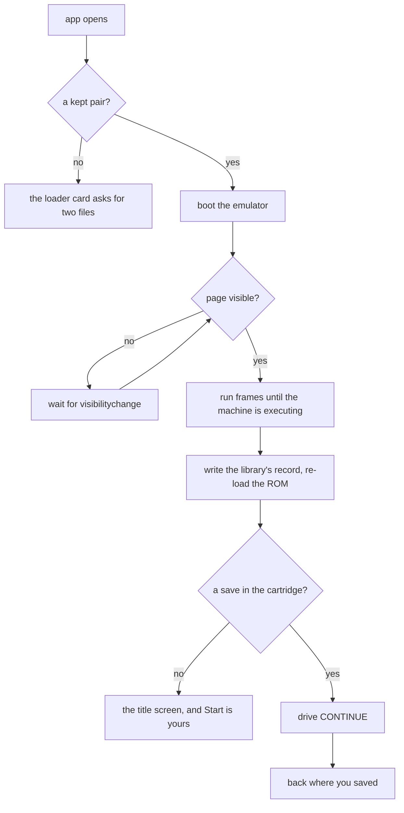

**Continuing is gated on that save existing, and on the session being a
restored one.** START-then-A is CONTINUE with a save in the cartridge and NEW
GAME without one, and NEW GAME lands in the NAME menu where the only thing an
auto-pilot can do is spell AAAAA — so the gate is what keeps "start a game"
the player's. The second half of it is subtler: a hand-picked session stays at
the title screen because that menu is the only route to NEW GAME, and driving
past it would leave nobody a way back. A kept game's route back is *Forget*.

The save is asked of the cartridge rather than of what this session installed,
because `loadCartridgeRam` pushes the library's record in on every load: a
restored session can arrive holding a game nothing in this session put there,
which is just as much a game to carry on from.

Both gates in that diagram were found by doing it. **The page has to be
visible**, because the re-load goes through the library's `pause()` and a
hidden page gets no animation frame — in a hidden pane the restore did nothing
while the settings row went on claiming the save was kept. **And the emulator
has to have started**: a second `loadROM` a moment after the first leaves the
core executing nothing, every work-RAM read zero, the app at a title screen it
cannot drive with a save it has just installed. `gb.awake()` runs frames until
work RAM is non-zero, which is the same all-zero read that gave the bug away.
Neither gate was needed by the `.sav` or slot paths, because by the time a
person presses either, the emulator has been running for a while.

*Forget* deletes all three and asks first, because the kept battery can be the
only copy of a game — no slot taken, no `.sav` downloaded. The slots are in the
other database and are untouched, which the question says: "forget my files"
must not read as "wipe everything".

### Sharing between your own devices

<!-- covers: app/room.js sync/kidsync.js @ 1820c8c3a96e -->

One person with a phone and a tablet, no accounts: a room code is the whole
mechanism. `sync/` is [kidsync](https://github.com/minormending/kidsync)
vendored — a room is one key in a Firebase Realtime Database, every device
holding the code reads and writes it, and the code is the password. That shape
is right for your own devices and wrong for anyone else's, so the code lives in
your pocket and never in this repo.

What travels today is the three remembered options, and that is on purpose:
this is the small half, standing up the whole path — config, rules, anonymous
sign-in, merge, debounce — with a slider position at stake rather than a save.

**Nothing here may be able to break the app.** kidsync imports the Firebase SDK
from `gstatic` at the top of its module, so importing it statically would put a
cross-origin fetch in the middle of this app's module graph: offline that
import fails, and everything downstream of it fails with it — which is the
whole app, in an app whose service worker exists so it runs with no signal. So
`room.js` loads it with a dynamic `import()` inside a `try`, and only when
someone asks to share. kidsync's other consumers get this for free from
`bridge.js`, which is a separate entry point after their classic scripts have
run; an ES-module app has to insulate itself.

**Opening the room is what reaches the network**, and it happens on a press or
because this device has shared before. Someone who never shares never loads the
SDK and never signs in.

**Options are a settings group, not progress.** kidsync's grow-only merge is
for stars and unlocks; every one of these three can be *changed back*, and a
`Math.max` over a speed step would make the fastest speed either device ever
chose the one neither can leave. So the newest group wins wholesale, by a
stamp — and the group moves together, because the three are chosen in one
sitting and interleaving halves of two sittings makes a state neither device
ever had.

**What arrives is checked by the same `sanitise` a stored record goes
through**, for a stronger reason: a remembered `+3` is a preset this build
dropped, while a remote one is a preset another build still offers. And it is
never applied while a job is running — a target moving under a thumb mid-grind
is alarming, and the task is holding the old value anyway, so it waits for the
next quiet refresh.

### Handing the save over

<!-- covers: app/room.js baton/baton.js baton/codec.js @ 5af834628fb5 -->

The same room carries the save, through
[baton](https://github.com/minormending/baton) vendored in `baton/`. kidsync
moves state that merges; a battery does not merge. Two devices that both played
cannot be reconciled, only chosen between — so the save is a *baton*: one
device holds it, publishes it, the other takes it.

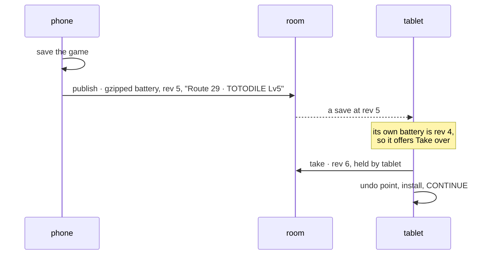

**Publishing happens where the app already knows the bytes moved** —
`keepGame`, which fires after a save it drove, a `.sav` it installed, a slot it
loaded, and before the Update button reloads. There is no "the game saved"
event in a browser, and a timer would either miss saves or send the same one
repeatedly.

**The revision is stored beside the bytes it belongs to**, in the same kept
record. That is what lets the row say *in step* rather than merely *both have a
save*: a revision without its bytes would claim this device is level with a
save it does not hold.

**It travels with a fingerprint of the ROM**, sixteen hex characters of a
SHA-256. Addresses the pilot reads and the layout a save is written in both
come out of the same build, so bytes from another one load and then everything
after is confidently wrong — worse than not loading. A mismatch is named in the
row and the button is not offered.

**Taking over runs through `runTask` with an undo point**, unlike the `.sav`
and slot paths. Those are a person choosing bytes in front of them; this is
bytes chosen on another device, possibly hours ago, so the local game is worth
one press back.

**A save that will not fit is said out loud.** The room holds 32,768 characters
of JSON; a raw base64 battery is 43,692 and never fits, gzipped it measured
about 1,200. Compression is what makes it possible and is not a guarantee, so
`publish` refuses with the numbers and writes nothing — the save is still kept
on the device, and the other one must not be left showing an older game with no
explanation.

### Watching the other device's screen

<!-- covers: app/stream.js @ 73982cbe3aeb -->

One device shows its screen; the other watches it and can play. The picture
goes straight between them over WebRTC and never touches a server — the room
only introduces them, three notes of a few kilobytes each, and `stream.js`
never touches the room. The caller passes the two descriptions back and forth,
the same way `baton` knows nothing about Firebase.

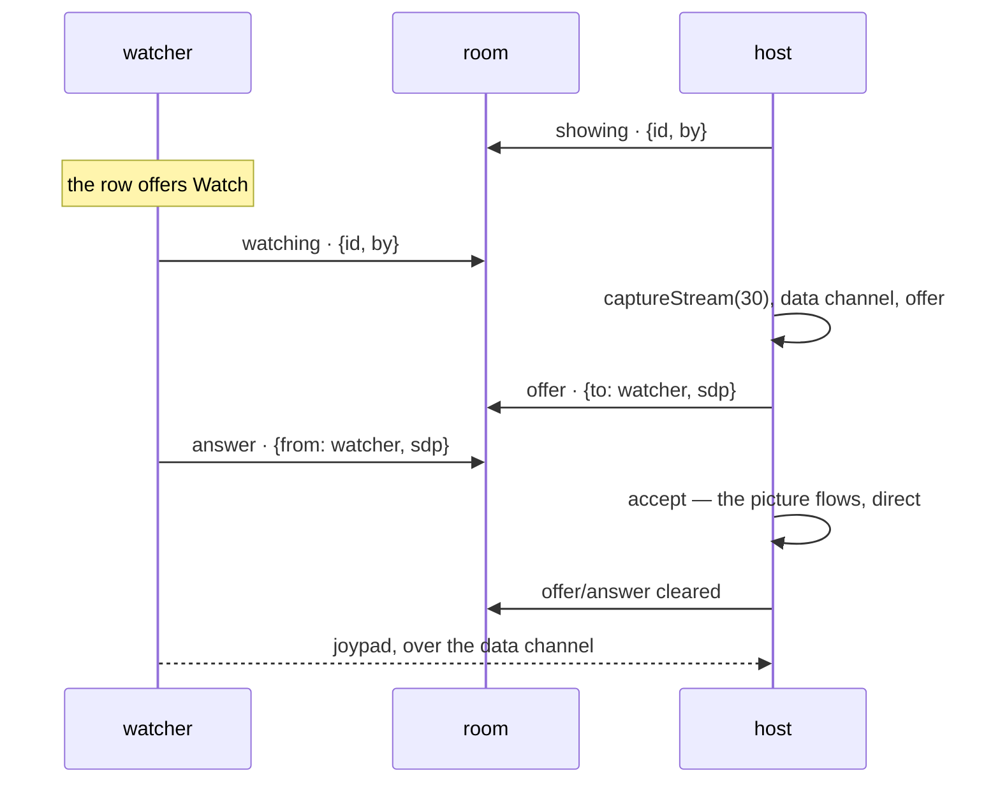

**A room is a mailbox, not a stream.** Notes stay where they are left, so both
devices see every note again on every change — and a note from a session that
has since reloaded is worse than noise. Each side records which one it has
acted on, and the host offers again whenever the device asking is not the one
it last offered to. Without that, a watcher that reloaded could never be shown
anything: an offer addressed to the device it used to be sat in the room
forever, blocking the next one.

**The joypad routes through the two functions the pad already used.** `hold`
and `release` send over the data channel when this device is watching, and
nothing else in the app knows which machine it is talking to. Buttons arriving
the other way are checked against the pad's own names before they reach the
core — an unknown name is ignored silently by the core, which is the exact
failure `check-app` exists to catch in this app's own code — and ignored
entirely while a job is running, because the pilot owns the joypad until it
finishes.

<details>
<summary><b>Advanced detail:</b> why the host has to be awake, measured</summary>

The obvious worry is that a hidden page stops capturing. It does not: a probe
page painting a canvas on a timer, captured and sent over a loopback peer
connection, delivered **5 frames in 4 seconds** while hidden. What it also did
was paint 8 times in those 4 seconds instead of 120 — because a hidden page is
throttled whole: timers clamped to about one a second, animation frames absent
altogether.

So a backgrounded host does not go silent, it goes *slow*, which is worse:
the watcher sees a picture that looks live and is a second or more behind, on a
game that is itself running at one frame a second. On top of that this app's
own `gb.run` skips the drawing when hidden — deliberately, because there is
nothing to draw for a screen nobody is looking at — so the canvas would not
change at all.

Rather than pretend, the host sends `{t:'asleep'}` on `visibilitychange` and
the watching row says the other device's screen is off. Hosting means a
foreground tab with the screen awake, and that is a property of browsers rather
than of this code.

</details>

<details>
<summary><b>Advanced detail:</b> what could not be verified here, and why</summary>

Everything up to the media is verified between two origins standing in for two
devices: the three-note handshake, both sides' rows, the video element taking
the canvas's place, the pad appearing on a device with no game, and the stale
note that used to block a reconnecting watcher.

The picture itself is not, and the reason is the same throttling. In the test
pane the host's ICE agent never sends its connectivity checks — the watcher's
pairs succeed and the host's sit in `waiting` with `sent=0` — so the connection
stalls in `checking` and no frames are encoded. A standalone probe in the same
browser connects and passes video fine, which places the failure in the
background tab rather than in this code.

That is worth stating plainly rather than describing this as tested: on two
real devices on one wifi it should connect in a second or two, and if it does
not, the row says so after fifteen seconds instead of spinning.

</details>

### What a handoff replaces, and where it goes

Taking a save from another device overwrites the game on this one. `runTask`
already takes an undo point before every job, and for a handoff that is not
enough: the undo slot is written before *every* job, so one grind after a
handoff you did not want and the game you had is gone.

So a reserved slot — `REPLACED_SLOT`, beside the undo one — holds the game a
handoff displaced, and only a handoff ever writes it. The row offering it back
appears only when it holds something, because a row reading "nothing was
replaced" explains a mechanism nobody has met.

**The settings card stopped hiding behind a loaded game**, and that is the
same bug the version display had at v71, one level down. The card holds the
theme, this device's name, which room it is in and which files it keeps —
none of which need a cartridge — and the device that most needs the room is
precisely the one with no game yet. Joining a room from a fresh phone was
impossible through the interface: the button existed and nothing could press
it. `check-app` asserts the card is not hidden, next to where it asserts the
version display is in the header.

The loader card says what is still needed, too. A device in a room where the
addresses are already shared needs one file, not two, and had no way to know
that — it asked for both, took the ROM, and then started on its own, which
reads like a bug even when it is the feature working.

And a device can be **called something**. The name is guessed from the user
agent, which is wrong in exactly the case that matters: two Macs, and "Mac has
the newer save" helps nobody. The override is stored on the device and the
baton is rebuilt when it changes rather than mutated, because a published save
carries the name the device had when it published — nothing should reach back
and change what a past handover said.

### The symbol file stops travelling

The `.sym` is 1.8MB and this app looks up **45 symbols in it**. So the room
carries those 45 lines — about a kilobyte, `{name: [bank, addr]}` — and a
second device needs the ROM and nothing else. `Symbols.fromDigest` builds a
table that behaves like the parsed file; `size` is the only honest difference,
and it reports 45 because that is how many symbols it has.

The list lives in `app/symbols.js` as `SHARED_SYMBOLS`, written by hand,
because nothing at run time can know which names the code is *going* to ask
for. That makes it exactly the kind of list that rots, and rot here is
invisible where it is written: every device with the file keeps working, and
only the one handed a digest fails — hours later, on the second phone.

So `check-app` reads every lookup in the app and fails if one is missing from
the list. It caught two on the way in, and the second one is why the check
looks the way it does.

<details>
<summary><b>Advanced detail:</b> the lookup the first check could not see</summary>

The first version matched `symbols.addr('X')`, which is how nearly every
module reads an address. `romdata.js` does not: it wraps the pair once —

```js
this.at = (name) => ({ bank: symbols.bank(name), addr: symbols.addr(name) });
this.items = this.at('ItemNames');
```

— so `ItemNames` and `KantoGrassWildMons` were reached through a variable the
pattern could not follow. The check passed, the digest shipped two names short,
and the device with no `.sym` booted to `symbol not in this .sym file:
ItemNames` and sat on **booting…** for good, with the reason only in the
console. The pattern knows both shapes now, and the two names that were missing
were added by the check itself telling me about them — along with
`sCheckValue1` and `sCheckValue2`, which are read the same way.

Two things changed because of that hour:

- **The check asserts one direction only.** A name in the list that nothing
  looks up costs twenty-five bytes in a digest; a name looked up that is not in
  the list costs a device the whole app. Requiring exact equality would also
  mean an exemption for every symbol reached through a filter, which is how
  `KantoGrassWildMons` is read — it is optional, and present in some builds.
- **`maybeStart` is called with a `catch` on the digest path.** It is the one
  route where the addresses were not read off a file this device chose, and an
  unhandled rejection there is a spinner that never resolves. It says what is
  missing now.

</details>

Where the fingerprint is taken matters too. A ROM arrives three ways — the
picker, the kept-files store, and `?dev=1` — and each takes it, because the
digest needs it *before* `maybeStart` runs. The dev path was forgotten first
time round and the symptom was silence: nothing published, and a second device
that waited for a digest that never came. `maybeStart` re-takes it if it is
missing, as a backstop for the fourth path someone adds later.

<details>
<summary><b>Advanced detail:</b> four in the code that predates all this</summary>

A third pass, over the parts written before any of the sharing existed and
never reviewed. The interesting one is a collision between old code and new.

**The ROM picker could start the emulator twice.** It calls `symbolsFromRoom()`
— which starts the emulator itself when the room is already offering the
addresses — and then called `maybeStart()` again on the next line. Nothing made
`maybeStart` idempotent, so on the ordinary second-device path both ran: two
`gb.start()`, two `loadROM` racing in a core that will not take a second ROM
while it is still coming up, two sets of tasks, and two `awaitWorld` intervals
polling for the rest of the session. The boot is a held promise now, and the
idle interval is cleared before it is set.

**A slot row cost 32KB to draw.** `list()` said "without the 32KB" in its own
comment and then read the whole record, five times, on every repaint after
every job. The summary is a second record beside the slot — a key, not a store,
so nothing to migrate — written in the same transaction. A slot from before
falls back to the long way once and is rewritten on its next capture. Measured
at 1ms for five slots afterwards.

**`press()` cleared the joypad outright**, which was harmless while only a task
could press and a task locks the player out — and stopped being harmless when
presses started arriving from a watching device. One press during a held
direction dropped it while `held` went on claiming it was down. It restores the
held set now, and three tests cover the joypad bookkeeping that had none.

**And WasmBoy's own database was reopened and never closed**, the same shape as
the leak fixed in `remember.js` an hour earlier: every slot load, import and
handoff added a connection for garbage collection to find.

</details>

<details>
<summary><b>Advanced detail:</b> seven more, from reviewing the fixes</summary>

Reviewing the fixes turned up a second, quieter set — mostly in the storage
underneath rather than in the sharing on top.

**The record of what is kept was written by read-then-write.** `patchMeta` read
the meta record in one transaction and wrote it back in another, so two writes
in flight together clobbered each other — and the ordinary first run does
exactly that, picking a ROM and then a symbol file. Whichever wrote last dropped
the other's name, and since the Files row needs both to say anything, it read
"re-picked each session" while both files sat in the store. The same race
dropped the revision beside a kept battery, which is the number the handoff row
compares against. It is one transaction now; IndexedDB serialises overlapping
readwrite transactions on a store, so the second sees what the first wrote.
Verified by starting five writes at once and finding every field.

**And every call opened its own connection.** `keepBattery` alone opened three,
and `paintHandoff` opens one per room update. Nothing closed them; garbage
collection eventually did. Beyond the waste, a live handle blocks a version
change on that database, so a future migration would wait behind whatever
happened to still be open. The handle is cached now, with `onversionchange`
standing it aside and `onclose` forgetting it — a cached connection that has
quietly died would otherwise fail every call after it. Verified by asking for a
version change and watching it complete rather than block.

**Three smaller ones in the screen code.** A connection failing while a button
was held left it lit, because `remoteHeld` was only cleared by Stop. The
withdrawal written when a host stops was not awaited before `leaveRoom()`, so
it could be abandoned in flight — the ninety-second freshness window was the
only thing covering it. And the startup `ensureRoom()` had nothing attached to
its promise, so a rejection from inside `createSync` would have surfaced as an
unhandled rejection rather than the "no connection" row this app has words for.

**One comment lying about a measurement** — it claimed 25ms for the ROM
fingerprint where the real figure is 8 — and **baton's demo teaching the
opposite of its own rule**, because it was not updated when taking stopped
claiming: press Take there and the holder never moved.

</details>

<details>
<summary><b>Advanced detail:</b> eleven things a review of this found</summary>

All of the sharing above was written in one run and then read back as a
stranger would. What that turned up is worth keeping, because the shape repeats:
almost none of it was a wrong line, and almost all of it was a *state nobody had
walked through*.

**Two devices sharing one word.** `stopScreen` was the handler for both roles
and cleared every note, so a watcher pressing Leave withdrew the host's
announcement: the phone went on showing, its own row still said so, and no
device could discover it again. Each side withdraws only what it owns now.

**Leaving a room did not leave the session it introduced.** Stop detached
kidsync while `watcher` stayed set, so the pad went on sending presses down a
channel with no room behind it. Two rows also went on offering to share into a
room this device had just left, because `leaveRoom()` leaves the handle in hand
and they keyed off `room` rather than `room.code`.

**A press on a watching device lit nothing.** `syncHeld` reads the local
emulator's held set, which on a watcher is empty — and the page-wide tap
highlight is off, so a press gave no sign at all. The very failure the comment
above `syncHeld` describes, arriving through a door that did not exist when it
was written. It has its own held set now.

**The baton was claimed before it could be dropped.** `take()` claimed and
returned bytes in one call, so an install that then refused — a hidden page —
left the room saying this device was playing while it still had its old game.
Taking and claiming are two calls in baton now, and the claim comes after the
install lands. The same change made `take()` return the revision it handed
over: recording the revision last *painted* meant a save published in between
left this device believing it was behind a game it was already holding.

**A withdrawal that was only an absence.** In `mergeSignal` an absent key lost
to a present one, so clearing an offer had it handed straight back by the other
device's stale copy — and after a reload, where the already-answered marks are
gone, that ghost was answered again. Withdrawals are written down now, as
`{gone: true, at}`, and `liveNotes` hides them from everyone upstream.

**A fingerprint that existed only on HTTPS.** `crypto.subtle` needs a secure
context, and this app is *told* to be served over plain HTTP on a home network.
There the ROM tag came back empty — and an empty tag is not "unknown" to
anything downstream, it reads as "matches anything", so a save from a different
build would install without a word. It is arithmetic now, FNV-1a over the file,
8ms for 2MB and the same answer on every origin. A fallback would have been
worse than the bug: two devices hashing differently describe one cartridge two
ways and refuse each other's saves.

**Two openings of one room.** `ensureRoom` checked `if (room)` and then awaited,
holding nothing in between, so a press during the startup open ran `createSync`
twice. Firebase's `initializeApp` throws on the duplicate name, kidsync catches
it and falls back to local-only, and the row would have claimed to be sharing
while nothing moved. The promise is held now, not just the result.

**An announcement that outlived its tab.** `showing` had no heartbeat, so a host
that closed left "iPhone is showing its screen" standing for ever and Watch
waited fifteen seconds for an offer nobody was there to make. It is re-stamped
every thirty seconds, ignored after ninety, and withdrawn on `pagehide`.

**Two smaller ones.** `room.baton` was captured by value while `rename()`
replaced it, so the property and the methods would have disagreed from the first
rename — it is a getter now, like `code` and `device`. And tied option stamps
had each device keep its own, which never settles; the tie breaks on device id,
the same rule baton already used for a tied revision.

**And two comments describing the wrong function**, which in this repository is
a bug: the block explaining `mergeOptions` sat above `mergeSymbols`, where it
was read as authoritative and was entirely wrong.

</details>

The service worker caches the vendored files, and `check-app` now asserts that:
an unlisted one is served from the network and breaks offline use in exactly
the way `app/world.js` nearly did. The Firebase SDK itself is another origin
and is deliberately not cached — offline you keep the app and lose sharing,
which is the right way round.

### The code that came from somewhere else

Two folders here are copies, and neither is edited in place.

| folder | canonical | what it does |
| --- | --- | --- |
| `sync/` | [kidsync](https://github.com/minormending/kidsync) | the room: Firebase, anonymous auth, rules, merge, debounce |
| `baton/` | [baton](https://github.com/minormending/baton) | one blob, one holder: pack it, order it, hand it over |

Vendored rather than imported, for the reason those repos give: these are
offline-first apps with no build step, and a cross-origin import in the middle
of a module graph is a dependency that fails exactly when the network does.
What that costs is drift, and the answer to drift is that each canonical repo
carries `tools/install` and `tools/check` — run `tools/check` there and it
compares every consumer's copy against the original, byte for byte.

`sync/bridge.js` is vendored and unused: it joins a host app's *classic
scripts* to kidsync's ES module, and this app is modules end to end. Keeping the
copy identical is what lets kidsync's own check stay green here.

`check-app` asserts both folders are in the service worker shell. An unlisted
module is served from the network and breaks offline use silently — the mistake
`app/world.js` nearly shipped — and code from another repo is *more* likely to
be forgotten, not less.

---

## 10. Keeping this honest

A document that drifts is worse than no document, so the sections that describe
code carry a marker naming the files they cover and the content hash at the time
the prose was last checked:

```html
<!-- covers: app/nav.js app/collision.js @ a1b2c3d4e5f6 -->
```

Sections that describe how the modules fit together — the diagram and table in
[The shape of it](#2-the-shape-of-it) — use a second form that hashes only the
`import` and `export` lines:

```html
<!-- covers-api: app/nav.js app/world.js @ a1b2c3d4e5f6 -->
```

Such a section goes stale when the module surface changes, not when a comment
inside one of them is reworded.

`tools/docs-check` recomputes those hashes. If a covered file has changed, it
tells you which section to re-read:

```bash
tools/docs-check
```

```bash
tools/docs-check --update
```

The first reports drift. The second records the current hashes, which is what
you run **after** bringing the prose back in line.

A `pre-commit` hook runs the check against staged files. Enable it once per
clone:

```bash
git config core.hooksPath .githooks
```

### The other checks

<!-- covers: tools/check-app @ 37d3edb8d72c -->

`tools/check-app` runs everything that can be verified without a ROM:

```bash
tools/check-app              # all of it
tools/check-app contrast     # or one group
```

| Group | Checks |
| --- | --- |
| `syntax` | every module parses |
| `shell` | the service worker's cached list matches what is on disk, both ways |
| `markup` | `index.html` tags and CSS braces balance |
| `contrast` | the palette still meets contrast, in both themes |
| `gamefiles` | no ROM, save or symbol file has been committed |
| `buttons` | every button name handed to `press`/`hold`/`release` is one the core knows |
| `wiring` | every `$('#id')` is in the markup, and every import is really exported |
| `version` | `version.js` and the worker's cache name agree, and the display is in the header |
| `docshape` | the architecture diagram names and counts every module |
| `names` | every capitalised name a module uses is imported or declared there |
| `moves` | the moves that would knock out what you are catching stay out of weakening |
| `symbols` | every symbol the app looks up is one it can hand to another device |

Half of that table was missing until the marker above was added: six groups had
been written and never listed, so the document described five checks while
eleven ran, and the twelfth arrived later with the symbol digest. Nothing noticed, because no section had claimed to cover
`tools/check-app` — which is the exact failure `docs-check` exists to catch,
one file away from the prose explaining it.

CI (`.github/workflows/checks.yml`) runs `check-app`, the behaviour tests and
`docs-check` on every push. There is deliberately no emulator in CI: driving
the game needs a ROM built from the disassembly, and none is distributed, so
the tasks are verified by hand against a local build. The workflow is named
`checks` rather than `tests` for that reason — it does not run the game.

<details>
<summary><b>Advanced detail:</b> two of those groups exist because of a real slip</summary>

**`shell` checks both directions.** A file listed in the service worker but
absent on disk makes the install reject, which takes the whole offline story
with it. A module present but *unlisted* is quietly served from the network and
breaks offline use with no error at all — which is how `app/world.js` was
nearly shipped when it was added.

**`contrast` encodes pairs that were measured once by hand.** Four of them were
failing before the palette was reworked — white on the accent was 3.80:1, so the
label on every Start button in the app failed. Without those thresholds written
down, the next palette edit quietly undoes that work.

**`syntax` copies each module to `.mjs` before checking it, and that is not
fussiness.** Measured on node v24: `node --check` on a **`.js`** file containing
a syntax error exits **0** — it does not report the error at all, presumably
because module detection makes the parse ambiguous. The same content as `.mjs`
exits 1. Checking the `.js` files directly would have been a green light that
meant nothing.

</details>

<details>
<summary><b>Advanced detail:</b> what this can and cannot tell you</summary>

It checks that the prose was *looked at* since the code changed. It cannot check
that the prose is correct — nothing can, short of a human reading both.

That is a deliberately modest guarantee, and it is the useful one: the failure
mode for documentation is not "someone wrote something wrong", it is "someone
changed the code and nobody remembered this file existed". A hash per section
turns that from invisible into a line of output naming the section.

Consequences worth knowing:

- **Whitespace counts.** Reformatting a covered file will flag its sections. That
  is the right trade: a cheap false positive beats a missed real one, and
  clearing it is one command.
- **The hook blocks rather than warns**, because a warning in a pre-commit hook
  is a warning nobody reads. The escape is printed in the failure message, and
  `git commit --no-verify` always works.
- **Section granularity is the point.** Covering the whole document with one
  hash would flag everything on every change and get switched off within a week.
  The first version of this hit exactly that: the module-graph section listed
  all ten files by content, so any comment edit anywhere flagged it, and an
  unrelated commit could be blocked by drift somewhere else. `covers-api` exists
  because of that — a comment change in `world.js` now flags the two sections
  describing what `world.js` does and leaves the architecture diagram alone,
  while a changed `export` flags the diagram too.
- **The scanner skips fenced code blocks.** A document explaining this marker
  format contains an example of it, and without that rule the tool rewrote its
  own documentation. It was caught immediately, because it reported fifteen
  tracked sections when fourteen had been marked.

</details>

---

## 11. Things that look like bugs and are not

Each of these was investigated and turned out to be correct behaviour. They are
here so the next person does not spend the same afternoon.

| Looks like | Actually |
| --- | --- |
| The emulator screen is black in a screenshot | A backgrounded tab does not paint the canvas — measured, zero non-black pixels of 23,040. Nothing is wrong with the game. |
| The idle loop advances nothing while the tab is hidden | Deliberate. The animation-frame stand-in is clamped by the browser to about one tick a second; it exists so the core's own waits finish, not to run a game. |
| The Catch button is disabled after a catch | `refreshBag` re-enables it from the bag contents on the next refresh. |
| The pilot routed out through the player's house mid-heal | The party had fainted, so the game had whited the player home. It was routing *out* of the bedroom, not detouring into it. |
| A service worker registration error in the console | The in-app browser pane blocks service-worker registration on its embedded origin. `sw.js` parses and serves correctly. |
| The same leg of a journey failed once and worked next time | Was genuinely nondeterministic; the cause was calibration on a doorway. See section 5. |
| `menuIsLive` returns false at a menu that is plainly up | Check `menuItems` and `menuTop` — you are probably looking at the pack, not the battle menu. |
