# How crystal-pilot mobile works

[← crystal-pilot mobile](../README.md) · [Using it](USING.md) · [The interface](INTERFACE.md) · [Two devices](DEVICES.md) · [What is proven](PROVEN.md) · [Developing](DEVELOPING.md) · [The code](CODE.md)

An auto-pilot for Pokémon Crystal that runs in a phone browser. This document
explains the code and the decisions inside it. It is the deepest of the six
pages: [The interface](INTERFACE.md) describes the same screen from the outside,
and [What is proven](PROVEN.md) is the log of what has been run and measured.

## How to read this

The main text is written for someone who has not seen this codebase before. You
should not need to know anything about Game Boy internals to follow it.

Wherever there is more to the story — a measurement, a trap, an address, a
reason the obvious approach does not work — it is folded away like this:

<details>
<summary><b>Advanced detail:</b> what goes in these</summary>

The expansions hold the things that cost time to find out: exact memory
addresses, the failure that motivated a design, numbers measured off the running
game, and the cases where the straightforward implementation is quietly wrong.
Skip them on a first read; come back when you need to change something.

</details>

Everything here is checked against the code rather than remembered. If a section
and the code disagree, the code is right and the section is a bug — see
[Keeping this honest](#10-keeping-this-honest).

## Contents

1. [The one idea](#1-the-one-idea)
2. [The shape of it](#2-the-shape-of-it)
3. [The layers, bottom up](#3-the-layers-bottom-up)
4. [Taking one step, and planning a walk](#4-taking-one-step-and-planning-a-walk)
5. [Crossing to the next map](#5-crossing-to-the-next-map)
   · [How the tasks are arranged](#5a-how-the-tasks-are-arranged)
6. [Battles](#6-battles)
7. [Catching something](#7-catching-something)
   · [Four that act on where you are](#7a-five-that-act-on-where-you-already-are)
   · [The counter, and the money it takes](#7d-the-counter-and-the-money-it-takes)
   · [Saving, and getting the save out](#7b-saving-and-getting-the-save-out)
   · [Slots, undo, and bringing a save in](#7c-slots-undo-and-bringing-a-save-in)
8. [The errands](#8-the-errands)
9. [The interface](#9-the-interface)
   · [One thing at a time](#one-thing-at-a-time)
   · [Reading a gym out of the cartridge](#reading-a-gym-out-of-the-cartridge)
   · [Gates: asking the cartridge what it wants](#gates-asking-the-cartridge-what-it-wants)
   · [Running the list](#running-the-list)
   · [The settings and the save card](#the-settings-and-the-save-card)
   · [Colour](#colour) · [What it remembers](#what-it-remembers)
   · [Sharing between your own devices](#sharing-between-your-own-devices)
   · [Handing the save over](#handing-the-save-over)
   · [Watching the other device's screen](#watching-the-other-devices-screen)
   · [What a handoff replaces](#what-a-handoff-replaces-and-where-it-goes)
   · [The symbol file stops travelling](#the-symbol-file-stops-travelling)
   · [The code that came from somewhere else](#the-code-that-came-from-somewhere-else)
10. [Keeping this honest](#10-keeping-this-honest)
11. [Things that look like bugs and are not](#11-things-that-look-like-bugs-and-are-not)

---

## 1. The one idea

The pilot **reads the game's memory** rather than looking at its picture.

A Game Boy game keeps everything it knows in memory: where you are, what is in
your party, how much HP the thing in front of you has. The pokecrystal
disassembly gives every one of those locations a name, and a build of it emits a
`.sym` file listing them. Feed the pilot that file and it can ask the game
direct questions instead of guessing from pixels.

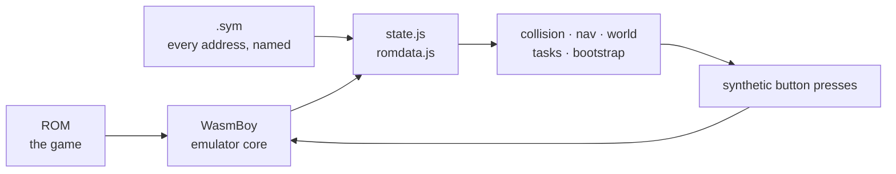
```mermaid
flowchart LR
    ROM["ROM<br/>the game"] --> CORE["WasmBoy<br/>emulator core"]
    SYM[".sym<br/>every address, named"] --> READ["state.js<br/>romdata.js"]
    CORE --> READ
    READ --> THINK["collision · nav · world<br/>tasks · bootstrap"]
    THINK --> PRESS["synthetic button presses"]
    PRESS --> CORE
```

That loop is the whole program. Everything else is detail about how each box
answers its question.

<details>
<summary><b>Advanced detail:</b> why this and not screen-scraping</summary>

Reading pixels would mean OCR on a 160×144 screen, and it could not answer the
questions that actually matter — *what species is this*, *what is behind that
wall*, *which tile is a doorway*. Those are not on screen at all.

The cost is a hard dependency on a `.sym` from the same build as the ROM.
`Symbols.require()` fails at load rather than mid-task if a name is missing —
or if an address is somewhere the app cannot read it — so a mismatched pair is a
sentence on the loader instead of a mystery three minutes into a grind. See
[`symbols.js`](#symbolsjs--where-things-live) for why those are two questions
and not one.

The desktop sibling ([crystal-pilot](https://github.com/minormending/crystal-pilot))
does the same thing with PyBoy, and additionally sets **CPU hooks** — the game
tells it when the battle menu opens. No browser core offers breakpoints, so
everything here is polled instead. That single difference is the source of most
of the subtleties in sections 6 and 7.

</details>

---

## 2. The shape of it

<!-- covers-api: app/main.js gen2/journey.js titles/crystal.js gen2/tasks.js gen2/nav.js gen2/world.js gen2/collision.js gen2/state.js gen2/romdata.js gen2/symbols.js gbcore/gb.js @ ba2dfbf87d95 -->

Twenty-nine modules, in four directories, and the directories are the design:
**an import may point down this list and never up.**

| | holds | may import from |
| --- | --- | --- |
| `gbcore/` | the emulator, storage, sharing, the task lifecycle | nothing of ours; only vendored `sync/` and `baton/` |
| `gen2/` | what a Gen 2 cartridge is: structs, collision, the map graph, menus, battles, jobs, journeys | `gbcore/` |
| `titles/` | what one cartridge *is*: Crystal's maps, doors, people, errands | `gen2/` |
| `app/` | the interface and its wiring | all three |

Nothing in `gbcore/` knows this is a Pokémon game. Nothing in `gen2/` knows
*which* Pokémon game. Only `titles/` names a map. `check-app` enforces the
arrows — see [section 10](#10-keeping-this-honest) — because a layering nothing
checks is a layering that lasts until the next hurry.

<details>
<summary><b>Advanced detail:</b> what the arrow check actually reads, and the
one exception it is told about</summary>

`check_layers` scans every module for a specifier that leaves its own directory
— `from '../gen2/state.js'`, and the `import('...')` form too, since `room.js`
loads kidsync that way — and compares the directory it reaches into against the
ones its own layer is allowed. No build step means every import is a path, so
there is nothing else to resolve.

```
gbcore/   may reach  gbcore + vendored sync/ and baton/
gen2/     may reach  gbcore, gen2
titles/   may reach  gbcore, gen2, titles
app/      may reach  all four
```

Vendored directories are **named rather than inferred**: `sync/` and `baton/`
are somebody else's code, they sit outside the layer list because they have no
place in it, and only `gbcore/` should be reaching them — which the check also
says, because a title importing Firebase directly would be a layering violation
that happens to resolve.

It was proved by breaking it three ways: `gen2/` importing a title, `gbcore/`
importing the engine, and an import into a directory that is not a layer at all.
Each fails with the file, the specifier and what that layer may reach; all three
pass again when reverted. That mattered more than usual here, because the thing
this check defends was *already true* when it was written — the layering was
measured before a single file moved — so a check that silently passed would have
been indistinguishable from one that worked.

</details>

Arrows below point from a module to the ones it imports. Drawn left to right,
which is not a preference: `main.js` imports sixteen modules, and top to bottom
that fan-out lays them in one row 3,214px wide, which shrinks to an unreadable
band in a page this width. Sideways the same graph is 1,283 × 1,773 and scales
to the column.

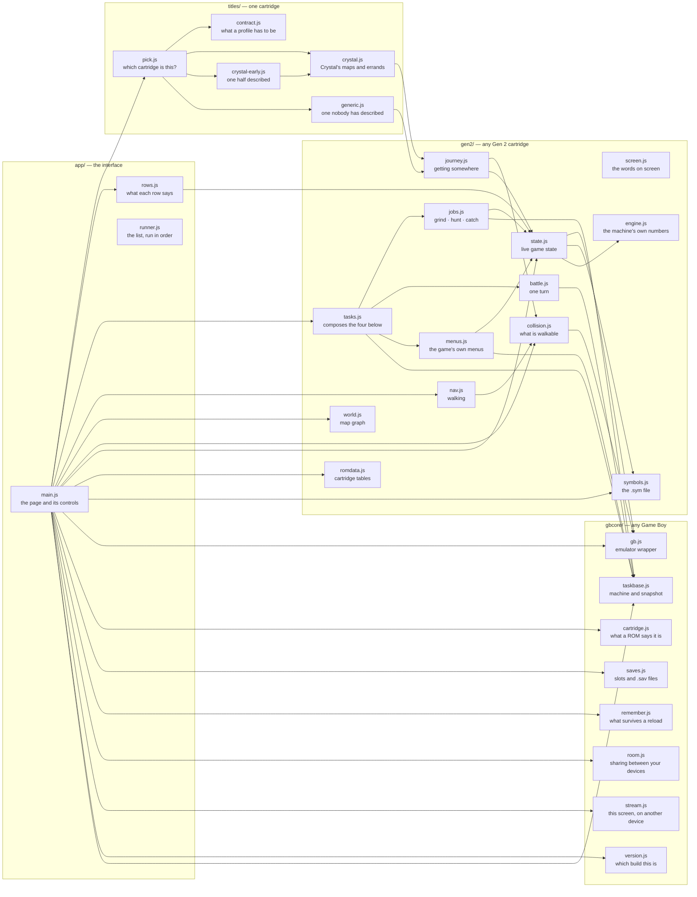
```mermaid
flowchart LR
    subgraph app["app/ — the interface"]
        main["main.js<br/>the page and its controls"]
        rows["rows.js<br/>what each row says"]
        runner["runner.js<br/>the list, run in order"]
    end
    subgraph titles["titles/ — one cartridge"]
        pick["pick.js<br/>which cartridge is this?"]
        contract["contract.js<br/>what a profile has to be"]
        title["crystal.js<br/>Crystal's maps and errands"]
        early["crystal-early.js<br/>one half described"]
        gener["generic.js<br/>one nobody has described"]
    end
    subgraph gen2["gen2/ — any Gen 2 cartridge"]
        tasks["tasks.js<br/>composes the four below"]
        jour["journey.js<br/>getting somewhere"]
        jobs["jobs.js<br/>grind · hunt · catch"]
        btl["battle.js<br/>one turn"]
        menus["menus.js<br/>the game's own menus"]
        nav["nav.js<br/>walking"]
        world["world.js<br/>map graph"]
        coll["collision.js<br/>what is walkable"]
        state["state.js<br/>live game state"]
        rom["romdata.js<br/>cartridge tables"]
        scr["screen.js<br/>the words on screen"]
        sym["symbols.js<br/>the .sym file"]
        eng["engine.js<br/>the machine's own numbers"]
    end
    subgraph gbcore["gbcore/ — any Game Boy"]
        tbase["taskbase.js<br/>machine and snapshot"]
        saves["saves.js<br/>slots and .sav files"]
        rem["remember.js<br/>what survives a reload"]
        room["room.js<br/>sharing between your devices"]
        stream["stream.js<br/>this screen, on another device"]
        ver["version.js<br/>which build this is"]
        cart["cartridge.js<br/>what a ROM says it is"]
        gb["gb.js<br/>emulator wrapper"]
    end

    main --> pick
    pick --> contract
    pick --> title
    pick --> early
    pick --> gener
    main --> rows
    main --> tasks
    main --> nav
    main --> world
    main --> coll
    main --> state
    main --> rom
    main --> sym
    main --> gb
    main --> cart
    main --> saves
    main --> rem
    main --> room
    main --> stream
    main --> ver
    main --> tbase
    rows --> state
    title --> jour
    early --> title
    gener --> jour
    jour --> coll
    jour --> state
    tasks --> jobs
    tasks --> btl
    tasks --> menus
    tasks --> tbase
    jobs --> state
    jobs --> tbase
    btl --> tbase
    menus --> state
    menus --> tbase
    nav --> coll
    coll --> gb
    state --> gb
    state --> sym
    state --> eng
```

| Module | Answers |
| --- | --- |
| `cartridge.js` | "is this a Game Boy ROM, and which game?" |
| `gb.js` | "run some frames", "read memory", "hold this button" |
| `engine.js` | "how wide is a party entry, and which byte is a move's power?" |
| `symbols.js` | "where does `wPartyCount` live?" |
| `state.js` | "what is happening right now?" |
| `romdata.js` | "what is species 155 called?" |
| `screen.js` | "what does the box on screen say, and which row is selected?" |
| `collision.js` | "can I stand there, and how do I get there?" |
| `nav.js` | "walk to this tile" |
| `world.js` | "which map is west of here?" |
| `tasks.js` | composes the four below into one `Tasks` |
| `taskbase.js` | "give me a snapshot", "settle down", "where is the cursor?" |
| `menus.js` | "open START and save", "answer the intro" |
| `battle.js` | "choose a move", "throw a ball", "what happened?" |
| `jobs.js` | "grind to level 12", "catch a Sentret" |
| `journey.js` | "get me to Route 30", "find grass", "go and heal" |
| `pick.js` | "which cartridge is this, and what drives it?" |
| `contract.js` | "is this profile usable, and what are its engine numbers?" |
| `crystal.js` | "start a new game", "fetch Poké Balls", "what is map 26.1 called?" |
| `crystal-early.js` | the same questions, answered for two maps out of ten |
| `generic.js` | the same questions, answered "I was not told" |
| `saves.js` | "keep this in slot 2", "put that .sav into the cartridge" |
| `rows.js` | "why is that button greyed out?" |
| `runner.js` | "what should the pilot do next, and is that worth saving?" |
| `version.js` | "which build am I running?" |
| `remember.js` | "what did they choose last time?" |
| `room.js` | "what has my other device chosen?" |
| `stream.js` | "can I watch, and play, from the other one?" |
| `main.js` | everything the person holding the phone touches |

Two arrows the old drawing had are gone, and their absence is the more accurate
statement: `saves.js` was drawn importing `gb.js` and `state.js`, and it imports
neither — it is handed both at construction. A diagram whose caption says
*arrows point from a module to the ones it imports* should not draw arrows for
things passed in.

The dependency direction is the design: **nothing below `tasks.js` knows what a
task is, and only `crystal.js` knows the name of a single map.**

That last one used to say "nothing below `bootstrap.js`", which was true and hid
something: `bootstrap.js` was two files sharing a name. Getting somewhere on a
Gen 2 map — routing, crossing, waiting for a script, finding grass, walking to a
healer and back — knows no Crystal fact at all, and it was sitting in the same
class as Elm's table and the egg errand. It is `journey.js` now, and `crystal.js`
extends it: a title may know about the engine, and the engine may not know about
a title. Measured after the split, the way the claim should be: no constant
declared in `crystal.js` is named anywhere in `journey.js`.

<details>
<summary><b>Advanced detail:</b> the one boundary worth defending</summary>

`tasks.js` deliberately does **not** know where a Pokémon Center is, where grass
is, or how to get anywhere. Getting anywhere lives in `journey.js`; *where* is
worth going lives in `crystal.js`, which owns the map constants.

The seam is a set of callbacks passed into the task options:

```js
tasks.grind(0, target, {
  heal:    () => boot.healUp(),
  regrass: () => boot.backToGrass(),
});
```

This is not decoration. Both hooks were added after real failures: a grind that
could not heal trained a Pokémon to death, and a grind whose pacing wandered off
the grass starved five battles in while standing on a route covered in it. Both
needed map knowledge that `tasks.js` should not have, and passing a function in
was cheaper than moving the boundary.

**And `heal` covers a knockout too, which it did not.** Grinding a Pokémon well
above the local wilds means it will eventually go down, and the job used to
report *the whole party fainted* and return — holding a heal callback and a
twelve-trip budget it spent none of. Measured, three runs in a row on Route 29
ended exactly that way. The reason attached to that return was itself wrong: the
comment said the game had already moved the player to a Pokémon Center, and the
player was standing on Route 29 with 0 HP.

Knockouts now draw on the same budget as a low-HP trip, because it is the same
trip and the bound exists for the same reason — healing counts no battles, so
nothing in that branch advances and an unbounded version paces for ever. The
count comes back in `stats.knockouts`, since each one costs half your money.

</details>

---

## 3. The layers, bottom up

### `gb.js` — the emulator

<!-- covers: gbcore/gb.js @ 1e81443546a7 -->

Wraps WasmBoy. Runs frames, reads work RAM, holds and releases buttons.

It exports the work-RAM window as `GB_WRAM_START` and `GB_WRAM_BYTES`, stated
once because two things depend on them agreeing: the snapshot `readWram` takes,
and the range `Symbols.require` insists a `w` address falls inside.

The important part of its interface is that **buttons are held, not tapped**:
`hold('LEFT')`, then `release('LEFT')`. Gen 2 turns you before it walks you, so
a short press in a new direction only turns you on the spot.

<details>
<summary><b>Advanced detail:</b> what this core will and will not do</summary>

**`_getWasmMemorySection` returns a copy, not a live view.** You cannot write to
it and have the game notice. That is why nothing here injects items or party
members — everything is earned by pressing buttons, including the five Poké Balls
in section 8. Measured rather than assumed: two calls for the same range return
different objects with different buffers, the core exposes no writer at all, and
writing through the copy resolves without error and changes nothing.

**Save states can be taken here and cannot be put back, so the two methods
offering them were removed.** The precise reason took two tries to get right,
and the first answer was wrong in a way worth recording.

What the code shipped with looked broken outright: `saveState()` resolved with
`{wasmboyMemory, date, isAuto}` whose four memory fields were all `undefined` —
the right shape holding nothing — and `loadState()` threw on it. Neither was
called from anywhere, which is the only reason it went unnoticed.

The `undefined` fields were not the real story. They come from the library's
memory module, which this app never initialises because it steps frames itself
and never calls `play()`. Call `play()` once and `saveState()` returns
everything populated — cartridge RAM 32768, Game Boy memory 65536, internal
state 1024, palette 128 — and persists it, so the library's own
`getSaveStates()` lists them back.

`loadState()` is the half that genuinely does not work. It rejects with
`undefined` on states the library created itself, fetched from its own
IndexedDB, handed to its own API with every buffer the right length. That is
what makes a state useless here, not the copy semantics above: a snapshot you
can never return to is not a save state. Slots hold battery saves instead — see
[section 7c](#7c-slots-undo-and-bringing-a-save-in).

**The battery save is the one that *can* work**, because it only needs reading.
`batterySave()` used to return `this.core.getSavedMemory()`, which is
`[{saveStates}]` — the record WasmBoy persists to IndexedDB, not save data, and
not writable to a file. It now locates `CARTRIDGE_RAM_LOCATION` the same way
`start()` locates work RAM and returns 32768 bytes, which is Crystal's battery
and the same size as the desktop's `.sav`. It reads all zeroes until the game
commits an in-game save; `saveGame` in [section 7b](#7b-saving-and-getting-the-save-out)
is what makes it hold one. Verified against real save data rather than only for
size: a battery this read produced was written to a file, opened in the desktop
pilot under PyBoy, and read back the same game — Route 29, `CYNDAQUIL Lv5
20/20` — and then imported back into this app, which loaded it.

**A full snapshot costs the same as reading eight bytes**, so polling loops do
not need trimming. Measured in the browser: `readWram()` 0.043 ms,
`readBytes(addr, 8)` 0.030 ms, a whole `snap()` including the decode 0.031 ms —
a battle turn at 120 polls is about 4 ms. The cost is the round trip to the
worker, not the payload, and the eight kilobytes ride along for nothing. Worth
writing down because the obvious optimisation is to read fewer bytes, and it
would buy nothing.

The comment above warns the core has been seen ignoring the range it was asked
for. Four probes at different moments all came back with exactly the 8192 bytes
requested, so that is not happening now — but the normalisation stays, because
one afternoon's probes are not evidence it never happens.

**Frames must be stepped differently when the page is hidden.** `_runNumberOfFrames`
awaits `pause()`, which needs an animation frame, and a hidden page does not get
them. So `run()` splits:

```js
async run(n = 1) {
  if (!document.hidden) { await this.core._runNumberOfFrames(n); return; }
  for (let i = 0; i < n; i++) await this.core._runWasmExport('executeFrame', []);
}
```

Reads are deliberately small. `readBytes(addr, len)` exists alongside
`readWram()` because a step polls coordinates every couple of frames, and
pulling a whole 8 KB snapshot that often costs more than the emulation it is
watching.

</details>

### `symbols.js` — where things live

<!-- covers: gen2/symbols.js @ 5a4612d05803 -->

Parses the `.sym` file into `name → { bank, addr }`. First definition wins;
later duplicates are aliases and locals.

`require(names)` is the gate a symbol table has to pass before the app will use
it, and it asks two questions rather than one:

- **Are the names present?** Asked of the list handed in, which is deliberately
  narrower than everything the app reads. A hack that renamed its wild tables
  should lose the species picker and keep the rest, so this half stays lenient.
- **Are the addresses readable?** Asked of every `w`-prefixed name the table
  holds, against work RAM's own bounds. This half is absolute, because an
  address outside `$C000–$DFFF` is not a value this app can read at all: every
  `w` read goes through one snapshot of that window and `GameBoy.byteAt` indexes
  it by subtracting the base, so an address past the end returns `undefined`
  instead of failing. Measured with `wBattleMode` moved into HRAM — the table
  loaded without a word, `battleMode` read `undefined`, `inBattle` was therefore
  `undefined !== 0`, and the pilot believed it was in a battle it could never
  leave.

**And the list itself is a number the repository now counts.** `SHARED_SYMBOLS`
is what travels to a device with a ROM and no `.sym`, and ten sentences across
three files said how big it was — every one of them typed by hand, and every
one of them reading **45** when the list held 59. The digest had grown fourteen
names over several passes with nothing watching, so each of those sentences was
quietly *understating what leaves the device*, which is the one direction a
claim about what leaves a device must never be wrong in. They are all one
`shared_symbols()` claim in `tools/counts.py` now, and `tools/renumber` writes
them.

The naming convention is what makes the second question answerable: pokecrystal
names a variable for the memory it lives in — `w` and a capital is work RAM, `s`
is SRAM, `h` is HRAM, a bare capital is a ROM label — and the linker script
enforces it, so it is a fact about the build rather than a habit.

### `state.js` — what the game is doing right now

<!-- covers: gen2/state.js @ 34882f985145 -->

One snapshot, many answers: `inBattle`, `party`, `pos`, `onGrass`,
`worldLoaded`, `menu`, `balls`, `items`, each party member's `status`, the
enemy's HP and **types**, the field Pokémon's own types, and `badges`. Events are read on demand rather than in `read()`,
because a snapshot is taken several times a second and nothing wants the whole
flag table that often — a gate asks about one bit when it is asked about.

**`badges` is a count, not a set**, and that is the whole of what it is for:
the only question this app asks of a badge is *has anything changed since a
route turned me back* — see [a route the game itself
refuses](#8d-a-route-the-game-itself-refuses) — and a count answers that for
every badge without a table saying which badge opens which route, which is a
thing no cartridge writes down. Counted in *bits* across both bytes, because
eight Johto badges live in one byte and anything counting bytes reads a full
case as one. Optional, like the tilemap: `null` and `0` are kept apart, since a
cartridge that cannot say is not a cartridge with a new game.

**And the menu window reads four numbers now, not three.** `menuLeft` joins
the items count, the border's top row and its right column — because three
battle menus in this ROM share the first two exactly, and only the left edge
tells the pilot's own from the Bug-Catching Contest's. It costs nothing to
read: the game writes all four border coords when it draws a box, and they sit
adjacent, inside the one small window this file already snapshots. See [a
battle menu that is not
ours](DEVELOPING.md#a-battle-menu-that-is-not-ours).

**Both sides carry two types, and neither slot is ever empty.** Gen 2 stores a
single-typed Pokémon as both of its types — RATTATA reads NORMAL/NORMAL — so
there is no *unset* to test for and nothing here pretends there is. Slot zero
being NORMAL is not the same as unknown: NORMAL is a real type, `0` is its real
number, and code that read a zero as "no type yet" would be answering a
question the cartridge never asks. What that costs when it is got wrong is in
[the bigger number is not the harder
hit](#the-bigger-number-is-not-the-harder-hit).

**`hasEvent` is the same idea about anything else the game remembers.** Gen 2
keeps one bit per scripted event in `wEventFlags`, which makes it the address
that turns *something turned me back* into a question with an answer — every
gate in the game is a script reading one of those bits. It reads and nothing
more: which bit means what is a fact about a cartridge's story, so a title
declares it. Null where the symbol file will not say, kept apart from false for
the reason above and a sharper one — see [gates](#gates-asking-the-cartridge-what-it-wants),
where the whole feature rests on it.

**`status` is the field that was declared and never read**, for ten passes. The
engine profile has carried `mon.status: 0x20` since it was written; `party()`
read species, level, HP, moves and PP and stepped over it. What that cost is the
sort of thing HP alone cannot show: **poison ticks a Pokémon while you walk**, so
a grind or a journey with a poisoned lead bleeds HP per step — and the walk to a
Center could kill the thing it was going to heal, with the app reporting only
that the party was hurt.

`statusOf(byte, engine)` answers with a list of keys — `['psn']`, `[]`, or
`['brn', 'par']`, because Gen 2 can hold two at once. Two things about that
decode are worth stating:

- **Sleep is a counter, not a flag.** The low three bits hold how many turns are
  left, so it is a *mask*: `byte & 0x04` is false of a Pokémon asleep for three
  more turns. That is the shape of a bug that reads as working.
- **Keys, not words.** What to call it belongs to the interface and which item
  cures it belongs to the title, and neither of those is this file's business.

<details>
<summary><b>Advanced detail:</b> what was measured, and what was not</summary>

**The offset was measured; the bit values were not.** On a Lv13 Cyndaquil at 35
of 37, byte `0x1f` read 13, `0x22`–`0x23` read 35 and `0x24`–`0x25` read 37 — so
`0x20` sits bracketed by two fields already known to be right, and it reads `0`,
which is what a well Pokémon holds. The five masks come from
`constants/pokemon_data_constants.asm` and are pinned by tests over synthetic
bytes.

**No non-zero status has been seen on the cartridge.** Getting one needs a wild
Pokémon to land a status move, and the only one on the routes this save can
reach is Weedle's Poison Sting — which needs a Weedle to get a turn, which an
over-levelled lead never gives it. Sixty battles on Route 30 produced none, and
a run that chipped gently at Weedles specifically found no Weedle in eight
encounters. So this is the same kind of gap as the remote-play picture: written
down rather than glossed, and waiting on a *situation* rather than on more
reading.

</details>

**`items` is the ITEM pocket, read for the first time in twenty-two versions**,
and the pocket next door had been read since the beginning. Both go through one
`_pocket`, because they are the same three bytes of layout: a count of *kinds*
carried, then two bytes per entry, id and quantity. What it cost not to have it
is the whole of section 7a's pickup defect — `pickUp` decided whether it had
picked something up by looking at the balls, so a BERRY off a fruit tree reported
*the ball would not go in the bag* with the berry visibly in the pocket.

It also exports the four collision values that roll for a wild encounter, as
`GRASS_TILES`, because the pilot needs that fact from both sides: this module
asks *is the player standing on grass* of a snapshot, and a walk asks *is that
tile grass* of the collision map. They were two copies of one engine fact, here
and in `bootstrap.js`, with nothing able to notice if they drifted.

<details>
<summary><b>Advanced detail:</b> the signals that are not what they look like</summary>

- **`worldLoaded` is `wMapStatus == 2`, not "is there a party".** The CONTINUE
  screen restores party and coordinates *before* the map exists, so waiting on
  party data starts pressing buttons while still in the menus.
- **`wMenuCursorY` reads 3 while idle in a field**, so it cannot be used alone to
  mean "a menu is open". `wWindowStackSize > 0` is the reliable signal, exposed
  as `windowOpen`.
- **`menuItems` and `menuTop` identify *which* menu is drawn** — see section 6,
  where confusing the pack for the battle menu cost five Poké Balls.
- **`wBalls` does not settle until a battle ends.** A Pokémon can already be
  caught while the bag still reads five. Never difference the bag mid-battle.
  **And the ITEM pocket does not settle immediately out on the map either**,
  which the line here claimed for one version and is wrong. Measured: a BERRY
  used on a Cyndaquil at 5/22 took it to 15/22 — ten HP, exactly a BERRY — and
  `wItems` still listed that berry on the next read. The removal landed later,
  and when it did, the berry and the potion used after it disappeared together.
  A pickup is still confirmed by differencing, because the *arrival* of an item
  does settle; it is the *spending* of one that lags. So HP is the evidence a
  heal worked and the pocket is corroboration — see section 7a.
- **`POCKET_KINDS = 20` is a bound, not a capacity.** A garbage count byte must
  not send a reader walking through work RAM. It is deliberately not in the
  engine profile: that file says in its own header that this app's caution is
  not a fact about the machine.

</details>

### `romdata.js` — what the cartridge knows

<!-- covers: gen2/romdata.js @ ed7f493f3ff9 -->

Species names, item names, move names, wild-encounter tables, move power and
the type chart. All read out of the ROM, not shipped as a copy, so they cannot
drift from the build being driven.

<details>
<summary><b>Advanced detail:</b> table layouts, and the one that bites</summary>

- `PokemonNames` — fixed width 10, terminated by `$50`.
- `ItemNames` and `MoveNames` — **variable length**, packed, each ended by `@`.
  Reading at a fixed stride drifts one character further out per entry: `ULTRA
  BALL` came back as `LTRA BALL`, `GREAT BALL` as `AT BALL`. One walk,
  `_packedName()`, serves both — it was briefly two, which is the shape of
  defect this file keeps finding. It answers **empty** rather than a string of
  question marks when no terminator turns up inside twenty-four bytes, because
  `decodeText` will turn any bytes at all into something that reads like a
  name.
- `TrainerGroups` and `TrainerClassNames` — every trainer in the game and
  what they are carrying. See [what is behind the Gym
  door](#what-is-behind-the-gym-door-before-you-open-it); the awkward parts
  are the type byte, which decides how wide a Pokémon is, and the class
  boundaries, which only the *next* class's pointer marks.
- `BaseData` — 32 bytes an entry: the species' own id, **six** stats, then the
  two types. It is the only place a party member's types can be read from,
  because Gen 2 does not keep them in the party struct. Two things about it
  are worth stating. Counting five stats instead of six is *silent* — it reads
  the special defence as the first type, which is a plausible type number, so
  CHIKORITA came out as "type 65/GRASS" and printed rather than failed. And
  there is no terminator to run off the end of, so the guard is the entry's
  own id in byte zero: a symbol file pointing elsewhere reads zeroes, and
  `[0, 0]` is NORMAL/NORMAL — a real type pair and a wrong answer that looks
  like an answer. Checked over all 251 entries; every one carries its own id.
- `TypeMatchups` — 110 rows of `attacker, defender, multiplier-in-tenths`, with
  a one-byte separator in the middle and neutral left out entirely. See [the
  bigger number is not the harder
  hit](#the-bigger-number-is-not-the-harder-hit), which is the section about
  what it is for; `matchups()`, `matchup()`, `effectiveness()`, `hitPower()`
  and `canHit()` are the readers.
- `JohtoGrassWildMons` — per map: group, number, three rates, then **three
  blocks of seven** `(level, species)` pairs for morning, day and night. Both
  halves of that pair are read now: `wildOn` gives the species, commonest first,
  and `wildLevels` gives `{ low, high }`. The level byte went unread for
  sixteen versions while the species reader stepped straight over it — and it is
  the number that decides whether a grind is a minute or an afternoon. Measured
  against the cartridge: Route 29 gives Lv2–3, Route 30 Lv3–4, Route 31 Lv4–5,
  and a map with no table gives `null` rather than a range, because *nothing
  appears here* and *they are Lv2–3* are different answers.
  `wildHours(group, number)` reads all three blocks at once, which is what the
  hour advice is built on — and it settled a claim recorded here for one version
  and **wrong**: the range does *not* move with the hour. Measured, all three
  blocks of Route 29 read Lv2–3, all three of Route 30 read Lv3–4 and all three
  of Route 31 read Lv4–5, while the *species* swap completely after dark. The
  earlier note compared two maps and called it two hours: 26.1 is Route 30 and
  26.2 is Route 31, and the Lv3–4-against-Lv4–5 it quoted is exactly that pair.
  `cheapestOf(pocket, names)` lives here for the same reason the decoders do:
  both halves of the work were already in this file — `itemName`, and the
  `normalise` fold that lets POKé and case cost nothing. It answers *the cheapest
  thing in the bag that matches this list*, weakest-first, and the list comes
  from the title because an item id is layout and an item name is content. It
  began as an export of `journey.js` and moved when a second caller turned up in
  `battle.js`, which would otherwise have had one gen2 module reaching sideways
  into another for a question about the bag.

  All three readers share one `_grassAt` for the table scan and one `_slots` for
  a block, which is not tidying: a slot with no species is padding, and its
  level byte means nothing. `wildLevels` knew that and `wildOn` did not, so a
  block with three real slots and four padding ones offered **a species called
  `#0`** — pickable, never findable, and enough to put Hunt on the offers list
  and a range on a map with almost nothing in it. Crystal's blocks are all full,
  so it took a hack-shaped test to see; dropping the slot in one place fixes it
  for all three.

Two methods left this file rather than joining it. `speciesIndex` and
`itemIndex` built name→id maps and **nothing had ever called either**, in twenty
versions — the app compares species by name throughout and finds the ball by
scanning the pocket. Found by asking which methods have no caller, which is a
question `check-app`'s exports group cannot ask: dynamic dispatch is real here
(`this[h.reach]()` reaches `healAtElm` by string), so a check would have to
false-positive on the title scripts to catch these. Deleted on the same grounds
the group states — a second way to do a thing, sitting where the next person
finds it by name, drifting because nothing exercises it. `normalise` stays,
because the bag reader still uses it.
  Time-of-day matters: Route 29 trades Pidgey and Sentret for Hoothoot after
  dark, and offering a species that cannot appear sends a hunt after something
  that was never there.
- `Moves` — 7 bytes each, **effect at offset 1, power at offset 2**.
  `isChipMove()` needs both. Status moves have power 0, which rules them out.
  But eleven moves lie about their power: Gen 2 computes their damage rather
  than scaling it, so it stores them at 0 or 1 — which puts Guillotine, Horn
  Drill and Fissure *ahead* of Tackle when ranking ascending. Asked for the
  weakest damaging move, the first version returned a one-hit KO. They are
  excluded by effect id (`38, 40, 87, 88, 89, 144`), read out of the cartridge's
  own move table rather than counted from the disassembly's `const_def` order.
  This is **not** the same as "fixed damage": `EFFECT_STATIC_DAMAGE` really does
  store its damage as its power, so Dragon Rage reads 40, takes 40, and ranks
  correctly.
- `0x54` is a one-byte ligature for `POKé`.
- **The punctuation block was missing, and it cost more than tidiness.**
  `decodeText` handled the two letter ranges, the digits, the space and the
  ligature, and turned everything else into `?`. Five of those bytes are in
  *species* names — `0xe0` in FARFETCH'D, `0xe3` in HO-OH, `0xe8` in MR.MIME,
  and `0xef` / `0xf5` in the two NIDORAN — and the last pair is the one that
  matters: both came back `NIDORAN?`, so the species picker drew two identical
  chips and hunting for one of them stopped at the other. Route 35 and Route 36
  each carry the pair. Twelve item names were affected too, `KING'S ROCK` and
  `EXP.SHARE` among them. Every byte in the table was read out of a real
  cartridge rather than copied from `charmap.asm` hopefully, since copying
  hopefully is how the gaps got there.

  `normalise` still folds `é`, because somebody typing *poke ball* means
  `POKé BALL` — and deliberately does **not** fold `♀` and `♂`, which would undo
  the fix by making the two names match again.

</details>

**And `state.screen(wram)` is the door onto [`screen.js`](#screenjs--the-words-on-screen).**
It lives here because this class already carries the address and the engine
profile, so nothing else has to be handed either — and it returns `null` where
the symbol file does not name the tilemap, which is *cannot read* rather than
*says nothing*, the same distinction `liveObjects` makes.

### `screen.js` — the words on screen

<!-- covers: gen2/screen.js @ c46efac9d9f8 -->

Gen 2 renders text into `wTilemap` — twenty by eighteen bytes of tile ids — and
the letters *are* tiles. So the words a person is reading have been sitting in
work RAM the whole time, and until the twenty-eighth pass nothing here looked at
them.

Every box this app drives had been identified by its **shape**, the pair
`wMenuDataItems`/`wMenuBorderTopCoord`, since the eleventh pass. That was a real
advance over counting presses, and it is as far as shape goes:

| the problem | what the screen answers |
| --- | --- |
| three boxes share `2/7`, two share `2/0` | the words say which one is up |
| the START menu grows, so PACK moves | PACK is the row that *says* PACK |
| a box whose cursor is nowhere findable | the arrow is *drawn*, so it can be followed |

Everything in the module is a pure function of a snapshot, an address and an
engine profile. Nothing presses a button.

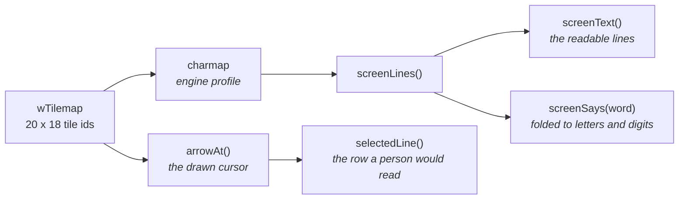
```mermaid
flowchart LR
    TM["wTilemap<br/>20 x 18 tile ids"] --> CH["charmap<br/><i>engine profile</i>"]
    CH --> L["screenLines()"]
    L --> T["screenText()<br/><i>the readable lines</i>"]
    L --> S["screenSays(word)<br/><i>folded to letters and digits</i>"]
    TM --> A["arrowAt()<br/><i>the drawn cursor</i>"]
    A --> SEL["selectedLine()<br/><i>the row a person would read</i>"]
```

The charmap was measured rather than copied out of `charmap.asm`, by dumping the
raw tilemap beside the picture and reading them against each other:

| tiles | what | measured on |
| --- | --- | --- |
| `$80`–`$99` | A–Z | *WITHDRAW ITEM* on the bedroom PC |
| `$a0`–`$b9` | a–z | *What do you want to do?* under it |
| `$f6`–`$ff` | 0–9 | *21/ 21* and *Lv6* on the party screen |
| `$7f` | space | the blank inside every box |
| `$f3` `$e6` `$6d` | `/` `?` `:` | an HP reading, that question, the save panel's *0:03* |
| `$ed` | the cursor arrow | at tilemap rows 2, 4, 6, 8, 10 as `wMenuCursorY` read 1–5 |

Matching **folds to letters and digits** before comparing, because the screen is
not a string: `POKéDEX` draws its accented letter as a tile this charmap does not
name, `POKéGEAR`'s logo is drawn as graphics entirely so the row reads `  GEAR`,
and an item count reads `x 1`. Folding is what lets a caller ask for `PACK` and
mean it. Phrases are matched **per line**, so two unrelated lines that happen to
abut are not a sentence.

<details>
<summary><b>Advanced detail:</b> what the arrow can and cannot do</summary>

`_arrowMoved` is `_packMoved` generalised to every box there is. `_packMoved`
waits on a variable, which works for the pack because the pack keeps its index
in one; measured on the bedroom PC's BILL'S-PC submenu, **eight DOWN presses
over six hundred frames moved `wMenuCursorY` not at all** — a work-RAM diff
across a press turned up thirty-seven changed bytes, every one of them in the
sprite buffer, and the only named change was the game clock. That box keeps its
selection somewhere this app cannot find. The arrow is drawn, so it can be
followed anyway.

`_driveToSaying(word)` is what the two row-hunting hacks become. `_openPack`
used to open rows one at a time and ask each time whether the pack had appeared;
`saveGame` counts SAVE from the bottom, on the reasoning that the last three
rows are always SAVE, OPTION, EXIT. Both now ask the screen first and keep their
search as the fallback — because a row that says the right thing and opens the
wrong box is exactly the kind of thing this app stopped believing several passes
ago, so the shape is still checked afterwards.

Measured on Route 29 right after the intro, the START menu reads:

```
>POKéMON      (no POKéDEX yet)
 PACK
   GEAR       (the logo is graphics)
 CHRIS
 SAVE
 OPTION
 EXIT
```

Seven rows, and `_menuRowCount` agrees. PACK is row 2 here and row 3 once the
Pokédex arrives, which is the whole reason nothing counts to it.

**A screen with no arrow is not a menu**, and `_driveToSaying` returns false
without pressing anything when it sees one — because DOWN in an overworld is a
step into the grass. Out on the map the tilemap is empty and there is no arrow,
so the guard costs nothing and prevents the one way this could do harm.

**And a failure can quote the screen.** `saying(message)` puts what is showing
on the end of a report: *the USE box never appeared* says what the pilot
expected, and not what turned up instead. That difference was measured the hard
way while driving the bedroom PC — three probes failed to identify a box by its
shape, and one look at its words, *CHRIS turned on the PC*, settled it. Ten
failures carry it, across the field pack, the battle pack, the shop and a duel
that will not start — which is nine more than the pass that added it wired up,
and the shape this repository keeps finding.

**The starter's name was the first thing it caught.** Every starter this app
ever took was called AAAAAAAAAA, for twenty-eight passes, because Gen 2 asks two
questions when you take one and A is right for only one of them. The fix is one
button and is in [section 8](#8-the-errands); what the screen contributed was
noticing at all.

</details>

### `collision.js` — what you can walk on

<!-- covers: gen2/collision.js @ c72c09795b79 -->

Decodes the loaded map into "can I stand on this tile", and does breadth-first
pathfinding over the result. This is what turns walking from trial and error
into a plan.

**And for a long time almost none of it was checked.** Line coverage said 51%,
which sounds like a gap and reads as a plateau. [`tools/mutate`](DEVELOPING.md#whether-the-tests-would-notice)
said **18%**: the wall and water rules, the ledge and warp ranges, and all four
of `furthestToward`'s direction comparators could be inverted and the suite
passed. One line in a fake was the whole cause — every collision test handed the
decode `{ romByte: () => 0 }`, so `permission()` answered LAND for every byte on
every map, and `isWall` ran on each of those tests and was checked by none of
them.

It is 66% now, over painted maps: routing round a fence, water refusing, the
avoid set and the goal's exemption to it, a warp entered only as an errand, the
node bound, and the one-way ledge rule. Worth the note because *this* is the
module where being quietly wrong is expensive — an inverted comparator in
`furthestToward` walks the pilot away from the edge it is trying to leave by, and
every symptom of that looks like the map being in the way.

It also reads the map's objects, and there are **two arrays**, not one. Getting
that wrong was the twenty-seventh pass's biggest find, so it is worth stating
plainly:

| | `wMapObjects` — `placedObjects()` | `wObjectStructs` — `liveObjects()` |
|---|---|---|
| how many | 16 entries of 16 bytes | 13 structs of 40 bytes |
| what it holds | what the map *placed* | what the game has *spawned* |
| coordinates | never move | live |
| absent when | never | not loaded yet, or hidden by its flag |

Both were measured on one screen of Route 30. The placement array said the
player was at `(7,53)`; they were standing at `(2,27)`. It said a wanderer was
at `(7,30)`; the struct said `(8,30)`. It listed a trainer at `(2,28)` that a
new save has never seen. And the struct array, twenty tiles from anything, was
empty but for the player — whose `MapX/MapY` minus four *is* `wXCoord/wYCoord`,
which is what pins the origin.

So the three readers over them each pick the array that answers their question:

- **`occupied()`** — who is standing where, so a plan routes around them — reads
  the **live** structs. It used to read the placements, and was wrong in both
  directions from the same byte: marking `(7,30)`, which nobody was on, and
  leaving `(8,30)` open, where the wanderer was. It falls back to the placements
  where a symbol file does not name the structs, because stale tiles beat no
  tiles.
- **`takeables()`** — item balls and fruit trees — reads the **placements**, and
  that is the right array rather than the old one: a ball does not move, and the
  game only spawns what is near enough to draw. Measured from the north end of
  Route 30, the ball at `(8,35)` and both fruit trees had *no live struct at
  all*, so reading the structs here would have made Take see only what you were
  already standing next to.
- **`trainers()`** — who wants a battle — needs **both**: the placement says
  what an object *is*, and the struct says whether it is here and where. It
  returns an empty list rather than falling back, because a fallback would offer
  a walk to somebody a flag is still hiding.

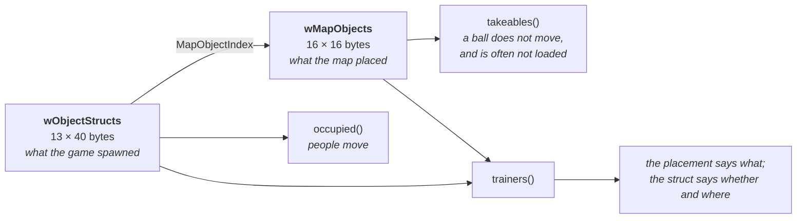
```mermaid
flowchart LR
    P["<b>wMapObjects</b><br/>16 &times; 16 bytes<br/><i>what the map placed</i>"]
    S["<b>wObjectStructs</b><br/>13 &times; 40 bytes<br/><i>what the game spawned</i>"]
    S -->|"MapObjectIndex"| P
    P --> TK["takeables()<br/><i>a ball does not move,<br/>and is often not loaded</i>"]
    S --> OC["occupied()<br/><i>people move</i>"]
    P --> TR["trainers()"]
    S --> TR
    TR --> Q["<i>the placement says what;<br/>the struct says whether and where</i>"]
```

What an object *is* comes from a byte the cartridge's own symbol file gives two
names — `wMap1ObjectPalette` and `wMap1ObjectType` are the same address, colour
in the high nibble and the type in the low. Measured on Route 30, whose objects
are one of each: the item ball reads 1, the three trainers read 2, and the fruit
trees, the townsfolk and the two Rattata read 0. That is the game's own answer,
and it is better than a sprite table for the thing it knows about — it is the
byte the engine branches on when you press A. It only knows about balls, so a
fruit tree is still found by its sprite, and which sprite that is lives in the
engine profile because a sprite id is exactly the sort of thing a hack moves.

**A ball that has already been taken is still in that list**, and so is a
trainer who has already been beaten. Measured, not assumed: after the ANTIDOTE
at (8,35) on Route 30 was in the bag, its object was still exactly where it had
been in work RAM; and a beaten trainer reads with the same type byte and the
same sight range as an unbeaten one, measured by beating one and comparing. So
these answer *what the map placed here* and nothing stronger, and the only
honest way to find out what is left is to go and press A — which is why the jobs
that use them report what actually happened rather than what they expected.

<details>
<summary><b>Advanced detail:</b> the decode, and why one check is not enough</summary>

`wOverworldMapBlocks` holds the loaded map's blocks; each tileset's per-quadrant
collision values sit in ROM at `wTilesetCollisionAddress`. Indexing comes from
`GetBlockLocation` in `home/map.asm`:

```
stride   = wMapWidth + 6
index    = 1 + stride * (1 + ((y + oy) >> 1)) + ((x + ox) >> 1)
quadrant = ((y + oy) & 1) * 2 + ((x + ox) & 1)
```

`calibrate()` checks its own arithmetic by reproducing `wPlayerTileCollision`,
the collision of the tile the player is standing on. **That check is necessary
and not sufficient.** A wrong offset can reproduce that one byte by luck, most
easily where the value is a common one — measured on a doorway mid-transition,
the true offset did not match and a fallback did, so the whole map decoded
shifted and a route that existed looked walled off. It fails by producing a
*confident* map rather than an error.

So `Bootstrap.settled()` requires the answer to hold still: same offset, same
player tile, twice in a row, a few frames apart.

Two more things the map alone will not tell you:

- **Ledges are one-way.** A ledge tile can be stood on; it is *leaving* one in
  the hop direction that moves two tiles irreversibly. `pathTo` never includes a
  hop, so a planned route can always be walked back.
- **The map is terrain only.** NPCs read as open floor, so `occupied()` supplies
  them, and those tiles are *preferred against* rather than treated as walls —
  `walkTo` drops the whole set on its second attempt when it seals a route.
- **The +4 origin is the one cartridge assumption here that `calibrate` does not
  cover.** It used to claim it was "checked against the player" while nothing
  checked it, and on the placement array nothing can: index 0 holds where the
  map *placed* the player, not where they are — measured in Elm's lab, the entry
  reads `(8,15)` while the player stands at `(7,4)`, having come in through a
  door. The **struct** array can, and does: struct 0's `MapX/MapY` minus four is
  `wXCoord/wYCoord` exactly, measured on Route 30 at `(2,27)`. Beyond that the
  check is the map's own bounds, and a tile outside them is dropped instead of
  kept as a key that can never match. Which is also the right way to fail: on a
  cartridge storing objects at a different origin, an empty set means the planner
  walks into people and *recovers*, whereas a set of in-bounds but wrong tiles
  can seal a one-tile corridor, and `unreachable` is the one answer `walkTo`
  cannot recover from.
- **An object is only loaded when you are near it.** Measured walking north up
  Route 30: nothing at all was spawned from the south end, then the ball and a
  tree, then a wanderer, then a trainer, one after another. So `occupied()` and
  `trainers()` are *local* answers, and anything that wants to know what a whole
  map holds has to ask `placedObjects()` — which is what the Duel row's hint
  does, to say "3 more trainers further along this map".

</details>

### `nav.js` — walking

<!-- covers: gen2/nav.js @ 5bda9405ee92 -->

`step()` takes one tile. `walkTo()` gets to a tile, re-planning every step.

### `world.js` — which map adjoins which

<!-- covers: gen2/world.js @ edfaa66ed480 -->

The map graph, read out of the cartridge: edge connections *and* warps, so it can
route out of a building rather than only across a route.

`route(from, to)` gives the shortest list of exits to take; `routesFrom(from,
targets)` answers the same question for several places at once, from **one**
search. That distinction is not a micro-optimisation — the Travel row asks about
every place the title has named, and the traversal used to live inside `route`,
so ten destinations meant ten breadth-first walks over the same graph. `route` is
now written in terms of `routesFrom` rather than beside it, because two copies of
a graph traversal is two things to keep in step.

`routesFrom` answers a `Map`, so an absent key means *not reachable* — and it
never returns a route to the map you are standing on, because that is not a
journey and `travelTo` already answers *arrived* for it.

<details>
<summary><b>Advanced detail:</b> lazily, because there is no map count in the ROM</summary>

Each map header points at a map-attributes block whose tail is a bitmask of
connected sides plus one 12-byte struct per connection naming the map beyond it.
Warps live in the map's event block: two filler bytes, a count, then five bytes
per warp — `y`, `x`, the destination warp index, and the group and number of the
map it leads to.

Nothing is loaded up front, and expanding outward from wherever the player is
reaches everything walkable and nothing else, which is all a journey needs.

**A claim that used to sit here was wrong, and it cost a pass.** It said the ROM
carries no table of how many maps a group holds, so walking every map is
impossible. The first half is true — there is no count — and the conclusion is
not: `MapGroupPointers` is one pointer per group and the lists sit one after
another, so the *next* group's pointer bounds this one. Measured, the twenty-six
pointers ascend by 126, 63, 819, 81 … 135 bytes, every one an exact multiple of
the nine-byte header, and the twenty-seventh reads 0x0725 against the
twenty-sixth's 0x4d75.

What that claim cost was a reader with no bound on a map number, which this file
also documented and shrugged at — *a map number the ROM does not have reads as
nonsense rather than failing* — and which was harmless right up until
`objectsOn` started being asked about whatever a warp pointed at. A sweep
looking for the Gyms then got Violet's Gym back under six group numbers and an
object at (141,72) on a map twenty tiles wide.

So `mapCount(group)` derives it, `hasMap` uses it, and three things keep the fix
from being worse than the bug — none of which can refuse a map that exists:

- **Null wherever the reasoning does not hold**, and permissive on null. The
  last group has nothing after it; a hack that padded between its lists gives a
  step that is not a multiple of nine. Refusing a real map breaks a cartridge
  this app should support; reading a fake one is caught below.
- **A step of exactly nought is a derivation, not a failure to derive** — that
  group is empty and every number in it is refused. `tools/mutate` found that
  by surviving `> 0`.
- **And `coordEventsOn` reads the trigger tiles**, which is the same event block
  one step further along: scene, y, x, a pad byte, a script pointer. Its
  coordinates are *raw* where the objects' are stored four higher — measured,
  and the sort of asymmetry that reads as obviously consistent. See [the tiles
  that run a script](#8g-the-tiles-that-run-a-script-and-saying-hello).
- **A tile off the map is not a tile**, which needed `sizeOf(group, number)` —
  the ROM's own copy of what `collision.mapSize()` reads from work RAM, so it
  can be asked about a room nobody has walked into. Measured against two maps
  whose tile dimensions were already known: Route 32's attributes read 45 and 10
  for a map 20 by 90, Route 31's read 9 and 20 for one 40 by 18. Height first,
  and a block is two tiles each way.
- **And a count that reaches the sanity bound is a bad read**, not a crowded
  map. `MAX_OBJECTS` was truncating and returning, so a map past the end of the
  last group answered with exactly thirty-two objects at plausible tiles.

Checked against `data/maps/attributes.asm`: Cherrygrove gives
`UP → Route 30, RIGHT → Route 29`; Route 31 gives `DOWN → Route 30, LEFT →
Violet`. Warps check out too — Mr. Pokémon's house at `(2,7)` and `(3,7)`,
Route 30's door to it at `(17,5)`.

</details>

---

## 4. Taking one step, and planning a walk

<!-- covers: gen2/nav.js gen2/collision.js @ 2cffb1323b27 -->

### One step

A step is **not** "press the button for N frames". Fixed-length presses go
wrong in both directions: too short and the press is spent turning, too long and
you take a second step into grass you did not plan for.

So `step()` holds the direction until the coordinate actually changes, then
stops — and then waits for the player to come to rest before reporting.

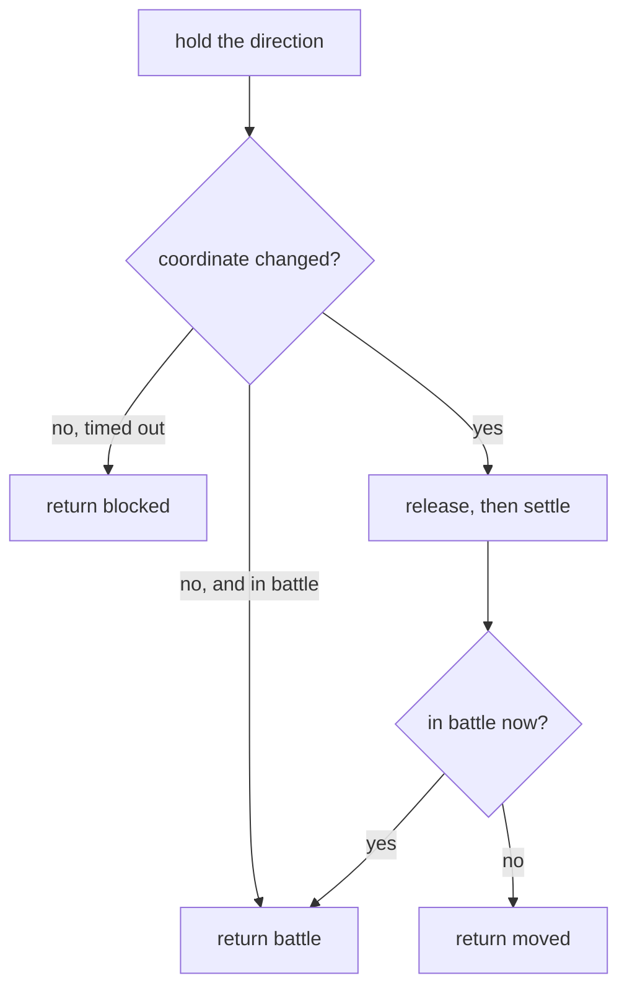
```mermaid
flowchart TD
    A["hold the direction"] --> B{"coordinate changed?"}
    B -- "no, and in battle" --> BAT["return battle"]
    B -- "no, timed out" --> BLK["return blocked"]
    B -- "yes" --> C["release, then settle"]
    C --> D{"in battle now?"}
    D -- yes --> BAT
    D -- no --> OK["return moved"]
```

`blocked` is an answer, not a failure: it is how a plan discovers that something
the collision map cannot see — an NPC — is standing in the way.

<details>
<summary><b>Advanced detail:</b> why "settle" needs two things, not one</summary>

The coordinates change when the game **commits** to a step, not when it
finishes. Returning at that moment reports a tile the player has not reached,
and the next press lands mid-stride while the game still holds the previous
direction — so every step performed the one before it.

Waiting on the coordinate alone is still not enough. `restState()` watches the
coordinate *and* the camera (`wPlayerBGMapOffsetX/Y`), because the camera is
still sliding when the coordinate has already changed: measured, settling on the
coordinate alone returned with the camera six pixels short of rest. Anything
reading the screen at that moment — or working out which tile a tap meant — is
reading a world that is still moving.

At rest the camera offset is `48 - 16 * coord`. It slides during frames 11–22 of
a step while the coordinate changes at frame 23.

</details>

### Planning a walk

`walkTo()` re-plans from where the player actually is, **every step**. A path is
a plan and plans go stale; following one blindly means a single missed step puts
every later step in the wrong place while the walk still reports success.

The planning itself gives up one assumption at a time:

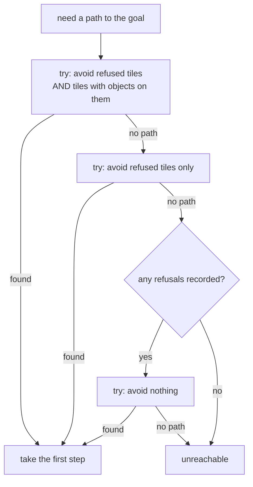
```mermaid
flowchart TD
    S["need a path to the goal"] --> T1["try: avoid refused tiles<br/>AND tiles with objects on them"]
    T1 -- found --> GO["take the first step"]
    T1 -- "no path" --> T2["try: avoid refused tiles only"]
    T2 -- found --> GO
    T2 -- "no path" --> T3{"any refusals recorded?"}
    T3 -- yes --> T4["try: avoid nothing"]
    T3 -- no --> UNREACH["unreachable"]
    T4 -- found --> GO
    T4 -- "no path" --> UNREACH
```

Being too careful and being too trusting fail in opposite directions, so it
tries both in order.

<details>
<summary><b>Advanced detail:</b> the bug that produced the third tier</summary>

Originally a tile that refused a step went into `avoid` **for good**. On Route
30 the only corridor north is one tile wide, so banning it made the goal
unreachable — and the walk gave up before the three-refusal counter could ever
notice it was the same obstacle twice. The log was unambiguous once instrumented:

```
path 6,26->6,0 avoid=0 = 36 steps
step LEFT -> blocked @6,26
path 6,26->6,0 avoid=1 = NULL          <- one refusal sealed the route
```

Dropping the object list second is still the right order, and the reason has
changed. It used to be that the list was what the map *placed* rather than what
was really there — an object hidden by its event flag still had an entry, so
treating those as walls sealed corridors that were open. `occupied()` reads the
live object structs now, so that is no longer true and the list is much better
than it was; what remains true is that it is a **hint**. Somebody standing in a
one-tile corridor is a wall this second until they take a step, and no reading of
memory can tell you which. So the second attempt drops the hint and the third
drops the refusals, and the order says which of the two is more likely to be
stale.

`walkTo` returns `stopped` as one of `null | battle | unreachable | refused |
decode | cancelled | stuck | warped`. `warped` matters: a goal is a tile on one
particular map, and stepping onto a doorway changes the map underneath, at which
point those coordinates mean somewhere else entirely.

</details>

---

## 5. Crossing to the next map

<!-- covers: gen2/journey.js gen2/world.js @ dfe3f2566259 -->

A connection spans only part of a shared edge, so "walk west until something
happens" does not work. `crossEdge()` closes the distance in stages, then tries
the openings.

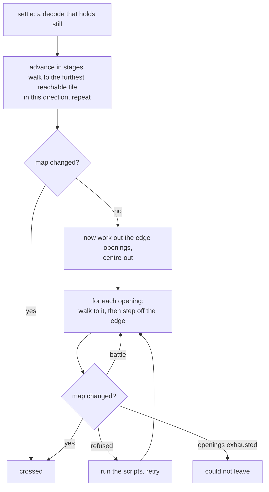
```mermaid
flowchart TD
    A["settle: a decode that holds still"] --> B["advance in stages:<br/>walk to the furthest reachable tile<br/>in this direction, repeat"]
    B --> C{"map changed?"}
    C -- yes --> DONE["crossed"]
    C -- no --> D["now work out the edge openings,<br/>centre-out"]
    D --> E["for each opening:<br/>walk to it, then step off the edge"]
    E --> C2{"map changed?"}
    C2 -- yes --> DONE
    C2 -- "battle" --> E
    C2 -- "refused" --> SCR["run the scripts, retry"]
    SCR --> E
    C2 -- "openings exhausted" --> FAIL["could not leave"]
```

Three things in that diagram were each a separate bug.

<details>
<summary><b>Advanced detail:</b> all three, in the order they were found</summary>

**1. Openings are found centre-out, and filtered before sorting.** Sorting the
whole edge and taking the nearest few tried eight walls in a row: New Bark's west
side only opens at rows 8, 9, 12 and 13, and the player leaves the lab at row 3,
so every candidate near them is fence. Centre-out because a route's connection
sits inland of its corners.

**2. The staged advance exists because a route is longer than one plan.** Route
30 is fifty-four tiles top to bottom and fenced with ledges, so the opening at
the far end is not reachable in one plan from the near end. `furthestToward()`
BFSes from the player and returns the reachable tile furthest in the wanted
direction; the crossing walks there and asks again.

**3. The openings are computed *after* the advance, not before.** This was the
real cause of what looked like flakiness. Coming through a door, the decode has
not settled — and an edge measured then belongs to whatever map was still
loaded. Two failing crossings were caught in a log, both starting on a doorway
(Mr. Pokémon's, and the Pokémon Center), both spending every attempt walking at
tiles that had never been openings. With the settle and the re-measure, six
crossings in a row cross first time.

**Warp carpets are directional.** Most warps fire the moment you step on them.
Carpets do not: `CheckDirectionalWarp` wants the way the carpet points — `0x70`
DOWN, `0x76` LEFT, `0x78` UP, `0x7e` RIGHT. Standing on one and pressing
anything else simply walks you off it, which is what made the front door of the
player's house look like a wall that could be reached but never opened.
`CollisionMap.pushFor()` returns the required direction.

**Every leg of a journey is a `longWalk`.** `walkTo` defaults to eighty steps,
which is a plan inside a building; a route is not, and Route 30 is fifty-four
tiles top to bottom on its own. That number was written out as `maxSteps: 260`
at four call sites — so the fifth, the approach to something lying on the
ground, was handed the default by omission. It has a name now, and the five
share it. Running out of steps is worth naming for what it looks like from
outside: a walk cut short reports the same `stopped` as a tile that refused, so
the wrong budget reads as the map being in the way.

**A battle is not a try.** `through()` walks to a doorway and re-asks, up to
eight times. Every wild encounter used to spend one of those eight — and a
battle is progress-neutral rather than a failure: the walk got partway, something
jumped out, and asking again from where it stopped converges. Counting it made
the budget a function of the *grass* rather than of the distance, which is the
same mistake as the [refused leg](#travelling-further-than-one-map) one pass
earlier: two things counted as one. Battles have their own allowance now —
forty — and only a walk that came back for some other reason spends a try. The
allowance is what keeps *not counted* from meaning *forever*. It has not been
seen to rescue a walk on the cartridge yet; it is a budget that was measured
against the wrong thing, fixed on the way past.

**A gate at an edge is not a phone call.** `crossEdge` answers a refusal by
running the scripts and asking again, because out there a refusal usually *is*
somebody talking — Elm phones the moment you leave Mr. Pokémon's, and treating
that as terrain ended the walk home. A gate answers the same way and never
stops: measured driving at Route 32's southern connection with no badge, twelve
staged advances and then thirty attempts for each edge opening, each walking the
length of a ninety-tile route — **over two and a half minutes, and still going**.
From outside, a job that had hung. Counted rather than repeated, the same walk
takes 5.7 seconds and writes off two legs. See [a route the game itself
refuses](#8d-a-route-the-game-itself-refuses).

**A refusal with words on the screen is somebody talking.** `walkTo` reports
`refused` when three steps in a row are blocked, and that is exactly what a
running script looks like from outside — so the pilot answered it by pressing A
and walking at the same tile eight times over, then said the door could not be
reached.

Measured on Route 32, and it is worth saying what it was, because the diagnosis
was wrong twice before it was right. The first Pokémon Center the pilot ever
**found** rather than was told about is on that route: the door at (11,73), a
real ninety-six-step path to it, and the heal failed every time. Ninety tiles of
grass looked like the answer, and it was not. Two tiles south of Violet a man
says *"Wait up! What's the hurry? Have you gone to the POKéMON GYM? It's a rite
of passage for all trainers"* and puts the player back where they started.
**Falkner's badge opens that route and nothing else does.** The discovery, the
door and the path were all correct; the failure message was the defect.

So the words are kept, and the second time the same thing happens the walk stops
and says them — `turned back on the way to ROUTE 32 — Wait up! / What's the
hurry?` instead of `could not heal (stopped in ROUTE 32)`. Two attempts and
0.6 seconds on the cartridge, against eight and thirty. A *silent* refusal still
spends its tries, because that one really is a tile somebody is standing on, and
re-asking is how it gets walked around.

</details>

### Travelling further than one map

`travelTo()` asks the graph for a route and walks one leg at a time, re-asking
from the map it actually landed on. A leg that fails is retried up to three
times — measured, the same leg failed on one run and worked on the next, so one
refusal is not an answer.

**And `placesFrom(here)` says where it is worth offering to go**, which is what
the [Travel row](USING.md#travel-take-me-somewhere-else) is built from. It had
none of this for fifteen versions: `travelTo` could cross the whole of Johto and
the only thing that ever called it was healing and the ball errand, so the
interface could walk you around the map you stood on and no further.

Two rules, and both are about what this layer can honestly know.

- **Only places the title has named.** The graph reaches everything walkable,
  which on a real cartridge is hundreds of maps, and two hundred rows reading
  `map 26.4` is a data dump rather than an offer. A title's `names` are exactly
  the places somebody chose to write down.
- **Only places the graph says are reachable**, asked in one search rather than
  one per candidate. Offering a walk that cannot happen is worse than not
  offering it, and the answer changes as you move: from inside a building the
  only way out is the door.

Sorted by legs, nearest first, ties keeping the order the title wrote them in.
A cartridge nobody has described gets an empty list and no row — the rule the
scripted intro and the errand already follow.

---

## 5a. How the tasks are arranged

`tasks.js` used to be one class: 1335 lines, thirty-seven methods, five
unrelated jobs. It is now four files and a line of composition.

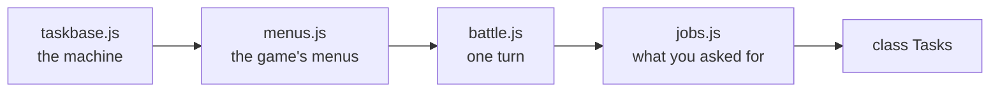
```mermaid
flowchart LR
    tbase["taskbase.js<br/>the machine"] --> menus["menus.js<br/>the game's menus"]
    menus --> btl["battle.js<br/>one turn"]
    btl --> jobs["jobs.js<br/>what you asked for"]
    jobs --> T["class Tasks"]
```

Split by what a method is *about*, not by size. `taskbase.js` talks to the
emulator — the snapshot, the settle, the cursor read. `menus.js` drives menus
the game already had: the intro, START, saving. `battle.js` is one turn:
choosing an action, a move, a ball, and reading what happened. `jobs.js` is the
handful of things a person actually asks for, and is the only file the interface
calls into.

<details>
<summary><b>Advanced detail:</b> why mixins, and what the split had to preserve</summary>

**They are mixins rather than collaborators** — `withJobs(withBattle(withMenus(
TaskBase)))` — because `this` has to keep meaning the same object. Every method
here reaches for `this.gb`, `this.snap()`, `this.say()`; splitting into objects
that hold each other would have meant several hundred lines of delegation whose
only purpose is to look like a refactor. The prototype chain reads
`Tasks → WithJobs → WithBattle → WithMenus → TaskBase`, and each class is named
so a stack trace says which one a frame came from.

**Nothing was retyped.** The methods were moved by extracting their exact line
ranges, comments included, so the diff is a move rather than a rewrite. The
public surface was then compared before and after: nothing lost, two helpers
gained.

**The safety net came first.** This split landed the commit after the tests did,
and that order was the point — nineteen tests and eight static checks make a
mechanical move of 1300 lines something you can verify rather than hope about.
The service worker's shell check caught the four new files immediately, which is
exactly the kind of thing a move like this forgets.

**Stop unwinds rather than being polled for.** Every loop that drives the
machine goes through `step()` or `push()` on the base, and those throw
`Cancelled` if Stop has been pressed — before advancing and after. That makes
cancellation one decision instead of seventeen: the loops used to check
`this.cancelled` only in the outer jobs, so a Stop pressed during `awaitQuiet`
did nothing for 250 polls. Measured in the browser afterwards: it now unwinds in
0.9 ms. Jobs still handle the tidy case themselves and return their own message;
`runTask` catches the sentinel for the case where it interrupts a primitive, and
reports it as a stop rather than as a failure.

**One table says what a capture outcome means.** `captureHere` reports a code
and two callers translated it — a switch in `catchHere`, an if-chain in
`catch_` — which had drifted to eleven cases against six. `CAPTURE_OUTCOMES`
holds the message and a `stop` flag, that flag being the only thing the two
callers legitimately disagree about: a knockout ends a single catch and is bad
luck to a hunt that can go and find another.

**`menuCursor()` is the one behaviour change.** The two-line incantation for
reading the menu window appeared five times in the save-driving code; it is one
method on the base now. That is a read of a handful of bytes rather than the
eight kilobytes a full snapshot copies, which is worth keeping distinct.

</details>

## 6. Battles

**`fightBattle` has a fifth answer now: `nopp`.** Having PP is not the same as
having a move that could end a battle, and the difference is a battle that
cannot be won — measured with TACKLE on 0 of 35, LEER and SMOKESCREEN full, and
a Lv2 Caterpie at 1 HP in a trainer battle that cannot be fled. `canStillWin`
asks the second question before the first swing rather than after forty turns,
and a Pokémon Center restores PP, so the grind treats it as a trip it already
knew how to make. See [the tiles that run a
script](#8g-the-tiles-that-run-a-script-and-saying-hello) for the walk half.

<!-- covers: gen2/tasks.js gbcore/taskbase.js gen2/battle.js gen2/jobs.js gen2/state.js @ e5825a45295a -->

### Which move, and which question

**Winning a battle picks the hardest move that can be used; catching something
picks the gentlest.** The second half existed from the start, for a reason worth
repeating — a Poké Ball's odds depend on how much HP is left, so hitting with
slot one knocks out the very thing you are trying to catch. The first half did
not exist at all. `chooseMove` fell back to `usable[0]`, which is slot order,
and slot order is not a strategy.

Measured. A Chikorita's slots are Tackle, Growl, Razor Leaf, Reflect. Sixty-four
battles into a grind Tackle's PP was gone, so slot order handed back **Growl** —
which lowers Attack and takes no HP off anything — while Razor Leaf sat in slot
three at 25 PP. The battle could not end, `fightBattle` returned `stuck` forty
turns later, five of those in a row tripped the stall detector, and the grind
gave up at 3 HP out of 36 holding a 55-power move it had never tried.

**And "out of PP" now means out of PP that can win.** The old test asked whether
any move had PP; Growl at 3 PP answered yes, so the grind never went to heal and
kept swinging a move that cannot end a fight. A move the cartridge cannot be
read for counts as usable, because *I cannot tell* is not a reason to walk away
from a fight.

| | before | after |
| --- | --- | --- |
| Chikorita, Lv5 → Lv16, Route 29 | 64 battles, 59 won, **stalled at Lv13** | 122 battles, **122 won**, reached Lv16 in 155s |

**One thing during turn resolution is a question rather than text.** A Pokémon
with four moves that levels into a fifth is asked *delete an older move to make
room?* — a two-row YES/NO box with YES under the cursor — inside a loop that
presses A up to a hundred and twenty times. Measured: the same Chikorita reached
Lv15 and came out of the battle holding `[POISONPOWDER, GROWL, RAZOR LEAF,
REFLECT]` where it went in holding `[TACKLE, ...]`. Tackle was not chosen away;
it was top of the list when a stray A landed.

`learnMoveBox` tells that box from everything else drawn in a battle, on a
signature read off the cartridge at the instant the moveset changed: two items
at border row 7. The battle menu is thirty-four at row 12, the pack five at row
1, and the pack mid-throw is *also two items* — at row 0, which is why the row
is what distinguishes them rather than the count. It reads the engine off the
instance rather than a module constant, so a title that moved the box is matched
where it moved it.

The policy is **decline**, and it is a policy rather than an omission: the pilot
cannot know which of four moves you value, a declined move can be taught by hand
afterwards and a deleted one cannot, and `chip` reasons about this very move list
to pick the gentlest attack — so a set that changes underneath it breaks the one
piece of reasoning this app does about moves.

**Declining takes two answers, and the first version only gave one.** Gen 2 asks
twice: *delete an older move to make room?* and then, on a no, *give up on
learning it?* — and **the second one wants YES**. Say no to both and they loop,
because no to the second means *carry on learning it* and puts the first back on
screen.

Measured, grinding the same Chikorita to Lv15: the guard fired **four times**,
the cursor walking 1, 2, 1, 2, 1 — and the moveset still came out as
`[POISONPOWDER, GROWL, RAZOR LEAF, REFLECT]`, because once the loop had gone
round enough times a stray A from the turn presses landed on the delete prompt.
Firing was not the same as working.

So the answers are asymmetric and the order carries the meaning: NO closes the
door, YES accepts closing it. Both boxes carry the same signature — they are one
widget asked twice — so `declineNewMove` does not try to tell them apart by
looking. It relies on the sequence: `answerNo` returns true only after pressing A
on the NO row, so a box still up after that is the second question.

| | before | after |
| --- | --- | --- |
| Chikorita over Lv15 with four moves | `[POISONPOWDER, GROWL, RAZOR LEAF, REFLECT]` | `[TACKLE, GROWL, RAZOR LEAF, REFLECT]` |

**And it reaches for the bag before the thing on the field faints.** For
twenty-three passes this loop chose FIGHT every turn until something dropped —
and a knockout in Gen 2 takes half your money and puts you back at a Center. The
grind's answer to one has always been to heal up and carry on, *after* the fact.
The pilot was carrying potions through every one of them, because nothing in
this loop had ever opened the pack.

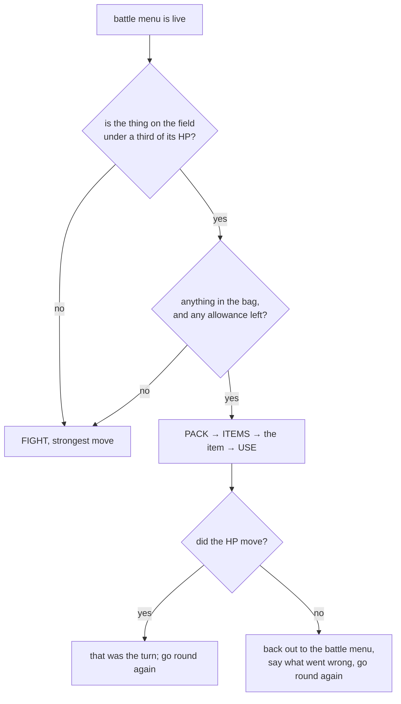
```mermaid
flowchart TD
    M["battle menu is live"] --> F{"is the thing on the field<br/>under a third of its HP?"}
    F -- no --> FIGHT["FIGHT, strongest move"]
    F -- yes --> B{"anything in the bag,<br/>and any allowance left?"}
    B -- no --> FIGHT
    B -- yes --> P["PACK → ITEMS → the item → USE"]
    P --> V{"did the HP move?"}
    V -- yes --> T["that was the turn; go round again"]
    V -- no --> BK["back out to the battle menu,<br/>say what went wrong, go round again"]
```

The boxes are the ones measured on the cartridge, on a Cyndaquil at 9 of 21:
PACK draws the same `5/1` box the field pack does, the item draws USE/QUIT at
`2/7`, confirming draws `2/0`, **the HP moves on the press after that**, and the
pocket is not written back until the box closes. So HP is the evidence here too.

Three items per battle, and low on purpose: a fight that needs four is a fight
that should have been run from, and spending the bag on it is worse than losing
it. Which items count is passed in — an item name is content and this file is
the engine — so a cartridge nobody has described fights exactly as it did.

<details>
<summary><b>Advanced detail:</b> the two boxes that share a signature, and the
press that vanishes</summary>

**`battlePack.use` is the same shape as `learnMove`** — two items at row 7 — and
that is written down rather than deduplicated. They are two different questions
that a snapshot cannot tell apart, and only the context can: the learn-move box
appears while a turn is resolving, and this one only while the pack is being
driven. Any code that could be in both states at once would answer the wrong
one, which is why `useItemInBattle` finishes before the turn loop resumes.

**A swallowed PACK press is not a pack that will not open**, and reading it as
one cost a knockout. Measured: three attempts in one battle came back *the pack
never opened*, spending the whole three-item allowance, after which the Pokémon
fought on at 4 of 18 and fainted. The pack itself opens in under twenty frames —
measured separately, by pressing PACK and sampling at 20, 40, 60 and 90 — so what
happens is the A press landing while the turn's text is still running and
vanishing. `_openBattlePack` presses, looks, and presses again, which is the
discipline `_packMoved` already applies one level down.

**And `closeMenus` cannot succeed inside a battle.** It presses B until *no
window is open*, and the battle menu is a window B will not close — so it could
only ever exhaust its budget and report failure, which is honest and useless.
The resting state in a battle is the battle menu, so `_backToBattleMenu` presses
toward that instead. Worth noting as a consequence of making `closeMenus` check
itself one pass earlier: the fix turned a silent waste into a reported one, and
the report is what named the wrong caller.

</details>

**And evolution is allowed and said out loud.** It is the last item in the list
of things this job had no policy for. Letting it happen is what somebody
grinding expects and cancelling would be the surprising choice — but it went by
in silence, and a rename mid-job reads as the pilot having lost track of what it
is training. Measured: `#152` became `#153` at Lv16 and nothing mentioned it.
Now the log says *CHIKORITA evolved into BAYLEEF* where it happens, and
`stats.evolved` comes back with the rest.

**"Where it happens" took a second pass to be true.** The check read `mon` — the
snapshot taken at the *top* of the iteration, which is the party as it was
before the battle that did the evolving — so the line came out one battle late.
And the level break sits above it:

```
while (battles < max) {
  s = await snap()            // first sight of what the last battle did
  if (mon.level >= toLevel) break   ← the job ends here
  ...fight...
  if (mon.species !== wasSpecies)   ← never reached on the last battle
```

So an evolution in the battle that *reached the target* was never reported at
all — and that is the likeliest battle for one, being the one that gains the
last level. `noteEvolution` is called with a fresh snapshot instead, above both
breaks and again on the closing read, which is where the loop's own exits land:
the battle budget running out, and a Stop. Three tests, one per exit, and the
job now has a test file at all — `grind` had none in twenty-one versions, which
is an odd place for the one job people leave running.

The end-to-end run: **Lv5 to Lv17 in 192 seconds, 159 battles, 158 won, one
knockout healed through, one evolution — and all four original moves still in
place.**

**And the grind now says *why* it needs healing, because the two answers
differ.** The bag mends HP; nothing but a Center mends PP. This loop's own
comment has said for six passes that it terminates *only* because a Center does
both — and the day the bag arrived, handing it a bag heal for everything proved
that comment right: measured, it spent all twelve trips at Lv8 on a Pokémon at
**full health** with no move left that could win. A loop with no exit, predicted
in a comment above the line that broke it.

So the reason goes to the caller, which is the only place that knows what each
of its ways to heal actually does:

| Why | What the caller does | Because |
| --- | --- | --- |
| `dry` — nothing left that can win | walk to a Center | only a Center restores PP |
| `hurt` — low on HP | ask the bag, then walk | a POTION in the pocket is free |
| a knockout | walk to a Center | a potion does nothing at 0 HP |

The counter that bounds those trips was called `heals` until the bag's list of
healing items arrived as an option and the names collided. The collision was the
tell: it has never counted heals — the bag mends things without one — it counts
**walks**, which is the thing the budget is a budget for. It is `trips` now.

**Measured end to end, twice.** Before the bag reached this loop: Lv5 to Lv17 in
192 seconds, 159 battles, one knockout. After: **Lv5 to Lv14 in 132 seconds, 79
battles, 79 won, no knockouts**, three items spent inside battles and three walks
for PP.

One loose end, recorded rather than smoothed: in that run the decline's own log
line was not captured, though it was captured in the run before. The outcome is
unambiguous — the moves survived where they previously did not — but the
mechanism's evidence spans two runs rather than one.

### The bigger number is not the harder hit

<!-- covers: gen2/romdata.js gen2/engine.js gen2/battle.js @ 331146343c65 -->

For twenty-three passes the pilot ranked its moves by one number: the `power`
byte out of the cartridge's move table. `romdata.move()` had been returning the
move's **type** all along, and nothing in the app had ever read it.

So the ranking was confidently wrong wherever the type chart disagreed with the
power byte, and on this cartridge it disagrees early and often:

| Situation | Ranked by power | What the chart says |
| --- | --- | --- |
| CHIKORITA against a BELLSPROUT in Sprout Tower | RAZOR LEAF, 55 | Grass on Grass/Poison is a **quarter** — 20.6 against TACKLE's 35 |
| CHIKORITA against a ZUBAT on Route 32 | RAZOR LEAF, 55 | Poison/Flying, also a quarter, also 20.6 |
| TOTODILE against a GASTLY in Sprout Tower | SCRATCH, 40 (a tie, and ties keep the first) | Normal on Ghost is **nothing at all**; WATER GUN is 60 |

The last row is not "slower", it is a battle that cannot end. A Normal move on
a Ghost does no damage, so the enemy's HP never moves, so `fightBattle` presses
on until it reports `stuck` — the same dead end that `canStillWin` was written
for, arrived at from a direction it cannot see, because the move *does* have
power.

**The chart is in the cartridge, so it is read from the cartridge.** `Moves`
gave the type; `TypeMatchups` gives what the types do to each other.

```
TypeMatchups:
    db NORMAL,   ROCK,  NOT_VERY_EFFECTIVE   ; 00 05 05
    db NORMAL,   STEEL, NOT_VERY_EFFECTIVE   ; 00 09 05
    ...                                        110 rows in all
    db -2                                    ; fe   one byte, not a row
    db NORMAL,   GHOST, NO_EFFECT            ; 00 08 00
    db FIGHTING, GHOST, NO_EFFECT            ; 01 08 00
    db -1                                    ; ff   the end
```

Three things about that layout are worth stating, because each of them is a way
to read it wrongly and get a chart out rather than an error:

- **The multiplier is in tenths, and neutral is not written down.** Only 0, 5
  and 20 appear — seven immunities, fifty-seven halves, forty-six doubles. A
  pair the table never mentions is neutral, so a miss is an answer and not a
  gap. That is why `matchups()` hands back the map and lets `matchup()` decide
  what a miss means, instead of trying to fill in a grid of 289 pairs it was
  never told about.
- **`$fe` is one byte where every row is three.** It marks the rows Foresight
  cancels. Read it as a row and it swallows the row behind it — `NORMAL` on
  `GHOST` — and shifts everything after by two bytes. Which is silent: what
  comes out is still a chart, just not this cartridge's, and the one matchup it
  loses first is the one that stops a battle dead.
- **A table that does not end where a table ends is not a table.** A symbol
  file pointing at the wrong place reads a bank of zeroes, which decodes to
  exactly one row: NORMAL on NORMAL, immune. A pilot believing that prices
  every move it owns at nothing. So running off the end of the scan without
  finding `$ff` answers **null**, and null falls back to raw power.

**Two scalings, and only one of them needs the chart.**

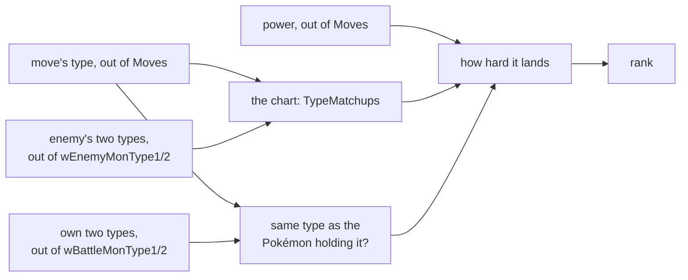
```mermaid
flowchart LR
    P["power, out of Moves"] --> H["how hard it lands"]
    T["move's type, out of Moves"] --> M["the chart: TypeMatchups"]
    E["enemy's two types,<br/>out of wEnemyMonType1/2"] --> M
    M --> H
    T --> S["same type as the<br/>Pokémon holding it?"]
    A["own two types,<br/>out of wBattleMonType1/2"] --> S
    S --> H
    H --> R["rank"]
```

The same-type bonus asks nothing but the move's type and the Pokémon's, both of
which are readable without a chart — so a cartridge whose symbol file has no
`TypeMatchups` keeps that half and loses the matchup. What it falls back to is
ranking by power, which is what this replaced.

**Both sides of the matchup are read from the field, not from the party.**
`wBattleMonType1/2` rather than the party entry's, because those are the types
the bonus is actually paid on and a battle can change them.

**Gen 2 stores a single-typed Pokémon as both of its types.** RATTATA is
NORMAL/NORMAL. Multiply once per slot and every multiplier is squared: a Grass
move on a Water/Water POLIWAG came out at four rather than two. The game applies
each matching row once whichever slot matched it, so `effectiveness` deduplicates
the types before multiplying. A genuinely dual-typed defender still collects
both rows — Fire on a Grass/Bug PARAS doubles twice, and ×4 is correct.

**And a battle nothing carried can touch is now its own word** — though the
word is the fallback rather than the answer; see [sending out somebody who can
touch it](#sending-out-somebody-who-can-touch-it). This is the
same dead end `canStillWin` was written for, reached from the direction it
cannot see: the move *has* power, so it counts as one that could end a battle,
and the chart says the swing takes nothing off. `nothingLands` asks the other
question, and `fightBattle` asks it on the first turn rather than the
fortieth — forty turns to arrive at `stuck` is time nobody gets back, and
`stuck` is not a thing a person can act on.

The word matters because the *remedies differ*, and a walk cannot tell them
apart while whoever reads the message must:

| word | what happened | what fixes it |
| --- | --- | --- |
| `nopp` | nothing with PP left does damage | a Center, which restores PP |
| `notouch` | full PP, none of it can touch what is in front of it, **and nobody on the bench can either** | a different move, or a Pokémon that is not in this party |
| `stuck` | the loop ran out of turns and cannot say why | look at the screen |

So `grind` **stops** on `notouch` rather than walking to a Center: a Center
does not teach a move, and healing to come back at the same wall with a fuller
bar is the sort of loop this app has been written to notice. And like every
other null in here, `nothingLands` answers *false* when it cannot read the
chart — cannot tell must never become do not swing.

**The chart reorders the list; it never empties it.** `strongest` still chooses
*which moves are candidates* by raw power, and only their order by the chart.
That is deliberate and it is the second time this loop has learned it: filter on
the scaled number and a Normal-only moveset facing a Ghost prices every attack
at zero, empties the pool, and falls back to slot order — which is how a grind
came to choose GROWL in the first place. A move that does nothing is still a
better answer than a move that cannot.

`chip` is the same question backwards and gets the same fix. It wants the
*softest* hit, so it was picking the smallest number — and against a Grass
target EMBER at 40 doubled hits harder than RAZOR LEAF at 55 halved. One
exception: a move the target is immune to is the gentlest thing imaginable and
weakens it forever, so that one is taken **out** of the pool rather than put at
the front of it. `canHit` answers that, and answers true wherever it cannot
tell — "cannot say" must not become "do not swing".

**What the log says.** Naming the move every turn buries everything else in it,
so `movePicked` says something only when the chart does: `EMBER — super
effective`, `TACKLE — no effect on this one`. A neutral hit is the ordinary case
and says nothing. The name comes from `MoveNames`, which is packed and
terminated exactly like `ItemNames` — so both now walk the same
`_packedName`, because two copies of that walk was the defect that read ULTRA
BALL as "LTRA BALL".

`tools/types` prints the decoded chart as a grid, checks it against
twenty-two things about Pokémon that were true before this app existed, and
will rank a moveset for a named matchup showing what power alone would have
picked beside what the chart picks. It runs `gen2/romdata.js` — the reader the
pilot uses, not a second one beside it. See section 10.

### Sending out somebody who can touch it

<!-- covers: gen2/battle.js gen2/engine.js @ 9b3b7e04d32f -->

The pass before could tell that the Pokémon on the field takes nothing off a
Ghost, and said so. The remedy it named — *a different Pokémon* — was one the
pilot was **holding and could not reach for**: nothing in this app had ever
pressed PKMN. So `notouch` was the answer; now it is the fallback.

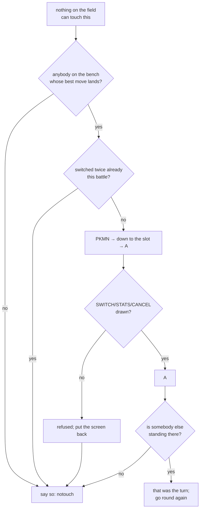
```mermaid
flowchart TD
    N["nothing on the field<br/>can touch this"] --> W{"anybody on the bench<br/>whose best move lands?"}
    W -- no --> S["say so: notouch"]
    W -- yes --> B{"switched twice already<br/>this battle?"}
    B -- yes --> S
    B -- no --> P["PKMN → down to the slot → A"]
    P --> X{"SWITCH/STATS/CANCEL<br/>drawn?"}
    X -- no --> R["refused; put the screen back"]
    R --> S
    X -- yes --> C["A"]
    C --> E{"is somebody else<br/>standing there?"}
    E -- yes --> T["that was the turn;<br/>go round again"]
    E -- no --> S
```

**Two screens, and the second is the one that could not be guessed at.** PKMN
opens the party list; A on a Pokémon opens a box — and *which* box depends on
where you are:

| | first option | second |
| --- | --- | --- |
| the field party menu (`MonMenuOptionStrings`) | **STATS** | SWITCH |
| the battle party menu (`BattleMonMenu`) | **SWITCH** | STATS |

They are opposite. Assume the order you have seen more often and the press
that switches a Pokémon in during a fight opens its stats instead, while the
trainer takes its turn. So the order is **read out of the cartridge**, not
remembered.

**And so is the box's signature, which is the part with no cartridge behind
it.** The Browser pane cannot boot a game in this environment, so there was no
screen to measure — but `BattleMonMenu.MenuHeader` at `09:4ed4` is
`flags, y1, x1, y2, x2`, then a pointer to `flags, count`, then the strings:

```
09:4ed4  00 0b 0b 11 13 dc 4e 01      a box at rows 11-17, columns 11-19
09:4edc  c0 03 "SWITCH@STATS@CANCEL@"  three items, and SWITCH first
```

That layout is derived, and **the derivation reproduces a measurement**: read
the same way, `BattleMenuHeader` comes out as *34 items at row 12*, which is
what `battleMenu` has said since somebody watched it on a real cartridge. A
derivation that agrees with a measurement taken years earlier is worth more
than either alone, and it is why the other headers can be trusted without a
screen. `tools/rom-events --menus` holds all of it, and `check-app menus` runs
it.

**The evidence for a switch is somebody else standing there.** Not the presses
landing, not the box closing — the same rule `sendOut` learned the hard way,
where choosing a fainted Pokémon is refused with *There's no will to battle!*
and no reading of a cursor would have predicted it. The party list's cursor is
not in memory at all: `sendOut` diffed all 8KB across a press and found 87
changed bytes with no index among them, because the arrow is drawn from sprite
data.

**Two switches a battle, and low on purpose.** A switch *is* the turn — the
enemy attacks the Pokémon coming in — so a loop that switches whenever a
matchup is poor hands over every turn and takes none. This is not a strategy
for playing well, it is an escape from a battle that cannot otherwise end: the
first switch answers the hopeless matchup, the second answers the one after it
if the replacement faints, and past that the honest answer is the sentence the
pilot used to give straight away. A *refusal* is counted against the same
budget, because that is what stops a screen which will not cooperate becoming
a loop.

**A party member's types come from the ROM, and they have to.** Gen 2 does not
keep a Pokémon's types in the party struct — they are copied out of `BaseData`
when it is sent out, which is why work RAM has `wBattleMonType1` for the one on
the field and nothing at all for the five behind it. So a decision about
*which* Pokémon to send has to read the cartridge, and `romdata.speciesTypes`
is that read. It also retired a second copy of the same reader; see
[`romdata.js`](#romdatajs--what-the-cartridge-knows).

**The switch is only ever offered on evidence.** `switchFor` answers null
wherever the chart cannot be read, like everything else built on it — and here
the reason is sharper than usual: a switch costs a turn *whether or not it was
needed*, so guessing that a matchup is bad and handing over a turn to fix it is
worse than fighting on.

### Is it our turn?

Everything in a battle depends on knowing when the game is waiting for a
choice. Getting this wrong is the single most expensive mistake in this
codebase, so it is worth understanding exactly.

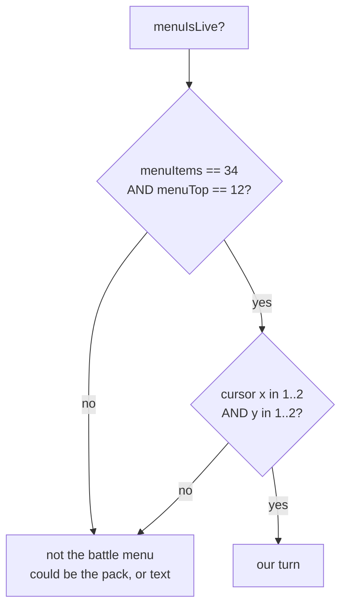
```mermaid
flowchart TD
    A["menuIsLive?"] --> B{"menuItems == 34<br/>AND menuTop == 12?"}
    B -- no --> NO["not the battle menu<br/>could be the pack, or text"]
    B -- yes --> C{"cursor x in 1..2<br/>AND y in 1..2?"}
    C -- no --> NO
    C -- yes --> YES["our turn"]
```

<details>
<summary><b>Advanced detail:</b> the two wrong versions, and what each cost</summary>

**Version one required `wBattleMenuCursorPosition == 0`.** That register holds
the action *last chosen*, not whether the menu is waiting: it is 0 until the
first choice of a battle and keeps that choice afterwards. So the test matched
only the opening turn and was false for every turn after. Measured at a menu
plainly live and taking input, it read 3.

That one line broke four things at once: `awaitBattleMenu` spent 150 presses and
returned null, `flee` could not tell a refusal from an escape, `fightBattle`
could not see its turn come round, and `watchThrow` could not see a Pokémon
break free. The 150-press ceiling had been raised from 40 to paper over it.

**Version two used the cursor alone.** But the pack parks the cursor at `(1,1)`
too — so a ball in mid-air read as a fresh menu, and the throw was abandoned
while the game was still saying "used the POKé BALL". That is how a single catch
attempt could burn five balls and catch nothing.

Which menu is *drawn* settles it. Measured:

| state | `wMenuDataItems` | `wMenuBorderTopCoord` |
| --- | --- | --- |
| battle menu | 34 | 12 |
| pack | 5 | 1 |
| pack, mid-throw | 2 | 0 |
| post-catch text | 2 | 7 |

The move menu shares the battle menu's box, and that is fine — both mean the
game is waiting on us.

</details>

### Playing out a battle

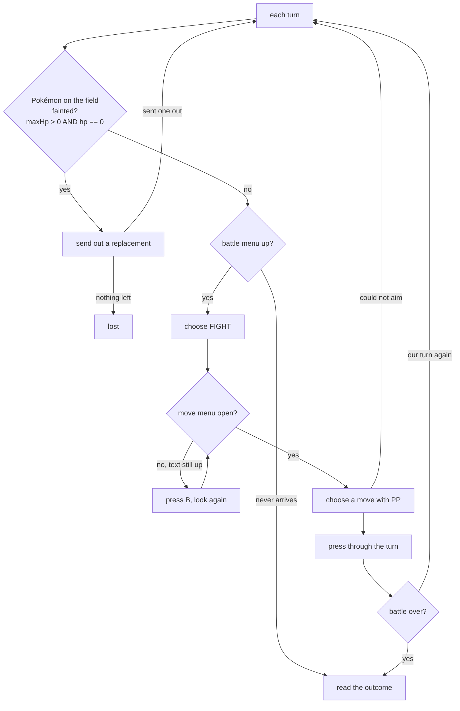
```mermaid
flowchart TD
    A["each turn"] --> F{"Pokémon on the field<br/>fainted?<br/>maxHp > 0 AND hp == 0"}
    F -- yes --> SO["send out a replacement"]
    SO -- "nothing left" --> LOST["lost"]
    SO -- "sent one out" --> A
    F -- no --> M{"battle menu up?"}
    M -- "never arrives" --> OUT["read the outcome"]
    M -- yes --> FI["choose FIGHT"]
    FI --> MM{"move menu open?"}
    MM -- "no, text still up" --> B["press B, look again"]
    B --> MM
    MM -- yes --> PICK["choose a move with PP"]
    PICK -- "could not aim" --> A
    PICK --> RES["press through the turn"]
    RES --> E{"battle over?"}
    E -- yes --> OUT
    E -- "our turn again" --> A
```

<details>
<summary><b>Advanced detail:</b> four traps in that one flow</summary>

**"Not in battle any more" is not "won".** Whiting out ends the battle too, and
reading that as a win let a grind report five straight victories with the party
at 0 HP, then wake up in bed wondering why the map had changed. `_outcome()`
checks whether every party member is at 0 HP.

**A move with no PP is chosen forever.** The move menu does not open while a
message is up, and the cursor reads 0 then — so move selection was skipped and
the A-mashing fallback picked the first move, the one with no PP, producing the
same message. **Eighty-four "battles" in one grind were that single refusal
going round.** `chooseMove` now confirms only when the cursor really is on the
move it meant, and `fightBattle` presses B and looks again rather than pressing
A into a message.

**Out of PP is a reason to heal**, not to fight on: the game forces Struggle,
which hurts the thing being trained, and a Pokémon Center restores PP.

**Three loops drive a battle, and each has to answer the same two questions.**
That is not obvious from any one of them, which is exactly how `sendOut` came to
be wired into one and not the other two:

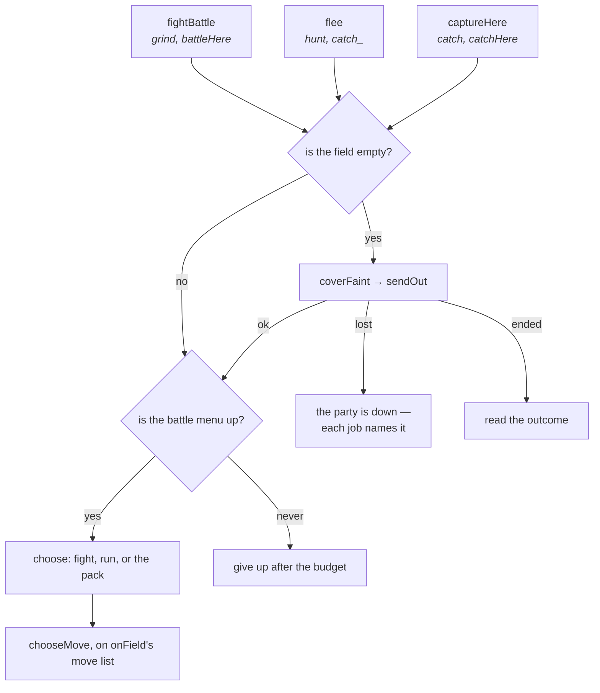
```mermaid
flowchart TD
    F["fightBattle<br/><i>grind, battleHere</i>"] --> Q1{"is the field empty?"}
    L["flee<br/><i>hunt, catch_</i>"] --> Q1
    C["captureHere<br/><i>catch, catchHere</i>"] --> Q1
    Q1 -->|yes| CF["coverFaint → sendOut"]
    Q1 -->|no| Q2{"is the battle menu up?"}
    CF -->|"ok"| Q2
    CF -->|"lost"| WO["the party is down —<br/>each job names it"]
    CF -->|"ended"| OUT["read the outcome"]
    Q2 -->|yes| ACT["choose: fight, run, or the pack"]
    Q2 -->|"never"| GIVE["give up after the budget"]
    ACT --> MOVE["chooseMove, on onField's move list"]
```

Both diamonds were got wrong by omission rather than by logic. Only
`fightBattle` asked the first, so fleeing and catching walked straight into a
prompt and spent their whole press budget on the second question, which had no
answer coming. And `chooseMove` took its list from `party[0]` rather than from
`onField`, so once the first diamond *had* been answered the moves belonged to
the Pokémon that had just fainted.

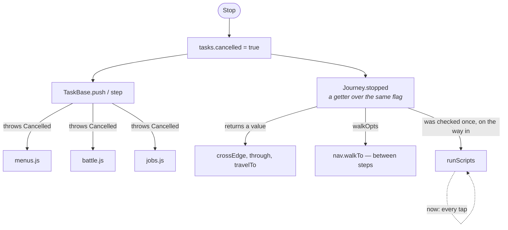
```mermaid
flowchart TD
    B(["Stop"]) --> F["tasks.cancelled = true"]
    F --> T["TaskBase.push / step"]
    F --> J["Journey.stopped<br/><i>a getter over the same flag</i>"]
    T -->|"throws Cancelled"| M["menus.js"]
    T -->|"throws Cancelled"| BA["battle.js"]
    T -->|"throws Cancelled"| JO["jobs.js"]
    J -->|"returns a value"| CE["crossEdge, through, travelTo"]
    J -->|"walkOpts"| NV["nav.walkTo — between steps"]
    J -->|"was checked once, on the way in"| RS["runScripts"]
    RS -.->|"now: every tap"| RS
```

**Stop reaches every pressing loop, and there are two mechanisms for it.**
`TaskBase.push` and `step` throw `Cancelled` on every press, which covers
`menus.js`, `battle.js` and `jobs.js` without any of them knowing. `Journey` is
not a `TaskBase` — it presses through `this.gb` — so it reads the same flag
through a `stopped` getter and returns a value instead of throwing, and hands
`walkOpts` to every walk so a Stop lands between steps rather than at the end of
a leg.

`runScripts` was the hole in that, and it is the loop most worth interrupting:
by its own account Mom's scene is about 190 taps, and Stop was checked once on
the way in and then not again for up to four hundred. Pressing Stop in the
middle of a cutscene — which is exactly where somebody would — did nothing until
it ended.

**A fainted lead is a prompt, not a state.** Gen 2 does not offer a choice — the
lead goes down, the game asks "Which POKéMON?" and waits. With a party of one it
never came up because the battle simply ended. Three separate things had to be
right:

- *"No HP" and "no Pokémon loaded yet" read identically.* At "Wild PIDGEY
  appeared!" the battle mon is not loaded and both `hp` and `maxHp` are zero, so
  keying off `hp` alone fired at the start of every battle — five stuck battles
  in four tenths of a second, having sent nothing out.
- *That screen's cursor is not in memory anywhere findable.* `wMenuCursorY`
  stays pinned at 1 on it, `wPartyMenuCursor` and `wCurPartyMon` never move, and
  diffing all 8 KB of work RAM across a press turns up 87 changed bytes with no
  index among them — the arrow is drawn from sprite data. So `sendOut()` does
  not read the cursor: it steps down to the slot it wants, confirms, and checks
  whether something is actually on the field. Which is the better test anyway,
  because choosing a fainted Pokémon is *refused* with "There's no will to
  battle!" and no cursor reading would have predicted that.
- *The screen ignores the presses the battle menu takes.* At five frames every
  direction was swallowed, so every confirm landed on the fainted lead. It wants
  about twelve frames **and** a pause between presses — the prompt arrives with
  "CYNDAQUIL fainted!" still running and a direction sent into that is dropped.
- *And once a replacement is out, the move list belongs to it.* This was the
  fourth thing, and it was missed for two years of versions because `sendOut`
  arrived after the code that reads moves. `active` carries `hp` and `maxHp` and
  no move list, so the moves come from a party entry — and that entry was
  `party[0]`, which is the lead, which after a switch is the corpse. `onField`
  matches the party against the battle mon's HP pair instead, taking the first
  that matches: several can, since two untouched slots of the same species read
  alike, and every one of them is consistent with what is on the field. It used
  to demand a *unique* match and give up otherwise, which is worse in the case
  that arises — a healthy lead at 30/30 with the replacement out at 20/25
  alongside another 20/25 sent the caller to the lead, whose HP plainly is not
  the battle mon's. Surfaced by mutation testing: loosening the `=== 1` broke no
  test, which is how it came up for re-reading. The fallback is for no match at
  all — the battle mon not loaded, or a read caught mid-update — and it is the
  first Pokémon standing: the slot `sendOut` would have
  chosen. It is matched on HP rather than read from `wCurBattleMon` because that
  would be another name on `SHARED_SYMBOLS`, and every device taking a digest
  would then need it.
- *And every loop that drives a battle has to answer the prompt.* `fightBattle`
  did from the day `sendOut` was written, and nothing else did. Fleeing spent
  its 150 presses looking for a battle menu that was never coming and reported
  it could not run; a catch reported it had lost track of the battle. Both with
  healthy Pokémon in the party and the game waiting on one line of input, and
  both reachable on any long hunt, because running can fail and the wild
  Pokémon that gets the turn can knock yours out. `coverFaint` is the one guard
  all three use. In `captureHere` it is *bounded* — answering the prompt does
  not spend a ball, and that loop counts balls, so an unbounded `continue`
  would spin for ever if the field never came back. The bound is the party
  size, which is the most times anything can faint before there is nobody left
  to send.

  `jobs.js` asks the same question twice more, and one of
  them decided an *outcome*: when our own swing ends the battle, whether we
  knocked the target out or were knocked out ourselves was read off
  `party[0].hp`. Beginning a catch with slot one already down — which a grind
  can leave you in, since Gen 2 leads the next battle with the first Pokémon
  that is *not* fainted — reported our own knockout as a whiteout. It follows
  `_outcome`'s rule now: we lost only if every one of them is down.

**And `lost` now means the battle is over.** It used to be returned the instant
the party read as wiped, with the battle still on screen and not a button
pressed — so a caller that asks *are we in a battle?* was told yes, fought it
again, read the same wiped party and lost again. Measured on the egg errand,
which passes exactly one trainer: the log said *trainer battle: lost* **seven
times**. One loss, reported seven ways. `_whiteOut` presses through the sequence
before returning the word, and still returns `lost` if it cannot — a whiteout
this could not sit through is still a whiteout, and `stuck` would trade a true
answer for a vaguer one.

**A whiteout is named, in all three jobs that can meet one.** It is the most
consequential thing that can happen while the pilot is driving — Gen 2 moves you
to the last Pokémon Center and halves your money — and all three used to
describe it as something else. A grind reported only the level it had stopped
at; a hunt said it could not run from a PIDGEY, because a failed escape and a
fainted party come back through the same `false`; a catch said your *lead* had
fainted, which stopped being the condition the day it started meaning the whole
party. `partyDown` is the shared answer, and each job says it in its own words.

**The heal branch is gated on not being in a battle, and bounded.** Two faults
in one place. `fightBattle` can return `'stuck'` with a battle still on screen,
and the heal branch sits *above* the one that fights — so it preempted it and
sent the pilot walking to a Centre out of a battle it had not left. `nav.step`
yields on a battle, so the walk failed and the grind reported that healing did
not work, which is not what went wrong; in a battle there is nothing to do but
finish it. And healing counts no battles, so nothing in that loop advances: it
terminated only because a Centre restores PP as well as HP and `healUp` verifies
the HP half. That is an assumption about the cartridge, in an app whose whole
recent direction is cartridges nobody has seen — a Centre that left PP alone
would walk there and back for ever. Twelve trips, then it says so.

**Throwing a ball drives the pack, and the pack has to be stepped until it
moves.** `throwBall` reads `wCurPocket` and `wCurItem` rather than counting
presses, because the pack remembers where it was left — but it waited a fixed
twenty frames after each press and re-read. That is not long enough to be sure:
the pocket switch swallows presses while it animates, and `wCurItem` is written
a frame or so *after* `wCurPocket`, so the re-read can return a value that has
not caught up. The loop then presses again, and two presses landing for one
observed change walk straight past the pocket being aimed at.

Measured on a catch that failed with five Poké Balls in the bag, nine encounters
in and none thrown: it left the pack reading pocket 2 with item 5, and those two
cannot both be current — pocket 2 is the key items, whose first entry reads 255.
A mismatched pair is the fingerprint. `_packMoved` presses once and waits for the
value to *change*, bounded, which is the lesson `nav.step` learned about walking
arriving late in the one place that had not had it.

**And "the pack never opened" is read off the menu.** That guard used to ask
whether `wCurPocket` was above 3, which measured on the real cartridge cannot
happen: the four pockets read 0, 1, 2, 3 — ITEM, BALL, KEY ITEM, TM/HM — and the
value never leaves that range, so the guard could not fire. `menuIsLive` already
knows the difference, because the pack measures five items at row one and the
battle menu thirty-four at twelve.

**You cannot run from a trainer.** `wBattleMode` is 1 for wild and 2 for
trainer. `escapeBattle()` fights trainers and flees wild ones — a pilot that
only knew how to flee stood in the rival battle losing HP until something
fainted.

</details>

---

## 7. Catching something

<!-- covers: gen2/tasks.js gen2/jobs.js gen2/battle.js gen2/romdata.js @ 48a2c4d8e3c7 -->

Catching is the most involved loop, because a Poké Ball's odds turn on how much
HP is left. Throwing at a full-health target is mostly throwing balls away.

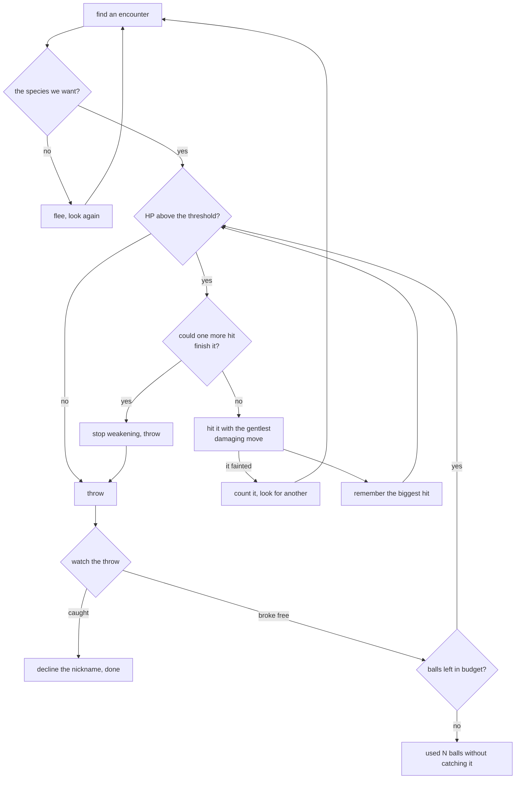
```mermaid
flowchart TD
    A["find an encounter"] --> B{"the species we want?"}
    B -- no --> RUN["flee, look again"]
    RUN --> A
    B -- yes --> W{"HP above the threshold?"}
    W -- no --> TH["throw"]
    W -- yes --> G{"could one more hit<br/>finish it?"}
    G -- yes --> STOP["stop weakening, throw"]
    STOP --> TH
    G -- no --> CH["hit it with the gentlest<br/>damaging move"]
    CH -- "it fainted" --> NEXT["count it, look for another"]
    NEXT --> A
    CH --> LEARN["remember the biggest hit"]
    LEARN --> W
    TH --> WATCH{"watch the throw"}
    WATCH -- caught --> DONE["decline the nickname, done"]
    WATCH -- "broke free" --> BUD{"balls left in budget?"}
    BUD -- yes --> W
    BUD -- no --> GAVE["used N balls without catching it"]
```

<details>
<summary><b>Advanced detail:</b> the learning, and why it is not per-encounter</summary>

**The gentlest attack, not the first one.** That is why `romdata` reads the move
table at all — leading with whatever is in slot one knocks out the thing being
caught, and a fainted Pokémon cannot be caught by anything. "Gentlest" cannot be
read off the power byte alone, though: see [the move table](#romdatajs--what-the-cartridge-knows) for
the eleven moves that store 0 or 1 while taking half the bar, your level in HP,
or all of it. The memory below cannot cover for that one — it learns from the
swing it just took, so opening with Guillotine teaches it the maximum and costs
the target to do it.

**And it does not weaken something it cannot touch at all.** The bound on
chipping caught that already — eight turns, once per encounter — and the
message it printed, *weakening is getting nowhere*, was a guess about a fact
the cartridge states outright. The odds at a full bar are the odds, so the
honest move is to throw at them.

**And a catch that goes to the box had never been read by anything.** The
branch is the one place where a *successful* catch is reported as an escape if
it is wrong — with a full party the party count never moves, so the screen is
the only evidence there is. `tools/mutate` dropped the `!` from its own guard
and nothing failed, which means the whole path had never run: not the screen
read, not the phrase, not the nickname answer. Four tests now, including the
cartridge with no tilemap, where `state.screen` answers null and the guard has
to be an `&&` or it dereferences it.

**Nor off the power byte and the type chart alone, though both are read now.**
"Gentlest" is the *softest landing*, so it is ranked by the same
`hitPower` the winning half ranks by, downwards — against a Grass target EMBER
at 40 doubled hits harder than RAZOR LEAF at 55 halved, and picking the smaller
number would knock out the thing being caught. The one move taken out of the
pool rather than put at the front of it is one the target is immune to: that is
the gentlest hit imaginable and it weakens the target forever, so a Normal-only
lead chipping a GASTLY threw balls at a full bar until the budget ran out. See
[the bigger number is not the harder
hit](#the-bigger-number-is-not-the-harder-hit).

**The threshold alone is not a safe stopping point.** Against a Lv2 Rattata one
swing carries it from above the line to zero. So the pilot remembers the biggest
hit it has landed and refuses to swing when the target's HP is already inside
that range.

**That memory lives outside the per-encounter scope on purpose.** The one swing
that cannot be guarded is the *first* one, so a knockout is itself a
measurement: it tells the pilot its own damage, and every target afterwards
whose HP is already inside that range gets thrown at rather than hit. Measured —
the first version knocked out a Lv2 Rattata; hoisting the value fixed it, and
the following run caught four out of four with no knockouts.

Weakening spends no ball, so it is bounded at eight swings, or a move that kept
missing would loop for good with the ball budget never moving.

**A knockout usually arrives as `ended`, not as `fainted`.** `chip()` checks
whether it is still in a battle before it reads the enemy's HP, because it has
to — the enemy struct reads zero once the battle is over, so trusting that zero
would call every finished battle a knockout. The consequence is that a knockout
which beats the poll comes back as `ended`, and treating that as "work out what
happened later" reports it as a spent ball budget: the wrong reason, and the
guard learns nothing from the one measurement worth having. What tells the two
apart is our *own* party, which still answers after the battle ends — lead still
standing means the target went down, lead at zero means we did. The desktop
pilot had the same bug and reported seven kills as "got away" before a live hunt
caught it.

**Throws are counted as throws, not as bag deltas.** `wBalls` only settles when
the battle ends, so an interim attempt to detect throws that never happened by
comparing ball counts was built on a false premise and had to come back out.
With throws counted directly, every round's count matches the bag delta exactly:
`thrown=1 bag 5→4`, `thrown=2 bag 4→2`.

**A chip that ends badly can leave the move menu open**, and `menuIsLive` cannot
tell that from the battle menu — they share the same box. The pack was then
opened from inside the move list and the throw could not find a ball, so
weakening backs out before it throws.

**The nickname prompt is answered *no*.** The "do you want this one?" box that
precedes it defaults to yes, which is what we want; the nickname box does not.

</details>

---

**And both loops now say what the grass actually gave.** `hunt` has counted
every species it fled since it was written, and the interface paints that list
under the picker. `catch_` ran the same encounter loop, fled the same wrong
species and **threw the tally away** — so a catch that spent its whole budget
reported *saw 200 encounters without catching SENTRET* while holding, unsaid,
the list of the two hundred things it had seen. Which is the answer the failure
raises: you are on the wrong route. Both messages now end with
*— this grass gives PIDGEY x8, RATTATA x3*, commonest first and capped at
three, and the `#seen` line is painted by one function with two callers rather
than by one handler that happened to have the data.

**A full party is no longer a refusal.** Gen 2 sends a caught Pokémon to the
box and says so, which the app spent five passes calling a thing it does not
handle. Measured with six carried:

```
Gotcha! PIDGEY was caught!
Give a nickname to PIDGEY?
AAAAAAAAAA was sent to BILL's PC.
```

The party never moved off six and one ball left the bag — so **the party is the
wrong evidence**, and with the party as the only evidence a boxed catch and a
getaway are identical. The screen is the evidence, and the phrase to watch for
is the **title's** to say, because words are content: `phrases.boxed` sits
beside `heals` and `cures`, and a hack in another language changes one field. A
cartridge that has not said it keeps the refusal, and the refusal now names the
fact that is missing rather than claiming the app cannot do it.

That third line is the other half of the finding. `watchThrow`'s party check
used to sit behind *a window with a live cursor* — which is the waiting that
made `declineNickname` work — so the nickname question after a **boxed** catch
was never reached, and every one of them would have been called AAAAAAAAAA.
The same defect as the starter's, in the second place it can happen, found by
making the path work at all. Both callers share `keepDefaultName` now, which
moved to `taskbase.js` for exactly that reason: naming a primitive after its
first caller is how the second ends up with a copy.

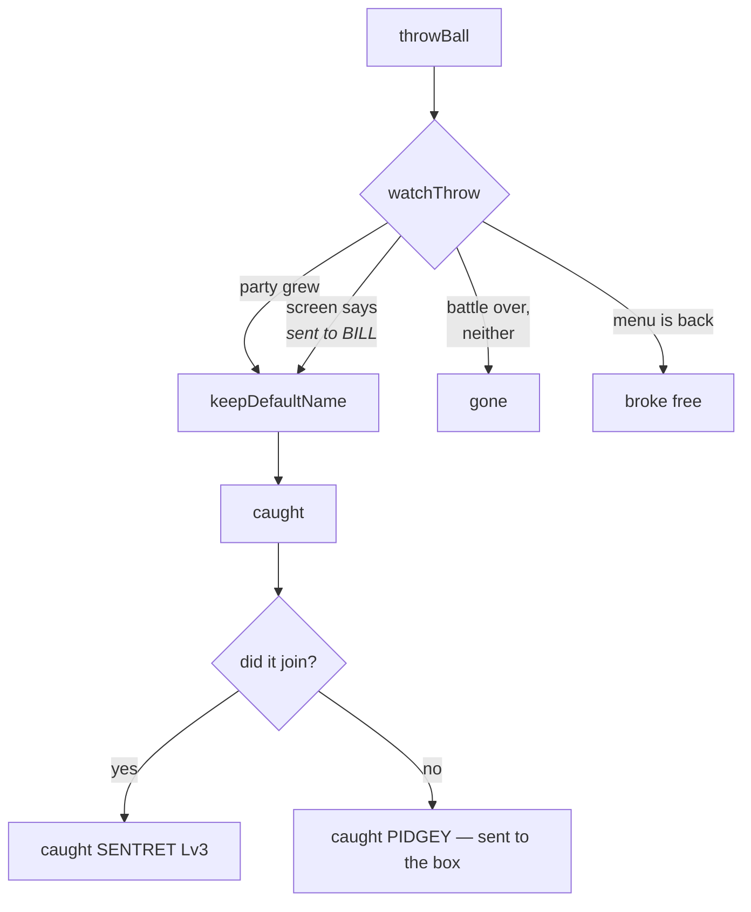
```mermaid
flowchart TD
    T["throwBall"] --> W{"watchThrow"}
    W -- "party grew" --> N["keepDefaultName"]
    W -- "screen says<br/><i>sent to BILL</i>" --> N
    W -- "battle over,<br/>neither" --> G["gone"]
    W -- "menu is back" --> B["broke free"]
    N --> C["caught"]
    C --> R{"did it join?"}
    R -- yes --> J["caught SENTRET Lv3"]
    R -- no --> X["caught PIDGEY — sent to the box"]
```

## 7a. Five that act on where you already are

<!-- covers: gen2/tasks.js gen2/jobs.js gen2/menus.js gen2/journey.js @ 03519e3cd1a9 -->

Grind, hunt and catch all go *looking* for something. These five do the obvious
thing with the situation you are already in, and take no parameters:

| Command | Does | Refuses when |
| --- | --- | --- |
| **Battle** | plays out the battle you are in, wild or trainer | you are not in one |
| **Catch this one** | weakens and throws at the wild Pokémon in front of you | not in a battle · it is a trainer's · party full · no balls |
| **Heal** | goes to the nearer heal place and comes back | you are in a battle · nothing is hurt |
| **Take** | walks to every item ball and fruit tree on this map and presses A | you are in a battle · the map is holding nothing |
| **Duel** | walks up to a trainer near you and fights them | you are in a battle · nobody is near · nobody is fit to send out |

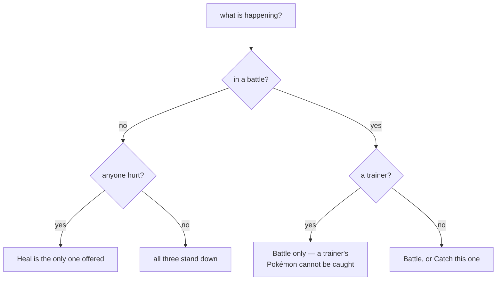
```mermaid
flowchart TD
    A["what is happening?"] --> B{"in a battle?"}
    B -- no --> H{"anyone hurt?"}
    H -- yes --> HEAL["Heal is the only one offered"]
    H -- no --> NONE["all three stand down"]
    B -- yes --> T{"a trainer?"}
    T -- yes --> ONLYB["Battle only — a trainer's<br/>Pokémon cannot be caught"]
    T -- no --> BOTH["Battle, or Catch this one"]
```

Each row in the interface says which of those it is, so the reason a thing is
unavailable is on screen rather than discovered by pressing it.

<details>
<summary><b>Advanced detail:</b> what was extracted, and what was not</summary>

**`captureHere` is the battle-facing half of `catch_`**, split out because it is
now also a command. `catch_` finds the species and delegates per encounter; the
standalone version skips the finding.

The split matters for one thing in particular: `catch_` passes a shared
`memory` object holding the biggest hit landed so far, because when hunting, the
one swing that cannot be guarded is the *first* one — a knockout is itself a
measurement that every later target benefits from. Called on its own there is no
earlier encounter to learn from, so it starts cold. That is correct rather than
a limitation, but it does mean a single `Catch this one` on a very low-level
target can still knock it out where a hunt would not.

**`battleHere` is a guard and a report around `fightBattle`**, not new battle
logic. Everything in [section 6](#6-battles) applies — the fainted-lead prompt,
trainers being unfleeable, PP exhaustion — because it is the same engine.

**`healNow` likewise wraps `healUp`**, which already chooses between Elm's
computer and the Pokémon Center by distance. It refuses in a battle rather than
pressing buttons hopefully, and reports "already at full health" as a success
rather than an error, because nothing needed doing.

**Two constants moved to `state.js` while doing this.** `TRAINER_BATTLE` and
`MAX_PARTY` were each defined in more than one module — a magic `2` and a magic
`6` stated in three places between them. `state.js` is the module whose job is
interpreting memory values, so they live there now and the others import them.
This surfaced as a plain `ReferenceError` the first time `captureHere` ran,
which is worth knowing: the syntax check in `tools/check-app` parses every
module but cannot see an undefined reference. That class of bug only shows up by
running the thing.

**Heal spends the bag before it spends the walk.** `nearestHeal` prices two
Centers in tiles and picks the nearer — 31 against 53 from the east end of Route
29 — and a POTION already in the pocket costs none of them. A grind is handed a
budget of twelve trips for exactly this reason, and until now it spent them
while carrying the answer.

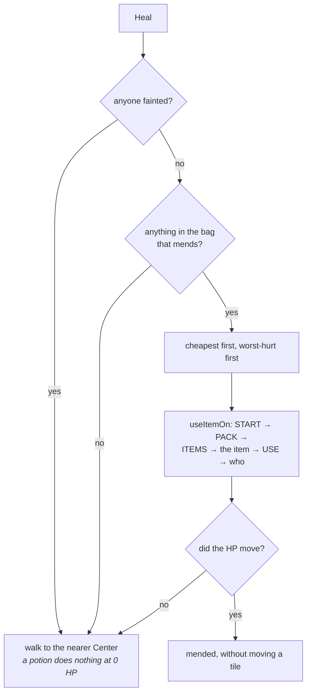
```mermaid
flowchart TD
    H["Heal"] --> F{"anyone fainted?"}
    F -- yes --> W["walk to the nearer Center<br/><i>a potion does nothing at 0 HP</i>"]
    F -- no --> B{"anything in the bag<br/>that mends?"}
    B -- no --> W
    B -- yes --> C["cheapest first, worst-hurt first"]
    C --> U["useItemOn: START → PACK →<br/>ITEMS → the item → USE → who"]
    U --> V{"did the HP move?"}
    V -- yes --> OK["mended, without moving a tile"]
    V -- no --> W
```

**And it cures what a potion cannot, first.** Poison and a burn take HP off
between battles and while walking, so a potion spent before the antidote is a
potion spent into a leak.

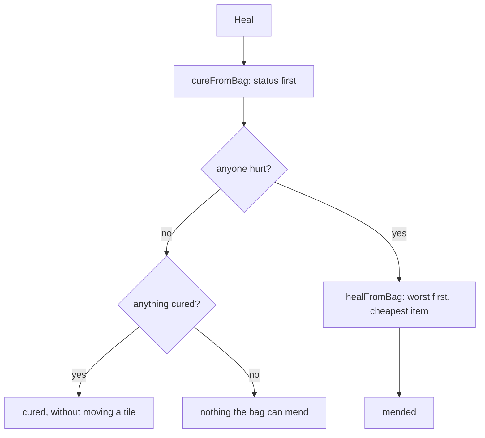
```mermaid
flowchart TD
    H["Heal"] --> C["cureFromBag: status first"]
    C --> Q{"anyone hurt?"}
    Q -- no --> D{"anything cured?"}
    D -- yes --> OK1["cured, without moving a tile"]
    D -- no --> N["nothing the bag can mend"]
    Q -- yes --> M["healFromBag: worst first, cheapest item"]
    M --> OK2["mended"]
```

Three things about that order were defects, and two of them were mine:

- **The cure ran after the HP check**, so a party at *full HP* that was
  poisoned returned early with *nothing the bag can mend* — the one party the
  status reader exists for was the one that never reached the cure.
- **`useItemOn` judged success by HP**, and an ANTIDOTE moves none. Every cure
  would have reported a failure, and that failure is what stops the loop
  reaching for the next item. Its evidence is now HP *or* a status going away.
- **The grind's heal condition ignored status entirely**, so a poisoned lead was
  only noticed once the ticking had brought its HP down far enough to look like
  ordinary damage — by which point a Center trip had been earned that an
  ANTIDOTE would have saved.

Which item cures what is the **title's** map, `cures`, keyed by the same keys
`statusOf` returns and weakest-first within each. The specific cure comes before
the general one, so a FULL HEAL is not spent on a poisoning an ANTIDOTE would
have fixed — the ball preference's rule, in a third pocket. Crystal's lists lead
with berries, because it grows them on the trees the Take row finds:
PSNCUREBERRY on Route 30, and four more elsewhere.

Which item is `cheapestHeal`, and which items count is the **title's** list, not
the engine's: an id is layout and a name is content, and content is what a hack
changes. Weakest first, matched through the same `normalise` fold the ball
preference uses — so BERRY comes before POTION, being free and growing back on
the trees the Take row finds.

<details>
<summary><b>Advanced detail:</b> four boxes, and the three things measurement
changed about them</summary>

Every box between the START menu and a healed Pokémon is matched on its
**shape** rather than reached by a press count, which is the lesson `learnMove`
and the battle pack already carried. All four measured on the cartridge:

| Box | `menuItems` / `menuTop` | Note |
| --- | --- | --- |
| the START menu | 7 / 0 | grows as the game goes on; counted by stepping |
| the pack | 5 / 1 | the same box the battle pack draws |
| USE / GIVE / TOSS / QUIT | 4 / 3 | USE is row 1, and TOSS is two rows under it |
| which Pokémon | 4 / 0 | four items again, told apart by the row |

**The PACK row is found by trying and looking.** It is row 2 of 7 on a fresh
Route 29 save, and nothing in the code believes that: the menu grows — no
POKéDEX or POKéGEAR early on — so it drives to a row, presses A, and asks
whether the pack's own box is what appeared. `saveGame` learned the same thing
about SAVE.

Three defects came out of driving it, and all three were about *evidence*:

- **`settleText` taps A while any window is open, and after a heal the pack is
  one of those.** With two Potions in the bag that press lands on the next item
  and uses it — the stray-press failure `watchThrow` has warned about in the
  neighbouring file since it was written. `_pastTheMessage` stops as soon as the
  box on screen is the pack or the party list again, because those are boxes to
  back out of and not text to advance.
- **The ITEM pocket lags a use, so the pocket is not the evidence.** A BERRY
  took a Cyndaquil from 5/22 to 15/22 and `wItems` still listed it. Judging on
  the pocket reported a working heal as a failure — and that failure then stopped
  the loop from reaching for a second item. HP is the evidence; the pocket is
  polled for, briefly, and its silence is reported rather than believed.
- **And the loop re-read that lagging pocket.** So it picked the same berry
  again, walked past it in a pack that no longer had it, and gave up: the
  Pokémon was left at 15 of 22 **with two potions in the bag**. The pocket is
  read once per press of Heal and kept, decremented as things are spent — which
  is the opposite of what this repository says about the ball count, and
  deliberately. *Count them out of the bag rather than trusting a tally* is the
  right rule when the bag is current, and this pocket has been measured not to
  be. A local tally can only be wrong in one direction here: it forgets an item
  sooner than the game does, and the next press reads fresh.

End to end on Route 29, standing at (19,4) with a Cyndaquil at **6/24** and a bag
of two Potions and a Berry: **24/24, the Berry and one Potion spent, and the
player never left the tile.** Before the pocket fix, the same situation stopped
at 15/22 with two Potions unspent.

</details>

**Take is the one whose list comes out of the cartridge.** `collision.takeables`
reads the map's placement array for the sprite ids the engine profile names as an
item ball or a fruit tree — and for the game's own type byte, which names balls
directly — so on Route 29 the row reads *one item ball and one fruit tree* with
nothing about Route 29 written down anywhere.

```mermaid
flowchart TD
    T["takeables: what the map placed"] --> S["nearest first"]
    S --> A["approach: every side that is<br/>walkable, nearest first"]
    A --> W{"walk"}
    W -- "battle" --> E["escape, and ask again<br/>&mdash; up to six times"]
    E --> A
    W -- "arrived" --> P["face it, press A"]
    P --> D["difference both pockets"]
    D -- "something" --> G["say what arrived, by name"]
    D -- "nothing, twice" --> N["already taken &mdash; an outcome,<br/>not a failure"]
    A -- "no side opens" --> M["could not get to it &mdash; this one is"]
```

Three things in that diagram were defects, and each was invisible on the one
tile this code had ever been asked about: Route 31's ball, which the errand
fetches.

- **It stood on the tile below and pressed UP.** That is a rule about nothing.
  The item ball at (8,35) on Route 30 has a wall under it, so the walk failed —
  and the code then pressed A wherever it had stopped, through a dead `continue`
  inside a condition that had already excluded the case it tested for.
  Approaching from above and facing DOWN is what put the ANTIDOTE in the bag.
- **It decided success by looking at the balls.** A BERRY off a fruit tree
  reported *the ball would not go in the bag*, with the berry in the pocket.
  Measured twice, on two trees, before `state.items` existed.
- **It used `walkTo`'s default eighty steps.** Every other leg of a journey
  passes 260, written out at four call sites — so the fifth got the default by
  omission. Running out of steps reads as the tile refusing rather than as the
  walk being cut short, which is the sort of wrong answer that gets believed.
  The number has a name now, `longWalk`, and the five sites share it.

**And the outcomes are three, not two.** Getting nothing from a ball somebody has
already taken is ordinary; a thing no walk can reach is not. `pickUp` answers
with which, because painting *nothing left to take here* red says something went
wrong when nothing did. Measured on Route 29: the first press picked up a POTION
and a BERRY thirty-five tiles apart and went green; the second said *nothing left
to take here — tried 2* and stayed green.

**Duel is Take's shape, for a target that moves.** Same walk, same approach from
whichever side is open, same press of A — and three differences, every one of
them measured rather than reasoned about.

```mermaid
flowchart TD
    D["Duel"] --> B{"already in a<br/>trainer battle?"}
    B -- yes --> F["fight it &mdash; that is the duel"]
    B -- no --> W{"a wild one?"}
    W -- yes --> R["flee: not the job"]
    R --> L
    W -- no --> L["trainers: live struct + placement type"]
    L -- "nobody" --> N["nobody near enough to fight"]
    L --> S["nearest not yet asked"]
    S --> A["approach, face, press A<br/>up to forty taps"]
    A -- "battle" --> F
    A -- "nothing" --> M["mark them asked, try somebody else"]
    M --> L
    F --> P["money before vs after<br/>= the purse"]
```

- **A trainer is only *there* if the game has spawned it.** The map places
  three on Route 30; from the south end, none had a struct. So the list is who
  is near, the interface says how many are further on, and `duelHere` never
  walks at a placement.
- **A trainer moves, so the tile is re-read every attempt.** `takeables` can be
  read once and walked to twice; a person cannot. Measured, a wanderer moved a
  tile while nothing else happened.
- **A trainer who refuses is not asked again.** Standing at (3,28) there were
  two in range — the near one beaten, the far one not — and every attempt went
  to the nearer, so all six were spent on somebody who would never answer. Tiles
  that have been stood in front of are written down for the rest of the call.

**The money is the evidence**, the same rule the shop follows. A trainer pays out
when they lose and a wild Pokémon never does, so the purse is the one number
that tells a won duel from every other way a battle can end — HP says who
fought, and levels say what it was worth. Measured on Route 30 against the
Youngster at (2,28): **won the battle, ¥64 — Lv5 to Lv6**, with money going
3000 → 3064 and the lead's HP 19 → 15. ¥64 is the game's own arithmetic, a
Youngster's base of 16 times a level-4 Rattata. Pressed a second time, the same
trainer gave *stood in front of them and no battle started — already beaten?*
and the money did not move.

Which also fixed a battle defect that had nothing to do with duels. `lost` used
to be returned the instant the party read as wiped, **with the battle still on
screen and not a button pressed** — so every caller that asks "are we in a
battle?" was told yes, fought it again, read the same wiped party and lost
again. Measured on the egg errand, which passes exactly one trainer: the log
said *trainer battle: lost* **seven times**. One loss, reported seven ways.
`lost` now means the battle is over.

</details>

## 7d. The counter, and the money it takes

<!-- covers: gen2/menus.js gen2/state.js titles/crystal.js @ 42b12f968868 -->

Everything the pilot could do until now used what it found. **Shop** walks to a
mart and buys, which is the first thing it does that spends rather than
collects.

```mermaid
flowchart TD
    S["Shop"] --> T["travel to the town,<br/>through the door, to the counter"]
    T --> G["press A: the clerk's greeting"]
    G --> M["BUY / SELL / QUIT — 3 items at row 0"]
    M --> L["the stock — 4 at row 3, wCurItem says which"]
    L --> H["how many — 4 at row 15"]
    H --> C["that'll be ¥300. OK? — 2 at row 7"]
    C --> D["two text boxes, then the stock again"]
    D --> L
```

Every box measured in Cherrygrove's Mart, buying two POTIONs at 300 each and
watching the money fall 3000 → 2700 → 2400 while the pocket went 1 → 2 → 3.

**The money is the evidence.** Not the presses landing, and not the pocket: the
pocket lags a *use* — recorded three passes ago — and there is no reason to
trust it more here, while the money moved on the same read as the item arriving
in every measurement taken. `wMoney` is **three bytes, big-endian, plain
binary**: a new game reads `[0x00, 0x0b, 0xb8]`, which is 3000. Worth stating,
because the bytes next door are *not* — `wMartItem1BCD` and its siblings hold
the prices as BCD, so the obvious generalisation is wrong in the direction that
looks plausible.

One item at a time, deliberately. The quantity box takes UP to raise the count,
and getting that wrong buys ninety-nine of something; repeating a confirmed
single purchase costs a few frames and cannot overshoot.

<details>
<summary><b>Advanced detail:</b> three ways a box can lie about being ready</summary>

Driving this found the same lesson three times over, in three different shapes,
and all three produced *honest reports of a job barely done* rather than
anything that looked broken.

- **A box being redrawn has the wrong shape.** The quantity box reads `4/15`
  settled and **`4/0` mid-redraw**. A check that looked once landed on the
  transient shape, decided the box was wrong, and reported *bought nothing* from
  inside a working shop — and the first probe of the sequence caught that frame
  while the second did not, which is what a race looks like in a log.
  `_awaitBox` waits for the shape.
- **A purchase is followed by two text boxes, not one.** Confirm, A, the price
  line, A, the thanks, A, and only then the stock list. Pressing once and
  waiting for the list stopped one box short: **one potion of four, reported
  accurately.** `_pressUntilBox` presses until the shape arrives.
- **And pressing while waiting presses into the thing you are waiting for.**
  A press that lands on the stock list mid-redraw picks an item. So every press
  is followed by a patient wait rather than a look — which the fake that models
  the redraw caught *before the cartridge did*, and that is the first time in
  this log the test found a hazard rather than recording one.

`itemIdOf` is here for the same reason the shop is: it is the mirror of
`itemName`, and the one question the app had never needed to ask. Everything
until now started from an id the game had already given it, and buying starts
from a *name* — the title says `potion` and the stock walk needs the number. The
table is scanned once and cached, and the scan stops at the first entry with no
name, which is what reading past the table gives.

Where the mart is, and how to reach its counter, is the **title's** to say —
`stand` and `face` rather than the clerk's tile, because a mart counter is a
*wall*: measured in Cherrygrove, the clerk sits at (1,3) and the only place you
can talk to it from is (3,3) facing LEFT, two tiles away across a corner.

</details>

### Leaving the counter is not closing its box

The most expensive defect in this log, and it was quietly spending money.

`closeMenus` presses B until no window is open. That is right for a menu the
pilot opened itself and **wrong for a box the game is holding up**: measured at
Cherrygrove's counter, the boxes closed, `wScriptMode` stayed non-zero, and the
clerk's confirmation was back a moment later.

The pilot was then standing in front of *"1 POKé BALL will be ¥200. OK?"* — and
every later job runs `runScripts`, which presses A through text. **A on that box
is a purchase.**

| | measured |
| --- | --- |
| after the shop reported success | ¥900, confirm box open, `wScriptMode` non-zero |
| after three more jobs' walks | **¥100**, four unwanted Poké Balls |
| why it stopped | ¥100 could not buy another |
| what every walk said | *could not get through to Cherrygrove City*, eight tries at a time |

Three fixes, one cause. `closeConversation` waits for **no window and no
script**, and reports which it could not clear. `through()` closes what is on
screen with **B** before walking — B rather than A because A answers a question
and B declines it, and a walk has no business answering anything — and says
*something is still on screen* when it cannot. And `restock` reads **both**
pockets: a Poké Ball is not in the ITEM one, so `want` meant *buy this many*
rather than *have this many* for the one thing anybody would ask it to fetch.

Verified by re-running the sequence that lost the money: *bought 7 for 1400 —
1900 left*, twelve balls exactly, no window, no script, and the walk out
arrived on Route 29 with **¥1900 untouched**.

**Measured end to end**, from where the bootstrap leaves you on Route 29 with
¥3000 and one potion: it travelled to Cherrygrove, went in, walked to the
counter and came away with **five potions and ¥1800**, in 49 seconds.

## 7b. Saving, and getting the save out

<!-- covers: gen2/tasks.js gbcore/taskbase.js gen2/battle.js gen2/jobs.js gen2/state.js @ e5825a45295a -->

```mermaid
flowchart TD
    A["Save the game"] --> G{"in a battle,<br/>or mid-script?"}
    G -- yes --> R["refuse, and say which"]
    G -- no --> C["close menus, press START"]
    C --> O{"cursor appeared?"}
    O -- no --> RT["retry, up to 3 times"]
    O -- yes --> N["count rows by stepping DOWN<br/>until the cursor wraps"]
    N -- "the player moved" --> W["the menu never opened — stop"]
    N --> S["drive the cursor to row count&minus;2"]
    S --> A2["press A, then wait for the<br/>confirm box's own cursor"]
    A2 --> Y["press A for YES, advance the text"]
    Y --> V{"battery bytes moved, AND<br/>now hold a loadable save?"}
    V -- yes --> OK["saved"]
    V -- no --> RT2["wrong row — try the others"]
```

Saving is driven through the real menu rather than by writing SRAM. It could not
be done any other way here — this core is readable but not writable — and it
should not be anyway: Crystal validates a save with two check bytes and a
checksum it computes as it writes, so a save the game did not make itself is a
save the game does not trust.

`Download .sav` then hands the battery over as a file, which is how a phone
session leaves the tab.

<details>
<summary><b>Advanced detail:</b> why the evidence is the bytes</summary>

**The row is counted, not remembered.** The START menu grows as the game goes on
— no POKéDEX or POKéGEAR at the start — so a fixed row number lands on OPTION
once they appear. Rows are counted by stepping DOWN until the cursor repeats,
and SAVE is `count - 2`, because the last three are always SAVE, OPTION, EXIT.
If the first guess opens the pack instead, the others are tried.

**And a wrong guess is closed before the next is tried**, which is the recovery
that sentence has always promised and nothing was performing. `_trySaveRow`
returns false with whatever it opened still on screen, and `_openStartMenu`
cannot tell a submenu from the START menu: all it asks is whether *some* cursor
is live, because nothing in memory distinguishes them the way `wMenuDataItems`
distinguishes the battle menu. So the next row was driven blind through the last
row's leftovers — DOWN moving a cursor inside the pack's USE / GIVE / TOSS box,
and the A behind it answering that rather than the START menu. Four B presses
between attempts is the whole fix, and it is what makes trying the other rows
the safe idea the paragraph above claims it is.

**Counting rows is also how it notices the menu never opened.** If those DOWN
presses are reaching the world rather than a menu, the player walks — which in
grass starts a wild battle and makes saving impossible. So the position is
checked after each press, and a move means stop.

**And the menu it counted is not pressed shut again before the rows are tried.**
START *toggles*: measured on the cartridge, the window stack goes 0, 1, 0, 1
across three presses. `_saveOnce` opens the menu, counts its rows, and then calls
`_trySaveRow`, which called `_openStartMenu` again — so the press closed the very
menu that had just been counted. It recovered: the poll then read a zero cursor
for all twenty-five tries, and the next attempt pressed START again and re-opened
it. Recovering by timing out is not the same as being right, and the state it
passed through on the way was one where the next DOWN would have walked the
player. `_openStartMenu` now asks `windowOpen` first and presses nothing when
something is already up.

Two things this module's header used to assert were measured while establishing
that, and one of them was wrong. **The START menu's cursor does not persist
between openings** — walked to row 3, 6 and 2, closed and re-opened each time, it
came back on row 1 every time — and **`wMenuCursorY` reads 0 for the whole of any
interval when nothing is open**, tracking `wWindowStackSize` exactly, at least
indoors. Reading the cursor rather than counting presses is still right, but the
reason is the growing row count above it, not a cursor that remembers.

**Success is the battery changing, not the presses landing.** The desktop pilot
watches its `SaveGameData` hook fire; there are no hooks in a browser. So this
reads 32KB of cartridge RAM before and after and requires two things: that the
bytes moved, and that what they now hold is a save the cartridge would load.
Either test alone is too weak — the first accepts a half-written battery, the
second accepts a save that was already there while this attempt did nothing.

**"Is there a save?" is Crystal's own test**, from `engine/menus/save.asm`:
`sCheckValue1 == 99 && sCheckValue2 == 127`. `GameState.saveIsPresent` resolves
both out of the symbol file — an SRAM symbol carries a bank, so the offset into
the flat 32KB is `bank * 0x2000 + (addr - 0xA000)`.

**Both markers**, and that is the whole reason there are two: either one alone
is a battery in the middle of being written, and downstream of this answer is
whether the pilot overwrites somebody's game. The mutation run found nothing
standing behind it — widening the `&&` to `||` broke no test — so there are
tests now for each marker alone and for the right pair of addresses holding
the wrong pair of values.

**And the length test in front of it was doing nothing.** It read
`sram.length < bankBytes`, which never once decided anything: an offset that
lands past the end of the array is caught by the very next comparison, the one
that also catches an offset before the start. Found by widening the `<` to
`<=` and watching nothing fail either way — which is the second time this pass
that a mutation survivor turned out to be a branch pretending to be two.

Counting non-zero bytes does **not** work, and it was the first thing written: a
battery never saved to still reads five non-zero bytes, so "any non-zero byte
means there is a save" calls a blank cartridge saved. It made a genuine first
save report itself as a repeat, and it would have let `Download .sav` hand over
a file every emulator opens as "no save file".

**The button names are checked statically now.** The first version of this
driver used `press('Start')` and `press('Down')`. Every other call site in the
app is uppercase, and the core ignores a key it does not recognise — so the
press ran, took its frames and did nothing, and the failure surfaced as "could
not get the game to save", which points at the menu rather than at the presses.
`tools/check-app buttons` now rejects any name outside the eight the core knows,
checked against the on-screen pad's own `data-btn` values.

**Verified across both halves of the project.** The app played a new game to
Route 29 with a Lv5 Cyndaquil, saved, and those 32768 bytes were loaded in the
desktop pilot under PyBoy — which read back Route 29, `CYNDAQUIL Lv5 20/20`,
Tackle and Leer. Two emulators, two implementations, one save file.

</details>

## 7c. Slots, undo, and bringing a save in

<!-- covers: gbcore/saves.js @ 6dce5d064d49 -->

**There is one way to load a slot, and that is the point.** `loadSlot` in
`main.js` reads the record, refuses it if its ROM fingerprint is not this
cartridge's, and installs the bytes. `Saves` used to offer a `restore(slot)`
beside it that did the same three steps *minus the refusal* — and nothing called
it, so nothing exercised it, so it stayed as the fourth audit pass had found the
code before that pass fixed it. Found by coverage, in the module the tests run
least of, and deleted rather than patched: two ways to load a slot is what made
one of them wrong in the first place.

**Listing the slots dropped five rejections into the void.** `list` reads a
summary per slot in one transaction and used to fire the five reads and forget
them: a read that failed rejected with nobody listening, so a failing
transaction produced one error the caller can catch and five it cannot, arriving
a turn later with no stack pointing at this file. Which is the shape the codec
had ten passes ago, on the other half of the save path — and the same fix, at
the source: a slot whose read failed is a slot with no summary, which is a state
the rows already draw.

The `await Promise.all` beside it is belt and braces rather than a second fix,
and is worth saying so out loud. A request's `onsuccess` resolves before the
transaction's `oncomplete`, and the microtask queue drains in between, so the
fill was already ordered — removing that line fails no test, deliberately. What
it buys is making the ordering a rule of this function instead of a property of
the platform.

Three slots a person picks, plus an undo point the pilot writes before every
job and the game a handoff replaced, if there is one — five records. A slot
holds a **battery save** — the 32KB the cartridge writes — and not a machine
state, and everything odd about how slots behave follows from that.

**Each record carries the cartridge it came from**, and loading refuses across
it. A save is written in the layout of the build that wrote it, so bytes from
another one load and are then confidently wrong — worse than not loading, which
is why the handoff row has always named a mismatch instead of offering it. Slots
are the same bytes from the same person's other cartridge, and they outlive a
ROM switch in a way an in-session undo point cannot. The row says *from a
different ROM* before anything is pressed, and `loadSlot` refuses if it is
pressed anyway.

`Saves` holds the tag as a field that `main.js` sets once, rather than each of
`capture`'s four callers passing it: four call sites that must all remember the
same field is the shape of the bug this exists to prevent. A record kept before
slots recorded a tag, or a session that has not fingerprinted its ROM yet, is
believed as it always was — the check needs two answers to compare.

```mermaid
flowchart TD
    K["Keep slot 2"] --> Q{"can the game save?<br/>not in a battle, screen quiet"}
    Q -- no --> R["refuse, and say which"]
    Q -- yes --> SV["save the game for real"]
    SV --> C["copy the 32KB into slot 2<br/>with map, lead and time"]

    L["Load slot 2"] --> W["write cartridgeRam into the<br/>library's IndexedDB record"]
    W --> RL["re-load the ROM"]
    RL --> CT["drive START, A to CONTINUE"]
    CT --> D["back in the world at that save point"]
```

**Why not machine states.** WasmBoy will capture one — after a `play()` its
`saveState()` returns all four memory regions populated, and it even persists
them — but it will not put one back. `loadState()` rejects with `undefined`,
measured on states the library created itself, fetched from its own IndexedDB
and handed to its own API with every buffer the right length. A snapshot you
can never return to is no use as a slot. The desktop pilot has real states,
which is why *its* slots can be taken mid-battle and these cannot.

**What that costs, plainly:** keeping a slot saves your game, loading one puts
you at that save point rather than an exact moment, and a job that runs *inside*
a battle — Battle, Catch this one — cannot have an undo point at all. The rows
say so instead of offering an undo that would do something else.

<details>
<summary><b>Advanced detail:</b> writing a battery, and the traps around it</summary>

**Writing the battery is the one piece of cleverness.** The core is readable and
not writable, so the bytes cannot simply be poked in. The library keeps a
per-cartridge record in IndexedDB and calls `loadCartridgeRam` when a ROM loads,
which pushes that record's `cartridgeRam` into the core. So installing a save
means writing that record and re-loading the ROM — which is also why loading a
slot leaves you at the title screen, and why `continueFromTitle` drives CONTINUE
for you.

**The record is addressed by the key the library already used *for this
cartridge***, and derived from `_getCartridgeInfo().header` when there is none.
Both work; they are not equally well evidenced. Writing under an existing key is
the path that was watched loading a real save back into a real game; the
derivation is reasoning about how the library builds its key. The proven one is
primary, and the other covers the two cases where there is no record of ours —
a browser the library has never written in, and a second cartridge in one where
it has.

**The second of those used to be a silent data loss**, and it is the case this
app now actively invites. The key is ROM bytes `0x134`–`0x14E`: the title, the
cartridge flags, the header checksum, and the top byte of the global checksum —
so a hack is a different key, and so is a rebuild of the same disassembly. The
library also writes nothing until a battery is persisted, so after playing one
cartridge the store holds exactly *one* record. `_existingKey` took the only
record when there was exactly one, without ever asking whether it was ours, and
the result failed twice over without a word: the re-load looks up the cartridge
actually loaded, finds no record and applies nothing — so the install reports
success and does nothing — while the save belonging to the *first* cartridge is
overwritten with bytes from a game it has never seen. `pickKey` compares bytes
instead, and `sameKey` exists because the two sides are never the same type:
the library files the record under a `Uint8Array` and IndexedDB hands binary
keys back as `ArrayBuffer`, so `===` is false between a key and itself.

**That record belongs to the library, so it is opened with no version and no
upgrade callback.** Naming a version means a `VersionError` the day the library
bumps its own, and an upgrade callback would have us inventing its schema —
creating a database it then finds already there and wrong. Our own database is
the only one we version.

**`install` refuses on a hidden page.** Re-loading the ROM goes through the
library's `pause()`, which awaits an animation frame, and a hidden page is given
none — so the call never returns. `run()` already branches on this for frame
stepping and there is no equivalent escape here, so it refuses with a reason
rather than hanging. A person pressing Load is looking at the page; the check
only bites a backgrounded tab.

**A refused undo does not spend the undo point.** Whatever the reason — hidden
page, empty slot — the point stays where it was, so the next attempt still has
somewhere to go back to.

**Losing an undo point is reported, not just logged.** `canSave` settling too
early once let a job run with nothing to go back to, and the reason scrolled out
of the three-line run log while the row still read "nothing to undo yet" — which
is what it says when no job has run at all. The row now distinguishes the two,
because that failure is only otherwise discovered by reaching for the undo.

</details>

## 8. The errands

<!-- covers: titles/crystal.js gen2/journey.js @ 56cfd416b5a2 -->

Everything in this section is `crystal.js` — the only file in the app that names
a Crystal map, a Crystal door or a Crystal NPC. What it stands on is
`journey.js`, section 5's routing and crossing, which knows none of them. That
division is what a ROM hack of the same base game would exploit: an errand is
a title's, and getting there is the engine's.

**The file has two halves, and they differ in kind.** `crystal` is *data* — the
shape the engine reads, and the whole of what a second title would have to
declare:

```js
export const crystal = {
  id: 'crystal',
  names: MAP_NAMES,                              // what to call a map
  healers: [{ map: ELMS_LAB, reach: 'healAtElm' },
            { map: CHERRYGROVE_CITY, reach: 'heal' }],
  grassyMaps: [ROUTE_29, ROUTE_30],              // where encounters are, if not here
  legCost: LEG_COST,                             // what a further leg is worth, in tiles
};
```

### An errand that turned out to belong to the engine

**`talkToOpen` is the counter-example to this whole division, and worth reading
as one.** It was written as `takeTheEgg` on the `Crystal` class, where an errand
plainly belongs — and then read back. Every line of it came out of the gate
declaration (the map, the tile, the event) and out of the healer that already
declares the same door. *Nothing in it named a Crystal anything.*

A title-owned method that mentions no title is engine behaviour wearing a
title's coat. So it lives in `journey.js`, and the title's contribution is the
two extra fields on the gate:

```js
{ from: VIOLET_CITY, to: ROUTE_32, event: 0x2d,
  needs: 'the Egg from Elm’s aide', at: VIOLET_POKECENTER,
  tile: [4, 3], errand: 'talkToOpen' }
```

which is the same test the rest of this section applies, run in the other
direction: *could a second cartridge declare this and get the behaviour free?*
Here the answer turned out to be yes, so the code moved down a layer.

`tile` sits in the gate rather than in `places` because that makes the whole
claim one entry — **the thing that sets this event stands on this tile on this
map** — and `check-app gates` checks it whole, out of the ROM: the object at
(4,3) in `VioletPokecenter1F` is `VioletPokecenter1F_ElmsAideScript`, whose
`.AskTakeEgg` is the only thing in the cartridge that sets `$2d`. Split across
two tables it could only ever have been checked in halves.

**And the pilot answers a yes-or-no**, which the pass before this refused to
let it do. That refusal read *a yes-or-no prompt* as *a decision that is
yours*, and they are different things: this app has driven yes-or-no boxes
since it could shop — `buyFromClerk` confirms a purchase, `saveGame` confirms a
save. What it declines to decide is which starter you want, because that is a
choice with no right answer. "Do me a favour?" has one.

The evidence, as everywhere else here, is the game's own record rather than the
screen: `hasEvent($2d)`, not `answerYes` having returned true. An aide who says
yes and hands over nothing must not read as success.

The class is *procedure*. Knowing that Elm's machine is read by facing it, or
that the nurse's question defaults to yes, is not something a table can hold —
so `reach` names a method rather than describing one, and `Journey.nearestHeal`
calls `this[h.reach]()`. Coordinates are data; presses are code.

**Two questions on the way out of the lab, and A is right for only one.**
Taking a starter asks *Do you want CYNDAQUIL, the fire POKéMON?*, where yes is
right, and then *Give a nickname to the CYNDAQUIL you received?*, where no is.
Pressing through answers both, walks into the naming screen, and types the
letter under the cursor — so **every starter this app took for twenty-eight
passes was named AAAAAAAAAA**, and nothing could see it until
[`screen.js`](#screenjs--the-words-on-screen) arrived.

```mermaid
flowchart TD
    B["press A on the ball"] --> R["runUntilParty:<br/>press A, checking first"]
    R -- "party grew" --> Q["takeDefaultName"]
    Q --> L{"a window,<br/>with YES and NO?"}
    L -- no --> P["press A: hurry the text"]
    P --> L
    L -- yes --> BB["press <b>B</b>"]
    BB --> D["the name the game gave it"]
```

Two halves, and the split is what decides *which* question is being answered.
`runUntilParty` presses A through the first one and stops the moment the party
grows — the Pokémon is ours, so the next box is the one that must not be pressed
through, and `watchThrow` has used that same signal to decline the same box
since catching worked. `takeDefaultName` then handles the nickname question
alone: **B on it is the game's own name for the thing**, measured by pausing a
new game on that box and pressing it.

Getting *to* the box is the part five cleverer attempts got wrong, and the trace
says why. When the party grows the question's text has barely begun — the screen
reads `G` — and it then **stops and waits for a button**, with
`wWindowStackSize` reading zero the whole time. One press finishes it and draws
the choice, which is up and stable from that frame on. So an A issued the instant
the party grows only hurries the text, and a look taken straight afterwards sees
no box and gives up; that is exactly what `declineNickname` did, twelve runs in a
row. Which makes it a loop rather than a sequence: press A, look, press B the
moment a choice is on screen.

**And the procedures read the coordinates from the profile**, which they did not
at first. When the object was introduced the scripts went on closing over the
module constants, on the reasoning that the object was the engine's interface to
this file rather than a second copy of it. That was true of one title and wrong
the moment a second extended it: `crystal-early` declares two map names, and
`run()` still walked to Crystal's New Bark, because that place was in the
function rather than in the description. The scripts looked partial and were
secretly total. Every place they walk to is a field of `places` now, so a hack
that moved New Bark changes one field and the inherited script follows it.

Three methods left this file when that object arrived, and none of them was ever
really Crystal's: `where` is a lookup in `names`, `backToGrass` is a walk over
`grassyMaps`, and `nearestHeal` is arithmetic over `healers`. They are in
`journey.js` now, which is what made the third one testable for the first time —
see the `journey` tests, where a stubbed map graph proves that two legs beat one
when the first edge is three tiles away and the alternative is fifty-five.

**A cartridge's own numbers are a second profile, and it changes at a different
rate from the first.** `gen2/engine.js` holds the party stride and the struct
offsets, the species and move counts, the name width, the encounter block shape,
the grass tiles, the battle menu's signature, the NAME menu's shape and the
battery's check bytes — every number that describes the machine, with its source
in the disassembly beside it. A title declares `engine` only if its cartridge
changed one, which a hack that moved the maps has not; `GameState` and `RomData`
take it and fall back to the stock profile.

**And every reader takes it from the live profile**, which took a second pass to
be true. The first version left `state.js` exporting `MAX_PARTY`,
`TRAINER_BATTLE`, `GRASS_TILES` and `NAME_MENU_FIRST_PRESET` as module-level
constants computed from the stock profile *at import time*, and `jobs.js`,
`journey.js`, `menus.js` and `rows.js` imported those. So a title raising the
party cap had it honoured in `state.party()` — and in nothing that decides
anything: the catch that refuses a full party, the grass a walk looks for, the
name-menu step and the row that says *the party is full* all went on reading six
and `0x10, 0x14, 0x18, 0x1c`. The profile applied to half the app.

Those exports are gone, which is the enforcement: the wiring check names any
module still importing them. `rows.js` is a pure function and has no instance to
read, so the numbers arrive in its `ctx` like every other thing it cannot see
for itself.

The useful half of that file is what it refuses to hold:

| not in it | because |
| --- | --- |
| `MAX_SEND_TRIES`, `SAVE_ATTEMPTS`, `MENU_OPEN_TRIES`, `PARTY_HOLD` | this app's patience, not the cartridge's shape — and a profile field invites a title to tune a stall into a config option instead of fixing it |
| the collision value ranges, `world.js`'s header strides, the character encoding | a cartridge that changed those changed the *shape* of its data rather than a size in it, and the answer is a decoder that knows the new shape, not a field set to 11 |

<details>
<summary><b>Advanced detail:</b> what writing the tests for this found</summary>

`speciesCount` was not in the first version of the profile. `moveCount` was —
and `speciesName` had `if (!id || id > 251)` written as a literal, in two
places, which is the field a hack with new Pokémon needs most and the one it
would have been silently cut off by. It surfaced because a test that only meant
to prove an eleven-character name came back read a species id the profile had no
say over.

The tests are worth reading as the argument that any of this works: a party laid
out at `0x40` and read with the stock `0x30` produces a second entry read out of
the middle of the first, and reading it with a profile that says `0x40` does not.
Same for an eleven-wide name table read at ten, which drifts exactly the way
`ItemNames` drifted when it was read at a stride.

One trap in writing them, and it is the harness's shape rather than the code's:
`romByte(bank, addr)` takes an *absolute* address, so a fake ROM indexed from
zero answers every read with a terminator and every name with `?`. The fake
addresses itself from where the synthetic symbol table puts `PokemonNames`.

</details>

**Which title drives a cartridge is decided once, before anything is built out
of it.** `titles/pick.js` holds a registry, every profile says how to recognise
itself, and the first that agrees wins — with `generic` last, matching anything,
so an unknown cartridge is *supported on arrival* rather than refused until
somebody writes a file for it.

The header alone is never enough, and that is the whole difficulty of
recognising a hack: a pokecrystal hack routinely keeps `PM_CRYSTAL` in its
header, so matching on the name would claim every hack as Crystal and then walk
confidently into a lab that has been moved. Crystal's rule asks for the name
**and** a symbol only Johto has. A profile may also pin an exact ROM
fingerprint, which is the honest answer for telling two hacks of one base apart.

<details>
<summary><b>Advanced detail:</b> what the generic profile does not declare, and
why that is the interesting part</summary>

```js
export const generic = {
  id: 'generic',
  encounters: ['JohtoGrassWildMons', 'KantoGrassWildMons'],
};
```

That is the whole file's data. No names, no healers, no grassy maps, no scripts,
and `Generic extends Journey` adds no methods at all — so hunting, grinding,
catching, fighting, tap-to-walk, saving and slots work on it unchanged, because
every one of those reads the cartridge rather than a table in this repository.

Each absence is a capability the interface declines to offer rather than a thing
that fails. No `names` and a walk says *map 26.1*. No `healers` and
`nearestHeal` returns null, which `healNow` reports as *nowhere to heal that this
build knows about*. No `run` and *Start a new game for me* is not drawn —
`awaitWorld` asks `typeof boot.run === 'function'`, because a button that throws
is worse than a button that is not there, which is the offers list's own rule one
step further out.

No `eggErrand` is the one that needed a rule rather than a hidden button. Catch
earns its place on the list while the only thing missing is the balls, *because*
the errand that fetches them lives in that row — and with no errand there is no
way out, so the row would be an offer whose only action does not exist.
`describeOffers` takes `canFetch` and drops it, and the hint says *catching
needs Poké Balls, and this build cannot fetch them*. Measured on the generic
profile: the list is empty rather than holding a Catch row with both its buttons
hidden, which is what it did before the rule.

`encounters` moved into the title in the same commit, out of `romdata.js`, which
had the pair pokecrystal ships written into it — a fact about a cartridge's
regions sitting in the module that decodes them. Whichever of the named tables
the symbol file actually has is used, so a cartridge with one region loses
nothing by naming two.

`?title=<id>` forces a profile by hand. It exists because the interesting
profile is the one for a cartridge nobody has described, and there is no ROM hack
in this repository to point at.

`titles/crystal-early.js` is the other end of that. The generic profile is the
floor and Crystal is the ceiling; this is the middle, where somebody writing a
profile for a hack actually stands — two named maps out of ten, one healer out of
two, driven by Crystal's own procedures because a hack of the same base game
keeps them. It never wins a selection (`matches: () => false`) and exists to be
driven with `?title=crystal-early`.

It is an instrument, and it earned its keep twice in the hour it was written.
The `titles` check forbade a title extending another title, which is the natural
shape for a hack that keeps the procedures and changes the places — the check
walks the chain to whatever engine class it reaches now, and protects only the
engine's own members. And the places themselves were being read from module
constants, described above. Neither would have been found by reasoning about it.

Measured against the real cartridge, the same errand under both profiles: under
Crystal the log reads *through to Elm's lab · out to Route 30*, and under
crystal-early *through to map 24.6 · through to map 24.4* — the same walk,
naming only what its description names. `nearestHeal` picks Elm's lab at 50 for
Crystal and Cherrygrove at 75 for the profile that has only heard of
Cherrygrove.

</details>

**What `Crystal` has left is nine methods that only add.** It overrides nothing:
the two hooks the split invented — `where` and `nearestHeal` — were replaced by
data, and a title now extends the engine without being able to disagree with it.

That is the property composition would have bought, and `check-app`'s `titles`
group enforces it: every `export class X extends Y` in `titles/` must name a
`gen2/` class, and no member of the subclass may share a name with a member of
the base. `constructor` is the one exception, because supplying a profile to
`super` has nowhere else to happen. The reason to check rather than trust is
that an override is the most comfortable mistake available here — it resolves,
it parses, it runs, and the next title copies it because the first one did. Composition itself is still deferred: those nine methods make 72
calls into `Journey`, and rewriting all of them to go through a held reference
would be a large diff across the errand — the one path that is hardest to
exercise — in exchange for a guarantee already enforced.

### Starting a new game

Two presses, because the middle of it is not the pilot's decision.

```mermaid
flowchart TD
    A["press 1: Start a new game for me"] --> B["play the intro<br/>take one of the game's own names"]
    B --> C["downstairs · out of the house · into Elm's lab"]
    C --> D["hear Elm out, so the balls go live"]
    D --> E["stand in front of the middle ball<br/>and stop"]
    E --> F["you choose"]
    F --> G["press 2: Now take me out to the grass"]
    G -- "no starter yet" --> H["pick a starter first"]
    G --> I["out of the lab · west to Route 29 · find grass"]
```

Which of the three you want is the one real decision in the opening, and a tool
that plays the boring parts should hand that back rather than answer it. The app
also tells you which ball is which, because the game does not — they are three
identical sprites and the name only appears once you are already talking to one.
Left to right: **Cyndaquil, Totodile, Chikorita** (`ElmsLab.asm`, x = 6, 7, 8).

### Where to heal

There are two places, and which is nearer flips depending on where you stand.

```mermaid
flowchart TD
    A["party is low"] --> B["for each of<br/>Elm's computer · Cherrygrove PC"]
    B --> C["ask the graph for a route"]
    C --> D["cost = tiles to the edge<br/>this route leaves by<br/>+ 25 per further leg"]
    D --> E["go to the cheaper one, heal"]
    E --> F["walk back to where we were working"]
```

<details>
<summary><b>Advanced detail:</b> why leg-counting gets this wrong</summary>

Elm has a healing machine in his lab and it works from the moment you take a
starter — `bg_event 2, 1` in `ElmsLab.asm`, gated on
`EVENT_GOT_A_POKEMON_FROM_ELM`, a yes/no and then `special HealParty`. No
Pokédex, no Pokémon Center, no fee.

Counting legs of the world graph picks wrong in the common case. By legs the
Center is one hop from Route 29 and the lab is two, so the Center wins
everywhere — but a hop west is the whole sixty-tile width of the route through
grass, while the lab from the eastern end, where the bootstrap leaves you, is six
tiles and a door.

Measured standing at x=53 of 60 on Route 29: the lab costs 31 against the
Center's 53, and healing a fainted party took 1.8 seconds. Below about x=25 the
answer swings back to Cherrygrove, which is the point of computing it.

**Healing has to come back.** It used to end standing in Cherrygrove, which has
no grass in it, so a grind that healed itself resumed in a town and stopped on
the next breath saying it could not find any wild Pokémon — with a full-health
party, one map away from the route it had been working.

</details>

### Getting Poké Balls

The game gates them deliberately, and the route round it is not the obvious one.

```mermaid
flowchart TD
    A["want to catch something"] --> B{"any balls?"}
    B -- yes --> OK["catch"]
    B -- no --> C["the Mart wants a Pokédex"]
    C --> D["the free ball on Route 31<br/>is behind a roadblock"]
    D --> E["so: the Mystery Egg errand"]
    E --> F["Route 30 east side → Mr. Pokémon's"]
    F --> G["home through Cherrygrove<br/>rival battle, must be won"]
    G --> H["Elm's lab: hand the egg over"]
    H --> I["stand on the aide's tile<br/>giveitem POKE_BALL, 5"]
```

<details>
<summary><b>Advanced detail:</b> the roadblock, and why Route 31 is the long way</summary>

Route 30's one-tile corridor north is filled by Youngster Joey at `(5,26)` with
two Rattata sprites at `(5,24)` and `(5,25)`, all three conditional on
`EVENT_ROUTE_30_BATTLE` — which is **clear** on a new game, so the objects are
there until it gets set. It is a deliberate roadblock, and returning the Mystery
Egg is what lifts it.

Which makes Route 31 the long way round, because the same errand ends with
`giveitem POKE_BALL, 5` in Elm's lab, from a `coord_event` the player only has
to stand on. Mr. Pokémon's house is at Route 30 `(17,5)` — on the *east* side,
the half the roadblock does not touch.

The errand is idempotent: run it twice and it returns *already carrying 5
ball(s)* without moving. It used to walk the whole thing again and report
success without gaining a ball, because its success test was "are there balls in
the bag" rather than "did we gain any".

</details>

---

## 8a. Finding the Centers and the Marts in the cartridge

<!-- covers: gen2/world.js gen2/journey.js @ dfe3f2566259 -->

The last thing in this app that had to be written out by hand. A title said
where the Centers and the Marts were, so the pilot healed in the two towns
somebody had described and nowhere else — and the cartridge has always known.

```mermaid
flowchart LR
    HERE["the map you are on"] --> WARPS["its warps<br/><i>world.warps</i>"]
    WARPS --> DOOR["a door, and what is behind it"]
    DOOR --> OBJ["world.objectsOn<br/><i>the ROM's object list</i>"]
    OBJ --> SIG{"nurse at (3,1)?<br/>clerk at (1,3)?"}
    SIG -- yes --> ENTRY["an entry in the shape<br/>a title declares"]
    SIG -- no --> SKIP["somebody's front room"]
    ENTRY --> USE["healAtCenter · restock"]
```

**`world.objectsOn` is the reader that makes it possible**: the same event block
`warps` already walks, read further along. Which makes it the one reader here
that can look at a map **it is not standing on** — `collision.placedObjects`
reads work RAM, so it only ever knows the map that is loaded, and that is
exactly the limitation this lifts. The pilot needs to know which door has a
nurse behind it *before* it walks through.

Every size in that block is measured against work RAM rather than read off a
macro: the object list parsed out of the ROM matches `wMapObjects` entry for
entry on Elm's lab, Cherrygrove's Center and Route 30 — sprites, tiles and types
alike, which is a stronger check than reading the macro would be.

The signatures are the engine profile's, measured across the whole ROM rather
than on the two maps the app already knew:

| | of maps carrying the sprite | at the standard tile |
| --- | --- | --- |
| the nurse | 23 | **21 at (3,1)** |
| a clerk | 26 | **13 at (1,3)** |

The other thirteen clerks are department-store floors and kiosks, which this
rule does not claim. Narrow on purpose: **a wrong match walks the pilot into a
stranger's front room**, and a missed one costs nothing but the town the title
named anyway.

A counter is a *wall*, so the signature carries how to reach it as well as where
it stands — measured in Cherrygrove, the clerk sits at (1,3) and the only tile
you can talk to him from is (3,3) facing LEFT, two away across a corner.

Discovered entries come out in **exactly the shape a title declares**, which is
what lets `healAtCenter` and `restock` drive one without knowing it was
discovered — and is the payoff for [making a healer a
place](#8c-naming-a-city-is-a-feature) two passes ago. The title's own come
first and win a tie: Elm's computer is a healer no signature will ever
recognise, and it is the only one available before the Pokédex.

Measured on the cartridge. From Violet City the pilot finds Centers in ROUTE 32,
AZALEA TOWN, ECRUTEAK CITY and GOLDENROD CITY, and Marts in Azalea and Ecruteak
— none of which any title has ever heard of.

**And the first door it found was behind a story gate.** Standing on Route 32,
`healerList` offered `ROUTE 32 [found]` and `nearestHeal` put it at zero legs —
both right — and the heal failed. The door is at (11,73) on a map ninety tiles
tall, the pilot arrives at its north end, and the ninety-six-step path to it is
real; but two tiles into the walk a man turns the player back until Violet's Gym
is beaten.

A declared place is somewhere a person thought to write down, and people write
down towns they could get to. A *found* place is wherever the cartridge put it —
including behind a badge. Nothing in the map data says so, and nothing in it
can: the collision map, the warps and the object list all describe a route that
is walkable, and the rule lives in a script. So discovery does not try to
predict this, and the pilot finds out the way a person does — by being told, at
the tile, in words. What [the walk does with those
words](#5-crossing-to-the-next-map) is the other half of this feature, and what
it does about them *the second time* is [the pass
after](#8d-a-route-the-game-itself-refuses).

## 8b. Asking the cartridge what its places are called

<!-- covers: gen2/romdata.js gen2/world.js @ e307b99042c9 -->

The one table that **retires** hand-written data rather than adding to it. A map
used to be called whatever the title profile said, and everything else was
`map 26.1` — ten names out of two hundred and fifty. Gen 2 knows all of them.

```mermaid
flowchart LR
    H["the map header<br/><i>nine bytes</i>"] -->|"byte 5"| ID["landmark id"]
    ID --> T["Landmarks<br/><i>four bytes each</i>"]
    T -->|"x, y"| TM["where it sits on the town map"]
    T -->|"pointer"| N["the name"]
    N --> W["Journey.where(key)"]
    TITLE["the title's own names"] --> W
    W --> OUT["“Elm's lab”, “VIOLET CITY”, “map 26.1”"]
```

Both halves were measured rather than read off a macro.

**Byte 5 of the nine is the landmark**, found by *grouping*: Violet City, its
Mart and its Center all read 6; Cherrygrove's three all read 3; and Elm's lab
reads 1, which is New Bark Town's — because Elm's lab is in New Bark Town. No
other byte in the header groups that way.

**The break inside a landmark name is `$1f`**, not the `$4e` that ordinary text
uses. `NEW BARK TOWN` is

```
8d 84 96 7f 81 80 91 8a 1f 93 8e 96 8d 50
N  E  W  ␣  B  A  R  K  ⏎  T  O  W  N  @
```

so the break sits exactly where the sign wraps — and reading it as an unknown
byte put a question mark in the middle of half the towns in Johto.

Two readers, in the two modules that own the halves: `world.landmarkOf` reads
the map header because it already parses one, and `romdata.landmarkName` reads
the name table because it already decodes the game's text. `Journey.where`
combines them, **title first** — a hand-written name can be better: *Elm's lab*
against the cartridge's *NEW BARK TOWN*.

<details>
<summary><b>Advanced detail:</b> and the offer list stopped being a list somebody wrote</summary>

`placesFrom` used to be the title's `names`, filtered to what the graph can
reach. It now walks outward as well and takes the **nearest map of each new
landmark** — which is both the one you would name and one row per place rather
than three for a city and its shops.

Measured from Route 29 it went from thirteen entries to forty: BLACKTHORN CITY,
DARK CAVE, TOHJO FALLS, VIRIDIAN CITY, SILVER CAVE, VICTORY ROAD. So it is
bounded twice — **six legs**, and the **nearest two dozen** — because forty rows
is a map of Johto rather than an offer, which this file already says about two
hundred rows of `map 26.4`.

Two things the tests caught that the cartridge would have caught later:

- **The place you are standing in was offered as somewhere to go.**
  `routesFrom` excludes *this map*, which is not the same thing: a gate one leg
  from Route 29 carries Route 29's own landmark, so the list offered to walk to
  ROUTE 29 from Route 29.
- **A map the title had named was offered again under its landmark** — Elm's
  lab, then NEW BARK TOWN. So the dedupe is by key *and* by folded name, which
  also makes a title's "New Bark Town" and a cartridge's "NEW BARK TOWN" one
  place.

Reachable here means *the graph can get there*, not *the pilot can walk it* —
Route 46 is on the list and the pilot cannot get up there. That is honest rather
than optimistic: Travel tries, and [routes around a leg that will not
go](#8c-naming-a-city-is-a-feature).

</details>

## 8c. Naming a city is a feature

<!-- covers: titles/crystal.js gen2/world.js @ 4404447c7888 -->

The map graph has always reached most of Johto. A flood over its exits from
Route 31 finds sixty-odd maps in five legs — and every feature in this app was
limited to the ten maps somebody had **named**. Travel offers what the title
names; Heal walks to what it lists; Shop goes where it says there is a counter.

So Violet City, its Center and its Mart — found by reading the cartridge rather
than a walkthrough. Group 10's maps were scanned for the nurse sprite standing
at (3,1) behind her counter and for a clerk at (1,3), and Violet City's own warp
list says which door leads to each:

| map | is | reached by |
| --- | --- | --- |
| 10.5 | Violet City | one leg west of Route 31 |
| 10.10 | its Pokémon Center | the door at (31,25) |
| 10.6 | its Mart | the door at (9,17) |

<details>
<summary><b>Advanced detail:</b> the three things that had to change first</summary>

**A healer became a place.** `heal()` was Cherrygrove's — the map it checked
for, the door it went through, the Center it expected and the town it left by
were all constants in the body — so a second Center would have been a second
copy of all of it. The four are fields of the healer entry now:

```js
{ map: VIOLET_CITY, reach: 'healAtCenter',
  inside: VIOLET_POKECENTER, door: [31, 25], nurse: NURSE }
```

and `nearestHeal` hands the entry to the procedure, which is the one-line change
that lets one procedure serve every Center in the game. It also makes a Center
cheap to *describe*: `crystal-early`, the profile that exists to show what a
half-described cartridge looks like, now declares its healer as three
coordinates rather than inheriting a method that only worked in one town. The
contract checks the new fields, and only on an entry that brought any of them —
Elm's machine is the one healer that is not a Center and carries its own places.

**A route learned that a leg can be impossible.** This was a real defect and
naming Violet exposed it. Route 29's connection struct says there is a map to
the north, and there is — Route 46 — but the pilot cannot get up there. Naming
Violet City made that the shortest way to it *by legs*, so the walk planned UP
out of Route 29, `crossEdge` refused three times, and `travelTo` gave up:

```
could not leave Route 29 going UP
```

on a town four ordinary legs away through Cherrygrove. **Shortest-by-legs knows
nothing about a leg being hard, and nothing in the connection data says so
either.** So `World.route` and `routesFrom` take an `avoid` set of legs — named
by their two maps, which is what a failure knows: it tried to get from here to
there and could not, and a warp has no direction at all — and `travelTo`
collects them. It terminates because the set only grows: every failure removes
an edge from a finite graph, and when none is left the message says so *and how
many were refused*, which is a different thing from there being no route at all.

Measured on the cartridge:

```
trying up again
trying up again
up will not go — trying another way
heading left · heading up · heading up
won a trainer battle · won a trainer battle
through to Violet City
```

**And one cost model instead of two.** `restock` used `marts[0]`, so standing in
Violet City with a Mart across the street the pilot walked back to Cherrygrove
for a potion. The same defect `heal()` had, in the other feature that keeps a
list of places — so `nearestHeal`'s body became `nearestPlace(list, from,
mapOf)` and both call it. **The extraction was the fix.**

Priced in *tiles*, not legs, because a leg is not a unit of anything: a route
crossing is fifty tiles and a door is one. A further leg costs the title's
`legCost` and the **first** one costs the real distance to the edge it leaves
by, which is the only leg it can measure.

</details>

## 8d. A route the game itself refuses

<!-- covers: gen2/journey.js gen2/state.js @ d7d9bf056d63 -->

The pass before this one taught the walk to *quote* the man who turns it back.
This is the pilot doing something about it.

**A route can be shut, and no map data says so.** Route 32's Pokémon Center is
real, its door at (11,73) is real, the ninety-six-step path to it is real — and
two tiles south of Violet a man says *"Wait up! What's the hurry? Have you gone
to the POKéMON GYM?"* and puts the player back where they started. Falkner's
badge opens that route and nothing else does. The collision map, the warps and
the object list all describe a walkable route, because the rule lives in a
script.

So the pilot does not predict it. It finds out the way a person does — by being
told, at the tile, in words — and then remembers.

```mermaid
flowchart TD
    W["a walk is refused<br/><i>three blocked steps</i>"] --> R{"words on<br/>the screen?"}
    R -- no --> T["a tile somebody is standing on:<br/>spend a try, re-ask, route around"]
    R -- yes --> C{"twice?"}
    C -- "first time" --> T2["press the scripts through,<br/>try again"]
    C -- "again" --> S["<b>write the leg off</b><br/><i>shut: from&gt;to, the words, the badge count</i>"]
    S --> Q["<i>turned back on the way to<br/>ROUTE 32 — Wait up! …</i>"]
    S --> U["nearestPlace · placesFrom · travelTo<br/>all skip it from now on"]
    B["a badge is won"] --> RE["<b>reopen</b><br/>every write-off, no exceptions"]
    RE --> U
```

**Keyed by leg, not by destination.** *Shut from here* is what was measured, and
the difference is not academic: after being turned back at Route 32's south
edge, the pilot walked north and UNION CAVE was offered again from Route 36 —
because the leg that is shut is not the leg that reaches it from there. A
destination-keyed record would have written off a place that is perfectly
reachable.

**Re-opened by any badge, because the pilot cannot know which one.** Each entry
remembers the badge count at the time; win one and every write-off goes. Guessing
which badge opened which route would need a table no cartridge writes down. The
asymmetry is deliberate: being wrong this way costs one walk that would have
worked, and being wrong the other way costs the same wall on every press.

<details>
<summary><b>Advanced detail:</b> the four defects this took to get right</summary>

**The leg was keyed on something nothing writes.** A healer entry names two
maps — `map` is the town, `inside` is the room behind the door — and
`healAtCenter` walks `through(door, inside)`, so the leg written off is
`2561>2573`. The filter asked about `2561>2561`. It read correctly, and it
passed a test, because the fake healer had been written with one map and no
`inside`: a test built to match the mistake. **This is the argument for driving
a feature against the cartridge before believing it**, and nothing else in this
document makes the case as plainly.

**Then the same mistake one field along.** The two lists of places name their two
maps the *opposite* way round:

| | the town | the room |
| --- | --- | --- |
| `healers` | `map` | `inside` |
| `marts` | `from` | `map` |

So `place.map` means different things in the two lists, and a reader that
guesses gets one of them wrong every time — which it did, in turn, within the
hour. `Journey.doorTo` names the room by which *other* field the entry carries.
Kept as a reader rather than fixed in the profiles, because both shapes are
declared data somebody may already have written; the asymmetry is a wart and the
comment there admits it rather than working around it silently.

**A place is out of reach two ways and only one was asked about.** The door is
one; the road to the town is the other. `world.route` already takes legs it may
not use, so the same set does both.

**And the row that explains it is hidden exactly when it applies.** A row earns
its place on the offers list by being `enabled`, and a shut route is precisely
when Heal is not — so the sentence written into the row text was never read.
[The species picker did the identical thing](#9-the-interface) eight passes
earlier. The explanation is a hint, and there is a test that fails if it moves
back into the row.

**Both walks report it the same way.** `through` at the doorways and `crossEdge`
at the edges each read the screen *on the refusal* and leave the words in
`turnedBack`. Asking afterwards does not work: a gate script finishes — the man
says his piece, moves the player back and stops running — so by the time the
retries are done `runScripts` has pressed the whole conversation away and the
tilemap is blank. The first version of the edge half asked there, found nothing,
and wrote off nothing: a mechanism that reads correctly and does nothing at all.

**And a gate at an edge used to look like a hang.** `crossEdge` answers a
refusal by running the scripts and asking again, because out there a refusal is
usually a phone call — Elm rings the moment you leave Mr. Pokémon's. A gate
answers the same way and never stops: measured driving at Route 32's southern
connection, twelve staged advances and then thirty attempts per edge opening,
each walking the length of a ninety-tile route, **over two and a half minutes and
still going**. Counted instead of repeated, the same walk takes 5.7 seconds and
writes off two legs.

**The badge count is optional, like the tilemap.** `wJohtoBadges` may not be in a
cartridge's symbol file, and null is kept apart from zero: one means the pilot
cannot tell, and a write-off that never expires is the safe reading of that.
Bits rather than bytes, because eight Johto badges live in one byte and anything
counting bytes reads a full case as one.

</details>

## 8e. Fighting everybody here

<!-- covers: gen2/journey.js @ 24b30fb03d29 -->

The primitive a Gym needs. The pilot has been stopped on Route 32 for three
passes by a man who wants Falkner beaten first, and beating Falkner means
walking into a building and fighting everyone in it. `duelHere` fights *one*;
`clearHere` is the loop, and the loop is where all the awkwardness lives.

Useful long before there is a Gym feature: Route 32 carries eight trainers, and
clearing a route is how a party gets levels without standing in grass.

```mermaid
flowchart TD
    S["clearHere"] --> C{"anybody at 0 HP?"}
    C -- yes --> STOP["stop — the Heal row is above this one"]
    C -- no --> B["mend the hurt out of the bag<br/><i>never a walk to a Center</i>"]
    B --> D["duelHere, with the job's own spent set"]
    D -- won --> T["tally, and go again"]
    T --> C
    D -- "lost" --> L["stop — the party is at a Center now,<br/>which is not this map"]
    D -- "none · beaten" --> N{"anybody the map placed<br/>that is not drawn yet?"}
    N -- yes --> W["walk at them<br/><i>a battle on the way is arriving early</i>"]
    W --> C
    N -- no --> DONE["report, against the map's own count"]
```

**Bounded by who the map *placed*, not by who is drawn.** Gen 2 loads an object
only when you are close enough to see it, so the count of live trainers is a
fact about where you are standing: measured arriving on Route 31 at its western
edge, `trainers()` answered **nought** with one placed seventeen tiles east.
Placements never move and are all there whether drawn or not.

**And the sweep is only *claimed* as a sweep when that count could be taken.**
"beat three" and "beat the three that were here" are different claims, and the
second one needs a list that decoded.

<details>
<summary><b>Advanced detail:</b> five things the cartridge said, in the twenty
minutes after this shipped</summary>

**A beaten trainer is as spent as one who declined.** `duelHere` marked a tile
spent only on a *refusal* — so the first test of the loop wrote three trainers,
watched six wins, and logged every approach to the same tile. Gen 2 leaves a
beaten trainer standing there with the same sprite and the same sight range;
having fought somebody is exactly as good a reason not to walk back as having
been ignored by them.

**Nobody drawn is not nobody here.** `duelHere` reads the spawned structs, so on
a route it answers "nobody near enough to fight" while the map's list has three
people on it. `_closeOnTrainer` walks at the nearest one the map placed and the
game has not drawn, and a wild battle on the way is the errand arriving early
rather than an interruption — a trainer with a sight range opens the battle the
moment the walk crosses their line.

**'beaten' is about the ones it can see, not about the map.** The pilot walked up
to Route 30's trainer at (1,7), found them already beaten, and stopped — with two
more placed at (2,28) and (5,23) that had never been drawn. An empty view and an
exhausted view ask this loop the same question, so both go and look further
along. Twenty tiles south, in the event.

**A placement nothing can walk to is written off**, once, rather than walked at
every round. And **a map of people who have all already lost is not an empty
map** — different things to do next, so a different sentence.

**`duelHere` reports an `outcome` rather than only wording one.** A loop above it
has to tell a loss from an empty map, and the only difference used to be the
message — so rewording a sentence would have quietly changed what the loop did.

</details>

### A whiteout looks exactly like a successful heal

Not part of the loop, and found while verifying it, which is where the pass's
sharpest defect came from.

`healNow` was asked to mend a lead at 9 of 24. The walk to Violet met something
it could not run from, the party fainted, and the job reported **healed one
Pokémon at Violet City**.

Every reading agreed with it. A whiteout in Gen 2 heals the party, moves the
player to the last Pokémon Center and takes half the wallet — so afterwards the
HP is full and the map is the town the walk was heading for, which is precisely
what success looks like. The only trace was a wallet that had gone from 3136 to
1568.

**So money is the evidence, and nothing else can be.** `knockedOut(before,
after)` is one comparison, and it is the whole mechanism; the difficulty was
never in detecting it but in noticing that it needed detecting. `travelTo` asks
too, because a whiteout puts the player at a Center and the walk carries on from
there — it very often *does* still arrive, and `arrived` on its own is true and
misleading.

Which is the third time this document has had to write down the same shape: [the
failure message is a diagnosis the app
publishes](PROVEN.md#a-thirty-third-pass-the-diagnosis-that-was-wrong-twice),
and a job
that reports the wrong one sends the next reader somewhere else entirely. A
failure dressed as a failure costs a minute. A failure dressed as a *success*
costs however long it takes somebody to notice their money is gone.

## 8f. Going and winning a badge

<!-- covers: gen2/journey.js gen2/state.js titles/crystal.js @ 5e600340e898 -->

The pilot has been turned back from Route 32 since the pass it learned to find
Pokémon Centers. `reopen` throws away every written-off road the moment a badge
is won. This is the thing that wins one, and the loop closes.

```mermaid
flowchart TD
    G["beatGym"] --> H{"badge already in<br/>the case?"}
    H -- yes --> DONE1["nothing to do"]
    H -- no --> F{"everybody at<br/>full HP?"}
    F -- no --> HEAL["healNow"]
    HEAL --> F2{"fit now?"}
    F2 -- no --> STOP["<b>do not go</b><br/><i>losing costs half the money</i>"]
    F2 -- yes --> T
    F -- yes --> T["travelTo the town"]
    T --> D["through the door"]
    D --> C["clearHere"]
    C --> B{"is the badge<br/>in the case?"}
    B -- yes --> WON["<b>beaten</b> — and every<br/>written-off road re-opens"]
    B -- no --> NO["no badge yet,<br/>plus the sweep's own reason"]
```

**The badge is the evidence and there is no other.** A Gym ends with the leader
beaten and the pilot standing in a room that looks like every other room it has
cleared — so counting won battles reports *fought four, won four* about a run
that never reached the leader. `wJohtoBadges` gains a bit, or nothing happened.

Which bit means which badge is a fact about the *story*, so the title declares
it and `state.hasBadge` only counts. Measured: Falkner sets bit 0. Bit 8 is the
low bit of `wKantoBadges`, not the ninth bit of the first byte, which is what
the `>> 3` is for.

<details>
<summary><b>Advanced detail:</b> why a Gym is declared rather than found, with
the measurement</summary>

Every other place in this app was hand-written until a signature good enough to
trust turned up — [the Centers and the Marts](#8a-finding-the-centers-and-the-marts-in-the-cartridge)
took thirty passes. A Gym does not meet that bar yet, and the numbers are worth
keeping so nobody re-measures them:

| | of the 349 maps that carry objects |
| --- | --- |
| carry the gym guide's sprite (72) | **24** |
| of those, are actually Gyms | about **16** |

The other eight are the Radio Tower, the Slowpoke Well, the Power Plant, the
Seafoam Islands, a Cerulean house, a Celadon one, a Route 10 gatehouse and an
Ecruteak building. Narrowing by where he stands — three rows up from the bottom
wall, beside the door — gets **fourteen** Gyms, still admits the Seafoam Islands
and the Cerulean house, and loses Saffron.

Against the Center's 21 of 23 with misses that cost nothing, that is not narrow
enough to walk into. So the title declares one Gym, the machinery is written
against a declared shape exactly as the healers were, and the day a better
signature turns up nothing above `gyms:` has to change.

**And the leader is who gets named when the leader is the problem.** A Gym whose
trainers had already been beaten, and whose leader then won, reported *no badge
yet — everyone here has already been beaten*: `beatGym` was throwing away what
`leaderFight` said and reporting the sweep's line. He is the reason there is no
badge and they are not. The sweep still speaks when the leader was never
reached, because a party that ran out on the way to him is the sweep's story to
tell.

That is the fourth of this shape in four passes, all in this one file — *could
not heal*, *healed one Pokémon*, *something is still on screen*, and this. The
rule the messages follow: **say the thing that changes what somebody would do
next.**

**And the heal's answer is read rather than discarded.** The first cartridge run
of this had a lead at 1 of 22, a heal that was turned back at Route 32's gate,
and it walked into the Gym anyway and lost the first battle — which is worse
than not going, because losing costs half the money, and the pilot *knew* it
could not heal before it set off. The check is on whether the party is fit
afterwards rather than on what the heal reported, because a bag heal that mends
everybody is a heal whatever it says about itself.

</details>

## 8g. The tiles that run a script, and saying hello

<!-- covers: gen2/world.js gen2/journey.js @ dfe3f2566259 -->

Four passes of machinery pointed at one sentence a man says, and the reader that
made it diagnosable is twelve lines.

**`world.coordEventsOn` reads a map's trigger tiles.** Route 32 has two: scene 0
at (18,8) and scene 1 at (7,71). The first dumps as
`00 08 12 00 ab 44 00 00` — scene, y, x, a pad byte, then a script pointer — and
0x44ab is `Route32CooltrainerMStopsYouScene`, whose siblings in the symbol table
are `.DontHaveZephyrBadge`, `.GiveMiracleSeed` and `.BagFull`. So he **does**
check the badge. The stopping script only pushes you back north; the rest of it
runs when he is *spoken to*, and he stands one tile east at (19,8).

**A coord event's coordinates are raw. An object's are stored four higher.**
Measured, and it is the opposite of the reader three lines away in the same
file — the kind of asymmetry that reads as obviously consistent and puts a
trigger four tiles from where it is.

```mermaid
flowchart TD
    W["a walk is refused,<br/>with words on the screen"] --> C{"a coord event<br/>within three tiles?"}
    C -- no --> OFF["write the road off"]
    C -- yes --> P{"a script object<br/>within two of it?"}
    P -- no --> OFF
    P -- yes --> T["<b>talk to them</b><br/><i>approach, face, press A</i>"]
    T --> AGAIN["give the walk one more go"]
    AGAIN --> OFF
```

**So `talkPast` is the general rule**: a tile that runs a script when stepped on
usually belongs to somebody standing beside it, and pressing on through them is
not how you get past. Both walks try it once — once, because a second go at the
same conversation is the loop this exists to break — before writing a road off.

**The two distances in that diagram are different distances, and until pass 47
neither was checked by anything.** `talkPast` had no test at all, which is
worth stating plainly for a method that is the whole of this lesson: every
decision in it — three tiles from the player to the tile, two from the tile to
the person, index zero being the player, a script object rather than an item
ball, a person there is no way to stand beside — was a decision nothing could
see. Six of the seven mutations of those lines survived the suite. They are
each a test now, at the boundary rather than near it: three tiles back is the
tile that pushed you, four is somebody else's; two tiles aside is beside it,
three is somebody else.

<details>
<summary><b>Advanced detail:</b> a battle nothing can play, and two wrong
guesses at it</summary>

**Every walk was asking about the same unplayable battle.** `escapeBattle` runs
at the top of each crossing stage, each edge attempt and each doorway try — so
`trainer battle: stuck` five times and counting, while the walk carried on
calling it. `grind` bounds its own stuck run at five; the walks had no bound
because they could not tell a battle that was *lost* from one that could not be
*played*. Both came back false. `stuckInBattle` is the difference, cleared at
the start of each walk so it means *during this one*.

**Two guesses at the cause, and the first was wrong.** `awaitBattleMenu` pressed
A only, described as pushing through text — which is right for text and wrong
for a submenu, where A is a *selection*. That is a real hazard and the fix
stands (B every fourth press; B advances Gen 2 text as well as A does) and it
did not fix this battle.

**What it was.** Cyndaquil at Lv11 with TACKLE on 0 of 35, LEER and SMOKESCREEN
full, and a Lv2 CATERPIE at 1 HP in a *trainer* battle — so no fleeing either.
Forty turns of lowering a Caterpie's defence, then 'stuck': true, and nothing
anybody can act on.

**Having PP is not having a move that can win**, and the difference is a battle
that cannot be won. `canStillWin` asks the second question, before the first
swing rather than after forty, and the outcome has its own word: `nopp`. A
Pokémon Center restores PP as well as HP, so the grind treats it as a reason to
make a trip it already knew how to make — bounded against the same budget as a
knockout, because nothing advances while walking to a Center.

**And a walk was reporting it as a door problem.** The box a stuck battle leaves
on screen made the warp branch say *could not get through to DARK CAVE —
something is still on screen*. The door was never the problem, and the sentence
sent the reader at it.

</details>

## 9. The interface

This section is the code behind the screen. For the same screen described from
the outside — what it offers, what is behind which door, and how the three
layouts differ — see [The interface](INTERFACE.md).

<!-- covers: app/main.js index.html @ e9b62c0bf1a7 -->

The app does two jobs and used to look identical doing both: you play it by
hand, or you send the pilot off to work for ninety seconds.

Nothing moves between those two any more, which is the whole of the layout work
— the pad and the screen are furniture, and a job changes what is *drawn* rather
than where anything is:

```mermaid
stateDiagram-v2
    direction LR
    [*] --> Playing
    Playing --> Piloting: runTask, setMode(true)
    Piloting --> Playing: finally — done, thrown, or Stop
    note right of Playing
        the pad takes input
        the offers list is live
    end note
    note right of Piloting
        hold() refuses; the pad dims to say so
        Stop on the bar; the newest log line beside it
        showPanel(null) closes the menu
    end note
```

The furniture is a grid, and every layout is the same four areas rearranged.
`main` names them, and each one is a single child of `main` except the sheet,
which shares the stage's area on purpose:

```mermaid
flowchart TD
    M["main — display:grid"] --> ST["<b>stage</b><br/>.shot → #screenwrap → canvas<br/>#taphint"]
    M --> SH["<b>stage</b>, again<br/>.sheet — the menu<br/>.setsheet — settings"]
    M --> BA["<b>bar</b><br/>.barline: #dot #status #steps #chev, #stopRun<br/>#battlebar · #handoffrow"]
    M --> PA["<b>pad</b><br/>.gamepad → .dpad .face · .menus"]
    ST -. "same area, higher z-index" .- SH
```

**The stylesheet is Pico's; the colours and the layout are not.** [Pico CSS
v2.1.1](https://picocss.com) (MIT) is vendored into `vendor/` and cached in the
shell — a CDN link would be a stylesheet served from the network in an
offline-first app. The *classless* build, so it styles bare elements and imposes
no containers over a grid tuned around a self-measuring canvas. Its forty-odd
colour variables are mapped onto the palette below rather than used, because
that palette is contrast-checked in both themes and two colour systems would be
two answers to one question. See [The
interface](INTERFACE.md#the-stylesheet-is-somebody-elses-and-the-colours-are-not).

**The machine is furniture; only the middle moves.** `main` is a three-row grid
— the screen, the status line, the pad — sized in `dvh`, and the page itself
does not scroll at all. Before this the pad was a card among cards, so on a
short phone the buttons scrolled away from the screen they drive, and in
landscape the two could not both be on screen at any scroll position.

| | holds | scrolls |
| --- | --- | --- |
| `.stage` | the screen and the tap hint | never |
| `.bar` | what is happening, Stop, and the door | never |
| `.sheet` | the jobs, the save, the party, settings | yes, and only this |
| `.padwrap` | the eight buttons | never |

The switch that used to reorder the pad is gone with it: a task dims the pad
rather than moving it, because it no longer has anywhere to move and a thumb
should find it in the same place either way.

**The menu opens over the game, and the status line is its handle.** `.sheet`
shares the stage's grid area — two items in one area overlap, which is the whole
trick — so opening it costs the screen nothing and moves neither the bar nor the
pad. It is open until a game is running, because until then it holds the only
two things there are to do; after that it is closed by default, and closed again
by every job that starts, since asking the pilot to do something is asking to
watch it. Closing is one-way: a job that ends leaves the screen alone rather
than throwing a menu over whatever it just did.

The bar is a row of two buttons rather than one tappable strip. Stop has to be
reachable without the door opening under the thumb that meant to press it, and
the repository had already written down the rule that made this whole step
necessary: *a page you scroll to read is fine, a page you must scroll to stop
the pilot is not* — and Stop lived in a card that scrolled. The last line the
pilot said is mirrored from the log onto the outside of the door, because the
log is behind a door the job just closed and a ninety-second run would otherwise
show one busy dot and no sign of life.

Two consequences worth stating, because both were bugs before they were rules.
The sheet's bottom edge fades with a `mask-image`, which makes the sheet itself
transparent there — over the page background that reads as *more below*, and
over a running game it read as the game bleeding through the menu, so
`body.menuopen` hides the stage. And the run log's card had been kept alive by
the status line living inside it; with that gone, a quiet game opened the menu
onto an empty white box, so `paintStatusCard` hides a card whose only two
children are hidden.

**The screen measures the box it is in, rather than being told a number.** It
used to size itself with `calc((100dvh - var(--reserve)) * 160 / 144)`, where
`--reserve` was a hand-tuned guess at the height of everything else on the page:
460px in portrait, 105px in landscape, wrong by 36px the first time, and wrong
again the moment the status line moved out of the scroller. The screen now sits
alone in a `.shot` box with `container-type:size`, and takes
`width:min(100%, calc(100cqh * 160 / 144))` with `aspect-ratio:160/144`. If the
height binds, the ratio gives the width; if the width binds, `min()` clamps it
and the ratio gives the height back. Measured: 259×233 at 375×667 and 366×329 at
390×844, both 1.111 to three places, with no constant in either. The tablet is
the one layout that still states a size, because there the point is an integer
scale — 3× is 480×432, and a Game Boy picture at 2.7× has visibly uneven pixels
— and a grid row sized `auto` has no height for `cqh` to measure anyway.

A tablet and a phone in landscape have room for the game and the menu at once,
so in both of those layouts the sheet is a column that is always open and the
chevron is hidden: an affordance for a door that is not there is worse than no
affordance. `showSheet` still runs, and simply has nothing to move.

<details>
<summary><b>Advanced detail:</b> the two rules that size the screen, and why the
third one does not work</summary>

The wrap has to be *exactly* the canvas's box, because `#tapmark` is positioned
in percentages of it — one tile is 10% across and 11.111% down. Cap the canvas
inside a full-width wrap and the marker drifts by half the difference the moment
the picture letterboxes: measured, a 230-wide canvas in a 351-wide wrap put the
ring a tile and a half from the tap.

So the wrap is sized and the canvas fills it:

```css
.shot       { flex:1 1 auto; min-height:0; container-type:size }
#screenwrap { width:min(100%, calc(100cqh * 160 / 144)); aspect-ratio:160/144 }
canvas      { width:100%; height:100% }
```

`100cqh` is `.shot`'s own height, which is why there is no constant: `.shot`
holds nothing but the picture, so the tap hint below it is outside the sum.
Two cases, both correct without a special case — if the height binds, the `160
/ 144` gives the width; if the width binds, `min()` clamps it and
`aspect-ratio` gives the height back, letterboxing inside the stage.

The two approaches that do not work, both tried:

**Shrink-wrapping the wrap** — `align-items:center` on the stage, `width:auto`
on the wrap — collapses it to 162px. Shrink-to-fit asks the canvas for its
max-content width, and a canvas answers with its `width` attribute, which is
160 plus a border.

**Overriding the canvas in landscape** — `height:100%` with `width:auto` —
gave a 220 × 267 box on a 160 × 144 picture, squashing it, because a column
narrower than the ratio wants clips the width and leaves the height alone.

The tablet is the one layout still handed a number, `width:min(100%,480px)`,
because there the goal is an integer scale rather than filling the room. A grid
row sized `auto` also has no definite height for `cqh` to measure, so
`container-type` is turned back to `normal` there and the width comes first.

</details>

**Two actions are not offers, and they left the list.** Fight and Throw answer
the battle in front of you rather than being sent off to do something, and a
battle is the one state in this app that is modal — while it is on, nothing that
walks can start. Behind a door that meant opening the menu *over* the battle in
order to answer it. They now live on a second line inside the bar, drawn only
while `s.inBattle`, which puts them directly above the pad in every layout
without adding a grid track that would leave a gap when empty.

That line has room for one caption, not two. Both at 375px gave *"wild
PIDGE… no Poké Bal…"* — two truncations where one sentence would do — so the
foe's name shows while Throw works, and gives way to Throw's reason when it
does not: *the party is full*, *a trainer's Pokémon cannot be caught*, *no Poké
Balls yet*. The foe is on the screen directly above either way, and Throw's own
line reads "PIDGEY Lv3 · POKE BALL" when it works, which is the foe said twice.

`describeOffers` therefore ranks four jobs rather than six, and a battle empties
the list by design — which is why the hint says where the two actions went. An
empty list with no explanation reads as broken rather than as modal. The screen
pays for the line: measured 259×233 out in the world and 203×182 with a battle
on, at 375×667, which is the `cqh` sizing above doing exactly what it was for.

**The party is one line, above the two jobs it decides.** It had a card of its
own with a row and an HP bar per member — six rows for the two facts a pilot
acts on. Which Pokémon leads decides what a grind levels, and whether anyone is
hurt decides whether Heal is on the list, so `describeParty` puts both at the
top of the list that uses them: *TOTODILE Lv5 · 14/20 · +2 more · 1 fainted*.
Fainted is said **instead of** hurt, because a fainted party is the state that
stops a job finishing and "3 hurt" said of a party with one out cold buries the
half that matters.

Nothing is deleted: the line is a `<summary>` and the bars are one tap below it.
With no party the whole box is hidden rather than summarising nothing — the hint
under the offers already says that most jobs want a Pokémon along.

**Two doors, and never two panels.** Colour, the room, this device's name, the
kept files and *How this works* are preferences and mechanisms — set once and
then read never — and they were the first card in the menu, so opening the
pilot's list meant scrolling past the colour theme. They move behind a ⚙ in the
header, into a second overlay that shares the first one's grid area and sits a
layer above it, because in the tablet and landscape layouts the menu is a column
that never closes and settings has to cover it.

`showPanel` takes one of `'menu'`, `'settings'` or `null` rather than keeping two
open flags: "both open" is a state with no meaning, and two booleans would let it
happen. Both doors are also visible with no game loaded — the device that most
needs the room code is the one with no ROM on it yet, which is the same reason
the version display moved into the header in v71.

`openGate` is the same idea one level out, and for a sharper reason. The menu's
first card was a file picker, which is the right first question for one of the
three people who open this page and the wrong one for the other two — badly
wrong for the one whose other device is already playing, since watching needs
nothing from this device at all. It takes `'files'`, `'watch'`, `'about'` or
`null` for the fork itself, and toggles four cards from that one value for the
same reason `showPanel` holds one: three doors open at once is a state with no
meaning. `closeGateway` is the separate word for *a game is running, so none of
the three questions applies*, which is what `reallyStart` calls — the fork does
not have a fifth value for "not applicable", because that is not a door.

Two controls are drawn twice, deliberately: the code box and the screen button
each appear in Settings and in the watch card. One `joinWith` and one
`screenPress` behind both, and both surfaces painted from the same `describeRoom`
and `describeScreen` — the duplication is two elements, not two behaviours, and
the alternative was sending somebody who had just said *I came to watch* off to
find Settings. The reason the watch card carries the **state** and not only the
button is that a card which only gets you as far as Settings moves the confusion
rather than removing it. `check-app`'s wiring group counts every one of the ids,
so a control that gets added to one surface and forgotten on the other is named
rather than discovered.

The gear made the header seven items wide, and at 375px the row wrapped: flex
lays items onto lines *before* it shrinks them, so an item that does not fit
takes a new line rather than squeezing the ones beside it. The gap went 8→6, the
speed slider 74→56, and the row measures 50px tall at both 375 and 390 with
everything on one line. The wrap is still there for the case it was built for — a
game running with a newer build to announce.

**The handoff is the one sharing state that interrupts.** *Your other device has
the newer save* is the only thing the room can say that changes what you should
do next, and it was a row in the settings card — which is now behind a door, and
a message you have to go looking for is no message. It moves to a third line in
the bar, the same shape as the battle line, with the accent on Take over.

`describeHandoff` gained an `urgent` flag rather than that decision living in
`main.js`, because it is a statement about the five states and belongs where the
five states are written. Two earn the line: the other device is ahead, and the
room is holding a save from a different build. The other three are nothing having
happened yet, this device being ahead, or the two being in step — and *in step*
sitting on the always-visible line for a whole session is precisely the noise
this revamp exists to remove.

**Measured at the end of the four steps**, at 375×812 with a game running on
Route 29 and the menu closed — the same reading the diagnosis was taken from:

| | before | now |
| --- | --- | --- |
| page height | 2,311px | 812px, equal to the viewport |
| words on screen | ~300 | 24 |
| controls drawn that do nothing | 6 | 0 |
| taps to start the likeliest job | scroll + 1 | 2 |
| screen and pad | 92px apart, scrolling | both fixed, always visible |

The pilot's jobs are a **list, not a toolbar**, because `runTask` opens with
`if (running) return null` — only one job can ever be underway, so they are one
mutually exclusive choice.

**And the list holds offers, not an inventory.** Six rows were always drawn, and
four of them were usually greyed out with a line each explaining why: *not in a
battle*, *not in a battle*, *no party yet*, *pick something below*. That is the
app scanning the game's memory on your behalf and then making you scan the
result anyway. `describeOffers` inverts the same answers `describeRows` already
computes — a row that cannot start is not drawn, and the rest are sorted by how
likely you are to want them.

Every rule in the ranking is a fact about the state rather than a preference:

| when | first | why |
| --- | --- | --- |
| a battle is on the screen | Battle, Catch this one | it is modal — nothing else could start anyway |
| someone has fainted | Heal | it is what blocks every other job from finishing |
| a species is picked | Catch, Hunt | the specific intent beats the general one |
| otherwise | Grind | the job that needs nothing but a party |

Ranking is a `style.order` and a `hide`, not generated markup: every row keeps
its id, its handler and its line in `check-app`'s wiring check, and what changed
is which are drawn and in what order.

**And the corollary, which this app has now got wrong twice: a reason written
into a row is not read when the reason is why the row is hidden.** `enabled` is
what puts a row on the list, so any sentence explaining an offer's *absence*
belongs in the hint. The species picker went first — a hint pointing at a picker
that is hidden whenever the hint applies — and then the shut-route line eight
passes later, written into the Heal row's text at exactly the moment Heal leaves
the list. The hint is the channel for *why nothing is offered*; the row text is
for choosing between things that are. Both now have tests that fail if the
sentence moves back.

<details>
<summary><b>Advanced detail:</b> reordering a list that four other things
assumed was fixed</summary>

`describeOffers` returns `{offered, rank, hint}`, and `rank` becomes
`style.order` directly. It is 1-based for legibility rather than necessity:
`rank === 1` reads as "this one leads", and no rank is ever the falsy `0` that
`order` also defaults to. Rows that are not offered get `order:''` *and* `.hide`,
so they leave the flow entirely rather than sorting to the front.

Four consequences, each of which was a bug for one run:

| assumed | broke | now |
| --- | --- | --- |
| `.job:first-of-type` wears no top rule | the row *written* first is not the row *shown* first, and may not be drawn at all | a `lead` class on rank 1 |
| `#go` carries `primary` in the markup | true of a fixed list, a lie once anything else can lead | `classList.toggle('primary', rank === 1)` |
| a row's button is the row's button | Catch has two, and only one is on screen | the accent goes to whichever is not `.hide` |
| `enabled` means "this row is live" | Catch with no balls cannot catch, but its errand is the thing to press | a `lit` flag, separate from `enabled` |

The rows also had to move into a `.jobs` flex column of their own — eight of
them now, Duel included. `order` sorts *every* flex child, and the species
picker, the level presets and the `seen` line are not offers: left in the same
container they sorted to the top, above the offers they belong to.

</details> Three consequences fell out of that and
each needed its own fix. `.job:first-of-type` was the row written first, not the
row now shown first, so the top rule is drawn by a `lead` class instead. The
accent was nailed to Grind in the markup, which was true of a fixed list and a
lie the moment something else could lead, so it follows rank 1. And `enabled`
turned out to carry two meanings: Catch with no balls cannot catch, but the
errand that fetches them lives in that row and is the thing to press — so a
`lit` flag keeps the row's name from greying out under an accented button.

The rows moved into a `.jobs` flex column of their own, because `order`
sorts *all* the flex children and the picker and the level presets are not
offers. Those two are now shown only when a job that reads them is on the list;
in a battle neither has anything to change. Making that work needed
`[hidden]{display:none!important}` in the sheet: the attribute carries only the
UA rule, which any class in the page outranks, so `.param` and `.levels` at
`display:flex` had been ignoring `hidden` since they were written — the level
presets showed with nothing to level.

One quiet line survives the cull. `hint` names what would add to the list, and
only when there is something to do about it: *most jobs need a Pokémon with
you*, *pick something below to hunt or catch*. Two clauses at most, and silence
when the reason a job is missing is that nothing is wrong — "everyone is at full
health" is the good state, and a line explaining the absence of an offer nobody
wanted is exactly the noise this replaces. Measured in the bedroom of a new
game, where one job of six can run: the card went from 603px to 260px.

**A second quiet line sits under the chips, and it is about the clock.** The
species picker is rebuilt whenever the map *or the hour* changes, because
`wildOn` takes a time of day and Route 29 trades Pidgey and Sentret for Hoothoot
after dark. What that meant in practice is a chip vanishing on its own, as the
game's clock crossed a boundary, with nothing said: the quarry was dropped
silently, and it is the one change to that list nobody made. `wildHours` reads
all three blocks, so the line can be specific about it.

| the state | what it says |
| --- | --- |
| your quarry is not here at this hour | *PIDGEY is here in the morning, not now* |
| the hours differ and nothing was chosen | *also here: HOOTHOOT after dark* |
| more than two others | two named, then *and 3 more* |
| the hours are the same | nothing at all |
| nothing here now, something later | *nothing wild appears here at this hour — …* |

Measured on the cartridge, standing on Route 29 in the morning: the chips read
`HOPPIP PIDGEY SENTRET RATTATA` and the line read *also here: HOOTHOOT after
dark*. Faking the one byte the app reads for the hour — `wTimeOfDay`, and
nothing else — the chips became `HOOTHOOT RATTATA` and the line became *PIDGEY
is here in the morning, not now*, which is the exact silent drop it was built
for.

The last row of that table is a hack-only state and is marked as one in the
code: every block of every entry in Crystal is full, so *nothing appears here*
and *nothing appears here yet* cannot come apart on this cartridge. On a hack
with a day-only route they can, and *stand on a route with grass* is a poor
thing to say to somebody standing on one.

`markSpecies` had to be told the difference too. It walked `list.children` and
lit whichever child's text matched the quarry, which was fine while every child
was a chip; the hours line is a `<span>` in the same list, and was being offered
the lit class on the strength of its text. It walks the buttons now.

**What a row says is decided somewhere it can be tested.** `rows.js` takes the
game state and the handful of choices the person has made, and returns text and
an enabled flag for each row; `main.js` applies that to the DOM and nothing
more. Before the split it was one 89-line function with fifty-odd `textContent`
assignments interleaved with the reasoning, which is why none of the "why is
that greyed out?" logic had ever been tested.

Two rows used to set their `blocked` class by reading their own button's
`disabled` property back out of the DOM. That happened to work and meant the
class and the button could in principle disagree; both now come from one flag,
and the browser was checked to confirm they agree on every row.

**The running version sits in the header, with the app's name.** Everything
else in the app needs a game; this does not, and the question it answers — is
this the build I just deployed? — is asked most often when there is no ROM
loaded at all. It spent three versions in the settings card, which `maybeStart`
reveals, so reading it cost picking a 2MB ROM and a symbol file first. `check-app`
asserts the markup is inside `<header>` for that reason.

The header wraps rather than clips. Name, version, Update, location and speed
come to more than 375px once a game is running and a newer build exists, and
without `flex-wrap` the speed slider's `1×` was cut in half by the right edge.
Nothing wraps in the ordinary case; `.where` carries `min-width:0` so the
location is what gives first, being the one item that reads fine truncated.

Moving Update up there is why it now asks before it runs, but only when
`romBytes` is set. The question is built from what is true at the time rather
than written once: with the files kept the reload brings them and the last save
back, so the cost is the current moment; without them it is that plus two file
pickers. With nothing loaded it does not ask at all, because there is nothing
to lose and the prompt would only be in the way.

An earlier version of this said the battery survives a reload by itself. It
does not — see *What it remembers* below, which is also why it does now.

**Landscape takes the pad apart.** At 844 × 390 the old page ran to six screens
and the pad started at 575px, so the game and the buttons that drive it could
not both be seen at any scroll position — and stacking them the way portrait
does does not fit either: a 236px pad and a 43px header leave the screen 81px.
So under `max-height: 520px` the pad's own parts are lifted into the page grid
with `display: contents` and placed the way a handheld is held — D-pad left, A
and B right, screen between them, Select and Start beneath it, and the cards
in the width that is left.

```
"dpad screen face flow"   144px  332px  120px  208px
"dpad menus  face flow"
```

Keyed on height rather than `orientation`, because what breaks is a short
viewport: a tablet held sideways is landscape and has room to spare.

**A tablet is not a big phone.** Portrait iPad used 560px of an 820px viewport
and still ran to two screens, stacking the cards under a 482px picture with
260px of width sitting empty beside them. Above 760 × 620 the flow moves
alongside instead: the screen takes an **integer 3× scale** — 480 × 432, since
a Game Boy picture at 2.7× has visibly uneven pixels — the pad sits under it at
the bottom of its column where two hands hold the thing, and the cards get the
rest. Measured: 820 of 820 pixels in use, 292px of flow in portrait and 652 in
landscape, and nothing scrolling in either.

<details>
<summary><b>Advanced detail:</b> three cascade traps in one media query</summary>

Every one of these looked right in the file and was wrong in the browser, and
all three have the same shape: a media query does not add specificity, so a
later rule wins.

**The block sat above the `canvas` rules**, so the portrait `width: 100%` undid
the landscape override and the screen drew 2px wide. Moving it below fixed the
canvas and broke nothing — until the next one.

**`.gamepad { display: flex }` is defined at line 402**, forty lines below where
the block then sat, so `display: contents` never applied: the D-pad and the
face stayed inside a flex row and shared one column, while the column reserved
for the face sized itself to zero. The fix is not specificity but position —
override queries belong at the end of the sheet, which is where this one is
now.

**`display: contents` promotes every child**, heading included, and an unplaced
grid item auto-fills the first free cell. The word "Play" took the D-pad's cell
and pushed the screen into the wrong column. A card that is no longer a card
has no use for its label.

</details>

<details>
<summary><b>Advanced detail:</b> how the screen gives way, and two false starts</summary>

The screen is width-driven where there is room and capped where there is not —
and the cap is on its **width**, worked back through the aspect ratio from the
height going spare: `max-width: calc((100dvh - var(--reserve)) * 160 / 144)`.

Two other spellings were tried first and both are wrong in instructive ways.
Capping the *height* squashes the picture, because a canvas stretches its
contents to whatever box it is given rather than letterboxing inside it. And
`width: auto` with `max-width: 100%` is worse: a canvas's auto width is its own
`width` attribute, so a 375px phone got a 162px screen.

`--reserve` is what the screen must leave behind — header, pad, gaps, and about
95px of flow. It started at 420, where the arithmetic worked and the result did
not: a 375 × 667 phone was left with **36px** of scroller, too little to show
the status line, and the status line is where Stop lives. At 460 that phone
letterboxes the screen to 230 × 207 and keeps 76px of flow, which shows it.

The cap lives on `#screenwrap`, not on the canvas, and the canvas fills the
wrap. The tap marker is positioned in percentages of the wrap — a tile is 10%
across and 11.111% down — so the wrap has to *be* the canvas's box or the
marker lands where the tap did not, which is what letterboxing a canvas inside
a full-width wrap did. Shrink-wrapping the wrap instead collapses it to 162px,
because shrink-to-fit asks the canvas for its max-content width and a canvas
answers with its own `width` attribute. Taps were never affected: they measure
the canvas's own rect.

Measured after the change, with a game running: 375 × 667 does not scroll, the
screen letterboxes to 230 × 207 at ratio 1.111, the flow keeps 76px and the pad
ends at 657 of 667. 390 × 844 gets a full-width 366 × 329 screen and 131px of
flow. 844 × 390 gets a 317 × 285 screen between the thumbs, and nothing
scrolls where six screens used to.

</details>

<details>
<summary><b>Advanced detail:</b> the measurements, and one lifecycle rule</summary>

Measured on 375 × 812 with a game running, the page was **1537px** — 1.89
screens — with the emulator at the top and everything that starts or stops the
pilot at the bottom. There was no scroll position from which you could watch the
game and reach the thing that stops it. Both Stop buttons sat at 1181px and
1463px.

Header, screen, hint and the whole pad measure **596px**, so the Game Boy
arrangement fits above an 812px fold with 216px over — room the old layout spent
on a slider and a documentation link wedged between the screen and the buttons.

Afterwards: page 1424px, pad card 341px → 257px, and the screen, pad, status and
run log all above the fold. It got *shorter* while gaining a run log and three
job state lines, because the duplicate Stop, two prose footers and the stepper
all went.

Since then the save card has been added and the page is **2065px** — the card is
608px of it, which is what three slot rows, save, download, import and undo cost.
The number that mattered has not moved: measured with a game running, the screen
sits at 55px, the pad ends at 665px, status at 678px and the run log ends at
720px, so all four are still above an 812px fold and the card lives below them.
That was the point of the ordering rather than the total height — a page you
scroll to read is fine, a page you must scroll to *stop the pilot* is not.

(These were measured in a 437px-wide pane rather than at 375px, so treat them as
the current shape rather than a like-for-like comparison with the numbers above.
The fold claim holds either way: the deepest of the four is 720px.)

**`runTask` owns the whole lifecycle in a `finally`.** Before that, each handler
set `running`, disabled its button and cleared both at the end — which only
happened if nothing threw. One exception left the button disabled for good, the
status frozen mid-task with no error shown, and `running` stuck true so nothing
else would start either. The app was finished until a reload.

**Tap-to-walk deliberately does not switch modes.** It sets `running`, because
the idle loop must stand down and no job may start on top of it, but a walk
lasts a couple of seconds and reordering the page under a thumb that just tapped
it would cost more than the dimming is worth.

**The idle loop re-arms on every visibility change**, with a generation counter.
It used to re-arm only from inside its own animation-frame callback, and a frame
pending when a page is hidden never arrives — so the chain was lost, the loop
died on the first background, and the game stayed frozen ever after, including
back in the foreground. Measured: zero animation frames scheduled in three
seconds by a page whose loop was supposedly running.

</details>

### One thing at a time

<!-- covers: app/main.js @ 78bfb2452e6d -->

One Game Boy, one joypad, one canvas — so a great deal of this app is about
making sure two things are never driving them at once. There are three claims,
and they are three different mechanisms because they guard three different
things:

```mermaid
flowchart TD
    subgraph J["one job on the joypad"]
      R["<b>running</b> — a flag<br/>claimed on the first line, before any await"]
    end
    subgraph L["one loop stepping the core"]
      G["<b>generation</b> — a counter<br/>a newer chain retires the older by being newer"]
      S["<b>loopStarted</b> — a latch<br/>one loop per page, whoever asks"]
    end
    subgraph M["one marker tracking the map"]
      K["<b>markGen</b> — a counter<br/>same shape as the loop's"]
    end
    subgraph A["one sequence of jobs"]
      N["<b>autoOn</b> — a flag<br/>held <i>across</i> jobs, not around one"]
    end
    R --> W["walkToTap · runTask · the idle refresh<br/>all read it, none may set it late"]
    G --> V["visibilitychange · a lost step"]
    S --> P["re-picking a ROM or a .sym"]
    N --> Q["setMode · the pad and Stop, between two steps"]
```

**A flag is claimed before the first `await`, or it is not a claim.** This is
the rule the whole section reduces to, and `runTask` broke it: it read
`running`, awaited a snapshot to check the world was loaded, and set the flag
after. Two presses arriving inside that await both read false and both went on
to run. Measured with a double tap on Save, one tick apart — every line of the
job's log came out twice, two undo points were taken, and two save sequences
drove one emulator. `walkToTap` has always claimed it on its first line, which
is exactly why tapping twice never started two walks.

**A counter beats a handle, because a handle can be read mid-await.** The idle
loop uses a generation: a chain checks whether it is still the current one and
stops if it is not, so a newer chain retires an older one by existing. The
marker used a *handle* instead — `trackGoal` cleared `markRaf` at its top and
re-armed it at the bottom, and in between it awaited a read of work RAM. For the
whole of that await the handle said null while the chain was very much alive, so
`markGoal` starting a second one there left both running, each reading the
emulator every frame. The way in is ordinary: arrive somewhere, then tap again
inside the 1.8 seconds the marker outlives the walk. It uses a generation now,
like the loop.

**A flag that spans jobs rather than wrapping one, which is a different claim
from `running`.** The runner behind *Run the list* is a sequence of ordinary
jobs, and every one of them is a `runTask` that claims `running` on its first
line and releases it in its `finally`. So the runner cannot itself be a
`runTask` — nesting would have its first step refused by the very guard that
keeps two jobs off one joypad — and it holds `autoOn` instead: *there is another
job coming after this one*.

`setMode` reads both, and that is the whole reason the second flag exists.
Every step ends by calling `setMode(false)`, so without it the pad came back to
life and Stop vanished in the gap between two jobs. A tenth of a second, which
is long enough to press either, and exactly the window Stop exists for.

`autoStop` is the third, and it is Stop reaching the *sequence* rather than the
job under way. `tasks.cancel()` has always stopped the job; starting the next
one a moment later is the worst possible answer to a press on Stop.

**A latch, where the thing being guarded is construction rather than a chain.**
`generation` lives inside `startLoop`'s closure, so it can retire chains that
closure started and cannot see one started by a different closure. And there
*was* a different closure: `reallyStart` calls `startLoop`, and `reallyStart`
runs again every time somebody picks a ROM or a symbol file, which this app
supports because it is built to hold more than one cartridge. Measured by
counting simultaneous animation-frame callbacks — re-picking the same `.sym`
three times took the live chains from 7 to 8 to 9, one added each time and none
ever retired. On a visible page that is nine chains stepping one Game Boy every
frame: the game runs at nine times the chosen speed and the phone spends nine
times the battery on it. `loopStarted` makes the loop start once, which is
right rather than merely cheap — everything it reads is module state and `gb` is
a `const`, so the loop started for the first cartridge is already correct for
the second.

**And a `finally` is not error handling.** `runTask` and `walkToTap` are the
only two things in this app that drive the emulator on somebody's behalf.
`runTask` catches: a `Cancelled` becomes *stopped*, anything else becomes a
status line, and its own comment says why — *a task that dies silently looks
indistinguishable from one still working*. `walkToTap` had the `finally` and no
`catch`. So a bad work-RAM read or a `settle` that threw mid-walk restored the
flag, the pad and the buttons correctly and then let the error go nowhere: the
click handler does not await the call, so it became an unhandled rejection, the
marker cleared, and the status line still held whatever it said before the tap.
Measured both ways on the same injected throw — before, the call rejected and
the line was untouched; after, the line reads *the walk stopped: bad WRAM read*
and the dot goes red. Which is the shape found in `Join` three audits earlier,
in the other half of the app: a `finally` without a `catch`, on a path nobody
presses twice.

**And the one place `closeMenus` cannot help is a battle**, which the fix below
made visible rather than caused. The battle menu is a window that B will not
close, so pressing B until no window is open can only exhaust its budget — and
now it says so, which is how the wrong caller got named. Battle paths press
toward the battle menu instead; see section 6.

**And a press that is not looked at is not a press.** `closeMenus` pressed B
four times and asked nothing — in the primitive every other primitive falls back
to, in a repository that has spent twenty passes replacing exactly that habit
everywhere else. What it costs is not a menu left open. It is that **every
directional press afterwards drives a menu cursor instead of the player**,
silently: measured three boxes deep in the pack, `closeMenus()` returned, then
400 paces of `paceUntilBattle` moved the START menu's cursor up and down, and
the grind reported *no wild Pokémon appeared — are you standing in grass?* from a
tile whose collision byte is `$18`, tall grass, with `onGrass` true. A wrong
answer to the right question, arrived at confidently.

Four was not even the wrong number. A box swallows a press while it animates, so
the count that closes three levels is not three, or four, or any number. Press,
look, stop when it is shut — and say so, because a caller that cannot close the
menus has no business pressing anything else.

<details>
<summary><b>Advanced detail:</b> Stop, and the button that could not be
pressed</summary>

`#stopRun`'s own note says it reaches "the task flag, which a walk never reads,
and the walk flag, which a task never reads". The second half could not
happen. The button is hidden by default and the only thing that unhides it is
`setMode(true)` — and a tap-to-walk is the one caller that deliberately does not
call `setMode`, because reordering the page under a thumb that has just tapped
it is worse than the dimming is worth.

Both decisions are right on their own. Together they made `walkCancelled`
unreachable from the interface for the whole of every walk. So the button is now
shown by itself during a walk, without the rest of piloting mode coming with
it — and `walkCancelled` is cleared at the *top* of `walkToTap` rather than
after the planning, which only started to matter once Stop became pressable:
settling, reading, calibrating and searching for a route are all awaits somebody
can now press it during, and a reset below them would have wiped the answer and
walked anyway. A stop that lands while the route is being worked out is answered
before a step is taken, so a stopped walk does not move at all.

</details>

### What is behind the Gym door, before you open it

<!-- covers: gen2/romdata.js gen2/engine.js app/rows.js @ 49a28ff54a2f -->

The Gym row could say where the Gym is and who is in it. **Whether it is worth
going** is two facts the cartridge has had all along, and neither of them
needed a walk to find out.

```
$ tools/types --outlook MORTY rattata:25
MORTY: 4 Pokémon, topping out at Lv25
your party tops out at Lv25 — ahead
  nothing you carry can touch GASTLY Lv21
  nothing you carry can touch HAUNTER Lv21
  nothing you carry can touch GENGAR Lv25
  nothing you carry can touch HAUNTER Lv23
```

Level for level with the gym, and unable to take a single point off any of it,
because the whole room is Ghost and a Rattata's moves are Normal. **Another
level does not fix that**, which is why it gets its own sentence rather than
the level one — the level sentence would be true and would be the wrong
advice.

**A trainer's party is in `data/trainers/parties.asm`**, reached through
`TrainerGroups`: a `dw` per trainer class, then for each trainer in it a
terminated name, a **type** byte, that many Pokémon, and `$ff`.

```
0e:5a1f  85 80 8b 8a 8d 84 91 50   "FALKNER@"
         01                        type 1 — six bytes a Pokémon
         07 10  21 bd 00 00        Lv7  PIDGEY,    TACKLE, MUD-SLAP
         09 11  21 bd 10 00        Lv9  PIDGEOTTO, TACKLE, MUD-SLAP, GUST
         ff
```

Three things about that layout, each of which is a way to read it wrongly and
get a plausible table out:

- **The type byte is the only part the bytes cannot say.** It selects one of
  four handlers — level and species, plus optionally an item and optionally
  four moves — so it decides whether a Pokémon is two bytes or seven. Guess it
  and the party is nonsense at a believable length, which is why an unknown
  value stops the read instead of picking a stride.
- **A class runs from its pointer to the *next* class's**, and nothing between
  two trainers says a class ended. Read without that bound — which is what the
  first draft did — Falkner's class appears to contain every gym leader in
  Johto.
- **The class count is derived, not written down.** The pointer table ends
  where its own first pointer lands: 67 classes here, and a hack with more
  needs nothing changed. A first pointer at or below the table itself is not a
  pointer table, and answers null.

**Independently confirmed twice over**, which is the point of deriving it
rather than copying it. Classes 1 to 8 all come out `LEADER`, 9 is `RIVAL`, 11
is `ELITE FOUR` — a second reading of the same rows through a different table.
And the parties are the ones anybody who has played this game knows.

`check-app trainers` holds all eight Johto leaders to it, and one of those
rules **failed in the right direction**: CLAIR was written down as two DRATINI
and a DRAGONAIR, and she has three DRAGONAIR. The decode corrected the rule,
which is the only direction a check over independent facts can usefully fail
in.

**`outlook` is where the two facts meet.** `top` and `best` are the level
either side tops out at — and `best` counts only what is still standing,
because a knocked-out Lv30 in slot one is not an answer to anything.
`helpless` is the same reading `nothingLands` does inside a battle, asked in
front of the door instead of forty turns in. Null wherever the chart or the
base stats cannot be read: a warning nobody can price is worse than none.

The hint says nothing when you are ahead on level and can hurt everything in
the room. That is the good state, and a line explaining that a job would work
is the noise this list exists to replace.

### Leading with the one that can answer the room

<!-- covers: gen2/romdata.js gen2/menus.js gen2/journey.js @ 33a02e1bb7c5 -->

**Gen 2 sends out slot one and asks nobody.** So the party's order decides the
first battle of a Gym — and since the pass before, the pilot has known exactly
what is waiting in there and could only *say* so. Four presses fix it.

```mermaid
flowchart TD
    G["about to walk into a Gym"] --> R{"can the cartridge say<br/>what the leader carries?"}
    R -- no --> IN["go in as we are"]
    R -- yes --> S{"is the best answer<br/>already in front?"}
    S -- yes --> IN
    S -- no --> M["START → POKéMON → the slot → SWITCH → the front"]
    M --> E{"did the party order change?"}
    E -- yes --> IN
    E -- no --> SAY["say what refused, and go in as we are"]
    SAY --> IN
```

**`bestLead` scores the room, not its worst member.** For each of theirs it
takes the hardest hit this Pokémon has, and adds them up — because a Gym is
several battles in a row and the one that leads has to answer all of them. The
alternative, *best against their hardest*, would put a specialist in front that
flattens one and cannot touch the other two.

Three things it will not do, each for its own reason:

- **Never slot zero.** `null` rather than `0` when the right one already
  leads: a caller acting on a slot number would walk the party menu to swap
  the front Pokémon with itself, which is four presses and a screen to buy
  nothing.
- **Never a tie.** Strictly greater, so the earlier slot stays in front. A
  rule that reshuffled on every tie would spend those presses every time the
  pilot looked at a Gym.
- **Never a fainted slot**, which would be sent out and refused with *There's
  no will to battle!* — but **one hit point is still standing**, and the
  reading that hides a Pokémon at 1 of 22 hides the only answer the party has.

**And the walk is different from every other menu walk in this app**, in two
ways that both came out of the ROM rather than a screen.

`MonSubmenu`'s header has its data pointer filled in by `PopulateMonMenu` and
its top coordinate computed by `MonSubmenu.GetTopCoord`, because which options
it holds depends on the Pokémon — one that knows CUT gets a CUT row. **So
there is no signature to match**, and reading the word is the only way, which
is what `_driveToSaying` was written for two features ago.

And the word is somewhere else than in a battle. The field menu's options
begin STATS, SWITCH; the battle one begins SWITCH, STATS — see [sending out
somebody who can touch it](#sending-out-somebody-who-can-touch-it). A press
count carried over from the battle version opens a stats screen out here.

**The cursor walks both ways now.** `_driveMenuCursor` only ever pressed DOWN,
which worked everywhere it was used because every one of those screens opens
at row one and the target is below. The party menu's *second* visit is not one
of those: after SWITCH the cursor is left on the Pokémon that was picked, and
the answer to *move to where?* is the row above it. Down-only reaches that by
wrapping, if the list wraps, and by running out of presses if it does not.

**And the two primitives it leans on had no behavioural test at all.**
`closeConversation` and `settleText` are what every job uses to clear the
screen, and both of their exit conditions could be inverted with the suite
green. Three things about them are worth pinning, because each is a decision
somebody could reasonably have made the other way:

| | presses | stops when |
| --- | --- | --- |
| `closeMenus` | B | no window is open |
| `closeConversation` | B | no window **and** no script running |
| `settleText` | A | no window, no script, **and not in a battle** |

`closeConversation` asks about the script because of a measurement: at a mart
counter the boxes closed, `wScriptMode` stayed non-zero, and the clerk's
confirmation was back a moment later. `settleText` presses **A** where the
other two press B, because it is for text the pilot has already decided to get
through and B in some boxes means *back out*. And its battle clause is not
redundant: a battle has no window and no script running, so a reader asking
only the other two would return at once — from the one screen it was called to
clear.

**And a box that clears on the last allowed press is not stuck.**
`closeConversation` looks before it presses, so the press that finally worked
has no iteration left to notice it. A fresh read afterwards is what tells that
from a box that would not close, and without it the caller goes looking for a
screen that is no longer there.

**The evidence is the party order.** Species, level and HP of the front slot
all matching what was in the chosen slot before — not the presses landing, not
the screens closing. Two identical Pokémon at identical HP cannot be told
apart that way, and that is reported as a failure rather than as a swap that
happened: a reorder nobody can see is not evidence of one.

The whole thing is best effort and quiet about failing, in the same spirit as
the shopping beside it in `beatGym`: a cartridge that cannot say what the
leader carries, a party of one, and a party already led by the right one are
all reasons to walk in as we are rather than reasons not to go.

### Reading a gym out of the cartridge

<!-- covers: titles/crystal.js @ 732db74f14eb -->

A gym declaration is five hand-written facts:

```js
{ map: AZALEA_TOWN, inside: AZALEA_GYM, door: [10, 15],
  leader: 'BUGSY', leaderAt: [5, 7], badge: 1 }
```

and until this pass every one of them could only be got by walking into the
room and reading work RAM. Getting `leaderAt` wrong sends the pilot to press A
at an empty floor and report that the leader would not fight; getting `badge`
wrong leaves a gym that has been won on offer for ever.

All five are in the ROM. **The second gym was declared without the game being
run once** — and, because that is a claim worth distrusting, three of its five
fields were derived by a method first checked against the entry above it:

| the app already declared | derived from the ROM | agrees |
| --- | --- | --- |
| `VIOLET_GYM` door `[18, 17]` | Violet City's warp to map 10.7 | ✓ |
| `VIOLET_MART` door `[9, 17]` | Violet City's warp to map 10.6 | ✓ |
| `VIOLET_POKECENTER` door `[31, 25]` | Violet City's warp to map 10.10 | ✓ |
| Falkner at `[5, 1]`, a script object | object 1 of `VioletGym_MapEvents` | ✓ |
| `badge: 0` for Falkner | `EngineFlags` `$1b` → `wJohtoBadges` bit 0 | ✓ |

Five independent agreements with numbers measured by hand, passes apart, on a
real cartridge. Then the same reading applied to Azalea gives the entry above.

```mermaid
flowchart LR
    G["AzaleaGym_MapEvents"] -->|"its exit warp<br/>leads to 8.7"| T["Azalea Town<br/>= key(8, 7)"]
    T -->|"the town warp that<br/>lands on 8.5"| D["door (10, 15)<br/>and the gym is key(8, 5)"]
    G -->|"object 1, low nibble<br/>of byte 7 is 0"| L["a <b>script</b> object at (5,7)"]
    L -->|"its script pointer"| N["AzaleaGymBugsyScript<br/><i>a name, not a guess</i>"]
    B["badge bit 1"] -->|"EngineFlags $1c"| W["wJohtoBadges, mask $02"]
```

**What has not happened is a pilot winning it.** The road to Azalea needs the
Egg, and [taking the Egg is a
conversation](#gates-asking-the-cartridge-what-it-wants). So this is data the
cartridge vouches for and the game has not been asked to confirm — a weaker
claim than the first gym's, and the difference is written down rather than
smoothed over.

<details>
<summary><b>Advanced detail:</b> the field that was wrong four times for four</summary>

The object type looked like byte four. In Violet Gym it reads **00, 02, 02,
00** against Falkner, two Bird Keepers and the guide — which is exactly the
app's own `objectTypes: { script: 0, itemball: 1, trainer: 2 }`, four objects
for four, and wrong.

Azalea Gym has byte four at 00 for all seven of its objects, five of which are
trainers. The type is the **low nibble of byte seven**: `90 92 92 80` in
Violet, `a0 b2 b2 b2 82 82 80` in Azalea — zero wherever the script symbol is a
leader or a guide, two wherever it is named `Trainer...`.

Two maps is not a sample, which is why `tools/rom-events --verify` checks that
rule against **all 388 maps** in the game: 1396 objects, twelve disagreements,
every one of them explicable — some trainers are talked to rather than seen, so
`TrainerOfficerDirk` is legitimately a script object, and the Trainer House's
receptionist is named `Trainer…` while being nobody to fight.

**And the first run of that verification found a worse error than the one it
was written for.** 233 disagreements out of 3879 objects — because
`COORD_BYTES` had been copied into the tool as 5 where `gen2/world.js` says 8.
Every map carrying a coord event parsed into drift: Cianwood City produced
objects of "type 9" whose script pointers landed three bytes inside a trainer's
`.AskNumber2` label. Violet Gym and Azalea Gym have no coord events at all, so
the two maps the layout was derived from were the two maps it could not fail
on.

Three constants were hand-copied and three were wrong. `check-app romlayout`
reads all seven out of both files and compares them, which is the repair for
*two copies of a structure* rather than for carelessness.

</details>

### Gates: asking the cartridge what it wants

<!-- covers: gen2/state.js gen2/journey.js titles/crystal.js @ 5e600340e898 -->

Two kinds of closed road, and the difference is everything:

| | **Observed** — `shut` | **Declared** — `gates` |
| --- | --- | --- |
| where it comes from | a walk that failed | a title that knows |
| what it carries | the game's own words | a remedy |
| when it is known | after two minutes of walking | before setting off |
| what expires it | a badge since | the gate's own event |

The observed half has been here since v137 and earns its keep. What it cannot
do is tell you what to *do*: the man on Route 32 says *"Wait up! What's the
hurry?"*, which is a sentence with no instruction in it, and the
[thirty-sixth pass](PROVEN.md#a-thirty-sixth-pass-the-badge-and-the-claim-that-came-with-it)
guessed the badge, measured it five times with the badge in hand, watched him
put the player back every time, and honourably deleted the guess.

**`state.hasEvent` is the primitive that closes it.** Gen 2 keeps one bit per
scripted event in `wEventFlags`, and every gate in the game is a script reading
one of them — so a route that turns the pilot back is not mysterious, it is a
bit that is zero.

```mermaid
flowchart LR
    W["a walk is refused"] --> G{"does the title<br/>declare a gate<br/>for this leg?"}
    G -->|"no"| S["write it off with<br/>the game's own words"]
    G -->|"yes"| E{"hasEvent"}
    E -->|"false"| R["write it off with<br/><b>the remedy</b>"]
    E -->|"true"| S
    E -->|"null — cannot read"| S
    R --> H["the hint says it before<br/>the next walk is offered"]
    R --> X["reopen sweeps it the<br/>moment the event is set"]
```

**Null is not false, and the whole feature rests on it.** `hasEvent` answers
null where the symbol file has no `wEventFlags`, and `gateSaid` turns that into
*say nothing* rather than into *the road is shut*. A gate the app cannot read
must never be reported as one that is closed: that converts "I do not know"
into a confident wrong answer, which is this repository's most expensive class
of bug and the one the badge guess above was an instance of.

**`reopen` had to learn a second cause.** It expires a write-off when a badge
has been won since, which is the only thing that could ever open a road before
gates existed. A gate's event is a different cause with no badge attached —
take the Egg and the man stops turning you back — so a write-off marked with a
remedy is swept the moment its event is set. Without that the write-off
outlives the remedy and the road stays shut for the rest of the session, which
is the exact failure `reopen` exists to prevent, one cause along.

<details>
<summary><b>Advanced detail:</b> how the gate was found, byte by byte</summary>

No emulator was involved. The Browser pane was hidden for this pass, which
makes a running cartridge unavailable — and the ROM and the symbol file are
enough, which is worth knowing for next time.

**One.** The symbol file names every script in the game, and label names are
written by the people who wrote the game:

```
64:446f Route32CooltrainerMScript
64:4470 Route32CooltrainerMContinueScene
64:4489 Route32CooltrainerMContinueScene.GoToSproutTower
64:448f Route32CooltrainerMContinueScene.GiveMiracleSeed
64:449f Route32CooltrainerMContinueScene.DontHaveZephyrBadge
64:44a5 Route32CooltrainerMContinueScene.GotMiracleSeed
```

**Two.** The bytes at that address, with `bank * 0x4000 + (addr - 0x4000)` for
the file offset. The command set is worked out from the labels rather than
looked up: `Route32Noop1Scene` is one byte, `91`, so `end` is `$91`; a
three-byte gap before a `dw` that lands on a `.Text` symbol makes `4c`
`writetext`; a branch whose target is `.DontHaveZephyrBadge` makes the `08`
before it `iffalse`. What comes out is:

```
checkevent $5d   iftrue .GotMiracleSeed
checkflag  $1b   iffalse .DontHaveZephyrBadge
checkevent $2d   iftrue .GiveMiracleSeed
writetext Route32CooltrainerMText_AideIsWaiting
```

**Three.** The text, decoded with the same character table `romdata.js` uses
for species and item names — the app already had to know Gen 2's encoding:

> “Some guy wearing glasses was looking for you. See for yourself. He's
> waiting for you at the POKéMON CENTER.”

**Four**, and this is the step that turns a reading into a fact: **search the
whole ROM for `33 2d 00`** — `setevent $2d` — and ask the symbol file whose
script each hit lands in. There is exactly one:
`VioletPokecenter1F_ElmsAideScript.AskTakeEgg`. Elm's aide, in Violet's
Pokémon Center, asking you to take the Egg.

One other hit came back, inside `DunsparceFrames.frame3` — three bytes of
animation data that happen to read as that instruction. Worth saying because it
is what the method looks like when it is working: a byte search over 2MB finds
coincidences, and the symbol file is what tells them from scripts.

**And the aide's own script says what taking it involves**, which is why the
pilot does not do it: `faceplayer`, `opentext`, a `yesorno`, a check that the
party is not six, `giveegg TOGEPI, 5`, and then `setevent $2d`. A yes-or-no is
a conversation.

</details>

### Running the list

<!-- covers: app/rows.js app/main.js @ 536197751379 -->

The app has spent forty passes learning to answer one question — *what can the
pilot do here, and which of those is worth most?* — and twenty showing the
answer on screen, ranked, every refresh. **Run the list** takes the front of
that answer, presses it, and reads the answer again.

There is deliberately no new decision in it. A planner would be a second, worse
copy of `describeOffers`, and it would disagree with the screen the moment one
of them was edited.

```mermaid
flowchart TD
    P["press Run the list"] --> S["snap · the game's own memory"]
    S --> R["describeOffers · the same ctx the screen uses"]
    R --> A["describeAuto · front of the list,<br/>minus Travel, Hunt, and anything with a slot"]
    A -->|"nothing"| X["stop · nothing it can start on its own"]
    A -->|"a key"| B["press that row's own button"]
    B --> O{"what came back?"}
    O -->|"undefined"| D["stop · the handler declined, and said nothing"]
    O -->|"null, or not ok"| F["stop · the job already said why"]
    O -->|"ok"| C{"did the signature move?"}
    C -->|"no, and same job"| N["stop · X ran and changed nothing"]
    C -->|"yes"| S
    C -->|"eight jobs"| E["stop · one press's worth"]
```

**And an errand is the one row the runner most wants.** It is ranked above
Grind and Gym — finite, and a precondition for everything on the far side of
the road — so pressing *Run the list* in Violet with the badge in hand fetches
the Egg and opens the way south without anybody choosing to. Which is the
runner's whole argument in one step: the ranking was already the answer, and
running it is not a second decision.

**Two jobs are never taken on their own, for two different reasons.** Travel is
a destination, and a destination is somebody's choice — the row carries a slot
for picking one precisely because the app cannot. Hunt ends *inside* a battle
by design, which is what it is for; a step that finishes somewhere the next step
cannot start is not a step in a sequence. Catch is on the list, because it
finishes the battle it starts and its species is a choice already made and
remembered.

**It presses the row's own button rather than calling the job behind it.** The
handler is where the target, the busy line, the undo point and the reporting
live, and a second path into a job is a second path to keep in step. Which
meant the handlers had to start handing their results back: seven of the nine
awaited their job and dropped the answer, and a runner cannot tell a job that
failed from one that worked without it.

The one place it prefers a different button is Duel, where the row has offered
**Clear** beside it since Clear was written: the same fights in one job with its
own budget, instead of one per step out of eight.

<details>
<summary><b>Advanced detail:</b> the loop that must end, and the two flags</summary>

**`stateSignature` is the guard, and it is evidence rather than a claim.** A job
that reports success and leaves the map, the money, the badges, every member's
level and HP, and both pockets identical did nothing, whatever it said. That is
a real state and not a hypothetical: *off to heal* with a full party walks to
the Center, heals nobody, says so cheerfully, and is offered again a tenth of a
second later. The balls are a pocket of their own in Gen 2 and were missed on
the first draft, which would have read "Catch threw four balls and caught
nothing" as *nothing happened*. Four balls happened.

The bound on top of that is eight jobs — one press's worth — because a signature
that keeps moving is not by itself a reason to keep going for ever.

**The sequencing lives in `app/runner.js`, and moving it there was the point.**
`describeAuto` -- the choosing -- has been in `rows.js` since the runner was
written, with tests. The loop was in `main.js`, which no test can import, so
half of this feature was held by thirty tests and half by none. It takes two
functions now, one that reads a situation and one that runs a job, and touches
no document; `main.js` keeps the adapter that knows which button a job is.

Which is worth stating as a rule, because it is the second time it has come up:
**a decision in the DOM layer is a decision nothing can check.** The first was
the offers ordering, whose comment and list disagreed for a version.

**And a finished sequence saves the game.** Up to eight jobs of progress live
only in the emulator until the game's own save writes them to the battery, and
a phone discards a background tab whenever it likes. Only where a job reported
success -- saving after a sequence that did nothing is a write nobody asked for
-- and a refused save is reported rather than assumed, since a sequence that
says *saved* when it was not is the worst answer available. It cannot undo
anything either: `Undo the last job` restores from a slot taken *before* each
job, which the game's own save does not touch.

**Two flags, because they say different things.** `running` is *a job has the
joypad*, claimed and released by `runTask` around every single job — the runner
is not itself a `runTask`, and nesting would have its first step refused by the
guard that exists to stop two jobs driving one emulator. `autoOn` is *there is
another job coming after this one*, held across the whole sequence, and
`setMode` reads it: without that the pad came back to life and Stop disappeared
between every step, for a tenth of a second, which is long enough to press
either and exactly the window Stop exists for.

`autoStop` is the third, and it is Stop reaching the *sequence* rather than the
job. `tasks.cancel()` stops the job under way; starting the next one a moment
later is the worst possible answer to a press on Stop.

**Three outcomes, and telling two of them apart matters.** `runTask` answers
`null` for a refusal, a throw and a Stop, and every one of those has already put
its own sentence on the bar — so a sentence of ours would overwrite the useful
half. A handler that declines *before* reaching `runTask` answers `undefined`
and says nothing at all, which is the one stop that would be silent. Nothing on
the list should be able to reach it, since a row is not enabled unless its
handler's preconditions hold — so if it happens it is a defect, and the runner
names it rather than stopping dead with a blank bar.

**What it found on its first run against a live game.** With no party at all, in
the bedroom of a new game, the front of the list was *Shop · 5 more potion* and
the runner pressed it. Every mart is in another town, and the town the game
starts you in is the one it will not let you leave without a Pokémon — Elm's
aide stands in the way and puts you back. So that row was a two-minute walk into
a roadblock, which is the interface's first rule broken: nothing is drawn that
cannot be done. Nobody had pressed Shop from a bedroom, which is why nothing
caught it. An empty party is also *only* ever that state, because Gen 2 refuses
to deposit your last Pokémon.

</details>

### The settings and the save card

<!-- covers: index.html app/main.js @ e9b62c0bf1a7 -->

The pilot's own list got a glyph column, shorter names and a slot to fill in
v165. These two cards did not, and reading them found that they had a different
problem: the settings sheet is **eighteen words long**, so nothing there is
unread because there is too much of it. What was wrong was that the controls did
not say what they did.

**A cycling button that printed its own state.** `Colour` was one button reading
`auto`, and pressing it went to light, then dark, then back. Nothing about it
said there were three states, which three they were, or which way round — the
only way to find out was to press it three times and watch the page. It is a
segment group now, all three on the row, the one in force `aria-pressed`. Pico
already knows this shape, so joining the corners and lapping the borders is its
code, not ours; what is written here is that a control *on a row* neither fills
the width nor leaves a 1rem gap under itself.

**A field nobody asked a question.** Underneath *Devices: not sharing* sat an
unlabelled text box with `K7M2P` in it as a placeholder — which is exactly what
a room code looks like, so the row read as a code somebody had already entered,
with a Join button beside it that would fail. The two ways in are two buttons on
the Devices row now, and the box appears under whichever one you press, indented
by the width of the glyph column so it reads as belonging to the row above, and
labelled. `joinWanted` is the flag, and `describeRoom().joining` still decides
whether either button is offered at all.

**A negative fact with nothing to do about it.** `Files: re-picked each session`
was drawn beside a hidden Forget button, in the one place a person opens *in
order to change something*. The row appears now only when something is kept —
which is when it has both a fact and a button — and the behaviour it was
explaining is a sentence in *How this works* with the other explanations.

The save card took the v165 treatment as written. Every row there carried the
verb twice: *Save the game* beside a button saying Save, *Undo the last job*
beside one saying Undo, so the row was read twice to learn one thing. The name
is the noun now — `Game save`, `Export`, `Import`, `Last job` — and the button is
the only verb. Export and Import are drawn as a pair with the arrows pointing
opposite ways, because the direction a `.sav` travels was carried by nothing but
*Download* and *Load*, which to a skimming reader is the same shape twice.

`Export` also stopped describing itself and started saying something only it
knows: whether the file it would hand you has this session in it (`up to date`)
or not (`not this session`). It does **not** say "the older save", because a
battery nobody has saved to holds no save at all, and a row asserting an older
one exists would be wrong in exactly the way this repository keeps getting
caught by.

<details>
<summary><b>Advanced detail:</b> three defects that were invisible to every check</summary>

All three are the same shape: a declaration that is written, is correct, and
never applies. Nothing errors, the page renders, and what you get is simply not
what the rule says.

**Two disclosure markers on every `details` in the app.** Pico draws a chevron
on every `summary` as a floated `::after` at the right edge of the row; this
stylesheet drew a `›` as a `::before` beside the text. So *About slots* had an
affordance next to the words and a second one three hundred pixels away, and
only the far one moved when the block opened. It shipped in v161 and survived
four passes of looking at those cards, because two markers is not obviously
wrong — it reads as a design somebody chose. Pico's is the better of the two
(it rotates, and it transitions), so ours went and the vendor's was stopped
floating.

**`.slots{display:block}`, dead since the day it was written.** It sat with the
save-card rules; `.param{display:flex}` sat two hundred lines further down with
the parameter rows; the one element in the app carrying `slots` carries `param`
too. Equal specificity, later in the file, so `.param` won — and *SLOTS* spent
its whole life beside the **middle** row of three, reading as that row's name.
`.param.slots` fixes it.

**A state line four words too long.** `nothing from this session yet` reached the
phone as *nothing from this sessi…*, because a `jstate` is one nowrap line with
an ellipsis: the right shape for a row and the wrong shape for a sentence. The
half that mattered was the half that was cut.

Two of these are now checked and one is now instrumented:

* **`markers`** reads the vendor sheet for pseudo-elements it draws with, and
  fails if this stylesheet draws on either pseudo of the same element without
  switching the vendor's off. Replacing a vendor marker is still allowed;
  duplicating one is not.
* **`deadcss`** reports any single-class rule whose property is overridden on
  every element that could carry it. Only where it is certainly dead: the class
  is in the markup, every carrier also carries the winner, `!important` is
  accounted for, and neither rule is inside an at-rule. Classes the app names in
  JavaScript are excluded on **both** sides, and the second half is the one that
  matters — a winner the app takes off again is not a winner. `.runlog{display}`
  is beaten by `.hide` on the one element that carries both, and is exactly what
  that element is for the rest of the time.
* **`DEV.clipped()`** lists every visible leaf whose text is cut off,
  `scrollWidth > clientWidth`. It needs the real layout at the real width, which
  is why it is a console call on a phone-sized viewport and not a check in
  `tools/`. Run once on a loaded game it found a second clipped line nobody had
  reported: the Gym row's `FALKNER · Violet City · one map away`, 33px over, and
  the fact it lost was the one nothing else on the card says. Two facts now, not
  three — the Travel row above is already counting legs.

The first drafts of both checks were blunt, and `tools/check-checks` said so.
`deadcss` built its exclusion list from every quoted word in the app, and an
IndexedDB store three layers down happens to be called `slots` — so the one
defect the group was written for was the one thing it skipped. `markers` asked
whether the rule body mentioned `none` at all, and the rule that stops Pico's
chevron floating says `float:none` — so the group read our own fix as the marker
having been removed, and had nothing left to complain about. A group switched
off by the very edit it is meant to police is worse than no group.

</details>

### Colour

Two palettes, named by the job each colour does — `--action` for filled controls
that carry a label, `--accent` only where no text sits on it, `--mark` for where
you tapped, `--raise` for anything pressable. Dark is the base; light is a real
second palette, not an inversion. The control is three-state — auto, light,
dark — and all three states are on the row: it was one button that printed the
state it was in and cycled on press, so nothing about it said there were three,
which they were, or which way round. `role="group"` is Pico's own segmented
idiom, and `aria-pressed` is both what paints the chosen one and what a screen
reader reads.

<details>
<summary><b>Advanced detail:</b> what the role split fixed</summary>

`--accent` used to mean six unrelated things: the primary action, a selected
species, a selected level, a held key, where you tapped, and something running.
When everything important is the same blue, blue signals nothing.

Four measurable failures went with it:

| | was | needed |
| --- | --- | --- |
| ordinary buttons filled with `--panel`, the card's own colour | 1.00:1 | a visible step |
| `#fff` on the accent — every Start button's label | 3.80:1 | 4.5 |
| the Stop label | 3.93:1 | 4.5 |
| Select / Start on a raised key | 4.41:1 | 4.5 |

The button fill is the instructive one: the stylesheet already carried the
comment *"a button the same colour as its container reads as a label"* and had
applied it only to the D-pad.

Three things do not flip between themes. A pressable cannot be *lighter* than a
white card, so on light the fill steps down and the border does more of the
work. The gamepad needs a bigger step than ordinary buttons because it is drawn
as one connected cross with no borders — the fill is all that separates it from
the card. And `--mark` is identical in both, because where you tapped sits on the
game's own picture, not on a surface of ours.

</details>

### What it remembers

<!-- covers: gbcore/remember.js @ 3715fb205bcc -->

The app forgets everything on a reload, and a reload is not rare: the Update
button causes one deliberately, and a phone discards a background tab whenever
it likes. Three choices survive it, in one JSON object under one localStorage
key — the speed step, which grind preset was tapped, what was being hunted, and
where Travel was pointed.

Two rules do all the work, and both come from the same place: what comes back
is a *suggestion*, written by an older build of this app on a phone whose owner
may have edited it by hand.

**It is checked against what this build can use, and dropped rather than
salvaged.** A remembered speed of 9 must not become `SPEEDS[9]`, which is
`undefined` — and the idle loop then steps the emulator `undefined` frames. A
grind preset the markup no longer offers has no nearest neighbour either: `+5`
and `Lv20` are different intentions, not different amounts of one. The valid
range comes from the markup and the `SPEEDS` table rather than being written
down twice, so a preset cannot outlive the button that offered it.

**Each group carries when it was chosen.** A fourth field, `at`, stamped on
every write — it is what lets one device's choices be ordered against another's,
and it survives a reload because a stamp invented at load time would make every
reload look like a fresh decision. An absent or nonsense stamp reads as `0`,
which loses to every real one: the record with nothing in it is the one that
must not win.

**What is stored is the choice, never what the choice worked out to.** `+2`
means two above the lead, so storing the `Lv12` it resolved to today would come
back tomorrow meaning something nobody chose. `pickTarget` resolves a spec, and
a tap and a restore both go through it.

The hunted species is restored only when it appears where you are standing at
this hour, and only when nothing is selected — so it restores a choice and
never overrides one. `refreshSpecies` already had the first half of that rule,
because a species you walked away from was being offered when it could not
appear.

**`adoptable(clean, mine)` is the door a group from another device comes
through**, and it lives here rather than in `main.js` because of what happened
when it did not. Three refusals, each a state that actually occurred: an *empty*
group is not a choice anybody made — a room nobody has written to answers with
one, and adopting it cleared this device's options the moment it joined; an
*older* group loses, because the change callback fires for this device's own
writes too, so arriving is not the same as being newest; and a group that says
the same thing is not news.

All three used to be asked in `main.js` about a list of fields written out by
hand — speed, grind, hunt. **`travel` arrived four versions after that list**,
and was added to the stored keys, to `sanitise` and to the writer, and to
neither of those two lines. So a destination chosen on the tablet was published,
delivered, and refused at the door twice over: as an empty group when it was the
only thing chosen, and as no change when it was not. Nothing failed and nothing
logged; the chip on the other device simply never lit. The questions are now
asked over `CHOICES`, derived from the stored key list, so the next option
cannot be forgotten in the same place — and they are asked somewhere a test can
reach, which is the other half of the fix.

Storage throws rather than returning null — private windows, cleared site data
— and in Node there is no `localStorage` binding at all, so reading it is a
`ReferenceError` and not something a `try` around the *value* would catch. One
accessor answers "nothing remembered" for all of it. The colour theme keeps its
own older key: moving it would cost a migration for people who have already
chosen and buy nothing.

**The ROM, the .sym and the battery are kept too, in IndexedDB.** 2MB and
1.8MB against a localStorage budget of about five, in strings, settles where.
Its own database settles the other question: `saves.js` opens `crystal-pilot`
at version 1 by name and number, so a second store in there would mean version
2 — and any tab still running the older module, which is exactly the staleness
the version display exists for, would then open a v2 database at v1, get a
`VersionError`, and take the save slots with it.

The battery is in there because it is what makes the rest worth having.
Measured, having believed the opposite: save the game, reload, and the save is
gone. WasmBoy's own `keyval` store held **zero records** after a save this app
had verified byte for byte — the library persists a cartridge only when
something asks it to. So the copy is taken when the app knows the bytes moved:
a save it drove, a `.sav` it installed, a slot it loaded, and immediately
before the Update button's reload.

**And it carries the cartridge it came from**, because it is a *separate key*
from the ROM. Picking a new ROM overwrites `rom` and does not touch `battery`,
so a kept save outlives the cartridge that wrote it — and restoring it on the
next open put a save written in one build's layout into another. Every other
door here is locked against exactly that: the handoff checks the room's tag,
`loadSlot` checks the slot's, `describeSlot` says *from a different ROM*. This
one had no lock, because the kept record had no tag to check. `recall` now hands
its `meta` back so the caller can compare against the ROM it just fingerprinted,
and `keepBatteryFor` in `main.js` stamps every write in one place rather than at
its three call sites — the same reasoning `saves.js` gives for holding `tag` on
the instance.

A mismatch leaves the battery alone rather than deleting it. It is the only copy
of that save the app holds, and putting the old cartridge back makes it match
again.

```mermaid
flowchart TD
    O["app opens"] --> R{"a kept pair?"}
    R -- no --> L["the loader card asks for two files"]
    R -- yes --> B["boot the emulator"]
    B --> V{"page visible?"}
    V -- no --> W["wait for visibilitychange"] --> V
    V -- yes --> A["run frames until the machine is executing"]
    A --> I["write the library's record, re-load the ROM"]
    I --> S{"a save in the cartridge?"}
    S -- no --> P["the title screen, and Start is yours"]
    S -- yes --> C["drive CONTINUE"]
    C --> D["back where you saved"]
```

**Continuing is gated on that save existing, and on the session being a
restored one.** START-then-A is CONTINUE with a save in the cartridge and NEW
GAME without one, and NEW GAME lands in the NAME menu where the only thing an
auto-pilot can do is spell AAAAA — so the gate is what keeps "start a game"
the player's. The second half of it is subtler: a hand-picked session stays at
the title screen because that menu is the only route to NEW GAME, and driving
past it would leave nobody a way back. A kept game's route back is *Forget*.

The save is asked of the cartridge rather than of what this session installed,
because `loadCartridgeRam` pushes the library's record in on every load: a
restored session can arrive holding a game nothing in this session put there,
which is just as much a game to carry on from.

Both gates in that diagram were found by doing it. **The page has to be
visible**, because the re-load goes through the library's `pause()` and a
hidden page gets no animation frame — in a hidden pane the restore did nothing
while the settings row went on claiming the save was kept. **And the emulator
has to have started**: a second `loadROM` a moment after the first leaves the
core executing nothing, every work-RAM read zero, the app at a title screen it
cannot drive with a save it has just installed. `gb.awake()` runs frames until
work RAM is non-zero, which is the same all-zero read that gave the bug away.
Neither gate was needed by the `.sav` or slot paths, because by the time a
person presses either, the emulator has been running for a while.

*Forget* deletes all three and asks first, because the kept battery can be the
only copy of a game — no slot taken, no `.sav` downloaded. The slots are in the
other database and are untouched, which the question says: "forget my files"
must not read as "wipe everything".

<details>
<summary><b>Advanced detail:</b> where all of this actually lives, and the
read-modify-write that had to become one transaction</summary>

Four places, and knowing which is which is most of understanding *Forget*:

| where | holds | written by | whose cartridge it is |
| --- | --- | --- | --- |
| `localStorage` — `crystal-pilot-opts` | speed, grind preset, hunted species, and a stamp | `remember.js` | nobody's — preferences outlive cartridges |
| `localStorage` — the theme key, older | light / dark / auto | the theme button | nobody's |
| IndexedDB `crystal-pilot-files`, store `kept` | `rom`, `sym`, `battery`, `meta` | `remember.js` | `meta.tag`, the ROM's fingerprint |
| IndexedDB `crystal-pilot`, store `slots` | five records and five `:about` summaries | `saves.js` | `rec.tag` on every slot |
| IndexedDB `wasmboy`, store `keyval` | the library's own per-cartridge record | WasmBoy, and `saves.install` | the key *is* the identity: ROM bytes `0x134`–`0x14E` |

*Forget* clears the first and third. The slots are a different database and
survive, which is what the confirmation says.

**That last column is the one worth reading twice.** Four different things can
hand this app 32,768 bytes claiming to be your game, and every one of them can
be a *different game* — a hack, a rebuild of the same disassembly, the cartridge
you were playing yesterday. Bytes from the wrong cartridge load and are then
confidently wrong, which is worse than not loading, so each source is gated
before `install` and `install` is gated again on the way out:

```mermaid
flowchart TD
    C[["the cartridge in the machine"]]
    C --> RT["romTag<br/>a fingerprint of the ROM bytes"]
    C --> HK["the 27-byte header<br/>0x134–0x14E"]

    S1["a slot<br/><i>crystal-pilot / slots</i>"] --> G1{"rec.tag = romTag?"}
    S2["the kept battery<br/><i>crystal-pilot-files / kept</i>"] --> G2{"meta.tag = romTag?"}
    S3["the room's save<br/><i>baton, over the network</i>"] --> G3{"c.tag = romTag?"}
    S4["a .sav you picked"] --> G4["no tag to check —<br/>you chose the file"]

    RT -.-> G1
    RT -.-> G2
    RT -.-> G3

    G1 -->|no| R1["from a different ROM"]
    G2 -->|no| R2["left where it is"]
    G3 -->|no| R3["made with a different ROM"]

    G1 -->|yes| I["saves.install"]
    G2 -->|yes| I
    G3 -->|yes| I
    G4 --> I

    I --> PK{"pickKey:<br/>which stored record is ours?"}
    HK -.-> PK
    PK -->|"matched"| W[["wasmboy / keyval"]]
    PK -->|"none of them"| N["write a new one<br/>under the derived key"]
    N --> W
    W --> LR["loadROM pushes cartridgeRam in"]
```

Two of those gates did not exist until an audit went looking. `meta.tag` was not
recorded at all, so the kept battery was restored into whatever ROM was picked
next; and `pickKey` was *the only record, if there is exactly one*, which wrote
this cartridge's save into the previous cartridge's record. Both failed
silently, and both were on the paths nobody presses — see
[The audits](PROVEN.md#the-audits-and-how-each-defect-was-actually-found)
for why that is not a coincidence.

`patchMeta` merges fields into the `meta` record, and it used to do that as a
read *then* a write — two transactions with an `await` between them. Two
callers a moment apart therefore both read the old record and the second write
lost the first's fields, which is reachable on the very first run: picking the
ROM and then the `.sym` writes a name each, and one of them disappeared. It is
one `readwrite` transaction now, `store.get` and `store.put` inside the same
one, so the browser serialises them.

The connection is cached too, with `onversionchange` and `onclose` clearing the
cache. A fresh `indexedDB.open` per call is not wrong, only wasteful — but a
*held* connection that is not released blocks another tab's upgrade for ever,
which is why the two handlers matter more than the caching does.

Each slot also keeps a small `:about` summary beside its 32KB record. `list()`
draws five rows on every repaint, and reading five 32KB batteries to print
"Route 29 · TOTODILE Lv5" was 160KB of decoding per paint — measured at 1ms for
five slots once the summaries existed.

</details>

### Sharing between your own devices

<!-- covers: gbcore/room.js sync/kidsync.js @ ea3692012964 -->

One person with a phone and a tablet, no accounts: a room code is the whole
mechanism. `sync/` is [kidsync](https://github.com/minormending/kidsync)
vendored — a room is one key in a Firebase Realtime Database, every device
holding the code reads and writes it, and the code is the password. That shape
is right for your own devices and wrong for anyone else's, so the code lives in
your pocket and never in this repo.

**The code format is this app's, not kidsync's.** kidsync generates three words
and three digits, which is right for a child reading a code aloud to someone
else; here one person holds both devices, so `room.js` passes
`codes: {generate, normalize}` and the codes are five characters.

<details>
<summary><b>Advanced detail:</b> the alphabet, the arithmetic, and the room-key
length that constrains both</summary>

The alphabet is Crockford's base32 — `0123456789ABCDEFGHJKMNPQRSTVWXYZ`, the
digits and the letters except I, L, O and U. I and L are 1, O is 0, and U is
left out of hand-typed alphabets to stop an accidental word appearing. So no
code contains a character you might mistake for its neighbour, and `readCode`
folds the three substitutions in the other direction: a typed I or L can only
have meant 1, a typed O can only have meant 0, and a typed U is a mistake rather
than a guess, so it is rejected.

`makeCode` reads five bytes and takes each modulo 32. That is unbiased **here
and only here**: 256 divides by 32 exactly, so every byte maps to eight of the
32 characters and none is favoured. At any other alphabet size it would need
rejection sampling, which is what kidsync's own `randomInt` does — this is the
one case that does not need it.

The entropy is 32⁵ = 33,554,432 against the words' 128 × 127 × 126 × 1000 =
2,048,256,000, about sixty times fewer, and that is the cost of the change
rather than a detail of it. The threat model has not moved: anyone holding a code
can read and write that room, and the room holds a gzipped save.

One constraint ties the two ends together. The room key is `${game}-${code}`,
and the deployed rules require `$roomId.length >= 16`:

```
"$roomId": { ".read": "auth != null && $roomId.length >= 16" }
```

`crystal-pilot-` is fourteen characters, so five more is nineteen and the rules
are satisfied with three to spare. A shorter code, or a shorter `game`, would be
answered by Firebase with a permission denial — which surfaces as a network
fault and points nowhere near the cause. kidsync now checks that itself and
throws with the key, its length, and what the rules want, which is the change
this needed upstream rather than in the vendored copy.

</details>

The options went through this room first on purpose: the small half, standing up
the whole path — config, rules, anonymous sign-in, merge, debounce — with a
slider position at stake rather than a save. Three things travel this way, and
all three merge: the remembered options, the 63 addresses out of the symbol
file, and the notes two devices use to introduce their screens to each other.
The save goes over the same room and does *not* merge, which is the next
section.

**Nothing here may be able to break the app.** kidsync imports the Firebase SDK
from `gstatic` at the top of its module, so importing it statically would put a
cross-origin fetch in the middle of this app's module graph: offline that
import fails, and everything downstream of it fails with it — which is the
whole app, in an app whose service worker exists so it runs with no signal. So
`room.js` loads it with a dynamic `import()` inside a `try`, and only when
someone asks to share. kidsync's other consumers get this for free from
`bridge.js`, which is a separate entry point after their classic scripts have
run; an ES-module app has to insulate itself.

**`openRoom` answers with a value and never raises**, and the `try` covers
`createSync` as well as the import — which it did not, at first. Fetching
gstatic is the obvious way to fail on a bad network; signing in anonymously and
opening a socket are two more, and they sat outside the guard. The cost of a
contract that is nearly true is that every caller writes its own version of it:
startup caught the rejection, *Share* caught it and said so, and *Join* had a
`finally` and no `catch` — so a first press on a device that could not reach
Firebase re-enabled the button and said nothing at all. Three call sites, three
different answers to a question the function had already promised to answer.

**Opening the room is what reaches the network**, and it happens on a press or
because this device has shared before. Someone who never shares never loads the
SDK and never signs in.

**What comes back out of the room is another device's word, and the rules can
only check its shape from the outside.** They say the payload is a string under
32,768 characters and that `rev` is a number — they cannot look inside the
string, because it is JSON the app wrote and Firebase never parses. So
everything past `JSON.parse` is untrusted, and it was audited that way: every
merge in `room.js` was fed null, a number, a string, an array and a bare `true`,
and all five came back with the local value intact, because the
`(x && x.y) || default` idiom is used consistently. `adoptRemote` in kidsync was
the exception — `"null"` parses, and reading `_epoch` off it throws from inside
an `onValue` callback, which loses the room subscription rather than one bad
snapshot. It now refuses anything that is not an object.

Worth being plain that this is hardening rather than a fix: nothing this app
writes is a non-object, so it took another writer to reach. The reason to do it
anyway is that the guard immediately above it already checks `typeof data.state
!== "string"` — the intent to validate was there, and it stopped one step short.

**Options are a settings group, not progress.** kidsync's grow-only merge is
for stars and unlocks; every one of these three can be *changed back*, and a
`Math.max` over a speed step would make the fastest speed either device ever
chose the one neither can leave. So the newest group wins wholesale, by a
stamp — and the group moves together, because the three are chosen in one
sitting and interleaving halves of two sittings makes a state neither device
ever had.

**What arrives is checked by the same `sanitise` a stored record goes
through**, for a stronger reason: a remembered `+3` is a preset this build
dropped, while a remote one is a preset another build still offers. And it is
never applied while a job is running — a target moving under a thumb mid-grind
is alarming, and the task is holding the old value anyway, so it waits for the
next quiet refresh.

<details>
<summary><b>Advanced detail:</b> what a merge has to promise, and the three
groups that promise it differently</summary>

kidsync calls `merge(mine, theirs)` on every device that sees a change and
writes the result back, so a merge that is not **idempotent and commutative**
does not settle: two devices keep answering each other for as long as they are
both awake. Each group here reaches that differently.

| field | rule | why not the obvious one |
| --- | --- | --- |
| `opts` | the newer `optsAt` wins, and the group moves whole | `Math.max` per field would leave the fastest speed either device ever chose as the one neither can leave; and half of one sitting with half of another is a state neither device ever had |
| `optsBy` | on an equal stamp, the higher device id wins | two devices can stamp the same millisecond, and `String(a) >= String(b)` is a total order, so both sides pick the same winner without another round |
| `sym` | the newer `sym.at` wins | a digest only changes when the ROM does, and whoever takes one checks the fingerprint against their own cartridge before believing a single address — so the worst a wrong winner can do is be ignored |
| `rtc` | newest **per field**, with tombstones | the three fields of an introduction are written by two devices — a watcher asks, the host offers, the watcher answers — so a whole-object rule would have each write erase the other's half and the handshake would never complete |

Tombstones are the one that had to be found by running it. Clearing a note by
removing the key means the next merge sees "I have it, you do not" and puts it
back — so *Show* could not be switched off while the other device was watching:
the note came back within a second, every second. Written as a tombstone with a
timestamp, "withdrawn" is a value rather than an absence, and it wins the same
way any newer value does.

</details>

### Handing the save over

<!-- covers: gbcore/room.js baton/baton.js baton/codec.js @ ac382ba5e3ae -->

The same room carries the save, through
[baton](https://github.com/minormending/baton) vendored in `baton/`. kidsync
moves state that merges; a battery does not merge. Two devices that both played
cannot be reconciled, only chosen between — so the save is a *baton*: one
device holds it, publishes it, the other takes it.

```mermaid
sequenceDiagram
    participant P as phone
    participant R as room
    participant T as tablet
    P->>P: save the game
    P->>R: publish · gzipped battery, rev 5, "Route 29 · TOTODILE Lv5"
    R-->>T: a save at rev 5
    Note over T: its own battery is rev 4,<br/>so it offers Take over
    T->>R: take · rev 6, held by tablet
    T->>T: undo point, install, CONTINUE
```

**Publishing happens where the app already knows the bytes moved** —
`keepGame`, which fires after a save it drove, a `.sav` it installed, a slot it
loaded, and before the Update button reloads. There is no "the game saved"
event in a browser, and a timer would either miss saves or send the same one
repeatedly.

**The revision is stored beside the bytes it belongs to**, in the same kept
record. That is what lets the row say *in step* rather than merely *both have a
save*: a revision without its bytes would claim this device is level with a
save it does not hold.

**It travels with a fingerprint of the ROM**, sixteen hex characters of a
SHA-256. Addresses the pilot reads and the layout a save is written in both
come out of the same build, so bytes from another one load and then everything
after is confidently wrong — worse than not loading. A mismatch is named in the
row and the button is not offered.

**Taking over runs through `runTask` with an undo point**, unlike the `.sav`
and slot paths. Those are a person choosing bytes in front of them; this is
bytes chosen on another device, possibly hours ago, so the local game is worth
one press back.

**A save that will not fit is said out loud.** The room holds 32,768 characters
of JSON; a raw base64 battery is 43,692 and never fits, gzipped it measured
about 1,200. Compression is what makes it possible and is not a guarantee, so
`publish` refuses with the numbers and writes nothing — the save is still kept
on the device, and the other one must not be left showing an older game with no
explanation.

<details>
<summary><b>Advanced detail:</b> the arithmetic that decides whether a battery
can be published at all, and the revision rule above it</summary>

A Game Boy battery is 32,768 **bytes** and the room holds 32,768 **characters**
of JSON, so every encoding except one is over the cap before it starts:

| as | characters | verdict |
| --- | --- | --- |
| raw base64 | 43,692 | over, always |
| a JSON array of numbers | 67,088 | far worse |
| gzip, then base64 | ~1,200 | fits, measured on a real early save |

Compression is therefore not an optimisation, it is the only reason this works
— and it is not a guarantee, because the ratio comes from the save's own long
runs of zeroes. `fits(packed, maxBytes, spare = 2048)` keeps two kilobytes back
for the rest of the room's JSON: the cap is on the whole string, not on the
payload, so a payload that exactly fills it is one that cannot be published.

**Unpacking either returns the bytes or throws, and does nothing else.** That
is a narrower contract than it looks, and it took a fuzz to see it was not being
kept. `through` gets a writer from the stream and calls `write` and `close` on
it; both return promises, and on a stream that errors — which is every malformed
payload — both reject. They were dropped, so a corrupt save raised the error
`take` catches *and* an unhandled rejection it cannot, arriving a turn later
with no stack pointing at the codec. Three of five bad inputs did it. They are
silenced rather than awaited: the readable is what carries the failure to the
caller, awaiting `write` before reading deadlocks because nothing drains the
readable until the `Response` starts, and awaiting `close` swaps a useful error
for a duplicate one.

The cap does one more job nobody designed it for. Nothing bounds what a gzip
stream expands to, so an unpack is an allocation chosen by whoever wrote the
payload — but the room's 32,768-character limit bounds the *input*, and measured,
the largest expansion that fits is about 23 MB of zeroes. A spike, not a crash,
and `install` refuses anything that is not exactly 32,768 bytes immediately
after. Worth writing down because the bound is accidental: it comes from
Firebase's rules, not from any check here.

`toBinaryString` chunks at `0x2000` bytes rather than spreading the array into
`String.fromCharCode(...bytes)`, which overflows the call stack — an argument
list is not a place to put a megabyte.

Above the codec, the revision is Lamport-style: `max(mine, theirs) + 1`, taken
at publish time. Two devices that publish while out of contact therefore land
on the same number, and the tie is broken by device id the same way `optsBy`
breaks a stamp tie — so both sides agree on who holds the baton without another
round trip. `take()` and `claim()` are deliberately separate calls for the
same reason the takeover order matters: reading the bytes must not tell the room
they have been installed.

</details>

### Watching the other device's screen

<!-- covers: gbcore/stream.js app/main.js gbcore/room.js @ 7d6e6e35d61e -->

One device shows its screen; the other watches it, and plays it if the first
one says so. The picture goes straight between them over WebRTC and never
touches a server — the room only introduces them, three notes of a few kilobytes
each, and `stream.js` never touches the room. The caller passes the two
descriptions back and forth, the same way `baton` knows nothing about Firebase.

```mermaid
sequenceDiagram
    participant W as watcher
    participant R as room
    participant H as host
    H->>R: showing · {id, by, play}
    Note over W: the row offers Watch,<br/>and says "view only" if play is false
    W->>R: watching · {id, by}
    H->>H: captureStream(30), data channel, offer
    H->>R: offer · {to: watcher, sdp}
    W->>R: answer · {from: watcher, sdp}
    H->>H: accept — the picture flows, direct
    H->>R: offer/answer cleared
    H-->>W: channel open → {t:'input', v, why}
    W-->>H: joypad, over the data channel
    Note over H: applyRemoteInput refuses<br/>unless letsPlay and not running
```

**Both sides run the same handler on every change and each acts only on the
note addressed to it**, which is why the handshake needs no ordering beyond *is
this for me?* — but "for me" has to mean the right thing. Each of the three
branches is a question about a *note*, not about a device: the watcher answers
an offer stamped later than the last one it answered, the host accepts an answer
stamped later than the last one it accepted, and the host offers when the ask is
newer than the ask it last offered to. `needsOffer` is that last one, and it is
the branch that got it wrong first — see below.

**Nothing on this path may throw at its caller**, and `send` was one line short
of that. It checks `channel.readyState === 'open'` and then calls
`channel.send`, which throws rather than returning false — and the readyState it
checked is a moment old, so a channel that begins closing in between raises
`InvalidStateError`. Where that lands is the reason it matters: `tell` is called
from `tellInput`, which runs inside a `finally` on the walk path, and an
exception thrown from a `finally` replaces the error already on its way out.
Dropped instead, which is what this function already does before the channel
opens. Written down as hardening rather than as a measurement — it has not been
seen, and this is the half of the app that has never run on two real devices.

<details>
<summary><b>Advanced detail:</b> the second press of Watch, and why it did
nothing</summary>

The host's branch used to ask whether the watching device was a *different* one
from the last it had offered to:

```js
if (host && signal.watching && signal.watching.id !== offeredTo) {
```

Which is the wrong question, because the usual second ask comes from the same
device. Watch, Leave, Watch again, on the one tablet you own: the second press
wrote the same id, the host saw nothing new, and no offer was ever made. The
tablet sat on a fresh `RTCPeerConnection` with nothing to answer, and fifteen
seconds later said *could not reach the other device — this works on one wifi,
and across networks it often will not*. Every word of that is true in general
and false here: nothing was wrong with the network, and nothing was going to
change until the host pressed Stop and Show, because `showScreen` is the only
place `offeredTo` was ever cleared.

Reloading the watching device did not help either, which is the detail that
makes it worth a paragraph — kidsync's device id is kept in `localStorage`, so
it is the same id after a reload, and the host went on recognising it as the one
it had already answered.

The fix is to key on the ask rather than the asker: every note carries the stamp
its writer put on it, so a second press is a newer stamp. That is how the other
two branches already worked, and this one was the odd branch out. `needsOffer`
lives in `room.js` beside `liveNotes` for the same reason that one does — it is
a question about what a room is saying, it is pure, and `main.js` is where
things go to stop being tested.

</details>

**A device with no game is never offered *Show*.** That looks like tidiness and
is not: pressing it captures the blank canvas, announces this device as showing,
and hands the other one a black rectangle — with the row on *both* devices
insisting a screen is being shared. So `describeScreen` takes a `game` flag, and
without one the row says what it is waiting for and draws no button at all, the
way the sharing row already handles having nothing to offer. Reachable before
there was any signposting for it — join a room from Settings with no ROM and the
button was right there — and unavoidable once there is, because a device that
came to watch has no ROM by definition.

**Whether the watcher may play is the host's answer, and only the host's.** A
press that arrives is a press that was already sent, so a watcher that chose not
to send would be honour-system: the check is in `applyRemoteInput`, at the end
that owns the joypad, and it is three lines. Everything else about view-only is
making the two devices agree about which mode they are in.

It is said in two places on purpose. The `showing` note carries `play`, which
survives a reload and is how the other device knows *before* it presses Watch.
The data channel carries `{t:'input', v, why}`, which is the live answer — a
debounced room write would dim someone's pad a second late, or a second after it
came back.

<details>
<summary><b>Advanced detail:</b> the two reasons a watched pad goes quiet, and
the three moments the host has to say so</summary>

`applyRemoteInput` has always refused presses while a pilot job runs, and said
nothing about it — so a watching device's pad looked live and every press went
nowhere. That is the same defect view-only would have shipped with, so both go
through one message:

```js
const ok = letsPlay && !running;
host.tell({ t: 'input', v: ok, why: ok ? null : (letsPlay ? 'busy' : 'view') });
```

`why` matters because the two are not the same news. *View only* is a decision
on the other device and will not change on its own; *the pilot is driving* ends
by itself in ninety seconds.

Four moments send it, and the first is the one that is easy to miss: `send`
drops anything written before the channel opens, so a host that announced its
mode at `offer()` time would have said nothing at all. `createHost` therefore
takes an `onReady` and fires it from `channel.onopen`. Then the mode being
flipped, and `setMode` — a job starting or ending.

The fourth was missed for exactly the reason the list is worth writing down.
`tellInput` lived in `setMode`, so it reached every caller that goes through
`setMode` — and tap-to-walk is the one place that sets `running` and
deliberately does not, because reordering the page under a thumb that just
tapped it is worse than the dimming is worth. That reasoning is about *this*
device. The other one still had its pad taken away without being told: live to
look at, sending into nothing, back a few seconds later on its own. So
`walkToTap` says so at both ends of the walk.

Anything held when the answer turns to no is released at **both** ends: the host
drops it because it holds the joypad, and the watcher drops it because its own
pad is what is lit. Either one alone leaves a button that looks pressed and is
not.

The watcher also stops sending, which is not the guarantee — the host's refusal
is — but it is what keeps the pad from lighting up as though a press had landed.
And `remoteInput` is reset to yes when a watch begins, because a previous
session's "view only" left over would grey the pad of a host that is handing it
over.

</details>

**A room is a mailbox, not a stream.** Notes stay where they are left, so both
devices see every note again on every change — and a note from a session that
has since reloaded is worse than noise. Each side records which one it has
acted on, and the host offers again whenever the device asking is not the one
it last offered to. Without that, a watcher that reloaded could never be shown
anything: an offer addressed to the device it used to be sat in the room
forever, blocking the next one.

**The joypad routes through the two functions the pad already used.** `hold`
and `release` send over the data channel when this device is watching, and
nothing else in the app knows which machine it is talking to. Buttons arriving
the other way are checked against the pad's own names before they reach the
core — an unknown name is ignored silently by the core, which is the exact
failure `check-app` exists to catch in this app's own code — and ignored
entirely while a job is running, because the pilot owns the joypad until it
finishes.

<details>
<summary><b>Advanced detail:</b> why the host has to be awake, measured</summary>

The obvious worry is that a hidden page stops capturing. It does not: a probe
page painting a canvas on a timer, captured and sent over a loopback peer
connection, delivered **5 frames in 4 seconds** while hidden. What it also did
was paint 8 times in those 4 seconds instead of 120 — because a hidden page is
throttled whole: timers clamped to about one a second, animation frames absent
altogether.

So a backgrounded host does not go silent, it goes *slow*, which is worse:
the watcher sees a picture that looks live and is a second or more behind, on a
game that is itself running at one frame a second. On top of that this app's
own `gb.run` skips the drawing when hidden — deliberately, because there is
nothing to draw for a screen nobody is looking at — so the canvas would not
change at all.

Rather than pretend, the host sends `{t:'asleep'}` on `visibilitychange` and
the watching row says the other device's screen is off. Hosting means a
foreground tab with the screen awake, and that is a property of browsers rather
than of this code.

</details>

<details>
<summary><b>Advanced detail:</b> what could not be verified here, and why</summary>

Everything up to the media is verified between two origins standing in for two
devices: the three-note handshake, both sides' rows, the video element taking
the canvas's place, the pad appearing on a device with no game, and the stale
note that used to block a reconnecting watcher.

The picture itself is not, and the reason is the same throttling. In the test
pane the host's ICE agent never sends its connectivity checks — the watcher's
pairs succeed and the host's sit in `waiting` with `sent=0` — so the connection
stalls in `checking` and no frames are encoded. A standalone probe in the same
browser connects and passes video fine, which places the failure in the
background tab rather than in this code.

That is worth stating plainly rather than describing this as tested: on two
real devices on one wifi it should connect in a second or two, and if it does
not, the row says so after fifteen seconds instead of spinning.

</details>

### What a handoff replaces, and where it goes

Taking a save from another device overwrites the game on this one. `runTask`
already takes an undo point before every job, and for a handoff that is not
enough: the undo slot is written before *every* job, so one grind after a
handoff you did not want and the game you had is gone.

So a reserved slot — `REPLACED_SLOT`, beside the undo one — holds the game a
handoff displaced, and only a handoff ever writes it. The row offering it back
appears only when it holds something, because a row reading "nothing was
replaced" explains a mechanism nobody has met.

<details>
<summary><b>Advanced detail:</b> the order the five steps of a takeover have to
happen in</summary>

Every one of these was in the wrong place once, and each wrong order loses
something different:

```
room.takeSave(romTag)     read the bytes and the rev, and check the fingerprint
keepReplaced()            put THIS device's game in the replaced slot
saves.install(bytes)      write the library's record, re-load the ROM
continueFromTitle()       drive START-then-A to get back into the world
room.baton.claim()        only now: tell the room this device holds it
keepBattery(bytes, rev)   and remember the rev the local battery corresponds to
```

`claim` last is the important one. It used to run straight after `takeSave`,
which is a claim on a save this device might still fail to install — the room
then believed a handoff that had not happened, and the device that *did* hold
the game was told it was behind.

`keepReplaced` before `install` is the same argument one step earlier: after
`install` there is nothing left to keep.

And `keepBattery` after `claim` rather than before, because the handoff row
compares the room's rev with the local one — painted in the other order it read
"the other device is ahead" about a save this device had just taken.

</details>

**Settings stopped hiding behind a loaded game**, and that is the
same bug the version display had at v71, one level down. It holds the
theme, this device's name, which room it is in and which files it keeps —
none of which need a cartridge — and the device that most needs the room is
precisely the one with no game yet. Joining a room from a fresh phone was
impossible through the interface: the button existed and nothing could press
it. `check-app` asserts the card is not hidden, next to where it asserts the
version display is in the header.

The loader card says what is still needed, too. A device in a room where the
addresses are already shared needs one file, not two, and had no way to know
that — it asked for both, took the ROM, and then started on its own, which
reads like a bug even when it is the feature working.

And a device can be **called something**. The name is guessed from the user
agent, which is wrong in exactly the case that matters: two Macs, and "Mac has
the newer save" helps nobody. The override is stored on the device and the
baton is rebuilt when it changes rather than mutated, because a published save
carries the name the device had when it published — nothing should reach back
and change what a past handover said.

### The symbol file stops travelling

The `.sym` is 1.8MB and this app looks up **63 symbols in it**. So the room
carries those 63 lines — about a kilobyte, `{name: [bank, addr]}` — and a
second device needs the ROM and nothing else. `Symbols.fromDigest` builds a
table that behaves like the parsed file; `size` is the only honest difference,
and it reports 63 because that is how many symbols it has.

```mermaid
flowchart LR
    F["the .sym file<br/>1.8MB, 58,456 symbols"] --> S["Symbols<br/>the parsed table"]
    S -->|"digest(SHARED_SYMBOLS)"| D["{name: [bank, addr]}<br/>63 entries, ~1KB"]
    D --> R[["the room"]]
    R --> D2["the same 47 entries"]
    D2 -->|"Symbols.fromDigest"| T["a table that behaves<br/>like the parsed file"]
    T --> APP["the second device,<br/>with the ROM and no .sym"]
    C{{"check-app: is SHARED_SYMBOLS<br/>every name the app looks up?"}} -.-> D
```

**And the cartridge adds its own wild tables to it.** `SHARED_SYMBOLS` is the
*app's* list — everything it looks up. Which encounter tables exist is not the
app's to say: that is a fact about a cartridge's regions, and Crystal's two are
only in the list because Crystal is what this was written against. `sharedNames`
takes the union, so a hack that renamed its table sends the name it actually
uses. Without that, the second device would boot, walk and save with nothing to
hunt — a device that works beside one that does not, which is the exact failure
this list exists to prevent, one layer further in.

**Which is why nothing is published before the title is known.** `romTag` is set
the moment a ROM arrives and `symbols` the moment a `.sym` does, but `title` not
until `reallyStart` runs — so there is a real window, while the room is opening
in the background, where the first two are true and the third is not. A digest
built in it would be the app's list alone, which is Crystal's two tables and not
the hack's; and since the room keeps the *newer* digest, it would displace a
correct one already sitting there. So `shareSymbols` says nothing until it knows
what it is holding, and `reallyStart` calls it again a moment later.

The list lives in `gen2/symbols.js` as `SHARED_SYMBOLS`, written by hand,
because nothing at run time can know which names the code is *going* to ask
for. That makes it exactly the kind of list that rots, and rot here is
invisible where it is written: every device with the file keeps working, and
only the one handed a digest fails — hours later, on the second phone.
The list grew by two this pass, `wNumItems` and `wItems`, and the growth is the
check group working the way it is meant to: the ITEM pocket was added to
`state.js`, and `check-app` named the two symbols that were being read and not
declared before anything was committed.


So `check-app` reads every lookup in the app and fails if one is missing from
the list. It caught two on the way in, and the second one is why the check
looks the way it does.

<details>
<summary><b>Advanced detail:</b> the lookup the first check could not see</summary>

The first version matched `symbols.addr('X')`, which is how nearly every
module reads an address. `romdata.js` does not: it wraps the pair once —

```js
this.at = (name) => ({ bank: symbols.bank(name), addr: symbols.addr(name) });
this.items = this.at('ItemNames');
```

— so `ItemNames` and `KantoGrassWildMons` were reached through a variable the
pattern could not follow. The check passed, the digest shipped two names short,
and the device with no `.sym` booted to `symbol not in this .sym file:
ItemNames` and sat on **booting…** for good, with the reason only in the
console. The pattern knows both shapes now, and the two names that were missing
were added by the check itself telling me about them — along with
`sCheckValue1` and `sCheckValue2`, which are read the same way.

Two things changed because of that hour:

- **The check asserts one direction only.** A name in the list that nothing
  looks up costs twenty-five bytes in a digest; a name looked up that is not in
  the list costs a device the whole app. Requiring exact equality would also
  mean an exemption for every symbol reached through a filter, which is how
  `KantoGrassWildMons` is read — it is optional, and present in some builds.
- **`maybeStart` is called with a `catch` on the digest path.** It is the one
  route where the addresses were not read off a file this device chose, and an
  unhandled rejection there is a spinner that never resolves. It says what is
  missing now.

</details>

Where the fingerprint is taken matters too. A ROM arrives three ways — the
picker, the kept-files store, and `?dev=1` — and each takes it, because the
digest needs it *before* `maybeStart` runs. The dev path was forgotten first
time round and the symptom was silence: nothing published, and a second device
that waited for a digest that never came. `maybeStart` re-takes it if it is
missing, as a backstop for the fourth path someone adds later.

<details>
<summary><b>Advanced detail:</b> four in the code that predates all this</summary>

A third pass, over the parts written before any of the sharing existed and
never reviewed. The interesting one is a collision between old code and new.

**The ROM picker could start the emulator twice.** It calls `symbolsFromRoom()`
— which starts the emulator itself when the room is already offering the
addresses — and then called `maybeStart()` again on the next line. Nothing made
`maybeStart` idempotent, so on the ordinary second-device path both ran: two
`gb.start()`, two `loadROM` racing in a core that will not take a second ROM
while it is still coming up, two sets of tasks, and two `awaitWorld` intervals
polling for the rest of the session. The boot is a held promise now, and the
idle interval is cleared before it is set.

**A slot row cost 32KB to draw.** `list()` said "without the 32KB" in its own
comment and then read the whole record, five times, on every repaint after
every job. The summary is a second record beside the slot — a key, not a store,
so nothing to migrate — written in the same transaction. A slot from before
falls back to the long way once and is rewritten on its next capture. Measured
at 1ms for five slots afterwards.

**`press()` cleared the joypad outright**, which was harmless while only a task
could press and a task locks the player out — and stopped being harmless when
presses started arriving from a watching device. One press during a held
direction dropped it while `held` went on claiming it was down. It restores the
held set now, and three tests cover the joypad bookkeeping that had none.

**And WasmBoy's own database was reopened and never closed**, the same shape as
the leak fixed in `remember.js` an hour earlier: every slot load, import and
handoff added a connection for garbage collection to find.

</details>

<details>
<summary><b>Advanced detail:</b> seven more, from reviewing the fixes</summary>

Reviewing the fixes turned up a second, quieter set — mostly in the storage
underneath rather than in the sharing on top.

**The record of what is kept was written by read-then-write.** `patchMeta` read
the meta record in one transaction and wrote it back in another, so two writes
in flight together clobbered each other — and the ordinary first run does
exactly that, picking a ROM and then a symbol file. Whichever wrote last dropped
the other's name, and since the Files row needs both to say anything, it read
"re-picked each session" while both files sat in the store. The same race
dropped the revision beside a kept battery, which is the number the handoff row
compares against. It is one transaction now; IndexedDB serialises overlapping
readwrite transactions on a store, so the second sees what the first wrote.
Verified by starting five writes at once and finding every field.

**And every call opened its own connection.** `keepBattery` alone opened three,
and `paintHandoff` opens one per room update. Nothing closed them; garbage
collection eventually did. Beyond the waste, a live handle blocks a version
change on that database, so a future migration would wait behind whatever
happened to still be open. The handle is cached now, with `onversionchange`
standing it aside and `onclose` forgetting it — a cached connection that has
quietly died would otherwise fail every call after it. Verified by asking for a
version change and watching it complete rather than block.

**Three smaller ones in the screen code.** A connection failing while a button
was held left it lit, because `remoteHeld` was only cleared by Stop. The
withdrawal written when a host stops was not awaited before `leaveRoom()`, so
it could be abandoned in flight — the ninety-second freshness window was the
only thing covering it. And the startup `ensureRoom()` had nothing attached to
its promise, so a rejection from inside `createSync` would have surfaced as an
unhandled rejection rather than the "no connection" row this app has words for.

**One comment lying about a measurement** — it claimed 25ms for the ROM
fingerprint where the real figure is 8 — and **baton's demo teaching the
opposite of its own rule**, because it was not updated when taking stopped
claiming: press Take there and the holder never moved.

</details>

<details>
<summary><b>Advanced detail:</b> eleven things a review of this found</summary>

All of the sharing above was written in one run and then read back as a
stranger would. What that turned up is worth keeping, because the shape repeats:
almost none of it was a wrong line, and almost all of it was a *state nobody had
walked through*.

**Two devices sharing one word.** `stopScreen` was the handler for both roles
and cleared every note, so a watcher pressing Leave withdrew the host's
announcement: the phone went on showing, its own row still said so, and no
device could discover it again. Each side withdraws only what it owns now.

**Leaving a room did not leave the session it introduced.** Stop detached
kidsync while `watcher` stayed set, so the pad went on sending presses down a
channel with no room behind it. Two rows also went on offering to share into a
room this device had just left, because `leaveRoom()` leaves the handle in hand
and they keyed off `room` rather than `room.code`.

**A press on a watching device lit nothing.** `syncHeld` reads the local
emulator's held set, which on a watcher is empty — and the page-wide tap
highlight is off, so a press gave no sign at all. The very failure the comment
above `syncHeld` describes, arriving through a door that did not exist when it
was written. It has its own held set now.

**The baton was claimed before it could be dropped.** `take()` claimed and
returned bytes in one call, so an install that then refused — a hidden page —
left the room saying this device was playing while it still had its old game.
Taking and claiming are two calls in baton now, and the claim comes after the
install lands. The same change made `take()` return the revision it handed
over: recording the revision last *painted* meant a save published in between
left this device believing it was behind a game it was already holding.

**A withdrawal that was only an absence.** In `mergeSignal` an absent key lost
to a present one, so clearing an offer had it handed straight back by the other
device's stale copy — and after a reload, where the already-answered marks are
gone, that ghost was answered again. Withdrawals are written down now, as
`{gone: true, at}`, and `liveNotes` hides them from everyone upstream.

**A fingerprint that existed only on HTTPS.** `crypto.subtle` needs a secure
context, and this app is *told* to be served over plain HTTP on a home network.
There the ROM tag came back empty — and an empty tag is not "unknown" to
anything downstream, it reads as "matches anything", so a save from a different
build would install without a word. It is arithmetic now, FNV-1a over the file,
8ms for 2MB and the same answer on every origin. A fallback would have been
worse than the bug: two devices hashing differently describe one cartridge two
ways and refuse each other's saves.

**Two openings of one room.** `ensureRoom` checked `if (room)` and then awaited,
holding nothing in between, so a press during the startup open ran `createSync`
twice. Firebase's `initializeApp` throws on the duplicate name, kidsync catches
it and falls back to local-only, and the row would have claimed to be sharing
while nothing moved. The promise is held now, not just the result.

**An announcement that outlived its tab.** `showing` had no heartbeat, so a host
that closed left "iPhone is showing its screen" standing for ever and Watch
waited fifteen seconds for an offer nobody was there to make. It is re-stamped
every thirty seconds, ignored after ninety, and withdrawn on `pagehide`.

**Two smaller ones.** `room.baton` was captured by value while `rename()`
replaced it, so the property and the methods would have disagreed from the first
rename — it is a getter now, like `code` and `device`. And tied option stamps
had each device keep its own, which never settles; the tie breaks on device id,
the same rule baton already used for a tied revision.

**And two comments describing the wrong function**, which in this repository is
a bug: the block explaining `mergeOptions` sat above `mergeSymbols`, where it
was read as authoritative and was entirely wrong.

</details>

The service worker caches the vendored files, and `check-app` now asserts that:
an unlisted one is served from the network and breaks offline use in exactly
the way `gen2/world.js` nearly did. The Firebase SDK itself is another origin
and is deliberately not cached — offline you keep the app and lose sharing,
which is the right way round.

### The code that came from somewhere else

Two folders here are copies.

| folder | canonical | what it does |
| --- | --- | --- |
| `sync/` | [kidsync](https://github.com/minormending/kidsync) | the room: Firebase, anonymous auth, rules, merge, debounce |
| `baton/` | [baton](https://github.com/minormending/baton) | one blob, one holder: pack it, order it, hand it over |

Vendored rather than imported, for the reason those repos give: these are
offline-first apps with no build step, and a cross-origin import in the middle
of a module graph is a dependency that fails exactly when the network does.
What that costs is drift, and the answer to drift is that each canonical repo
carries `tools/install` and `tools/check` — run `tools/check` there and it
compares every consumer's copy against the original, byte for byte.

**This section used to say neither folder is edited in place, and that was not
true when it was written.** Fixes found here have been made here since
[`b845788`](https://github.com/minormending/crystal-pilot-mobile/commit/b845788),
because a bug found by using the code is worth fixing where it was found. What
that means in practice is that `tools/check` upstream will report these files as
drifted, and the honest thing is to say which and why rather than to let the
next person discover it:

| file | what changed here | found by |
| --- | --- | --- |
| `sync/kidsync.js` | `adoptRemote` refuses a parsed state that is not an object | reading a peer's data as untrusted |
| `baton/codec.js` | `through` no longer abandons the writer's two promises | fuzzing `unpack` with malformed payloads |

Both belong upstream, and neither is reachable from this app on its own: this
app only ever writes an object into a room, and only ever unpacks a payload it
wrote. They are fixes to a contract, not to a failure anyone here has seen.

`sync/bridge.js` is vendored and unused: it joins a host app's *classic
scripts* to kidsync's ES module, and this app is modules end to end. Keeping the
copy identical is what lets kidsync's own check stay green here.

`check-app` asserts both folders are in the service worker shell. An unlisted
module is served from the network and breaks offline use silently — the mistake
`gen2/world.js` nearly shipped — and code from another repo is *more* likely to
be forgotten, not less.

---

## 10. Keeping this honest

A document that drifts is worse than no document, so the sections that describe
code carry a marker naming the files they cover and the content hash at the time
the prose was last checked:

```html
<!-- covers: gen2/nav.js gen2/collision.js @ a1b2c3d4e5f6 -->
```

Sections that describe how the modules fit together — the diagram and table in
[The shape of it](#2-the-shape-of-it) — use a second form that hashes only the
`import` and `export` lines:

```html
<!-- covers-api: gen2/nav.js gen2/world.js @ a1b2c3d4e5f6 -->
```

Such a section goes stale when the module surface changes, not when a comment
inside one of them is reworded.

`tools/docs-check` recomputes those hashes. If a covered file has changed, it
tells you which section to re-read:

```bash
tools/docs-check
```

```bash
tools/docs-check --update
```

The first reports drift. The second records the current hashes, which is what
you run **after** bringing the prose back in line.

A `pre-commit` hook runs the check against staged files. Enable it once per
clone:

```bash
git config core.hooksPath .githooks
```

The check scans every `docs/*.md`, not just this file, and two documents carry
markers now: this one, and [The interface](INTERFACE.md). That second one is
there because it is the page that actually went stale — it described a layout
that had been replaced twice, for five versions, and nothing in the repository
could notice. A checker can see that code changed; it cannot see that prose
about that code did not.

### The other checks

<!-- covers: tools/check-app @ 50f76709dc8c -->

`tools/check-app` runs everything that can be verified without a ROM:

```bash
tools/check-app              # all of it
tools/check-app contrast     # or one group
```

| Group | Checks |
| --- | --- |
| `syntax` | every module parses |
| `shell` | the service worker's cached list matches what is on disk, both ways |
| `markup` | `index.html` tags and CSS braces balance |
| `contrast` | the palette still meets contrast, in both themes |
| `gamefiles` | no ROM, save or symbol file has been committed |
| `buttons` | every button name handed to `press`/`hold`/`release` is one the core knows |
| `layers` | every import points down `gbcore → gen2 → titles → app`, never up |
| `seam` | only `gb.js` touches the emulator core |
| `titles` | a title adds to the engine and never overrides it |
| `wiring` | every `$('#id')` is in the markup, and every named import resolves to a module that exports it |
| `version` | `version.js` and the worker's cache name agree, and the display is in the header |
| `docshape` | the architecture diagram names and counts every module |
| `names` | every capitalised name a module uses is imported or declared there |
| `moves` | the moves that would knock out what you are catching stay out of weakening |
| `symbols` | every symbol the app looks up is one it can hand to another device |
| `listeners` | a `document` or `window` listener is added once, or removed again |
| `exports` | nothing is exported that nothing outside the module reads |
| `doclinks` | every `](#anchor)` in `docs/` lands on a heading that exists |
| `markers` | nothing here draws an affordance the vendor stylesheet already draws |
| `deadcss` | no single-class rule is overridden on every element that could carry it |
| `labels` | every job row is named after its own key, which is the word the runner prints |
| `counts` | every number in the prose the repository can compute is right — `tools/renumber` writes them in |
| `gates` | a declared errand names a real method; and, with a cartridge, its event is one the ROM sets and its tile holds whoever sets it |
| `gyms` | a declared gym's leader, tile, kind and badge bit are what the cartridge says — skipped without a cartridge |
| `romlayout` | `tools/rom-events` and `gen2/world.js` agree about the map-events strides |
| `types` | the optional symbols the app reads travel to another device, and — with a cartridge — the decoded type chart agrees with twenty-two matchups nobody had to look up |
| `menus` | every box the app tells apart by shape declares that shape, asks the instance for it, and — with a cartridge — is the shape the cartridge's own menu header draws |
| `phrases` | no engine module compares a screen phrase written into it, and every phrase the app looks for is one the cartridge says. A phrase that is not in the ROM never matches and never fails |

Half of that table was missing until the marker above was added: six groups had
been written and never listed, so the document described five checks while
eleven ran, and the twelfth arrived later with the symbol digest. Nothing noticed, because no section had claimed to cover
`tools/check-app` — which is the exact failure `docs-check` exists to catch,
one file away from the prose explaining it.

The last two are the newest and they watch the same thing from two sides: a
declaration that is written, is correct, and never applies. `markers` came from
finding *two* disclosure markers on every `details` in the app — Pico draws one
on every `summary` and this stylesheet drew another — and `deadcss` from
`.slots{display:block}`, which had never once applied because
`.param{display:flex}` sits later in the same sheet at the same specificity.
Both are argued out in [the settings and the save
card](#the-settings-and-the-save-card).

The two after them are about *claims* rather than about code that runs. `labels`
keeps a word the runner builds from a key in step with the word on the row;
`counts` keeps every number in the prose that the repository can compute
honest, and it exists because two of them have shipped wrong. `DEVELOPING.md`
said **143 tests in seventeen files** while 576 ran in twenty-three, with two
diagrams in the same document disagreeing with the prose and with each other;
and the symbol digest was drawn as **47 entries** while it carried 53.

`docs-check` could not see either. That tool watches sections whose marker
names the *source* files they describe and hashes them, so it catches prose
that was not re-read when code moved — and cannot catch a number that was
re-read and left alone. `tools/renumber` is the writing half, sharing one table
of claims with the check in `tools/counts.py`, because a writer and a checker
that disagree about what a number means is worse than having neither.

CI (`.github/workflows/checks.yml`) runs `check-app`, the behaviour tests and
`docs-check` on every push. There is deliberately no emulator in CI: driving
the game needs a ROM built from the disassembly, and none is distributed, so
the tasks are verified by hand against a local build. The workflow is named
`checks` rather than `tests` for that reason — it does not run the game.

<details>
<summary><b>Advanced detail:</b> two of those groups exist because of a real slip</summary>

**The worker answers for the shell and nothing else.** It used to answer for
every same-origin `GET`, which is not what "cache the shell" means and had a
consequence: under `?dev=1` the ROM and the `.sym` are fetched from `./dev/`,
so 3.8MB of game data went into the one cache whose first paragraph says it
never holds any — and `activate` leaves it there, because it is the current
version's cache rather than a stale one. `SHELL_PATHS` is the list resolved once
against the worker's own location, compared by pathname so a cache-busting query
still matches. `check-app` already keeps `SHELL` complete in both directions, so
matching against it cannot starve the app of a file it needs.

```mermaid
flowchart TD
    R["a GET arrives"] --> O{"same origin?"}
    O -->|no| PASS["not ours — gstatic, a CDN"]
    O -->|yes| SH{"in SHELL?"}
    SH -->|no| PASS2["not the shell — ./dev/, anything else"]
    SH -->|yes| NET["ask the network"]
    NET -->|"ok, and not redirected"| KEEP["cache it, return it"]
    NET -->|"500, 404, or a portal"| FB{"a cached copy?"}
    NET -->|"threw — offline"| FB
    FB -->|yes| USE["return the cached one"]
    FB -->|"no, and offline"| THROW["fail, as it would have anyway"]
    FB -->|"no, and answered"| PASSON["hand the answer on"]
```

**And a 200 is not proof the network is honest.** A captive portal answers every
request with its login page and a 200, so caching on status alone overwrites
`index.html` and every module with that page — and it is then the *offline* copy
too, so the app stays broken after the network returns. Those replies arrive
`redirected`, which is the one signal that separates them from a real answer. A
non-`ok` response now falls back to the cache rather than being returned: for a
shell file, a 500 or a 404 means the deploy is broken, and a known-good copy
beats it.

None of that is exercised by a test — a service worker needs a browser and a
secure context, and the in-app pane refuses to register one. What *is* checked
is the path arithmetic, against both the deployed base path and a localhost
root: 37 entries, 37 distinct paths, the root and `index.html` both matching and
`./dev/` bypassing.

**`seam` is a comment that became a check.** The first line of `gb.js` is *the
emulator, wrapped so the rest of the app never touches WasmBoy directly*, and
that had quietly stopped being true: `saves.js` called
`gb.core._getCartridgeInfo()` and `gb.core.loadROM(...)`. Reaching past a
wrapper for a private core method is the ordinary cost; the specific one here is
that `loadRom` re-reads `WORK_RAM_LOCATION` *after* the ROM is in — the constant
reads back `undefined` before that and silently makes every later read empty —
so a re-load that skipped it kept the previous cartridge's offset. `reloadRom`
and `cartridgeHeader` are the two methods that were missing, and the check is
what keeps them being used. Prose cannot hold a seam shut: nothing else in
`check-app` would have noticed, because the reach resolves, parses and works.

**`shell` checks both directions.** A file listed in the service worker but
absent on disk makes the install reject, which takes the whole offline story
with it. A module present but *unlisted* is quietly served from the network and
breaks offline use with no error at all — which is how `gen2/world.js` was
nearly shipped when it was added.

**`contrast` encodes pairs that were measured once by hand.** Four of them were
failing before the palette was reworked — white on the accent was 3.80:1, so the
label on every Start button in the app failed. Without those thresholds written
down, the next palette edit quietly undoes that work.

**`syntax` copies each module to `.mjs` before checking it, and that is not
fussiness.** Measured on node v24: `node --check` on a **`.js`** file containing
a syntax error exits **0** — it does not report the error at all, presumably
because module detection makes the parse ambiguous. The same content as `.mjs`
exits 1. Checking the `.js` files directly would have been a green light that
meant nothing.

</details>

<details>
<summary><b>Advanced detail:</b> what this can and cannot tell you</summary>

It checks that the prose was *looked at* since the code changed. It cannot check
that the prose is correct — nothing can, short of a human reading both.

That is a deliberately modest guarantee, and it is the useful one: the failure
mode for documentation is not "someone wrote something wrong", it is "someone
changed the code and nobody remembered this file existed". A hash per section
turns that from invisible into a line of output naming the section.

Consequences worth knowing:

- **Whitespace counts.** Reformatting a covered file will flag its sections. That
  is the right trade: a cheap false positive beats a missed real one, and
  clearing it is one command.
- **The hook blocks rather than warns**, because a warning in a pre-commit hook
  is a warning nobody reads. The escape is printed in the failure message, and
  `git commit --no-verify` always works.
- **Section granularity is the point.** Covering the whole document with one
  hash would flag everything on every change and get switched off within a week.
  The first version of this hit exactly that: the module-graph section listed
  all ten files by content, so any comment edit anywhere flagged it, and an
  unrelated commit could be blocked by drift somewhere else. `covers-api` exists
  because of that — a comment change in `world.js` now flags the two sections
  describing what `world.js` does and leaves the architecture diagram alone,
  while a changed `export` flags the diagram too.
- **The scanner skips fenced code blocks.** A document explaining this marker
  format contains an example of it, and without that rule the tool rewrote its
  own documentation. It was caught immediately, because it reported fifteen
  tracked sections when fourteen had been marked.

</details>

---

## 11. Things that look like bugs and are not

Each of these was investigated and turned out to be correct behaviour. They are
here so the next person does not spend the same afternoon.

| Looks like | Actually |
| --- | --- |
| The emulator screen is black in a screenshot | A backgrounded tab does not paint the canvas — measured, zero non-black pixels of 23,040. Nothing is wrong with the game. |
| The idle loop advances nothing while the tab is hidden | Deliberate. The animation-frame stand-in is clamped by the browser to about one tick a second; it exists so the core's own waits finish, not to run a game. |
| The Catch button is disabled after a catch | `refreshBag` re-enables it from the bag contents on the next refresh. |
| The pilot routed out through the player's house mid-heal | The party had fainted, so the game had whited the player home. It was routing *out* of the bedroom, not detouring into it. |
| A service worker registration error in the console | The in-app browser pane blocks service-worker registration on its embedded origin. `sw.js` parses and serves correctly. |
| The same leg of a journey failed once and worked next time | Was genuinely nondeterministic; the cause was calibration on a doorway. See section 5. |
| `menuIsLive` returns false at a menu that is plainly up | Check `menuItems` and `menuTop` — you are probably looking at the pack, not the battle menu. |
| The pilot's list is empty during a battle | By design: Fight and Throw are on the bar, and nothing that walks can start. The hint says where they went. |
| The level presets vanish | They are drawn only when Grind is on the list. With no party there is nothing to level, so they are four buttons that change a number nobody reads. |
| `element.hidden = true` does nothing | The attribute only carries the UA sheet's `display:none`, which any class in the page outranks. `[hidden]{display:none!important}` is in the sheet for that reason — if you add a `display` rule to a class, it will win over `hidden` without it. |
