# How crystal-pilot mobile works

An auto-pilot for Pokémon Crystal that runs in a phone browser. This document
explains the code and the decisions inside it.

## How to read this

The main text is written for someone who has not seen this codebase before. You
should not need to know anything about Game Boy internals to follow it.

Wherever there is more to the story — a measurement, a trap, an address, a
reason the obvious approach does not work — it is folded away like this:

<details>
<summary><b>Advanced detail:</b> what goes in these</summary>

The expansions hold the things that cost time to find out: exact memory
addresses, the failure that motivated a design, numbers measured off the running
game, and the cases where the straightforward implementation is quietly wrong.
Skip them on a first read; come back when you need to change something.

</details>

Everything here is checked against the code rather than remembered. If a section
and the code disagree, the code is right and the section is a bug — see
[Keeping this honest](#10-keeping-this-honest).

## Contents

1. [The one idea](#1-the-one-idea)
2. [The shape of it](#2-the-shape-of-it)
3. [The layers, bottom up](#3-the-layers-bottom-up)
4. [Taking one step, and planning a walk](#4-taking-one-step-and-planning-a-walk)
5. [Crossing to the next map](#5-crossing-to-the-next-map)
6. [Battles](#6-battles)
7. [Catching something](#7-catching-something)
   · [Three that act on where you are](#7a-three-that-act-on-where-you-already-are)
8. [The errands](#8-the-errands)
9. [The interface](#9-the-interface)
10. [Keeping this honest](#10-keeping-this-honest)
11. [Things that look like bugs and are not](#11-things-that-look-like-bugs-and-are-not)

---

## 1. The one idea

The pilot **reads the game's memory** rather than looking at its picture.

A Game Boy game keeps everything it knows in memory: where you are, what is in
your party, how much HP the thing in front of you has. The pokecrystal
disassembly gives every one of those locations a name, and a build of it emits a
`.sym` file listing them. Feed the pilot that file and it can ask the game
direct questions instead of guessing from pixels.

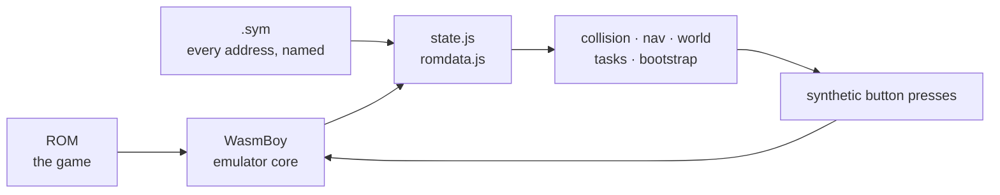

That loop is the whole program. Everything else is detail about how each box
answers its question.

<details>
<summary><b>Advanced detail:</b> why this and not screen-scraping</summary>

Reading pixels would mean OCR on a 160×144 screen, and it could not answer the
questions that actually matter — *what species is this*, *what is behind that
wall*, *which tile is a doorway*. Those are not on screen at all.

The cost is a hard dependency on a `.sym` from the same build as the ROM.
`Symbols.require()` fails at load rather than mid-task if a name is missing, so
a mismatched pair is a sentence on the loader instead of a mystery three minutes
into a grind.

The desktop sibling ([crystal-pilot](https://github.com/minormending/crystal-pilot))
does the same thing with PyBoy, and additionally sets **CPU hooks** — the game
tells it when the battle menu opens. No browser core offers breakpoints, so
everything here is polled instead. That single difference is the source of most
of the subtleties in sections 6 and 7.

</details>

---

## 2. The shape of it

<!-- covers-api: app/main.js app/bootstrap.js app/tasks.js app/nav.js app/world.js app/collision.js app/state.js app/romdata.js app/symbols.js app/gb.js @ 3969889a4e0f -->

Ten modules. Arrows point from a module to the ones it imports.

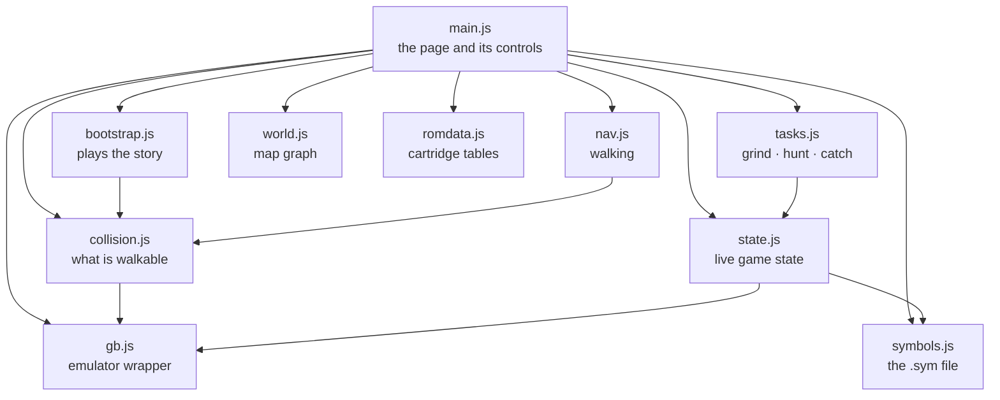

| Module | Answers |
| --- | --- |
| `gb.js` | "run some frames", "read memory", "hold this button" |
| `symbols.js` | "where does `wPartyCount` live?" |
| `state.js` | "what is happening right now?" |
| `romdata.js` | "what is species 155 called?" |
| `collision.js` | "can I stand there, and how do I get there?" |
| `nav.js` | "walk to this tile" |
| `world.js` | "which map is west of here?" |
| `tasks.js` | "grind to level 12", "catch a Sentret" |
| `bootstrap.js` | "start a new game", "fetch Poké Balls" |
| `main.js` | everything the person holding the phone touches |

The dependency direction is the design: **nothing below `tasks.js` knows what a
task is, and nothing below `bootstrap.js` knows the name of a single map.**

<details>
<summary><b>Advanced detail:</b> the one boundary worth defending</summary>

`tasks.js` deliberately does **not** know where a Pokémon Center is, where grass
is, or how to get anywhere. That knowledge lives in `bootstrap.js`, which owns
the map constants.

The seam is a set of callbacks passed into the task options:

```js
tasks.grind(0, target, {
  heal:    () => boot.healUp(),
  regrass: () => boot.backToGrass(),
});
```

This is not decoration. Both hooks were added after real failures: a grind that
could not heal trained a Pokémon to death, and a grind whose pacing wandered off
the grass starved five battles in while standing on a route covered in it. Both
needed map knowledge that `tasks.js` should not have, and passing a function in
was cheaper than moving the boundary.

</details>

---

## 3. The layers, bottom up

### `gb.js` — the emulator

<!-- covers: app/gb.js @ 16d3c58c2cb3 -->

Wraps WasmBoy. Runs frames, reads work RAM, holds and releases buttons.

The important part of its interface is that **buttons are held, not tapped**:
`hold('LEFT')`, then `release('LEFT')`. Gen 2 turns you before it walks you, so
a short press in a new direction only turns you on the spot.

<details>
<summary><b>Advanced detail:</b> what this core will and will not do</summary>

**`_getWasmMemorySection` returns a copy, not a live view.** You cannot write to
it and have the game notice. That is why nothing here injects items or party
members — everything is earned by pressing buttons, including the five Poké Balls
in section 8. Measured rather than assumed: two calls for the same range return
different objects with different buffers, the core exposes no writer at all, and
writing through the copy resolves without error and changes nothing.

**So save states are impossible here, and the two methods offering them were
removed.** A snapshot you can never put back is not a save state. Worth stating
plainly because the code claimed otherwise for a long time: `saveState()`
resolved, handing back `{wasmboyMemory, date, isAuto}` with all four of
`wasmboyMemory`'s fields `undefined` — the right shape holding nothing — and
`loadState()` threw `Cannot read properties of undefined (reading 'buffer')` on
it. Neither was called from anywhere, which is the only reason it went unnoticed;
the README had listed both as available since the feasibility notes.

**The battery save is the one that *can* work**, because it only needs reading.
`batterySave()` used to return `this.core.getSavedMemory()`, which is
`[{saveStates}]` — the record WasmBoy persists to IndexedDB, not save data, and
not writable to a file. It now locates `CARTRIDGE_RAM_LOCATION` the same way
`start()` locates work RAM and returns 32768 bytes, which is Crystal's battery
and the same size as the desktop's `.sav`. It reads all zeroes until the game
commits an in-game save, and nothing here drives the SAVE menu yet — so the read
is verified for type, size and region, and not against real save data.

**Frames must be stepped differently when the page is hidden.** `_runNumberOfFrames`
awaits `pause()`, which needs an animation frame, and a hidden page does not get
them. So `run()` splits:

```js
async run(n = 1) {
  if (!document.hidden) { await this.core._runNumberOfFrames(n); return; }
  for (let i = 0; i < n; i++) await this.core._runWasmExport('executeFrame', []);
}
```

Reads are deliberately small. `readBytes(addr, len)` exists alongside
`readWram()` because a step polls coordinates every couple of frames, and
pulling a whole 8 KB snapshot that often costs more than the emulation it is
watching.

</details>

### `symbols.js` — where things live

<!-- covers: app/symbols.js @ 708380d6929a -->

Parses the `.sym` file into `name → { bank, addr }`. First definition wins;
later duplicates are aliases and locals.

### `state.js` — what the game is doing right now

<!-- covers: app/state.js @ 4b8815618cf2 -->

One snapshot, many answers: `inBattle`, `party`, `pos`, `onGrass`,
`worldLoaded`, `menu`, `balls`, and the enemy's HP.

<details>
<summary><b>Advanced detail:</b> the signals that are not what they look like</summary>

- **`worldLoaded` is `wMapStatus == 2`, not "is there a party".** The CONTINUE
  screen restores party and coordinates *before* the map exists, so waiting on
  party data starts pressing buttons while still in the menus.
- **`wMenuCursorY` reads 3 while idle in a field**, so it cannot be used alone to
  mean "a menu is open". `wWindowStackSize > 0` is the reliable signal, exposed
  as `windowOpen`.
- **`menuItems` and `menuTop` identify *which* menu is drawn** — see section 6,
  where confusing the pack for the battle menu cost five Poké Balls.
- **`wBalls` does not settle until a battle ends.** A Pokémon can already be
  caught while the bag still reads five. Never difference the bag mid-battle.

</details>

### `romdata.js` — what the cartridge knows

<!-- covers: app/romdata.js @ f218aefa92d9 -->

Species names, item names, wild-encounter tables, move power. All read out of
the ROM, not shipped as a copy, so they cannot drift from the build being driven.

<details>
<summary><b>Advanced detail:</b> table layouts, and the one that bites</summary>

- `PokemonNames` — fixed width 10, terminated by `$50`.
- `ItemNames` — **variable length**, packed, each ended by `@`. Reading at a
  fixed stride drifts one character further out per entry: `ULTRA BALL` came
  back as `LTRA BALL`, `GREAT BALL` as `AT BALL`. `itemName()` walks the
  terminators.
- `JohtoGrassWildMons` — per map: group, number, three rates, then **three
  blocks of seven** `(level, species)` pairs for morning, day and night.
  Time-of-day matters: Route 29 trades Pidgey and Sentret for Hoothoot after
  dark, and offering a species that cannot appear sends a hunt after something
  that was never there.
- `Moves` — 7 bytes each, **effect at offset 1, power at offset 2**.
  `isChipMove()` needs both. Status moves have power 0, which rules them out.
  But eleven moves lie about their power: Gen 2 computes their damage rather
  than scaling it, so it stores them at 0 or 1 — which puts Guillotine, Horn
  Drill and Fissure *ahead* of Tackle when ranking ascending. Asked for the
  weakest damaging move, the first version returned a one-hit KO. They are
  excluded by effect id (`38, 40, 87, 88, 89, 144`), read out of the cartridge's
  own move table rather than counted from the disassembly's `const_def` order.
  This is **not** the same as "fixed damage": `EFFECT_STATIC_DAMAGE` really does
  store its damage as its power, so Dragon Rage reads 40, takes 40, and ranks
  correctly.
- `0x54` is a one-byte ligature for `POKé`.

</details>

### `collision.js` — what you can walk on

<!-- covers: app/collision.js @ bcf56deca762 -->

Decodes the loaded map into "can I stand on this tile", and does breadth-first
pathfinding over the result. This is what turns walking from trial and error
into a plan.

<details>
<summary><b>Advanced detail:</b> the decode, and why one check is not enough</summary>

`wOverworldMapBlocks` holds the loaded map's blocks; each tileset's per-quadrant
collision values sit in ROM at `wTilesetCollisionAddress`. Indexing comes from
`GetBlockLocation` in `home/map.asm`:

```
stride   = wMapWidth + 6
index    = 1 + stride * (1 + ((y + oy) >> 1)) + ((x + ox) >> 1)
quadrant = ((y + oy) & 1) * 2 + ((x + ox) & 1)
```

`calibrate()` checks its own arithmetic by reproducing `wPlayerTileCollision`,
the collision of the tile the player is standing on. **That check is necessary
and not sufficient.** A wrong offset can reproduce that one byte by luck, most
easily where the value is a common one — measured on a doorway mid-transition,
the true offset did not match and a fallback did, so the whole map decoded
shifted and a route that existed looked walled off. It fails by producing a
*confident* map rather than an error.

So `Bootstrap.settled()` requires the answer to hold still: same offset, same
player tile, twice in a row, a few frames apart.

Two more things the map alone will not tell you:

- **Ledges are one-way.** A ledge tile can be stood on; it is *leaving* one in
  the hop direction that moves two tiles irreversibly. `pathTo` never includes a
  hop, so a planned route can always be walked back.
- **The map is terrain only.** NPCs read as open floor. `occupied()` reads
  `wMapObjects` — sixteen 16-byte entries, coordinates stored four higher than
  the map's own — and those tiles are *preferred against* rather than treated as
  walls, because an object hidden by its event flag still has an entry.

</details>

### `nav.js` — walking

<!-- covers: app/nav.js @ 9d1b6ede4f12 -->

`step()` takes one tile. `walkTo()` gets to a tile, re-planning every step.

### `world.js` — which map adjoins which

<!-- covers: app/world.js @ 5e2c55feb792 -->

The map graph, read out of the cartridge: edge connections *and* warps, so it can
route out of a building rather than only across a route.

<details>
<summary><b>Advanced detail:</b> lazily, because there is no map count in the ROM</summary>

Each map header points at a map-attributes block whose tail is a bitmask of
connected sides plus one 12-byte struct per connection naming the map beyond it.
Warps live in the map's event block: two filler bytes, a count, then five bytes
per warp — `y`, `x`, the destination warp index, and the group and number of the
map it leads to.

Nothing is loaded up front. The ROM carries no table of how many maps a group
holds — the disassembly knows that from constants the cartridge does not have —
so walking every map is impossible. It is also unnecessary: connections name
their neighbours, so expanding outward from wherever the player is reaches
everything walkable and nothing else.

Checked against `data/maps/attributes.asm`: Cherrygrove gives
`UP → Route 30, RIGHT → Route 29`; Route 31 gives `DOWN → Route 30, LEFT →
Violet`. Warps check out too — Mr. Pokémon's house at `(2,7)` and `(3,7)`,
Route 30's door to it at `(17,5)`.

</details>

---

## 4. Taking one step, and planning a walk

<!-- covers: app/nav.js app/collision.js @ 2e522063e501 -->

### One step

A step is **not** "press the button for N frames". Fixed-length presses go
wrong in both directions: too short and the press is spent turning, too long and
you take a second step into grass you did not plan for.

So `step()` holds the direction until the coordinate actually changes, then
stops — and then waits for the player to come to rest before reporting.

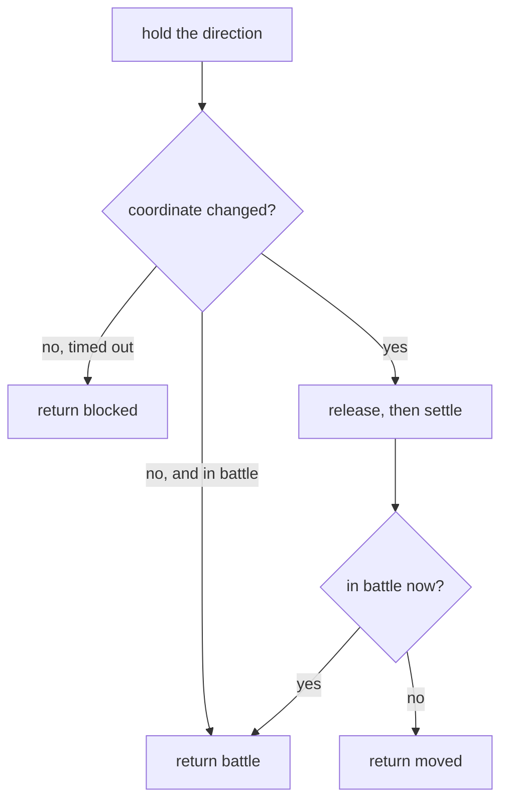

`blocked` is an answer, not a failure: it is how a plan discovers that something
the collision map cannot see — an NPC — is standing in the way.

<details>
<summary><b>Advanced detail:</b> why "settle" needs two things, not one</summary>

The coordinates change when the game **commits** to a step, not when it
finishes. Returning at that moment reports a tile the player has not reached,
and the next press lands mid-stride while the game still holds the previous
direction — so every step performed the one before it.

Waiting on the coordinate alone is still not enough. `restState()` watches the
coordinate *and* the camera (`wPlayerBGMapOffsetX/Y`), because the camera is
still sliding when the coordinate has already changed: measured, settling on the
coordinate alone returned with the camera six pixels short of rest. Anything
reading the screen at that moment — or working out which tile a tap meant — is
reading a world that is still moving.

At rest the camera offset is `48 - 16 * coord`. It slides during frames 11–22 of
a step while the coordinate changes at frame 23.

</details>

### Planning a walk

`walkTo()` re-plans from where the player actually is, **every step**. A path is
a plan and plans go stale; following one blindly means a single missed step puts
every later step in the wrong place while the walk still reports success.

The planning itself gives up one assumption at a time:

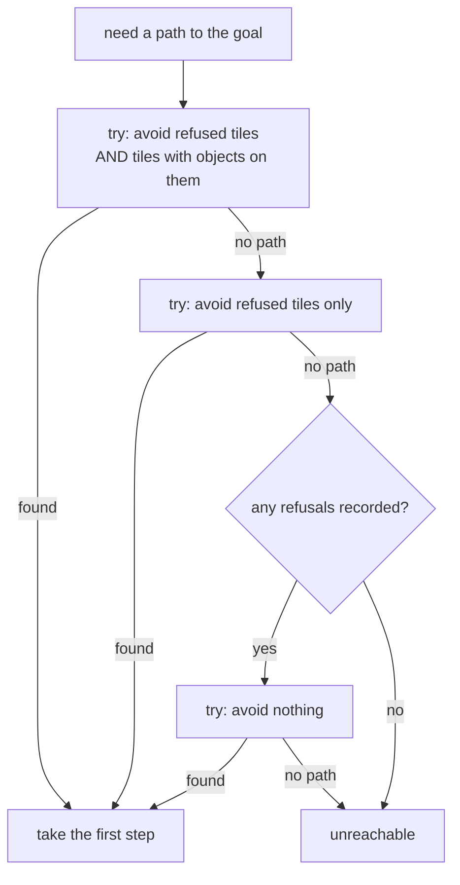

Being too careful and being too trusting fail in opposite directions, so it
tries both in order.

<details>
<summary><b>Advanced detail:</b> the bug that produced the third tier</summary>

Originally a tile that refused a step went into `avoid` **for good**. On Route
30 the only corridor north is one tile wide, so banning it made the goal
unreachable — and the walk gave up before the three-refusal counter could ever
notice it was the same obstacle twice. The log was unambiguous once instrumented:

```
path 6,26->6,0 avoid=0 = 36 steps
step LEFT -> blocked @6,26
path 6,26->6,0 avoid=1 = NULL          <- one refusal sealed the route
```

Dropping the object list second is the right order because that list is what the
map *placed*, not what is really there: an object hidden by its event flag still
has an entry, so treating those as walls seals corridors that are open.

`walkTo` returns `stopped` as one of `null | battle | unreachable | refused |
decode | cancelled | stuck | warped`. `warped` matters: a goal is a tile on one
particular map, and stepping onto a doorway changes the map underneath, at which
point those coordinates mean somewhere else entirely.

</details>

---

## 5. Crossing to the next map

<!-- covers: app/bootstrap.js app/world.js @ 2ecf6f282297 -->

A connection spans only part of a shared edge, so "walk west until something
happens" does not work. `crossEdge()` closes the distance in stages, then tries
the openings.

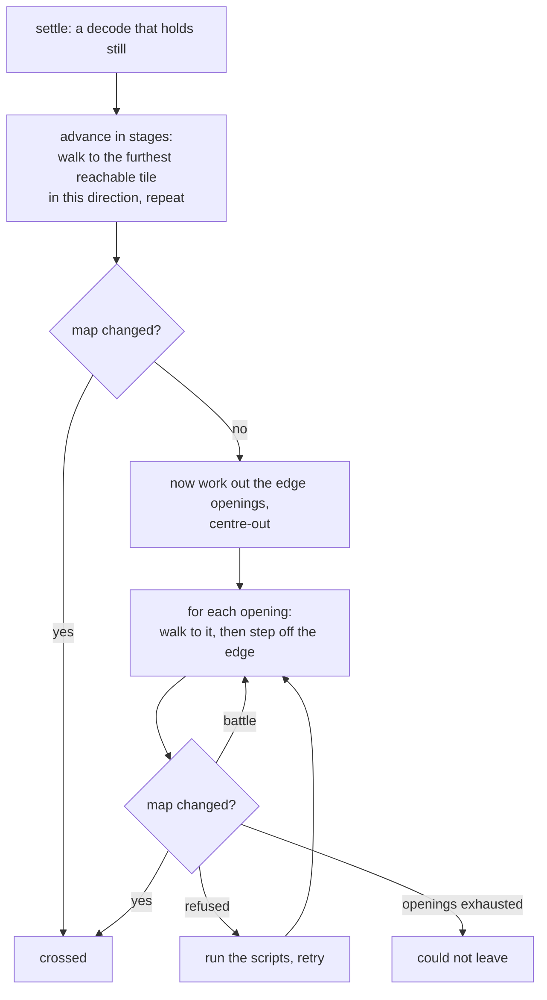

Three things in that diagram were each a separate bug.

<details>
<summary><b>Advanced detail:</b> all three, in the order they were found</summary>

**1. Openings are found centre-out, and filtered before sorting.** Sorting the
whole edge and taking the nearest few tried eight walls in a row: New Bark's west
side only opens at rows 8, 9, 12 and 13, and the player leaves the lab at row 3,
so every candidate near them is fence. Centre-out because a route's connection
sits inland of its corners.

**2. The staged advance exists because a route is longer than one plan.** Route
30 is fifty-four tiles top to bottom and fenced with ledges, so the opening at
the far end is not reachable in one plan from the near end. `furthestToward()`
BFSes from the player and returns the reachable tile furthest in the wanted
direction; the crossing walks there and asks again.

**3. The openings are computed *after* the advance, not before.** This was the
real cause of what looked like flakiness. Coming through a door, the decode has
not settled — and an edge measured then belongs to whatever map was still
loaded. Two failing crossings were caught in a log, both starting on a doorway
(Mr. Pokémon's, and the Pokémon Center), both spending every attempt walking at
tiles that had never been openings. With the settle and the re-measure, six
crossings in a row cross first time.

**Warp carpets are directional.** Most warps fire the moment you step on them.
Carpets do not: `CheckDirectionalWarp` wants the way the carpet points — `0x70`
DOWN, `0x76` LEFT, `0x78` UP, `0x7e` RIGHT. Standing on one and pressing
anything else simply walks you off it, which is what made the front door of the
player's house look like a wall that could be reached but never opened.
`CollisionMap.pushFor()` returns the required direction.

</details>

### Travelling further than one map

`travelTo()` asks the graph for a route and walks one leg at a time, re-asking
from the map it actually landed on. A leg that fails is retried up to three
times — measured, the same leg failed on one run and worked on the next, so one
refusal is not an answer.

---

## 6. Battles

<!-- covers: app/tasks.js app/state.js @ cb9912e7f82d -->

### Is it our turn?

Everything in a battle depends on knowing when the game is waiting for a
choice. Getting this wrong is the single most expensive mistake in this
codebase, so it is worth understanding exactly.

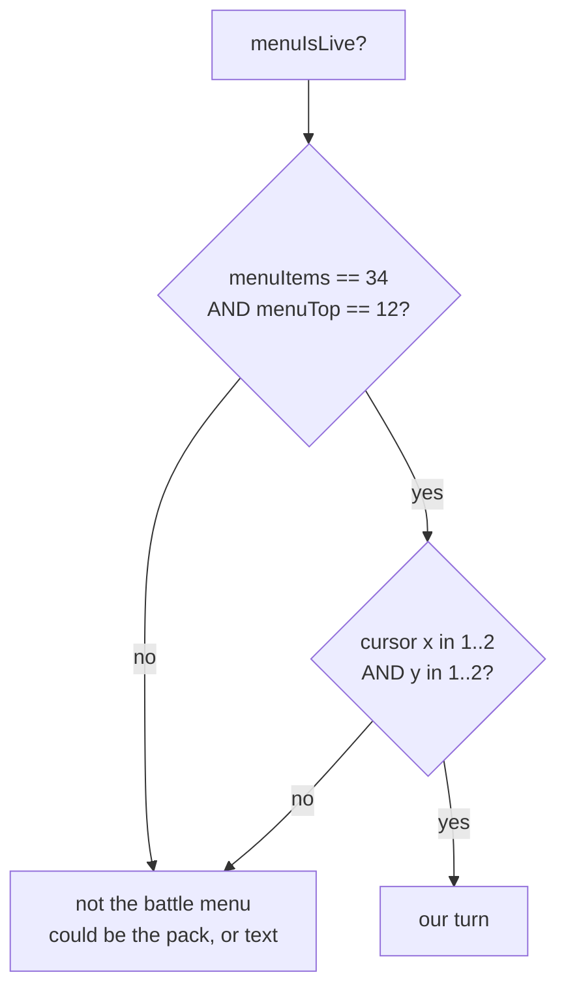

<details>
<summary><b>Advanced detail:</b> the two wrong versions, and what each cost</summary>

**Version one required `wBattleMenuCursorPosition == 0`.** That register holds
the action *last chosen*, not whether the menu is waiting: it is 0 until the
first choice of a battle and keeps that choice afterwards. So the test matched
only the opening turn and was false for every turn after. Measured at a menu
plainly live and taking input, it read 3.

That one line broke four things at once: `awaitBattleMenu` spent 150 presses and
returned null, `flee` could not tell a refusal from an escape, `fightBattle`
could not see its turn come round, and `watchThrow` could not see a Pokémon
break free. The 150-press ceiling had been raised from 40 to paper over it.

**Version two used the cursor alone.** But the pack parks the cursor at `(1,1)`
too — so a ball in mid-air read as a fresh menu, and the throw was abandoned
while the game was still saying "used the POKé BALL". That is how a single catch
attempt could burn five balls and catch nothing.

Which menu is *drawn* settles it. Measured:

| state | `wMenuDataItems` | `wMenuBorderTopCoord` |
| --- | --- | --- |
| battle menu | 34 | 12 |
| pack | 5 | 1 |
| pack, mid-throw | 2 | 0 |
| post-catch text | 2 | 7 |

The move menu shares the battle menu's box, and that is fine — both mean the
game is waiting on us.

</details>

### Playing out a battle

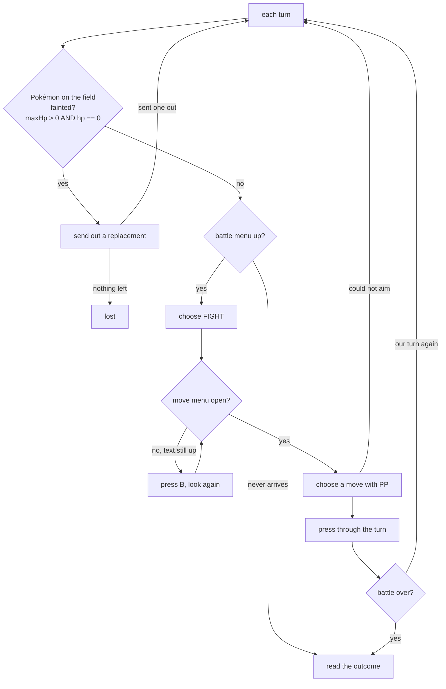

<details>
<summary><b>Advanced detail:</b> four traps in that one flow</summary>

**"Not in battle any more" is not "won".** Whiting out ends the battle too, and
reading that as a win let a grind report five straight victories with the party
at 0 HP, then wake up in bed wondering why the map had changed. `_outcome()`
checks whether every party member is at 0 HP.

**A move with no PP is chosen forever.** The move menu does not open while a
message is up, and the cursor reads 0 then — so move selection was skipped and
the A-mashing fallback picked the first move, the one with no PP, producing the
same message. **Eighty-four "battles" in one grind were that single refusal
going round.** `chooseMove` now confirms only when the cursor really is on the
move it meant, and `fightBattle` presses B and looks again rather than pressing
A into a message.

**Out of PP is a reason to heal**, not to fight on: the game forces Struggle,
which hurts the thing being trained, and a Pokémon Center restores PP.

**A fainted lead is a prompt, not a state.** Gen 2 does not offer a choice — the
lead goes down, the game asks "Which POKéMON?" and waits. With a party of one it
never came up because the battle simply ended. Three separate things had to be
right:

- *"No HP" and "no Pokémon loaded yet" read identically.* At "Wild PIDGEY
  appeared!" the battle mon is not loaded and both `hp` and `maxHp` are zero, so
  keying off `hp` alone fired at the start of every battle — five stuck battles
  in four tenths of a second, having sent nothing out.
- *That screen's cursor is not in memory anywhere findable.* `wMenuCursorY`
  stays pinned at 1 on it, `wPartyMenuCursor` and `wCurPartyMon` never move, and
  diffing all 8 KB of work RAM across a press turns up 87 changed bytes with no
  index among them — the arrow is drawn from sprite data. So `sendOut()` does
  not read the cursor: it steps down to the slot it wants, confirms, and checks
  whether something is actually on the field. Which is the better test anyway,
  because choosing a fainted Pokémon is *refused* with "There's no will to
  battle!" and no cursor reading would have predicted that.
- *The screen ignores the presses the battle menu takes.* At five frames every
  direction was swallowed, so every confirm landed on the fainted lead. It wants
  about twelve frames **and** a pause between presses — the prompt arrives with
  "CYNDAQUIL fainted!" still running and a direction sent into that is dropped.

**You cannot run from a trainer.** `wBattleMode` is 1 for wild and 2 for
trainer. `escapeBattle()` fights trainers and flees wild ones — a pilot that
only knew how to flee stood in the rival battle losing HP until something
fainted.

</details>

---

## 7. Catching something

<!-- covers: app/tasks.js app/romdata.js @ 272447fc543b -->

Catching is the most involved loop, because a Poké Ball's odds turn on how much
HP is left. Throwing at a full-health target is mostly throwing balls away.

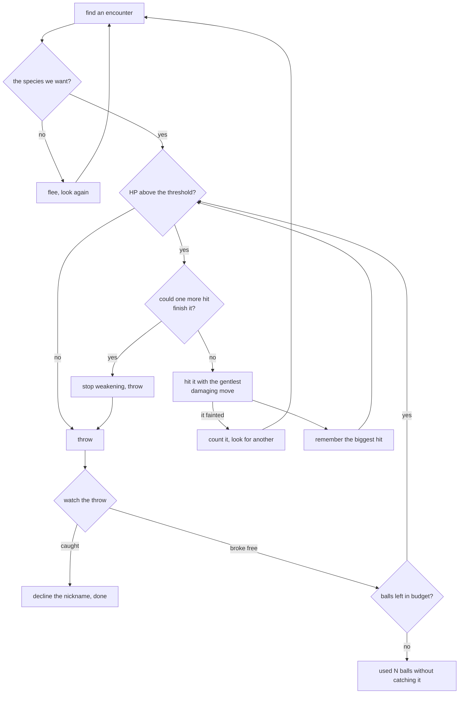

<details>
<summary><b>Advanced detail:</b> the learning, and why it is not per-encounter</summary>

**The gentlest attack, not the first one.** That is why `romdata` reads the move
table at all — leading with whatever is in slot one knocks out the thing being
caught, and a fainted Pokémon cannot be caught by anything. "Gentlest" cannot be
read off the power byte alone, though: see [the move table](#romdatajs--what-the-cartridge-knows) for
the eleven moves that store 0 or 1 while taking half the bar, your level in HP,
or all of it. The memory below cannot cover for that one — it learns from the
swing it just took, so opening with Guillotine teaches it the maximum and costs
the target to do it.

**The threshold alone is not a safe stopping point.** Against a Lv2 Rattata one
swing carries it from above the line to zero. So the pilot remembers the biggest
hit it has landed and refuses to swing when the target's HP is already inside
that range.

**That memory lives outside the per-encounter scope on purpose.** The one swing
that cannot be guarded is the *first* one, so a knockout is itself a
measurement: it tells the pilot its own damage, and every target afterwards
whose HP is already inside that range gets thrown at rather than hit. Measured —
the first version knocked out a Lv2 Rattata; hoisting the value fixed it, and
the following run caught four out of four with no knockouts.

Weakening spends no ball, so it is bounded at eight swings, or a move that kept
missing would loop for good with the ball budget never moving.

**A knockout usually arrives as `ended`, not as `fainted`.** `chip()` checks
whether it is still in a battle before it reads the enemy's HP, because it has
to — the enemy struct reads zero once the battle is over, so trusting that zero
would call every finished battle a knockout. The consequence is that a knockout
which beats the poll comes back as `ended`, and treating that as "work out what
happened later" reports it as a spent ball budget: the wrong reason, and the
guard learns nothing from the one measurement worth having. What tells the two
apart is our *own* party, which still answers after the battle ends — lead still
standing means the target went down, lead at zero means we did. The desktop
pilot had the same bug and reported seven kills as "got away" before a live hunt
caught it.

**Throws are counted as throws, not as bag deltas.** `wBalls` only settles when
the battle ends, so an interim attempt to detect throws that never happened by
comparing ball counts was built on a false premise and had to come back out.
With throws counted directly, every round's count matches the bag delta exactly:
`thrown=1 bag 5→4`, `thrown=2 bag 4→2`.

**A chip that ends badly can leave the move menu open**, and `menuIsLive` cannot
tell that from the battle menu — they share the same box. The pack was then
opened from inside the move list and the throw could not find a ball, so
weakening backs out before it throws.

**The nickname prompt is answered *no*.** The "do you want this one?" box that
precedes it defaults to yes, which is what we want; the nickname box does not.

</details>

---

## 7a. Three that act on where you already are

<!-- covers: app/tasks.js app/bootstrap.js @ 52816c78e11e -->

Grind, hunt and catch all go *looking* for something. These three do the obvious
thing with the situation you are already in, and take no parameters:

| Command | Does | Refuses when |
| --- | --- | --- |
| **Battle** | plays out the battle you are in, wild or trainer | you are not in one |
| **Catch this one** | weakens and throws at the wild Pokémon in front of you | not in a battle · it is a trainer's · party full · no balls |
| **Heal** | goes to the nearer heal place and comes back | you are in a battle · nothing is hurt |

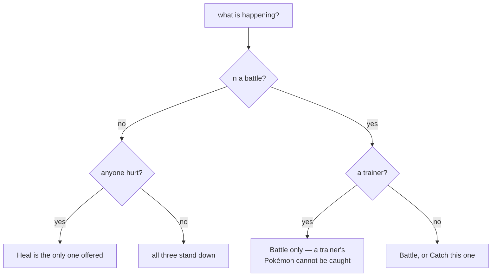

Each row in the interface says which of those it is, so the reason a thing is
unavailable is on screen rather than discovered by pressing it.

<details>
<summary><b>Advanced detail:</b> what was extracted, and what was not</summary>

**`captureHere` is the battle-facing half of `catch_`**, split out because it is
now also a command. `catch_` finds the species and delegates per encounter; the
standalone version skips the finding.

The split matters for one thing in particular: `catch_` passes a shared
`memory` object holding the biggest hit landed so far, because when hunting, the
one swing that cannot be guarded is the *first* one — a knockout is itself a
measurement that every later target benefits from. Called on its own there is no
earlier encounter to learn from, so it starts cold. That is correct rather than
a limitation, but it does mean a single `Catch this one` on a very low-level
target can still knock it out where a hunt would not.

**`battleHere` is a guard and a report around `fightBattle`**, not new battle
logic. Everything in [section 6](#6-battles) applies — the fainted-lead prompt,
trainers being unfleeable, PP exhaustion — because it is the same engine.

**`healNow` likewise wraps `healUp`**, which already chooses between Elm's
computer and the Pokémon Center by distance. It refuses in a battle rather than
pressing buttons hopefully, and reports "already at full health" as a success
rather than an error, because nothing needed doing.

**Two constants moved to `state.js` while doing this.** `TRAINER_BATTLE` and
`MAX_PARTY` were each defined in more than one module — a magic `2` and a magic
`6` stated in three places between them. `state.js` is the module whose job is
interpreting memory values, so they live there now and the others import them.
This surfaced as a plain `ReferenceError` the first time `captureHere` ran,
which is worth knowing: the syntax check in `tools/check-app` parses every
module but cannot see an undefined reference. That class of bug only shows up by
running the thing.

</details>

## 8. The errands

<!-- covers: app/bootstrap.js @ 7ea837455a0e -->

### Starting a new game

Two presses, because the middle of it is not the pilot's decision.

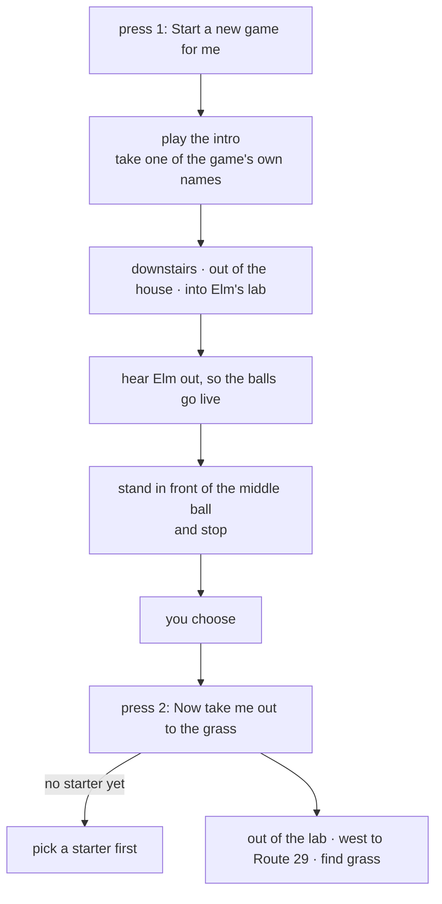

Which of the three you want is the one real decision in the opening, and a tool
that plays the boring parts should hand that back rather than answer it. The app
also tells you which ball is which, because the game does not — they are three
identical sprites and the name only appears once you are already talking to one.
Left to right: **Cyndaquil, Totodile, Chikorita** (`ElmsLab.asm`, x = 6, 7, 8).

### Where to heal

There are two places, and which is nearer flips depending on where you stand.

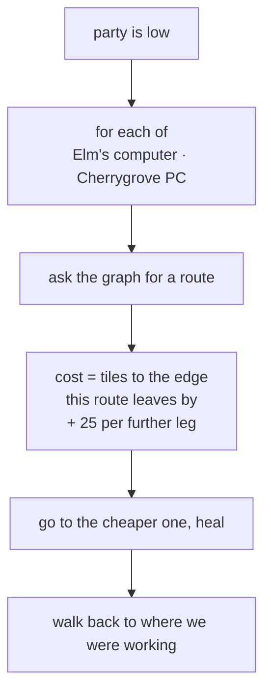

<details>
<summary><b>Advanced detail:</b> why leg-counting gets this wrong</summary>

Elm has a healing machine in his lab and it works from the moment you take a
starter — `bg_event 2, 1` in `ElmsLab.asm`, gated on
`EVENT_GOT_A_POKEMON_FROM_ELM`, a yes/no and then `special HealParty`. No
Pokédex, no Pokémon Center, no fee.

Counting legs of the world graph picks wrong in the common case. By legs the
Center is one hop from Route 29 and the lab is two, so the Center wins
everywhere — but a hop west is the whole sixty-tile width of the route through
grass, while the lab from the eastern end, where the bootstrap leaves you, is six
tiles and a door.

Measured standing at x=53 of 60 on Route 29: the lab costs 31 against the
Center's 53, and healing a fainted party took 1.8 seconds. Below about x=25 the
answer swings back to Cherrygrove, which is the point of computing it.

**Healing has to come back.** It used to end standing in Cherrygrove, which has
no grass in it, so a grind that healed itself resumed in a town and stopped on
the next breath saying it could not find any wild Pokémon — with a full-health
party, one map away from the route it had been working.

</details>

### Getting Poké Balls

The game gates them deliberately, and the route round it is not the obvious one.

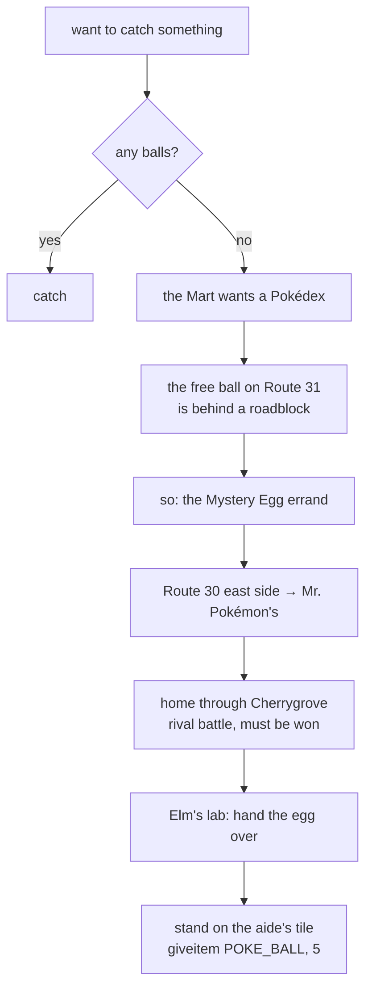

<details>
<summary><b>Advanced detail:</b> the roadblock, and why Route 31 is the long way</summary>

Route 30's one-tile corridor north is filled by Youngster Joey at `(5,26)` with
two Rattata sprites at `(5,24)` and `(5,25)`, all three conditional on
`EVENT_ROUTE_30_BATTLE` — which is **clear** on a new game, so the objects are
there until it gets set. It is a deliberate roadblock, and returning the Mystery
Egg is what lifts it.

Which makes Route 31 the long way round, because the same errand ends with
`giveitem POKE_BALL, 5` in Elm's lab, from a `coord_event` the player only has
to stand on. Mr. Pokémon's house is at Route 30 `(17,5)` — on the *east* side,
the half the roadblock does not touch.

The errand is idempotent: run it twice and it returns *already carrying 5
ball(s)* without moving. It used to walk the whole thing again and report
success without gaining a ball, because its success test was "are there balls in
the bag" rather than "did we gain any".

</details>

---

## 9. The interface

<!-- covers: app/main.js index.html @ 70e54d83f74a -->

The app does two jobs and used to look identical doing both: you play it by
hand, or you send the pilot off to work for ninety seconds.

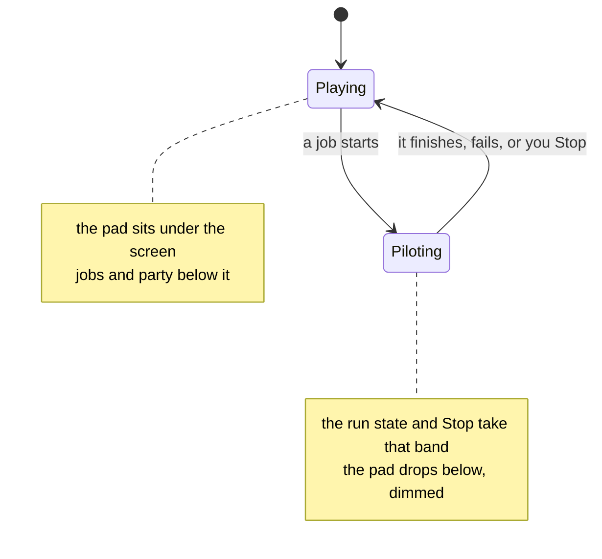

`main` is a column flex and the order is a decision, switched by one class on
`<body>` set where `running` was already set.

| | directly under the screen | then |
| --- | --- | --- |
| **Playing** | the pad | status, the jobs, the party |
| **Piloting** | the run state and Stop | the jobs, then the pad, dimmed |

The pilot's jobs are a **list, not a toolbar**, because `runTask` opens with
`if (running) return null` — only one job can ever be underway, so they are one
mutually exclusive choice.

<details>
<summary><b>Advanced detail:</b> the measurements, and one lifecycle rule</summary>

Measured on 375 × 812 with a game running, the page was **1537px** — 1.89
screens — with the emulator at the top and everything that starts or stops the
pilot at the bottom. There was no scroll position from which you could watch the
game and reach the thing that stops it. Both Stop buttons sat at 1181px and
1463px.

Header, screen, hint and the whole pad measure **596px**, so the Game Boy
arrangement fits above an 812px fold with 216px over — room the old layout spent
on a slider and a documentation link wedged between the screen and the buttons.

Afterwards: page 1424px, pad card 341px → 257px, and the screen, pad, status and
run log all above the fold. It got *shorter* while gaining a run log and three
job state lines, because the duplicate Stop, two prose footers and the stepper
all went.

**`runTask` owns the whole lifecycle in a `finally`.** Before that, each handler
set `running`, disabled its button and cleared both at the end — which only
happened if nothing threw. One exception left the button disabled for good, the
status frozen mid-task with no error shown, and `running` stuck true so nothing
else would start either. The app was finished until a reload.

**Tap-to-walk deliberately does not switch modes.** It sets `running`, because
the idle loop must stand down and no job may start on top of it, but a walk
lasts a couple of seconds and reordering the page under a thumb that just tapped
it would cost more than the dimming is worth.

**The idle loop re-arms on every visibility change**, with a generation counter.
It used to re-arm only from inside its own animation-frame callback, and a frame
pending when a page is hidden never arrives — so the chain was lost, the loop
died on the first background, and the game stayed frozen ever after, including
back in the foreground. Measured: zero animation frames scheduled in three
seconds by a page whose loop was supposedly running.

</details>

### Colour

Two palettes, named by the job each colour does — `--action` for filled controls
that carry a label, `--accent` only where no text sits on it, `--mark` for where
you tapped, `--raise` for anything pressable. Dark is the base; light is a real
second palette, not an inversion. The control is three-state: auto, light, dark.

<details>
<summary><b>Advanced detail:</b> what the role split fixed</summary>

`--accent` used to mean six unrelated things: the primary action, a selected
species, a selected level, a held key, where you tapped, and something running.
When everything important is the same blue, blue signals nothing.

Four measurable failures went with it:

| | was | needed |
| --- | --- | --- |
| ordinary buttons filled with `--panel`, the card's own colour | 1.00:1 | a visible step |
| `#fff` on the accent — every Start button's label | 3.80:1 | 4.5 |
| the Stop label | 3.93:1 | 4.5 |
| Select / Start on a raised key | 4.41:1 | 4.5 |

The button fill is the instructive one: the stylesheet already carried the
comment *"a button the same colour as its container reads as a label"* and had
applied it only to the D-pad.

Three things do not flip between themes. A pressable cannot be *lighter* than a
white card, so on light the fill steps down and the border does more of the
work. The gamepad needs a bigger step than ordinary buttons because it is drawn
as one connected cross with no borders — the fill is all that separates it from
the card. And `--mark` is identical in both, because where you tapped sits on the
game's own picture, not on a surface of ours.

</details>

---

## 10. Keeping this honest

A document that drifts is worse than no document, so the sections that describe
code carry a marker naming the files they cover and the content hash at the time
the prose was last checked:

```html
<!-- covers: app/nav.js app/collision.js @ a1b2c3d4e5f6 -->
```

Sections that describe how the modules fit together — the diagram and table in
[The shape of it](#2-the-shape-of-it) — use a second form that hashes only the
`import` and `export` lines:

```html
<!-- covers-api: app/nav.js app/world.js @ a1b2c3d4e5f6 -->
```

Such a section goes stale when the module surface changes, not when a comment
inside one of them is reworded.

`tools/docs-check` recomputes those hashes. If a covered file has changed, it
tells you which section to re-read:

```bash
tools/docs-check
```

```bash
tools/docs-check --update
```

The first reports drift. The second records the current hashes, which is what
you run **after** bringing the prose back in line.

A `pre-commit` hook runs the check against staged files. Enable it once per
clone:

```bash
git config core.hooksPath .githooks
```

### The other checks

`tools/check-app` runs everything that can be verified without a ROM:

```bash
tools/check-app              # all of it
tools/check-app contrast     # or one group
```

| Group | Checks |
| --- | --- |
| `syntax` | every module parses |
| `shell` | the service worker's cached list matches what is on disk, both ways |
| `markup` | `index.html` tags and CSS braces balance |
| `contrast` | the palette still meets contrast, in both themes |
| `gamefiles` | no ROM, save or symbol file has been committed |

CI (`.github/workflows/checks.yml`) runs `check-app` and `docs-check` on every
push. There is deliberately no emulator in CI: driving the game needs a ROM
built from the disassembly, and none is distributed, so the tasks are verified
by hand against a local build. The job is named `static-checks` for that reason.

<details>
<summary><b>Advanced detail:</b> two of those groups exist because of a real slip</summary>

**`shell` checks both directions.** A file listed in the service worker but
absent on disk makes the install reject, which takes the whole offline story
with it. A module present but *unlisted* is quietly served from the network and
breaks offline use with no error at all — which is how `app/world.js` was
nearly shipped when it was added.

**`contrast` encodes pairs that were measured once by hand.** Four of them were
failing before the palette was reworked — white on the accent was 3.80:1, so the
label on every Start button in the app failed. Without those thresholds written
down, the next palette edit quietly undoes that work.

**`syntax` copies each module to `.mjs` before checking it, and that is not
fussiness.** Measured on node v24: `node --check` on a **`.js`** file containing
a syntax error exits **0** — it does not report the error at all, presumably
because module detection makes the parse ambiguous. The same content as `.mjs`
exits 1. Checking the `.js` files directly would have been a green light that
meant nothing.

</details>

<details>
<summary><b>Advanced detail:</b> what this can and cannot tell you</summary>

It checks that the prose was *looked at* since the code changed. It cannot check
that the prose is correct — nothing can, short of a human reading both.

That is a deliberately modest guarantee, and it is the useful one: the failure
mode for documentation is not "someone wrote something wrong", it is "someone
changed the code and nobody remembered this file existed". A hash per section
turns that from invisible into a line of output naming the section.

Consequences worth knowing:

- **Whitespace counts.** Reformatting a covered file will flag its sections. That
  is the right trade: a cheap false positive beats a missed real one, and
  clearing it is one command.
- **The hook blocks rather than warns**, because a warning in a pre-commit hook
  is a warning nobody reads. The escape is printed in the failure message, and
  `git commit --no-verify` always works.
- **Section granularity is the point.** Covering the whole document with one
  hash would flag everything on every change and get switched off within a week.
  The first version of this hit exactly that: the module-graph section listed
  all ten files by content, so any comment edit anywhere flagged it, and an
  unrelated commit could be blocked by drift somewhere else. `covers-api` exists
  because of that — a comment change in `world.js` now flags the two sections
  describing what `world.js` does and leaves the architecture diagram alone,
  while a changed `export` flags the diagram too.
- **The scanner skips fenced code blocks.** A document explaining this marker
  format contains an example of it, and without that rule the tool rewrote its
  own documentation. It was caught immediately, because it reported fifteen
  tracked sections when fourteen had been marked.

</details>

---

## 11. Things that look like bugs and are not

Each of these was investigated and turned out to be correct behaviour. They are
here so the next person does not spend the same afternoon.

| Looks like | Actually |
| --- | --- |
| The emulator screen is black in a screenshot | A backgrounded tab does not paint the canvas — measured, zero non-black pixels of 23,040. Nothing is wrong with the game. |
| The idle loop advances nothing while the tab is hidden | Deliberate. The animation-frame stand-in is clamped by the browser to about one tick a second; it exists so the core's own waits finish, not to run a game. |
| The Catch button is disabled after a catch | `refreshBag` re-enables it from the bag contents on the next refresh. |
| The pilot routed out through the player's house mid-heal | The party had fainted, so the game had whited the player home. It was routing *out* of the bedroom, not detouring into it. |
| A service worker registration error in the console | The in-app browser pane blocks service-worker registration on its embedded origin. `sw.js` parses and serves correctly. |
| The same leg of a journey failed once and worked next time | Was genuinely nondeterministic; the cause was calibration on a doorway. See section 5. |
| `menuIsLive` returns false at a menu that is plainly up | Check `menuItems` and `menuTop` — you are probably looking at the pack, not the battle menu. |
