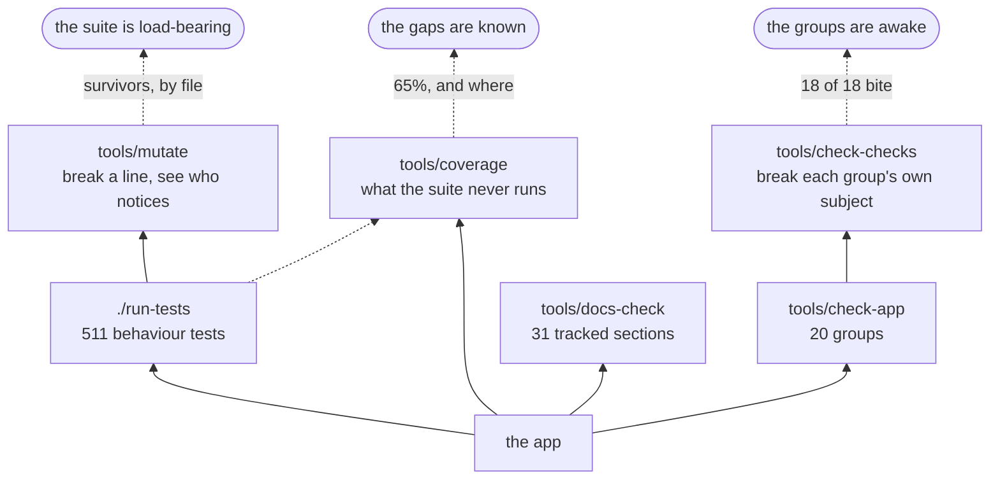

# Developing it

[← crystal-pilot mobile](../README.md) · [Using it](USING.md) · [The interface](INTERFACE.md) · [Two devices](DEVICES.md) · [What is proven](PROVEN.md) · [Developing](DEVELOPING.md) · [The code](CODE.md)

What can be checked without a ROM, how to run it locally, and why the tests
deliberately need no emulator.

---

## What runs, and where

Three things can run on a clean checkout with no ROM, and between them they are
what CI checks and what the pre-commit hook blocks on.


The hook is not installed by cloning. Enable it once per clone:

```bash
git config core.hooksPath .githooks
```

## Tests

```bash
./run-tests            # everything
./run-tests -k catch   # only names that match
./run-tests -v         # notes and stack lines
```

143 tests in seventeen files, and what each file is about says more than the count:

| file | tests | what it pins down |
| --- | --- | --- |
| `rows.mjs` | 31 | what every row and offer says, and when its button works |
| `battle.mjs` | 13 | whose turn it is, which Pokémon is out, and a win from a whiteout |
| `capture.mjs` | 12 | weakening, ball choice, the party prompt, and counting throws out of the bag |
| `titles.mjs` | 11 | choosing a profile for a cartridge, and falling back to generic |
| `control.mjs` | 10 | the task lifecycle: stopping, failing, undo points, and loops that must end |
| `remember.mjs` | 10 | which remembered choices are believed, and which dropped |
| `engine.mjs` | 8 | that a changed engine number is actually followed |
| `room.mjs` | 9 | the merge rules and the handshake, so two devices settle rather than fight |
| `journey.mjs` | 6 | choosing where to heal: the cost model, and a map with no name |
| `state.mjs` | 6 | reading the party, the map and the battery out of work RAM |
| `symbols.mjs` | 5 | the 45-address digest a second device boots from |
| `cartridge.mjs` | 4 | reading a ROM's own header: the logo, the title, Color-only |
| `input.mjs` | 3 | held buttons, and releasing them |
| `saves.mjs` | 3 | which battery record belongs to the cartridge in the machine |
| `collision.mjs` | 3 | which tiles have somebody standing on them |
| `menus.mjs` | 4 | the order the START menu is driven in, and what is closed between tries |
| `romdata.mjs` | 5 | the cartridge's own character encoding, byte by byte |

No ROM, no browser, no emulator — which is the point rather than a compromise.
The ROM is not in this repository and never will be, so a test that needs one
cannot run on a clean checkout or in CI, and a test that cannot run there does
not get run.

What that leaves is most of what has actually gone wrong. Every bug this app has
shipped was a decision made about a game state: picking a move whose power byte
lies, reporting a knockout as a getaway, giving up on a save while the game was
still settling, calling a blank cartridge saved. None of those needs a
cartridge. They need a plausible work-RAM snapshot and a way to watch what the
code does with it, which is what `tests/harness.mjs` provides — a fake Game Boy
with scripted responses, and a synthetic symbol table so nothing is pinned to
one build's addresses.

Every test here was checked by putting its bug back and confirming it fails.
Two did not, the first time: one never reached the branch it claimed to test,
and one asserted against a stub of the logic instead of the logic. Both are
rewritten. A test that has not been watched failing is a test you do not know
you have.

A third did something worse than pass: it hung. The check on the bound in
grind's heal loop drives a snapshot that never improves, so with the bound
taken out the loop never returns — measured, the run span for sixty seconds and
had to be killed from outside. A test that cannot finish cannot fail, and a
hung suite reports nothing at all, so the check written to protect that bound
would have wedged CI rather than naming the bug. It bounds its own fake now,
and fails in milliseconds.

Two nets underneath it, because one of them cannot be enough:

- **`tests/harness.mjs` times out a single test** — five seconds, or
  `TEST_TIMEOUT_MS` — names it, and carries on with the rest of the suite.
- **`run-tests` watches from a second process** — 120 seconds, or
  `TEST_LIMIT_SECONDS` — kills a suite that hangs and says which test was in
  flight when it stopped.

The second is not belt and braces. The first is a `setTimeout`, and a loop that
only ever awaits already-resolved promises starves the timer queue outright:
measured, a one-second microtask loop kept a 50 ms timer from firing until the
loop ended. That is the exact shape of a runaway `while (…) await this.snap()`,
which is how this suite hung for real — so the in-process timer cannot catch
the case that motivated it. A separate process cannot be starved by the one it
is watching.

What the tests do **not** cover is anything that needs the emulator running —
walking, the intro, the collision decode against a real map, and loading a save
back into the cartridge. Nor anything that needs a network: the room, the
handoff and the picture are all verified by hand, between two browser origins
standing in for two devices. The one part not verified even that way is the
video itself, for a reason the [remote play](DEVICES.md#watching-it-on-the-other-device)
section gives. Everything by hand runs against a local build.

## The checks that need no ROM



The two on the right are the same idea pointed at different subjects, and the
pairing is the point: `check-checks` asks whether the *static checks* still
bite, and `mutate` asks whether the *tests* do. Both work by breaking something
on purpose in a copy of the tree.

### Whether the tests would notice

```bash
tools/mutate                       # every module, sampled
tools/mutate gen2/journey.js       # one file, every mutation
tools/mutate gen2 --all            # no sampling
tools/mutate --limit 60 --seed 7   # a reproducible slice
tools/mutate -k shut               # only lines whose text matches
tools/mutate gen2/state.js --list  # print the mutations, run nothing
```

**Coverage answers which lines ran, which is much weaker than it looks.** A line
runs every time the suite touches the function around it, whether or not
anything asserted on what it did. This changes one small thing — `&&` to `||`, a
number to zero, a `true` to `false` — runs the suite, and reports the changes
nothing caught.

The first run of it made the case better than any argument could. `collision.js`
sat at 51% line coverage, which sounds like a gap and reads as a plateau.
Mutation said **18%**, in the module that decides where the pilot may walk: the
wall and water rules, the ledge and warp ranges, the pathfinder and all four of
`furthestToward`'s direction comparators could be inverted and the suite passed.
The cause was one line in a fake — every collision test handed the decode
`{ romByte: () => 0 }`, so every tile on every map answered LAND. It is 66% now.

A **survivor** is one of three things and all three are worth reading:

* a line nothing asserts on — the honest gap
* a line whose behaviour does not matter — dead code, or a guard that is belt to
  another's braces. Two of those have been *deleted* on this evidence rather
  than tested, which is the better outcome.
* a mutation that is not really a change — `x > 0` to `x >= 0` where x is never 0

It exits 0 with survivors on purpose. Some guards here are deliberately
redundant, and a tool that failed the build for those would be turned off.

Three things it had to get right, two of which were bugs first:

* **Comments and strings are never touched.** The prose here outweighs the code
  better than two to one and is full of `&&`, of numbers, and of the words the
  game says. The first draft produced hundreds of mutations of documentation,
  every one of which "survived".
* **One tree per worker process.** It was one per task index, which is a race,
  and it was measured as one: two runs over the same code said 69 caught and
  then 59. The honest number was 59; the 69 was corruption being counted as the
  suite noticing. **A tool whose answer is not reproducible is worse than none,
  because it is believed once.**
* **Its own watchdog.** `run-tests` wraps the suite in a subshell because an
  in-process timer can be starved by a microtask loop — which several mutations
  provoke. `subprocess` is a separate process by construction, which satisfies
  the same argument for a third of the wall clock, and the limit is set from the
  clean run rather than picked.

### What the tests never run

```bash
tools/coverage          # the table
tools/coverage --dead   # branches that never fired inside a function that did
```

Not a score to chase, and the total is close to meaningless on its own: a third
of this app cannot be exercised without a real cartridge, and no amount of
mocking makes a fake one worth trusting. What the table is for is *where*. It
ranks the modules by how much of each has never been run, and the question worth
asking is whether the bottom of that list is somewhere you would mind being
wrong.

The first run answered no. `menus.js` sat lowest at 16% — and `menus.js` is the
module that saves your game. Its tests stubbed out every method that touches the
machine and asserted only on the order the rows were tried in. `saves.js` was
beside it at the same number. **The two least-run modules were the two on the
save path**, where the worst outcome is a game that no longer exists.

`--dead` prints the other half: branches that never fired *inside a function that
did run*. That is the shape a guard which cannot fire has — the eleventh pass
found one of those by accident, and this is what looking for them on purpose
costs. Most of what it prints is ordinary untested defensiveness; the value is
that the list is short enough to read.

Two modules came off the bottom of the list by being given a fake cartridge
rather than a stub. `romdata.js`'s grass readers went from untested to 88%
because the encounter table's layout is written out by hand in
`tests/cases/wilds.mjs` — map group, map number, three rates, three blocks of
seven `(level, species)` pairs — so a patch of grass is a `Map` of bytes and can
be any shape you like, **including shapes Crystal has none of**. That is what
caught `wildOn` believing a padding slot: a half-filled block does not exist on
this cartridge, and the disagreement between two readers of the same bytes was
invisible until one was written. `grind` went the same way in
`tests/cases/grind.mjs`, where the script is one party state per *battle
fought* — getting that wrong is why those tests were briefly wrong about how
many battles a three-level climb takes.

**A fake IndexedDB is the newest of those**, in `tests/cases/saves.mjs`: not a
mock of `list`, a mock of the two shapes that file uses — a transaction that
completes, and requests that call back — small enough to read, and able to be
told which key's read should fail. `saves.js` had the lowest coverage in the
table for eleven passes on the grounds that it needs a database, and that turned
out to mean it needs about forty lines of one.

**And the harness could not compare two objects.** `same` walked arrays deeply
and fell back to `a === b` for everything else, so `t.eq({low:2,high:4},
{low:2,high:4})` failed — reporting *expected {"low":2,"high":4}, got
{"low":2,"high":4}*, the same text twice, because `show` could already print
what `same` could not read. The worse half is `t.ne`, which could therefore
never fail on two plain objects: a test asserting that two ranges differ passed
while proving nothing. Plain objects compare by key now; class instances stay on
identity, because two `Map`s with the same contents are not interchangeable to
anything in this app and walking their own enumerable keys — of which they have
none — would call every pair of Maps equal.

Two limits worth knowing before reading the number. `saves.js` is bound to
IndexedDB and cannot run in this harness at all, so its figure will not move
without a dependency this repository does not want. And `app/main.js` is not in
the table: it needs a DOM, so the fixes the thirteenth and fifteenth passes made
there were verified in a browser rather than by a test.

`sw.js` **is** in the table, at 100%, and the difference is worth knowing because
it is a way round the DOM problem. The worker is not a module and never will be,
so it is loaded the way the browser loads it — evaluated in a `vm` context
holding fakes for the four globals it uses. The code under test is the deployed
file byte for byte, and the vm script is given its real filename so V8 attributes
the coverage to `sw.js` rather than to `evalmachine.<anonymous>`, which is what
it does otherwise.

### Are the checks still checking?

```bash
tools/check-checks            # every group
tools/check-checks symbols    # one of them
```

`check-app` printing `ok` means nothing if a group has quietly stopped looking,
and that is not hypothetical here — **four groups have gone silent** at one time
or another. A word table that stopped at twenty, so the twenty-first entry
disabled the count it fed. A regex that wanted `modules. Arrows` and broke on a
comma. A diagram found by `flowchart TD`, switched to `LR`. A constant read from
a file it had moved out of. Every one still printed `ok`.

So `check-checks` breaks, on purpose, the one thing each group claims to watch,
and asserts the group fails. It works on a copy of the tree — nothing it does
can reach your files — and re-runs each group after restoring, so a mutation
that fails to undo itself is reported rather than believed. **All eighteen bite.**

Writing a mutation is the whole cost of the tool, and it is easy to get wrong in
a way that reads as a broken check: the first draft of seven of these missed what
the group actually greps for — `s.addr(...)` where the pattern wants
`symbols.addr(...)`, an orphan `id` where the check walks the other direction, a
`.sym` that `.gitignore` was already refusing. **A mutation has to violate what
the group claims**, and when it does not, the honest reading is that the mutation
is wrong, not the check. It is not in the pre-commit hook: it runs `check-app`
about fifty times, which is the wrong price for every commit and the right
one for the commit that changes a check.

`tools/check-app` is twenty groups, each one a class of mistake that parses
fine and is wrong at run time:

| group | asserts |
| --- | --- |
| `seam` | only `gb.js` touches the emulator core — `.core` or the global anywhere else is a reach past the wrapper |
| `layers` | every import points down `gbcore → gen2 → titles → app`, never up |
| `titles` | a title adds methods to the engine and never overrides one |
| `syntax` | all 27 modules and `sw.js` parse — copied to `.mjs` first, because `node --check` on a `.js` file with a syntax error exits 0 |
| `shell` | the service worker's shell lists every file it needs, and each exists |
| `markup` | `index.html`'s tags and its CSS braces balance |
| `contrast` | 24 colour pairs meet WCAG in **both** themes, and the two light blocks match |
| `gamefiles` | no ROM, save or symbol file is tracked |
| `moves` | the lethal moves excluded from weakening are the ones that lie about their power |
| `buttons` | every button name handed to `press`/`hold` is one the core knows |
| `wiring` | every `$('#id')` exists in the markup, and every named import — same directory, another one, or a vendored module — resolves to something that exports it |
| `symbols` | the shared digest is every symbol the app looks up |
| `version` | `gbcore/version.js` and `sw.js` agree, and both doors are reachable with no ROM |
| `docshape` | section 2's architecture diagram draws, counts and tables all 27 modules |
| `names` | every capitalised name a module uses is one it can see |
| `doclinks` | every `](#anchor)` in `docs/` lands on a heading that exists |
| `markers` | nothing here draws an affordance the vendor stylesheet already draws — replacing Pico's chevron is fine, having two is not |
| `deadcss` | no single-class rule is overridden on every element that could carry it, which is how `.slots{display:block}` lost to `.param{display:flex}` |

`tools/docs-check` is the other half, and it checks the prose rather than the
code: a documentation section opts in with a marker naming the files it covers
and the hash those files had when it was last read against them.

```
<!-- covers: gen2/nav.js gen2/collision.js @ a1b2c3d4e5f6 -->
```

The guarantee is deliberately modest — that prose was *looked at* since the code
moved, not that it is right. Nothing short of a person reading both can do the
second, and the failure worth catching is "someone changed the code and nobody
remembered this file existed". When a section is right again:

```bash
tools/docs-check --update
```

Which is also why [The interface](INTERFACE.md) carries a marker: it is the page
that went stale, for exactly five versions, and nothing could notice.

## Driving it without picking files every time

Two query parameters, both for development, both off by default:

| | does |
| --- | --- |
| `?dev=1` | fetches the ROM and `.sym` from `./dev/`, which is gitignored, instead of asking you to pick them |
| `?autostart=1` | lets the pilot play the intro itself, taking one of the game's own names — see [Using it](USING.md#starting-a-game-is-yours-not-the-pilots) |
| `?title=generic` | forces a title profile by id instead of recognising the cartridge. The reason it exists is that the interesting profile is the one for a cartridge nobody has described, and testing it otherwise means going and finding a ROM hack |
| `?title=crystal-early` | the same, for a *partly* described cartridge: two named maps, one healer, no engine changes, driven by Crystal's procedures. What a hack profile looks like in its first hour |

Both go through `titleById`, which runs the same contract check as recognising a
cartridge does — naming your own profile by hand is exactly when you want to be
told it is the wrong shape, and for a while it was the one path that skipped
that.

`window.PILOT` exposes the live objects — `gb`, `tasks`, `state`, `collision`,
`world`, `nav`, `romdata`, `boot`, `saves`, `walkToTap`, `showVersion`, and the
two WebRTC ends as `host` and `watcher` — so anything can be driven and watched
from a console rather than reasoned about. `boot` is the title's driver, which is
where the walks and the errands live.

### A shorthand for the console

```js
// paste tools/dev-probe.js into the console at ?dev=1
await DEV.keep('3')       // save in-game, then copy the battery to a slot
await DEV.load('3')       // put it back, boot it, and unstick it
await DEV.at()            // where, who, how hurt — always a fresh read
await DEV.watch(b => b.clearHere(), 60)   // run a job, collect what it said
await DEV.patch()         // re-import the modules onto the live objects
await DEV.grid(9)         // the collision map around the player, as a picture
DEV.clipped()             // every visible line whose text is cut off
```

Not part of the app: nothing imports it, `?dev=1` does not load it, and the
service worker's shell does not list it. It exists because verification against
the cartridge is the only method here that can refuse an assumption the code and
its tests share — the thirty-fourth pass turned on exactly that — and it cost
six fiddly steps every time, two of which are easy to get wrong in ways that
read as the app being broken:

`DEV.clipped()` is the newest and the cheapest: `scrollWidth > clientWidth` on
every visible leaf. A `jstate` is one nowrap line with an ellipsis — the right
shape for a row and the wrong shape for a sentence — so a string written four
words too long reaches the phone with the half that mattered missing, and reads
as a bug in whatever wrote it. It needs the real layout at the real width, which
is why it is a console call on a phone-sized viewport rather than a check in
`tools/`. Its first run on a loaded game found a clipped line nobody had
reported.

* **A page reload loses the running game.** The emulator library persists a
  cartridge only when something asks it to, and its own store held *no record at
  all* after a save this app had verified byte for byte. One of our slots is the
  only copy, so `keep` before anything that reloads.
* **`collision.playerPos()` reads the snapshot it was handed**, not live work
  RAM. A stale read cost one pass a phantom "ledge hop" and two hours of chasing
  a pathfinder that was fine. Everything in `DEV` re-snapshots first.

`load` also presses through the script a restored game wakes in, which is why
`saves.install` refuses on a hidden page at all: the ROM does reload, and the
game that comes up will not take a single button press — START included — until
something runs the scripts.

### Measuring a screen against the build before it

A before-and-after count of what is on screen is only worth reading if both
readings come from the same cartridge in the same place in the game — and the
app keeps its ROM, its symbol file and its slots in IndexedDB, which is keyed by
origin. So the old build has to be served from the **same origin**, which
`dev/` already is and is gitignored:

```bash
mkdir -p dev/pre && git archive <rev> | tar -x -C dev/pre
```

Then open `/dev/pre/index.html` beside `/`. Both share one IndexedDB, so a
build from twenty versions ago resumes the same game the current one does, and
the two counts differ only by what changed. Delete `dev/pre` afterwards; the
command is one line.

The counter itself has to use `checkVisibility({checkOpacity, contentVisibilityAuto})`.
A closed `<details>` reports a real bounding box *and* a non-null
`offsetParent` while being genuinely unrendered, so `offsetParent !== null`
counts collapsed prose as visible — which once made a hundred-word cut measure
as thirteen. And remember what the count cannot see: a `placeholder` is an
attribute, not a text node. It is read by everybody who opens the sheet and
counted by nothing.

`patch` is the one this session typed most. Verifying an edit against the
cartridge means either reloading — which loses the running game — or hand-listing
every method that changed and copying it off a fresh prototype. **The hand-list
is what gets it wrong**: a method left off runs its old body, the run behaves
oddly, and half an hour goes on a defect that was already fixed. `patch` takes
the whole prototype, leaves the title's own overrides alone (so a `Crystal`
stays a `Crystal`), and re-imports with a `?v=` because a module already
imported is cached for the life of the page.

`grid` earned itself in one call. Asked why a sweep had stopped, it drew:

```
  7 .o......#..
  8 .@.....###.
```

which is the pilot at (1,8) and a trainer directly above — so the walk had
worked and the trainer was simply already beaten, a thing three numbers in a row
would not have said.

Sharing is tested by serving the same tree on **two ports** and treating them as
two devices: separate origins mean separate IndexedDB and localStorage, which is
exactly what two phones have. A fresh port also sidesteps an HTTP-cached module
from the last run.

**A verification run that spans a page reload has to take one of our slots.**
`saves` is on that list because of a session this cost: the game was saved *in
game*, the page reloaded to pick up edited modules, and the save was gone —
WasmBoy flushes cartridge RAM to its own IndexedDB on its own schedule, and had
not. `PILOT.saves.capture(0)` writes a slot immediately, and there was no way to
ask for one without clicking. The cheaper trick for the reload itself is to
re-fetch the shell with `cache: 'reload'` before navigating, which keeps the
origin — and therefore the emulator's storage — intact:

```js
const sw = await (await fetch('./sw.js', { cache: 'reload' })).text();
const files = [...sw.match(/const SHELL = \[([\s\S]*?)\]/)[1]
  .matchAll(/'([^']+)'/g)].map((m) => m[1]);
for (const f of files) await fetch(f, { cache: 'reload' });
location.reload();
```

## Running it

Easiest: open **https://minormending.github.io/crystal-pilot-mobile/** and pick
your ROM and `.sym`. Both files stay in the browser, which is also why hosting
this publicly is fine: no game data is served, only the app. Nothing is uploaded
unless you press *Share*, and even then the ROM never is — see
[What leaves the device](DEVICES.md#what-leaves-the-device-and-when).

It is a static site with no build step, so it runs anywhere that serves files:

```bash
python3 -m http.server 8124
```

GitHub Pages suits it particularly well. The emulator core inlines its
WebAssembly as base64 in a single JS file, so there is no separate `.wasm` to
serve and no MIME type to configure, and it uses no `SharedArrayBuffer`, so it
does not need the cross-origin isolation headers Pages cannot set. Every path is
relative, so the `/crystal-pilot-mobile/` project subpath works untouched.

The HTTPS matters: service workers need a secure context, so on Pages the app
installs to the home screen and opens offline — which it will not do over plain
HTTP on your network. Bump `CACHE` in `sw.js` when you change the shell, or
browsers will keep serving the old one.

Build the ROM and symbol file yourself from the
[pokecrystal](https://github.com/pret/pokecrystal) disassembly.
