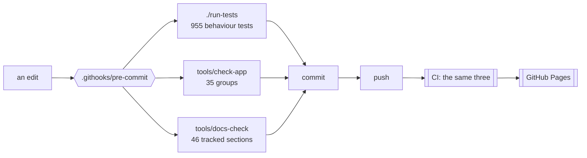
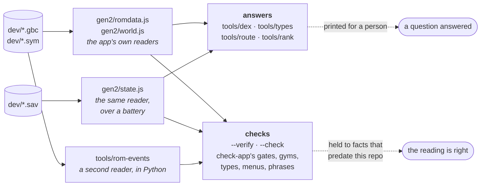

# Developing it

[← crystal-pilot mobile](../README.md) · [Using it](USING.md) · [The interface](INTERFACE.md) · [Two devices](DEVICES.md) · [What is proven](PROVEN.md) · [Developing](DEVELOPING.md) · [The code](CODE.md)

What can be checked without a ROM, how to run it locally, and why the tests
deliberately need no emulator.

---

## What runs, and where

Three things can run on a clean checkout with no ROM, and between them they are
what CI checks and what the pre-commit hook blocks on.



The hook is not installed by cloning. Enable it once per clone:

```bash
git config core.hooksPath .githooks
```

## Tests

```bash
./run-tests            # everything
./run-tests -k catch   # only names that match
./run-tests -v         # notes and stack lines
```

955 tests in 27 files, and what each file is about says more than the count:

| file | tests | what it pins down |
| --- | --- | --- |
| `journey.mjs` | 163 | the walking: routes, doors, shut legs, healers, gyms, and the map graph |
| `rows.mjs` | 147 | what every row and offer says, when its button works, and what the runner picks |
| `menus.mjs` | 73 | the order the START menu is driven in, and what is closed between tries |
| `battle.mjs` | 84 | whose turn it is, which Pokémon is out, and a win from a whiteout |
| `collision.mjs` | 39 | which tiles can be walked, and which have somebody standing on them |
| `capture.mjs` | 41 | weakening, ball choice, the party prompt, and the refusals before a throw |
| `grind.mjs` | 22 | what a grind says while it works, and the bounds that make it stop |
| `clock.mjs` | 22 | waiting for an hour, and telling a clock that will not move from a game that is not running |
| `world.mjs` | 30 | reading a cartridge's own maps: sizes, warps, objects and triggers |
| `control.mjs` | 30 | the task lifecycle: stopping, failing, undo points, and loops that must end |
| `state.mjs` | 44 | reading the party, the map, the badges and the battery out of work RAM |
| `titles.mjs` | 19 | choosing a profile for a cartridge, and falling back to generic |
| `romdata.mjs` | 91 | the cartridge's own character encoding and tables, byte by byte |
| `remember.mjs` | 14 | which remembered choices are believed, and which dropped |
| `worker.mjs` | 14 | the idle loop: one step outstanding, and a lost step recovered |
| `nav.mjs` | 14 | the walk loop: what it decides between two steps, and every reason it stops |
| `screen.mjs` | 20 | the frames that go between two devices, and who may press what |
| `runner.mjs` | 13 | running the list: the budget, the evidence something moved, and the save at the end |
| `saves.mjs` | 15 | which battery record belongs to the cartridge in the machine |
| `room.mjs` | 15 | the merge rules and the handshake, so two devices settle rather than fight |
| `engine.mjs` | 10 | that a changed engine number is actually followed |
| `symbols.mjs` | 7 | the shared address digest a second device boots from |
| `wilds.mjs` | 11 | what the grass here gives, at this hour |
| `cartridge.mjs` | 4 | reading a ROM's own header: the logo, the title, Color-only |
| `codec.mjs` | 3 | packing a save small enough for a room to carry |
| `input.mjs` | 3 | held buttons, and releasing them |
| `gb.mjs` | 7 | — |

No ROM, no browser, no emulator — which is the point rather than a compromise.
The ROM is not in this repository and never will be, so a test that needs one
cannot run on a clean checkout or in CI, and a test that cannot run there does
not get run.

What that leaves is most of what has actually gone wrong. Every bug this app has
shipped was a decision made about a game state: picking a move whose power byte
lies, reporting a knockout as a getaway, giving up on a save while the game was
still settling, calling a blank cartridge saved. None of those needs a
cartridge. They need a plausible work-RAM snapshot and a way to watch what the
code does with it, which is what `tests/harness.mjs` provides — a fake Game Boy
with scripted responses, and a synthetic symbol table so nothing is pinned to
one build's addresses.

Every test here was checked by putting its bug back and confirming it fails.
Two did not, the first time: one never reached the branch it claimed to test,
and one asserted against a stub of the logic instead of the logic. Both are
rewritten. A test that has not been watched failing is a test you do not know
you have.

A third did something worse than pass: it hung. The check on the bound in
grind's heal loop drives a snapshot that never improves, so with the bound
taken out the loop never returns — measured, the run span for sixty seconds and
had to be killed from outside. A test that cannot finish cannot fail, and a
hung suite reports nothing at all, so the check written to protect that bound
would have wedged CI rather than naming the bug. It bounds its own fake now,
and fails in milliseconds.

Two nets underneath it, because one of them cannot be enough:

- **`tests/harness.mjs` times out a single test** — five seconds, or
  `TEST_TIMEOUT_MS` — names it, and carries on with the rest of the suite.
- **`run-tests` watches from a second process** — 120 seconds, or
  `TEST_LIMIT_SECONDS` — kills a suite that hangs and says which test was in
  flight when it stopped.

The second is not belt and braces. The first is a `setTimeout`, and a loop that
only ever awaits already-resolved promises starves the timer queue outright:
measured, a one-second microtask loop kept a 50 ms timer from firing until the
loop ended. That is the exact shape of a runaway `while (…) await this.snap()`,
which is how this suite hung for real — so the in-process timer cannot catch
the case that motivated it. A separate process cannot be starved by the one it
is watching.

What the tests do **not** cover is anything that needs the emulator running —
walking, the intro, the collision decode against a real map, and loading a save
back into the cartridge. Nor anything that needs a network: the room, the
handoff and the picture are all verified by hand, between two browser origins
standing in for two devices. The one part not verified even that way is the
video itself, for a reason the [remote play](DEVICES.md#watching-it-on-the-other-device)
section gives. Everything by hand runs against a local build.

## The checks that need no ROM


The two on the right are the same idea pointed at different subjects, and the
pairing is the point: `check-checks` asks whether the *static checks* still
bite, and `mutate` asks whether the *tests* do. Both work by breaking something
on purpose in a copy of the tree.

### Whether the tests would notice

```bash
tools/mutate                       # every module, sampled
tools/mutate gen2/journey.js       # one file, every mutation
tools/mutate gen2 --all            # no sampling
tools/mutate --limit 60 --seed 7   # a reproducible slice
tools/mutate -k shut               # only lines whose text matches
tools/mutate gen2/state.js --list  # print the mutations, run nothing
tools/mutate gen2/battle.js --save /tmp/s.txt   # keep the survivors
tools/mutate --from /tmp/s.txt     # replay just those, verdict each
tools/mutate --try gen2/romdata.js 'a > b' 'a >= b'   # one exact edit
tools/mutate --tries /tmp/edits.txt  # a file of them, one per line
```

**And it counts every source file, including the ones it cannot reach.** That
is a correction rather than a feature. `app/` used to be excluded by a comment
reading *main.js needs a DOM* — true, and the wrong conclusion: it also
excluded `app/rows.js`, the most heavily tested module here, and a file the
suite never *loads* appeared in neither the numerator nor the denominator. The
headline was a percentage over a subset. Counting the rest put it at **54%**
at the time, and it is a tracked number now rather than a remembered one —
the diagram above said 65% for two passes after the correction, which is the
worst of the three states a claim can be in: too flattering, and unwatched, so
nobody goes looking for it and every argument resting on it is weaker than it
reads. Four of the numbers in that diagram were being typed by hand.

The first thing the correction turned up was `gen2/nav.js` at 0 of 130 lines — the
module that walks the player, untested because every test fakes it, and
*untestable* because the harness's fake symbol table was missing the two
symbols `Nav`'s constructor asks for.

**A module out of reach from a test says so in its own first comment**, as a
`reach:` note, and both tools surface it:

| module | why | held instead by |
| --- | --- | --- |
| `app/main.js` | needs a DOM | `wiring`, `labels`, `listeners`, `markup`, `counts` |
| `gbcore/stream.js` | needs WebRTC and a canvas | reading it, and the room tests either side |
| `titles/crystal.js` | mostly driving code | `gates`, `gyms`, `moves` — against the ROM |

The note lives in the file rather than in a list here, because a list of
exemptions outlives its reasons. And it exists because a reader told only that
`main.js` runs 0% concludes neglect, which is the wrong lesson to leave lying
around: faking a DOM to raise that number would buy a suite that cannot fail.

**Coverage answers which lines ran, which is much weaker than it looks.** A line
runs every time the suite touches the function around it, whether or not
anything asserted on what it did. This changes one small thing — `&&` to `||`, a
number to zero, a `true` to `false` — runs the suite, and reports the changes
nothing caught.

Run over more than one file it also prints **a score per file, weakest first**,
which is the question it is usually being asked: *where are the tests not?* That
used to mean running it once per module and writing the numbers down by hand,
which is how a pass picks its audit target by memory instead of by evidence.
The two numbers disagree loudly and the disagreement is the point —
`gen2/jobs.js` was **72% of its lines run** and **35% of its mutations caught**:
every line executed, and a third of what those lines decide could be changed
without a single test noticing. Line coverage says the tests *visited*; this
says they *looked*.

The first run of it made the case better than any argument could. `collision.js`
sat at 51% line coverage, which sounds like a gap and reads as a plateau.
Mutation said **18%**, in the module that decides where the pilot may walk: the
wall and water rules, the ledge and warp ranges, the pathfinder and all four of
`furthestToward`'s direction comparators could be inverted and the suite passed.
The cause was one line in a fake — every collision test handed the decode
`{ romByte: () => 0 }`, so every tile on every map answered LAND. It is 66% now.

A **survivor** is one of three things and all three are worth reading:

* a line nothing asserts on — the honest gap
* a line whose behaviour does not matter — dead code, or a guard that is belt to
  another's braces. Two of those have been *deleted* on this evidence rather
  than tested, which is the better outcome.
* a mutation that is not really a change — `x > 0` to `x >= 0` where x is never 0

**A test that looks like it covers a line is worth nothing, and only the tool
can tell you.** Six tests were written for `room.js`'s merge rules in the
forty-sixth pass and the score did not move by a single mutation: the default
they were aimed at is one that `made = null` never reaches, because the
identity check a line above it returns first. The case that discriminates is a
note with no stamp on it.

That is the same argument `tools/check-checks` makes about the checks, one
directory over — and the practical habit is the same: when a test is written
*for* a survivor, re-run the tool and see the number move. If it does not, the
test is decoration.

```bash
tools/mutate gbcore/room.js --all      # before: 45 of 92
# write the tests
tools/mutate gbcore/room.js --all      # after: 45 of 92 — so they bought nothing
```

**`--try` is the loop that was a Python heredoc in three passes running.**
Thirty-odd of them, the same six lines every time: read the file, substitute,
run the suite, print, put it back. It is used for the step in between the two
above — pinning *one* boundary and checking that the test written for it
actually kills the mutation, before spending a replay:

```
$ tools/mutate --try gen2/romdata.js 'score += hardest;' 'score = hardest;'
  killed    gen2/romdata.js
      score += hardest;
   -> score = hardest;
```

**It puts the file back more reliably than a heredoc does.** A hand-written
one edits the *working tree* and restores it at the end, so an interrupted run
leaves the repository mutated — and a mutated repository that still compiles is
exactly the state this tool exists to create on purpose and nowhere else.
`--try` copies the tree first, the way every other mode here does, and the
working tree is never touched.

**And an ambiguous anchor is refused rather than guessed at**, which fired on
its first real use: `i >= 0 && i < wram.length` appears twice in `screen.js`,
and a hand-written substitution would have replaced the first and said nothing
about the second. That refusal counts as *skipped* rather than as noticed or
missed, which is the second thing this mode got wrong — it reported "1 of 1
noticed" for an edit it had declined to make.

**And the third step is `--from`, because it was the one that cost.** Re-running
the module re-runs every mutation of it — two minutes for `gen2/battle.js`, to
find out about the four lines you have just written tests for. So the first run
can keep its survivors and the tool can replay exactly those:

```bash
tools/mutate gen2/battle.js --save /tmp/s.txt   # 72 survivors, and a to-do list
# write the tests for the ones worth testing
tools/mutate --from /tmp/s.txt                  # a verdict against each
```

The output is verdicts rather than a score, because that is the question:

```
  killed    gen2/battle.js:137  0 to 1
      return party.find((m) => m.hp > 0) || party[0] || null;
  SURVIVED  gen2/battle.js:147  1 to 2
      len: Math.max(...watched) - Math.min(...watched) + 1,
```

The save file is one line per survivor, tab separated, and it is read by a
person at least as often as by the tool — it *is* the to-do list. Replay
matches by **line text, not by byte offset**: adding tests does not move the
source, but fixing it does, and a replay that quietly mutated the wrong bytes
would report verdicts about something else entirely. A line that has changed
since it was saved is reported as skipped, which is the honest answer — it
needs measuring again rather than replaying.

Before this, every one of those third steps was a Python heredoc written by
hand, one per survivor, which is precisely the step this tool exists to stop
anybody doing. Five were written that way in the forty-seventh pass alone
before it became obvious they should be a flag.

It paid for itself in the next one. Two modules, two replays:

| module | survivors | caught by the tests written for them |
| --- | --- | --- |
| `gen2/battle.js` | 71 | **8** |
| `gen2/jobs.js` | 65 | **13** |

Neither number is the interesting one. What the replay buys is knowing it
*before* the pass ends: the same two runs cost about four minutes each the
long way round, and both were the third step of a loop nobody would have run
twice.

**And one class of mutation was removed, because it could only ever survive.**
`n → n + 1` asks *is this exact value right?*, which is the classic off-by-one
and is worth asking of an index, a bit position or a count of two. It is not
worth asking of a frame count: `GATHER_MS = 2500` to 2501, `SETTLE_FRAMES = 20`
to 21, `closeMenus(times = 8)` to 9. No honest test can tell those apart,
because the value was tuned against an emulator with tolerance on both sides
*by construction*. A mutation that can only survive is not a measurement — it
is a constant subtracted from every score, and **27% of this repository's
survivors were exactly that**, crowding the real findings out of a list
somebody has to read.

So `n + 1` stops at three, and `n → 0` still asks the useful half of the
question about every number: *is this bound needed at all?* Delete a retry
budget and a loop runs for ever; delete a delay and a press lands
mid-animation.

**That changed the denominator, so the scores moved without the tests
changing** — worth stating plainly, because a number that goes up for a reason
other than better testing is exactly the kind of number this document is
supposed to be careful about:

| module | before | after | same tests |
| --- | --- | --- | --- |
| `gbcore/taskbase.js` | 31% | **41%** | 28 caught either way, 20 fewer asked |
| `gen2/jobs.js` | 46% | **49%** | — |
| `gbcore/saves.js` | 56% | **57%** | — |
| `app/rows.js` | 82% | **82%** | — |

The spread is the point: `taskbase.js` is a module of frame counts and gained
ten points; `rows.js` is a module of logic and gained nothing. A rule that
inflated every score equally would be measuring nothing.

It exits 0 with survivors on purpose. Some guards here are deliberately
redundant, and a tool that failed the build for those would be turned off.

Three things it had to get right, two of which were bugs first:

* **Comments and strings are never touched.** The prose here outweighs the code
  better than two to one and is full of `&&`, of numbers, and of the words the
  game says. The first draft produced hundreds of mutations of documentation,
  every one of which "survived".
* **One tree per worker process.** It was one per task index, which is a race,
  and it was measured as one: two runs over the same code said 69 caught and
  then 59. The honest number was 59; the 69 was corruption being counted as the
  suite noticing. **A tool whose answer is not reproducible is worse than none,
  because it is believed once.**
* **Its own watchdog.** `run-tests` wraps the suite in a subshell because an
  in-process timer can be starved by a microtask loop — which several mutations
  provoke. `subprocess` is a separate process by construction, which satisfies
  the same argument for a third of the wall clock, and the limit is set from the
  clean run rather than picked.

### What the tests never run

```bash
tools/coverage          # the table
tools/coverage --dead   # branches that never fired inside a function that did
```

Not a score to chase, and the total is close to meaningless on its own: a third
of this app cannot be exercised without a real cartridge, and no amount of
mocking makes a fake one worth trusting. What the table is for is *where*. It
ranks the modules by how much of each has never been run, and the question worth
asking is whether the bottom of that list is somewhere you would mind being
wrong.

The first run answered no. `menus.js` sat lowest at 16% — and `menus.js` is the
module that saves your game. Its tests stubbed out every method that touches the
machine and asserted only on the order the rows were tried in. `saves.js` was
beside it at the same number. **The two least-run modules were the two on the
save path**, where the worst outcome is a game that no longer exists.

`--dead` prints the other half: branches that never fired *inside a function that
did run*. That is the shape a guard which cannot fire has — the eleventh pass
found one of those by accident, and this is what looking for them on purpose
costs. Most of what it prints is ordinary untested defensiveness; the value is
that the list is short enough to read.

Two modules came off the bottom of the list by being given a fake cartridge
rather than a stub. `romdata.js`'s grass readers went from untested to 88%
because the encounter table's layout is written out by hand in
`tests/cases/wilds.mjs` — map group, map number, three rates, three blocks of
seven `(level, species)` pairs — so a patch of grass is a `Map` of bytes and can
be any shape you like, **including shapes Crystal has none of**. That is what
caught `wildOn` believing a padding slot: a half-filled block does not exist on
this cartridge, and the disagreement between two readers of the same bytes was
invisible until one was written. `grind` went the same way in
`tests/cases/grind.mjs`, where the script is one party state per *battle
fought* — getting that wrong is why those tests were briefly wrong about how
many battles a three-level climb takes.

**A fake IndexedDB is the newest of those**, in `tests/cases/saves.mjs`: not a
mock of `list`, a mock of the two shapes that file uses — a transaction that
completes, and requests that call back — small enough to read, and able to be
told which key's read should fail. `saves.js` had the lowest coverage in the
table for eleven passes on the grounds that it needs a database, and that turned
out to mean it needs about forty lines of one.

**And the harness could not compare two objects.** `same` walked arrays deeply
and fell back to `a === b` for everything else, so `t.eq({low:2,high:4},
{low:2,high:4})` failed — reporting *expected {"low":2,"high":4}, got
{"low":2,"high":4}*, the same text twice, because `show` could already print
what `same` could not read. The worse half is `t.ne`, which could therefore
never fail on two plain objects: a test asserting that two ranges differ passed
while proving nothing. Plain objects compare by key now; class instances stay on
identity, because two `Map`s with the same contents are not interchangeable to
anything in this app and walking their own enumerable keys — of which they have
none — would call every pair of Maps equal.

Two limits worth knowing before reading the number. `saves.js` is bound to
IndexedDB and cannot run in this harness at all, so its figure will not move
without a dependency this repository does not want. And `app/main.js` is not in
the table: it needs a DOM, so the fixes the thirteenth and fifteenth passes made
there were verified in a browser rather than by a test.

`sw.js` **is** in the table, at 100%, and the difference is worth knowing because
it is a way round the DOM problem. The worker is not a module and never will be,
so it is loaded the way the browser loads it — evaluated in a `vm` context
holding fakes for the four globals it uses. The code under test is the deployed
file byte for byte, and the vm script is given its real filename so V8 attributes
the coverage to `sw.js` rather than to `evalmachine.<anonymous>`, which is what
it does otherwise.

### Are the checks still checking?

```bash
tools/check-checks            # every group
tools/check-checks symbols    # one of them
```

`check-app` printing `ok` means nothing if a group has quietly stopped looking,
and that is not hypothetical here — **four groups have gone silent** at one time
or another. A word table that stopped at twenty, so the twenty-first entry
disabled the count it fed. A regex that wanted `modules. Arrows` and broke on a
comma. A diagram found by `flowchart TD`, switched to `LR`. A constant read from
a file it had moved out of. Every one still printed `ok`.

So `check-checks` breaks, on purpose, the one thing each group claims to watch,
and asserts the group fails. It works on a copy of the tree — nothing it does
can reach your files — and re-runs each group after restoring, so a mutation
that fails to undo itself is reported rather than believed. **All eighteen bite.**

Writing a mutation is the whole cost of the tool, and it is easy to get wrong in
a way that reads as a broken check: the first draft of seven of these missed what
the group actually greps for — `s.addr(...)` where the pattern wants
`symbols.addr(...)`, an orphan `id` where the check walks the other direction, a
`.sym` that `.gitignore` was already refusing. **A mutation has to violate what
the group claims**, and when it does not, the honest reading is that the mutation
is wrong, not the check. It is not in the pre-commit hook: it runs `check-app`
about fifty times, which is the wrong price for every commit and the right
one for the commit that changes a check.

`tools/check-app` is thirty-five groups, each one a class of mistake that parses
fine and is wrong at run time:

| group | asserts |
| --- | --- |
| `seam` | only `gb.js` touches the emulator core — `.core` or the global anywhere else is a reach past the wrapper |
| `layers` | every import points down `gbcore → gen2 → titles → app`, never up |
| `titles` | a title adds methods to the engine and never overrides one |
| `syntax` | all 27 modules and `sw.js` parse — copied to `.mjs` first, because `node --check` on a `.js` file with a syntax error exits 0 |
| `shell` | the service worker's shell lists every file it needs, and each exists |
| `markup` | `index.html`'s tags and its CSS braces balance |
| `contrast` | 24 colour pairs meet WCAG in **both** themes, and the two light blocks match |
| `gamefiles` | no ROM, save or symbol file is tracked |
| `moves` | the lethal moves excluded from weakening are the ones that lie about their power |
| `buttons` | every button name handed to `press`/`hold` is one the core knows |
| `wiring` | every `$('#id')` exists in the markup, and every named import — same directory, another one, or a vendored module — resolves to something that exports it |
| `symbols` | the shared digest is every symbol the app looks up |
| `version` | `gbcore/version.js` and `sw.js` agree, and both doors are reachable with no ROM |
| `docshape` | section 2's architecture diagram draws, counts and tables all 27 modules |
| `names` | every capitalised name a module uses is one it can see |
| `doclinks` | every `](#anchor)` in `docs/` lands on a heading that exists |
| `markers` | nothing here draws an affordance the vendor stylesheet already draws — replacing Pico's chevron is fine, having two is not |
| `deadcss` | no single-class rule is overridden on every element that could carry it, which is how `.slots{display:block}` lost to `.param{display:flex}` |
| `labels` | every job row is named after its own key, capitalised — which is the word the runner prints, built from the key rather than from a second table |
| `gates` | every road a title declares shut names an event the ROM actually sets — skipped without a cartridge |
| `gyms` | every gym a title declares has the right leader on the right tile, as a script object, with a badge bit that is a badge — skipped without a cartridge |
| `marts` | every mart a title declares has a door its town warps through, and the tile the pilot is sent to faces somebody — the counter geometry is the one thing a mart cannot derive, and it was assumed for twelve of them |
| `wilds` | every grass table walks end to end at this cartridge's own stride: each entry sits on a map the cartridge has, and every slot is a species it has at a level it allows — the stride the profile's own comment warns reads a neighbouring map's block without failing |
| `items` | every item name a title declares — its heals and its cures — is an item this cartridge has, folded through the app's own lookup. A name it does not have fails in silence: a Heal row that never finds anything in a bag with four potions in it |
| `romlayout` | the map-events block is read at *this* cartridge's strides — the objects behind a trigger tile resolve like the objects in front of one. It compared two files before, and two files can agree and both be wrong |
| `phrases` | no engine module compares a screen phrase written into it — a phrase is content, so it is the title's to say — and, with a cartridge, every phrase the app looks for is one the cartridge actually says |
| `menus` | every box the app tells apart by shape declares that shape in the profile and asks the instance for it — and, with a cartridge, the shape is the one the cartridge's own menu header draws |
| `types` | every optional symbol the app reads travels in the shared digest, both sides' type addresses are read, and — with a cartridge — the decoded type chart agrees with twenty-two matchups nobody had to look up |
| `counts` | every number in the prose that the repository can compute is right — the test table, the group count, the digest's size, the audit's rows. Two have shipped wrong: *143 tests in seventeen files* while 576 ran, and a digest drawn as 47 entries carrying 53 |

## The tools that ask the cartridge

Everything above runs on a clean checkout. What follows needs a `.gbc` and a
`.sym` in `dev/` — and every one of these says so and exits 0 without them, so
`tools/check-app` is still green on a machine that has no cartridge at all.

**Any names, not `pokecrystal.*`.** Five tools opened that pair by name, which
is right for the disassembly and wrong for everything built from it: a hack's
Makefile names its own output, so `pokeperidot.gbc`, `crystal-speedchoice.gbc`,
`polishedcrystal-3.0.0.gbc`. Drop a build in and the tools find it.

**The pairing is the careful part, and the globbing is not.** A symbol file
describes exactly one build — its addresses are that ROM's memory map — and
handed the wrong ROM it does not fail, it *answers*. Every read comes back
plausible and wrong. So:

| what is in `dev/` | what happens |
| --- | --- |
| one ROM, one `.sym`, same name | used, silently |
| several, some sharing a name | the newest matching pair, and it says which |
| one of each, names differ | used, with a warning that this is an assumption |
| several, none sharing a name | refused, and it says what it found |
| nothing | the usual "no cartridge in dev/", exit 0 |

`DEV_ROM` and `DEV_SYM` override the search outright, which is what makes a run
over several hacks scriptable without moving files about. `DEV_NO_CARTRIDGE=1`
does the opposite and is the one that catches bugs: it makes every tool here
behave as though `dev/` were empty, which is **the path CI takes and the one
nobody with a cartridge ever runs**. `tools/check-app --no-cartridge` is the
same thing for the checks.

That is not a hypothetical. The first version of this module handed
`check_moves` a `None` where it expected a path, and `check_moves` is precisely
a group written to skip without a cartridge — so the failure existed only on a
machine that had none, which is CI and a clean checkout and never the machine
it was written on. It got through a green local run and failed on the push.

The rule is written twice — `tools/cartridge.mjs` for the node tools and
`tools/cartridge.py` for these checks and `rom-events` — because the two halves
of this repository are two languages. A `cartridge` check group holds them to
each other, for the reason `romlayout` holds the two map-table readers to each
other: **two readers of one directory that disagreed about which cartridge is
current would be worse than either**, and `check-app` verifying one build while
`tools/dex` verified another would have both saying ok.

### Testing a hack

The point of all of the above. Build any pokecrystal-based hack, drop its
`.gbc` and `.sym` into `dev/`, and run the cartridge checks — what fails is a
list of the assumptions that hack breaks:

```bash
tools/check-app          # gates, gyms, types, menus, phrases, romlayout, moves
tools/dex --verify       # every species, its evolutions and its learnset
tools/types --verify     # the type chart against rules that predate this repo
tools/clock --verify     # which hours are morning, day and night
tools/rom-events --verify  # the object layout, over every map
```

Two things decide most of what happens. **The ROM title**: `titles/pick.js`
gives the Crystal profile to anything titled `PM_CRYSTAL` that also has
`JohtoGrassWildMons`, so a hack that kept its header is claimed as Crystal and
driven with Johto's gyms, healers and gates — which is right until it moved
one. Anything else falls to `generic`, which is honest and does less. **And the
engine profile**: `speciesCount`, `partyStride`, `nameLength` and the rest are
Crystal's numbers, so a hack that added species or widened an id needs the one
field that says so.

Which makes some hacks much more informative than others:

| hack | title | species | what it exercises |
| --- | --- | --- | --- |
| [patched-crystal](https://github.com/UberMedic7/patched-crystal) | `PM_CRYSTAL` | 251 | the control — bug fixes only, so anything that differs is this app's fault |
| [pokecrystal16](https://github.com/fellowship-of-the-roms/pokecrystal16) | `PM_CRYSTAL` | 251 | **16-bit species ids, content otherwise vanilla** — built and run: **35/35**, once the trainer pointer width was derived rather than assumed |
| [PokemonAmbrosia](https://github.com/AndrewC101/PokemonAmbrosia) | `PM_CRYSTAL` | 254 | species past `speciesCount`, *while* being claimed as Crystal — built and run: **29/35**, and its menus are the reason (`Switch`, not `SWITCH`) |
| [pokecrystal-speedchoice](https://github.com/Dabomstew/pokecrystal-speedchoice) | `PM_CRYSTAL` | 251 | changed flow and menus, vanilla species |
| [Majora-Crystal](https://github.com/WasabiRaptor/Majora-Crystal) | `PM_CRYSTAL` | 255 | built around a time limit — the adversary for the clock reading |
| [pokecrystal-nl](https://github.com/wfowler1/pokecrystal-nl) · [-es](https://github.com/erosunica/pokecrystal-es) · [_cn](https://github.com/SnDream/pokecrystal_cn) | `PM_CRYSTAL` | 251 | the charmap and the English phrases. Dutch built and run: **32/35**, and all three failures are true — `sent to BILL`, `PACK` and `SWITCH` are not in that ROM, its switch box begins `WISSEL`, and not one of the twenty-one item names `crystal.js` declares is a word it uses, so its Heal row would find nothing in a full bag |
| [polishedcrystal](https://github.com/Rangi42/polishedcrystal) | `PKPCRYSTAL` | 291 | the hardest thing to support properly, and the one that found nine declared numbers and a Lv179 Ditto — built, run, and given a profile: **35/35**, with `tools/dex --verify` clean over all 291 species, eight gyms and twelve marts read out of the cartridge, and every one of the 68 maps it declares reachable from the bedroom |

Four are built and run. **A word about the assembler**, because it is the
thing that decides whether a hack can be tested at all: `polishedcrystal` and
`PokemonAmbrosia` both failed to *link* under rgbds 1.0.2 with the same error,
`JR target must be between -128 and 127 bytes away, not 65449`. It is one
gate, not two, and it is not their bug: the instruction is `jr
hLCDInterruptFunction`, a jump into HRAM that works because the CPU wraps PC
at 16 bits — an offset of −87 from `$004a` lands at `$fff3`. **rgbds 1.0.3
permits the wrap and 1.0.2 rejects it**, so both built on the upgrade and
neither needed a patch.

The other direction is the real obstacle. `patched-crystal` pins **0.5.2**, a
2021 release whose syntax predates `DEF x EQU`, and every one of its seven
branches is on it — that one needs an old assembler built from source, not a
newer one. Check the pin before cloning: a hack that asks for 1.0.0 or later
is an afternoon, and one that asks for 0.5 or 0.6 is a detour.

**What the four say about the app** divides cleanly. pokecrystal16 changes a
*structure* and passes everything once the structure is derived. The Dutch
build changes a *language*, and its three failures are true — the app drives
menus by their English words. Ambrosia and Polished Crystal change *content*
and menu text, and their failures name exactly which: `Switch` where the app
looks for `SWITCH`, a switch box with four rows where the profile says three,
`sent to BILL` in neither ROM. Polished Crystal goes furthest — nineteen
renumbered types including FAIRY, a `TypeNames` table of one-byte relative
offsets rather than `dw` addresses, a chart on a different numeric scale, and
trainer parties in far banks and in WRAM. Its 24 is not a near miss; it is a
different cartridge that happens to be Gen 2 shaped.

None of that is a promise that any of them work. It is a list of the questions
each one asks, and the checks above are how the answers arrive.

They divide into two kinds, and the division is worth keeping in mind because
only one of them can fail:



**Nothing in the left column is a second reader, except one.** A tool that
parsed the ROM itself would agree with the app until it did not, and then it
would be a confident wrong answer hiding the bug it was written to find — five
of those have actually happened here, which is why `tools/route --maps` prints
the app's own map table and the Python tool asks it. `tools/rom-events` is the
deliberate exception: it decodes *scripts*, which the app does not read at
all. Where it used to overlap — the map tables — it no longer reads the ROM
at all, and asks `tools/route`.

**And a check is only worth having if it can fail.** Each `--verify` asserts
things that were true about Pokémon before this repository existed, rather than
re-deriving what the reader just said: Electric cannot touch Ground; TYROGUE
has three branches at Lv20; MAGIKARP is on the slow curve. A check that agrees
with the code by construction is decoration.

### Looking at the ranking

```
tools/rank                     a party at full health, nothing else
tools/rank --hurt --bag        somebody hurt, a potion in the bag
tools/rank --fainted           the override: Heal goes first
tools/rank --all               everything on offer at once
tools/rank --all --json        the same, for a script to read
```

The ranking is the app's central claim and it is load-bearing twice over: it
decides which row wears the accent rail, and since v167 it decides what *Run
the list* presses. So a reorder is a behaviour change — and until this tool
there was no way to *look* at one without a browser, a ROM and a running game.
`DEV.plan()` answers it on a live cartridge; this answers it in a second, out
of the same pure function the screen uses.

It exists because the ordering has been tuned twice by editing a list and a
comment beside it, and the second time **the two disagreed for a whole
version**: the comment said an errand outranks levelling up while the list put
it below Grind. One command would have shown that.

**And it paid for itself in its first minute** by printing
`1 hurt · [object Object] in the bag`. Seven fixtures in `tests/cases/rows.mjs`
passed `bagHeal` as an item object and `wilds` as a list, where `main.js`
passes a *name* and a `{low, high}` pair — and nothing had noticed, because
every test asserted `enabled` or a key and none asserted the text those fields
feed. There is a test for that class now: no row, in a dozen situations, may
say *undefined*, *NaN* or *[object Object]*. A row says words.

It is not a check. `tests/cases/rows.mjs` asserts the whole order in one line,
which is where a claim about the ranking belongs; this is for the ten minutes
before that line is written.

### Where the pilot can get to

```
tools/route 10.5 8.7        the way from Violet City to Azalea Town
tools/route --exits 10.1    every way out of Route 32
tools/route --reach         every map a title declares, from where a game starts
tools/route --maps          every map the cartridge has, by its symbol name
tools/route --warps         every door on every map, and where it leads
tools/route --objects       what stands on every map, with its script pointer
tools/route --triggers      every tile that runs a script when stepped on
```

**It runs `gen2/world.js`.** That is the whole point of it: the app builds its
map graph from the cartridge every time it plans a walk, and nothing could say
whether that graph *connects the places the app declares*. A gym in a town no
route reaches is a row that can never be pressed, and the only way to find one
out was to press it and watch a walk fail — which matters more the more of this
data is read out of the ROM rather than walked to.

`--reach` answers it: all eighteen maps `crystal.js` declares are in some route
from the bedroom, and Azalea's Gym is eleven legs away.

**The first version was a second traversal, in Python, and it diverged
immediately.** It reported Cherrygrove City as *not a map this cartridge has*,
because deriving a group's size from the next group's list pointer does not work
for every group — and the app's `mapCount` is deliberately permissive where it
cannot tell. That is the fourth divergence in two passes between this app's ROM
reading and a copy of it, three of them constants. So the copy is gone.

**`--maps` exists because a Python reader of the same table came back with
1536 maps out of 388.** A (group, number) past the end of a group still
resolves to *some* attributes pointer, and some of those land on a real
`_MapAttributes` symbol — so the obvious loop over 26 × 64 produces four
times too many maps, every one of them named. Which is the fifth time a
second reader of this app's map tables gave a confident wrong answer, so
`--maps` prints `World`'s own table and `tools/rom-events --findgyms` asks it
rather than deriving one.

**`--warps`, `--objects` and `--triggers` are the sixth time, and they are
what finished the job.** `tools/rom-events` still walked the event block
itself for the objects on a map — the leader in a Gym, the nurse behind a
counter — with Crystal's strides written out beside the app's, and
`check-app romlayout` comparing the two files. Which caught the day one was
mistyped and could never catch the day both were right about Crystal and
wrong about the cartridge in the drive. See [what a second reader of the map
tables costs](#what-a-second-reader-of-the-map-tables-costs).

**What routing does *not* claim is walkability**, and the difference is
instructive. `tools/route` says Violet City → Azalea Town is three legs: down
to Route 32, down to Route 33, left into Azalea. A walker cannot take the
second one — Route 32's south end is the mouth of Union Cave — so the pilot
tries, is refused, writes the leg off and re-routes through the cave, which is
also in the graph as a warp. Route 32 has both exits, and the graph is honest
about both. Demanding every leg be walkable would mean asserting terrain this
cannot read; demanding a route *exist* catches the thing worth catching.

### What the type chart actually says

```
tools/types                            the whole chart, as a grid
tools/types --verify                   every row against the game's own rules
tools/types fire grass                 one matchup
tools/types --rank chikorita bellsprout 33 75
                                       which move a pilot would swing, and why
tools/types --move 75                  one move's numbers and name
```

**This runs `gen2/romdata.js`** — the reader the pilot ranks with, not a second
one beside it. That is the lesson `tools/route` was written for after four
separate confident wrong answers came out of copying this app's ROM reading
into another language, and it is why `--verify` is a check on the app rather
than one standing next to it.

`--verify` exists because the chart is 110 rows of three bytes with a
**one-byte** separator in the middle, so every wrong reading of it produces a
chart — just not this cartridge's. The twenty-two rules it asserts are facts
about Pokémon rather than facts about this code, and they are written in type
**ids** rather than in type names for exactly that reason: a Dutch build calls
FIRE `VUUR` and ELECTRIC `ELEKTRO`, so looking a rule up through the
cartridge's own name table resolved all twenty-two to nothing and printed a
page of `WRONG` about a chart that was entirely correct. The ids are constants
and live in the engine profile; the names come out of the ROM and are one
translation away from changing. The same repair applies to the eight gym
leaders: they are asserted to share **one** class name, whatever this cartridge
calls it, rather than to read `LEADER` — which still catches the failure the
check exists for, since a decode that has lost its class boundaries gives eight
*different* answers.

The rules are: Electric cannot touch Ground,
Water doubles on Fire, Psychic cannot touch Dark, Normal cannot touch Ghost.
The last of those is the row directly behind the separator, so a decode that
eats one byte loses it first. It checks the shape too — 110 rows, and no
multiplier outside {0, 5, 20}, because a table read wrongly usually comes out
the right size divided or multiplied by something.

`--rank` is the one that shows the feature earning its keep, because it prints
what ranking by raw power would have picked beside what the chart picks:

```
CHIKORITA (GRASS/GRASS) against BELLSPROUT (GRASS/POISON)
  TACKLE       35 NORMAL   x1  -> 35
  RAZOR LEAF   55 GRASS    x0.25 +bonus  -> 20.625
  power alone would swing RAZOR LEAF; the chart swings TACKLE — and they differ

TOTODILE (WATER/WATER) against GASTLY (GHOST/POISON)
  SCRATCH     40 NORMAL   x0  -> 0
  WATER GUN   40 WATER    x1 +bonus  -> 60
  power alone would swing SCRATCH; the chart swings WATER GUN — and they differ
```

Sprout Tower is full of Bellsprout and holds Gastly at night, and it is the
first building a Johto starter walks into. The second block is not a slower
battle — a Normal move on a Ghost does nothing, so the enemy's HP never moves
and the fight cannot end.

**The species' own types come from `BaseData`, and counting its stats wrong is
silent.** There are six — hp, attack, defence, speed, special attack, special
defence — and counting five read CHIKORITA as "type 65/GRASS", which is its
special defence followed by half its real answer. 65 is a plausible type
number, so it printed instead of failing, and a Grass move on a Grass/Grass
CATERPIE came out at a quarter. Measured back into place against three species
whose types nobody needs a table to know.

### What a species becomes, and what one Pokémon is made of

```
tools/dex cyndaquil                    stats, types, evolutions, learnset
tools/dex --at 12 cyndaquil            what it would know, and what is next
tools/dex --evolves 20                 every species that evolves at Lv20
tools/dex --verify                     the whole table, held to the cartridge
tools/dex --wilds                      every grass table, at its own stride
tools/dex --items                      every declared item name, against it
tools/dex --party                      the party out of a .sav in dev/
tools/dex --party --check              and the DV nibble order, settled
```

**This runs `gen2/romdata.js` too**, for the same reason `tools/types` does,
and `--verify` found the reason on its first run: the pointer guard was
backwards. `EvosAttacksPointers` was read the way `trainerIndex` reads
`TrainerGroups` — *a pointer below the table is not a pointer*, because that
is where the trainer parties sit — and this table keeps its entries **above**
its pointers, so all 251 species refused.

What `--verify` asks, and why each one is the question rather than the obvious
one:

| it asks | because |
| --- | --- |
| every entry is exactly as long as the gap to the next pointer | the pointers ascend and the records sit end to end, so a record read at the wrong width comes out the wrong length **even when every field in it looks plausible**. Recomputed from the decoded record rather than from where the reader stopped |
| nine species are on the experience curve they were on before this app existed | one species agreeing with a wrong offset is how the types were once read out of the special defence. At 0x15 instead of 0x16, all 251 come back `mediumFast` — a real curve, and a believable one for whichever species you check first |
| both `CyndaquilEvosAttacks` and `PidgeyEvosAttacks` land where the symbol file says | the one thing about a pointer table the `.sym` can settle on its own |
| seven famous species are still famous | TYROGUE has three `EVOLVE_STAT` branches at Lv20 and is the only Pokémon in the game that has any — which makes it the only species a four-byte record can be got wrong on |

**And one check it deliberately does not make.** A learnset out of level order
is exactly what a shifted read looks like, and MUK's entry genuinely runs Lv45
SLUDGE in front of Lv23 MINIMIZE on this cartridge — verified against
`MukEvosAttacks` byte for byte, and the game does not care because it scans the
whole list. It is the only species in the game that does it, so the count is
reported and the structural check above is what catches a shift.

<details>
<summary><b>Advanced detail:</b> reading a party out of a battery, and the gap
it closes</summary>

Two things about a party entry are written down as the disassembly's word
rather than as measurements: **which nibble of the DV word is which stat**, and
how the caught-data byte is packed. Settling either needs a party whose numbers
are already known — and a `.sav` is one, without a browser.

`--party` builds a work-RAM snapshot out of the battery and hands it to the
real `GameState`, so what comes out is the app's own reading rather than a
second one. The mapping is the save file's: `sGameData` holds what
`wPlayerData` onwards held at the moment of saving, byte for byte, and it is
bounded by `sGameDataEnd` so a symbol outside the saved block reads as zero
rather than as whatever is next in the file.

`--check` then settles the first gap outright, and the trick is that the
cartridge has already done the arithmetic: the six stats are stored **beside**
the DVs that made them. So recompute them from base, level, DV and stat
experience and see whether they come back. If they do not, try the other
twenty-three orderings of the four nibbles and report which one does — an
answer rather than a failure, and if *none* fits, that says the disagreement is
somewhere other than the nibble order.

The stat formula lives in the tool and not in the app on purpose. The game has
already worked those numbers out and stored them, so a copy in `state.js` would
be a second source of a number the cartridge supplies; a *check* is exactly
where an independent derivation belongs, the same way `tools/types --verify`
asserts matchups nobody read out of the chart.

</details>

### The in-game clock, and moving it

```
tools/clock                            morning, day and night, out of the ROM
tools/clock --save                     the clock offset the .sav is carrying
tools/clock --shift 8                  eight hours on, to a new file
tools/clock --shift -3 --out /tmp/x.sav
tools/clock --verify                   the decode against the cartridge
```

**Gen 2's clock is the hardware clock plus an offset the game keeps in the
save**, which is the fact this tool exists to make usable — and the fact the
documentation had backwards for four versions. `FixTime` at 00:061d *adds*
`wStartSecond`/`Minute`/`Hour`/`Day` to the MBC3 clock's own reading and
carries upward, so the in-game hour is `(wStartHour + rtcHours) mod 24`. All
four bytes are inside the saved block, so the time of day can be moved without
the emulator's clock running at all.

The arithmetic is the game's own rather than invented: `DSTChecks` at 05:64b9
shifts the clock an hour by incrementing exactly that byte, wrapping at 24 and
carrying into the day. The label names are the trap — `SetClockForward`
*increments* the offset, which only reads as forward because the offset is
added — and getting that backwards sends the clock the wrong way.

`--verify` reads `TimesOfDay` and holds the decode to the eight boundary hours
everybody already knew: morning 4–9, day 10–17, night 18–3. The table is
**upper bounds** walked until one exceeds the hour, so reading it as starts
shifts every boundary by a block and still produces a table — which is the
failure worth a check.

It never writes over the file it read, and it refuses a save whose checksum
already disagrees with its bytes: re-sealing that would turn a save the game
refuses into a save the game accepts and is wrong about.

### Asking the cartridge, without running it

```
tools/rom-events --set 0x2d                 which script sets this event
tools/rom-events --map Route32              every event this map's scripts read
tools/rom-events --objects AzaleaGym        warps and objects, scripts named
tools/rom-events --script Route32CooltrainerMContinueScene
tools/rom-events --text Route32CooltrainerMText_AideIsWaiting
tools/rom-events --gates                    every declared gate, against the ROM
tools/rom-events --gyms                     every declared gym, against the ROM
tools/rom-events --marts                    every declared mart, against the ROM
tools/rom-events --findgyms                 where every gym leader stands
tools/rom-events --layout                   the strides, against the cartridge
tools/rom-events --verify                   the object layout, over all 361 maps
tools/rom-events --menus                    every box the app drives, by shape
tools/rom-events --phrases                  every phrase it looks for, in the ROM
tools/rom-events --find SWITCH              where the cartridge writes a word
```

#### What a second reader of the map tables costs

**Three of those commands used to walk a map's event block in Python.** The
app walks the same block in `gen2/world.js`, so the strides existed twice,
and `check-app romlayout` compared the two files line for line. It earned its
keep on the first day: coord events are eight bytes and the tool said five,
so every map carrying one parsed into drift, and Cianwood City produced
objects of "type 9" whose script pointers landed three bytes inside a
trainer's `.AskNumber2` label.

Then a cartridge arrived whose coord event **is** five bytes. Both files said
eight. The check compared them, saw them agree, and passed. Every gym in
Polished Crystal came back as "no script object named for them on a Gym map",
which reads like a fact about the hack and was a fact about this repository.

So the strides moved into the engine profile, where a title can override
them; `gen2/world.js` is the one reader; and `tools/rom-events` asks it
through `tools/route --objects`, `--warps` and `--triggers`. It reads no map
tables of its own any more. `map_symbol` went the same way — following a
map's attributes pointer means knowing whether the header is nine bytes with
a bank in front or seven with none, which is exactly the knowledge that
belongs in one place.

**And then the answer was truncated at 65536 bytes.** `tools/route` ends
every mode in `process.exit(0)`, which was harmless while the biggest reply
was a few hundred lines. `--objects` on 488 maps is a megabyte of JSON, and
`console.log` into a pipe is asynchronous: the reader on the other end got
exactly 64 KiB, an opening brace and a cut. Not an error, not a truncation
anyone announced — just JSON that will not parse, which the caller was
written to treat as "no maps". Every gym came back unfound a second time,
for a completely different reason. Every mode writes with `writeSync` now.

`romlayout` is a different check as a result, and a better one: it asks the
*cartridge* rather than another file. A map with a trigger tile on it is a
map the object reader has to step over something to reach, so its objects are
compared against the objects on maps with no triggers — same cartridge, same
reader, everything the same but the step. No threshold has to know which game
it is looking at. Crystal reads 86.3% of its script pointers onto exact
symbols behind a trigger against 98.5% elsewhere; Polished Crystal, 70.7%
against 75.7%. Get the width wrong and both cartridges read **no objects at
all** on every map that has one.

Every gate in Gen 2 is a script reading one bit of `wEventFlags`, so *why does
this road turn me back?* has an answer in the ROM — and answering it needs no
emulator, which matters because a running cartridge is not always available.

The forty-second pass worked one out by hand in four steps: dump the bytes,
decode enough of the command set from the label names, decode the text with the
app's own character table, then search the whole file for the instruction that
sets the bit and ask the symbol file whose script it landed in. This is those
four steps.

**The command table was derived, not looked up**, and it was derived twice.

The first time was by reading: `Route32Noop1Scene` is one byte, `91`, which
gives `end`; a `dw` that lands on a `.Text` symbol gives `writetext`; a branch
onto `.DontHaveZephyrBadge` gives the `iffalse` before it. Careful, correct,
and Crystal's — `checkevent` is `$31` there and `$33` on Polished Crystal,
whose command list is longer. Every script on that cartridge decoded into
another game's instructions, which is to say into commands, just not those
ones.

**The second derivation reads the jump table, and the symbol file names it
for us.** Every command's handler is called `Script_<name>` and the table is a
run of `dw`s pointing at them, so a command's opcode *is* its index. Found by
scoring rather than by looking `ScriptCommandTable` up, because only one of
these two cartridges has that symbol: every even position in the handlers'
bank is tried and the winner is where the most of the next 256 words land on
a named handler. Crystal scores 170 at `25:6cb1`, which is
`ScriptCommandTable`; Polished Crystal scores 224 at `25:6334`, which it does
not name.

Two details earned themselves. **Gaps are allowed** — a handler in bank 0 is
reachable from anywhere, and requiring an unbroken run picked a decoy 266
bytes further on that scored 91 and made `end` come out `$0a`. And **a
command whose name is derived but whose arguments are not declared counts as
unknown**, because stepping over it by one byte puts everything after it out
of phase and it all still decodes. Argument shapes are a fact about the
command rather than the build, so those stay written down, by name.

It stops after three unknowns in a row, because reading on past the end of
the table is inventing things.

**`--map` exists because `--script` runs out.** A scene script uses commands
this tool has never heard of within a dozen bytes — the first real one it was
pointed at used seven — and the honest response was not to grow the table to a
hundred instructions but to stop needing it. What a gate actually asks is
*which event does this map check?*, and that is `checkevent` and two bytes
inside the map's own script region, which every map bounds exactly with a
`<Map>_MapScripts` and a `<Map>_MapEvents` symbol — 361 of each.

On a cartridge with no `_MapEvents` at all, because its warps live inside the
script header, the region runs from one map's `<Map>_MapScriptHeader` to the
next map's. Looser: it takes in the map's text as well as its scripts. That is
the right way for it to be wrong, because the cross-reference underneath
sorts out what it catches — an event nothing sets is a coincidence — where a
region that is too *small* misses the gate you are looking for and says
nothing at all.

**`--find` is the step that unlocked the forty-eighth pass, and it was done by
hand.** The question was which order the battle party menu lists its options
in. The way to answer it was to encode the word in the cartridge's own
alphabet, search the file for those bytes, and ask the symbol table whose data
they landed in — a throwaway script, which is the shape of thing this tool
exists to stop being thrown away. *What does the game call this, and where does
it keep it* is a question every pass asks:

```
$ tools/rom-events --find SWITCH
  09:4cb5  MonMenuOptionStrings+6
  09:4ede  BattleMonMenu.MenuData+2
```

Six characters into one table and two into the other, which is the whole
answer: the field menu begins STATS, the battle one begins SWITCH.

**Case matters, and folding it was this tool's first bug.** Gen 2 gives
capitals and lower case separate blocks — `A` is `$80`, `a` is `$a0` — so
searching for an upper-cased query looks for bytes the cartridge does not have
there. `sent to BILL` came back *not in this ROM* while sitting in it, which is
exactly the confident wrong answer this file keeps warning about, committed by
a tool written to prevent it.

**`--phrases` is what that made possible.** Every phrase the app matches
against the screen is a word the *game* says, and a phrase that is not in the
ROM **never matches and never fails** — the screen is read as tiles and
compared as folded text, so a typo does not error, it just never fires and the
feature resting on it quietly stops working. For the title's `boxed` phrase
that means a *successful* catch reported as a getaway, which is the one
outcome that branch exists to prevent. All three currently land on the symbol
that names them:

```
  "sent to BILL" — _WasSentToBillsPCText+9 and 1 more
  "PACK" — StartMenu.PackString and 11 more
  "SAVE" — StartMenu.SaveString and 11 more
```

**`--menus` reads a box's shape out of the cartridge instead of off a screen**,
which is what made the switch feature possible in an environment with no
cartridge to look at. A menu header in pokecrystal is `flags, y1, x1, y2, x2`,
a pointer to `flags, count`, then the strings — so both numbers the app tells
boxes apart by are in the ROM:

```
09:4ed4  00 0b 0b 11 13 dc 4e 01       BattleMonMenu: rows 11-17, columns 11-19
09:4edc  c0 03 "SWITCH@STATS@CANCEL@"  three items, and SWITCH first
```

**The layout is derived and the derivation is checkable.** Read the same way,
`BattleMenuHeader` comes out as *34 items at row 12* — which is what
`gen2/engine.js` has said since somebody measured it on a real cartridge,
years before this tool existed. A derivation that reproduces a measurement is
worth more than either on its own, and it is the whole reason the *other*
headers can be trusted without a screen.

It also lists the boxes that **share** a declared signature, which is the
hazard the app cannot see for itself — every box here is told apart by two
numbers, so two boxes with the same pair can only be distinguished by *when*
they were asked about. Three of those were already documented in the profile,
found the hard way. The tool found more, and one of them matters:

```
  shared: battleMenu (3 boxes with its signature)
      BattleMenuHeader
      ContestBattleMenuHeader
      SafariBattleMenuHeader
```

All three are 34 items at row 12. They differ only in the box's **left**
column — 8, 2 and 0 — and until this pass the app did not read it.

### A battle menu that is not ours

The Bug-Catching Contest draws its own, and **item 3 is not the PACK**: it is
a PARK BALL thrown directly. So a catch there opened no pack, walked pockets
that were not on screen, and reported *could not find the ball* — true, and
about the wrong thing.

`menuIsLive` is deliberately **left alone**. It is the gate on the whole
battle loop, and narrowing it on a number no cartridge has confirmed at run
time would put every battle at risk to fix a case nobody has met. The refusal
works the other way: `otherBattleMenu` looks for *positive evidence* of a menu
that is somebody else's, and `fightBattle` and `captureHere` both stop on it
before pressing anything.

That is safe to act on because of a number the tool checks:

```
  left column 2 is unique to ContestBattleMenuHeader — so "the Bug-Catching
  Contest" is safe to act on
```

**One header out of seventy-three.** The only way to read a 2 there is to
actually be in one — and if a future build adds a second, `--menus` says so
before the pilot starts refusing battles it could have fought. That check is
the reason the third number can be trusted at all; a fingerprint nobody has
confirmed is unique is not a fingerprint.

The Safari Zone's column 0 is *not* acted on, and that is a separate
judgement: 0 is the commonest left edge in the ROM — twenty-five headers — so
it identifies nothing, and Gen 2's Safari Zone is closed anyway.

**`--findgyms` is the step that costs an afternoon each time a gym is added.**
A title needs six numbers for one gym — the town's map key, the room's map
key, the door tile in the town, the leader's tile in the room, and the badge
bit — and every one of them used to be found by hand: dump a map's objects,
look for a script named after the leader, then dump the town's warps and find
the one pointing at that room. All of it is in the ROM, so all of it is read:

```
  WHITNEY in GoldenrodGym at (8,3)  — 2 Pokémon, up to Lv20
      { map: key(11, 2), inside: key(11, 3), door: [24, 7], leader: 'WHITNEY',
        leaderAt: [8, 3], badge: 2 }
      // GoldenrodCity -> GoldenrodGym
```

A line that can be pasted into a title's `gyms` list — and the two gyms this
build already declares came out **byte for byte identical** to the ones
measured by hand over two earlier passes, which is the confirmation that makes
the other six worth having.

Two filters earn their keep, and both are scope rather than fact. The script
must be on a map whose name contains **Gym**: without that Morty comes back
twice, because he has a cameo in the Burned Tower and a cameo is not a gym —
so the others are printed underneath rather than dropped in silence. And the
door must be a warp from a *different* map, ordered by destination warp
number, because a room's warps back out sit in the same table and a map does
not lead into itself.

The badge bit is the one number that is not read. The Johto badges run ZEPHYR,
HIVE, PLAIN, FOG, STORM, MINERAL, GLACIER, RISING, so the leader's index *is*
the bit — a fact about the game rather than about the tables, said out loud in
the tool rather than computed quietly, with `check-app gyms` holding a declared
bit to `EngineFlags` afterwards.

**And it strengthened the check it was built beside.** A gym declaration's
`door` is the one number that sends the pilot walking, and it was
hand-measured with nothing behind it. `--gyms` compares it against the town's
warp table now: a warp at that tile whose destination is that room.

**`--verify` is there because two maps is not a sample**, and it earned its
keep on its first run. The object type looked like byte four: in Violet Gym
that field reads 00, 02, 02, 00 against Falkner, two Bird Keepers and the
guide, which is four for four and wrong. It is the low nibble of byte seven.
Checking the rule against every map the app can read — an object whose script symbol is named
`Trainer…` is a trainer, and one that is not, is not — reports 1396 objects and
twelve disagreements, all explicable: some trainers are *talked to* rather than
seen.

And the first run reported **233** disagreements over 3879 objects, because
`COORD_BYTES` had been copied into the tool as 5 where `gen2/world.js` says 8.
Every map with a coord event on it parsed into drift. Violet Gym and Azalea Gym
have none, so the two maps the layout came from were the two it could not fail
on. Three constants were hand-copied and three were wrong, which is why
`check-app romlayout` now reads all seven out of both files and compares them:
two copies of a structure is the defect, and more care is not the repair.

**What it will not do is decide.** A byte search over 2MB finds coincidences —
`setevent $2d` also reads out of three bytes of `DunsparceFrames.frame3` — and
two ways of telling a real setter from a coincidence were tried and both
failed: the containing symbol's name rejects real ones
(`RuinsOfAlphHoOhChamberPuzzle.PuzzleComplete` looks like data by that rule),
and requiring the next byte to be a command discriminates barely at all,
because one byte in twelve reads as an instruction. So it labels every hit and
a person reads the list. `check-app gates` therefore claims only the weaker
half — that *something* sets the event — which catches a gate that can never
open, and that is the failure worth catching.

`tools/renumber` is the writing half of `counts`, and the reason there is one:
a check that can only say no is a check somebody edits around at the end of a
long pass.

```
tools/renumber           # write the current numbers into the prose
tools/renumber --check   # say what has drifted, change nothing
```

The table of what counts as a computable number lives in `tools/counts.py` and
is shared by both, because a writer and a checker that disagree about what a
number means is worse than having neither: the writer would keep "fixing" the
docs into a shape the checker rejects.

`tools/docs-check` is the third of these and watches something different again
— prose that was not *re-read* when the code under it moved. It cannot catch a
number that was re-read and left alone, which is what `counts` is for:

 a documentation section opts in with a marker naming the files it covers
and the hash those files had when it was last read against them.

```
<!-- covers: gen2/nav.js gen2/collision.js @ a1b2c3d4e5f6 -->
```

The guarantee is deliberately modest — that prose was *looked at* since the code
moved, not that it is right. Nothing short of a person reading both can do the
second, and the failure worth catching is "someone changed the code and nobody
remembered this file existed". When a section is right again:

```bash
tools/docs-check --update
```

Which is also why [The interface](INTERFACE.md) carries a marker: it is the page
that went stale, for exactly five versions, and nothing could notice.

## Driving it without picking files every time

Two query parameters, both for development, both off by default:

| | does |
| --- | --- |
| `?dev=1` | fetches the ROM and `.sym` from `./dev/`, which is gitignored, instead of asking you to pick them |
| `?autostart=1` | lets the pilot play the intro itself, taking one of the game's own names — see [Using it](USING.md#starting-a-game-is-yours-not-the-pilots) |
| `?title=generic` | forces a title profile by id instead of recognising the cartridge. The reason it exists is that the interesting profile is the one for a cartridge nobody has described, and testing it otherwise means going and finding a ROM hack |
| `?title=crystal-early` | the same, for a *partly* described cartridge: two named maps, one healer, no engine changes, driven by Crystal's procedures. What a hack profile looks like in its first hour |

Both go through `titleById`, which runs the same contract check as recognising a
cartridge does — naming your own profile by hand is exactly when you want to be
told it is the wrong shape, and for a while it was the one path that skipped
that.

`window.PILOT` exposes the live objects — `gb`, `tasks`, `state`, `collision`,
`world`, `nav`, `romdata`, `boot`, `saves`, `walkToTap`, `showVersion`, and the
two WebRTC ends as `host` and `watcher` — so anything can be driven and watched
from a console rather than reasoned about. `boot` is the title's driver, which is
where the walks and the errands live.

### A shorthand for the console

```js
// paste tools/dev-probe.js into the console at ?dev=1
await DEV.keep('3')       // save in-game, then copy the battery to a slot
await DEV.load('3')       // put it back, boot it, and unstick it
await DEV.at()            // where, who, how hurt — always a fresh read
await DEV.watch(b => b.clearHere(), 60)   // run a job, collect what it said
await DEV.patch()         // re-import the modules onto the live objects
await DEV.grid(9)         // the collision map around the player, as a picture
DEV.clipped()             // every visible line whose text is cut off
```

Not part of the app: nothing imports it, `?dev=1` does not load it, and the
service worker's shell does not list it. It exists because verification against
the cartridge is the only method here that can refuse an assumption the code and
its tests share — the thirty-fourth pass turned on exactly that — and it cost
six fiddly steps every time, two of which are easy to get wrong in ways that
read as the app being broken:

`DEV.clipped()` is the newest and the cheapest: `scrollWidth > clientWidth` on
every visible leaf. A `jstate` is one nowrap line with an ellipsis — the right
shape for a row and the wrong shape for a sentence — so a string written four
words too long reaches the phone with the half that mattered missing, and reads
as a bug in whatever wrote it. It needs the real layout at the real width, which
is why it is a console call on a phone-sized viewport rather than a check in
`tools/`. Its first run on a loaded game found a clipped line nobody had
reported.

* **A page reload loses the running game.** The emulator library persists a
  cartridge only when something asks it to, and its own store held *no record at
  all* after a save this app had verified byte for byte. One of our slots is the
  only copy, so `keep` before anything that reloads.
* **`collision.playerPos()` reads the snapshot it was handed**, not live work
  RAM. A stale read cost one pass a phantom "ledge hop" and two hours of chasing
  a pathfinder that was fine. Everything in `DEV` re-snapshots first.

`load` also presses through the script a restored game wakes in, which is why
`saves.install` refuses on a hidden page at all: the ROM does reload, and the
game that comes up will not take a single button press — START included — until
something runs the scripts.

### Measuring a screen against the build before it

A before-and-after count of what is on screen is only worth reading if both
readings come from the same cartridge in the same place in the game — and the
app keeps its ROM, its symbol file and its slots in IndexedDB, which is keyed by
origin. So the old build has to be served from the **same origin**, which
`dev/` already is and is gitignored:

```bash
mkdir -p dev/pre && git archive <rev> | tar -x -C dev/pre
```

Then open `/dev/pre/index.html` beside `/`. Both share one IndexedDB, so a
build from twenty versions ago resumes the same game the current one does, and
the two counts differ only by what changed. Delete `dev/pre` afterwards; the
command is one line.

The counter itself has to use `checkVisibility({checkOpacity, contentVisibilityAuto})`.
A closed `<details>` reports a real bounding box *and* a non-null
`offsetParent` while being genuinely unrendered, so `offsetParent !== null`
counts collapsed prose as visible — which once made a hundred-word cut measure
as thirteen. And remember what the count cannot see: a `placeholder` is an
attribute, not a text node. It is read by everybody who opens the sheet and
counted by nothing.

`patch` is the one this session typed most. Verifying an edit against the
cartridge means either reloading — which loses the running game — or hand-listing
every method that changed and copying it off a fresh prototype. **The hand-list
is what gets it wrong**: a method left off runs its old body, the run behaves
oddly, and half an hour goes on a defect that was already fixed. `patch` takes
the whole prototype, leaves the title's own overrides alone (so a `Crystal`
stays a `Crystal`), and re-imports with a `?v=` because a module already
imported is cached for the life of the page.

`grid` earned itself in one call. Asked why a sweep had stopped, it drew:

```
  7 .o......#..
  8 .@.....###.
```

which is the pilot at (1,8) and a trainer directly above — so the walk had
worked and the trainer was simply already beaten, a thing three numbers in a row
would not have said.

Sharing is tested by serving the same tree on **two ports** and treating them as
two devices: separate origins mean separate IndexedDB and localStorage, which is
exactly what two phones have. A fresh port also sidesteps an HTTP-cached module
from the last run.

**A verification run that spans a page reload has to take one of our slots.**
`saves` is on that list because of a session this cost: the game was saved *in
game*, the page reloaded to pick up edited modules, and the save was gone —
WasmBoy flushes cartridge RAM to its own IndexedDB on its own schedule, and had
not. `PILOT.saves.capture(0)` writes a slot immediately, and there was no way to
ask for one without clicking. The cheaper trick for the reload itself is to
re-fetch the shell with `cache: 'reload'` before navigating, which keeps the
origin — and therefore the emulator's storage — intact:

```js
const sw = await (await fetch('./sw.js', { cache: 'reload' })).text();
const files = [...sw.match(/const SHELL = \[([\s\S]*?)\]/)[1]
  .matchAll(/'([^']+)'/g)].map((m) => m[1]);
for (const f of files) await fetch(f, { cache: 'reload' });
location.reload();
```

## Running it

Easiest: open **https://minormending.github.io/crystal-pilot-mobile/** and pick
your ROM and `.sym`. Both files stay in the browser, which is also why hosting
this publicly is fine: no game data is served, only the app. Nothing is uploaded
unless you press *Share*, and even then the ROM never is — see
[What leaves the device](DEVICES.md#what-leaves-the-device-and-when).

It is a static site with no build step, so it runs anywhere that serves files:

```bash
python3 -m http.server 8124
```

GitHub Pages suits it particularly well. The emulator core inlines its
WebAssembly as base64 in a single JS file, so there is no separate `.wasm` to
serve and no MIME type to configure, and it uses no `SharedArrayBuffer`, so it
does not need the cross-origin isolation headers Pages cannot set. Every path is
relative, so the `/crystal-pilot-mobile/` project subpath works untouched.

The HTTPS matters: service workers need a secure context, so on Pages the app
installs to the home screen and opens offline — which it will not do over plain
HTTP on your network. Bump `CACHE` in `sw.js` when you change the shell, or
browsers will keep serving the old one.

Build the ROM and symbol file yourself from the
[pokecrystal](https://github.com/pret/pokecrystal) disassembly.
