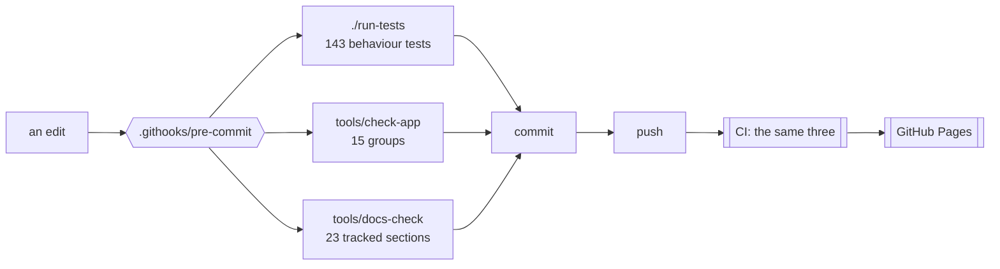

# Developing it

[← crystal-pilot mobile](../README.md) · [Using it](USING.md) · [The interface](INTERFACE.md) · [Two devices](DEVICES.md) · [What is proven](PROVEN.md) · [Developing](DEVELOPING.md) · [The code](CODE.md)

What can be checked without a ROM, how to run it locally, and why the tests
deliberately need no emulator.

---

## What runs, and where

Three things can run on a clean checkout with no ROM, and between them they are
what CI checks and what the pre-commit hook blocks on.



The hook is not installed by cloning. Enable it once per clone:

```bash
git config core.hooksPath .githooks
```

## Tests

```bash
./run-tests            # everything
./run-tests -k catch   # only names that match
./run-tests -v         # notes and stack lines
```

143 tests in seventeen files, and what each file is about says more than the count:

| file | tests | what it pins down |
| --- | --- | --- |
| `rows.mjs` | 31 | what every row and offer says, and when its button works |
| `battle.mjs` | 13 | whose turn it is, which Pokémon is out, and a win from a whiteout |
| `capture.mjs` | 12 | weakening, ball choice, the party prompt, and counting throws out of the bag |
| `titles.mjs` | 11 | choosing a profile for a cartridge, and falling back to generic |
| `control.mjs` | 10 | the task lifecycle: stopping, failing, undo points, and loops that must end |
| `remember.mjs` | 10 | which remembered choices are believed, and which dropped |
| `engine.mjs` | 8 | that a changed engine number is actually followed |
| `room.mjs` | 9 | the merge rules and the handshake, so two devices settle rather than fight |
| `journey.mjs` | 6 | choosing where to heal: the cost model, and a map with no name |
| `state.mjs` | 6 | reading the party, the map and the battery out of work RAM |
| `symbols.mjs` | 5 | the 45-address digest a second device boots from |
| `cartridge.mjs` | 4 | reading a ROM's own header: the logo, the title, Color-only |
| `input.mjs` | 3 | held buttons, and releasing them |
| `saves.mjs` | 3 | which battery record belongs to the cartridge in the machine |
| `collision.mjs` | 3 | which tiles have somebody standing on them |
| `menus.mjs` | 4 | the order the START menu is driven in, and what is closed between tries |
| `romdata.mjs` | 5 | the cartridge's own character encoding, byte by byte |

No ROM, no browser, no emulator — which is the point rather than a compromise.
The ROM is not in this repository and never will be, so a test that needs one
cannot run on a clean checkout or in CI, and a test that cannot run there does
not get run.

What that leaves is most of what has actually gone wrong. Every bug this app has
shipped was a decision made about a game state: picking a move whose power byte
lies, reporting a knockout as a getaway, giving up on a save while the game was
still settling, calling a blank cartridge saved. None of those needs a
cartridge. They need a plausible work-RAM snapshot and a way to watch what the
code does with it, which is what `tests/harness.mjs` provides — a fake Game Boy
with scripted responses, and a synthetic symbol table so nothing is pinned to
one build's addresses.

Every test here was checked by putting its bug back and confirming it fails.
Two did not, the first time: one never reached the branch it claimed to test,
and one asserted against a stub of the logic instead of the logic. Both are
rewritten. A test that has not been watched failing is a test you do not know
you have.

A third did something worse than pass: it hung. The check on the bound in
grind's heal loop drives a snapshot that never improves, so with the bound
taken out the loop never returns — measured, the run span for sixty seconds and
had to be killed from outside. A test that cannot finish cannot fail, and a
hung suite reports nothing at all, so the check written to protect that bound
would have wedged CI rather than naming the bug. It bounds its own fake now,
and fails in milliseconds.

Two nets underneath it, because one of them cannot be enough:

- **`tests/harness.mjs` times out a single test** — five seconds, or
  `TEST_TIMEOUT_MS` — names it, and carries on with the rest of the suite.
- **`run-tests` watches from a second process** — 120 seconds, or
  `TEST_LIMIT_SECONDS` — kills a suite that hangs and says which test was in
  flight when it stopped.

The second is not belt and braces. The first is a `setTimeout`, and a loop that
only ever awaits already-resolved promises starves the timer queue outright:
measured, a one-second microtask loop kept a 50 ms timer from firing until the
loop ended. That is the exact shape of a runaway `while (…) await this.snap()`,
which is how this suite hung for real — so the in-process timer cannot catch
the case that motivated it. A separate process cannot be starved by the one it
is watching.

What the tests do **not** cover is anything that needs the emulator running —
walking, the intro, the collision decode against a real map, and loading a save
back into the cartridge. Nor anything that needs a network: the room, the
handoff and the picture are all verified by hand, between two browser origins
standing in for two devices. The one part not verified even that way is the
video itself, for a reason the [remote play](DEVICES.md#watching-it-on-the-other-device)
section gives. Everything by hand runs against a local build.

## The checks that need no ROM

`tools/check-app` is fifteen groups, each one a class of mistake that parses
fine and is wrong at run time:

| group | asserts |
| --- | --- |
| `seam` | only `gb.js` touches the emulator core — `.core` or the global anywhere else is a reach past the wrapper |
| `layers` | every import points down `gbcore → gen2 → titles → app`, never up |
| `titles` | a title adds methods to the engine and never overrides one |
| `syntax` | all 27 modules and `sw.js` parse — copied to `.mjs` first, because `node --check` on a `.js` file with a syntax error exits 0 |
| `shell` | the service worker's shell lists every file it needs, and each exists |
| `markup` | `index.html`'s tags and its CSS braces balance |
| `contrast` | 22 colour pairs meet WCAG in **both** themes |
| `gamefiles` | no ROM, save or symbol file is tracked |
| `moves` | the lethal moves excluded from weakening are the ones that lie about their power |
| `buttons` | every button name handed to `press`/`hold` is one the core knows |
| `wiring` | every `$('#id')` exists in the markup, and every named import — same directory, another one, or a vendored module — resolves to something that exports it |
| `symbols` | the shared digest is every symbol the app looks up |
| `version` | `gbcore/version.js` and `sw.js` agree, and both doors are reachable with no ROM |
| `docshape` | section 2's architecture diagram draws, counts and tables all 27 modules |
| `names` | every capitalised name a module uses is one it can see |

`tools/docs-check` is the other half, and it checks the prose rather than the
code: a documentation section opts in with a marker naming the files it covers
and the hash those files had when it was last read against them.

```
<!-- covers: gen2/nav.js gen2/collision.js @ a1b2c3d4e5f6 -->
```

The guarantee is deliberately modest — that prose was *looked at* since the code
moved, not that it is right. Nothing short of a person reading both can do the
second, and the failure worth catching is "someone changed the code and nobody
remembered this file existed". When a section is right again:

```bash
tools/docs-check --update
```

Which is also why [The interface](INTERFACE.md) carries a marker: it is the page
that went stale, for exactly five versions, and nothing could notice.

## Driving it without picking files every time

Two query parameters, both for development, both off by default:

| | does |
| --- | --- |
| `?dev=1` | fetches the ROM and `.sym` from `./dev/`, which is gitignored, instead of asking you to pick them |
| `?autostart=1` | lets the pilot play the intro itself, taking one of the game's own names — see [Using it](USING.md#starting-a-game-is-yours-not-the-pilots) |
| `?title=generic` | forces a title profile by id instead of recognising the cartridge. The reason it exists is that the interesting profile is the one for a cartridge nobody has described, and testing it otherwise means going and finding a ROM hack |
| `?title=crystal-early` | the same, for a *partly* described cartridge: two named maps, one healer, no engine changes, driven by Crystal's procedures. What a hack profile looks like in its first hour |

Both go through `titleById`, which runs the same contract check as recognising a
cartridge does — naming your own profile by hand is exactly when you want to be
told it is the wrong shape, and for a while it was the one path that skipped
that.

`window.PILOT` exposes the live objects — `gb`, `tasks`, `state`, `collision`,
`world`, `nav`, `romdata`, `boot`, `walkToTap`, `showVersion`, and the two
WebRTC ends as `host` and `watcher` — so anything can be driven and watched from
a console rather than reasoned about.

Sharing is tested by serving the same tree on **two ports** and treating them as
two devices: separate origins mean separate IndexedDB and localStorage, which is
exactly what two phones have. A fresh port also sidesteps an HTTP-cached module
from the last run.

## Running it

Easiest: open **https://minormending.github.io/crystal-pilot-mobile/** and pick
your ROM and `.sym`. Both files stay in the browser, which is also why hosting
this publicly is fine: no game data is served, only the app. Nothing is uploaded
unless you press *Share*, and even then the ROM never is — see
[What leaves the device](DEVICES.md#what-leaves-the-device-and-when).

It is a static site with no build step, so it runs anywhere that serves files:

```bash
python3 -m http.server 8124
```

GitHub Pages suits it particularly well. The emulator core inlines its
WebAssembly as base64 in a single JS file, so there is no separate `.wasm` to
serve and no MIME type to configure, and it uses no `SharedArrayBuffer`, so it
does not need the cross-origin isolation headers Pages cannot set. Every path is
relative, so the `/crystal-pilot-mobile/` project subpath works untouched.

The HTTPS matters: service workers need a secure context, so on Pages the app
installs to the home screen and opens offline — which it will not do over plain
HTTP on your network. Bump `CACHE` in `sw.js` when you change the shell, or
browsers will keep serving the old one.

Build the ROM and symbol file yourself from the
[pokecrystal](https://github.com/pret/pokecrystal) disassembly.
