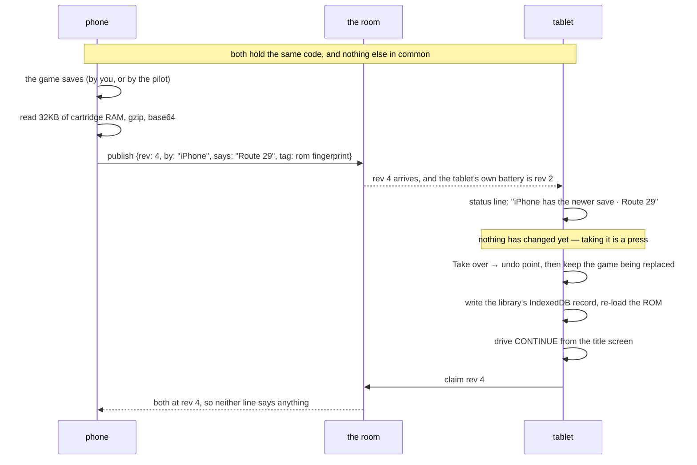
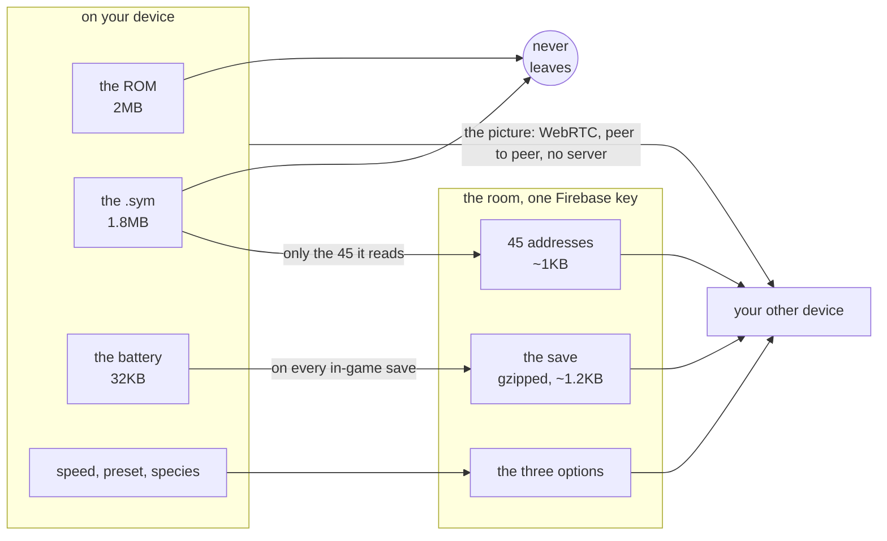

# Two devices, one game

[← crystal-pilot mobile](../README.md) · [Using it](USING.md) · [The interface](INTERFACE.md) · [Two devices](DEVICES.md) · [What is proven](PROVEN.md) · [Developing](DEVELOPING.md) · [The code](CODE.md)

What this browser tab keeps, what a room code carries to your other device,
and — set out in one table — what leaves the device at all.

---

## What the page remembers

Three choices survive a reload, in one localStorage key: the **speed step**,
which **grind preset** was tapped, and **what was being hunted**. The colour
theme has its own, older key. That is the whole list — everything else is
either derived, or too big for localStorage, or nobody's choice to begin with.

The ball is a good example of the third: nobody picks it. `refreshBag` derives
it from what is in the bag, cheapest ball that will do, so a Master Ball is
never spent on a Rattata. Remembering a derived value only gives it a way to go
stale.

Two rules make the rest of it dull, which is the goal:

**What comes back is a suggestion, not a fact.** It was written by an older
build, on a phone whose owner may have edited it by hand, so it is checked
against what this build can actually use — and dropped rather than salvaged. A
remembered speed of `9` must not become `SPEEDS[9]`: that is `undefined`, and
the idle loop would then step the emulator `undefined` frames. A grind preset
the buttons no longer offer has no nearest neighbour either; `+5` and `Lv20`
are different intentions, not different amounts of one.

**What is stored is the choice, never what it worked out to.** `+2` means two
above the lead, so storing the `Lv12` it came to today would come back tomorrow
meaning something nobody chose. The hunted species is restored only where it
can actually be found, at this hour, and only when nothing is selected — so it
restores a choice and never overrides one.

Each group also carries **when it was chosen**, which is what orders your
phone's choices against your tablet's. A missing or nonsense stamp reads as `0`
and loses to every real one.

Storage throws rather than returning null in a private window or after cleared
site data, so every access goes through one accessor that answers "nothing
remembered". Ten tests cover the deciding; the storage call itself is three
lines and a `try`.

## The ROM, the symbol file, and your last save

Those three are far too big for localStorage — 2MB of ROM against a budget of
about five, in strings — so they live in IndexedDB, and the app opens straight
into the game rather than onto a card asking for two files you have to go and
find. *Forget*, in settings behind the ⚙, throws all three away; the row it
sits in names what is being kept. None of it is uploaded: the files are on your phone,
in this browser's storage, and no game data is ever served. Sharing is the one
exception, and it is off until you press Share — see
[What leaves the device](#what-leaves-the-device-and-when) below.

**The save is kept because nothing else keeps it.** Measured: save the game,
reload, and it is gone — the emulator library persists a cartridge only when
something asks it to, and its own store held zero records after a save this app
had verified byte for byte. So keeping the files without the battery would open
the app on a title screen with no game behind it. The copy is taken when the
app knows the bytes have just moved — a save it drove, a `.sav` it installed, a
slot it loaded, and the moment before the Update button reloads the page.

Putting it back goes through the same path a `.sav` import uses: write the
library's record, re-load the ROM, then drive CONTINUE — so a restored session
opens **in the game**, not at a title screen with Start to press. You did not
ask for the reload; it should not cost you two presses.

That last step is gated twice, and both gates matter. It happens only when a
save is actually in the cartridge, because START-then-A is CONTINUE with a save
and **NEW GAME** without one — and that lands in the NAME menu, where the only
thing an auto-pilot can do is spell AAAAA. And it happens only for a session
restored from the store: a hand-picked one is left at the title screen, because
that menu is where NEW GAME lives and continuing past it would leave no way
back to it. *Forget* is the way back for a kept game.

The save is read off the cartridge rather than from what this session
installed, because the library pushes its own record in on every ROM load — a
restored session can arrive holding a game nothing in this session put there,
and it is just as much a game to carry on from.

Two more things had to be true first, and both were found by doing it rather
than reasoning about it:

* **The page has to be visible.** Re-loading the ROM goes through the library's
  `pause()`, which waits for an animation frame a hidden page never gets, so
  the restore waits for you to look at it. A phone restoring a background tab
  is one of the ordinary ways this app opens, and in a hidden pane the restore
  did nothing at all while the settings row went on saying the save was kept.
* **The emulator has to have started.** A second `loadROM` a moment after the
  first leaves the core executing nothing — every work-RAM read comes back
  zero, and the app sits at a title screen it cannot drive, holding a save it
  has just installed. `gb.awake()` runs frames until the machine demonstrably
  is one. The `.sav` and slot paths never met this, because by the time a
  person presses either, the emulator has been running for a while.

## When the app does not know your cartridge

Point it at a ROM hack and it works, and one line in settings says what that
costs. **Game — no profile for this cartridge: maps are numbered, and the pilot
cannot start a game or heal.**

That row exists because the app behaves *correctly* in a way that reads as
broken. A cartridge nobody has described gets a profile that names no map and
knows nowhere that heals, so the header says `map 26.1` where it would say
*Route 30*, there is no offer to start a new game, and Heal is not on the list.
Each of those is the right answer to a question the app cannot answer, and
without the line they are four separate mysteries.

It is silent for a cartridge the app knows, because *this is Crystal* is not
news to somebody who just picked Crystal. In between — a profile with some maps
named and no healers yet — it names the profile and says what is still missing,
because that one is a file somebody can go and finish.

## Sharing it with your other device

One person, a phone and a tablet, no accounts: `sync/` is
[kidsync](https://github.com/minormending/kidsync) vendored, a room is one key
in a Firebase Realtime Database, and the code — `K7M2P` — is the password.
Press **Share** on one device, type the code on the other, and what they
remember stays in step. Because the code *is* the password, it lives in your
pocket and never in this repo.

**Five characters, and the alphabet is chosen for typing.** kidsync's own codes
are three words and three digits, `BANJO-COMET-OTTER-472`, and that is right for
the apps it was written for: a child reads the code aloud and somebody else
types it, so the 128 words are picked for having no homophones. Here one person
holds both devices. There is nobody to read it to, and a code you glance at and
type once should be short enough to hold in your head while you look away from
the screen — so this app passes kidsync its own format.

The alphabet is [Crockford's base32](https://www.crockford.com/base32.html): the
digits and the letters except **I, L, O and U**. One reason each — I and L are
1, O is 0, and U is left out of hand-typed alphabets so an accidental word
cannot appear. A code therefore cannot contain a character you might mistake for
its neighbour, and typing it is forgiven the three ways people get it wrong
anyway: `sf-817` and ` SF8I7 ` both read as `SF817`.

| | codes | |
| --- | --- | --- |
| three words and three digits | 2,048,256,000 | 128 × 127 × 126 × 1000 |
| five Crockford characters | 33,554,432 | 32⁵ |

**That is about sixty times fewer, and it is a real cost rather than a rounding
error.** The code is still the only thing between a room and a stranger, and a
room still holds a gzipped save and a sentence saying where you are. What it
buys is a code that fits in a glance; what it costs is that someone guessing
would need tens of millions of tries — each an authenticated network round trip,
against a room they would also have to know exists — rather than tens of
billions. For one person's two devices passing a Pokémon save between them that
is the trade this app wants. It is the wrong trade for anything you would mind a
stranger reading, which was already true and is now more true.

The options went first on purpose: they stood the whole path up — config, rules,
anonymous sign-in, merge, debounce — with a slider position at stake rather than
a save. Three things travel through the room that way, because all three merge:
the options, the 45 addresses out of the symbol file, and the offer to show a
screen. The save does **not** merge, and goes over the same room by a different
mechanism — the next section.

Two rules make it unable to hurt the app. Opening the room is the only thing
that touches the network, and that happens on a press or because this device
has shared before, so someone who never shares never loads the Firebase SDK at
all. And it is loaded with a dynamic `import()` inside a `try`, because
kidsync pulls the SDK from `gstatic` at the top of its module — a static import
would put a cross-origin fetch in the middle of this app's module graph, and
offline that takes the whole app down with it. Offline you lose sharing and
keep the game.

## Handing the game over

The same room carries the save. [baton](https://github.com/minormending/baton),
vendored in `baton/`, is the other shape of sync: kidsync moves state that
merges, and a battery does not merge — two devices that both played can only be
chosen between. So one device holds it, publishes it, and the other takes it.

Save on the phone and the tablet's status line says **iPhone has the newer
save · Route 29 · TOTODILE Lv5**, with **Take over** beside it. That takes an
undo point, installs the save and drives CONTINUE, and the line then goes away.

It is on the status line rather than behind a door because it is the one thing
the room can say that changes what you should do next, and a message you have to
go looking for is no message. Of the five states the room can be in, two earn
that line — the other device is ahead, and the room holds a save from a
different build. *Nothing shared yet*, *this device is ahead* and *in step* do
not: they are either nothing having happened or everything being fine, and the
status line is the one thing always on screen.

- **It publishes where the app already knows the bytes moved** — after a save it
  drove, a `.sav` it installed, a slot it loaded, and before the Update button
  reloads. There is no "the game saved" event in a browser.
- **It carries a fingerprint of the ROM.** A save made with a different build
  loads and is then confidently wrong, so a mismatch is named and taking it is
  not offered.
- **What a handoff replaces is kept.** Taking a save overwrites the game on
  this device, so the one it displaced goes into a slot of its own that only a
  handoff writes — the undo point is written before every job and would be gone
  by the time you noticed. *Put back what a handoff replaced* appears whenever
  there is one.
- **The second device does not need the `.sym` at all.** The file is 1.8MB and
  the app reads 45 symbols in it, so the room carries those 45 addresses —
  about a kilobyte — and a device with the ROM and no symbol file boots from
  them. `check-app` asserts the shared list is every symbol the app looks up,
  because a list that falls behind works perfectly on the device that has the
  file and breaks only on the one that does not.
- **It says when a save will not fit.** 32,768 characters is the room's cap; a
  raw base64 battery is 43,692 and never fits, gzipped it measured ~1,200.
  Compression is what makes it possible, not a guarantee — a refused publish
  keeps the save on the device and says so, rather than leaving your other
  device showing an older game for no visible reason.

## Watching it on the other device

Press **Show** on the device with the game and **Watch** on the other one, and
the second device gets the screen and a working pad — no ROM, no symbol file,
nothing but the room code. The picture goes straight between the two devices
over WebRTC; the room only introduces them.

**Or press *View only* instead, and they get the screen without the pad.** The
Screen row carries both: the button that starts or stops it, and one that names
the mode you are *not* in, so it reads *View only* while you are handing the pad
over and *Hand over* while you are not. It works before anyone is watching and
while someone is, so you can change your mind mid-session.

The guarantee is the host's, not the watcher's. A press that arrives over the
data channel is a press that was already sent, so a watcher that politely
declined to send would be honour-system; the check is three lines in the device
that owns the joypad, and anything held at the moment the pad is taken away is
released at both ends.

Both devices say which mode they are in, and the watching one is told **before**
it presses anything — the `showing` note in the room carries the answer, so that
row reads *iPhone is showing its screen · view only* rather than letting someone
find out by trying. Once connected the pad dims, the same way it dims while a
pilot job is running.

Which is the other reason a watched pad can go quiet, and it used to do so in
silence: a pilot job holds the joypad, so the host refuses remote presses for as
long as one runs. The watching device had no way to know that — its pad looked
live and every press went nowhere. The host now says which of the two it is:
*watching iPhone · view only* is a decision, *watching iPhone · the pilot is
driving* ends by itself.

It needs the showing device to be **awake and in the foreground**, and that is
a browser fact rather than a choice: measured, a hidden page is throttled to
about one turn a second — timers clamped, animation frames gone — so a
backgrounded host would send a picture that looks live and is seconds behind.
When the screen goes off it says so, and the watching row stops pretending.

Two devices on one wifi find each other directly. Across networks they often
will not: that needs a relay this app does not run, so after fifteen seconds of
trying it says so rather than spinning.

**The picture itself is the one part of this app not verified end to end.** The
handshake, both sides' rows, the pad on a device with no game and the swap of
video for canvas are all tested between two origins; the media path stalls in
the test browser because a background tab never sends its ICE checks, and a
standalone probe in the same browser passes video fine. On two real devices it
should simply work — and if it does not, the row will tell you.

The same limit applies to the two things sent *over* that channel — "my screen
is off" and "your pad is live" — because the channel opens with the connection.
What can be checked without it has been: the mode is enforced where the presses
land, it survives a reload in the room note, both rows say which state they are
in, and a watching pad dims and stops sending. What two real devices on one wifi
would add is watching the dimming happen the instant the other device presses
*View only*.

## What leaves the device, and when

Sharing changed the honest answer to "does anything leave my phone?", so here it
is in one place. Until you press **Share**, nothing does — no room, no network,
not even the Firebase SDK, which is fetched only when a room is opened.

| | leaves | when |
| --- | --- | --- |
| the ROM | **never**, by any path | — |
| the `.sym` file | **never** | — |
| 45 addresses out of it | yes, ~1KB | while sharing |
| your save | yes, ~1–10KB gzipped | on every in-game save, while sharing |
| where you are, as a sentence | yes | with the save |
| speed, grind preset, hunted species | yes | while sharing |
| the picture, while *Show* is on | device to device, **not** to a server | while showing |

A room is one key in a Firebase Realtime Database, named by its code. **The code
is the password**: anyone holding it can read and write that room, and the save
in it is gzipped, not encrypted. That is the right trade for your own two
devices passing a game between them, and the wrong one for anything you would
mind a stranger reading. Rooms cannot be deleted from inside the app — the rules
reject it — so an abandoned one keeps its last save until you delete the node in
the Firebase console.

*Forget* throws away what this device keeps; **Stop** leaves the room without
touching what is already in it.

### If you clone this

`sync/firebase-config.js` points at the Firebase project these apps share, and
those values are public by design — they are an address, not a secret, and the
[rules](../sync/firebase-rules.json) are the protection. But they are *my* address:
press Share on your own copy and you would be writing rooms into my database. So
point it at your own project — kidsync's README has the five-minute setup — or
delete the file, which leaves the app working exactly as it did before any of
this, with sharing quietly unavailable.
