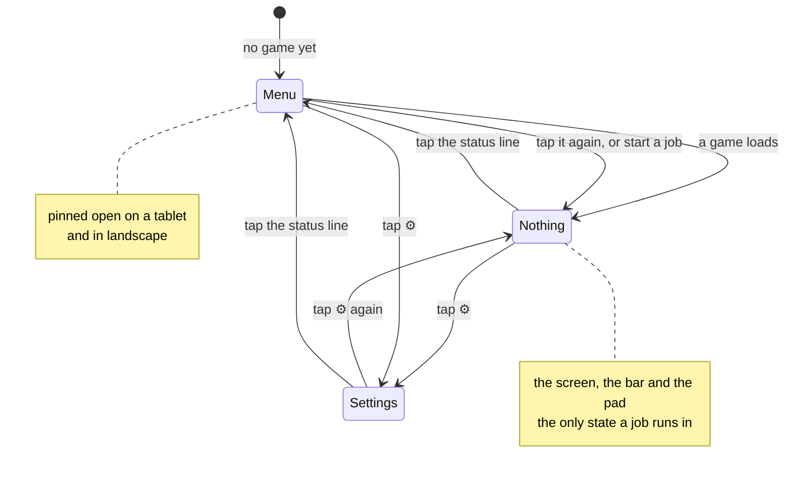

# The interface

[← crystal-pilot mobile](../README.md) · [Using it](USING.md) · [The interface](INTERFACE.md) · [Two devices](DEVICES.md) · [What is proven](PROVEN.md) · [Developing](DEVELOPING.md) · [The code](CODE.md)

What the screen is made of, and why it is shaped like the console it
emulates. For what the buttons do, see [Using it](USING.md); for the code
behind it, [The code](CODE.md) section 9.

---

## It is a Game Boy, so it looks like one

A Game Boy has a screen and eight buttons. It shows you nothing else — the
party, the bag, the save and the options all live behind **Start**, and the game
slides that menu over the picture when you ask for it.

Everything this app added over five months is, in those terms, a menu: jobs,
slots, undo, room codes, device names, kept files, colour. Every one of them was
laid out on the page permanently, because a page is what a browser gives you for
free. Measured at v85 on a 375 × 812 viewport with a game running, that came to
2,311px — 2.85 screens — with four of the seven blocks below the fold and the
pad scrolled away from the screen it drives. The bug was not the number of
features. It was **the absence of a door**.

This is the second round of layout work, and the first is worth recording
because it is why the second was needed. Before it, `main` was `display:block`
and source order was the only order; the page measured 1,537px with two Stop
buttons 500px below the fold. Making it a column flex that reordered itself
between playing and piloting took it to 1,424px and put one Stop under the
screen — a real improvement, measured, and still a document. Everything added
afterwards went onto the same page, and by v85 it was 2,311px. Tidying a menu
was the wrong answer to a page that should not have had one.

So the app is an appliance rather than a document. Three things hold their
places, one opens over them, and the page itself never scrolls at all:

| | holds | scrolls |
| --- | --- | --- |
| the stage | the screen and the tap hint | never |
| the bar | what is happening, Stop, and the door | never |
| the sheet | the offers, the save, the party, settings | yes, and only this |
| the pad | the eight buttons | never |

```
 ┌───────────────────────┐   ┌───────────────────────┐
 │ crystal-pilot  v··  ⚙ │   │ crystal-pilot  v··  ⚙ │  ← header, always
 ├───────────────────────┤   ├───────────────────────┤
 │                       │   │ ┌───────────────────┐ │
 │                       │   │ │ Send the pilot    │ │
 │        screen         │   │ │  Catch  ▸ Start   │ │  the sheet, over
 │                       │   │ │  Hunt   ▸ Start   │ │  the same area
 │                       │   │ └───────────────────┘ │
 │  Tap to walk there.   │   │ ┌───────────────────┐ │
 ├───────────────────────┤   │ │ Your save         │ │
 │ ● ready       Menu ▴  │   ├───────────────────────┤
 ├───────────────────────┤   │ ● ready      Close ▾  │  ← the bar, always
 │   ▲                   │   ├───────────────────────┤
 │ ◀ ● ▶       B     A   │   │   ▲                   │
 │   ▼                   │   │ ◀ ● ▶       B     A   │  ← the pad, always
 │   Select    Start     │   │   ▼   Select   Start  │
 └───────────────────────┘   └───────────────────────┘
        menu closed                 menu open
```

The sheet shares the stage's grid area — two grid items in one area overlap,
which is the whole trick — so opening the menu costs the screen nothing and
moves neither the bar nor the pad. It is open until a game is running, because
until then it holds the only two things there are to do; after that it is closed
by default, and closed again by every job that starts, because asking the pilot
to do something is asking to watch it. Closing is one-way: a job that ends
leaves the screen alone rather than throwing a menu over whatever it just did.

Measured the same way at v95, with a game running and the menu closed:

| | v85 | v95 |
| --- | --- | --- |
| page height | 2,311px | 812px — the viewport, exactly |
| words on screen | ~300 | 24 |
| controls drawn that do nothing | 6 | 0 |
| taps to start the likeliest job | scroll + 1 | 2 |
| screen and pad | 92px apart, scrolling | both fixed, 351 × 316 screen |

## The pilot offers what it can do, ranked

`runTask` opens with `if (running) return null`, so only one job can ever be
underway. These were never independent buttons — they are one mutually exclusive
choice, and a row of buttons is the wrong shape for that. The old arrangement
kept the fiction by hand and the lists disagreed: grinding locked Hunt but not
Catch or the errand; catching locked Hunt and grinding but not the errand.

It measured badly too. Content-sized flex rows gave four actions four different
widths — 207, 110, 167 and 86 — inside a 351px card, which made Catch, the most
consequential thing in it, the smallest target on screen.

Then six rows in a list had the opposite problem: four of them were usually
greyed out with a line each explaining why — *not in a battle*, *not in a
battle*, *no party yet*, *pick something below*. This app reads the game's own
memory, which is the entire point of it. It knows there is no battle, that
nobody is hurt and that there are no Poké Balls. Printing all four conclusions
is the app scanning on your behalf and then making you scan the result anyway.

**A job that cannot run is not drawn.** Not greyed out, not collapsed — not
drawn. The rest arrive in the order you are most likely to want them, and every
rule in that order is a fact about the game rather than a preference:

| when | first | why |
| --- | --- | --- |
| someone has fainted | Heal | it is what stops every other job finishing |
| a species is picked | Catch, Hunt | the specific intent beats the general one |
| otherwise | Grind | the job that needs nothing but a party |

Healing drops back below the jobs when the party is merely scratched, which is
the same rule read the other way. The accent follows whatever ranks first: it
used to be nailed to Grind in the markup, which was true of a fixed list and a
lie the moment something else could lead.

Catch owns its prerequisite. The errand used to be a peer button *below* Catch,
beside bag advice that contradicted it — and it is a one-time thing anyway: run
it twice and it reports *already carrying 5 ball(s)* without moving. It is
Catch's empty state instead, so the row that says you need balls is the row that
fetches them, and that row stays on the list when the only thing missing is the
balls. Hiding it would hide the way out of the state it describes.

One quiet line survives the cull. It says what would *add* to the list, and only
when there is something to do about it — *most jobs need a Pokémon with you*,
*pick something below to hunt or catch*. Two clauses at most, and silence when
the reason a job is missing is that nothing is wrong: "everyone is at full
health" is the good state, and a line explaining the absence of an offer nobody
wanted is the noise all of this removes.

Measured in the bedroom of a new game, where one job of six can run: the card
went from 603px to 260px.

Two other things went in the same pass, further back. *Pick one to look for* was
a filled accent primary button that was disabled and did nothing, sitting below
the chips that were the real control — the chips are the control, and the rows
report readiness. And the level stepper, four buttons and up to four taps to say
Lv10, became four presets, two of them relative to the party's own level. The
presets are only drawn when Grind is on the list, because with nothing to level
they are four buttons that change a number nobody is using.

## A battle is answered where the battle is

Fight and Throw are not offers. They answer what is in front of you rather than
being sent off to work for ninety seconds, and a battle is the one modal state
in this app — while it is on, nothing that walks can start. Reaching them
through the menu meant opening a door *over* the battle in order to answer it.

They are a second line in the bar now, drawn only while a battle is live, which
puts them directly above the pad:

```
● wild PIDGEY Lv3                    Fight   Throw
```

That line has room for one caption, not two. The foe's name and Throw's reason
together at 375px gave *"wild PIDGE… no Poké Bal…"* — two truncations where one
sentence would do — so the foe shows while Throw works and gives way to the
reason when it does not: *the party is full*, *a trainer's Pokémon cannot be
caught*, *no Poké Balls yet*. The foe is on the screen directly above either
way.

The offers list is therefore empty during a battle, by design, and the hint says
where the two actions went. An empty list with no explanation reads as broken
rather than as modal.

## The party is one line, above the jobs it decides

The party had a card of its own: a heading, a row and an HP bar per member — six
rows for the two facts a pilot acts on. Which Pokémon leads decides what a
grind levels. Whether anyone is hurt decides whether Heal is on the list. Both
were in a panel *below* the offers they decide, which is the wrong way round.

```
TOTODILE Lv5 · 14/20 · +2 more · 1 fainted        ▾
```

Fainted is said **instead of** hurt, because a fainted party is the state that
stops a job finishing and "3 hurt" said of a party with one out cold buries the
half that matters. Nothing is deleted: that line is a `<summary>` and the bars
are one tap under it. With no party the whole thing is hidden rather than
summarising nothing.

## What the pilot is doing, and how you stop it

There were once two Stop buttons, one per card, at 1181px and 1463px down the
page — so during a ninety-second grind neither was on screen, and two identical
buttons in different cards asked a question nobody should have to hold: *which
one stops which thing.* Then there was one, in a card that still scrolled. This
repository had already written the rule down: **a page you scroll to read is
fine, a page you must scroll to stop the pilot is not.**

So the status line is furniture. It sits between the screen and the pad, it
never moves, and it holds the dot, what is happening, Stop while something runs,
and the door:

```
● off to Mr. Pokémon's                       Menu ▴
  through to Elm's lab
```

It is a row of two buttons rather than one tappable strip, so Stop cannot open
the door under the thumb that meant to press it.

The pilot's account of itself was once a single label that overwrote itself,
with a second line left over from whatever ran before — "ready" sitting above a
stale "finding grass". The errand walks four maps, heals twice and fights a
rival, and all of it arrived as one string. It already emitted the right events
and they were being thrown away.

Three lines now, newest last, cleared when a run *starts* rather than when it
finishes: the last thing the pilot said is the most useful thing on screen once
it has stopped. Consecutive repeats collapse, because several legs say "heading
left" and a stack of identical lines reads as being stuck rather than as making
progress. The log lives in the sheet — behind a door the job just closed — so
the newest line is mirrored onto the outside of the door, which is the second
line above. Without it a ninety-second job would show one busy dot and no sign
of life.

While a job runs the pad stops taking input and dims to say so; pressing it
would be fighting the pilot for the same joypad. One other thing dims it the
same way: watching another device's screen without being allowed to play it, or
while that device is running a job of its own — two states, one look, because
what they have in common is the only thing the pad needs to communicate. Writing that sentence is what
found the bug in it: `hold` has always opened with `if (running) return` in
every layout, and the dimming was written for the landscape rule -- where the
pad is taken apart into two grid areas -- and stayed there. So on a phone held
upright the pad looked exactly as available as ever and quietly did nothing,
which is this page's own rule read backwards.

## Two doors, and never two panels

There are exactly two things behind doors, and they are behind different ones:

| door | opens | holds |
| --- | --- | --- |
| the status line | the menu | the offers, the picker, the save, the party |
| ⚙ in the header | settings | colour, the room, this device's name, kept files, *How this works* |

Settings used to be the *first* card in the menu, so opening the pilot's list
meant scrolling past the colour theme to reach the thing you opened it for. It
is a preference: set once and then read never, which is what a door is for.

Both doors are reachable with no game loaded — the device that most needs the
room code is the one with no ROM on it yet, which is also why the version
display lives in the header. `check-app`'s `version` group asserts the two that
can regress silently: that the version display is inside `<header>`, and that
the settings card does not carry `hide`.

One panel value rather than two open flags, because "both open" is a state with
no meaning that two booleans would let happen. Opening either closes the other:



The one sharing state that ever interrupts gets a line on the bar rather than a
place behind a door: **your other device has the newer save**, with Take over
beside it. Of the five things the room can say, two earn that line — the other
device is ahead, and the room is holding a save from a different build. The
other three are nothing having happened yet, this device being ahead, or the two
being in step, and *in step* sitting on the always-visible line for a whole
session is precisely the noise the rest of this was rewritten to remove.

## Three layouts, one machine

The furniture is the same in all three; what changes is how it is arranged.

| | screen | the rest |
| --- | --- | --- |
| **Portrait phone** | full width, letterboxed on short phones | bar and pad below, the menu opens over the screen |
| **Landscape phone** | between your thumbs | D-pad left, A/B right, the menu a column beside |
| **Tablet** | an integer 3× — 480 × 432 | the menu alongside, permanently |

```
 landscape phone, 844 x 390          tablet, 820 x 1180
 ┌────────────────────────────┐      ┌──────────────────────────┐
 │  ▲    ┌────────┐    B  A   │      │ ┌────────────┐  ┌───────┐│
 │◀ ● ▶  │ screen │           │      │ │            │  │ Send  ││
 │  ▼    └────────┘           │      │ │   screen   │  │  the  ││
 │       ● ready              │      │ │    3x      │  │ pilot ││
 │       Select  Start        │      │ └────────────┘  │       ││
 │                    the     │      │ ● ready         │ Your  ││
 │                    menu ── │      │ ┌────────────┐  │ save  ││
 │                    beside  │      │ │  the pad   │  │       ││
 └────────────────────────────┘      │ └────────────┘  └───────┘│
   thumbs at the edges,              └──────────────────────────┘
   picture between them                the menu is just there
```

A door exists because a phone has no room for both the game and the menu. A
tablet has, and so does a phone held sideways, so in both of those the sheet is
a column that never closes and the chevron is hidden: an affordance for a door
that is not there is worse than no affordance.

Landscape was not cramped before this work, it was unusable: at 844 × 390 the
page ran to six screens and the pad started at 575px, so the game and the
buttons that drive it could not both be seen at any scroll position. It is one
screen now, with a 242 × 218 picture between your thumbs.

**The screen measures the box it is in, rather than being told a number.** It
used to size itself with `calc((100dvh - var(--reserve)) * 160 / 144)`, where
`--reserve` was a hand-tuned guess at the height of everything else on the page:
460px in portrait, 105px in landscape, wrong by 36px on the first reading and
wrong again the moment the status line moved. It now sits alone in a box with
`container-type:size` and takes `width:min(100%, calc(100cqh * 160 / 144))` with
`aspect-ratio:160/144`. If the height binds, the ratio gives the width; if the
width binds, `min()` clamps it and the ratio gives the height back. Measured
259 × 233 at 375 × 667 and 366 × 329 at 390 × 844, both 1.111 to three places,
with no constant in either — and the picture shrinks to 203 × 182 on its own
when a battle line appears.

The tablet is the one layout still told a size, because there the point is
square pixels rather than filling the room: 3× is 480 × 432, and a Game Boy
picture at 2.7× has visibly uneven pixels.

Sizes are in `dvh`, because mobile browser chrome comes and goes and a pad
positioned against `100vh` sits under the address bar exactly when a thumb
reaches for it.


## Colour

Two palettes, named by the job each colour does. Dark is the base, because that
is what this app is: a Game Boy screen looked at in the evening. Light is for
the people whose phone is set that way.

There is no palette switcher for the *screen*, and that is deliberate: this
ROM's header reads `0xc0`, Game Boy Color only, so Crystal supplies its own
colours and uses them to tell things apart. A DMG green wash would destroy
information, and the core exposes no palette API to do it with anyway.

The interface theme is a different question, and the order mattered. A second
theme multiplies a palette rather than resolving one, and this palette had four
measurable failures in it — so those were fixed first, on one palette, and the
light set was derived afterwards from the roles rather than from the old
values. Doing it the other way round would have doubled the work and shipped
both halves broken.

What was actually wrong:

* **Ordinary buttons were filled with `--panel`** — the exact colour of the card
  holding them, 1.00:1 — and leaned on a 1.27:1 border to be visible at all.
  The comment in that stylesheet already said *"a button the same colour as its
  container reads as a label"*, and applied it only to the D-pad keys. `--raise`
  is that lesson applied to everything pressable.
* **White on the accent was 3.80:1**, so the label on every Start button in the
  app failed. `--action` at `#4269c9` passes at 5.13:1 and still steps clear of
  a card at 3.04:1. Darker blues pass more easily and go muddy.
* **Stop read at 3.93:1** — the one control you want in a hurry.
* **Select and Start read at 4.41:1**: `--dim` is legible on the page and on a
  card, but not on a raised key, which is where those two live. They have their
  own ink now.

And one thing that was not a contrast problem at all: **`--accent` meant six
unrelated things** — the primary action, a selected species, a selected level, a
held key, where you tapped, and something running. When everything important is
the same blue, blue has stopped signalling anything. Filled controls that carry
a label are `--action`; `--accent` is now only used where there is no text on it
(the running dot, the slider, links); and where you tapped is `--mark`, a warm
amber, deliberately not a control colour — as the accent blue it read as one
more button sitting on the map.

Every pair is checked in both themes: no text combination under 4.5:1, no
meaningful edge under 3:1. Removing the old under-the-screen `.speed` block also
fixed a cascade collision it was causing — it still set `margin-top:10px`, which
the header rule did not override, so the header's speed control carried a stray
margin.

Three things about light are not simply the dark values flipped:

* **A pressable cannot be lighter than a white card.** On dark, `--raise` steps
  up and carries the affordance on its own. On light it steps *down* and the
  border does more of the work.
* **The gamepad needs a bigger step than the buttons do**, because it is drawn
  as one connected cross with no borders at all — the fill is the only thing
  separating it from the card. `--key` stopped being an alias of `--raise` for
  that reason. The first attempt gave each cell its own outline instead, which
  worked and was wrong: it turned the cross back into the four loose boxes the
  original CSS says it is not.
* **`--mark` is identical in both.** Where you tapped sits on the game's own
  picture, not on any surface of ours, so it is not the theme's business.

The control is three-state — auto, light, dark — and lives in the card with
*How this works* rather than the header. The header is for where you are and
how fast the game is running; a theme is neither, and it is set once. Putting it
there also overflowed 375px, wrapping the title and truncating the location.

## Keeping this page honest

This is the page that went stale. It described a column-flex layout that
reordered itself between playing and piloting for five versions after that
layout was replaced, because nothing in the repository could notice: a checker
can see that code changed, and cannot see that prose about it did not.

So this page carries a marker naming the files it describes and the hash they
had when it was last read against them. `tools/docs-check` reports it when they
move, and the pre-commit hook blocks on that report.

<!-- covers: index.html app/main.js app/rows.js @ 11dfb18380b5 -->
