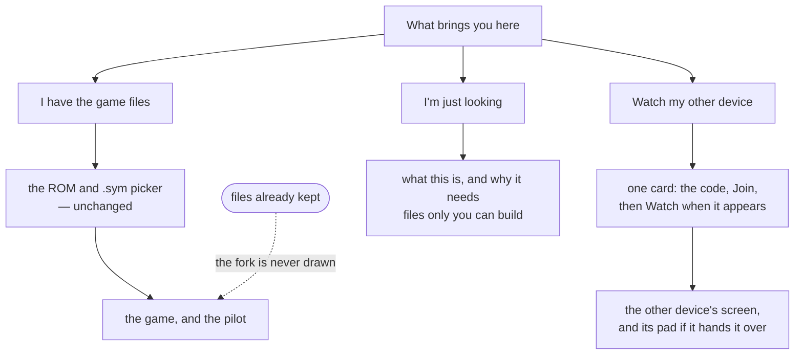
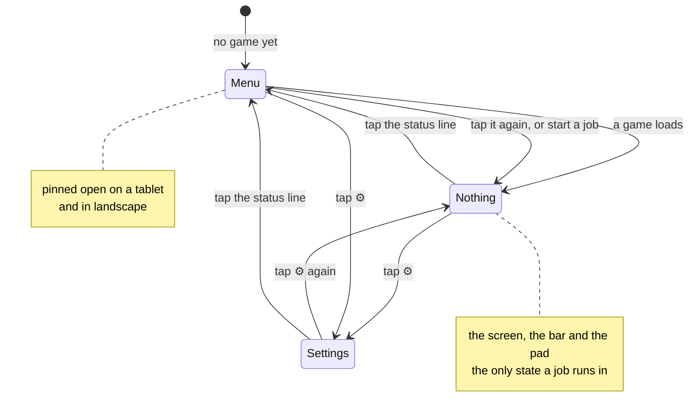

# The interface

[← crystal-pilot mobile](../README.md) · [Using it](USING.md) · [The interface](INTERFACE.md) · [Two devices](DEVICES.md) · [What is proven](PROVEN.md) · [Developing](DEVELOPING.md) · [The code](CODE.md)

What the screen is made of, and why it is shaped like the console it
emulates. For what the buttons do, see [Using it](USING.md); for the code
behind it, [The code](CODE.md) section 9.

---

## It is a Game Boy, so it looks like one

A Game Boy has a screen and eight buttons. It shows you nothing else — the
party, the bag, the save and the options all live behind **Start**, and the game
slides that menu over the picture when you ask for it.

Everything this app added over five months is, in those terms, a menu: jobs,
slots, undo, room codes, device names, kept files, colour. Every one of them was
laid out on the page permanently, because a page is what a browser gives you for
free. Measured at v85 on a 375 × 812 viewport with a game running, that came to
2,311px — 2.85 screens — with four of the seven blocks below the fold and the
pad scrolled away from the screen it drives. The bug was not the number of
features. It was **the absence of a door**.

This is the second round of layout work, and the first is worth recording
because it is why the second was needed. Before it, `main` was `display:block`
and source order was the only order; the page measured 1,537px with two Stop
buttons 500px below the fold. Making it a column flex that reordered itself
between playing and piloting took it to 1,424px and put one Stop under the
screen — a real improvement, measured, and still a document. Everything added
afterwards went onto the same page, and by v85 it was 2,311px. Tidying a menu
was the wrong answer to a page that should not have had one.

So the app is an appliance rather than a document. Three things hold their
places, one opens over them, and the page itself never scrolls at all:

| | holds | scrolls |
| --- | --- | --- |
| the stage | the screen and the tap hint | never |
| the bar | what is happening, Stop, and the door | never |
| the sheet | the offers, the save, the party, settings | yes, and only this |
| the pad | the eight buttons | never |

```
 ┌───────────────────────┐   ┌───────────────────────┐
 │ crystal-pilot  v··  ⚙ │   │ crystal-pilot  v··  ⚙ │  ← header, always
 ├───────────────────────┤   ├───────────────────────┤
 │                       │   │ ┌───────────────────┐ │
 │                       │   │ │ Send the pilot    │ │
 │        screen         │   │ │  Catch  ▸ Start   │ │  the sheet, over
 │                       │   │ │  Hunt   ▸ Start   │ │  the same area
 │                       │   │ └───────────────────┘ │
 │  Tap to walk there.   │   │ ┌───────────────────┐ │
 ├───────────────────────┤   │ │ Your save         │ │
 │ ● ready       Menu ▴  │   ├───────────────────────┤
 ├───────────────────────┤   │ ● ready      Close ▾  │  ← the bar, always
 │   ▲                   │   ├───────────────────────┤
 │ ◀ ● ▶       B     A   │   │   ▲                   │
 │   ▼                   │   │ ◀ ● ▶       B     A   │  ← the pad, always
 │   Select    Start     │   │   ▼   Select   Start  │
 └───────────────────────┘   └───────────────────────┘
        menu closed                 menu open
```

The sheet shares the stage's grid area — two grid items in one area overlap,
which is the whole trick — so opening the menu costs the screen nothing and
moves neither the bar nor the pad. It is open until a game is running, because
until then it holds the only two things there are to do; after that it is closed
by default, and closed again by every job that starts, because asking the pilot
to do something is asking to watch it. Closing is one-way: a job that ends
leaves the screen alone rather than throwing a menu over whatever it just did.

Measured the same way at v95, with a game running and the menu closed:

| | v85 | v95 |
| --- | --- | --- |
| page height | 2,311px | 812px — the viewport, exactly |
| words on screen | ~300 | 24 |
| controls drawn that do nothing | 6 | 0 |
| taps to start the likeliest job | scroll + 1 | 2 |
| screen and pad | 92px apart, scrolling | both fixed, 351 × 316 screen |

## The pilot offers what it can do, ranked

`runTask` opens with `if (running) return null`, so only one job can ever be
underway. These were never independent buttons — they are one mutually exclusive
choice, and a row of buttons is the wrong shape for that. The old arrangement
kept the fiction by hand and the lists disagreed: grinding locked Hunt but not
Catch or the errand; catching locked Hunt and grinding but not the errand.

It measured badly too. Content-sized flex rows gave four actions four different
widths — 207, 110, 167 and 86 — inside a 351px card, which made Catch, the most
consequential thing in it, the smallest target on screen.

Then a list of rows had the opposite problem: four of them were usually
greyed out with a line each explaining why — *not in a battle*, *not in a
battle*, *no party yet*, *pick something below*. This app reads the game's own
memory, which is the entire point of it. It knows there is no battle, that
nobody is hurt and that there are no Poké Balls. Printing all four conclusions
is the app scanning on your behalf and then making you scan the result anyway.

**A job that cannot run is not drawn.** Not greyed out, not collapsed — not
drawn. The rest arrive in the order you are most likely to want them, and every
rule in that order is a fact about the game rather than a preference:

| when | first | why |
| --- | --- | --- |
| someone has fainted | Heal | it is what stops every other job finishing |
| a species is picked | Catch, Hunt | the specific intent beats the general one |
| otherwise | Grind | the job that needs nothing but a party |
| straight after Grind | Duel | it levels the same thing, and a trainer is beaten once |
| below the jobs | Take, Travel | neither is urgent; a place is still there in a minute |
| last | Shop | the only offer that is about what you will need next |

Healing drops back below the jobs when the party is merely scratched, which is
the same rule read the other way. The accent follows whatever ranks first: it
used to be nailed to Grind in the markup, which was true of a fixed list and a
lie the moment something else could lead.

Catch owns its prerequisite. The errand used to be a peer button *below* Catch,
beside bag advice that contradicted it — and it is a one-time thing anyway: run
it twice and it reports *already carrying 5 ball(s)* without moving. It is
Catch's empty state instead, so the row that says you need balls is the row that
fetches them, and that row stays on the list when the only thing missing is the
balls. Hiding it would hide the way out of the state it describes.

**And a row earns its place while it is waiting to be chosen for**, which was
missing and was a dead end rather than an untidiness. The pickers under the list
— the species chips, the level presets, the destinations — are drawn only when
the row that reads them is *on* the list. So a row that appears only once a
choice has been made can never be chosen for.

Measured with Poké Balls in the bag and no species picked: the offers were
`{grind}` alone, the species picker was not drawn, and the line underneath still
read *pick something below to hunt or catch*. Nothing below. Hunt and Catch were
both unreachable for the rest of the session — and that state is exactly what
running the ball errand leaves you in. Catch had a version of this rule already,
for the *no* balls case, which is why the empty bag worked and the full one did
not. Travel walked into the same trap the day it was added, which is how it was
found.

**The `seen` line belongs to both jobs that walk the grass.** It was painted by
the Hunt handler alone, from a tally `catch_` never collected — so a catch that
spent two hundred encounters showed a row of counters and no species names. One
function, two callers, and the same sentence on the end of both messages.

**The quiet line can now answer the question it raises.** *Grinding here will be
slow* is a complaint; *slow here — Route 31 gives Lv4–5, three maps away* is
something to do about it. Both halves of that sentence come from the cartridge —
the level range from its encounter tables, the distance from its map graph — and
`rows.js` gets them handed to it, because it has never known what appears where.
When nothing reachable is better it falls back to the shorter line and names
nowhere, since a recommendation that does not exist is worse than an admission.

**And it prefers waiting to walking.** `wildHours` reads all three blocks of the
encounter table rather than only the hour it is now, so there is a third answer
available — *this grass gives Lv6–9 after dark* — and it outranks the walk
however near the walk is, because waiting costs no route, no legs and nothing to
go wrong. Two things about that are worth stating plainly. An hour has to beat
*this* hour and not only your lead, which was caught by measurement and not by
reading: Crystal's three blocks carry the **same levels** and swap only the
species, so a rule that asked "does this hour pay the lead" answered *come back
in the morning* while standing in an identical afternoon. And with the rule
right, **it never fires on Crystal at all** — every hour of every route here is
level-identical, which is the honest thing about this half of the feature and the
reason the walk is still the answer on this cartridge.

What does earn its place on Crystal is the *species* half, one line under the
chips: *also here: HOOTHOOT after dark*, and, when the clock has just taken your
quarry away, *PIDGEY is here in the morning, not now*. That chip vanishing on its
own was the one change to the picker nobody made and nothing explained.

One quiet line survives the cull. It says what would *add* to the list, and only
when there is something to do about it — *most jobs need a Pokémon with you*,
*pick something below to hunt or catch*, *or a place to walk to*. That last
condition is doing real work: the picker line used to be printed whenever no
species was chosen, which indoors — Elm's lab, a Pokémon Center, anywhere with
no encounter table — pointed at a picker reading *nothing wild appears here* and
asked you to choose from it. Two clauses at most, and silence when
the reason a job is missing is that nothing is wrong: "everyone is at full
health" is the good state, and a line explaining the absence of an offer nobody
wanted is the noise all of this removes.

Measured in the bedroom of a new game, where one job of six can run: the card
went from 603px to 260px.

**Travel is the one offer with no job in it.** Every other row is a task with a
destination attached; this is the destination on its own, and its list is not
written down anywhere — it is your ROM's map graph, filtered to the places this
cartridge's profile names, filtered again to the ones reachable from where you
stand, sorted nearest first. Walk somewhere and the list rebuilds: standing in
Elm's lab it offers *downstairs · one map away*, and from downstairs that entry
is gone and *Elm's lab* has appeared. A cartridge nobody has described has no
list and no row, the same way it has no scripted intro.

**Fight has a third thing it can do, and it does not need a button for it.**
When the Pokémon on the field drops under about a third of its HP, the battle
loop opens the pack and uses the cheapest thing that will mend it — which *is*
the turn, so the fight carries on. There is no control for that and there should
not be: the two modal actions beside the pad answer the battle in front of you,
and this is the pilot doing its job rather than asking you a question. What it
does show up in is the log, which names the HP and the item: *6/23 — using
POTION*.

**The Heal row names what it will spend.** It has always named the nearer of the
two healing places; it now names a POTION instead when there is one in the bag,
because that is what it will actually do and the bag is free. *1 hurt · POTION
in the bag* against *1 hurt · nearest is Elm's lab* — same row, two different
jobs, and which one it is visible before the press rather than discovered in the
log afterwards.

The exception is stated in the row rather than hidden in the job: a **fainted**
party gets the walk whatever the bag holds, because a Potion does nothing for a
Pokémon at 0 HP in Gen 2. Offering the bag there would be a promise the row
cannot keep — which is the same standard the Take row holds itself to when it
counts what is placed rather than naming what you will get.

**And it says what is wrong, not just how much.** A party at full HP that is
poisoned read as *everyone is at full health* for twenty-four versions, because
the row was counting HP. It names the condition now — *poisoned · ANTIDOTE in
the bag* — and names it rather than counting it, because **which** thing is wrong
decides what will fix it: a potion does nothing about poison, and poison goes on
doing damage while you walk. HP still comes first where both are true, since HP
is the thing that ends a job.

**Shop is the seventh offer, and the only one about what you do not have yet.**
Every other row reads the party, the bag or the map; this one reads the *wallet*
and the gap between what is carried and what will be wanted. It sits last, below
Travel, for that reason: a place is still there in a minute, and a thing you
have not run out of yet is less urgent still.

It says the money rather than the goods — *¥3,000 in hand · 4 more potion* —
because the money is the finite thing. The app has counted knockouts since long
before it could read the wallet, and a knockout in Gen 2 takes half of it; that
number belonged on screen.

**With nowhere to shop it says *no mart within reach of here*.** Not *no mart* —
the pilot knows about several, and two of them it found in the cartridge itself.
What it is short of is a *walk*, and the honest sentence names the thing that
changes when you move. The rule these rows follow is that an offer nobody can
take is worse than no offer, and its corollary is that the *reason* an offer is
missing belongs in the row rather than in the silence: a row that simply greys
out invites the same press again a minute later.

A failure has the same duty. When the game itself turns the pilot back, the
message quotes it — *turned back on the way to ROUTE 32 — Wait up! / What's the
hurry?* — because the pilot's own walking is the first thing a person blames,
and here it was the one thing that was working. See [when the game says
no](USING.md#when-the-game-says-no-the-pilot-tells-you-what-it-said).

**And a row that has been told no stops offering.** Shop and Heal both price a
list of places and walk to the nearest; a road the game has refused is not a
road, so it comes off both lists and the row names somewhere reachable instead.
Which puts a rule under the wording: *within reach of here* is a claim about a
walk, and the row may only make it about a walk the pilot would actually
complete. That is why a shut road changes the sentence rather than only the
outcome.

**A failure that names the wrong thing is worse than a vague one**, and this
page has now collected three of the same shape. *Could not heal* sent two
passes at the pathfinder. *Healed one Pokémon* was a knockout. *Could not get
through to DARK CAVE — something is still on screen* was a Pokémon with no PP,
and the door it blamed was fine. Each was true of something and false of what
had happened, and each cost more than silence would have.

The rule the messages follow now: **say the thing that changes what somebody
would do next.** Out of PP means go to a Center. Turned back means win a badge
or talk to somebody. A knockout means the money is gone. A shut road means pick
somewhere else. None of those is a walk that failed.

**Gym is the only row that reads its own past.** Every other offer is computed
from the situation in front of it — who is hurt, what is placed here, where the
graph reaches. This one asks the game whether a thing has already been done, and
the game answers, because a badge is a fact it wrote down. So the row disappears
when the badge is in the case, and it disappears for the right reason rather
than because the pilot remembers going.

It sits between Duel and Heal: the job that opens roads is worth more than
tidying up and less than being able to fight at all.

**Duel is the one row with two buttons that are both about fighting**, and the
second one had to earn its place. *Fight* answers whoever is in front of you;
*Clear* works through the map. A second button that does what the first does is
a choice nobody can make well — so Clear is drawn only where the map holds more
than one person, and it is counted off the map's own object list rather than off
who is currently drawn. Those are different numbers: Gen 2 loads a character
when you are close enough to see one, so *nearby* is a fact about where you
stand and *on this map* is a fact about the map. The row says the first and the
button is offered on the second.

Which is the same rule the Shop row follows about *within reach of here*: a
control may only be offered on a claim it can keep.

**Take is the sixth offer, and the only one whose whole reason to exist is
read off the map you are standing on.** Every other row is about your party, your
bag or the graph; this one is about `wMapObjects`. It says what is *placed* here
— *one item ball and one fruit tree* — and deliberately not what you will get,
because the app cannot tell a ball somebody already took from one still lying
there: measured, the object stays in work RAM once the item is in the bag. A
count is a promise the row can keep; a name is not.

It sits above Travel and below the jobs, and for the mirror of Travel's reason.
Travel is last because a place is still there in a minute. Take is above it
because a thing on the ground is *here*, and the whole of its cost is that you
walked past it.

**Duel is the second row read off the map, and the first that had to admit how
little the map will say.** It goes straight after Grind — both level the same
Pokémon, and a trainer is beaten once where grass is always there, so a trainer
is the more perishable offer; Grind still wins the tie because a duel can be
lost and a grind cannot.

The word in the row is **nearby**, not *here*, and that is measured. Gen 2 only
loads an object once you are close enough to draw it: from the south end of
Route 30 the pilot can see nobody at all, though the map places three trainers
on it. So the count is who you can actually reach — *one trainer nearby ·
¥3,064 in hand*, the money for the same reason Shop shows it — and the map's own
total goes in **the hint**: *3 more trainers further along this map*.

That split was a defect first. The total was in the row's text, where it could
never be read: a row that cannot run is not drawn, so *none nearby — 3 further
along* only existed in the one state where walking on was already unnecessary.
The hint is where the things that would *add* to the list live, and this belongs
there.

Two other things went in the same pass, further back. *Pick one to look for* was
a filled accent primary button that was disabled and did nothing, sitting below
the chips that were the real control — the chips are the control, and the rows
report readiness. And the level stepper, four buttons and up to four taps to say
Lv10, became four presets, two of them relative to the party's own level. The
presets are only drawn when Grind is on the list, because with nothing to level
they are four buttons that change a number nobody is using.

## The bar carries two voices

The status line has always mirrored the pilot's newest line — *heading left*,
*using POTION* — because a job takes ninety seconds and the log is behind the
door it just closed. That says what the pilot is **doing**. Under it now is what
the *game* is doing, in quotes and italic:

> **grinding slot 1 from Lv5 to Lv8**
> battle 3: won
> *“Would you like to save the game?”*

It is a **dwell**, not a commentary, and two goes at it said why. Painting every
change put *“17/ 20 CYN”* and *“: Go! CYNDAQU”* on the bar, because Gen 2 types
its text a character at a time and most frames catch a sentence halfway.
Painting only what held still for one poll showed nothing at all through a
four-second grind, because during one the screen never holds still.

So a line has to be there for a second before it is worth reading — and a second
is exactly the length of something the pilot is *stuck on*: a box it cannot
identify, a question nobody can see, a walk refusing a tile. A job flying
through battles shows nothing here and should; the pilot's own line is the
informative one then, and it is directly above.

No third ink. The two lines are told apart by italic and by the game's own
monospace, because a third step of grey would have to stay legible in three
palettes for the sake of a distinction two typefaces already make.

### Travel offers what the cartridge knows, not what somebody typed

The destinations used to be the title profile's list — about ten. They are the
game's own **landmarks** now, one row per place, nearest first, and bounded at
two dozen because six legs from Route 29 reaches forty. The few in mixed case
are the ones this app names itself, because a hand-written name is sometimes
better than the cartridge's: *Elm's lab* rather than *NEW BARK TOWN*.

Being on the list means the map graph can get there, not that the pilot can walk
it. That is deliberate: the alternative is a shorter list that hides places the
walk would in fact reach, and Travel already routes around a leg that refuses.

## A battle is answered where the battle is

Fight and Throw are not offers. They answer what is in front of you rather than
being sent off to work for ninety seconds, and a battle is the one modal state
in this app — while it is on, nothing that walks can start. Reaching them
through the menu meant opening a door *over* the battle in order to answer it.

They are a second line in the bar now, drawn only while a battle is live, which
puts them directly above the pad:

```
● wild PIDGEY Lv3                    Fight   Throw
```

That line has room for one caption, not two. The foe's name and Throw's reason
together at 375px gave *"wild PIDGE… no Poké Bal…"* — two truncations where one
sentence would do — so the foe shows while Throw works and gives way to the
reason when it does not: *the party is full*, *a trainer's Pokémon cannot be
caught*, *no Poké Balls yet*. The foe is on the screen directly above either
way.

The offers list is therefore empty during a battle, by design, and the hint says
where the two actions went. An empty list with no explanation reads as broken
rather than as modal.

### Catch this one no longer refuses a full party

The row used to read *the party is full* once you carried six, because the app
could not tell a boxed catch from one that got away. It reads the game's own
message now, so the row offers it and the report says where the Pokémon went —
*caught PIDGEY with 1 POKé BALL — sent to the box*.

The refusal survives for a cartridge whose title has not written that phrase
down, which is the same rule the healing items follow: a fact about *words* is
the title's, and without it the honest thing is to say which fact is missing.

## The party is one line, above the jobs it decides

The party had a card of its own: a heading, a row and an HP bar per member — six
rows for the two facts a pilot acts on. Which Pokémon leads decides what a
grind levels. Whether anyone is hurt decides whether Heal is on the list. Both
were in a panel *below* the offers they decide, which is the wrong way round.

```
TOTODILE Lv5 · 14/20 · +2 more · 1 fainted        ▾
```

Fainted is said **instead of** hurt, because a fainted party is the state that
stops a job finishing and "3 hurt" said of a party with one out cold buries the
half that matters. Nothing is deleted: that line is a `<summary>` and the bars
are one tap under it. With no party the whole thing is hidden rather than
summarising nothing.

### And one more tap, for the numbers behind the bar

A Pokémon is one tap under its own row, and the gesture is the one already
there rather than a new place to go: the party is one tap down from the line,
and a Pokémon is one more.

```
CYNDAQUIL Lv13 ▴                                 35/37
━━━━━━━━━━━━━━━━━━━━━━━━━━━━━━━━━━━━━━━━━━━━━━━
 FIRE
 stat   now  DV  rolled          trained
 HP      37   2  ▬▭▭▭▭▭▭▭▭▭      ▬▭▭▭▭▭▭▭▭▭
 Atk     22  10  ▬▬▬▬▬▬▭▭▭▭      ▭▭▭▭▭▭▭▭▭▭
 …
 knows  TACKLE 35 · LEER 30 · SMOKESCREEN 20 · EMBER 25
 next   QUICK ATTACK at Lv19 — 6 levels away
 becomes QUILAVA at Lv14 — 1 level away
```

**Two bars per stat, because two different things made it.** The one the game
rolled when the Pokémon appeared and never changes, and the one it has earned
by fighting. A stat screen inside the game shows neither, which is the reason
this card exists at all.

Three decisions in it are worth naming, because each is a thing that would read
as a bug if it were not deliberate:

- **The two special rows show the same DV and the same training.** They are not
  duplicated by accident — Gen 2 rolls one Special value and grows one Special
  counter and spends both on two stats. Showing six independent pairs would be
  showing two numbers twice and implying they can differ.
- **The trained bar is nearly empty for a long time, and that is honest.** The
  counter behind it runs to 65535 and what reaches the stat is its *square
  root*, so the bar is drawn against the point where the root stops moving
  rather than against the counter. A Pokémon forty battles in really has earned
  about a fortieth of what it can.
- **A single-typed Pokémon says FIRE, not FIRE / FIRE.** The cartridge stores
  the one type in both slots, which is storage rather than an answer — the same
  detail that made the damage calculation square its own multipliers once.

**Only the open one is built**, and it is rebuilt on every poll rather than
left alone. The party list is replaced about once a second, so a card that was
merely opened would snap shut; instead the app remembers which slot is open and
renders that one open with live numbers in it. One at a time, because six open
cards is a scroll and the line above them is already the summary of all six.

### The record, which is not the party

Underneath sits a second box, and it holds two lists behind a two-segment
control:

```
24 caught of 251 · 61 seen                        ▾
  [ Caught ][ All ]   [ 🔍 name or number ]
```

Two segments rather than one button that cycles, which is the lesson the Colour
row already paid for: a control that prints its own state and changes on press
says neither how many states there are nor which way round. These say both at
rest.

**Caught** is what this game remembers — a different list from the six being
carried, and worth its own heading for exactly that reason. **All** is every
species the cartridge has, and it is the answer to *let me look something up
without carrying it*. It needs no party, no catches and no game: that half of a
Pokédex is the ROM's rather than the save's, which is also why the box now
appears as soon as a cartridge is in rather than waiting for a world.

The card under the chips changes shape with the list, and both shapes are
honest about the same thing — **there is no individual here.** A species gets
its *base* stats, drawn against 255 so the bars compare between species, and no
DV or training columns, because nothing has rolled or earned anything. It gets
the whole learnset instead of "knows" and "next", because those two are facts
about a Pokémon being levelled. Drawing the party card for a species gave six
rows of em-dashes beside two empty bars — a table saying nothing in the space
where the answer goes.

On a cartridge whose symbol file does not name the Pokédex flags, **Caught**
says so and **All** still works. The box no longer disappears, because the two
halves are read by different means and only one of them was ever missing.

**The filter shares the line with the segments**, because this box already
costs a summary, two buttons, a wall of chips and a card, and the sheet it sits
in does not scroll for free. It is labelled as well as prompted: an unlabelled
box whose placeholder could pass for real content reads as a value somebody has
already entered, which is exactly what the room-code field did for four
versions with `K7M2P` sitting in it. *name or number* cannot be mistaken for a
Pokémon.

It filters as you type rather than on Enter — the list is 251 string compares
against a folded query, and a box you have to submit looks broken until you do.
A query that matches nothing says so in its own words, because *nothing caught
yet* is an answer to a question somebody who has just mistyped a name did not
ask.

### The row that is about the hour rather than the map

Nine of the ten offers are about where you are standing. This one is about
*when*, and it is the only row that carries two buttons offering the same
outcome at different prices:

```
⏱  Wait     HOOTHOOT after dark              [Skip] [Wait]
```

**Skip** moves the game's own clock — Gen 2 keeps the hour as an offset in the
save, so it can be edited — and costs a restart of the emulator. **Wait** runs
the game to the hour and costs minutes but nothing else, **and it says how
many**: `Wait 13m`.

That number is on the button rather than in the line beside it for two
reasons. The line is already the widest thing on a row that now has two buttons
— "HOOTHOOT after dark" reached a 375px phone as "HOOTHOOT after da…", which is
why the hour is a label there now and not a phrase. And the cost belongs to the
button that charges it: Skip is instant and says nothing, which is itself the
comparison. Two buttons rather
than one with a fallback, because that is a choice somebody should make rather
than a decision the app makes quietly on their behalf. Skip is hidden, not
greyed, on a cartridge whose symbol file will not say when night begins: a
second button that cannot answer is a choice nobody can make.

The row is drawn only where the clock is hiding something — where this map's
grass is the same all day there is nothing to offer, and rule one says do not
draw it. And it is **last on the list**, below Travel and Shop, which are
themselves the two that are never urgent. The reason is worth stating because
it is not obvious from the row: *every other job advances the clock too.* A
grind runs the same frames standing still would and comes back with levels, so
waiting is strictly the worst use of the same time — right up until there is
nothing else to do here, which is exactly the situation being last describes.

What Wait says while it runs is the other half. Whether this emulator's clock
can be hurried along is a property of the core rather than of the cartridge, so
the job reports which world it turned out to be in rather than promising one:
*it is night — 3.4h of game time in 2m*, or *still day after 10h of game time
in 16m — this cartridge's clock does not follow the pilot*, which is the
sentence that sends you to the other button.

## What the pilot is doing, and how you stop it

There were once two Stop buttons, one per card, at 1181px and 1463px down the
page — so during a ninety-second grind neither was on screen, and two identical
buttons in different cards asked a question nobody should have to hold: *which
one stops which thing.* Then there was one, in a card that still scrolled. This
repository had already written the rule down: **a page you scroll to read is
fine, a page you must scroll to stop the pilot is not.**

So the status line is furniture. It sits between the screen and the pad, it
never moves, and it holds the dot, what is happening, Stop while something runs,
and the door:

```
● off to Mr. Pokémon's                       Menu ▴
  through to Elm's lab
```

It is a row of two buttons rather than one tappable strip, so Stop cannot open
the door under the thumb that meant to press it.

The pilot's account of itself was once a single label that overwrote itself,
with a second line left over from whatever ran before — "ready" sitting above a
stale "finding grass". The errand walks four maps, heals twice and fights a
rival, and all of it arrived as one string. It already emitted the right events
and they were being thrown away.

Three lines now, newest last, cleared when a run *starts* rather than when it
finishes: the last thing the pilot said is the most useful thing on screen once
it has stopped. Consecutive repeats collapse, because several legs say "heading
left" and a stack of identical lines reads as being stuck rather than as making
progress. The log lives in the sheet — behind a door the job just closed — so
the newest line is mirrored onto the outside of the door, which is the second
line above. Without it a ninety-second job would show one busy dot and no sign
of life.

While a job runs the pad stops taking input and dims to say so; pressing it
would be fighting the pilot for the same joypad. One other thing dims it the
same way: watching another device's screen without being allowed to play it, or
while that device is running a job of its own — two states, one look, because
what they have in common is the only thing the pad needs to communicate. Writing that sentence is what
found the bug in it: `hold` has always opened with `if (running) return` in
every layout, and the dimming was written for the landscape rule -- where the
pad is taken apart into two grid areas -- and stayed there. So on a phone held
upright the pad looked exactly as available as ever and quietly did nothing,
which is this page's own rule read backwards.

## Three ways in, and the page opened on one of them

The first card used to be a file picker. That is the right first question for
exactly one of the three people who arrive here, and the page asked it of all
of them.

| who arrives | what they need | what the page used to say |
| --- | --- | --- |
| somebody who built pokecrystal | the two files, in order | exactly right |
| somebody whose other device is playing | five characters | *load your own files* |
| somebody who followed a link | what this is | *load your own files* |

The second row is the one that stings, because **watching needs nothing from
this device at all** — no ROM, no `.sym`, no storage. The picture arrives over
WebRTC and `hold()` routes every press to `watcher.press()` without touching the
emulator. It has always worked. It was reachable in four non-obvious steps:
guess that the gear is worth opening, find the code box, join, then notice that
a new row has appeared further down the same card and press *Watch* in it.

So the page opens on the question instead of on one of the three answers:



Three properties of it are deliberate.

**Nothing is remembered.** A door is a question about why you are here *today*,
not a preference. The one person who would resent answering twice — somebody
whose files are already in storage — never sees it, because the restore path
takes the whole fork away before it is looked at.

**Every door goes back.** The fork is a guess about yourself made before you
have seen anything, so getting it wrong has to cost one tap.

**The bar answers the same question the card did.** It said *waiting for a ROM
and a .sym* to somebody who had just been told, one card above, that no ROM was
needed. Asking a question and then contradicting the answer is worse than never
having asked, so the status line follows the door.

The watch card carries the state as well as the control, and that is the whole
point of it rather than a detail: a card that only got you as far as Settings
would have moved the confusion rather than removed it. Both surfaces are painted
from one `describeScreen`, so they cannot disagree about what is happening.

## Two doors, and never two panels

There are exactly two things behind doors, and they are behind different ones:

| door | opens | holds |
| --- | --- | --- |
| the status line | the menu | the offers, the picker, the save, the party |
| ⚙ in the header | settings | colour, the room, this device's name, kept files, *How this works* |

Settings used to be the *first* card in the menu, so opening the pilot's list
meant scrolling past the colour theme to reach the thing you opened it for. It
is a preference: set once and then read never, which is what a door is for.

Both doors are reachable with no game loaded — the device that most needs the
room code is the one with no ROM on it yet, which is also why the version
display lives in the header. `check-app`'s `version` group asserts the two that
can regress silently: that the version display is inside `<header>`, and that
the settings card does not carry `hide`.

One panel value rather than two open flags, because "both open" is a state with
no meaning that two booleans would let happen. Opening either closes the other:



The one sharing state that ever interrupts gets a line on the bar rather than a
place behind a door: **your other device has the newer save**, with Take over
beside it. Of the five things the room can say, two earn that line — the other
device is ahead, and the room is holding a save from a different build. The
other three are nothing having happened yet, this device being ahead, or the two
being in step, and *in step* sitting on the always-visible line for a whole
session is precisely the noise the rest of this was rewritten to remove.

## Three layouts, one machine

The furniture is the same in all three; what changes is how it is arranged.

| | screen | the rest |
| --- | --- | --- |
| **Portrait phone** | full width, letterboxed on short phones | bar and pad below, the menu opens over the screen |
| **Landscape phone** | between your thumbs | D-pad left, A/B right, the menu a column beside |
| **Tablet** | an integer 3× — 480 × 432 | the menu alongside, permanently |

```
 landscape phone, 844 x 390          tablet, 820 x 1180
 ┌────────────────────────────┐      ┌──────────────────────────┐
 │  ▲    ┌────────┐    B  A   │      │ ┌────────────┐  ┌───────┐│
 │◀ ● ▶  │ screen │           │      │ │            │  │ Send  ││
 │  ▼    └────────┘           │      │ │   screen   │  │  the  ││
 │       ● ready              │      │ │    3x      │  │ pilot ││
 │       Select  Start        │      │ └────────────┘  │       ││
 │                    the     │      │ ● ready         │ Your  ││
 │                    menu ── │      │ ┌────────────┐  │ save  ││
 │                    beside  │      │ │  the pad   │  │       ││
 └────────────────────────────┘      │ └────────────┘  └───────┘│
   thumbs at the edges,              └──────────────────────────┘
   picture between them                the menu is just there
```

A door exists because a phone has no room for both the game and the menu. A
tablet has, and so does a phone held sideways, so in both of those the sheet is
a column that never closes and the chevron is hidden: an affordance for a door
that is not there is worse than no affordance.

Landscape was not cramped before this work, it was unusable: at 844 × 390 the
page ran to six screens and the pad started at 575px, so the game and the
buttons that drive it could not both be seen at any scroll position. It is one
screen now, with a 242 × 218 picture between your thumbs.

**The screen measures the box it is in, rather than being told a number.** It
used to size itself with `calc((100dvh - var(--reserve)) * 160 / 144)`, where
`--reserve` was a hand-tuned guess at the height of everything else on the page:
460px in portrait, 105px in landscape, wrong by 36px on the first reading and
wrong again the moment the status line moved. It now sits alone in a box with
`container-type:size` and takes `width:min(100%, calc(100cqh * 160 / 144))` with
`aspect-ratio:160/144`. If the height binds, the ratio gives the width; if the
width binds, `min()` clamps it and the ratio gives the height back. Measured
259 × 233 at 375 × 667 and 366 × 329 at 390 × 844, both 1.111 to three places,
with no constant in either — and the picture shrinks to 203 × 182 on its own
when a battle line appears.

The tablet is the one layout still told a size, because there the point is
square pixels rather than filling the room: 3× is 480 × 432, and a Game Boy
picture at 2.7× has visibly uneven pixels.

Sizes are in `dvh`, because mobile browser chrome comes and goes and a pad
positioned against `100vh` sits under the address bar exactly when a thumb
reaches for it.


## Colour

Two palettes, named by the job each colour does. Dark is the base, because that
is what this app is: a Game Boy screen looked at in the evening. Light is for
the people whose phone is set that way.

There is no palette switcher for the *screen*, and that is deliberate: this
ROM's header reads `0xc0`, Game Boy Color only, so Crystal supplies its own
colours and uses them to tell things apart. A DMG green wash would destroy
information, and the core exposes no palette API to do it with anyway.

The interface theme is a different question, and the order mattered. A second
theme multiplies a palette rather than resolving one, and this palette had four
measurable failures in it — so those were fixed first, on one palette, and the
light set was derived afterwards from the roles rather than from the old
values. Doing it the other way round would have doubled the work and shipped
both halves broken.

What was actually wrong:

* **Ordinary buttons were filled with `--panel`** — the exact colour of the card
  holding them, 1.00:1 — and leaned on a 1.27:1 border to be visible at all.
  The comment in that stylesheet already said *"a button the same colour as its
  container reads as a label"*, and applied it only to the D-pad keys. `--raise`
  is that lesson applied to everything pressable.
* **White on the accent was 3.80:1**, so the label on every Start button in the
  app failed. `--action` at `#4269c9` passes at 5.13:1 and still steps clear of
  a card at 3.04:1. Darker blues pass more easily and go muddy.
* **Stop read at 3.93:1** — the one control you want in a hurry.
* **Select and Start read at 4.41:1**: `--dim` is legible on the page and on a
  card, but not on a raised key, which is where those two live. They have their
  own ink now.

And one thing that was not a contrast problem at all: **`--accent` meant six
unrelated things** — the primary action, a selected species, a selected level, a
held key, where you tapped, and something running. When everything important is
the same blue, blue has stopped signalling anything. Filled controls that carry
a label are `--action`; `--accent` is now only used where there is no text on it
(the running dot, the slider, links); and where you tapped is `--mark`, a warm
amber, deliberately not a control colour — as the accent blue it read as one
more button sitting on the map.

Every pair is checked in both themes: no text combination under 4.5:1, no
meaningful edge under 3:1. Removing the old under-the-screen `.speed` block also
fixed a cascade collision it was causing — it still set `margin-top:10px`, which
the header rule did not override, so the header's speed control carried a stray
margin.

Three things about light are not simply the dark values flipped:

* **A pressable cannot be lighter than a white card.** On dark, `--raise` steps
  up and carries the affordance on its own. On light it steps *down* and the
  border does more of the work.
* **The gamepad needs a bigger step than the buttons do**, because it is drawn
  as one connected cross with no borders at all — the fill is the only thing
  separating it from the card. `--key` stopped being an alias of `--raise` for
  that reason. The first attempt gave each cell its own outline instead, which
  worked and was wrong: it turned the cross back into the four loose boxes the
  original CSS says it is not.
* **`--mark` is identical in both.** Where you tapped sits on the game's own
  picture, not on any surface of ours, so it is not the theme's business.

The control is three-state — auto, light, dark — and lives in the card with
*How this works* rather than the header. The header is for where you are and
how fast the game is running; a theme is neither, and it is set once. Putting it
there also overflowed 375px, wrapping the title and truncating the location.

## The stylesheet is somebody else's, and the colours are not

The app had no type scale, no control styling worth the name, and pale grey
lozenges for a d-pad. **[Pico CSS](https://picocss.com) v2.1.1, MIT**, supplies
the missing half: a type scale, real form controls, focus rings and a spacing
rhythm.

Three decisions in that, and each is a constraint of this app rather than a
preference.

**Vendored, not linked from a CDN.** This is an offline-first PWA whose service
worker caches a shell list. An unlisted stylesheet is served from the network,
which is invisible until somebody is on a train — and an offline app with no
stylesheet is worse than an ugly one. So it sits in `vendor/` beside WasmBoy,
with its licence, and is in the shell.

**The classless build**, 71KB against 83KB. Pico's full build ships containers
and a grid; the layout here is a three-row grid tuned around a canvas that
measures its own box. The classless build styles bare elements and imposes no
layout, which is exactly the half that was wanted.

**And Pico's colours are replaced rather than used.** The palette above is
measured — every pair checked in both themes, and one token exists only because
white on the old blue came to 3.80:1 and every Start button failed. Two colour
systems would be two sources of truth for one question, with the check watching
one of them. So the `--pico-*` variables are mapped onto the tokens that already
exist, on `:root`, because those tokens are themselves theme-swapped and one
mapping serves both.

Which leaves the honest summary: **Pico does the typography and the controls,
this file does the colour and the layout**, and the contrast check is what makes
the division safe to maintain.

### What actually changed, and what the check found while it did

Four things looked wrong, and all four were the same thing: nothing was in front
of anything.

* **Cards had a one-pixel outline and no shadow.** Six of them, identical, on a
  near-white ground — so the page read as a form rather than as a stack of
  panels. They cast a shadow now.
* **Disabled buttons were `opacity:.45`**, which dims the *border* too, so a
  control you could re-enable read as a hole in the card. They grey their text
  and keep their edge.
* **The pad was pale patches.** `--key` on `--panel` was a **1.1:1** step in the
  light theme: it read as a smudge rather than as something to press. The keys
  have their own ink and a drawn edge now, and sit in a well so they are *in*
  something.
* **And buttons had no states at all** — no hover, no focus ring, no travel on
  press. Pico supplies all three; they were simply never adopted.

**The contrast check was watching the wrong background for the pad**, and had
been for thirty-seven passes: it compared the key's ink against `--raise`, the
surface the key sits *on*, rather than against the key. In the dark theme
`--key` and `--raise` were the same colour, so it was comparing a token with
itself and passing.

Extending it turned up the bar that could not be met: **two dark greys a card
apart do not reach 3:1**, and a real handheld at night does not either. What has
to be visible is where a key *ends*, so the guarded pair is the key's edge
against its well — cheap in both themes, and the thing the design actually
leans on. Twenty-four pairs now, from twenty-two.

**And the ranking was invisible whenever it mattered most.** The offers list is
reordered every refresh and the lead row was shown only by a filled Start
button — which is `.primary` *and* frequently `[disabled]`, because the row that
leads is often the one that needs something first: Catch leads with *pick
something below* and its button is greyed. So the single visible sign of an
ordering this app works to compute disappeared exactly when the ordering needed
explaining. The lead wears a rail now, and a rail does not care whether the
action is available.

**And the light palette was written out twice.** Once for `[data-theme="light"]`
and once for the `prefers-color-scheme` media query, because CSS cannot put a
media query in a selector list. They drifted the moment anything touched them: a
new token went into one, the other kept the old value, and *the theme most
people get is the one that was wrong* — which is exactly what happened here, and
took twenty minutes of reading a screenshot that would not change. The values
live once now and both switches map them, and the check asserts the two mappings
are identical, so what duplication is left is a checked invariant.

## Fewer words, because most of them were not being read

One screen with a game loaded carried **279 words in 108 separate pieces**. That
is not a page anybody reads; it is a page people learn to skip, which is worse
than a page that says less.

The reductions are not deletions. Each one asks what job a sentence was doing
and whether something other than a sentence does it better.

**Icons, so the names become skippable.** Nine rows, nine glyphs, drawn once as
an inline SVG sheet — no icon font, because there is no build step and a font
would be one more shell entry and a flash of nothing offline. The name stays
beside the glyph, because an icon on its own is a quiz; what changes is that a
person who has used this once finds Heal by its shape and stops reading the
word.

**An instruction became an affordance.** Three rows read *pick something below*
— a sentence that exists only because the control was somewhere else, and that
asks the reader to do the linking. Those rows carry a **slot** now: a dashed
chip in the row saying *Choose a Pokémon*, which scrolls the picker into view
and focuses its first option. Same information, a third of the reading, and one
fewer thing to work out.

It is drawn as a hole waiting to be filled rather than as a button competing
with the row's own action — dashed, quiet, and obviously not the primary thing.

And the invariant the tests keep got *stronger* rather than weaker: it used to
be "a job always says what it would do", and it is now **"a job says something
or offers a slot to fill"**. Silence with nothing to press is still the defect
that test was written for.

### What went, and what it cost

| | before | after |
| --- | --- | --- |
| words on screen | 279 | **179** |
| characters | 1,375 | **824** |
| separate pieces of text | 107 | **91** |

One screen, a game loaded, the menu open. The reductions, biggest first:

* **Twenty-four place names became six and a chip.** The Travel picker was
  *fifty-three* of those 279 words — more than every job row put together. The
  list is sorted nearest first and the nearest handful is what somebody wants
  nine times in ten, so the rest sit behind `+18 further`. A place chosen from
  the far end stays visible after a repaint, because hiding the thing somebody
  just picked is the worst kind of tidying.
* **A forty-one word paragraph about save slots was collapsed** into the same
  `details` the intro card already uses. Worth reading once; it was being shown
  every visit.
* **Money moved to the header.** It was printed in the Shop row *and* the Duel
  row — the same number twice — and neither is where somebody looks to find out
  how much money they have. It sits beside the place now, because both are
  facts about the whole app rather than about one offer.
* **Repeated subjects went.** The Grind row said `CYNDAQUIL → Lv8` with the
  party summary an inch above it saying `CYNDAQUIL Lv7`; the Heal row counted
  `1 hurt` under a line already counting it, beside its own heart. Each row says
  the thing only it can say.
* **Two hints went**, because the rows they pointed at now carry their own
  slots. A hint saying there is a place to choose, under a row offering to
  choose one, is the app talking to itself.

**And the header got a row taller, which is the cost side of the ledger.** A
name, a version, a place, the money, a speed slider and a gear measured 397px
across a 375px phone. One line was tried and truncated the place to *RO…* and
then wrapped the version to *v16 / 4*. So it wraps on purpose and in a chosen
place: the facts, then the things you press. Left ungrouped the gear wrapped
alone and read as a mistake.

**A measurement note, because the first numbers here were wrong.** The count was
taken with `offsetParent !== null`, and a closed `<details>` reports a real
bounding box *and* a non-null offsetParent while being genuinely unrendered — so
the collapsed paragraph was counted as visible and the improvement looked like
13 words instead of 100. `checkVisibility()` tells the truth. The baseline was
then re-measured against the pre-pass build on the same origin rather than
trusted from memory.

## The row that opens a road

The gate hint has had a companion since v170: an **Errand** row that goes and
does what the road is waiting on.

> ▤ Errand · the Egg from Elm's aide · [Go]

It is deliberately generic. What it fetches is in the line rather than in the
name, because the ball errand is the same shape of thing and the next cartridge
will have its own — and a row called *Egg* would be a row that could only ever
mean one thing on one game.

**The ball errand moved into it in v171, and the reason is the runner.** That
trip used to be a *second* button on the Catch row, put there in v165 so the
way out of "no Poké Balls yet" sat in the row that says it. Good reasoning —
and then the runner arrived, which presses a row's own button. Catch is not
enabled without balls, a secondary button is invisible to a mechanism that
presses primaries, and so *Run the list* in a fresh game reached the one state
it could not get out of and stopped one step before the thing that would have
unstuck it.

Which is a rule worth keeping for the next time a control is tucked somewhere
convenient: **a button only a person can find is not on the list.** Catch has
one button again, and stops earning its place from needing balls — the way out
is on the list either way, said by a row that can be pressed rather than by one
that cannot.

**It is ranked above Grind and above Gym**, which is the only interesting
decision in it — and the first draft got it half wrong in the most instructive
way: the comment said *worth more than levelling up* while the order put it
below Grind. Prose and code disagreeing, which is the failure this repository
has a whole tool for one directory over, appearing inside the ordering that
tool cannot see.

The ordering on this list has been about urgency and cost since v89. A gate is
neither. It is about **reachability, and being finite**: run an errand once and
it is gone, and until it is run the place on the other side of the road cannot
be reached at all — so it is not on the list to be waited for. Grinding is
infinite and always available, so it can wait. A test pins the two orderings
now, because a comment could not.

**And it is drawn only where there is something to press**, which is where the
hint and the row divide cleanly:

| what the app knows | what it draws |
| --- | --- |
| a road is shut, and the pilot can open it | the row, with a button |
| a road is shut, and it cannot | the hint alone |
| the gate cannot be read on this cartridge | nothing |

The middle case is the interface's first rule doing its work — a road the pilot
cannot open is worth saying and not worth a button. The last is the rule this
project keeps having to re-learn: *I do not know* must not be dressed up as a
fact.

The consequence worth knowing is that **Run the list will now open the road by
itself.** The runner takes the front of the ranked list, and once the errand is
on it, pressing one button in Violet fetches the Egg and the road south stops
being refused.

## A road that is shut, and the thing that opens it

The hint under the offers has one more thing it can say:

> ROUTE 32 wants the Egg from Elm's aide

which exists because of what happens without it. A gated road is written off
after one failed walk, and a written-off place simply *stops being offered* —
so Travel quietly loses a destination and says nothing, and the person is left
working out whether the app is broken.

The sentence is not a guess. It comes from the cartridge's own script, read out
of the ROM: the man on Route 32 checks an event bit, and the only thing in the
game that sets that bit is Elm's aide in Violet's Pokémon Center. The reasoning
is in [docs/CODE.md](CODE.md#gates-asking-the-cartridge-what-it-wants).

**Two rules keep it honest**, and they are the same two rules this page keeps
arriving at:

* **It is drawn only where there is something to do about it.** A road that is
  open says nothing; a road that is shut says the remedy. There is no row, no
  greyed control and no badge — a hint is the right size for a fact you act on
  somewhere else.
* **Silence where the app cannot tell.** These gates are bits in the game's own
  memory, reached through the symbol file, so a cartridge whose `.sym` does not
  name `wEventFlags` gets no hint at all. *I do not know* dressed up as *it is
  shut* is worse than saying nothing, and this page has the receipts: the same
  road was documented for two passes as opening with a badge, which had been
  measured false on the cartridge and was still in the usage guide.

## One more row, and it runs the other nine

The ranking has been the app's central claim since v89: *what can the pilot do
here, and which of those is worth most?* It has been drawn as an order and one
accent rail ever since, and until v167 it was a suggestion a person acted on one
row at a time.

**Run the list** is that suggestion, taken repeatedly. It sits at the bottom of
the nine rather than the top — deliberately, because it is an action *over* the
list rather than an offer competing with the offers, so it reads as the list's
own footer and the row wearing the rail stays the first thing the eye lands on.
It is not ranked either: a rank would have it wearing the rail some refreshes
and not others.

It is drawn only when it can run, which is the list's own first rule. What it
would do first is on the row before you press it, because a control that does
several things has to say where it starts — and only the first step, because
what follows is decided after this one has moved something.

**The design question it forced was where the stopping rule lives.** A
sequence of jobs has to end, and "eight jobs" alone is not enough: the honest
guard is evidence, not a count. So after each job the app compares a signature
of everything a job could move — the map, the money, the badges, every member's
level and HP, and both pockets — and hands back when the same job runs twice
with all of it standing still. *Off to heal* with a full party walks to the
Center, heals nobody, says so cheerfully, and is offered again a tenth of a
second later; that is a real state, and it is the loop this guards.

**And it found a defect on its first run against a live cartridge**, which is
the argument for building it. With no party at all, in the bedroom of a new
game, the front of the list was *Shop · 5 more potion* — and the runner pressed
it, because that is all it does. Every mart is in another town, and the town the
game starts you in is the one it will not let you leave without a Pokémon. So
the list was offering a two-minute walk into a roadblock: rule one broken, in
the oldest card in the app, invisible for seventy versions because nobody
presses Shop from a bedroom.

## The other two screens, where the problem was not the words

The pilot's list had 279 words and the fix was to remove 100 of them. The
settings sheet has **eighteen**, and measuring it first is what stopped this
pass from doing the wrong thing to it: there is no reading burden on a card with
eighteen words on it. What was wrong was that its controls did not say what they
did.

So this pass costs words on one screen and saves them on the other, which is the
honest way round for what it fixed.

| | before | after |
| --- | --- | --- |
| save card, words | 50 | **42** |
| save card, characters | 255 | **222** |
| settings, words *(files kept)* | 18 | 20 |
| settings, words *(first visit)* | 15 | **13** |

Measured with `checkVisibility()` on the same origin, the same cartridge and the
same place in the game, against the pre-pass build served out of a gitignored
copy so that the two readings share an IndexedDB — a v165 build in a
subdirectory resumed the same Route 32 game the v166 build did.

**And the instrument could not see the thing that was actually wrong.** The
settings defect was a text box with `K7M2P` in it as a placeholder, sitting
unlabelled under *not sharing* — which is exactly what a room code looks like, so
the row read as a code somebody had already entered. A placeholder is an
attribute, not a text node: it is read by every person who opens that sheet and
counted by no word counter. Words are a proxy for reading burden, and a proxy is
not the thing.

### What changed, and why each one

**The colour control shows its three states instead of printing one of them.**
It was a single button reading `auto` that cycled on press. Nothing about it said
there were three states, which three, or which way round — the only way to find
out what it did was to press it three times and watch the page. Three segments
cost two words and one row's width, and answer all of that at rest. `role="group"`
is Pico's own segmented idiom, so the joined corners and the lapped borders are
its code.

**The code box is behind the button that asks for it.** Two ways into a room, two
buttons on the Devices row — *Join* and *Share* — and the box appears under
whichever you press, indented by the width of the glyph column so it reads as
belonging to the row above, and labelled `CODE`.

**The Files row appears when it has something to say.** `Files: re-picked each
session` beside a hidden Forget button is a negative fact with no action next to
it, in the one place a person opens *in order to change something*. It is drawn
now only when files are kept — a fact and a button — and the behaviour it was
explaining is one sentence in *How this works*.

**Every save-card row said its verb twice.** *Save the game* beside a button
saying Save; *Undo the last job* beside one saying Undo. The name is the noun now
— `Game save`, `Export`, `Import`, `Last job` — and the button is the only verb.
Export and Import are a pair with the arrows pointing opposite ways, because the
direction a `.sav` travels was carried by nothing but *Download* and *Load*,
which to a skimming reader is the same shape twice.

**A slot row says its number, not the word.** *Slot* was printed four times on
that card — once as the group's label and once on each of three rows — and the
label is the one that has to say it. The word moved into the buttons' accessible
names instead, which is where it was actually missing: three buttons all called
*Keep* are three identical announcements to anybody not looking at the screen.

### Three things that were written, correct, and dead

Reading these two cards closely found three defects of the same shape — a
declaration that never applies. Nothing errors, the page renders, and what you
get is not what the rule says.

* **Two disclosure markers on every `details` in the app.** Pico draws a chevron
  on every `summary`, floated to the right edge; this stylesheet drew a `›`
  beside the text. *About slots* had an affordance next to the words and a second
  one three hundred pixels away, and only the far one moved when the block
  opened. Shipped in v161, survived four passes of looking at those cards,
  because two markers reads as a design somebody chose.
* **`.slots{display:block}`** sat with the save-card rules and lost to
  `.param{display:flex}` two hundred lines further down — equal specificity,
  later in the file. *SLOTS* had spent its whole life beside the **middle** row
  of three, reading as that row's name.
* **`nothing from this session yet`** arrived on the phone as *nothing from this
  sessi…*, because a `jstate` is one nowrap line with an ellipsis. The half that
  mattered was the half that was cut.

Two are now checked (`markers`, `deadcss`) and one is instrumented
(`DEV.clipped()`), and the instrument immediately found a fourth: the Gym row's
`FALKNER · Violet City · one map away`, 33px past the end, losing the fact
nothing else on the card carries. The reasoning for all four is in
[docs/CODE.md](CODE.md#the-settings-and-the-save-card).

## Keeping this page honest

This is the page that went stale. It described a column-flex layout that
reordered itself between playing and piloting for five versions after that
layout was replaced, because nothing in the repository could notice: a checker
can see that code changed, and cannot see that prose about it did not.

So this page carries a marker naming the files it describes and the hash they
had when it was last read against them. `tools/docs-check` reports it when they
move, and the pre-commit hook blocks on that report.

<!-- covers: index.html app/main.js app/rows.js @ abc0a6462f50 -->
