# What is proven, and what is not

[← crystal-pilot mobile](../README.md) · [Using it](USING.md) · [The interface](INTERFACE.md) · [Two devices](DEVICES.md) · [What is proven](PROVEN.md) · [Developing](DEVELOPING.md) · [The code](CODE.md)

The engineering log: what has actually been run and measured, what broke on
the way, and the two traps in the emulator core that cost the most time. Every
bullet here was watched happening rather than reasoned about.

---

## What has been run

**A whole session, end to end, on the real cartridge.** Driven with the app's
own modules against the live emulator, in this order and with nothing between
the steps but the pilot:

```mermaid
flowchart LR
    I["the intro<br/><i>played, named, downstairs, out</i>"] --> S["a starter<br/><i>TOTODILE Lv5</i>"]
    S --> G["out to the grass<br/><i>Route 29</i>"]
    G --> H["a hunt<br/><i>SENTRET, 2 encounters, 1 fled</i>"]
    H --> B["a battle<br/><i>won, 17/21 left</i>"]
    B --> R["a grind to Lv8<br/><i>10 battles, 10 won, 16s</i>"]
    R --> HE["a heal<br/><i>to Elm's lab and back to the grass</i>"]
    HE --> E["the ball errand<br/><i>POKé BALL ×5</i>"]
    E --> C["a catch<br/><i>RATTATA Lv2, 1 ball</i>"]
```

Every step of that is the first time it has been watched on a cartridge since
the battle and job code was rewritten, and one of them failed the first time
round — see [the eleventh pass](#twenty-one-audits-and-how-each-defect-was-actually-found).

Proven, and visible in [the screenshot on the front page](../README.md):

- a 2 MB Crystal ROM boots in the browser
- the symbol file parses to exactly the same symbols the Python version reads —
  58,456 of them from the build this was measured against, and the count is a
  property of that build rather than of either implementation: run both parsers
  over a newer `.sym` and they still agree with each other, at a different total
  with `wPartyMon2 - wPartyMon1 == 0x30` as expected
- **game state reads correctly**: `wMapGroup`/`wMapNumber` at `0xDCB5` return
  `24, 7` after the intro, matching the desktop pilot exactly
- synthetic input works — the intro was played through by the app, not by hand
- `wMapStatus == 2` distinguishes "the world is live" from "the party happens to
  be loaded", the same signal the desktop version needed
- ~~save states and battery saves are both available from the core~~ — **half
  of this was wrong, and nothing had ever called it to find out.** The battery
  save is readable, out of cartridge RAM, and is what `Download .sav` hands
  over. Save states can be *taken* — the library populates one once it has been
  started — but not put back: its `loadState` rejects even on its own saved
  states, so a state here is a snapshot you can never return to. That is why
  slots hold battery saves. See [Slots, and undoing a job](USING.md#slots-and-undoing-a-job)
- **a save this app wrote loads elsewhere**: saved in game, downloaded, opened in
  the desktop pilot under PyBoy, which read back the same Route 29 and
  `CYNDAQUIL Lv5 20/20` — then imported back in here, which loaded it
- **the collision map decodes correctly**: the same 48 tiles of PLAYERS_HOUSE_2F
  come out byte-for-byte identical to the desktop pilot's reading of the same
  room — two implementations, one in Python over PyBoy and one in JS over
  WasmBoy, agreeing exactly

- **a new game start to finish**: title screen, Oak's speech, your own choice of
  starter out of Elm's lab, and out to the grass on Route 29 in about a minute
- **a grind**: Lv5 to Lv7 in five battles, seven seconds
- **a hunt**: found a RATTATA after five encounters, running from the four it
  did not want

- **healing**: two places, and it works out which is nearer — Elm's computer in
  his lab, or the nurse in Cherrygrove's Pokémon Center — then comes back to
  where it was working with the party at full HP

### Catching, and the errand that gates it

**Catching is now proven too**, from a fresh ROM with nothing carried in:
starter, grind to Lv8 healing itself at Cherrygrove when it ran low, the egg
errand, five Poké Balls, back to Route 29, and `caught SENTRET Lv3 with 1 POKé
BALL` — party CYNDAQUIL and SENTRET, four balls left.

Getting there meant playing the errand the game actually gates balls behind. The
Mart wants a Pokédex; the only free ball on the ground is on Route 31, and the
road there is shut. Route 30's one-tile corridor north is filled by Youngster
Joey and two Rattata sprites, all three conditional on `EVENT_ROUTE_30_BATTLE` —
which is *clear* on a new game, so the objects are there until it gets set. It is
a deliberate roadblock, and returning the Mystery Egg is what lifts it.

Which makes Route 31 the long way round, because the same errand ends with
`giveitem POKE_BALL, 5` in Elm's lab, from a `coord_event` the player only has to
stand on. Mr. Pokémon's house is at Route 30 (17, 5), on the *east* side — the
half the roadblock does not touch. So `eggErrand` walks there, takes the egg,
heals, walks home through the rival battle in Cherrygrove, hands the egg to Elm
and steps onto the aide's tile.

None of that is navigable without the world graph, and most of it broke the first
time it was tried. What the errand taught, in order:

* **You cannot run from a trainer.** The pilot only knew how to flee, so it stood
  in the rival battle losing HP until something fainted. `wBattleMode` says which
  kind a battle is — 1 wild, 2 trainer — and trainers are fought now. Wild ones
  are still run from, because a walk that stopped to win every encounter would
  spend the party on Pokémon it never wanted.
* **A battle that has ended is not a battle that was won.** Whiting out ends one
  too, and reading that as a win let a grind report five straight victories with
  the party at 0 HP, then wake up in bed wondering why the map had changed.
* **A grind that cannot heal trains something to death.** Where a Pokémon Center
  *is* is map knowledge `tasks.js` deliberately does not carry, so the caller
  passes in a way to heal and the grind uses it instead of stopping.
* **Elm phones the moment you leave Mr. Pokémon's.** A script taking the controls
  reads as "refused", which a crossing treated as terrain and gave up on.
* **A doorway is not always across a room.** `through` walked with a budget sized
  for a lab; Mr. Pokémon's door is fifty tiles up a route, through grass.
* **`wCurItem` is written a frame after `wCurPocket`.** Acting on the stale value
  walked the cursor off the end of a one-item list — and the pack does not wrap,
  so DOWN past the last item sits on CANCEL forever.
* **The pack cannot open while text is still running.** `throwBall` was called
  straight after the encounter and pressed into the "wild SENTRET appeared"
  message, which reported as not being able to find the ball. `flee` had always
  waited for the menu; this had not.

### A second pass: the paths nobody had walked

A second pass, this time deliberately going after the paths that had never been
run rather than the one that had. Ten more, and the pattern in them is that the
happy path hid every one:

* **The grind could not sustain itself.** Pacing for an encounter wanders, and
  after a handful of battles the player is no longer standing in the grass -- so
  the next pace found nothing and the whole thing stopped after five battles
  claiming there was no grass, in the middle of a route covered in it. Worse, it
  wandered far enough to cross into Cherrygrove, where looking for grass is
  hopeless by definition. Grinding to Lv14 now takes 75 battles and recovers
  from wandering off four or five times on the way.
* **Healing stranded the grind it was meant to rescue.** `healUp` walked to
  Cherrygrove and stopped there -- a town, no grass -- so a grind that healed
  resumed in a place it could never find a fight. It walks back now.
* **A move with no PP was chosen forever.** The move menu does not open while a
  message is up, and the cursor reads 0 then; the code skipped move selection in
  that case and fell through to pressing A, which picked the first move -- the
  one with no PP -- producing the same message. Eighty-four "battles" in one
  grind were that single refusal going round. Confirming only when the cursor is
  actually on the intended move breaks it.
* **Out of PP was not a reason to heal**, though a Pokémon Center restores PP
  too, and the alternative is Struggle hurting the thing being trained.
* **A stalled grind spent its whole budget stalling.** Five unresolved battles in
  a row is a stall, not bad luck, and it stops now.
* **Stop did nothing.** The button sets a flag on `tasks`, and `bootstrap.js`
  never read it -- so during a bootstrap or the errand you watched it walk to
  Cherrygrove and back with no way out. Every long loop checks it now, and every
  walk is handed it so it stops between steps rather than at the end of a leg.
* **A stop was then reported as a failure** -- "could not leave Route 29 going
  RIGHT" -- which blames the map for a decision the user made.
* **The errand run twice walked the whole thing again and lied about it.** Forty
  seconds to Mr. Pokémon's and back, then "got POKé BALL x5" -- the same five
  from the first go. Its success test was "are there balls in the bag" rather
  than "did we gain any". The aide hands his over once, so having any at all
  means there is nothing to do.
* **The grind button never passed the healing hook it was given**, so the fix for
  healing existed and was wired to nothing.
* **`travelTo` reported "no way ... by edges"** using raw map numbers, after the
  graph had grown doors.

### A third pass: catching under pressure

A third pass went at catching under pressure -- filling a party rather than
taking one Pokémon -- and found that the single catch which had proved the
feature had been luck. Five balls could go in for nothing:

* **`menuIsLive` insisted on `wBattleMenuCursorPosition === 0`.** That register
  holds the action last chosen, not whether the menu is waiting: it is 0 until
  the first choice of a battle and keeps the choice afterwards. So the test
  matched only the opening turn of a battle and was false for every turn after.
  `awaitBattleMenu` therefore spent 150 presses and returned null, `flee` could
  not tell a refusal from an escape, and `watchThrow` could not see a Pokémon
  break free -- which is where the five balls went. Measured at a menu that was
  plainly live and taking input, it read 3. The 150-press ceiling in
  `awaitBattleMenu` had been raised from 40 to paper over this.
* **Then the fix over-corrected.** The cursor alone does not identify the battle
  menu, because the pack parks it at (1, 1) too -- so a ball in mid-air read as
  a fresh menu and the throw was abandoned while the game was still saying "used
  the POKé BALL". Which menu is *drawn* settles it: measured, the battle menu is
  34 items with its box at row 12, the pack is 5 items at row 1, and the pack
  mid-throw is 2 at row 0.
* **`wBalls` does not decrement until the battle ends.** A Pokémon can already
  be caught and the bag still read five. So `stats.spent`, computed from a
  mid-battle read, reported nonsense -- and an interim attempt to detect throws
  that never happened, by comparing ball counts, was built on the same false
  premise and had to come back out. Throws are counted as throws now, and every
  round's count matches the bag delta exactly.
* **Running out of balls mid-catch blamed the pack**, reporting it could not find
  a ball rather than saying it had used them all.

That left one thing that was the game being the game rather than a defect: a
full-health target genuinely resists a Poké Ball, and the pilot threw at
everything untouched. Three attempts, five balls, nothing caught. So it weakens
things now, which is the game's own tactic:

* `romdata` reads the **Moves** table out of the cartridge -- seven bytes an
  entry, effect at offset one and power at offset two -- because the point is to
  pick the *gentlest* attack. Leading with whatever is in slot one knocks out
  the thing being caught.
* Status moves are excluded by having no power at all, which is one half of the
  distinction: LEER would otherwise rank as the gentlest attack available and
  weaken nothing, forever.
* **Eleven moves lie about their power**, which is the other half. Gen 2
  computes their damage rather than scaling it, so it stores them at 0 or 1 --
  putting GUILLOTINE, HORN DRILL and FISSURE *ahead* of TACKLE when ranking
  ascending. Ask for the weakest damaging move and you get a one-hit KO. They
  are excluded by effect id, read out of the cartridge's own move table. This is
  not the same as "fixed damage": DRAGON RAGE really does store 40 and take 40,
  so it ranks correctly and stays in.
* **The pilot learns how hard it hits, and remembers it for the rest of the
  hunt.** A threshold on its own is not a safe place to stop -- against a Lv2
  RATTATA one swing carries it from above the line to zero, and a fainted
  Pokémon cannot be caught by anything. Measured: that is exactly what happened
  on the first version. So a knockout is itself a measurement, and every target
  afterwards whose HP is already inside that range gets thrown at rather than
  hit. Kept outside the per-encounter scope on purpose, because the one swing
  that cannot be guarded is the first one.
* Weakening spends no ball, so it is bounded -- otherwise a move that kept
  missing would loop for good with the ball budget never moving.

Result, from a fresh ROM in one run: **three caught, one ball each, no
knockouts**, then a grind of 46 battles won out of 46 with the party intact. An
earlier run caught four out of four for five balls. The same species before the
feature took five balls and caught nothing at all.

Two things had to be corrected on the way, both because a measurement disagreed
with what had been written down:

* Gen 2 does *not* mark fixed-damage moves with a power of 1, the way the first
  version of this assumed -- DRAGON_RAGE reads 40 and takes 40, so ranking by
  power sorts them about right anyway and no special case is needed.
* A chip that ends badly can leave the move menu open, and `menuIsLive` cannot
  tell that from the battle menu because they share the same box. The pack was
  then opened from inside the move list and the throw could not find a ball, so
  weakening now backs out before it throws.

### When the lead faints

Weakening also made a party bigger than one easy to have for the first time, and
that immediately turned up something that had been waiting all along: **the
pilot did not know what to do when the Pokémon on the field faints.** Gen 2 does
not offer a choice about it -- the lead goes down, the game asks "Which
POKéMON?" and waits -- and with a party of one it never came up, because the
battle simply ended. The first time a bigger party lost its lead, the pilot sat
in front of that prompt reporting a stuck battle for as long as it was allowed
to. Three separate things had to be right:

* **"No HP" and "no Pokémon on the field yet" read identically.** At "Wild
  PIDGEY appeared!" the battle mon is not loaded and both hp and maxHp are zero,
  so keying off hp alone fired at the start of every battle -- five stuck
  battles in four tenths of a second, having sent nothing out. It takes maxHp as
  well now.
* **That screen's cursor is not in memory anywhere I could find.** wMenuCursorY
  stays pinned at 1 on it, wPartyMenuCursor and wCurPartyMon never move, and
  diffing all 8 KB of work RAM across a press turns up 87 changed bytes with no
  index among them -- the arrow is drawn from sprite data. So it does not read
  the cursor: it steps down to the slot it wants, confirms, and checks whether
  something is actually on the field. Which is the better test regardless,
  because choosing a fainted Pokémon is *refused* with "There's no will to
  battle!" and no cursor reading would have predicted that.
* **The screen ignores the presses the battle menu takes.** At five frames every
  direction was swallowed, so every confirm landed on the fainted lead and the
  pilot was told no, repeatedly. It wants about twelve, *and* a pause between
  presses -- the prompt arrives with "CYNDAQUIL fainted!" still running and a
  direction sent into that is dropped. Pressed by hand with a gap between each
  one it worked first time, which is what pointed at the timing rather than the
  buttons.

### A fourth pass: the page itself

A fourth pass left the game logic alone and went at the page itself, which had
never been tested at all. The two worst things found all session were here:

* **Backgrounding the app killed the emulator for good.** The idle loop re-armed
  itself only from inside its own animation-frame callback, and a frame already
  pending when a page is hidden never arrives -- so the chain was simply lost.
  The loop died on the first background and the game stayed frozen ever after,
  including back in the foreground, where the only way out was a reload. It
  looks exactly like a crash and is not one: tasks kept working, because they
  step the emulator themselves. Measured: zero animation frames scheduled in
  three seconds by a page whose loop was supposedly running. It re-arms on every
  visibility change now, with a generation counter so ten transitions in a row
  leave one chain rather than ten -- checked, because two chains stepping the
  same core would be a worse bug than the one being fixed.
* **Any error in a task bricked the interface.** Each handler set a `running`
  flag, disabled its button and cleared both at the end -- which only happened
  if nothing threw. One exception and the button stayed disabled for good, the
  status sat frozen on "grinding to Lv13" with no error shown anywhere, and
  `running` stuck true so nothing else would start either. Indistinguishable, to
  the person holding the phone, from a task still working. The five handlers now
  share one `runTask` that owns the lifecycle in a `finally` and puts the error
  in the status bar; verified by making a task throw and watching the app carry
  on.
* **Tasks would run with no game started**, reporting "no way from map 0.0 to
  Route 30" -- honest, but not much help. They ask for a live world first.
* **The hunt button contradicted the screen.** Its label was only put back when
  something *had* been chosen and then stopped being available. Going indoors
  clears the choice and leaves the label reading "Nothing to hunt here"; coming
  back out to a route re-drew the four species but never took that back, so the
  button sat disabled directly under a list of things to hunt. Both the label
  and the enabled state are derived from what is chosen now, which is also what
  keeps `runTask` from lighting the button up after a grind with nothing picked.
* A step that never returns can no longer wedge the loop on its own either.

Verified working while looking, and worth saying so because each was a candidate:
the level stepper clamped to 2–100 (the stepper has since been replaced by
presets, for reasons in [The interface](INTERFACE.md)); keyboard input reaches the emulator
including two keys at once; the species list tracks the map and the in-game
clock; and a bag holding Ultra, Great and Poké Balls picks the Poké Ball — the
cheapest that will do, so a better ball is not spent on a Rattata by accident.

Two things went the other way and are worth recording as *not* bugs, because
both looked like one: the Catch button re-enables itself through `refreshBag`,
and the idle loop advancing nothing while the page is hidden is deliberate --
the animation-frame stand-in is clamped by the browser to about one tick a
second, which is there so the core's own waits finish, not to run a game.

* **Calibration can be confidently wrong, and that made crossings flaky.** The
  decode is checked against one tile — the one the player stands on — and one
  tile is not enough to pin an offset down. Step out of a door and the player is
  still *on* the warp mid-transition: the real offset does not match there, and
  one of the fallbacks can match by luck. `crossEdge` picks its candidate exits
  once, and taken during those few frames the edge it measured belonged to
  whatever map was still loaded, so every later attempt walked at tiles that had
  never been openings — failing without being wrong about anything it could see.
  The snapshot has to hold still now: same offset, same player tile, twice in a
  row. The candidates are also worked out after the approach rather than before
  it. Two failing crossings were caught in a log — both starting on a doorway,
  at Mr. Pokémon's and at the Pokémon Center — and both cross first time now,
  across two runs with no retries at all.
* **`findGrass` reported success from wherever it had been stopped.** Walking to
  grass walks *through* grass, so something jumps out on the way; it ran out of
  candidates and returned true standing three tiles clear of any. It checks the
  tile underfoot now.

## Twenty-one audits, and how each defect was actually found

Everything above was watched happening. This section was the exception, and the
exception was the point of it: after the ROM-hack work shipped, eleven passes
went looking for defects in code that already worked, and found twenty-nine —
plus one a fix created on the way, which is in the table in italics because it
is a different kind of thing. None of them announced itself.

Six of those passes worked by **reading**, two by **measuring**, the ninth by
**checking the claims the comments make**, the tenth by **checking the things
that do the checking**, and the eleventh by **playing the game** — which is the
method this whole document is built on and the last one an audit here got round
to. Each change of method found what the one before it was structurally bad at,
which is the thread worth pulling below.

The recurring shape is the same in all five:

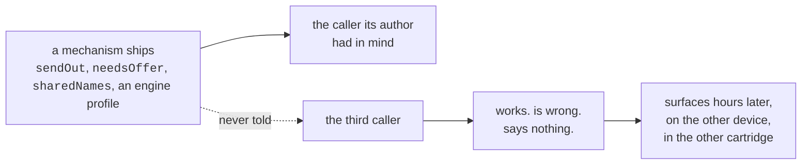

Not one was a wrong line of code. Each was a correct mechanism wired to the
callers its author had in mind and not to the rest — and in every case the
mechanism was *younger* than the code that should have been reading it, which is
exactly why nothing failed.

| # | What was wrong | To see it happen | Found by |
| --- | --- | --- | --- |
| 1 | the engine profile reached `GameState` and none of the decisions made from it | one browser | reading |
| 1 | an unknown cartridge worked and explained none of its four absences | one browser | reading |
| 2 | `?title=` skipped the contract every other path went through | one browser | reading |
| 2 | the shared digest carried Crystal's wild tables, not the cartridge's | two devices | reading |
| 3 | the second press of *Watch* did nothing, and blamed the network | two devices | reading |
| 3 | *Join* failed in silence when the room could not open | two devices | reading |
| 3 | a tap-to-walk took the other device's pad away without saying so | two devices | reading |
| 3 | the digest went out before the title was known | two devices | reading |
| 4 | the battery was written into whichever cartridge record was there | two cartridges | reading |
| 4 | the kept save was installed into a cartridge that never wrote it | two cartridges | reading |
| 5 | the move list was read off the fainted lead, not the replacement | a party of two | reading |
| 5 | a knockout by the replacement was reported as a whiteout | a party of two | reading |
| 6 | fleeing never answered the "Which POKéMON?" prompt | a party of two | reading |
| 6 | nor did catching | a party of two | reading |
| 6 | three jobs described a whiteout as something else | a whiteout | reading |
| 6 | a grind walked for a Centre out of a battle it had not left | a stalled battle | reading |
| 6 | and paced there for ever if the Centre did not restore PP | a hack's Centre | reading |
| 6 | *and the fix for the prompt spun for ever* | a stubborn field | **a test, by hanging** |
| 7 | the two NIDORAN decoded to one name | a route with both | **measuring** |
| 7 | the map objects trusted an origin nothing checked | a hack's objects | measuring |
| 8 | a wrong START row was never closed before the next was tried | a wrong first guess | reading |
| 8 | the worker cached every same-origin GET, the ROM included | `?dev=1` and a worker | reading |
| 8 | and believed a captive portal's 200 | hotel wifi | reading |
| 9 | Stop was ignored for the length of a cutscene | pressing Stop | **checking a claim** |
| 9 | a thrown frame left a button held down for ever | a core that throws | reading |
| 9 | `saves.js` reached past the emulator wrapper | one browser | checking a claim |
| 9 | and a docstring said the app could not save | one browser | checking a claim |
| 10 | an ambiguous HP match gave up on every candidate | two look-alike slots | **mutation testing** |
| 11 | the pack was stepped on a timer, and walked past the balls | playing it | **playing it** |
| 11 | and "the pack never opened" could not fire | playing it | playing it |
| 12 | a `.sym` placing a read outside work RAM loaded, and read `undefined` | a hack that moved one | **feeding it the wrong thing** |
| 12 | a ROM the phone could not read changed nothing and said nothing | an evicted iCloud file | feeding it the wrong thing |
| 12 | `unpack` threw twice on a corrupt payload, once uncatchably | a truncated save | feeding it the wrong thing |
| 12 | a room state that parsed but was not an object killed the subscription | another writer | feeding it the wrong thing |
| 13 | a double tap ran the whole job twice, on one emulator | tapping twice | **two things at once** |
| 13 | every ROM or `.sym` re-pick added a chain that stepped the core for ever | picking twice | two things at once |
| 13 | the marker started a second chain if it was asked mid-read | tapping again inside 1.8s | two things at once |
| 13 | Stop could not be pressed for the whole of a walk | trying to stop one | two things at once |
| 14 | the save flow closed the menu it had just counted, and recovered by timing out | a save | **measuring what never runs** |
| 14 | the menu's stated reason for reading the cursor was not true of the cartridge | a save | measuring what never runs |
| 14 | a second way to load a slot, without the refusal the first one has | nothing — that was the trouble | measuring what never runs |
| 15 | the worker broke the app outright wherever storage was unavailable | a private window | **testing the offline promise** |
| 15 | Join re-enabled a button nothing had disabled, so a double tap joined twice | tapping twice | testing the offline promise |
| 16 | with balls in the bag and no species picked, Hunt and Catch were both unreachable | running the ball errand | **adding a caller** |
| 16 | and the hint asked you to pick from a picker that was not on screen | standing indoors | adding a caller |
| 16 | a destination chip found itself by its label, which is not its identity | a profile naming two maps alike | reading the new code cold |
| 17 | a knockout ended the grind, with twelve unused heals in hand | grinding past the local wilds | **grinding for real, to Lv15** |
| 17 | and the reason given for stopping was a claim the cartridge does not support | the same | grinding for real |
| 17 | the level beside every species had gone unread for sixteen versions | reading the table | grinding for real |
| 18 | the grind swung whatever was first in the list, not what could win | Tackle running dry | **grinding it again, further** |
| 18 | and "out of PP" counted a move that takes no HP off anything | Growl at 3 PP | grinding it again |
| 18 | a level-up replaced a move nobody chose | four moves and a fifth offered | grinding it again |
| 19 | the fix for that fired four times and changed nothing | the same grind, watched | **grinding it a third time** |
| 19 | and an evolution renamed the thing being trained, in silence | grinding past Lv16 | grinding it a third time |
| 20 | three methods nothing has ever called, in twenty versions | asking who calls what | **asking who calls what** |
| 21 | `wildOn` believed a padding slot `wildLevels` skipped, and offered a species called `#0` | a half-filled block, which Crystal has none of | **writing a cartridge Crystal is not** |
| 21 | the harness could not compare two objects, so `t.ne` on a pair could never fail | asking it to | writing a cartridge Crystal is not |
| 21 | a destination chosen on one device was refused at the other's door, twice | two devices and Travel | **a field the deciders never learned** |
| 21 | the grind reported an evolution a battle late, and never when it ended the job | evolving on the last level | a field the deciders never learned |
| 21 | tap-to-walk had a `finally` and no `catch`, so it died in silence | a bad read mid-walk | a field the deciders never learned |
| 21 | and my own new advice named an hour no better than this one | measuring it on Crystal | measuring the fix |

Five things in that table are worth more than the individual rows.

**The last column is a ladder, and it is about situations rather than
hardware.** Everything reachable in the default one — one browser, one
cartridge, one Pokémon — was found first, then everything needing a second
device, a second cartridge, a second Pokémon. What it measures is how much of
the world you have to *arrange*, not how much you have to own: the fifth pass
needed no hardware at all, only a party with a corpse in slot one.

**Two of the sixty-one were caught by a check**, and only after the fix
had decided what to look for: the wiring group named the four modules still
importing constants that had just been deleted. One more was caught by a *test*,
and only because the test hung — the obvious `continue` for the party prompt
advanced nothing in a loop bounded by balls thrown. That is the honest weight to
give this repository's seventeen check groups and 240 tests: they hold a fix
down, and they catch the fix that is itself wrong. They do not find the fault.

**Measuring also rules things out, which is half of what it is for.** The
eighth pass put the world graph and the encounter tables through the same
treatment and found them exactly right: Route 29 really does trade PIDGEY and
SENTRET for HOOTHOOT after dark, entry for entry with the disassembly. One
anomaly looked like a bug for about a minute — Route 29 reporting a *third*
connection, north, where `world.js` says it produces two — and map 5.9 turned
out to be Route 46, which genuinely adjoins it. The module was right and its
note was merely partial. An anomaly is not a fault until it is checked.

**And the last column is the seventh pass's whole lesson.** Reading found
sixteen defects and could not have found the last two, because neither has a
*shape*. `decodeText` handles two letter ranges, the digits, a space and a
ligature and falls through to `?`; read it and it looks finished. `occupied()`
subtracts four and says in its own comment that the four is checked. Faults like
that are invisible to a reader and obvious to twenty lines that put the
cartridge's real data through the real code and print what comes out wrong —
which is how five species names and twelve item names turned up at once, having
survived six passes. It is now the cheapest audit here, because the cartridge is
already sitting in `dev/`.

**The twelfth pass asked a different question: what happens when the input is
wrong?** Every pass before it fed the app what it expects — the real cartridge,
a real save, a well-formed `.sym` — and asked whether the code did the right
thing. This one fed it what it does not expect, at every point where something
crosses in from outside, and asked whether the code *says so*.

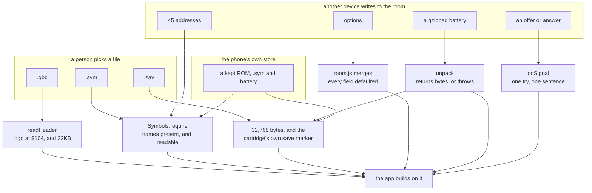

Four of those gates had a hole, and the shape of each is the same: a check that
was *nearly* there. `readHeader` bounds its own reads and the picker around it
did not guard the read that fetches the file. `require` asked whether a name was
present and not whether its address could be read. `unpack` threw, and also
raised a second failure its caller could not catch. `adoptRemote` checked that
the payload was a string and not that it parsed to an object.

The rest held, and the negative results are the point of doing it this way:
every merge in `room.js` was fed null, a number, a string, an array and a bare
`true`, and every one returned the local value intact; `party` and `balls` clamp
to what the engine says exists; `describeHandoff` and its four siblings render
junk as a sentence rather than throwing. Even the gzip bomb is already bounded —
nothing caps what a decompression expands to, but the room's 32,768-character
limit caps the *input*, so the worst reachable unpack is about 23 MB. Accidental,
and worth writing down precisely because nobody designed it.

**The thirteenth pass asked what happens when two things arrive at once.** Every
pass before it followed one thing at a time — one read, one job, one payload —
and this app is full of state machines where the interesting question is what
the *other* thing was doing meanwhile. Four defects, all in the same family, and
all four had a mechanism that was correct and a claim that was late.

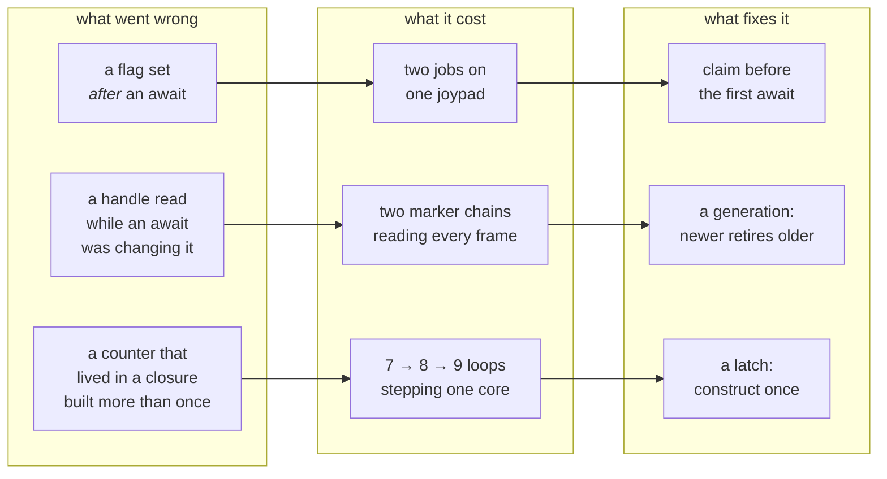

**Three of the four were measured on the running app, before and after**, which
is why this pass is worth more than the reading that preceded it. The double tap
was not argued about: the status line and the run log were watched through a
`MutationObserver`, and every line came out twice — two undo points, two save
sequences. Then once. The accumulating loops were counted by wrapping
`requestAnimationFrame` and recording how many callbacks were outstanding at the
same moment: 7, then 8, then 9, one per re-pick, and afterwards pinned at 1
through three more.

**The fourth is the one reading alone would have found, and had not.** Stop's own
comment says it reaches "the walk flag, which a task never reads" — a sentence
that has been true about the code and false about the interface for as long as
both have existed, because the button is unhidden by `setMode(true)` and a walk
deliberately never calls it. Two correct decisions, in two different functions,
that between them made a flag unreachable. No amount of staring at either one
finds it; the question that finds it is *who can actually press this*.

**The fourteenth pass asked which code has never run at all.** The eleventh
found a guard that *could not fire* — the pack test that asked whether a pocket
index was above 3, when the four read 0 to 3 — and found it by accident, while
looking at something else. Looking for that on purpose means measuring, so this
pass ran the suite under V8 coverage and ranked the modules by how much of each
had never been executed.

The number on its own is close to meaningless: a third of this app cannot be
exercised without a cartridge. What the ranking said was worth knowing.

| | before | after |
| --- | --- | --- |
| `gen2/menus.js` — drives the save | **16%** | 41% |
| `gbcore/saves.js` — writes the battery | **16%** | 17% |
| everything | 40% | 42% |

**The two least-run modules in the repository were the two on the save path**,
where the worst thing that can happen is a game that no longer exists. menus.js
had tests, and they stubbed out every method that touches the machine — the file
asserted on the order the rows were tried in and on nothing else. saves.js is
bound to IndexedDB and cannot be run in this harness at all, which is why its
number barely moved and why saying so is better than a fake one.

Writing tests that drive the real menu code needed a model of the cartridge, and
the first attempt guessed it. Measuring it instead — driving the same core the
app drives, in Elm's lab — corrected two things this repository believed:

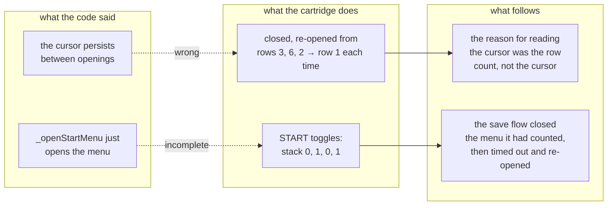

Recovering by timing out is not the same as being right, and the state it passed
through on the way was one where the next DOWN press would have walked the
player rather than a cursor. That is the failure `_menuRowCount` already has a
guard against, reached by a route that guard does not cover.

**And the third finding is one only this method could produce.** `Saves.restore`
read a slot and installed its bytes. Nothing called it — `loadSlot` in `main.js`
had taken the job over — and the difference between them is the refusal the
fourth pass added, which stops a save from a build that did not write it being
installed over the one that did. So the dead copy was the pre-audit version of a
live operation, sitting under an inviting name, unexercised and therefore unable
to drift back into agreement. Nothing that reads code finds that, because
nothing about it looks wrong. What finds it is asking what never runs.

**The fifteenth pass tested the one thing this app promises.** *It runs with no
signal* is the reason `sw.js` exists, and `sw.js` had no tests — 5KB of decisions
that only show themselves on a bad network, two of them fixes the eighth pass had
to find by reading, because nothing would ever have caught them going.

Verified first on the live deploy, which is the only place a service worker would
register: plain-HTTP localhost is refused, HTTPS is not, and the control run
against `minormending.github.io` settled that it was the origin rather than the
app. There the worker is active, and its cache holds **all 37 shell entries, each
a non-empty un-redirected 200, 905KB in total, with nothing from `dev/` or any
game file in it**. The only path the page asks for and does not have cached is
`sw.js` itself, which is correct and load-bearing — a worker that served itself
from its own cache would report the running version as the live one for ever, and
the Update button would never appear.

Then the file itself, in a `vm` context holding fakes for the four globals it
uses, so the code under test is the deployed worker byte for byte. Thirteen
tests, and the two that matter most are the eighth pass's fixes: removing the
redirect guard fails the captive-portal test, removing the shell gate fails the
ROM test, and unscoping the cache lookup fails the stale-cache test.

**And writing them found the one way a service worker can leave an app worse off
than not having one.**

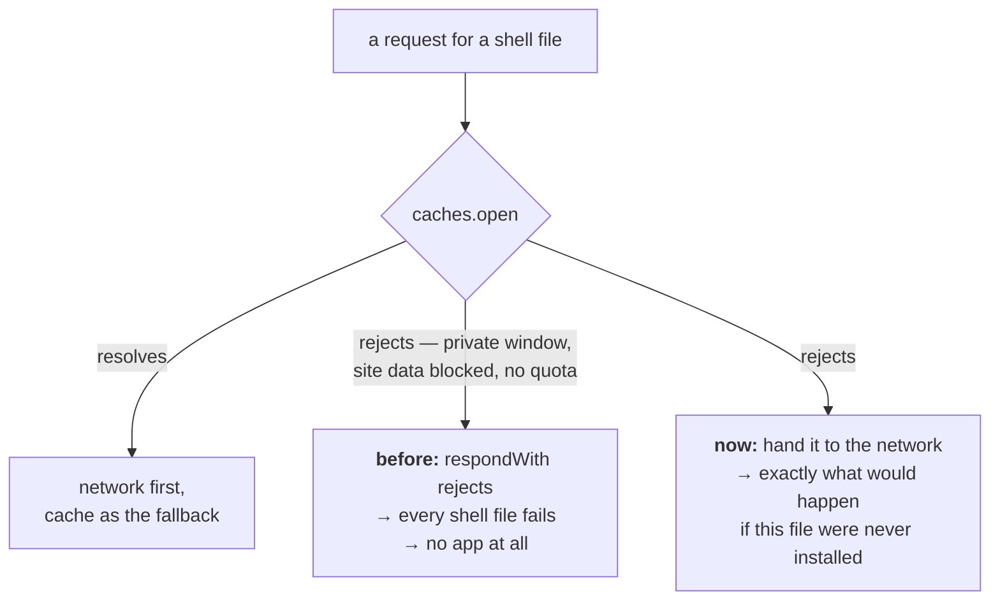

`caches.open` sat outside the error handling. It can reject — a private window,
an origin whose site data the browser has been told to block, a device out of
quota — and then the whole response rejected and every shell file failed to load,
on a device where the app would have worked perfectly with no worker registered.
The fix is to stand aside rather than to try harder, which is the same rule
`room.js` states for itself: *nothing here may be able to break the app.*

The pass's second finding is the thirteenth pass's shape again, one layer out.
`joinWith` re-enabled its button in a `finally` — and nothing had ever disabled
it. That is what made it invisible: the function reads as though the press were
guarded, and `Share` a few lines above genuinely is. Measured with a double tap
on a code that does not exist: two joins ran and the room answered twice. One
now.

**The sixteenth pass found its defects by adding a caller.** Not an audit
method anybody plans, and the most reliable one in this log: the Travel row
needed the offers list to draw a row that was waiting to be chosen for, and the
offers list could not do it.

The pickers under that list — the species chips, the level presets, the
destinations — are drawn only when the row that reads them is *on* the list. So a
row that appears only once a choice has been made can never be chosen for. Travel
hit that on the day it was written, and the same wall had been standing in front
of Hunt and Catch since the list was built:

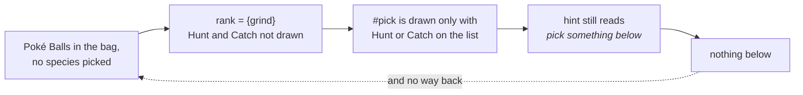

**Measured, and it is the state the ball errand leaves you in.** Catch had a
version of the missing rule already — it keeps its place when the only thing
missing is the balls, because the errand that fetches them lives in that row —
which is exactly why an *empty* bag worked and a full one did not. A row now
earns its place while it waits on a choice that can be made here, and the second
half of the same finding is that the hint used to say *pick something below to
hunt or catch* indoors, where the picker holds "nothing wild appears here".

The third defect is in the new code, found by reading it back cold an hour after
writing it. A destination chip looked itself up by its own label, and a label is
not an identity: a profile is data somebody writes, and two maps sharing a name
is ordinary — two Pokémon Centers, the halves of a long route. Then `find` on the
name returns the *first* place with it, whose key is not the chosen one, so
**neither** chip lights while the selection stays in force. Not reachable on
Crystal, whose ten names are distinct; reachable by anyone writing the eleventh.
The species picker above it gets away with the same trick only because `wildOn`
builds its list through a Map keyed by name.

**And the feature paid for the module it leaned on.** `world.js` had no tests and
was not loaded by the suite at all, which is an awkward place for the module
every journey is planned against — so `routesFrom` could not be written on top of
`route` until there were. It needs no cartridge: a fake ROM answering `romByte`
is a map of any shape, and the fixture writes out the real layout from
`constants/map_data_constants.asm` rather than stubbing it, because the byte
layout is the part that can be wrong. 0% to 98%, and two of those tests pin
behaviour nothing had ever checked: an unused warp slot is padding rather than a
door to map 0.0, and asking only about the map you are standing on reads no ROM
at all.

**The seventeenth pass set out to fix something it could not measure, and that
is the finding.** The target was the gap `jobs.js` admits to in its own
docstring: no evolution or learn-move policy. A Pokémon with four moves that
levels into a fifth is offered *delete an older move?* — a YES/NO box with YES
preselected — inside a loop that presses A up to a hundred and twenty times. On
the face of it, that silently deletes the first move.

Building the fix needs the box's signature in memory, and this repository
measures rather than guesses. Getting there means a Cyndaquil at Lv19, so:
starter taken, out to Route 29, and grind.

**It never got to Lv19, and the road there was full of defects.**

| run | battles | won | levels | ended |
| --- | --- | --- | --- | --- |
| Lv5 → | 50 | 48 | 7 | *the whole party fainted at Lv12* |
| Lv12 → | 25 | 24 | 1 | *the whole party fainted at Lv13* |
| Lv13 → | 35 | 32 | 2 | *the whole party fainted at Lv15* |

Three runs, winning ninety-two per cent of a hundred and ten battles, each
ending with a dead party handed back — and each with **twelve unused trips to
heal in hand**, having been given a way to heal. The job returned on a knockout
rather than recovering, and the comment saying why made a claim about the
cartridge: *the game has moved you to a Pokemon Center, and half your money is
gone*. Measured immediately after: `map [24,3]`, Route 29, one Pokémon at 0 HP.
Not at a Center.

**And the number that explains all three runs was sitting unread in the ROM.**
The encounter table stores `(level, species)` pairs; `wildOn` reaches past the
level byte to get the species and has done since it was written. Route 29 gives
**Lv2–3**. A Lv15 Pokémon aimed at Lv20 there is fighting things worth almost
nothing, which is exactly what the middle run's twenty-four wins for one level
look like — and the app offered `Lv20` as a preset with nothing to say about it.

Two of the three defects are therefore about the same thing from opposite ends:
the job could not tell you the grind was hopeless, and could not survive being
proved right. The third — the learn-move policy the pass went looking for — is
**still not built**, and the honest reason is written into the docstring rather
than out of it: measuring that box needs a Pokémon at Lv19, and Route 29 cannot
deliver one. What the pass did establish is that `windowOpen && menuItems !== 34`
never once occurred across a hundred and ten battles, which is a starting point
for whoever measures it next.

One more thing worth writing down, because it cost a wrong reading first: the
grind starves the timer queue. A `setInterval` sampling the party got **six
samples in forty seconds** while the loop ran, because the loop awaits only
already-resolved promises — exactly the limitation `taskbase.js` documents for
its own watchdog, met from the other side.

**The eighteenth pass finished what the seventeenth could not, by grinding the
same thing further.** The seventeenth set out to build a learn-move policy and
could not reach the state that needs one: Route 29 gives Lv2–3, so a Cyndaquil
crawls to Lv19. The way through was to pick a different starter. Chikorita's
slots fill at Lv12 and its fifth move comes at **Lv15**, four levels sooner.

Getting there took three runs and each one found something, because the road to
a measurement is made of the same code the measurement is about.

| | before | after |
| --- | --- | --- |
| Chikorita, Lv5 → Lv16, Route 29 | 64 battles, 59 won, **stalled at Lv13** | 122 battles, **122 won**, 0 knockouts, Lv16 in 155s |

**All three defects are one confusion: slot order is not a strategy.**

`chooseMove` fell back to `usable[0]`. The catch path has read the move table
since it was written, to find the *gentlest* attack — knocking out what you are
catching wastes the ball — and the winning direction had nothing at all.
Chikorita's slots are Tackle, Growl, Razor Leaf, Reflect. Sixty-four battles in,
Tackle was dry, so slot order handed back **Growl**, which takes no HP off
anything, while Razor Leaf sat in slot three at 25 PP.

And `dry` asked whether *any* move had PP. Growl at 3 PP answered yes, so the
grind never went to heal and kept swinging a move that cannot end a fight — five
battles going nowhere, a party at 3 HP out of 36, and a trip to a Center that
would have restored the lot.

**Then the thing the pass came for.** With four moves and a fifth offered, the
game asks *delete an older move?* — a two-row YES/NO box with YES under the
cursor — inside a loop that presses A up to a hundred and twenty times.
Measured: the Chikorita reached Lv15 and came out of the battle holding
`[POISONPOWDER, GROWL, RAZOR LEAF, REFLECT]` where it went in holding
`[TACKLE, …]`. **Tackle was not chosen away. It was top of the list when a stray
A landed.**

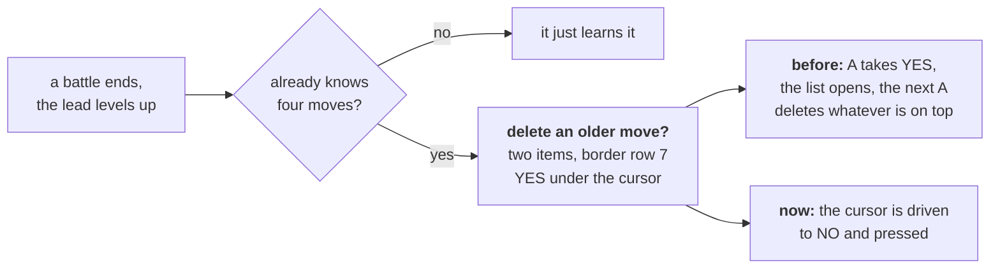

The signature came off the cartridge at the instant the moveset changed, which
is the only place it could honestly come from: **two items at border row 7**. The
battle menu is thirty-four at row 12, the pack five at row 1, and the pack
mid-throw is *also two items* — at row 0. So the row separates them, not the
count.

**And the policy is a decision rather than a default.** Decline, because the
pilot cannot know which of four moves you value, a declined move can be taught by
hand and a deleted one cannot, and `chip` reasons about this very list to pick
the gentlest attack — a set that changes underneath it breaks the one piece of
reasoning this app does about moves.

**What this pass did not manage**, and it is written into the code as well as
here: the guard has never been *seen* firing. The run after adding it took the
same Chikorita over Lv15 with all four moves intact and logged no decline — so
something else preserved them and it is not known what. The likeliest
explanation is timing: the level-up and the end of the battle land within a few
frames, and if `!s.inBattle` is true first the loop returns before the box is
looked at, leaving its fate to whatever presses next. Which is exactly the
accident the guard exists to stop relying on. It stays on a measured signature
and a tested behaviour, and the next person to grind past four moves should watch
the log.

Two notes on the tests, both about this repository catching itself. The first
draft exercised `strongest` alone and **passed with the argument removed from
`fightBattle` entirely** — the same shape as the ReferenceError that once reached
the deployed app, where the tests exercised the static directly rather than any
of its callers. And the `exports` group added two passes ago failed on
`learnMoveBox` having no reader outside its own module, which is how it came to
be tested rather than quietly un-exported.

**The nineteenth pass audited the eighteenth's fix, and the fix was wrong.**
Which is the most useful thing in this log, because it is the one shape none of
the nineteen methods had produced before: not code that was never right, but code
that had *just been made* right and was not.

The eighteenth pass shipped a guard that declines the fifth move, and admitted
it had never been seen firing. So this pass went and watched.

**It fired four times and changed nothing.** Gen 2 asks *two* questions, not one:
*delete an older move to make room?* and then, on a no, *give up on learning it?*
— and the second one wants **YES**. Answering no to both loops, because no to the
second means *carry on learning it* and puts the first back on screen. The log
shows the cursor walking 1, 2, 1, 2, 1 across four declines, and then the moveset
coming out as `[POISONPOWDER, GROWL, RAZOR LEAF, REFLECT]` anyway: once the loop
had gone round enough times, a stray A from the turn presses landed on the delete
prompt.

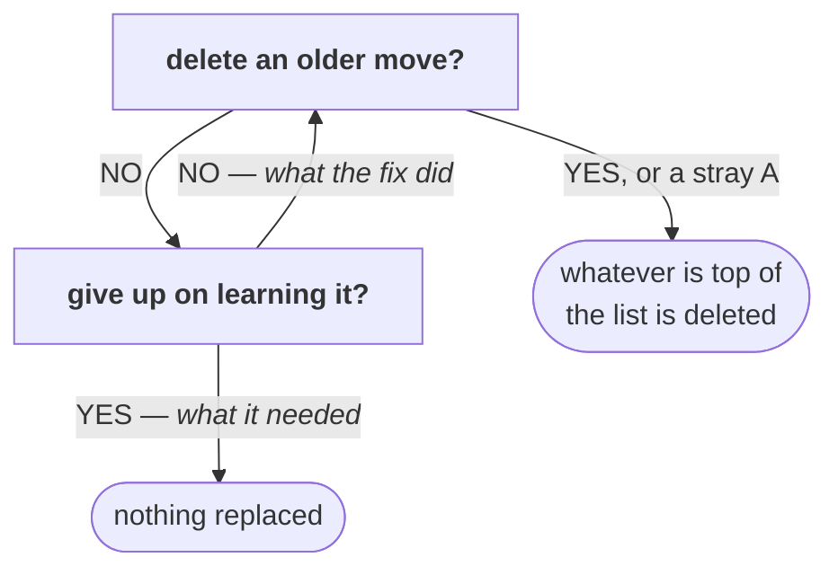

**Firing was not the same as working**, and only a cartridge could have said so.
The answers are asymmetric and the order carries the meaning — and both boxes
have the same signature, because they are one widget asked twice, so the routine
relies on the sequence rather than on looking.

| | before | after |
| --- | --- | --- |
| Chikorita over Lv15 with four moves | `[POISONPOWDER, GROWL, RAZOR LEAF, REFLECT]` | `[TACKLE, GROWL, RAZOR LEAF, REFLECT]` |

**The second finding closes the docstring's list.** `jobs.js` had said for
nineteen versions that the grind has no evolution policy, and the measurement is
what a missing policy looks like: `#152` became `#153` at Lv16 and nothing
mentioned it, while every line after that used the new name. Letting it evolve is
right — it is what somebody grinding expects, and cancelling would be the
surprising choice — but a policy nobody states is indistinguishable from an
accident, so it is stated, and reported: *CHIKORITA evolved into BAYLEEF*.

The end-to-end run, which is the first time this job has been watched all the way
through a level range that changes a Pokémon: **Lv5 to Lv17 in 192 seconds, 159
battles, 158 won, one knockout healed through, one evolution, and all four
original moves still in place.**

**And the same test gap appeared twice running, which is worth more than either
defect.** In the eighteenth pass the mutation removing the fix's argument from
`fightBattle` broke nothing, because the tests exercised the piece rather than
the caller. In this one, swapping `answerYes` back to `answerNo` broke nothing,
for the same reason. Both are now covered, and the second test models the game
rather than the function: two boxes, a cursor that is not live on the first
frame, and a loop back to the first question if the second is answered no.

One loose end, recorded rather than smoothed: in the verifying run the decline's
own log line was not captured, though it was captured in the run before. The
outcome is unambiguous — the moves survived where they previously did not — but
the mechanism's evidence spans two runs rather than one.

**The twentieth pass asked a question the checks cannot ask: who calls this?**
The `exports` group added in the sixteenth pass keeps every *export* honest, and
methods are outside its reach for a reason worth stating — dynamic dispatch is
real in this repository. `nearestHeal` reaches `healAtElm` through
`this[h.reach]()`, and the title scripts are called by name out of a profile
object, so a check strict enough to catch a dead method would report every one
of those as dead too. So it was asked by hand, once, over every method in the
four directories.

Three answers, all of them twenty versions old:

| | what it did | why nothing called it |
| --- | --- | --- |
| `RomData.speciesIndex` | name → id for all 251 species | the app compares species by name throughout |
| `RomData.itemIndex` | name → id for the first 60 items | the ball is found by scanning the pocket |
| `CollisionMap.verify` | re-check the decode against the player's tile | `calibrate` does that, and tries the candidate offsets rather than assuming one |

Deleted on the grounds the exports group already states: an unused entry point is
a second way to do a thing, sitting where the next person finds it by name and
drifting from the way that is actually used because nothing exercises it. The
sweep also nearly took `normalise` with them, which the bag reader still uses —
a reminder that "nothing calls it" and "nothing calls its neighbours" are
different findings.

**And the feature that pass built is two earlier passes meeting.** The
seventeenth read the level beside every species; the sixteenth built the list of
named maps the graph can reach. Neither alone answers the question a slow grind
raises, which is *then where should I go*.

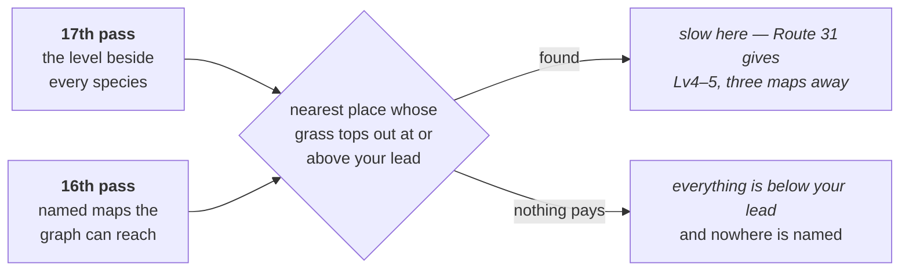

Verified against the cartridge, and the interesting part is *which* place it
named. Standing on Route 29 with a Lv5 lead: Route 30 is **nearer** — two maps
against three — and it was passed over, because its Lv3–4 ceiling is not enough
for a Lv5 Pokémon. Route 31's Lv4–5 is. At Lv8 nothing reachable pays and the
answer is null, which reads as silence rather than as advice to stay.

One measurement came free and was **wrong**, which the pass after it caught: the
same Route 30 was recorded as reading Lv3–4 at one hour and Lv4–5 at another.
It does not. `wildHours` reads all three blocks in one call, and all three of
Route 30's read Lv3–4 — as do all three of Route 29's at Lv2–3 and all three of
Route 31's at Lv4–5. Only the *species* change after dark, which is the reason
`wildOn` takes a time of day and the whole of it. What the earlier note actually
compared was two maps: 26.1 is Route 30 and 26.2 is Route 31, and Lv3–4 against
Lv4–5 is exactly that pair. The table above it is unaffected and was right —
it names the same two maps and the same two ranges — so the claim that failed is
the one derived from a single number read twice, without the second map's name
beside it. Kept here rather than deleted: a measurement is only as good as the
label on it, and this one had the wrong label for one version.

**The two worst were silent data loss**, and both were doors the app opens by
itself. Every door a *person* opens was already locked and had been for
versions: the handoff refuses a room save whose tag differs, `loadSlot` refuses
a slot's, `describeSlot` draws *from a different ROM* where a date would go.
Both pass-four defects are on paths nobody presses — a record written inside
`install`, a battery restored at startup before anyone has touched anything. The
checks went where somebody was visibly making a choice, and not where the app
made the choice for them.

**Passes five and six are both sequels to
[When the lead faints](#when-the-lead-faints)** above, which is the single
richest source of defects in this log. `sendOut` was built there and works. What
it never reached, across two passes, was everything downstream of it: four
places that spell *the Pokémon on the field* as `party[0]`, and two of the three
loops that drive a battle, neither of which answered the prompt at all. Fleeing
spent its 150 presses hunting for a battle menu that was never coming and a hunt
stopped on *could not run from a PIDGEY*, with a healthy Pokémon in slot two.
There is an `onField` and a `coverFaint` now, so there is somewhere to change
each of them next time.

**The sixth pass is a different family from the first five.** Those were
about *identity* — which cartridge, which Pokémon, which device — and every one
was the pilot reading the wrong thing. The sixth went at the loops those reads
sit inside, and nothing there is misread: a prompt nobody answers, a branch
tried in the wrong order, a sentence that names the wrong event, and two loops
that terminate only by assumption. One of those assumptions is *a Pokémon Centre
restores PP*, which is true of Crystal and is not a fact about cartridges in
general — and one of three rungs on the ladder above that no cartridge on this
machine can produce.

**The eighth pass found a third family: a promise in a comment that nothing
kept.** All three of its defects are places where a sentence states the intended
behaviour and no code implements it — *a wrong guess opens the pack, which is
recoverable* (nothing recovered), and *the ROM and .sym are never in this cache*
(with `?dev=1` they were). That is a particular hazard **here**, because this
repository's comments are unusually load-bearing: a file that explains its own
reasoning at length reads as a description of what the code does, and an
aspirational sentence is indistinguishable from a descriptive one. Its last two
are also the first defects in eight passes that no test here can reach — a
service worker wants a browser and a secure context — so what is checked is the
path arithmetic and the behaviour is reasoned about, which the code walkthrough
says rather than implies.

**The eleventh pass played the game, which is the method this document opens by
insisting on, and which no audit had used.** Eighteen changes to the battle and
job paths had shipped without one of them being run against a cartridge. Almost
all of it worked first time — ten battles out of ten, a real trip to Elm's lab
to heal and back, `onField` and `coverFaint` and the whiteout wording all
exercised for the first time on a real game. The catch did not: *could not reach
the ball in the pack*, nine encounters in, five Poké Balls in the bag.

Both defects behind that are in `throwBall`, and neither is visible from
reading. The pack loops waited a fixed twenty frames and re-read, which is not
long enough to be sure — the pocket switch swallows presses while it animates
and `wCurItem` lands a frame after `wCurPocket` — so two presses landing for one
observed change walk past the pocket being aimed at. **The fingerprint is a pair
that cannot both be current**: pocket 2 with item 5, when pocket 2 is the key
items and its first entry reads 255. And the guard for *the pack never opened*
asked whether the pocket index was above 3, which measured cannot happen, since
the four read 0 to 3.

**The tenth pass audited the apparatus rather than the code, and the headline
is that it held.** All fifteen check groups then, seventeen now, fail when the one
thing they claim to watch is broken, and thirteen of fifteen source mutations
are caught by the
suite — both of those are now results rather than assumptions, and the first is
repeatable as [`tools/check-checks`](DEVELOPING.md#are-the-checks-still-checking).
It matters here because four groups *have* gone silent historically and every
one went on printing `ok`.

The two mutations that survived were worth the visit: `onField` demanded a
unique HP match and fell back to the first Pokémon standing when it did not get
one, which returns the *lead* in the one case that arises — and `partyDown`, the
predicate that separates a whiteout from a refused escape, had no test at all
though its code was right.

**The honest caveat is that both new instruments fail towards the false alarm.**
The first draft of `check-checks` reported seven groups blunt, and all seven were
my mutations being wrong rather than the checks being asleep. A tool that reports
on tools is a tool, and its cost is the afternoon spent finding out which of the
two was mistaken.

**The ninth pass made the eighth's finding into a method, and then into a
check.** If a comment says *never*, *always* or *every*, it is a claim, and a
claim can be tested — so the pass was a grep for those words across every module
and then an afternoon of asking. Two claims held: `remember.js` really does put
every storage access through one accessor, and `taskbase.js`'s cancellation
really does reach every loop in *its own* family. Two did not, and the second is
the one worth remembering: `gb.js` opens with *the emulator, wrapped so the rest
of the app never touches WasmBoy directly*, and `saves.js` was calling
`gb.core._getCartridgeInfo()` and `gb.core.loadROM(...)`.

That sentence is now `check-app`'s fifteenth group. **A promise that can become a
check should; the ones that cannot — a service worker's behaviour, a cutscene's
length — should say so out loud instead.** Nine passes in, the remaining defects
are less in the code than in the distance between what it says about itself and
what it does, and that distance is measurable in one place now.

**The seventh found the one that was hurting people now.** The two NIDORAN
decoded to the same string, so the species picker drew two identical chips and
hunting for the one you picked stopped at the other; Route 35 and Route 36 both
carry the pair. Nothing about it needs a hack, a second device or an unusual
situation — only a route with both on it, and a person who wanted a particular
one.

### A twenty-first pass: a cartridge Crystal is not

Every reading in this document until now came off one ROM, and the app is built
for many. So this pass wrote a cartridge by hand — not a mock of the reader, the
**bytes**: map group, map number, three encounter rates, three blocks of seven
`(level, species)` pairs, terminated at `$FF`, exactly as
`data/wild/johto_grass.asm` lays them out. A patch of grass then becomes any
shape you like, *including shapes Crystal has none of*, and that is the whole
value.

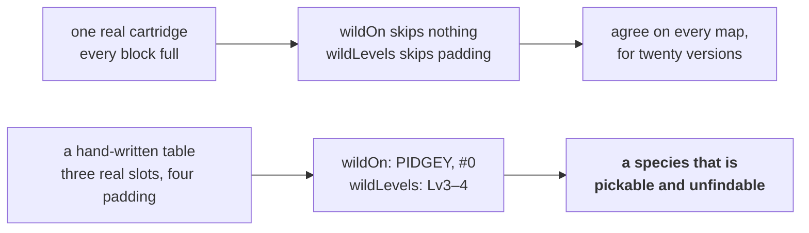

`#0` is what `speciesName(0)` returns, so a block with three real slots and four
padding ones offered a fourth thing to hunt: a chip somebody can tap, a quarry
the grass will never produce, and `huntable > 0` putting Hunt on the offers list
for a map with almost nothing in it. Both readers walk the same bytes and
disagreed about which of them count. They share one `_grassAt` and one `_slots`
now, so the disagreement has nowhere to live.

**The instrument found a second defect in itself.** Writing those tests meant
comparing `{ low, high }` against `{ low, high }`, and the harness could not:
`same` walked arrays deeply and fell back to `a === b`. The report was the tell —
*expected {"low":2,"high":4}, got {"low":2,"high":4}*, the same text twice,
because `show` could already print what `same` could not read. `t.eq` failing on
a correct value is a nuisance; **`t.ne` was the real fault**, because it could
therefore never fail on two plain objects. A test asserting that two ranges
differ passed while proving nothing, and would have gone on passing.

### And it settled a measurement recorded one pass earlier

`wildHours(group, number)` reads all three blocks at once, which the feature
needed and the twentieth pass's own claim did not survive:

| | morning | day | after dark |
| --- | --- | --- | --- |
| Route 29 (24.3) | Lv2–3 | Lv2–3 | Lv2–3 |
| Route 30 (26.1) | Lv3–4 | Lv3–4 | Lv3–4 |
| Route 31 (26.2) | Lv4–5 | Lv4–5 | Lv4–5 |
| species, all three | *swap completely after dark* | | |

The levels do not move with the hour. What the earlier note compared was two
maps: 26.1 is Route 30 and 26.2 is Route 31, and the Lv3–4-against-Lv4–5 it
quoted is exactly that pair. The table it sat under was right and named both
maps; the claim that failed is the one derived from a single number read twice
without the second map's name beside it. **A measurement is only as good as the
label on it.**

Which then caught a third defect, in this pass's own new code. `betterHour`
asked whether another hour paid the lead — and on a cartridge where all three
hours are identical, the answer for an outlevelled lead is yes, so it advised
*come back in the morning* while standing in an indistinguishable afternoon. The
app's only caller had already established that here does not pay, so it was
right by a precondition it never stated. The precondition is stated now, which
is the fix and the reason: the second caller is always the one that finds this
out.

### The other three were a field three deciders never learned

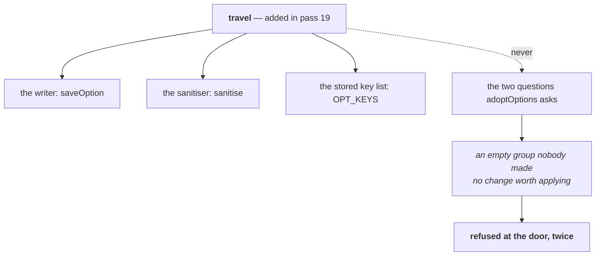

A destination chosen on the tablet was stamped, published, merged by the room
and delivered to the phone — and thrown away there, by two conditions written
over a hand-written list of three fields. Nothing failed and nothing logged; the
chip on the other device simply never lit. The questions are asked over
`CHOICES` now, derived from the stored key list, and they were moved out of
`main.js` into `adoptable` so that a test can reach them, which is the same move
`needsOffer` made three passes earlier and for the same stated reason.

The grind's evolution line had the same shape one layer in. It was added the
pass before and reads the snapshot taken at the *top* of the loop — the party as
it was **before** the battle that did the evolving — so it came out a battle
late, and the level break sits above it. An evolution in the battle that reached
the target was therefore never reported at all, which is the likeliest battle
for one. Three exits now, one check each: the level break, the empty slot, and
the loop's own condition running out. `grind` also has a test file for the first
time, in twenty-one versions, which is an odd gap for the one job people leave
running.

And tap-to-walk had a `finally` and no `catch`. It is one of exactly two things
in this app that drive the emulator for somebody, and the other one — `runTask`
— has said for versions why that is not enough: *a task that dies silently looks
indistinguishable from one still working.* Measured both ways on the same
injected throw: before, the call rejected out of a click handler nobody awaits
and the status line still held what it said before the tap; after, it reads *the
walk stopped: bad WRAM read* and the dot goes red. Which is precisely the shape
the third pass found in `Join`, in the other half of the app.

## The part that had to be redesigned

The desktop pilot hangs its whole design on CPU hooks: the game's own routines
announce when they want input, so `BattleMenu` firing *is* the signal that the
battle menu opened. No browser Game Boy core offers breakpoints.

So the same questions are answered by watching memory instead:

| Question | Hook (desktop) | Polled address (here) |
| --- | --- | --- |
| is the battle menu up? | `BattleMenu` | `wMenuCursorX/Y` become 1..2 while `wBattleMenuCursorPosition` is still 0 |
| is the move menu up? | `MoveSelectionScreen` | `wMenuCursorY` is 1..4 during a battle |
| is a script running? | — | `wScriptMode != 0` |
| is the world live? | — | `wMapStatus == 2` |

What carries over unchanged is the hard-won lesson underneath: **read the live
cursor and step toward the target**. Gen 2 menus wrap, so counting presses from
an assumed starting position silently picks the wrong thing.

## Two traps worth knowing

Both cost real time here, and both fail quietly rather than loudly:

1. `_getWasmMemorySection(start, end)` does not reliably honour its range — it
   was observed returning the core's entire ~10 MB linear memory instead of the
   32 KB asked for. Index that as though it were the slice and every read is
   offset, producing plausible-looking rubbish rather than an error.
2. `_getWasmConstant('WORK_RAM_LOCATION')` returns `undefined` until a ROM is
   loaded. Fetch it during `config()` and every later read is silently empty.

`gbcore/gb.js` guards against both.
