# What is proven, and what is not

[← crystal-pilot mobile](../README.md) · [Using it](USING.md) · [The interface](INTERFACE.md) · [Two devices](DEVICES.md) · [What is proven](PROVEN.md) · [Developing](DEVELOPING.md) · [The code](CODE.md)

The engineering log: what has actually been run and measured, what broke on
the way, and the two traps in the emulator core that cost the most time. Every
bullet here was watched happening rather than reasoned about.

---

## What has been run

**A whole session, end to end, on the real cartridge.** Driven with the app's
own modules against the live emulator, in this order and with nothing between
the steps but the pilot:

```mermaid
flowchart LR
    I["the intro<br/><i>played, named, downstairs, out</i>"] --> S["a starter<br/><i>TOTODILE Lv5</i>"]
    S --> G["out to the grass<br/><i>Route 29</i>"]
    G --> H["a hunt<br/><i>SENTRET, 2 encounters, 1 fled</i>"]
    H --> B["a battle<br/><i>won, 17/21 left</i>"]
    B --> R["a grind to Lv8<br/><i>10 battles, 10 won, 16s</i>"]
    R --> HE["a heal<br/><i>to Elm's lab and back to the grass</i>"]
    HE --> E["the ball errand<br/><i>POKé BALL ×5</i>"]
    E --> C["a catch<br/><i>RATTATA Lv2, 1 ball</i>"]
```

Every step of that is the first time it has been watched on a cartridge since
the battle and job code was rewritten, and one of them failed the first time
round — see [the eleventh pass](#the-audits-and-how-each-defect-was-actually-found).

Proven, and visible in [the screenshot on the front page](../README.md):

- a 2 MB Crystal ROM boots in the browser
- the symbol file parses to exactly the same symbols the Python version reads —
  58,456 of them from the build this was measured against, and the count is a
  property of that build rather than of either implementation: run both parsers
  over a newer `.sym` and they still agree with each other, at a different total
  with `wPartyMon2 - wPartyMon1 == 0x30` as expected
- **game state reads correctly**: `wMapGroup`/`wMapNumber` at `0xDCB5` return
  `24, 7` after the intro, matching the desktop pilot exactly
- synthetic input works — the intro was played through by the app, not by hand
- `wMapStatus == 2` distinguishes "the world is live" from "the party happens to
  be loaded", the same signal the desktop version needed
- ~~save states and battery saves are both available from the core~~ — **half
  of this was wrong, and nothing had ever called it to find out.** The battery
  save is readable, out of cartridge RAM, and is what `Download .sav` hands
  over. Save states can be *taken* — the library populates one once it has been
  started — but not put back: its `loadState` rejects even on its own saved
  states, so a state here is a snapshot you can never return to. That is why
  slots hold battery saves. See [Slots, and undoing a job](USING.md#slots-and-undoing-a-job)
- **a save this app wrote loads elsewhere**: saved in game, downloaded, opened in
  the desktop pilot under PyBoy, which read back the same Route 29 and
  `CYNDAQUIL Lv5 20/20` — then imported back in here, which loaded it
- **the collision map decodes correctly**: the same 48 tiles of PLAYERS_HOUSE_2F
  come out byte-for-byte identical to the desktop pilot's reading of the same
  room — two implementations, one in Python over PyBoy and one in JS over
  WasmBoy, agreeing exactly

- **a new game start to finish**: title screen, Oak's speech, your own choice of
  starter out of Elm's lab, and out to the grass on Route 29 in about a minute
- **a grind**: Lv5 to Lv7 in five battles, seven seconds
- **a hunt**: found a RATTATA after five encounters, running from the four it
  did not want

- **healing**: two places, and it works out which is nearer — Elm's computer in
  his lab, or the nurse in Cherrygrove's Pokémon Center — then comes back to
  where it was working with the party at full HP

### Catching, and the errand that gates it

**Catching is now proven too**, from a fresh ROM with nothing carried in:
starter, grind to Lv8 healing itself at Cherrygrove when it ran low, the egg
errand, five Poké Balls, back to Route 29, and `caught SENTRET Lv3 with 1 POKé
BALL` — party CYNDAQUIL and SENTRET, four balls left.

Getting there meant playing the errand the game actually gates balls behind. The
Mart wants a Pokédex; the only free ball on the ground is on Route 31, and the
road there is shut. Route 30's one-tile corridor north is filled by Youngster
Joey and two Rattata sprites, all three conditional on `EVENT_ROUTE_30_BATTLE` —
which is *clear* on a new game, so the objects are there until it gets set. It is
a deliberate roadblock, and returning the Mystery Egg is what lifts it. Read out
of the disassembly at the time, and **watched happening** twenty passes later,
once the app could read the object structs: all three spawned before the errand,
none after it — and the trainer at (2,28), absent before, spawned after. See
[the twenty-seventh pass](#a-twenty-seventh-pass-two-arrays-where-the-app-believed-there-was-one).

Which makes Route 31 the long way round, because the same errand ends with
`giveitem POKE_BALL, 5` in Elm's lab, from a `coord_event` the player only has to
stand on. Mr. Pokémon's house is at Route 30 (17, 5), on the *east* side — the
half the roadblock does not touch. So `eggErrand` walks there, takes the egg,
heals, walks home through the rival battle in Cherrygrove, hands the egg to Elm
and steps onto the aide's tile.

None of that is navigable without the world graph, and most of it broke the first
time it was tried. What the errand taught, in order:

* **You cannot run from a trainer.** The pilot only knew how to flee, so it stood
  in the rival battle losing HP until something fainted. `wBattleMode` says which
  kind a battle is — 1 wild, 2 trainer — and trainers are fought now. Wild ones
  are still run from, because a walk that stopped to win every encounter would
  spend the party on Pokémon it never wanted.
* **A battle that has ended is not a battle that was won.** Whiting out ends one
  too, and reading that as a win let a grind report five straight victories with
  the party at 0 HP, then wake up in bed wondering why the map had changed.
* **A grind that cannot heal trains something to death.** Where a Pokémon Center
  *is* is map knowledge `tasks.js` deliberately does not carry, so the caller
  passes in a way to heal and the grind uses it instead of stopping.
* **Elm phones the moment you leave Mr. Pokémon's.** A script taking the controls
  reads as "refused", which a crossing treated as terrain and gave up on.
* **A doorway is not always across a room.** `through` walked with a budget sized
  for a lab; Mr. Pokémon's door is fifty tiles up a route, through grass.
* **`wCurItem` is written a frame after `wCurPocket`.** Acting on the stale value
  walked the cursor off the end of a one-item list — and the pack does not wrap,
  so DOWN past the last item sits on CANCEL forever.
* **The pack cannot open while text is still running.** `throwBall` was called
  straight after the encounter and pressed into the "wild SENTRET appeared"
  message, which reported as not being able to find the ball. `flee` had always
  waited for the menu; this had not.

### A second pass: the paths nobody had walked

A second pass, this time deliberately going after the paths that had never been
run rather than the one that had. Ten more, and the pattern in them is that the
happy path hid every one:

* **The grind could not sustain itself.** Pacing for an encounter wanders, and
  after a handful of battles the player is no longer standing in the grass -- so
  the next pace found nothing and the whole thing stopped after five battles
  claiming there was no grass, in the middle of a route covered in it. Worse, it
  wandered far enough to cross into Cherrygrove, where looking for grass is
  hopeless by definition. Grinding to Lv14 now takes 75 battles and recovers
  from wandering off four or five times on the way.
* **Healing stranded the grind it was meant to rescue.** `healUp` walked to
  Cherrygrove and stopped there -- a town, no grass -- so a grind that healed
  resumed in a place it could never find a fight. It walks back now.
* **A move with no PP was chosen forever.** The move menu does not open while a
  message is up, and the cursor reads 0 then; the code skipped move selection in
  that case and fell through to pressing A, which picked the first move -- the
  one with no PP -- producing the same message. Eighty-four "battles" in one
  grind were that single refusal going round. Confirming only when the cursor is
  actually on the intended move breaks it.
* **Out of PP was not a reason to heal**, though a Pokémon Center restores PP
  too, and the alternative is Struggle hurting the thing being trained.
* **A stalled grind spent its whole budget stalling.** Five unresolved battles in
  a row is a stall, not bad luck, and it stops now.
* **Stop did nothing.** The button sets a flag on `tasks`, and `bootstrap.js`
  never read it -- so during a bootstrap or the errand you watched it walk to
  Cherrygrove and back with no way out. Every long loop checks it now, and every
  walk is handed it so it stops between steps rather than at the end of a leg.
* **A stop was then reported as a failure** -- "could not leave Route 29 going
  RIGHT" -- which blames the map for a decision the user made.
* **The errand run twice walked the whole thing again and lied about it.** Forty
  seconds to Mr. Pokémon's and back, then "got POKé BALL x5" -- the same five
  from the first go. Its success test was "are there balls in the bag" rather
  than "did we gain any". The aide hands his over once, so having any at all
  means there is nothing to do.
* **The grind button never passed the healing hook it was given**, so the fix for
  healing existed and was wired to nothing.
* **`travelTo` reported "no way ... by edges"** using raw map numbers, after the
  graph had grown doors.

### A third pass: catching under pressure

A third pass went at catching under pressure -- filling a party rather than
taking one Pokémon -- and found that the single catch which had proved the
feature had been luck. Five balls could go in for nothing:

* **`menuIsLive` insisted on `wBattleMenuCursorPosition === 0`.** That register
  holds the action last chosen, not whether the menu is waiting: it is 0 until
  the first choice of a battle and keeps the choice afterwards. So the test
  matched only the opening turn of a battle and was false for every turn after.
  `awaitBattleMenu` therefore spent 150 presses and returned null, `flee` could
  not tell a refusal from an escape, and `watchThrow` could not see a Pokémon
  break free -- which is where the five balls went. Measured at a menu that was
  plainly live and taking input, it read 3. The 150-press ceiling in
  `awaitBattleMenu` had been raised from 40 to paper over this.
* **Then the fix over-corrected.** The cursor alone does not identify the battle
  menu, because the pack parks it at (1, 1) too -- so a ball in mid-air read as
  a fresh menu and the throw was abandoned while the game was still saying "used
  the POKé BALL". Which menu is *drawn* settles it: measured, the battle menu is
  34 items with its box at row 12, the pack is 5 items at row 1, and the pack
  mid-throw is 2 at row 0.
* **`wBalls` does not decrement until the battle ends.** A Pokémon can already
  be caught and the bag still read five. So `stats.spent`, computed from a
  mid-battle read, reported nonsense -- and an interim attempt to detect throws
  that never happened, by comparing ball counts, was built on the same false
  premise and had to come back out. Throws are counted as throws now, and every
  round's count matches the bag delta exactly.
* **Running out of balls mid-catch blamed the pack**, reporting it could not find
  a ball rather than saying it had used them all.

That left one thing that was the game being the game rather than a defect: a
full-health target genuinely resists a Poké Ball, and the pilot threw at
everything untouched. Three attempts, five balls, nothing caught. So it weakens
things now, which is the game's own tactic:

* `romdata` reads the **Moves** table out of the cartridge -- seven bytes an
  entry, effect at offset one and power at offset two -- because the point is to
  pick the *gentlest* attack. Leading with whatever is in slot one knocks out
  the thing being caught.
* Status moves are excluded by having no power at all, which is one half of the
  distinction: LEER would otherwise rank as the gentlest attack available and
  weaken nothing, forever.
* **Eleven moves lie about their power**, which is the other half. Gen 2
  computes their damage rather than scaling it, so it stores them at 0 or 1 --
  putting GUILLOTINE, HORN DRILL and FISSURE *ahead* of TACKLE when ranking
  ascending. Ask for the weakest damaging move and you get a one-hit KO. They
  are excluded by effect id, read out of the cartridge's own move table. This is
  not the same as "fixed damage": DRAGON RAGE really does store 40 and take 40,
  so it ranks correctly and stays in.
* **The pilot learns how hard it hits, and remembers it for the rest of the
  hunt.** A threshold on its own is not a safe place to stop -- against a Lv2
  RATTATA one swing carries it from above the line to zero, and a fainted
  Pokémon cannot be caught by anything. Measured: that is exactly what happened
  on the first version. So a knockout is itself a measurement, and every target
  afterwards whose HP is already inside that range gets thrown at rather than
  hit. Kept outside the per-encounter scope on purpose, because the one swing
  that cannot be guarded is the first one.
* Weakening spends no ball, so it is bounded -- otherwise a move that kept
  missing would loop for good with the ball budget never moving.

Result, from a fresh ROM in one run: **three caught, one ball each, no
knockouts**, then a grind of 46 battles won out of 46 with the party intact. An
earlier run caught four out of four for five balls. The same species before the
feature took five balls and caught nothing at all.

Two things had to be corrected on the way, both because a measurement disagreed
with what had been written down:

* Gen 2 does *not* mark fixed-damage moves with a power of 1, the way the first
  version of this assumed -- DRAGON_RAGE reads 40 and takes 40, so ranking by
  power sorts them about right anyway and no special case is needed.
* A chip that ends badly can leave the move menu open, and `menuIsLive` cannot
  tell that from the battle menu because they share the same box. The pack was
  then opened from inside the move list and the throw could not find a ball, so
  weakening now backs out before it throws.

### When the lead faints

Weakening also made a party bigger than one easy to have for the first time, and
that immediately turned up something that had been waiting all along: **the
pilot did not know what to do when the Pokémon on the field faints.** Gen 2 does
not offer a choice about it -- the lead goes down, the game asks "Which
POKéMON?" and waits -- and with a party of one it never came up, because the
battle simply ended. The first time a bigger party lost its lead, the pilot sat
in front of that prompt reporting a stuck battle for as long as it was allowed
to. Three separate things had to be right:

* **"No HP" and "no Pokémon on the field yet" read identically.** At "Wild
  PIDGEY appeared!" the battle mon is not loaded and both hp and maxHp are zero,
  so keying off hp alone fired at the start of every battle -- five stuck
  battles in four tenths of a second, having sent nothing out. It takes maxHp as
  well now.
* **That screen's cursor is not in memory anywhere I could find.** wMenuCursorY
  stays pinned at 1 on it, wPartyMenuCursor and wCurPartyMon never move, and
  diffing all 8 KB of work RAM across a press turns up 87 changed bytes with no
  index among them -- the arrow is drawn from sprite data. So it does not read
  the cursor: it steps down to the slot it wants, confirms, and checks whether
  something is actually on the field. Which is the better test regardless,
  because choosing a fainted Pokémon is *refused* with "There's no will to
  battle!" and no cursor reading would have predicted that.
* **The screen ignores the presses the battle menu takes.** At five frames every
  direction was swallowed, so every confirm landed on the fainted lead and the
  pilot was told no, repeatedly. It wants about twelve, *and* a pause between
  presses -- the prompt arrives with "CYNDAQUIL fainted!" still running and a
  direction sent into that is dropped. Pressed by hand with a gap between each
  one it worked first time, which is what pointed at the timing rather than the
  buttons.

### A fourth pass: the page itself

A fourth pass left the game logic alone and went at the page itself, which had
never been tested at all. The two worst things found all session were here:

* **Backgrounding the app killed the emulator for good.** The idle loop re-armed
  itself only from inside its own animation-frame callback, and a frame already
  pending when a page is hidden never arrives -- so the chain was simply lost.
  The loop died on the first background and the game stayed frozen ever after,
  including back in the foreground, where the only way out was a reload. It
  looks exactly like a crash and is not one: tasks kept working, because they
  step the emulator themselves. Measured: zero animation frames scheduled in
  three seconds by a page whose loop was supposedly running. It re-arms on every
  visibility change now, with a generation counter so ten transitions in a row
  leave one chain rather than ten -- checked, because two chains stepping the
  same core would be a worse bug than the one being fixed.
* **Any error in a task bricked the interface.** Each handler set a `running`
  flag, disabled its button and cleared both at the end -- which only happened
  if nothing threw. One exception and the button stayed disabled for good, the
  status sat frozen on "grinding to Lv13" with no error shown anywhere, and
  `running` stuck true so nothing else would start either. Indistinguishable, to
  the person holding the phone, from a task still working. The five handlers now
  share one `runTask` that owns the lifecycle in a `finally` and puts the error
  in the status bar; verified by making a task throw and watching the app carry
  on.
* **Tasks would run with no game started**, reporting "no way from map 0.0 to
  Route 30" -- honest, but not much help. They ask for a live world first.
* **The hunt button contradicted the screen.** Its label was only put back when
  something *had* been chosen and then stopped being available. Going indoors
  clears the choice and leaves the label reading "Nothing to hunt here"; coming
  back out to a route re-drew the four species but never took that back, so the
  button sat disabled directly under a list of things to hunt. Both the label
  and the enabled state are derived from what is chosen now, which is also what
  keeps `runTask` from lighting the button up after a grind with nothing picked.
* A step that never returns can no longer wedge the loop on its own either.

Verified working while looking, and worth saying so because each was a candidate:
the level stepper clamped to 2–100 (the stepper has since been replaced by
presets, for reasons in [The interface](INTERFACE.md)); keyboard input reaches the emulator
including two keys at once; the species list tracks the map and the in-game
clock; and a bag holding Ultra, Great and Poké Balls picks the Poké Ball — the
cheapest that will do, so a better ball is not spent on a Rattata by accident.

Two things went the other way and are worth recording as *not* bugs, because
both looked like one: the Catch button re-enables itself through `refreshBag`,
and the idle loop advancing nothing while the page is hidden is deliberate --
the animation-frame stand-in is clamped by the browser to about one tick a
second, which is there so the core's own waits finish, not to run a game.

* **Calibration can be confidently wrong, and that made crossings flaky.** The
  decode is checked against one tile — the one the player stands on — and one
  tile is not enough to pin an offset down. Step out of a door and the player is
  still *on* the warp mid-transition: the real offset does not match there, and
  one of the fallbacks can match by luck. `crossEdge` picks its candidate exits
  once, and taken during those few frames the edge it measured belonged to
  whatever map was still loaded, so every later attempt walked at tiles that had
  never been openings — failing without being wrong about anything it could see.
  The snapshot has to hold still now: same offset, same player tile, twice in a
  row. The candidates are also worked out after the approach rather than before
  it. Two failing crossings were caught in a log — both starting on a doorway,
  at Mr. Pokémon's and at the Pokémon Center — and both cross first time now,
  across two runs with no retries at all.
* **`findGrass` reported success from wherever it had been stopped.** Walking to
  grass walks *through* grass, so something jumps out on the way; it ran out of
  candidates and returned true standing three tiles clear of any. It checks the
  tile underfoot now.

## The audits, and how each defect was actually found

Everything above was watched happening. This section was the exception, and the
exception was the point of it: after the ROM-hack work shipped, **forty-seven**
passes went looking for defects in code that already worked, and found **224** —
a handful of them created by a fix on the way, which are in the table in italics
because they are a different kind of thing. None of them announced itself.

**Reading found twenty-three**, more than any other single method, which is why
it comes first in the table and why it is worth doing before touching the game.
But the interesting number is the tail: the remaining two hundred and one were
found almost as many different ways, and almost every entry in that column is a sentence rather than
a category — *measuring the fix*, *asking a second tile*, *feeding it the wrong
thing*, *writing a cartridge Crystal is not*, *a test, before the cartridge*,
*playing the game*. Each change of method found what the one before it was
structurally bad at, which is the thread worth pulling below.

Which is also the honest summary of this document: **no one method is the
method.** Reading catches what a comment claims and the code does not. Tests
catch the case nobody would play. Only playing catches a rule of the game — the
[thirty-third pass](#a-thirty-third-pass-the-diagnosis-that-was-wrong-twice) is
that lesson at its bluntest, where two plausible causes were fixed before the
screen was read and the screen had the answer on it in words the whole time.

The recurring shape is the same in all of them:

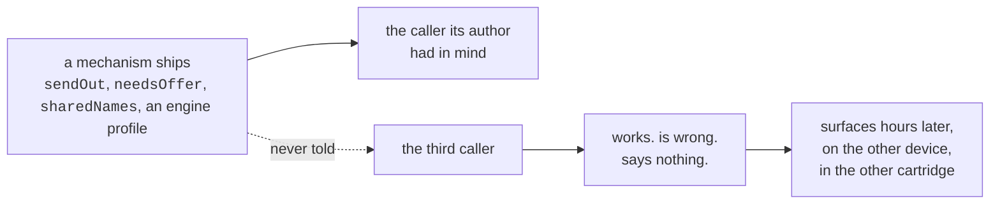

Not one was a wrong line of code. Each was a correct mechanism wired to the
callers its author had in mind and not to the rest — and in every case the
mechanism was *younger* than the code that should have been reading it, which is
exactly why nothing failed.

| # | What was wrong | To see it happen | Found by |
| --- | --- | --- | --- |
| 1 | the engine profile reached `GameState` and none of the decisions made from it | one browser | reading |
| 1 | an unknown cartridge worked and explained none of its four absences | one browser | reading |
| 2 | `?title=` skipped the contract every other path went through | one browser | reading |
| 2 | the shared digest carried Crystal's wild tables, not the cartridge's | two devices | reading |
| 3 | the second press of *Watch* did nothing, and blamed the network | two devices | reading |
| 3 | *Join* failed in silence when the room could not open | two devices | reading |
| 3 | a tap-to-walk took the other device's pad away without saying so | two devices | reading |
| 3 | the digest went out before the title was known | two devices | reading |
| 4 | the battery was written into whichever cartridge record was there | two cartridges | reading |
| 4 | the kept save was installed into a cartridge that never wrote it | two cartridges | reading |
| 5 | the move list was read off the fainted lead, not the replacement | a party of two | reading |
| 5 | a knockout by the replacement was reported as a whiteout | a party of two | reading |
| 6 | fleeing never answered the "Which POKéMON?" prompt | a party of two | reading |
| 6 | nor did catching | a party of two | reading |
| 6 | three jobs described a whiteout as something else | a whiteout | reading |
| 6 | a grind walked for a Centre out of a battle it had not left | a stalled battle | reading |
| 6 | and paced there for ever if the Centre did not restore PP | a hack's Centre | reading |
| 6 | *and the fix for the prompt spun for ever* | a stubborn field | **a test, by hanging** |
| 7 | the two NIDORAN decoded to one name | a route with both | **measuring** |
| 7 | the map objects trusted an origin nothing checked | a hack's objects | measuring |
| 8 | a wrong START row was never closed before the next was tried | a wrong first guess | reading |
| 8 | the worker cached every same-origin GET, the ROM included | `?dev=1` and a worker | reading |
| 8 | and believed a captive portal's 200 | hotel wifi | reading |
| 9 | Stop was ignored for the length of a cutscene | pressing Stop | **checking a claim** |
| 9 | a thrown frame left a button held down for ever | a core that throws | reading |
| 9 | `saves.js` reached past the emulator wrapper | one browser | checking a claim |
| 9 | and a docstring said the app could not save | one browser | checking a claim |
| 10 | an ambiguous HP match gave up on every candidate | two look-alike slots | **mutation testing** |
| 11 | the pack was stepped on a timer, and walked past the balls | playing it | **playing it** |
| 11 | and "the pack never opened" could not fire | playing it | playing it |
| 12 | a `.sym` placing a read outside work RAM loaded, and read `undefined` | a hack that moved one | **feeding it the wrong thing** |
| 12 | a ROM the phone could not read changed nothing and said nothing | an evicted iCloud file | feeding it the wrong thing |
| 12 | `unpack` threw twice on a corrupt payload, once uncatchably | a truncated save | feeding it the wrong thing |
| 12 | a room state that parsed but was not an object killed the subscription | another writer | feeding it the wrong thing |
| 13 | a double tap ran the whole job twice, on one emulator | tapping twice | **two things at once** |
| 13 | every ROM or `.sym` re-pick added a chain that stepped the core for ever | picking twice | two things at once |
| 13 | the marker started a second chain if it was asked mid-read | tapping again inside 1.8s | two things at once |
| 13 | Stop could not be pressed for the whole of a walk | trying to stop one | two things at once |
| 14 | the save flow closed the menu it had just counted, and recovered by timing out | a save | **measuring what never runs** |
| 14 | the menu's stated reason for reading the cursor was not true of the cartridge | a save | measuring what never runs |
| 14 | a second way to load a slot, without the refusal the first one has | nothing — that was the trouble | measuring what never runs |
| 15 | the worker broke the app outright wherever storage was unavailable | a private window | **testing the offline promise** |
| 15 | Join re-enabled a button nothing had disabled, so a double tap joined twice | tapping twice | testing the offline promise |
| 16 | with balls in the bag and no species picked, Hunt and Catch were both unreachable | running the ball errand | **adding a caller** |
| 16 | and the hint asked you to pick from a picker that was not on screen | standing indoors | adding a caller |
| 16 | a destination chip found itself by its label, which is not its identity | a profile naming two maps alike | reading the new code cold |
| 17 | a knockout ended the grind, with twelve unused heals in hand | grinding past the local wilds | **grinding for real, to Lv15** |
| 17 | and the reason given for stopping was a claim the cartridge does not support | the same | grinding for real |
| 17 | the level beside every species had gone unread for sixteen versions | reading the table | grinding for real |
| 18 | the grind swung whatever was first in the list, not what could win | Tackle running dry | **grinding it again, further** |
| 18 | and "out of PP" counted a move that takes no HP off anything | Growl at 3 PP | grinding it again |
| 18 | a level-up replaced a move nobody chose | four moves and a fifth offered | grinding it again |
| 19 | the fix for that fired four times and changed nothing | the same grind, watched | **grinding it a third time** |
| 19 | and an evolution renamed the thing being trained, in silence | grinding past Lv16 | grinding it a third time |
| 20 | three methods nothing has ever called, in twenty versions | asking who calls what | **asking who calls what** |
| 21 | `wildOn` believed a padding slot `wildLevels` skipped, and offered a species called `#0` | a half-filled block, which Crystal has none of | **writing a cartridge Crystal is not** |
| 21 | the harness could not compare two objects, so `t.ne` on a pair could never fail | asking it to | writing a cartridge Crystal is not |
| 21 | a destination chosen on one device was refused at the other's door, twice | two devices and Travel | **a field the deciders never learned** |
| 21 | the grind reported an evolution a battle late, and never when it ended the job | evolving on the last level | a field the deciders never learned |
| 21 | tap-to-walk had a `finally` and no `catch`, so it died in silence | a bad read mid-walk | a field the deciders never learned |
| 21 | and my own new advice named an hour no better than this one | measuring it on Crystal | measuring the fix |
| 22 | `pickUp` stood below and pressed UP, which is a rule about one tile | a ball with a wall under it | **asking a second tile the same question** |
| 22 | and its "did it work?" read the balls, so a berry was a failure | a fruit tree | asking a second tile |
| 22 | and a dead `continue` let a battle-stopped walk press A where it stood | reading it | asking a second tile |
| 22 | the approach used `walkTo`'s eighty steps while every other leg passes 260 | a thing across a route | asking a second tile |
| 22 | listing the slots dropped five rejections nobody could catch | a read that fails | **a fake IndexedDB** |
| 22 | and my own new advice painted an ordinary outcome red | pressing Take twice | measuring the fix |
| 23 | `closeMenus` pressed B four times blind, so a grind paced a menu cursor | driving the pack three boxes deep | **driving a menu at all** |
| 23 | `settleText` after a heal taps A into the still-open pack | two potions in the bag | driving a menu at all |
| 23 | the ITEM pocket lags a use, so the bag is not the evidence | a berry that healed and stayed listed | **watching both halves** |
| 23 | and the loop re-read that pocket, so it never reached the second item | one berry and two potions | watching both halves |
| 23 | my own patch landed in the wrong method, and 284 tests passed | pressing the button once | measuring the fix |
| 24 | the grind was handed the *walk*, so the bag never reached the job that heals twelve times | pressing Go | **following a feature to its second caller** |
| 24 | a swallowed PACK press read as "the pack never opened", three times, and cost a knockout | grinding with potions | **grinding with the new thing on** |
| 24 | `closeMenus` cannot succeed in a battle, so it always exhausts its budget | any battle path that fails | following a feature |
| 24 | and routing every grind heal through the bag broke the loop's only exit | grinding to Lv14 | measuring the fix |
| 24 | `heals` collided with a counter that had never counted heals | naming a new option | reading the collision |
| 25 | `mon.status` was in the engine profile and read by nothing, for ten passes | asking what the profile declares | **reading the profile back** |
| 25 | so a party at full HP that was poisoned read as "at full health" | a status the app could not see | reading the profile back |
| 25 | and the grind never healed for one, so poison ticked until it looked like damage | walking with poison | reading the profile back |
| 25 | the cure ran *after* the HP check, so a well-but-poisoned party returned early | the one party it exists for | **a test written before the code** |
| 25 | and `useItemOn` judged success by HP, which no cure moves | an antidote | measuring the fix |
| 26 | `wMoney` unread, while the app asserted a knockout costs half of it | asking what a claim needs | **reading the profile back, again** |
| 26 | a box being redrawn has the wrong shape, so one look reported "bought nothing" | driving a fifth menu | **driving a menu it had never opened** |
| 26 | a purchase is two text boxes, so pressing once bought one of four | the same, once more | driving a menu it had never opened |
| 26 | and pressing while waiting presses *into* the box being waited for | a fake that models the redraw | **the test, before the cartridge** |
| 27 | `occupied` read the map's *placements*, so it marked an empty tile and left an occupied one open | a wanderer, on any route | **asking what the game itself reads** |
| 27 | and blocked two tiles for objects the game had never spawned | a flag-hidden object | asking what the game itself reads |
| 27 | `lost` was returned with the battle still on screen, so one loss was reported seven times | losing a trainer battle | **losing one** |
| 27 | a beaten trainer took all six attempts, so the unbeaten one behind them was never approached | two trainers in range | **beating one, then asking again** |
| 27 | and my own new hint lived in a row that is hidden whenever it applies | reading the wiring | reading the fix |
| 28 | every starter this app ever took was named AAAAAAAAAA, for twenty-eight passes | reading the party screen | **reading the screen** |
| 28 | `catch_` counted nothing, while `hunt` beside it counted everything | asking for a species by mistake | asking for the wrong thing |
| 28 | `_menuRowCount` read a swallowed press as a one-row menu, in the primitive two features stand on | one dropped press | reading the primitive |
| 28 | *and five fixes for the starter's name, none of which shipped* | *twelve runs* | *measuring each fix* |
| 29 | six more box failures that could have quoted the screen and did not | asking who else should read a one-pass-old mechanism | **asking who calls what** |
| 29 | the bar's screen reader could overlap its own reads and miscount a dwell | reading it back | reading it back |
| 29 | *and the starter's name, fixed by a button nobody had asked about* | *being told* | **being told** |
| 30 | the shop walked away from the counter with its confirmation open, and every later job pressed A into it — ¥3000 to ¥100 | buying anything, then doing anything | **buying something** |
| 30 | and every walk then blamed a door for a window, eight tries at a time | the same | buying something |
| 30 | `restock` read only the ITEM pocket, so `want` meant *buy this many* for a ball | asking it for balls | asking it for balls |
| 30 | `watchThrow` could not see a catch that went to the box, so the app refused to try | a party of six | **filling the party** |
| 30 | and the nickname question after a boxed catch was never answered | the same | filling the party |
| 31 | `heal()` had one town baked into it, so a second Center was a second copy | naming a second Center | **naming a city** |
| 31 | a route was shortest by legs and gave up on a leg the walk could not take | naming a city the short way runs through Route 46 | naming a city |
| 31 | `restock` used `marts[0]`, so it walked back to Cherrygrove past a nearer Mart | standing in the new city | naming a city |
| 32 | the place you are standing in was offered as somewhere to walk to | a gate that shares its town's landmark | **a test, before the cartridge** |
| 32 | a map the title had named was offered again under its landmark | Elm's lab, in New Bark Town | a test, before the cartridge |
| 32 | a refused leg spent the walk budget, so a two-leg walk ran out of twelve | walking to a place only the cartridge names | walking there |
| 32 | *and arriving on the last leg of the budget reported too many legs* | *a walk given exactly the legs it needed* | *a test, before the cartridge* |
| 33 | a wild encounter spent one of the eight tries a doorway gets | a door at the far end of a route full of grass | reading, on the way past |
| 33 | a walk turned back by a person blamed the door, eight times over | Heal, standing on Route 32 with no badge | playing the game |
| 33 | the screen read "What  the hurry?" — a contraction is one tile, two characters | any quoted screen text with an apostrophe in it | the message it had just printed |
| 34 | the write-off was keyed on a leg nothing ever writes, so the feature did nothing | Heal, standing on Route 32 with no badge | the cartridge, after a test agreed with the bug |
| 34 | *and then the same mistake one field along, because the two place lists name their maps opposite ways* | *Shop, in the same spot* | *reading the profile after the first fix* |
| 34 | the row explaining a shut road is hidden exactly when it applies | any shut road, in the offers list | recognising a defect from eight passes ago |
| 34 | the edge half read the screen after `runScripts` had pressed the words away | Travel, at a gated route edge | asking what order the reads happen in |
| 34 | a gate at an edge was ground at for over two and a half minutes and looked hung | Travel to ROUTE 33 from Route 32, no badge | playing the game, and waiting |
| 34 | a predicate that deleted the entry it was asked about, while a caller iterated it | nothing yet — read, not seen | reading |
| 35 | `collision.js` ran on nearly every test in its file and was checked by almost none | any wall, water tile, ledge or warp — the fake said LAND to all of them | **a tool that breaks lines on purpose** |
| 35 | all four of `furthestToward`'s direction comparators could be inverted | a route too long to cross in one plan | the same tool |
| 35 | a heal that was really a knockout reported *healed one Pokémon at Violet City* | Heal, with a lead too hurt to make the walk | a wallet that had halved |
| 35 | arriving after a whiteout reported plain *arrived* | Travel, on a route with a trainer on it | the same wallet |
| 35 | a beaten trainer was walked back to, because only refusals were written down | Clear, on a map with more than one trainer | the feature's own first test |
| 35 | a sweep gave up at a trainer it had already beaten, with two more further along | Clear, from Route 30's north end | playing the game |
| 35 | the sweep did nothing at all on a route, because nobody was drawn yet | Clear, arriving at Route 31's western edge | playing the game |
| 35 | the sweep's bound was measured off who was *drawn* while its comment claimed the map | the same edge, where that number is nought | reading the comment against the code |
| 35 | four documentation anchors pointed at headings that no longer existed | any of the six links | **a check written for it** |
| 36 | a map number past the end of its group read as a map, and returned another map's objects | asking the ROM about map 55 of a group that has ten | a sweep that wanted the Gyms |
| 36 | the object count's sanity bound truncated and returned instead of giving up | the same sweep, in the one group nothing can bound | reading the numbers it gave back |
| 36 | a Gym was walked into at 1 of 22 because the heal's answer was discarded | Gym, with the road to a Center shut | playing the game |
| 36 | and with an empty bag, because nothing stocked it | Gym, at Lv13 and full HP | playing the game |
| 36 | `clearHere` could never beat a gym leader — a leader is a *script* object, not a trainer | Gym, at any level | reading the object types in work RAM |
| 36 | the badge was read before the speech that hands it over | Gym, immediately after winning | the badge saying no about a Gym that was beaten |
| 36 | beating one of a map's three trainers reported as a finished job | Clear, inside a Gym | reading the sentence against the map |
| 36 | *and a title claimed Falkner's badge opens Route 32, which it does not* | *Route 32, badge in hand* | *the thing it predicted not happening* |
| 36 | a documented claim said the ROM has no map count, so walking every map is impossible | — | deriving one anyway |
| 37 | every walk asked about the same unplayable battle, once per step | grinding on Route 31 with no PP left | playing the game |
| 37 | having PP was read as being able to win, so forty turns went on a Caterpie | the same battle | reading what the moves do |
| 37 | *a first guess at that blamed A-in-a-submenu — a real hazard, and not this one* | *any submenu during a battle* | *fixing it and finding nothing changed* |
| 37 | a battle nothing can play was reported as a door problem | Travel, from that battle | reading the sentence |
| 37 | `backToGrass` walked to the first grass written down, not the nearest | a grind starting on Route 32 | ninety-nine seconds and no battles |
| 37 | `menuIsLive`'s four bounds could all be moved with the suite passing | the battle menu, at any cursor | **the mutation tool** |
| 37 | the ring fake never called `escapeBattle`, though every real crossing does | — | a test that could not fail |
| 38 | the contrast check watched the surface a key sits *on*, not the key | the pad, in either theme | extending the check |
| 38 | in the dark theme `--key` and `--raise` were the same colour, so it compared a token with itself | the pad at night | the same |
| 38 | the light palette was written out twice and had already drifted | the theme most people get | a screenshot that would not change |
| 38 | *and the check then read no hex from a block of `var()`, reporting "both themes" while reading one twice* | *—* | *fixing the duplication* |
| 38 | the offers ranking was invisible whenever the lead row's action was disabled | Catch leading with "pick something below" | reading the DOM |
| 38 | a new disabled-button rule made the pad's keys read as missing | any key with no game loaded | a screenshot |
| 39 | the word-count instrument called a closed `<details>` visible, so a hundred-word cut measured as thirteen | any collapsed block | re-measuring against the pre-pass build |
| 40 | two disclosure markers on every `details` in the app — ours beside the text, Pico's floated three hundred pixels away | *About slots*, in either theme | reading the computed styles |
| 40 | `.slots{display:block}` had never once applied: `.param{display:flex}` wins on source order | the save card's slot label, beside the *middle* row of three | a screenshot |
| 40 | the Gym row's three facts lost the third to the ellipsis, and it was the one nothing else carries | a Gym one map away, on a 375px phone | **a new instrument** — `DEV.clipped()` |
| 40 | *a rewritten Export state was four words too long and arrived clipped* | *the Export row, same phone* | *the same instrument, minutes later* |
| 40 | the room code box was an unlabelled field whose placeholder is code-shaped, so the row read as already filled in | Settings, not sharing | reading the sheet |
| 40 | the Files row was a negative fact with a hidden button beside it, in the one place opened to change something | Settings, nothing kept | the same |
| 40 | the Screen row was in the markup unhidden, so a first frame offered to show a screen into a room that did not exist | the first frame, before `paintScreen` | reading the markup |
| 40 | `DEV.keep` wrote its note to `{note}`, which nothing paints, so slots the tool filled showed only a time | three slots reading `13:54`, `12:59` and nothing else | looking at the card the tool had filled |
| 40 | two diagrams in `DEVELOPING.md` disagreed about how many check groups there are | — | reading |
| 40 | *`deadcss`'s first draft built its exclusion list from every quoted word in the app, and an IndexedDB store is called `slots` — so it skipped the one defect it was written for* | *—* | *`tools/check-checks`* |
| 40 | *`markers`' first draft asked whether a rule mentioned `none` at all, and the rule that stops Pico's chevron floating says `float:none`* | *—* | *the same* |
| 40 | *every button in this sheet is `flex:1 1 auto`, so three segments measured 325px and the group wrapped onto a line of its own* | *the colour row at 375px* | *a screenshot* |
| 40 | *Pico gives inputs `width:100%`, which is the flex basis — so on a row that can wrap, the code box took its label and its button a line each* | *Settings, after pressing Join* | *a screenshot* |
| 41 | Shop was offered with an empty party — a two-minute walk into the roadblock the game puts in front of a player with no Pokémon | the bedroom of a new game, seventy versions running | **the runner**, which presses whatever is at the front of the list |
| 41 | a run of stuck battles was countable rather than consecutive, so four stalls and a good battle and four more stalls would have stopped a grind that was going fine | forty battles, five stalls apart | `tools/mutate` on the module it rated 35% |
| 41 | nothing asserted the twelve-trip heal budget, the stuck-battle limit, or any of `catch_`'s six refusals | — | the same |
| 41 | `DEVELOPING.md` claimed 143 tests in seventeen files while 576 ran in twenty-three, and two diagrams in it disagreed with the prose and with each other | — | counting them |
| 41 | a device mid-connect was not tested for being offered a code box, which now gates two controls rather than one | Settings, while connecting | mutation, and the pass before it |
| 41 | *the first signature omitted the ball pocket, so "threw four balls and caught nothing" would have read as nothing happened* | *a catch that fails* | *reading it back* |
| 41 | *a handler that declines before reaching `runTask` answers `undefined`, and the runner would have stopped dead with a blank bar* | *—* | *reading the three outcomes* |
| 41 | nothing asserted any of `install`'s three refusals — the size, the save marker, and whether a ROM is loaded — which are what stand between a `.sav` file and somebody's live game | loading a file of the wrong size | mutation, on the module holding the saves |
| 41 | `sameKey` normalises both sides and only one side was ever tested, because every caller today happens to pass the ArrayBuffer first | — | the same |
| 42 | **`docs/USING.md` said "Route 32 is shut until you beat Falkner"** — a claim the thirty-sixth pass had already disproved on the cartridge, still sitting in the usage guide two passes later | reading the page | reading the ROM, and then re-reading the page |
| 42 | the symbol digest was drawn as 47 entries while it carried 53 | — | adding the fifty-third |
| 42 | a write-off marked by a gate would have outlived its remedy: `reopen` only ever watched badges, and taking the Egg changes no badge | take the Egg after being turned back once | writing the second cause and asking what expires it |
| 42 | *the first gate sentence was a clause, not a noun phrase, so the hint read "ROUTE 32 wants Elm's aide has an Egg for you"* | *the hint under the offers* | *composing the two sentences it has to fit* |
| 42 | **`cancel()` — the one line the Stop button is wired to — had nothing asserting it.** Eighteen tests about stopping all set the flag by hand, so writing `this.cancelled = false` in there passed the whole suite | press Stop, in a build where that line was wrong | mutation, on the module the per-file report ranked third-weakest |
| 42 | both halves of the condition that tells a *question* on screen from a text box could be flipped with the suite green — the rule whose absence once cost ¥2900 in Poké Balls | any yes-or-no during a job | the same |
| 42 | *`tools/mutate` was subtracting a constant from every score: 27% of its survivors were `n → n+1` on frame counts and try budgets, which no honest test can distinguish* | *reading the survivor list* | *counting the survivor list* |
| 43 | *the object type looked like byte four — 00, 02, 02, 00 against Falkner, two Bird Keepers and a guide, four for four and wrong. It is the low nibble of byte seven* | *any gym but Violet's* | *checking two maps instead of one* |
| 43 | *`COORD_BYTES` was hand-copied into the new tool as 5 where the app says 8, so every map with a coord event parsed into drift: 233 disagreements over 3879 phantom objects, and Cianwood City produced objects of "type 9"* | *any map with a trigger tile on it* | *`--verify`, over all 388 maps* |
| 43 | *`MAP_ATTRIBUTES` was hand-copied as 1 where the app says 3, so no map could be named at all* | *the gym check, on its first run* | *the gym check, on its first run* |
| 43 | three constants copied by hand into a second reader of the same cartridge tables, three of them wrong — the duplication was the defect rather than the carelessness | — | writing the third one |
| 43 | **the one condition that decides whether your game was saved had nothing asserting either half** — `!==` to `===` reports success exactly when the battery did not move, and `&&` to `||` accepts a battery that changed but holds no save | press Save in a build where that line was wrong | `tools/mutate`, on the module its per-file report ranked weakest in gen2 |
| 43 | all three states a save refuses in could report `ok: true`, including from inside a battle | save mid-battle | the same |
| 43 | the shop's stock-list guard could be inverted, which walks the cursor past CANCEL and presses A at whatever is under it | ask a mart for something it does not stock | the same |
| 43 | the first-save announcement's flag inverted with the suite green | the first save on a blank cartridge | the same |
| 43 | nothing exercised choosing between two gyms, because there had only ever been one | win a badge, ask for the next gym | declaring the second one |
| 44 | **the pass before had drawn the wrong line and written it into three documents**: that the pilot would never answer a yes-or-no, when it has driven yes-or-no boxes since it could shop | reading the claim beside `buyFromClerk` | re-reading the reason rather than the rule |
| 44 | *an errand written on the title's own class named no Crystal anything — it was engine behaviour in a title's coat* | *—* | *reading the first draft back* |
| 44 | *the gate regex stopped at the first field it wanted, so `tile:` and `errand:` were invisible and the new tile check silently did nothing* | *the check, on its first run* | *the check printing nothing where it should have printed a tile* |
| 44 | *the static half of `gates` looked for an errand only in the title, and failed for real the moment the method moved into the engine* | *—* | *the check itself, unmutated* |
| 44 | **the ordering comment and the order disagreed** — the comment said an errand outranks levelling up and the list put it below Grind | the offers list, for a whole version | asking the *deployed build* for a rank and reading it back |
| 44 | `crossEdge` held 99 mutation survivors, the biggest cluster in the biggest module: which tiles form an edge, that only openings are tried, and that they are tried centre-out — every claim in a comment and none in a test | a westward walk in a build where any of it was wrong | `tools/mutate`, grouped by function |
| 44 | **seven test fixtures had drifted from the shapes the app passes** — `bagHeal` as an item where `main.js` passes a name, `wilds` as a list where it passes `{low, high}` | any assertion on those rows' text, which there were none of | `tools/rank`, printing "1 hurt · [object Object] in the bag" in its first minute |
| 44 | nothing asserted the whole ranking, only pairs of it, which is how a comment and a list came to disagree | — | writing the one line that spells it out |
| 45 | **the runner could never fetch the first Poké Balls** — the errand that gets them was a *second* button on the Catch row, and the runner presses primaries. It reached the one state it could not get out of and stopped one step short | press Run the list in a fresh game | asking where every declared place is reachable from, and following the chain back to its first step |
| 45 | *unifying the errands offered a walk to another town with no party at all* | *a fresh game, before the starter* | *`tools/rank --noparty`, built the pass before* |
| 45 | *a Python copy of the app's map-graph traversal reported Cherrygrove City as "not a map this cartridge has"* | *asking for any route through it* | *comparing it with the app's own reader* |
| 45 | **`gen2/nav.js` — the module that walks the player — had no tests at all**, and could not have had any: `Nav`'s constructor asks for two symbols the test harness's fake table did not have, so constructing one threw and nobody had ever tried | — | making `tools/coverage` count the files the suite never loads |
| 45 | **`tools/coverage` reported a percentage over a subset**: `app/` was excluded wholesale, and a file the suite never loaded appeared in neither the numerator nor the denominator. 73% was really 54% | reading the number | asking where `app/rows.js` was in the list |
| 45 | the walk loop's refusal counter resets after a good step and nothing asserted the reset — the same consecutive-versus-cumulative shape as the grind loop's, one module along | a walk past two separate people | writing the fourteen tests |
| 45 | *the harness allocated `wXCoord` before `wYCoord`, where the cartridge has Y first — so any test reading a position through the real `Nav` would have transposed them* | *—* | *checking the fake against the symbol file* |
| 45 | `tools/renumber` could correct a number but not add a row, so a new test file left `counts` failing with nothing the writer could do — the state a check gets edited around in | add a test file | adding one |
| 46 | **the runner's sequencing lived in the DOM layer**, so the half that chooses had thirty tests and the half that loops had none | — | the coverage correction the pass before |
| 46 | **an unattended sequence never saved the game**, so up to eight jobs of progress lived only in the emulator — and a phone discards a background tab whenever it likes | run the list, then look at something else | asking what finishing means |
| 46 | **`wordAt`'s `<< 8` could be deleted with the whole suite green**, because every HP in the tests is 20 or 44 and the high byte of a small number is zero. A Gen 2 Pokémon can have seven hundred | any Pokémon over 255 HP | `tools/mutate` on the module it rated 12% |
| 46 | `romByte`'s banking, and both guards around a library that has been seen answering with 10 MB instead of the slice asked for, were unasserted | a section read from the wrong base | the same |
| 46 | a tie in the option merge could be broken differently on each device, so each keeps its own answer for ever with nothing on either screen saying so | two devices, one stamp | the same, on the sharing layer |
| 46 | *six tests that looked like they covered `needsOffer` killed nothing: `made = null` returns at the identity check one line above the default they meant to exercise* | *—* | *checking the tests against the tool rather than trusting them* |
| 47 | **the pilot ranked its moves by the power byte and ignored their type entirely** — `romdata.move()` has returned the type since it was written and nothing read it. A Chikorita in Sprout Tower swung a 55 that does 20.6 over a 35 that does 35 | grind anywhere with a Grass lead | reading the move reader and finding a field twenty-three passes old that nothing consumed |
| 47 | **a battle nothing carried could touch ran forty turns and reported `stuck`** — the move has power, so the question that asks about PP says yes, and Normal on Ghost takes nothing off. `stuck` is true and says nothing anybody can act on | a Normal-only moveset against a GASTLY | the same reading, from the other side |
| 47 | **`chip` picked the smallest number rather than the softest hit**, so against a Grass target it swung the 55 that lands halved over the 40 that lands doubled — and knocked out the thing being caught | catch something the lead resists | the mirror of the ranking above |
| 47 | **and `chip` would weaken with a move the target is immune to**, which is the gentlest hit imaginable and weakens it forever | catch a GASTLY with a Normal lead | the same |
| 47 | `captureHere` spent eight turns per encounter finding that out, and the message it printed — *weakening is getting nowhere* — was a guess about a fact the cartridge states outright | the same | asking what the new reader could answer sooner |
| 47 | **`talkPast` had no test at all** — the whole of the fourth pass's lesson about scripted tiles, and six of the seven mutations of its decisions survived the suite: both reaches, the player's own index, the object type, every early return | — | `tools/mutate` on the module, then checking each new test killed something |
| 47 | **`saveIsPresent` accepted either save marker alone** — the whole reason there are two is that a battery in the middle of being written has one, and downstream of that answer is whether the pilot overwrites somebody's game | a half-written battery | the same, widening its `&&` to `||` |
| 47 | `saveIsPresent`'s length test never decided anything: an offset past the end of the array is caught by the very next comparison, the one that also catches an offset before the start | — | widening its `<` to `<=` and watching nothing fail either way |
| 47 | the intro's NAME menu is told apart by three numbers and was checked by none of them — it is asked after every press during the intro, so any one of them satisfying would start typing a name into some other box | a box mid-intro with five items | the same |
| 47 | `onField` at exactly 1 HP, `canStillWin` on a power-1 move, the move menu's cursor row and the party growing after a throw were four real guards with nothing behind them — read one wrongly and the pilot reasons about the Pokémon behind the one on the field, or reports a catch before the ball lands | any of the four boundaries | the same |
| 47 | a Pokémon topped up by the potion before it could be handed another, and a fainted one was cured of the poison that is not its problem | a party of two, one nearly full | the same, on the bag heal |
| 47 | *`itemName` answered a table with no terminator in it with twenty-four question marks, which reads like a name* | *a symbol file pointing at the wrong place* | *writing its twin for the move names* |
| 47 | *the new chart reader carried a `known` flag that could never be false: with a non-empty type list the loop either returns or sets it* | *—* | *`tools/mutate` flipping the initialiser and nothing failing* |

Five things in that table are worth more than the individual rows.

**The last column is a ladder, and it is about situations rather than
hardware.** Everything reachable in the default one — one browser, one
cartridge, one Pokémon — was found first, then everything needing a second
device, a second cartridge, a second Pokémon. What it measures is how much of
the world you have to *arrange*, not how much you have to own: the fifth pass
needed no hardware at all, only a party with a corpse in slot one.

**Three of the hundred and ten were caught by a check**, and only after the fix
had decided what to look for: the wiring group named the four modules still
importing constants that had just been deleted, and the symbol group refused a
new address that had not been added to the list that travels between devices.
One more was caught by a *test*, and only because the test hung — the obvious
`continue` for the party prompt advanced nothing in a loop bounded by balls
thrown. That is the honest weight to give this repository's seventeen check
groups and 445 tests: they hold a fix down, and they catch the fix that is
itself wrong. They do not find the fault.

**Measuring also rules things out, which is half of what it is for.** The
eighth pass put the world graph and the encounter tables through the same
treatment and found them exactly right: Route 29 really does trade PIDGEY and
SENTRET for HOOTHOOT after dark, entry for entry with the disassembly. One
anomaly looked like a bug for about a minute — Route 29 reporting a *third*
connection, north, where `world.js` says it produces two — and map 5.9 turned
out to be Route 46, which genuinely adjoins it. The module was right and its
note was merely partial. An anomaly is not a fault until it is checked.

**And the last column is the seventh pass's whole lesson.** Reading found
sixteen defects and could not have found the last two, because neither has a
*shape*. `decodeText` handles two letter ranges, the digits, a space and a
ligature and falls through to `?`; read it and it looks finished. `occupied()`
subtracts four and says in its own comment that the four is checked. Faults like
that are invisible to a reader and obvious to twenty lines that put the
cartridge's real data through the real code and print what comes out wrong —
which is how five species names and twelve item names turned up at once, having
survived six passes. It is now the cheapest audit here, because the cartridge is
already sitting in `dev/`.

**The twelfth pass asked a different question: what happens when the input is
wrong?** Every pass before it fed the app what it expects — the real cartridge,
a real save, a well-formed `.sym` — and asked whether the code did the right
thing. This one fed it what it does not expect, at every point where something
crosses in from outside, and asked whether the code *says so*.

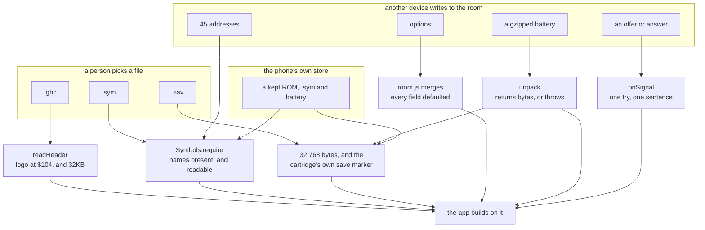

Four of those gates had a hole, and the shape of each is the same: a check that
was *nearly* there. `readHeader` bounds its own reads and the picker around it
did not guard the read that fetches the file. `require` asked whether a name was
present and not whether its address could be read. `unpack` threw, and also
raised a second failure its caller could not catch. `adoptRemote` checked that
the payload was a string and not that it parsed to an object.

The rest held, and the negative results are the point of doing it this way:
every merge in `room.js` was fed null, a number, a string, an array and a bare
`true`, and every one returned the local value intact; `party` and `balls` clamp
to what the engine says exists; `describeHandoff` and its four siblings render
junk as a sentence rather than throwing. Even the gzip bomb is already bounded —
nothing caps what a decompression expands to, but the room's 32,768-character
limit caps the *input*, so the worst reachable unpack is about 23 MB. Accidental,
and worth writing down precisely because nobody designed it.

**The thirteenth pass asked what happens when two things arrive at once.** Every
pass before it followed one thing at a time — one read, one job, one payload —
and this app is full of state machines where the interesting question is what
the *other* thing was doing meanwhile. Four defects, all in the same family, and
all four had a mechanism that was correct and a claim that was late.

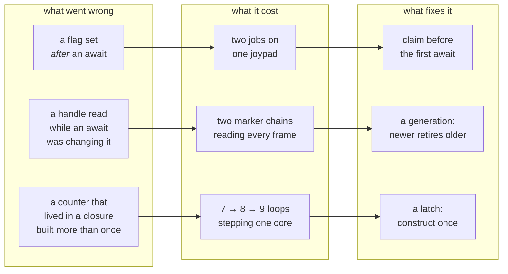

**Three of the four were measured on the running app, before and after**, which
is why this pass is worth more than the reading that preceded it. The double tap
was not argued about: the status line and the run log were watched through a
`MutationObserver`, and every line came out twice — two undo points, two save
sequences. Then once. The accumulating loops were counted by wrapping
`requestAnimationFrame` and recording how many callbacks were outstanding at the
same moment: 7, then 8, then 9, one per re-pick, and afterwards pinned at 1
through three more.

**The fourth is the one reading alone would have found, and had not.** Stop's own
comment says it reaches "the walk flag, which a task never reads" — a sentence
that has been true about the code and false about the interface for as long as
both have existed, because the button is unhidden by `setMode(true)` and a walk
deliberately never calls it. Two correct decisions, in two different functions,
that between them made a flag unreachable. No amount of staring at either one
finds it; the question that finds it is *who can actually press this*.

**The fourteenth pass asked which code has never run at all.** The eleventh
found a guard that *could not fire* — the pack test that asked whether a pocket
index was above 3, when the four read 0 to 3 — and found it by accident, while
looking at something else. Looking for that on purpose means measuring, so this
pass ran the suite under V8 coverage and ranked the modules by how much of each
had never been executed.

The number on its own is close to meaningless: a third of this app cannot be
exercised without a cartridge. What the ranking said was worth knowing.

| | before | after |
| --- | --- | --- |
| `gen2/menus.js` — drives the save | **16%** | 41% |
| `gbcore/saves.js` — writes the battery | **16%** | 17% |
| everything | 40% | 42% |

**The two least-run modules in the repository were the two on the save path**,
where the worst thing that can happen is a game that no longer exists. menus.js
had tests, and they stubbed out every method that touches the machine — the file
asserted on the order the rows were tried in and on nothing else. saves.js is
bound to IndexedDB and cannot be run in this harness at all, which is why its
number barely moved and why saying so is better than a fake one.

Writing tests that drive the real menu code needed a model of the cartridge, and
the first attempt guessed it. Measuring it instead — driving the same core the
app drives, in Elm's lab — corrected two things this repository believed:

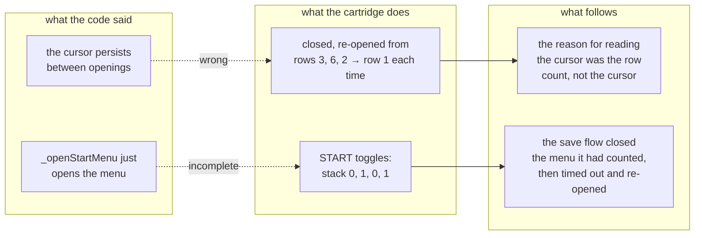

Recovering by timing out is not the same as being right, and the state it passed
through on the way was one where the next DOWN press would have walked the
player rather than a cursor. That is the failure `_menuRowCount` already has a
guard against, reached by a route that guard does not cover.

**And the third finding is one only this method could produce.** `Saves.restore`
read a slot and installed its bytes. Nothing called it — `loadSlot` in `main.js`
had taken the job over — and the difference between them is the refusal the
fourth pass added, which stops a save from a build that did not write it being
installed over the one that did. So the dead copy was the pre-audit version of a
live operation, sitting under an inviting name, unexercised and therefore unable
to drift back into agreement. Nothing that reads code finds that, because
nothing about it looks wrong. What finds it is asking what never runs.

**The fifteenth pass tested the one thing this app promises.** *It runs with no
signal* is the reason `sw.js` exists, and `sw.js` had no tests — 5KB of decisions
that only show themselves on a bad network, two of them fixes the eighth pass had
to find by reading, because nothing would ever have caught them going.

Verified first on the live deploy, which is the only place a service worker would
register: plain-HTTP localhost is refused, HTTPS is not, and the control run
against `minormending.github.io` settled that it was the origin rather than the
app. There the worker is active, and its cache holds **all 37 shell entries, each
a non-empty un-redirected 200, 905KB in total, with nothing from `dev/` or any
game file in it**. The only path the page asks for and does not have cached is
`sw.js` itself, which is correct and load-bearing — a worker that served itself
from its own cache would report the running version as the live one for ever, and
the Update button would never appear.

Then the file itself, in a `vm` context holding fakes for the four globals it
uses, so the code under test is the deployed worker byte for byte. Thirteen
tests, and the two that matter most are the eighth pass's fixes: removing the
redirect guard fails the captive-portal test, removing the shell gate fails the
ROM test, and unscoping the cache lookup fails the stale-cache test.

**And writing them found the one way a service worker can leave an app worse off
than not having one.**

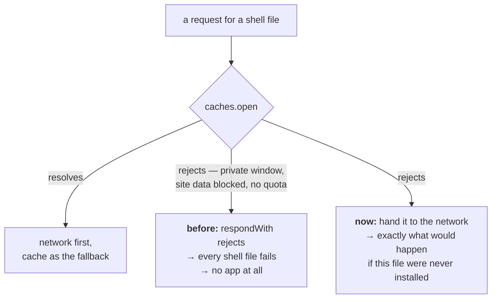

`caches.open` sat outside the error handling. It can reject — a private window,
an origin whose site data the browser has been told to block, a device out of
quota — and then the whole response rejected and every shell file failed to load,
on a device where the app would have worked perfectly with no worker registered.
The fix is to stand aside rather than to try harder, which is the same rule
`room.js` states for itself: *nothing here may be able to break the app.*

The pass's second finding is the thirteenth pass's shape again, one layer out.
`joinWith` re-enabled its button in a `finally` — and nothing had ever disabled
it. That is what made it invisible: the function reads as though the press were
guarded, and `Share` a few lines above genuinely is. Measured with a double tap
on a code that does not exist: two joins ran and the room answered twice. One
now.

**The sixteenth pass found its defects by adding a caller.** Not an audit
method anybody plans, and the most reliable one in this log: the Travel row
needed the offers list to draw a row that was waiting to be chosen for, and the
offers list could not do it.

The pickers under that list — the species chips, the level presets, the
destinations — are drawn only when the row that reads them is *on* the list. So a
row that appears only once a choice has been made can never be chosen for. Travel
hit that on the day it was written, and the same wall had been standing in front
of Hunt and Catch since the list was built:

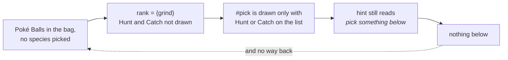

**Measured, and it is the state the ball errand leaves you in.** Catch had a
version of the missing rule already — it keeps its place when the only thing
missing is the balls, because the errand that fetches them lives in that row —
which is exactly why an *empty* bag worked and a full one did not. A row now
earns its place while it waits on a choice that can be made here, and the second
half of the same finding is that the hint used to say *pick something below to
hunt or catch* indoors, where the picker holds "nothing wild appears here".

The third defect is in the new code, found by reading it back cold an hour after
writing it. A destination chip looked itself up by its own label, and a label is
not an identity: a profile is data somebody writes, and two maps sharing a name
is ordinary — two Pokémon Centers, the halves of a long route. Then `find` on the
name returns the *first* place with it, whose key is not the chosen one, so
**neither** chip lights while the selection stays in force. Not reachable on
Crystal, whose ten names are distinct; reachable by anyone writing the eleventh.
The species picker above it gets away with the same trick only because `wildOn`
builds its list through a Map keyed by name.

**And the feature paid for the module it leaned on.** `world.js` had no tests and
was not loaded by the suite at all, which is an awkward place for the module
every journey is planned against — so `routesFrom` could not be written on top of
`route` until there were. It needs no cartridge: a fake ROM answering `romByte`
is a map of any shape, and the fixture writes out the real layout from
`constants/map_data_constants.asm` rather than stubbing it, because the byte
layout is the part that can be wrong. 0% to 98%, and two of those tests pin
behaviour nothing had ever checked: an unused warp slot is padding rather than a
door to map 0.0, and asking only about the map you are standing on reads no ROM
at all.

**The seventeenth pass set out to fix something it could not measure, and that
is the finding.** The target was the gap `jobs.js` admits to in its own
docstring: no evolution or learn-move policy. A Pokémon with four moves that
levels into a fifth is offered *delete an older move?* — a YES/NO box with YES
preselected — inside a loop that presses A up to a hundred and twenty times. On
the face of it, that silently deletes the first move.

Building the fix needs the box's signature in memory, and this repository
measures rather than guesses. Getting there means a Cyndaquil at Lv19, so:
starter taken, out to Route 29, and grind.

**It never got to Lv19, and the road there was full of defects.**

| run | battles | won | levels | ended |
| --- | --- | --- | --- | --- |
| Lv5 → | 50 | 48 | 7 | *the whole party fainted at Lv12* |
| Lv12 → | 25 | 24 | 1 | *the whole party fainted at Lv13* |
| Lv13 → | 35 | 32 | 2 | *the whole party fainted at Lv15* |

Three runs, winning ninety-two per cent of a hundred and ten battles, each
ending with a dead party handed back — and each with **twelve unused trips to
heal in hand**, having been given a way to heal. The job returned on a knockout
rather than recovering, and the comment saying why made a claim about the
cartridge: *the game has moved you to a Pokemon Center, and half your money is
gone*. Measured immediately after: `map [24,3]`, Route 29, one Pokémon at 0 HP.
Not at a Center.

**And the number that explains all three runs was sitting unread in the ROM.**
The encounter table stores `(level, species)` pairs; `wildOn` reaches past the
level byte to get the species and has done since it was written. Route 29 gives
**Lv2–3**. A Lv15 Pokémon aimed at Lv20 there is fighting things worth almost
nothing, which is exactly what the middle run's twenty-four wins for one level
look like — and the app offered `Lv20` as a preset with nothing to say about it.

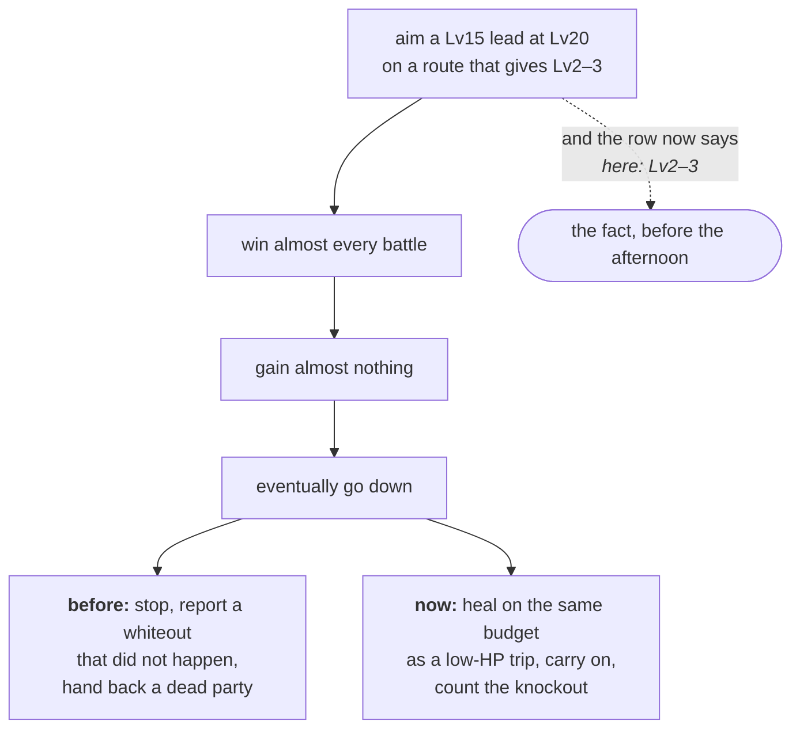

Two of the three defects are therefore about the same thing from opposite ends:
the job could not tell you the grind was hopeless, and could not survive being
proved right. The third — the learn-move policy the pass went looking for — is
**still not built**, and the honest reason is written into the docstring rather
than out of it: measuring that box needs a Pokémon at Lv19, and Route 29 cannot
deliver one. What the pass did establish is that `windowOpen && menuItems !== 34`
never once occurred across a hundred and ten battles, which is a starting point
for whoever measures it next.

One more thing worth writing down, because it cost a wrong reading first: the
grind starves the timer queue. A `setInterval` sampling the party got **six
samples in forty seconds** while the loop ran, because the loop awaits only
already-resolved promises — exactly the limitation `taskbase.js` documents for
its own watchdog, met from the other side.

**The eighteenth pass finished what the seventeenth could not, by grinding the
same thing further.** The seventeenth set out to build a learn-move policy and
could not reach the state that needs one: Route 29 gives Lv2–3, so a Cyndaquil
crawls to Lv19. The way through was to pick a different starter. Chikorita's
slots fill at Lv12 and its fifth move comes at **Lv15**, four levels sooner.

Getting there took three runs and each one found something, because the road to
a measurement is made of the same code the measurement is about.

| | before | after |
| --- | --- | --- |
| Chikorita, Lv5 → Lv16, Route 29 | 64 battles, 59 won, **stalled at Lv13** | 122 battles, **122 won**, 0 knockouts, Lv16 in 155s |

**All three defects are one confusion: slot order is not a strategy.**

`chooseMove` fell back to `usable[0]`. The catch path has read the move table
since it was written, to find the *gentlest* attack — knocking out what you are
catching wastes the ball — and the winning direction had nothing at all.
Chikorita's slots are Tackle, Growl, Razor Leaf, Reflect. Sixty-four battles in,
Tackle was dry, so slot order handed back **Growl**, which takes no HP off
anything, while Razor Leaf sat in slot three at 25 PP.

And `dry` asked whether *any* move had PP. Growl at 3 PP answered yes, so the
grind never went to heal and kept swinging a move that cannot end a fight — five
battles going nowhere, a party at 3 HP out of 36, and a trip to a Center that
would have restored the lot.

**Then the thing the pass came for.** With four moves and a fifth offered, the
game asks *delete an older move?* — a two-row YES/NO box with YES under the
cursor — inside a loop that presses A up to a hundred and twenty times.
Measured: the Chikorita reached Lv15 and came out of the battle holding
`[POISONPOWDER, GROWL, RAZOR LEAF, REFLECT]` where it went in holding
`[TACKLE, …]`. **Tackle was not chosen away. It was top of the list when a stray
A landed.**

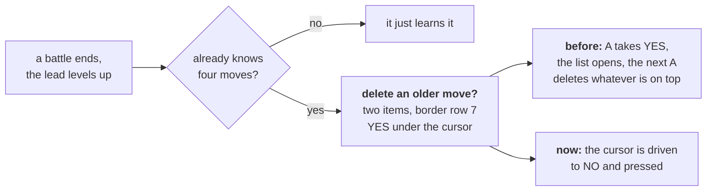

The signature came off the cartridge at the instant the moveset changed, which
is the only place it could honestly come from: **two items at border row 7**. The
battle menu is thirty-four at row 12, the pack five at row 1, and the pack
mid-throw is *also two items* — at row 0. So the row separates them, not the
count.

**And the policy is a decision rather than a default.** Decline, because the
pilot cannot know which of four moves you value, a declined move can be taught by
hand and a deleted one cannot, and `chip` reasons about this very list to pick
the gentlest attack — a set that changes underneath it breaks the one piece of
reasoning this app does about moves.

**What this pass did not manage**, and it is written into the code as well as
here: the guard has never been *seen* firing. The run after adding it took the
same Chikorita over Lv15 with all four moves intact and logged no decline — so
something else preserved them and it is not known what. The likeliest
explanation is timing: the level-up and the end of the battle land within a few
frames, and if `!s.inBattle` is true first the loop returns before the box is
looked at, leaving its fate to whatever presses next. Which is exactly the
accident the guard exists to stop relying on. It stays on a measured signature
and a tested behaviour, and the next person to grind past four moves should watch
the log.

Two notes on the tests, both about this repository catching itself. The first
draft exercised `strongest` alone and **passed with the argument removed from
`fightBattle` entirely** — the same shape as the ReferenceError that once reached
the deployed app, where the tests exercised the static directly rather than any
of its callers. And the `exports` group added two passes ago failed on
`learnMoveBox` having no reader outside its own module, which is how it came to
be tested rather than quietly un-exported.

**The nineteenth pass audited the eighteenth's fix, and the fix was wrong.**
Which is the most useful thing in this log, because it is the one shape none of
the nineteen methods had produced before: not code that was never right, but code
that had *just been made* right and was not.

The eighteenth pass shipped a guard that declines the fifth move, and admitted
it had never been seen firing. So this pass went and watched.

**It fired four times and changed nothing.** Gen 2 asks *two* questions, not one:
*delete an older move to make room?* and then, on a no, *give up on learning it?*
— and the second one wants **YES**. Answering no to both loops, because no to the
second means *carry on learning it* and puts the first back on screen. The log
shows the cursor walking 1, 2, 1, 2, 1 across four declines, and then the moveset
coming out as `[POISONPOWDER, GROWL, RAZOR LEAF, REFLECT]` anyway: once the loop
had gone round enough times, a stray A from the turn presses landed on the delete
prompt.


**Firing was not the same as working**, and only a cartridge could have said so.
The answers are asymmetric and the order carries the meaning — and both boxes
have the same signature, because they are one widget asked twice, so the routine
relies on the sequence rather than on looking.

| | before | after |
| --- | --- | --- |
| Chikorita over Lv15 with four moves | `[POISONPOWDER, GROWL, RAZOR LEAF, REFLECT]` | `[TACKLE, GROWL, RAZOR LEAF, REFLECT]` |

**The second finding closes the docstring's list.** `jobs.js` had said for
nineteen versions that the grind has no evolution policy, and the measurement is
what a missing policy looks like: `#152` became `#153` at Lv16 and nothing
mentioned it, while every line after that used the new name. Letting it evolve is
right — it is what somebody grinding expects, and cancelling would be the
surprising choice — but a policy nobody states is indistinguishable from an
accident, so it is stated, and reported: *CHIKORITA evolved into BAYLEEF*.

The end-to-end run, which is the first time this job has been watched all the way
through a level range that changes a Pokémon: **Lv5 to Lv17 in 192 seconds, 159
battles, 158 won, one knockout healed through, one evolution, and all four
original moves still in place.**

**And the same test gap appeared twice running, which is worth more than either
defect.** In the eighteenth pass the mutation removing the fix's argument from
`fightBattle` broke nothing, because the tests exercised the piece rather than
the caller. In this one, swapping `answerYes` back to `answerNo` broke nothing,
for the same reason. Both are now covered, and the second test models the game
rather than the function: two boxes, a cursor that is not live on the first
frame, and a loop back to the first question if the second is answered no.

One loose end, recorded rather than smoothed: in the verifying run the decline's
own log line was not captured, though it was captured in the run before. The
outcome is unambiguous — the moves survived where they previously did not — but
the mechanism's evidence spans two runs rather than one.

**The twentieth pass asked a question the checks cannot ask: who calls this?**
The `exports` group added in the sixteenth pass keeps every *export* honest, and
methods are outside its reach for a reason worth stating — dynamic dispatch is
real in this repository. `nearestHeal` reaches `healAtElm` through
`this[h.reach]()`, and the title scripts are called by name out of a profile
object, so a check strict enough to catch a dead method would report every one
of those as dead too. So it was asked by hand, once, over every method in the
four directories.

Three answers, all of them twenty versions old:

| | what it did | why nothing called it |
| --- | --- | --- |
| `RomData.speciesIndex` | name → id for all 251 species | the app compares species by name throughout |
| `RomData.itemIndex` | name → id for the first 60 items | the ball is found by scanning the pocket |
| `CollisionMap.verify` | re-check the decode against the player's tile | `calibrate` does that, and tries the candidate offsets rather than assuming one |

Deleted on the grounds the exports group already states: an unused entry point is
a second way to do a thing, sitting where the next person finds it by name and
drifting from the way that is actually used because nothing exercises it. The
sweep also nearly took `normalise` with them, which the bag reader still uses —
a reminder that "nothing calls it" and "nothing calls its neighbours" are
different findings.

**And the feature that pass built is two earlier passes meeting.** The
seventeenth read the level beside every species; the sixteenth built the list of
named maps the graph can reach. Neither alone answers the question a slow grind
raises, which is *then where should I go*.

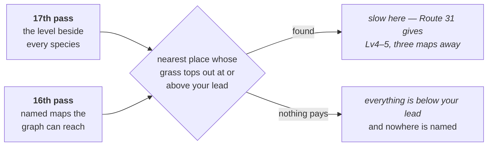

Verified against the cartridge, and the interesting part is *which* place it
named. Standing on Route 29 with a Lv5 lead: Route 30 is **nearer** — two maps
against three — and it was passed over, because its Lv3–4 ceiling is not enough
for a Lv5 Pokémon. Route 31's Lv4–5 is. At Lv8 nothing reachable pays and the
answer is null, which reads as silence rather than as advice to stay.

One measurement came free and was **wrong**, which the pass after it caught: the
same Route 30 was recorded as reading Lv3–4 at one hour and Lv4–5 at another.
It does not. `wildHours` reads all three blocks in one call, and all three of
Route 30's read Lv3–4 — as do all three of Route 29's at Lv2–3 and all three of
Route 31's at Lv4–5. Only the *species* change after dark, which is the reason
`wildOn` takes a time of day and the whole of it. What the earlier note actually
compared was two maps: 26.1 is Route 30 and 26.2 is Route 31, and Lv3–4 against
Lv4–5 is exactly that pair. The table above it is unaffected and was right —
it names the same two maps and the same two ranges — so the claim that failed is
the one derived from a single number read twice, without the second map's name
beside it. Kept here rather than deleted: a measurement is only as good as the
label on it, and this one had the wrong label for one version.

**The two worst were silent data loss**, and both were doors the app opens by
itself. Every door a *person* opens was already locked and had been for
versions: the handoff refuses a room save whose tag differs, `loadSlot` refuses
a slot's, `describeSlot` draws *from a different ROM* where a date would go.
Both pass-four defects are on paths nobody presses — a record written inside
`install`, a battery restored at startup before anyone has touched anything. The
checks went where somebody was visibly making a choice, and not where the app
made the choice for them.

**Passes five and six are both sequels to
[When the lead faints](#when-the-lead-faints)** above, which is the single
richest source of defects in this log. `sendOut` was built there and works. What
it never reached, across two passes, was everything downstream of it: four
places that spell *the Pokémon on the field* as `party[0]`, and two of the three
loops that drive a battle, neither of which answered the prompt at all. Fleeing
spent its 150 presses hunting for a battle menu that was never coming and a hunt
stopped on *could not run from a PIDGEY*, with a healthy Pokémon in slot two.
There is an `onField` and a `coverFaint` now, so there is somewhere to change
each of them next time.

**The sixth pass is a different family from the first five.** Those were
about *identity* — which cartridge, which Pokémon, which device — and every one
was the pilot reading the wrong thing. The sixth went at the loops those reads
sit inside, and nothing there is misread: a prompt nobody answers, a branch
tried in the wrong order, a sentence that names the wrong event, and two loops
that terminate only by assumption. One of those assumptions is *a Pokémon Centre
restores PP*, which is true of Crystal and is not a fact about cartridges in
general — and one of three rungs on the ladder above that no cartridge on this
machine can produce.

**The eighth pass found a third family: a promise in a comment that nothing
kept.** All three of its defects are places where a sentence states the intended
behaviour and no code implements it — *a wrong guess opens the pack, which is
recoverable* (nothing recovered), and *the ROM and .sym are never in this cache*
(with `?dev=1` they were). That is a particular hazard **here**, because this
repository's comments are unusually load-bearing: a file that explains its own
reasoning at length reads as a description of what the code does, and an
aspirational sentence is indistinguishable from a descriptive one. Its last two
are also the first defects in eight passes that no test here can reach — a
service worker wants a browser and a secure context — so what is checked is the
path arithmetic and the behaviour is reasoned about, which the code walkthrough
says rather than implies.

**The eleventh pass played the game, which is the method this document opens by
insisting on, and which no audit had used.** Eighteen changes to the battle and
job paths had shipped without one of them being run against a cartridge. Almost
all of it worked first time — ten battles out of ten, a real trip to Elm's lab
to heal and back, `onField` and `coverFaint` and the whiteout wording all
exercised for the first time on a real game. The catch did not: *could not reach
the ball in the pack*, nine encounters in, five Poké Balls in the bag.

Both defects behind that are in `throwBall`, and neither is visible from
reading. The pack loops waited a fixed twenty frames and re-read, which is not
long enough to be sure — the pocket switch swallows presses while it animates
and `wCurItem` lands a frame after `wCurPocket` — so two presses landing for one
observed change walk past the pocket being aimed at. **The fingerprint is a pair
that cannot both be current**: pocket 2 with item 5, when pocket 2 is the key
items and its first entry reads 255. And the guard for *the pack never opened*
asked whether the pocket index was above 3, which measured cannot happen, since
the four read 0 to 3.

**The tenth pass audited the apparatus rather than the code, and the headline
is that it held.** All fifteen check groups then, seventeen now, fail when the one
thing they claim to watch is broken, and thirteen of fifteen source mutations
are caught by the
suite — both of those are now results rather than assumptions, and the first is
repeatable as [`tools/check-checks`](DEVELOPING.md#are-the-checks-still-checking).
It matters here because four groups *have* gone silent historically and every
one went on printing `ok`.

The two mutations that survived were worth the visit: `onField` demanded a
unique HP match and fell back to the first Pokémon standing when it did not get
one, which returns the *lead* in the one case that arises — and `partyDown`, the
predicate that separates a whiteout from a refused escape, had no test at all
though its code was right.

**The honest caveat is that both new instruments fail towards the false alarm.**
The first draft of `check-checks` reported seven groups blunt, and all seven were
my mutations being wrong rather than the checks being asleep. A tool that reports
on tools is a tool, and its cost is the afternoon spent finding out which of the
two was mistaken.

**The ninth pass made the eighth's finding into a method, and then into a
check.** If a comment says *never*, *always* or *every*, it is a claim, and a
claim can be tested — so the pass was a grep for those words across every module
and then an afternoon of asking. Two claims held: `remember.js` really does put
every storage access through one accessor, and `taskbase.js`'s cancellation
really does reach every loop in *its own* family. Two did not, and the second is
the one worth remembering: `gb.js` opens with *the emulator, wrapped so the rest
of the app never touches WasmBoy directly*, and `saves.js` was calling
`gb.core._getCartridgeInfo()` and `gb.core.loadROM(...)`.

That sentence is now `check-app`'s fifteenth group. **A promise that can become a
check should; the ones that cannot — a service worker's behaviour, a cutscene's
length — should say so out loud instead.** Nine passes in, the remaining defects
are less in the code than in the distance between what it says about itself and
what it does, and that distance is measurable in one place now.

**The seventh found the one that was hurting people now.** The two NIDORAN
decoded to the same string, so the species picker drew two identical chips and
hunting for the one you picked stopped at the other; Route 35 and Route 36 both
carry the pair. Nothing about it needs a hack, a second device or an unusual
situation — only a route with both on it, and a person who wanted a particular
one.

### A twenty-first pass: a cartridge Crystal is not

Every reading in this document until now came off one ROM, and the app is built
for many. So this pass wrote a cartridge by hand — not a mock of the reader, the
**bytes**: map group, map number, three encounter rates, three blocks of seven
`(level, species)` pairs, terminated at `$FF`, exactly as
`data/wild/johto_grass.asm` lays them out. A patch of grass then becomes any
shape you like, *including shapes Crystal has none of*, and that is the whole
value.

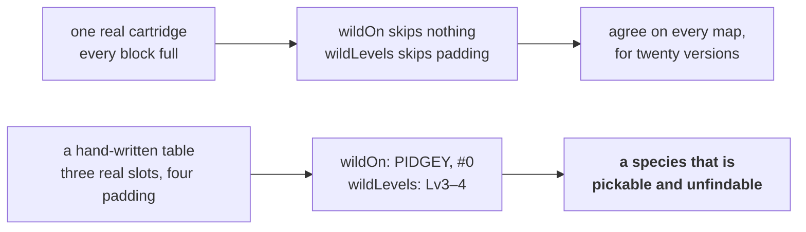

`#0` is what `speciesName(0)` returns, so a block with three real slots and four
padding ones offered a fourth thing to hunt: a chip somebody can tap, a quarry
the grass will never produce, and `huntable > 0` putting Hunt on the offers list
for a map with almost nothing in it. Both readers walk the same bytes and
disagreed about which of them count. They share one `_grassAt` and one `_slots`
now, so the disagreement has nowhere to live.

**The instrument found a second defect in itself.** Writing those tests meant
comparing `{ low, high }` against `{ low, high }`, and the harness could not:
`same` walked arrays deeply and fell back to `a === b`. The report was the tell —
*expected {"low":2,"high":4}, got {"low":2,"high":4}*, the same text twice,
because `show` could already print what `same` could not read. `t.eq` failing on
a correct value is a nuisance; **`t.ne` was the real fault**, because it could
therefore never fail on two plain objects. A test asserting that two ranges
differ passed while proving nothing, and would have gone on passing.

### And it settled a measurement recorded one pass earlier

`wildHours(group, number)` reads all three blocks at once, which the feature
needed and the twentieth pass's own claim did not survive:

| | morning | day | after dark |
| --- | --- | --- | --- |
| Route 29 (24.3) | Lv2–3 | Lv2–3 | Lv2–3 |
| Route 30 (26.1) | Lv3–4 | Lv3–4 | Lv3–4 |
| Route 31 (26.2) | Lv4–5 | Lv4–5 | Lv4–5 |
| species, all three | *swap completely after dark* | | |

The levels do not move with the hour. What the earlier note compared was two
maps: 26.1 is Route 30 and 26.2 is Route 31, and the Lv3–4-against-Lv4–5 it
quoted is exactly that pair. The table it sat under was right and named both
maps; the claim that failed is the one derived from a single number read twice
without the second map's name beside it. **A measurement is only as good as the
label on it.**

Which then caught a third defect, in this pass's own new code. `betterHour`
asked whether another hour paid the lead — and on a cartridge where all three
hours are identical, the answer for an outlevelled lead is yes, so it advised
*come back in the morning* while standing in an indistinguishable afternoon. The
app's only caller had already established that here does not pay, so it was
right by a precondition it never stated. The precondition is stated now, which
is the fix and the reason: the second caller is always the one that finds this
out.

### The other three were a field three deciders never learned

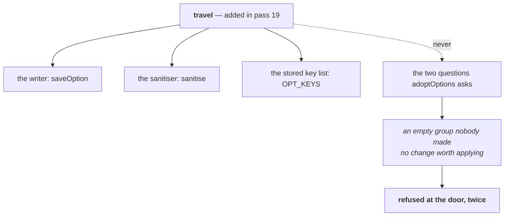

A destination chosen on the tablet was stamped, published, merged by the room
and delivered to the phone — and thrown away there, by two conditions written
over a hand-written list of three fields. Nothing failed and nothing logged; the
chip on the other device simply never lit. The questions are asked over
`CHOICES` now, derived from the stored key list, and they were moved out of
`main.js` into `adoptable` so that a test can reach them, which is the same move
`needsOffer` made three passes earlier and for the same stated reason.

The grind's evolution line had the same shape one layer in. It was added the
pass before and reads the snapshot taken at the *top* of the loop — the party as
it was **before** the battle that did the evolving — so it came out a battle
late, and the level break sits above it. An evolution in the battle that reached
the target was therefore never reported at all, which is the likeliest battle
for one. Three exits now, one check each: the level break, the empty slot, and
the loop's own condition running out. `grind` also has a test file for the first
time, in twenty-one versions, which is an odd gap for the one job people leave
running.

And tap-to-walk had a `finally` and no `catch`. It is one of exactly two things
in this app that drive the emulator for somebody, and the other one — `runTask`
— has said for versions why that is not enough: *a task that dies silently looks
indistinguishable from one still working.* Measured both ways on the same
injected throw: before, the call rejected out of a click handler nobody awaits
and the status line still held what it said before the tap; after, it reads *the
walk stopped: bad WRAM read* and the dot goes red. Which is precisely the shape
the third pass found in `Join`, in the other half of the app.

### A twenty-second pass: asking a second tile the same question

The pass before this one wrote a cartridge Crystal is not. This one stayed on
Crystal and asked a *second instance* of something the app had only ever been
asked about once — which turns out to be the same move at a different scale, and
just as productive.

`pickUp` has existed since the errand did. It is asked about exactly one tile:
Route 31's Poké Ball at (19,15), the earliest ball in the game that does not need
the Pokédex. Everything about it was correct for that tile and a rule about
nothing.

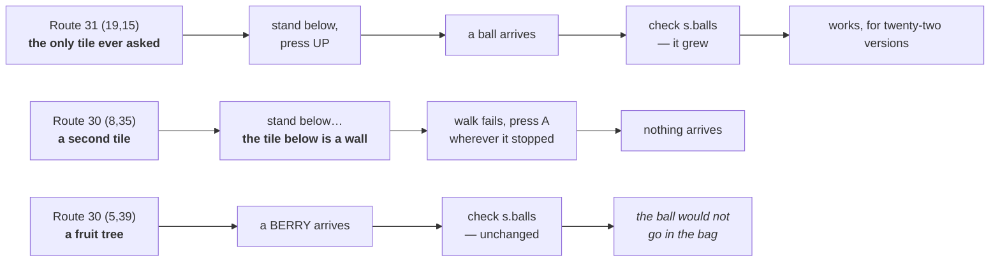

Four defects in eleven lines, and each one measured rather than reasoned about:

| What | How it was seen |
| --- | --- |
| it approached only from the south | (8,35) has a wall under it; approaching from **above** and facing DOWN put an ANTIDOTE in the bag |
| it judged success by the **balls** pocket | *the ball would not go in the bag*, said twice, with a BERRY and then a PSNCUREBERRY in the pocket |
| a dead `continue` inside an already-excluding condition | `if (res.stopped !== null && res.stopped !== 'battle') { if (res.stopped === 'battle') continue; }` — so a battle-stopped walk fell through and pressed A in the battle |
| it used `walkTo`'s default eighty steps | every other leg of a journey passes 260, written out at four call sites; the fifth got the default by omission |

The last one is the one worth keeping. **A walk cut short by its step budget
reports the same `stopped` as a tile that refused**, so the wrong number does not
look like a wrong number — it looks like the map being in the way. The four call
sites are one named `longWalk` now, and the reason they were four is that nobody
had needed a fifth.

### The feature was the fix, and the fix needed a fact off the cartridge

*Take* walks to every item ball and fruit tree on the map you are standing on.
Which objects those are is `wMapObjects` filtered by sprite id, and the two ids
are in the engine profile because a sprite id is precisely what a hack moves.
Both were measured rather than copied out of `constants/sprite_constants.asm`:

| Sprite | What | Measured |
| --- | --- | --- |
| **84** | an item ball | Route 31's ball carries it in the ROM's `object_events` at exactly its known tile (19,15); the Route 30 object with it gave an ANTIDOTE |
| **93** | a fruit tree | Route 30's two, at (5,39) and (11,5), gave a BERRY and a PSNCUREBERRY |

Reading the ROM's `object_events` is what settled the first row without walking
anywhere: the stride is **13 bytes, sprite first, then y+4 and x+4**, and a
13-byte read of Route 31's block lands sprite 84 on the ball's tile exactly.

**A ball already taken is still in the list.** Measured, and it shapes the whole
feature: after the ANTIDOTE was in the bag, its object was still where it had
been in work RAM. So the row counts what the map *placed* and never promises what
is left, and the job answers by differencing both pockets rather than by
expecting anything. Which makes three outcomes, not two — and the third was a
defect in this pass's own new code, painting *nothing left to take here* red
until the second press showed how wrong that reads.

End to end on Route 29, from where the bootstrap leaves you: **one press picked
up a POTION and a BERRY thirty-five tiles apart, in about forty seconds**, and
the press before the retry budget was raised had come back with neither.

### And one in the save path, found the same way

`Saves.list` reads a summary per slot in one transaction, and fired the five
reads and forgot them. A read that fails then rejects with nobody listening: one
error the caller can catch, and five it cannot, arriving a turn later with no
stack pointing at the file. **That is the codec's shape from ten passes ago**, on
the other half of the same path — and it was found the same way this pass found
everything else, by building the second instance: a fake IndexedDB, small enough
to describe in a paragraph, that can be told which key's read should fail.

One line beside it is belt and braces and is labelled as such, which matters more
than the line does. `await Promise.all(pending)` fails no test if removed,
because a request's `onsuccess` resolves before the transaction's `oncomplete`
and the microtask queue drains in between. It is there to make the ordering a
rule of the function rather than a property of the platform — and saying which
of two changes was the fix is the thing three earlier passes got wrong by not
saying.

### A twenty-third pass: the first time the pilot used an item

Twenty-two passes of reading the game, and the pilot had only ever *pressed* at
menus it already knew: the battle menu, the pack in a battle, the save box, two
yes/no prompts. This pass took it four boxes deep into the field pack for the
first time, and the audit is what happened on the way.

Every box is matched on its **shape** rather than reached by a press count,
which is the lesson `learnMove` and the battle pack already carried. All four
measured on the cartridge:

| Box | `menuItems` / `menuTop` |
| --- | --- |
| the START menu | 7 / 0 — and it grows, so it is counted by stepping |
| the pack | 5 / 1 — the same box the battle pack draws |
| USE / GIVE / TOSS / QUIT | 4 / 3 — USE on row 1, TOSS two rows under it |
| which Pokémon | 4 / 0 — four items again, told apart by the row |

**PACK is row 2 of 7 on a fresh Route 29 save, and nothing believes that.** The
menu grows, so the row is found by driving to one, pressing A, and asking
whether the pack's own box appeared — the same thing `saveGame` learned about
SAVE.

### The one in the primitive everything falls back to

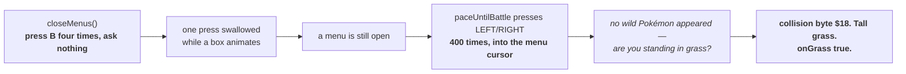

`closeMenus` is what every other primitive falls back to, and it was the one
place that never looked. What that costs is not a menu left open: it is that
**every directional press afterwards drives a menu cursor instead of the
player**, silently. Measured exactly as drawn — three boxes deep in the pack, the
call returned, and a grind then reported a confident wrong answer to the right
question from the middle of a route covered in grass.

Four was not even the wrong number. A box swallows a press while it animates, so
the count that closes three levels is not three, or four, or any number.

### Two about evidence, and they are the same finding twice

**The ITEM pocket lags a use.** Measured: a BERRY used on a Cyndaquil at 5/22
took it to 15/22 — ten HP, exactly a BERRY — and `wItems` still listed that berry
on the next read. The removal landed later, and when it did, that berry and the
potion used after it disappeared together. Which contradicts a line added to the
walkthrough one pass earlier saying the pocket settles immediately out on the
map; that line is corrected, and the pattern is now familiar enough to name — a
claim about *when* a byte is true, made from one reading.

It cost twice over:

1. `useItemOn` judged success on the pocket, so **a heal that worked reported a
   failure.**
2. `healFromBag` re-read the pocket between items, so it **picked the same spent
   berry again**, walked past it in a pack that no longer had it, gave up, and
   never reached the POTION. The Pokémon was left at 15 of 22 *with two potions
   in the bag.*

HP is the evidence now, the pocket is polled for and its silence reported, and
the loop keeps its own view of the pocket — decremented as things are spent.
Which is the opposite of what this repository says about the ball count, and
deliberately: *count them out of the bag rather than trusting a tally* is the
right rule when the bag is current, and this pocket has been measured not to be.
A local tally can only be wrong in one direction here — it forgets an item sooner
than the game does — and the next press of Heal reads fresh.

### And one of mine, caught by the cartridge in under a minute

The block that tries the bag before the walk went into **`healUp` instead of
`healNow`**, because the anchor it was inserted against appears in both and the
edit took the first. `before` is not in scope there. Every one of the 284 tests
passed. The cartridge said *off to heal: before is not defined* on the first
press.

There is a caller-level test for it now, and it fails when the block is removed
— which is the third pass in a row to end with the same sentence, and worth
counting: the tests exercised `healFromBag` and `cheapestHeal` thoroughly and
never once asked what `healNow` did with them.

End to end on Route 29, standing at (19,4) with a Lv7 Cyndaquil at **6 of 24**
and a bag of two Potions and a Berry: **24 of 24, the Berry and one Potion
spent, and the pilot never left the tile.** Before the pocket fix, the same
situation stopped at 15 of 22.

### A twenty-fourth pass: following a feature to its second caller

The pass before this one taught the pilot to heal out of the bag, and measured
it on the Heal button. This one asked the obvious next question — *who else
heals?* — and the answer was the grind, which heals **twelve times** and had
never been given the feature at all.

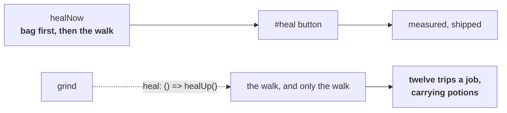

One line in `main.js`, and the pattern is this repository's oldest: a mechanism
wired to the caller its author had in mind and not to the one that would use it
most. Which makes it the eighth time, and the useful part is no longer the
finding — it is that *following a new feature to its second caller* is now a
move worth making deliberately rather than a thing to notice later.

### Then it went into battles, and found three

The feature this pass is that the battle loop reaches for the bag before the
thing on the field faints. A knockout takes half your money; the grind's answer
to one has always been to heal up and carry on, *after* the fact.

Every box measured on the cartridge, on a Cyndaquil at 9 of 21:

| Box | `menuItems` / `menuTop` | Note |
| --- | --- | --- |
| the battle menu | 34 / 12 | already known |
| the pack | 5 / 1 | the same box the field pack draws |
| USE / QUIT | 2 / 7 | **the same shape as `learnMove`** |
| the result | 2 / 0 | the HP moves on the press *after* this appears |

The third row is written down rather than deduplicated. They are two different
questions a snapshot cannot tell apart, and only the context can: the learn-move
box appears while a turn resolves, and this one only while the pack is being
driven. Any code that could be in both states at once would answer the wrong
one.

**A swallowed press is not a pack that will not open.** Measured, and it cost a
knockout: three attempts in one battle came back *the pack never opened*,
spending the whole three-item allowance, after which the Pokémon fought on at 4
of 18 and fainted. The pack opens in under twenty frames — measured separately by
pressing PACK and sampling at 20, 40, 60 and 90 — so what happens is the A press
landing in the turn's text and vanishing. The reading was accurate; the
conclusion was wrong. Press, look, press again.

**And `closeMenus` cannot succeed inside a battle.** It presses B until no
window is open, and the battle menu is a window B will not close. That was
always true; what changed is that the pass before last made `closeMenus`
*check*, so a call that could never succeed started reporting failure — and the
report is what named the wrong caller. A fix that turns a silent waste into a
loud one is worth having for that alone.

### And one of mine, predicted six passes earlier by a comment

```
// Bounded, and this loop is the reason: healing does not count a
// battle, so nothing else here advances. It terminates only because a
// Center restores HP *and* PP and healUp verifies the HP half.
// A Center that left PP alone would walk there and back for ever.
```

That comment has sat above the grind's heal branch since the seventeenth pass.
Routing every grind heal through the bag is exactly the case it describes: **the
bag mends HP and nothing but a Center mends PP.** Measured — the grind spent all
twelve trips at Lv8 on a Pokémon at *full health* with no move left that could
win, and stopped. A loop with no exit, described in advance, above the line that
broke it.

So the *reason* goes to the caller, which is the only place that knows what each
of its ways to heal does:

| Why | The caller | Because |
| --- | --- | --- |
| `dry` | walks | only a Center restores PP |
| `hurt` | asks the bag, then walks | a potion in the pocket is free |
| a knockout | walks | a potion does nothing at 0 HP |

One more thing fell out of naming that option. The counter bounding those trips
was called `heals`, the new option was called `heals`, and the collision was the
tell: **it has never counted heals.** The bag mends things without one. It counts
*walks*, which is what the budget is for, and it is `trips` now.

### What the measurements say

| | before | after |
| --- | --- | --- |
| Lv5 to Lv14, Route 29 | — | **132s, 79 battles, 79 won, 0 knockouts** |
| Lv5 to Lv17 (pass 19) | 192s, 159 battles, 1 knockout | — |
| the run with the swallowed press | Lv5 to Lv12, 47 battles, **1 knockout** | — |
| the run with the bag for everything | stopped at Lv8, twelve trips spent | — |

Seventy-nine out of seventy-nine is the number worth keeping. A perfect record
over a grind is what healing *before* the faint buys, and it is the first time
this log has one.

### A twenty-fifth pass: reading the profile back

Twenty-four passes have added fields to the engine profile. This one asked the
reverse question — *what does the profile declare that nothing reads?* — and
found the answer in one line:

```
mon: {
  species: 0x00, moves: 0x02, pp: 0x17, level: 0x1f,
  status: 0x20, hp: 0x22, maxHp: 0x24,      ← status, for ten passes
},
```

`party()` read species, level, HP, maxHp, moves and PP, and stepped over
`status`. Which is the mirror of the twentieth pass's finding — *methods with no
caller* — asked of data instead of code, and it turns out to be the more
productive direction: a method nobody calls is dead weight, and a **field nobody
reads is a blind spot**.

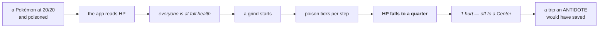

Three defects fall straight out of that drawing, and the third is the one worth
the pass:

1. **The Heal row called it full health**, because it counted HP.
2. **The grind never healed for a status**, so poison was only noticed once its
   ticking looked like ordinary damage.
3. **And the trip it earned was the wrong answer**, because the thing that
   needed fixing was never the HP.

### Two of the five were mine, and one was caught by writing the test first

**The cure ran after the HP check.** `healFromBag` computed the hurt list,
returned early if it was empty, and only then cured — so a party at *full HP*
that was poisoned took the early return. The one party the status reader exists
for was the one that never reached the cure. Found by a test written from the
feature's own description rather than from the code, which is the first time
this log can say that.

**And `useItemOn` judged success by HP.** An ANTIDOTE moves none. Every cure
would have reported a failure — and that failure is what stops the loop reaching
for the next item, which is a shape two earlier passes have already paid for.
Its evidence is now HP *or* a status going away, and the waiting is still done
on the pocket, because the pocket is the slowest of the three: by the time it has
caught up, the other two certainly have.

### What was measured, and what was not

**The offset was measured.** On a Lv13 Cyndaquil at 35 of 37: byte `0x1f` read
13, `0x22`–`0x23` read 35, `0x24`–`0x25` read 37, and `0x20` — bracketed by two
fields already known to be right — read `0`, which is what a well Pokémon holds.

**No non-zero status has been seen.** Getting one needs a wild Pokémon to land a
status move, and the only one on the routes this save can reach is Weedle's
Poison Sting. That needs a Weedle to get a turn, which an over-levelled lead
never gives it: sixty battles on Route 30 produced no status at all, and a run
that chipped *gently* at Weedles specifically to keep them alive found no Weedle
in eight encounters.

So the five bit values come from `constants/pokemon_data_constants.asm` and are
pinned by tests over synthetic bytes, and the cure path is exercised through the
same `useItemOn` measured on the cartridge two passes ago. **This is the third
standing gap in this document**, beside the remote-play picture and the ROM hack,
and it has the same character: it is waiting on a *situation* rather than on more
reading. The list is worth keeping in one place, because it is the honest answer
to "what would you do next if you could" — and the twenty-seventh pass added a
fourth in the same shape. A fifth stood here for one pass, the starter's
nickname, and came off it when somebody who knew the game said which button to
press.

| Gap | What it needs |
| --- | --- |
| the remote-play picture | two real devices on one wifi |
| a title profile that is not Crystal | a `.gbc` and a `.sym` from a real hack |
| a non-zero status byte | a wild Pokémon that gets a turn |
| the duel moving on to a second trainer | two spawned trainers in range, one already beaten |

Sleep is worth one more line, because it is the one the decode could have got
wrong quietly. **It is a counter, not a flag**: the low three bits hold the turns
remaining, so `byte & 0x04` is false of a Pokémon asleep for three more turns.
The mask is `0x07`, and a test pins 1, 3 and 7 as all meaning asleep.

### A twenty-sixth pass: the first thing the pilot spends

Every capability so far used what the cartridge gave: the potion in the bag, the
berry on the tree, the ball in the grass. Shop is the first that *spends* — and
spending needs a number the app had never read.

**`wMoney` was unread while the app asserted what it costs.** The grind has
counted knockouts since the seventeenth pass, and the comment beside that count
says a knockout takes half your money. It could not show the number. Which is
last pass's question again — *what does the app claim that it cannot see?* — and
it keeps paying:

| | encoding | measured |
| --- | --- | --- |
| `wMoney` | three bytes, big-endian, **plain binary** | `[0x00, 0x0b, 0xb8]` on a new game — 3000 |
| `wMartItem1BCD` | the mart's prices, **BCD** | the name says so, and it is the trap |

Two adjacent fields, two encodings. A reader that inferred one from the other
would be wrong in the direction that looks plausible.

### Three ways a box lies about being ready

The shop is five boxes deep, and driving it found the same lesson three times in
three different shapes. What makes them worth writing down together is that
**all three produced an honest report of a job barely done**, rather than
anything that looked broken:

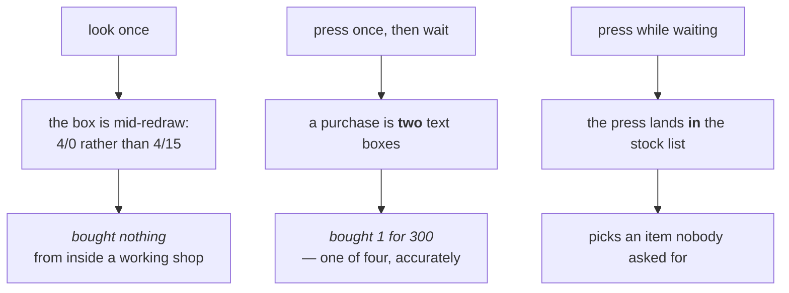

The third is the one worth the pass, because of *how* it was found. The fake
that models the redraw — added to make the second defect's test bite — produced
the third defect immediately, in a test, **before the cartridge ever saw it**.
Twenty-five passes of this log say some version of *the cartridge found it and
the tests held it down*. This is the first entry that runs the other way.

The rule all three want is one sentence: **press, then wait for what you
expected** — and never look for a box and press in the same breath. That is
`_packMoved`'s lesson from the eleventh pass, arriving in its third and fourth
callers.

### What it does now

From where the bootstrap leaves you on Route 29 with ¥3,000 and one potion:
travel to Cherrygrove, in through the Mart door, to the tile the profile says the
counter can be reached from, and back out with **five potions and ¥1,800** — 49
seconds, four purchases at 300 each, every one confirmed by the wallet rather
than by the presses landing.

One item at a time on purpose: the quantity box counts *upward*, and getting
that wrong buys ninety-nine of something, while buying one four times cannot
overshoot.

And one detail that had to be declared rather than derived. A mart counter is a
**wall**: the clerk sits at (1,3) in Cherrygrove and the only tile you can talk
to it from is (3,3) facing LEFT — two away, across a corner. So the title says
`stand` and `face` rather than the clerk's position, which is the opposite of how
a healer is described, and the difference is measured rather than assumed.

### A twenty-seventh pass: two arrays where the app believed there was one

The feature was Duel — walk up to a trainer and fight them. It needed one thing
the app had never asked for: *is that object a person or a trainer?* The answer
turned out to be a byte the app was already reading past, and finding it turned
up a defect in the reader every walk in this app depends on.

**What an object is, the game says itself.** The cartridge's own symbol file
gives one address two names — `wMap1ObjectPalette` and `wMap1ObjectType` are
both `$d736` — colour in the high nibble, type in the low. Measured on Route 30,
whose twelve objects are one of each kind:

| type | what | on Route 30 |
| --- | --- | --- |
| 0 | a script — a person, a sign, a fruit tree | the townsfolk, both trees, the two Rattata |
| 1 | an item ball | the one at (8,35) that gave the ANTIDOTE |
| 2 | a trainer | three: two Youngsters and a Bug Catcher |

That is better than the sprite table the app already had, for the thing it knows
about: it is the byte the *engine* branches on when you press A, so a hack that
draws its item balls with an unmeasured sprite still tags them as balls.

**And then the array itself was wrong.** `occupied()` — the tiles a walk routes
around, used by every plan this app makes — read `wMapObjects`, which is what
the map **placed**. There is a second array, `wObjectStructs`, which is what the
game has **spawned**. They disagree, and one screen of Route 30 showed all three
ways:

| | placement says | struct says |
| --- | --- | --- |
| the player | (7,53) | (2,27) — and the player was at (2,27) |
| a wanderer | (7,30) | (8,30) |
| a trainer | (2,28) | *no struct at all* |

So the reader marked a tile nobody was on, left open the tile the wanderer was
actually standing on, and blocked two tiles for objects the game had never
loaded. Wrong in both directions, from the same byte, in the one function whose
mistakes can seal a corridor — and `nav.walkTo`'s second attempt drops the whole
set for exactly that reason, throwing away the entries that were right along
with the ones that were not.

The player's own struct is what pins it down: `MapX/MapY` minus four *is*
`wXCoord/wYCoord`, which is the check the placement array can never provide,
because index 0 there holds a placement too.

**Which array is right depends on the question**, and that is the part worth
keeping:

- **`occupied`** wants the live structs. People move.
- **`takeables`** wants the placements. A ball does not move, and the game only
  spawns what is near: from the north end of Route 30 the ball at (8,35) and
  both fruit trees had *no struct at all*, so reading the structs there would
  have made Take see only what you were already standing next to.
- **`trainers`** wants both. The placement says what it is; the struct says
  whether it is here.

### An object is only loaded when you are near it

Measured walking north up Route 30, reading the structs at each stop:

| standing at | spawned |
| --- | --- |
| (7,53) | nothing but the player |
| (5,38) | the item ball, one fruit tree |
| (4,33) | + a wanderer, + a trainer |
| (3,28) | + a second trainer |

That is a fact about the feature, not a detail: a trainer twenty tiles off does
not exist as far as work RAM is concerned. So `trainers()` is a **local**
answer, the row says *nearby* rather than *here*, and the map's own total —
which only the placement array knows — goes in the hint: *3 more trainers
further along this map*.

**And that hint was a defect of mine first.** The total was in the row's text,
where a row that cannot run is not drawn — so the sentence telling you to walk
on could only appear in the state where walking on was unnecessary. Found by
reading my own wiring rather than by running it.

### Two defects in code that had nothing to do with duels

**A lost battle was reported once per retry.** `fightBattle` returned `lost` the
instant the party read as wiped — with the battle still on screen and not a
button pressed. So every caller that asks *are we in a battle?* was told yes,
fought it again, read the same wiped party and lost again. Measured on the egg
errand, which passes exactly one trainer: the log said **`trainer battle: lost`
seven times**. One loss, reported seven ways. `lost` now means the battle is
over, because the word is pressed through before it is returned.

**A beaten trainer blocked the one behind them.** Gen 2 leaves a beaten trainer
standing on the map for ever — measured by beating one and comparing: same type
byte, same sight range, same everything the app can read. So whether they will
fight is only knowable by asking. Standing at (3,28) there were two trainers in
range, the near one beaten and the far one not, and `duelHere` picked the
nearest every time: all six attempts went to somebody who would never answer.
Tiles that have been stood in front of are written down for the rest of the
call now.

### What it does now

| | measured |
| --- | --- |
| the duel | **won the battle, ¥64 — Lv5 to Lv6** against the Youngster at (2,28) |
| the money | ¥3,000 → ¥3,064, and ¥64 is the game's own sum: a Youngster's base of 16 × a level-4 Rattata |
| the lead | 19/19 → 15/19 |
| pressed again | *stood in front of them and no battle started — already beaten?*, money unmoved |
| from the map's south end | row *nobody here wants a battle*, hint *3 more trainers further along this map* |
| beside the trainer | row *one trainer nearby · ¥3,000 in hand*, and Duel on the offers list |

Reproduced twice from a fresh save, intro and egg errand included, on the code
as shipped.

And the pass confirmed a claim this document already made, from the other side.
[Section 8 of the code notes](CODE.md#8-the-errands) says Route 30's roadblock —
a Youngster at (5,26) and two Rattata at (5,24) and (5,25) — stands until the
Mystery Egg is returned, read out of the disassembly rather than watched. The
structs say the same thing:

| | before the errand | after |
| --- | --- | --- |
| the roadblock at (5,24)–(5,26) | all three spawned | **gone** |
| the trainer at (2,28) | no struct, standing next to it | **spawned** |

So the Youngster who blocks the corridor and the trainer who appears south of it
are two halves of one event, and the polarity falls out with them: an object
whose event flag is **set** is hidden. Which the app never has to know — it
reads whether a struct exists, which is the question the game asks itself.

**What was not measured**, said plainly: the fix for the beaten trainer taking
every attempt was watched *failing* on the cartridge — all six attempts spent on
the one at (2,28) — and the fix itself is held down by a test rather than by a
run. Doing it properly needs two spawned trainers in range at once, one beaten,
which the one screen that offers it did not survive a page reload. The
[standing gaps](#what-was-measured-and-what-was-not) table has it.

### A twenty-eighth pass: reading the screen, and what it found first

The feature was the screen. Gen 2 renders text into `wTilemap` — twenty by
eighteen bytes of tile ids — and the letters *are* tiles, so the words a person
is reading have been in work RAM the whole time. Twenty-seven passes drove boxes
by their *shape* without ever looking at them.

The charmap was measured, not copied: dump the raw tilemap beside the picture
and read them against each other.

| tiles | what | read off |
| --- | --- | --- |
| `$80`–`$99` | A–Z | *WITHDRAW ITEM* |
| `$a0`–`$b9` | a–z | *What do you want to do?* |
| `$f6`–`$ff` | 0–9 | *21/ 21*, *Lv6* |
| `$7f` `$f3` `$e6` `$6d` | space `/` `?` `:` | box interiors, an HP reading, that question, *0:03* |
| `$ed` | the cursor arrow | rows 2, 4, 6, 8, 10 as `wMenuCursorY` read 1–5 |

**What it settled immediately.** Three probes had failed to identify a box on the
bedroom PC by its shape; one look at its words — *CHRIS turned on the PC* — was
enough. And the menu behind it read `WITHDRAW ITEM / DEPOSIT ITEM / TOSS ITEM /
MAIL BOX / DECORATION / TURN OFF`, which answered a question this pass had opened
with: **a Gen 2 Pokémon Center has no PC at all.** Cherrygrove's Center parses to
three warps, no coord events, **no bg events** and four objects, all people; and
pressing A at every wall in its top half opened nothing. The home PC is items
only. So "deposit a Pokémon to free a party slot" — the dead end the app names
in three places — has nowhere to happen from that this pass could find.

**A box that keeps its selection nowhere readable.** Measured on the same PC's
submenu: eight DOWN presses over six hundred frames moved `wMenuCursorY` not
once. A work-RAM diff across a press turned up thirty-seven changed bytes, every
one in the sprite buffer, and the only *named* change was the game clock. The
arrow moved every time, because the arrow is drawn — which is what
`_arrowMoved` follows.

**And two row-hunting hacks became one question.** `_openPack` opened rows one at
a time asking each time whether the pack had appeared; `saveGame` counts SAVE
from the bottom. Both now ask the screen and keep their search as the fallback.
Measured on Route 29 after the intro, the menu reads POKéMON, PACK, GEAR, CHRIS,
SAVE, OPTION, EXIT — seven rows, `_menuRowCount` agreeing, PACK at row 2 and at
row 3 once the Pokédex arrives.

### The defect the screen found in its first hour

**Every starter this app has ever taken is named AAAAAAAAAA.**

The party screen said so the first time anything here could read one, and the
bytes agree: `80 80 80 80 80 80 80 80 80 80 50` at `wPartyMon1Nickname` — ten
'A's and a terminator. A PIDGEY caught later in the same save reads `PIDGEY`,
which localises it to the starter flow.

The mechanism is a comment that was right about the plan and wrong about the
order. `takeStarter` presses A on the ball and then mashes A through the script.
Gen 2 asks two questions on the way — *Do you want CYNDAQUIL, the fire
POKéMON?*, where A means yes and yes is right, and *Give a nickname to the
CYNDAQUIL you received?*, where A also means yes and yes is wrong. So the
mashing answers both, walks into the naming screen, and every further press
types the letter under the cursor. `declineNickname` is called afterwards, by
which time there is nothing left to decline.

**Fixed on the twenty-ninth pass, by one button somebody knew about.** B on the
nickname question is the game's own way of saying *keep the species name* —
measured by pausing a new game on that box and pressing it: the nickname went
from ten `$80`s to `82 98 8d 83 80 90 94 88 8b 50`, CYNDAQUIL. Twelve runs of
looking for a cleverer answer, and the answer was a button.

Getting *to* the box is the rest, and each of the five failures says something
about how, so each is kept:

| tried | measured |
| --- | --- |
| decline the question when the screen says *nickname* | fired, but `answerNo` returned false: **`wWindowStackSize` reads 0 the whole time the text types** |
| require a window to be open as well | fired on the *text* half, drove `answerNo` against a cursor left over from the menu before it, and its A landed on YES — starter named **SSSSSSSSSS** |
| require the words *and* the drawn options | never fired: traced sample by sample, the question sits there for two dozen samples with no YES or NO drawn |
| stop pressing and wait for the options | never fired either, for the same reason — and twenty polls later the window was still shut |
| press **B** instead, which is NO on a choice | reached the naming screen anyway: starter named **BBBBBBBBBB** |
| stop the moment the party grows, then decline | the stop is exact — the screen reads `G`, the first letter of *Give a nickname to* — and `declineNickname` still returns false |

What the traces establish is why nothing simpler works: **the press that turns
the text into a question is also the press the question receives.** The box is
not drawn until the text in front of it is dismissed, so there is nothing to
wait for and nothing to look at; and the same box *is* declined correctly when
catching, because `watchThrow` presses A in a loop and checks between presses,
so its caller has already done the waiting the primitive does not do.

None of the five shipped, and the pass ended with the code as it was and the
defect written down — shipping a mechanism whose comment has to say it does not
work is the "second way to do a thing" this repository has a check against.

What the traces did establish is the shape of the fix that works. **The press
that turns the text into a question is also the press the question receives**,
so no amount of looking first can help; and the same box *is* declined correctly
when catching, because `watchThrow` presses in a loop and checks *between*
presses. So the fix is a loop rather than a sequence — press A, look, press B the
moment a choice is on screen — with the party growing as the line between the
two questions. Two halves:

| | does |
| --- | --- |
| `runUntilParty` | presses A through *Do you want CYNDAQUIL?*, and stops the moment the Pokémon is ours |
| `takeDefaultName` | presses A until a window is open **with YES and NO readable**, then presses B |

Measured end to end on a fresh new game: *ready on Route 29 with a Lv5
CYNDAQUIL*, nickname **CYNDAQUIL**, and the log saying *keeping the name the
game gave it*.

### And one the same question turned up

`catch_` **threw away what it saw.** `hunt` has counted every species it fled
since it was written, and the interface paints that list; `catch_` ran the same
encounter loop, fled the same wrong species, and reported only counts. So a
catch that spent two hundred encounters said *saw 200 encounters without
catching SENTRET* while holding, unsaid, the list of the two hundred things it
had seen — which is the answer the failure raises. Found by running
`catch_(null, ...)` by mistake and watching it flee thirty encounters looking
for `null`.

`_menuRowCount` had the eleventh pass's defect in the primitive two features
stand on: it pressed DOWN and looked **once**. The menu is not interactive the
instant `_openStartMenu` sees a live cursor, so the first press is the likeliest
of the lot to be dropped — and a dropped press leaves the cursor where it was,
which read as the wrap. **One row.** `_openPack` then tried row 1 only and
reported *the pack never opened*; `saveGame` tried row 1 only and could not find
SAVE. Confirmed by mutation: reverting the fix makes the count read 1 of 7.

### A twenty-ninth pass: the button somebody knew about

The pass before measured a defect twelve times and could not fix it, and the fix
turned out to be one button: **B on the nickname question keeps the species
name.** Written up in full [above](#the-defect-the-screen-found-in-its-first-hour),
because the five failed attempts are more instructive than the fix.

It is worth saying plainly what happened, though. Twelve runs went into reading
the box, waiting for the box, and pressing around the box — and none of them into
asking what the button does. The traces were all correct and the conclusion drawn
from them ("nothing simpler works") was correct about *looking*, and simply did
not consider that the answer might not require looking at all.

### And the screen went where it was needed

`saying(message)` was added the pass before and wired to the four failures in
the module it was written beside. Every other *a box I expected did not appear*
message is exactly the kind the screen answers, and there were six of them: the
battle pack, its ITEMS pocket and its USE box, the field pack's pocket and USE
row, and the shop's BUY row. Which is this document's oldest recurring shape —
a mechanism wired to the callers its author had in mind — caught this time on a
mechanism one pass old.

**And the bar's own reader had a race.** The interval callback is `async` and the
interval does not wait for it, so a read that outlives its quarter-second — which
is what happens under a task driving frames flat out — overlaps the next one, and
both count towards the dwell. Two readings of the same frame are not a line that
held still. Found by reading it back rather than by seeing it misbehave.

### What the bar shows now

The status line has always carried the pilot's own newest step. Under it now is
what the *game* is showing, and getting that right took two attempts that are
worth recording because both were reasonable:

| tried | measured |
| --- | --- |
| paint every change | *“17/ 20 CYN”*, *“: Go! CYNDAQU”* — Gen 2 types a character at a time, so most frames catch a sentence halfway |
| paint only what held still for one poll | nothing at all through a four-second grind: during one, the screen never holds still |
| paint what has been there a **second** | *“Would you like to save the game?”* — and silence while a job is flying |

Which turned the feature into a better one than the one intended: not a
commentary but **what the game is showing that the pilot has not got past**,
which is the thing worth seeing.

One more measurement, small and easy to get wrong. A Gen 2 screen has *columns*:
one tilemap row on the START menu carries `Save your` on the left and `EXIT` on
the right, so collapsing whitespace reads as one sentence that says neither. A
gap of three spaces or more is kept, as `Save your · EXIT progress`.

### A thirtieth pass: the one that was spending money

The feature was catching with a full party. Getting a party of six meant buying
Poké Balls, and buying them turned up the most expensive defect in this
document.

**The pilot was left standing at a mart counter with the clerk's confirmation
open**, and every later job pressed A through it. `buyFromClerk` ended with
`closeMenus`, which presses B until no window is open — right for a menu the
pilot opened itself, wrong for a box the *game* is holding up. Measured at
Cherrygrove's counter: the boxes closed, `wScriptMode` stayed non-zero, and the
confirmation was back a moment later.

| | measured |
| --- | --- |
| the shop reported | *bought 12 for 2400 — 900 left* |
| after three more jobs | **¥100**, and four Poké Balls nobody asked for |
| why it stopped | ¥100 could not buy another |
| what every walk said | *could not get through to Cherrygrove City*, blaming a door for a window |

A on a shop confirmation is a purchase, and `runScripts` presses A through text.
That is deliberate — the intro's questions are answered there and want yes — and
it is a hazard everywhere else, which is now written beside it.

Three fixes, one cause: `closeConversation` waits for no window **and** no
script; `through()` backs out with **B** before walking, because A answers a
question and B declines it and a walk has no business answering anything; and
`restock` reads **both** pockets, since a Poké Ball is not in the ITEM one and
`want` therefore meant *buy this many* rather than *have this many* for the one
thing anybody would ask it to fetch.

Re-run on the same sequence: *bought 7 for 1400 — 1900 left*, twelve balls
exactly, no window, no script, and the walk out arrived on Route 29 with **¥1900
untouched**.

### And the feature it was in the way of

**A full party does not stop a catch.** Measured with six carried:

```
Gotcha! PIDGEY was caught!
Give a nickname to PIDGEY?
AAAAAAAAAA was sent to BILL's PC.
```

The party never moved off six and one ball left the bag. So the refusal the app
had carried since the seventeenth pass — *a caught Pokémon would go to the PC,
which this does not handle* — was about the app's **evidence**, not about the
game: with the party as the only signal, a boxed catch and a getaway are
identical. The screen is the evidence now, and the phrase is the title's to say,
because words are content. A cartridge that has not said it keeps the refusal,
and the refusal names the missing fact.

That third line is the rest of the finding. `watchThrow`'s party check sat
behind *a window with a live cursor*, which is the waiting that made
`declineNickname` work — so the nickname question after a **boxed** catch was
never reached, and every one of them would have been named AAAAAAAAAA. The same
defect as the starter's, in the second place it can happen, and it could only be
found by making the path work at all.

Measured end to end: **caught PIDGEY with 1 POKé BALL — sent to the box**, party
still six, balls eight to seven.

### And the screen keeps earning its keep

Two catches failed before that one, reporting *could not reach the ball in the
pack* and *lost track of the battle*. The screen said **"There's no will to
battle!"** both times — the game refusing a fainted Pokémon, which is a
different thing to go and fix than either message suggests. A failed catch
carries the screen now.

### One claim re-tested rather than left standing

The pass before concluded that **a Gen 2 Pokémon Center has no PC**, from an
event-block parse and a sweep of the room's walls. Then the ROM turned out to
contain Bill's PC menu — `WITHDRAW / DEPOSIT / CHANGE BOX / MOVE W/O MAIL /
SEE YA!` at `0xe49d` — which made the claim worth doubting, and one object in
the Center had never been faced.

Re-tested: the object at (8,6), sprite 64, from both sides it can be reached
from. Nothing, twice. So the claim stands, with the caveat it deserves: **that
menu is in the ROM and this pass did not find what reaches it.** The bedroom
PC's six rows are items, decoration and mail; Cherrygrove's Center has no bg
events at all. Somewhere later in the game, presumably.

### A thirty-first pass: naming a city, and the three defects it woke up

The map graph has always reached most of Johto. A flood over its exits from
Route 31 finds sixty-odd maps in five legs, and every feature in this app was
limited to the ten maps somebody had **named**: Travel offers what the title
names, Heal walks to what it lists, Shop goes where it says there is a counter.

So the feature was Violet City, its Center and its Mart — read off the
cartridge rather than a walkthrough. Group 10's maps were scanned for the nurse
sprite standing at (3,1) behind her counter and for a clerk at (1,3), and Violet
City's own warp list says which door leads to each: 10.5 is the city, 10.10 its
Center through the door at (31,25), 10.6 its Mart through (9,17).

Three things had to change, and two of them were defects that had been waiting
for somebody to ask.

**A healer had one town baked into it.** `heal()` checked it was standing on
Cherrygrove City, went through Cherrygrove's door to Cherrygrove's Center, and
left via Cherrygrove — so a second Center meant a second copy of all of it. The
four became fields of the healer entry and `healAtCenter` reads them.
`nearestHeal` hands the entry to the procedure, which is the one-line change
that lets one procedure serve every Center in the game.

**A route did not know a leg could be impossible.** Route 29's connection
struct says there is a map to the north, and there is — Route 46 — but the pilot
cannot get up there. Naming Violet made that the shortest way to it *by legs*:

```
heading up
trying up again
trying up again
could not leave Route 29 going UP
```

on a town four ordinary legs away through Cherrygrove. Shortest-by-legs knows
nothing about a leg being hard and nothing in the connection data says so, so a
leg that will not go is written down and the route asked again without it. It
terminates because the set only grows. Measured after the fix:

```
up will not go — trying another way
heading left · heading up · heading up
won a trainer battle · won a trainer battle
through to Violet City
```

**And a mart list had the same defect the healer list just lost.** `restock`
used `marts[0]`. Measured in the town this pass had just named: standing in
Violet City with a Mart across the street, the pilot walked back to Cherrygrove
for a potion — *bought 3 for 900* from map 26.4, four legs away. `nearestHeal`'s
body became `nearestPlace(list, from, mapOf)` and both features call it. **The
extraction was the fix**, which is the second time in three passes that moving a
primitive to its second caller *was* the repair rather than the tidy-up.

Verified in Violet, all four halves of it:

| | measured |
| --- | --- |
| travel | *arrived* at 10.5, having refused UP out of Route 29 and gone round |
| heal | *healed one Pokémon at Violet City*, HP 10/24 → 24/24 |
| the cost model | `nearestHeal` from Violet City costs 0 |
| shop | *bought 2, then could not afford another — 293 left*, POTION ×1 → ×3, and **no window and no script** on the way out |

One transient worth naming: the first attempt to reach Violet's Mart reported
*could not get into Violet's Mart*, and the retry walked in. The pilot enters
Violet City at the east gate and the Mart's door is forty-one steps west, which
is a long walk inside `through`'s eight tries. The door and the map data are
right — `through([9,17], 10.6)` returns true and lands in 10.6 — so this is a
budget that is marginal on a city rather than a coordinate that is wrong.

### A thirty-second pass: asking the cartridge what its places are called

The feature is the one table that **retires** hand-written data rather than
adding to it. A map used to be called whatever the title profile said, and
everything else was `map 26.1` — ten names out of two hundred and fifty. Gen 2
knows all of them.

Both halves were measured rather than read off a macro.

**Byte 5 of the nine-byte map header is the landmark**, found by *grouping*:

| maps | byte 5 |
| --- | --- |
| Violet City, its Mart, its Center | 6, 6, 6 |
| Cherrygrove City, its Mart, its Center | 3, 3, 3 |
| Elm's lab | 1 — which is New Bark Town's |

No other byte in the header groups that way. And **the break inside a landmark
name is `$1f`**, not the `$4e` ordinary text uses:

```
8d 84 96 7f 81 80 91 8a 1f 93 8e 96 8d 50
N  E  W  ␣  B  A  R  K  ⏎  T  O  W  N  @
```

so it sits exactly where the two-line sign wraps. Reading it as an unknown byte
put a question mark in the middle of half the towns in Johto — caught by looking
at the output rather than by a test, because the test would have been written
against the same wrong table.

**The offer list stopped being a list somebody wrote.** From Route 29 it went
from thirteen entries to forty: DARK CAVE, TOHJO FALLS, BLACKTHORN CITY,
VIRIDIAN CITY, SILVER CAVE, VICTORY ROAD. Bounded twice — six legs and the
nearest two dozen — because forty rows is a map of Johto rather than an offer.

### Three defects, and two of them the tests caught first

**The place you are standing in was offered as somewhere to go.** `routesFrom`
excludes *this map*, which is not the same thing: a gate one leg from Route 29
carries Route 29's own landmark, so the list offered to walk to ROUTE 29 from
Route 29.

**A map the title had named was offered again under its landmark** — Elm's lab,
then NEW BARK TOWN. The dedupe is by key *and* by folded name now, which also
makes a title's "New Bark Town" and a cartridge's "NEW BARK TOWN" one place.

**And a refused leg was spending the walk budget.** This one the cartridge
caught: the first walk to DARK CAVE — two legs away through the Route 46
connection the pilot cannot use — spent one of its twelve legs on every refusal
and gave up in Cherrygrove with *too many legs*. A refused leg is not a leg
walked; the budget counts arrivals now and refusals have their own bound.

Which turned up an off-by-one the new test found: **arriving on the last leg of
the budget is arriving.** The check at the top of the loop was the only one there
was, so a walk that spent its whole budget getting there reported *too many
legs* from the doorstep.

The walk to DARK CAVE now gives the answer it should. It is two legs away
through the Route 46 connection and there is no way to it this save can walk, so
the pilot tried six different legs, wrote each of them off, and said:

> no way from New Bark Town to DARK CAVE that this can walk (6 leg(s) refused)

which is a different sentence from *there is no route*, and the difference is
the whole point of the pass before's `avoid` set.

### A thirty-third pass: the diagnosis that was wrong twice

Worth writing down as a *method* failure rather than a code one, because the
defect was found in one attempt and the cause took three.

The pass before taught the pilot to **find** Pokémon Centers in the cartridge
instead of being told about them, and the first one it found on its own was on
Route 32. Everything about the discovery was right — the door at (11,73), a
ninety-six-step path to it, `nearestHeal` pricing it at zero legs — and the heal
failed every time, reporting *could not heal (stopped in ROUTE 32)*.

**First diagnosis: the grass.** Ninety tiles of route, eight trainers, and
`through`'s eight tries. That reads well and it was wrong. It was also worth
fixing on its own terms — a wild encounter is progress-neutral, so counting it
as a failed attempt made the budget a function of the grass rather than of the
distance, exactly the mistake `travelTo` made with a refused leg one pass
earlier. Fixed, tested, mutation-tested. It did not fix the heal.

**Second diagnosis: the collision map.** Every walk came back `refused` with the
player two tiles from where it started, and the tile south of it read walkable.
That looked like a decode that was wrong about a column — until banning both
candidate columns left no path at all, which is not what a bad decode looks
like.

**What it actually was.** Sampling the tilemap every eight frames while stepping
onto the tile that refused:

> Wait up! | What's the hurry?
>
> Have you gone to | the POKéMON GYM?
>
> You can test your | POKéMON and yourself there.
>
> It's a rite of | passage for all trainers...

Route 32 is shut until Falkner is beaten. A man says so, moves the player back
north, and no map data anywhere says he exists — the collision map, the warps
and the object list all describe a walkable route, because the rule lives in a
script. `walkTo` reports `refused` when three steps in a row are blocked, which
is exactly what a running script looks like from outside, and `through` answered
that by pressing A and walking at the same tile eight times.

So the fix is not to predict the gate but to **read the room**: a refusal with
words on the screen is somebody talking, the words are kept, and the second time
it happens the walk stops and quotes them.

> turned back on the way to ROUTE 32 — Wait up! / What's the hurry?

Two attempts and 0.6 seconds against eight and thirty. A silent refusal still
spends its tries, because that one really is a tile somebody is standing on.

**Three things this pass is a lesson about.**

1. **A plausible cause measured against the right evidence is still a guess.**
   The grass story explained the symptom and survived a code review; what it
   never did was get checked against the screen, which had the answer on it in
   words the entire time. The screen reader has existed for five passes.
2. **The tool that finds a defect and the tool that names it are different
   tools.** Playing the game found it. Reading found the budget bug next to it.
   Only sampling the tilemap mid-script named it.
3. **A failure message is a diagnosis the app publishes.** *Could not heal* sent
   two passes of work looking at pathfinding. The pilot's own walking is the
   first thing a person blames, and here it was the one thing working.

And a fourth, smaller: the message printed *What  the hurry?* with a hole in it.
Dumped raw, the line is `96 a7 a0 b3 d4 7f b3 a7 a4` — `W h a t 's _ t h e` — so
`$d4` is one tile carrying two characters. Gen 2 has no apostrophe in running
text; it has a ligature per contraction. That one is measured and in the
charmap. Its neighbours in `$d0-$d6` are the other contractions and are
deliberately left out, because they would be copied off a table with no screen
to check them against, and an unnamed tile reads as a space: *don t* is clumsy
and readable, which is the right way round for a guess nobody has checked.

### A thirty-fourth pass: the test that agreed with the bug

The pass before found out *why* the pilot could not heal on Route 32 — a man
turns you back until Falkner is beaten — and taught the walk to quote him. This
pass was meant to be the easy follow-on: remember it, and stop walking at the
same wall. It took six defects, and the first one is the one worth keeping.

**The feature did nothing at all, and a test said it worked.**

A healer entry names two maps. `map` is the town you stand in, `inside` is the
room behind the door — Route 32 is 2561 and its Pokémon Center is 2573 — and
`healAtCenter` walks `through(door, inside)`, so the leg written off is
`2561>2573`. The filter asked about `2561>2561`, which nothing ever writes.

It read correctly. It passed a test. **The test passed because the fake healer
had been written to match the mistake**: one map, no `inside`, because that was
the shape in my head when I wrote both. Nothing in the suite could have caught
it, because the suite and the code shared an author's wrong assumption in the
same hour.

What caught it was asking the cartridge. And then the same mistake again, one
field along:

| | the town | the room |
| --- | --- | --- |
| `healers` | `map` | `inside` |
| `marts` | `from` | `map` |

`place.map` means different things in the two lists. A reader that guesses at
field names gets one of them wrong every time, and it did — in turn, within the
hour. `Journey.doorTo` names the room by which *other* field the entry carries.

**Four more, and two of them were repeats of lessons this document already
holds.**

- **The row explaining a shut road is hidden exactly when it applies.** A row
  earns its place on the offers list by being `enabled`; a shut road is
  precisely when Heal is not. The species picker did the identical thing eight
  passes ago and the fix went into the hint for exactly this reason. Writing the
  same defect again, having documented it, is the strongest argument in here for
  tests over memory: there is one now, and it fails if the sentence moves back.
- **The edge half read the screen after the words were gone.** A gate script
  *finishes* — the man says his piece, moves the player back and stops — so by
  the time three retries are done `runScripts` has pressed the whole
  conversation away and the tilemap is blank. A mechanism that reads correctly
  and does nothing.
- **A gate at an edge looked like a hang.** `crossEdge` answers a refusal by
  running the scripts and asking again, because out there a refusal is usually
  Elm phoning. A gate answers the same way and never stops: twelve staged
  advances, then thirty attempts per edge opening, each walking the length of a
  ninety-tile route. Over two and a half minutes and still going when it was
  killed. Counted rather than repeated: 5.7 seconds.
- **A predicate that wrote.** `isShut` deleted the entry it was asked about, and
  one caller iterated the map while asking. Safe in JavaScript today, and the
  only one of the six found by plain reading.

**What the feature does now, measured.** Standing on Route 32 at 1 of 22 HP with
no badge:

| press | answer | time |
| --- | --- | --- |
| Heal | *turned back on the way to ROUTE 32 — Wait up! / What's the hurry?* | 0.8 s |
| Heal again | **healed one Pokémon at Violet City** — 22 of 22 | 2.1 s |

And the write-off is of a *road*, not a place: turned back at Route 32's southern
edge, the pilot walked north and UNION CAVE was on the Travel list again, because
from Route 36 it is reached a different way. Every write-off is thrown away the
moment any badge is won, since which badge opens which road is not something a
cartridge records.

**The method note.** Six defects, and the split is the finding: one found by
reading, one by recognising a documented mistake, one by reasoning about the
order of two reads — and three by driving the real cartridge, including the one
that made the whole feature inert while every test agreed with it. The
[thirty-third pass](#a-thirty-third-pass-the-diagnosis-that-was-wrong-twice) said
no one method is the method. This is the sharper version of the same claim:
**a test written in the same hour as the code it tests inherits the code's
assumptions**, and only something outside the author's head — the cartridge,
here — can refuse them.

### A thirty-fifth pass: a tool for the step that kept getting skipped

Every fix in this repository since the tests existed has been hand-mutated -- a
python heredoc that breaks one line, a run, a restore -- to answer the only
question that matters about a new test: *would it have failed?* That worked, and
it was also the step most likely to go when the budget got tight, which is
exactly backwards. So it is a tool now, and it immediately said something worse
than expected.

**`collision.js` was checked at eighteen per cent.**

| | says | reads as |
| --- | --- | --- |
| line coverage | 51% | a gap; a plateau; fine for a module with a ROM half |
| mutation | **18%** | those lines ran and almost nothing asserted on what they did |

In the module that decides where the pilot may walk. The wall and water rules,
the ledge and warp ranges, the pathfinder, and **all four of
`furthestToward`'s direction comparators** could be inverted and the suite
passed -- and that last one is the function that makes a fifty-four-tile route
crossable at all, so an inverted comparator walks the pilot away from the edge
it is trying to leave by, and every symptom of it looks like the map being in
the way.

The cause was one line in a fake. Every collision test handed the decode
`{ romByte: () => 0 }`, so `permission()` answered LAND for every byte on every
map. **A stub that answers one thing consistently is indistinguishable from a
module that works**, and line coverage cannot tell you which you have. It is
66% now, over painted maps.

Two survivors got *deleted* rather than tested, which is the better outcome and
the answer this tool gives that no other check can: a line nothing can
distinguish is a second way to say one thing.

### The pass's own defect: a failure dressed as a success

`healNow` was asked to mend a lead at 9 of 24. The walk to Violet met something
it could not run from, the party fainted, and the job reported **healed one
Pokémon at Violet City**.

Every reading agreed with it. A whiteout in Gen 2 heals the party, moves the
player to the last Pokémon Center and takes half the wallet -- so afterwards the
HP is full and the map is the town the walk was heading for, which is precisely
what success looks like. The only trace was a wallet that had gone from 3136 to
1568.

This is the third pass in a row to land on the same lesson from a different
side, and it is worth stating in its strongest form. The thirty-third pass:
[a failure message is a diagnosis the app
publishes](#a-thirty-third-pass-the-diagnosis-that-was-wrong-twice). The
thirty-fourth: [a test written in the same hour as its code inherits that code's
assumptions](#a-thirty-fourth-pass-the-test-that-agreed-with-the-bug). This one:
**a failure dressed as a failure costs a minute, and a failure dressed as a
success costs however long it takes somebody to notice.**

### And the feature, which found four of its own

`clearHere` fights everybody on a map -- the primitive a Gym needs, and the
reason the pilot is stuck on Route 32 at all. Four defects, three of them from
driving it:

- **A beaten trainer was walked back to.** `duelHere` wrote a tile down only
  when the trainer *refused*; Gen 2 leaves a beaten one standing there with the
  same sprite and sight range. The loop's first test wrote three trainers,
  watched six wins, and logged every approach to the same tile.
- **It did nothing at all on a route.** Gen 2 draws a character only when you
  are close enough to see one, so on arriving at Route 31's western edge
  `duelHere` said *nobody near enough to fight* with one placed seventeen tiles
  east. It walks over now.
- **And its bound was measured off that same empty number** while its comment
  claimed the map's own list -- a budget of the slack alone and a job that stops
  before it starts.
- **It gave up at somebody it had already beaten.** Route 30's trainer at (1,7)
  answers nothing; two more sat at (2,28) and (5,23), never drawn. An empty view
  and an exhausted view are the same question to this loop.

Measured after: from Route 30's north end it walks to (5,23), then twenty tiles
to (2,28), and reports that everyone there has already been beaten. On Route 31,
seventeen tiles east and a win: Lv7 to Lv8, ¥24.

### An eighteenth check group, for a rot nothing could see

`docs-check` notices when described code changes. It cannot notice a *heading*
being renamed underneath the links that point at it -- four dead anchors on the
first run, three of them from renames in earlier passes and one written an hour
earlier. A link that lands silently at the top of the page is worse than no
link, because it reads as having been checked.

Both halves of it were wrong first, in opposite directions, and the pair is the
finding: **prose about code reads like code.** GitHub does not collapse the
spaces around an em-dash when it makes a slug, and collapsing them reported six
good links dead. Code spans are not links -- it failed on the line that
documents it -- but masking them has to apply to the *link scan only*, because
masking a heading strips its backticked half and reports four more good links
dead.

### A thirty-sixth pass: the badge, and the claim that came with it

The pilot has been turned back from Route 32 since the pass it learned to find
Pokémon Centers. Four passes of machinery pointed at one sentence a man says.
This pass went and won the badge, and the badge did not open the road.

**What worked.** In order, on the cartridge: healed, bought potions, walked
Cherrygrove to Violet routing around an edge that refused, in through the Gym
door, beat a Bird Keeper for ¥126 and evolved to QUILAVA, walked up to Falkner,
won for ¥675 — and after his speech `wJohtoBadges` reads 1 and `hasBadge(0)` is
true. Every step of that is a thing this app could not do a day earlier.

**What was wrong.** The title said the badge `opens: 'the road south out of
Violet'`. With the badge in hand, the man says *"Wait up! What's the hurry?"* and
puts the player back — five times in a row, stepped by hand rather than through
any of the walking code. The claim read well, it followed from what he says, and
it is wrong. Whatever he wants, it is not that badge.

That correction cost more than the field: `reopen` was justified on the strength
of it, in a comment saying a badge is *precisely* the thing that opens one of
these. The rule stands and its reason got smaller, which is the honest repair —
**a badge is the strongest signal this app has that the world may have changed**,
and re-trying on one costs a walk that would not have worked, against the same
wall on every press.

### Three defects the Gym found in the things it was built on

- **A gym leader is not a trainer.** Read off Violet's Gym in work RAM: Falkner
  is object 1 at (5,1) with type **0** — a script — while the two Bird Keepers
  are type 2. `clearHere` fights what the map calls a trainer, so it beat the
  Keepers, reported *everyone here has already been beaten*, and left without a
  badge. His battle starts by being talked to. Which is also the sharpest answer
  to why a Gym is declared rather than found: no signature could tell you where
  the leader stands.
- **The badge is handed over after the battle, not by it.** Falkner went down for
  ¥675 and `hasBadge` still read false, with a script running and *"just because
  you beat me!"* on the screen. The same shape as reading the ITEM pocket before
  the game has put the thing in it, which this document already had a rule about
  and which did not stop it happening again.
- **And the heal's answer was discarded.** A lead at 1 of 22, a heal turned back
  at the gate, and it walked in and lost the first battle — worse than not
  going, because losing costs half the money, and the pilot knew before it set
  off. Then at Lv13 and full HP it lost the *second* battle with an empty
  pocket, because a Gym has no Center in it and nothing had stocked the bag.

### And a claim in the code that cost a pass

`docs/CODE.md` said the ROM carries no table of how many maps a group holds, so
walking every map is impossible. The first half is true. The conclusion is not:
`MapGroupPointers` is one pointer per group and the lists sit one after another,
so the next group's pointer bounds this one — measured, the twenty-six pointers
ascend by 126, 63, 819, 81 … 135 bytes, every one an exact multiple of the
nine-byte header.

What the claim cost was a reader with no bound on a map number, which the same
file also documented and shrugged at. Harmless until `objectsOn` started being
asked about whatever a warp pointed at — and then a sweep for the Gyms returned
Violet's Gym under **six** group numbers and an object at (141,72) on a map
twenty tiles wide.

Three checks answer it, none of which can refuse a map that exists: the derived
bound, permissive wherever the derivation does not hold; a coordinate check
needing the map's size from the ROM (`sizeOf`, measured against two maps whose
tile dimensions were already known); and a count that *reaches* the sanity bound
being read as a bad read rather than a crowded map — `MAX_OBJECTS` was
truncating and returning, which is how a map past the end of the last group
answered with exactly thirty-two objects at plausible tiles.

**The test fake caused this as much as the code did.** It spaced its group
tables 0x400 apart, which is not a multiple of nine, so no count was derivable,
the reader stayed permissive, and the whole invariant went untested. *A fake laid
out more conveniently than the thing it stands for is a fake that cannot fail* —
which is the thirty-fourth pass's lesson about tests, one level down.

### A thirty-seventh pass: the man wanted a word

Four passes of machinery pointed at one sentence a man says two tiles south of
Violet, and the reader that made it diagnosable is twelve lines.

`world.coordEventsOn` reads a map's **trigger tiles**. Route 32 has two, and the
first dumps as `00 08 12 00 ab 44 00 00` — scene 0, y 8, x 0x12. `0x44ab` in the
symbol table is `Route32CooltrainerMStopsYouScene`, and its siblings are
`.DontHaveZephyrBadge`, `.GiveMiracleSeed` and `.BagFull`.

**So he does check the badge.** The [thirty-sixth
pass](#a-thirty-sixth-pass-the-badge-and-the-claim-that-came-with-it) concluded
he does not, on the strength of winning it and being turned back anyway, and
that conclusion was half right in the least useful way: the *stopping* script
only pushes you back north, and the half that checks anything runs when he is
**spoken to**. He stands one tile east at (19,8). The pilot walked into him
twice a pass for four passes and never said hello.

Which generalises, and that is the feature: **a tile that runs a script usually
belongs to somebody standing beside it.** Both walks now try talking to them
once before writing a road off.

Measured on the way: **a coord event's coordinates are raw and an object's are
stored four higher** — three lines apart in the same file, and the kind of
asymmetry that reads as obviously consistent and puts a trigger four tiles from
where it is.

### Two guesses at a stuck battle, and the first was wrong

`trainer battle: stuck`, five times and counting, while a walk carried on
calling `escapeBattle` — which runs at the top of every crossing stage, every
edge attempt and every doorway try. `grind` bounds its own stuck run at five;
the walks had no bound, because they could not tell a battle that was *lost*
from one that could not be *played*. Both came back false.

**First guess: A in a submenu.** `awaitBattleMenu` pressed A only, described as
pushing through text — right for text, wrong for a submenu where A is a
selection. That is a real hazard, and the fix stands, and it changed nothing
here. Worth recording as a wrong guess rather than quietly folding it into the
right one, because the pass before made exactly this mistake twice.

**What it was.** Cyndaquil at Lv11 with TACKLE on 0 of 35, LEER and SMOKESCREEN
full, and a Lv2 CATERPIE at 1 HP in a *trainer* battle — so no fleeing. Forty
turns of lowering a Caterpie's defence, then 'stuck': true, and nothing anybody
can act on.

**Having PP is not having a move that can win.** `canStillWin` asks the second
question, before the first swing rather than after forty, and the answer has its
own word. A Pokémon Center restores PP as well as HP, so the grind treats it as
a trip it already knew how to make.

### And the third caller of the same defect

`restock` walked from Violet back to Cherrygrove because it used `marts[0]`.
`heal` picked the first healer written down. Both were fixed, three passes apart,
by extracting one shared cost model — and `backToGrass` still walked its list in
whatever order the title happened to write it. From Route 32 it set off for Route
29 at five legs while Route 31 sat two away: **ninety-nine seconds, eighteen
walking steps, `battles: 0`.**

Three callers, three passes, the same defect. The mechanism was right every time
and nothing pointed the next caller at it. That is the single most common shape
in this table, and the honest reading is that extracting a mechanism does not
finish the job — finding everybody who should be using it does.

### What the tool found on its own

`tools/mutate` turned up `menuIsLive`, whose four bounds — `x >= 1 && x <= 2 &&
y >= 1 && y <= 2` — could each be moved with the suite passing. That is the
guard telling the battle menu from the pack drawn over it, which is the
confusion that once made a thrown ball look like a Pokémon breaking free.

And a fake that could not fail, again: the ring walker never called
`escapeBattle`, though every real crossing calls it at the top of every stage.
The [thirty-sixth pass](#a-thirty-sixth-pass-the-badge-and-the-claim-that-came-with-it)
found the same thing about map group spacing. **A fake is a claim about the
thing it stands for, and it should be held to it.**

### A thirty-eighth pass: a stylesheet, and what it exposed

Asked to fix a UI that looked awful. Pico CSS v2.1.1 (MIT) was vendored for the
half that was genuinely missing — a type scale, control states, a spacing
rhythm — and the interesting part is what the work exposed rather than what it
added. Four defects, and none of them was in Pico.

**The contrast check was watching the wrong background, and had been for
thirty-seven passes.** It compared the pad's ink against `--raise`, the surface
a key sits *on*, rather than against the key. And in the dark theme `--key` and
`--raise` were **the same colour** — so the check was comparing a token with
itself and passing.

Extending it turned up a bar that cannot be met: two dark greys a card apart do
not reach 3:1, and a real handheld at night does not either. What has to be
visible is where a key *ends*, so the guarded pair became the key's **edge**
against its well. That is the honest repair rather than either faking the number
or forcing a palette nobody wants — and it is worth saying that the first draft
of the new pairs was wrong in the opposite direction, asking for something the
design should not deliver.

**The light palette was written out twice**, once for `[data-theme="light"]` and
once for the `prefers-color-scheme` media query, because CSS cannot put a media
query in a selector list. They had already drifted: a new token went into one
and the other kept the old value, so **the theme most people get was the wrong
one**. Twenty minutes went on a screenshot that would not change while the
computed styles said the dark value was in force on a light page.

The values live once now and both switches map them — which immediately caught
the *check* reading no hex at all from a block full of `var()`, falling back to
the dark values and reporting "both themes" while reading one of them twice. **A
check that quietly stops checking is worse than no check**, and this one had
just been made to do exactly that by a fix meant to help it.

**And the ranking was invisible whenever it mattered most.** The offers list is
reordered every refresh and the lead row was shown only by a filled Start
button — which is `.primary` *and* frequently `[disabled]`, because the row that
leads is often the one that needs something first. So the single visible sign of
an ordering this app spends real work computing disappeared exactly when the
ordering needed explaining.

**One regression, caused and caught inside ten minutes.** A new
`button[disabled]` rule cleared the fill, which is right for a row's offer and
wrong for a key: with no game loaded every key is disabled, and A, B, SELECT and
START read as *missing*. A row's button is an offer and can be withdrawn; a key
is part of a machine, and a machine with no buttons on it is broken.

**The method note.** Three of the six were found by *extending a check and
watching it fail*, which is a different move from reading and a different move
from playing: it is asking a guard to state its claim precisely and finding the
claim was never true. The other three came from a screenshot and a DOM read —
and one of *those* was nearly misdiagnosed, because the first attempt to measure
both themes mutated the theme attribute and read the computed style in the same
call, returning each theme one step out of phase and looking exactly like an
inverted palette. Measuring one theme per call, both were right.

### A thirty-ninth and fortieth pass: measuring before cutting

Asked to reduce the text, then asked to do the same for the settings and the
save card. The second half of that is where the interesting thing happened,
because **the settings sheet turned out to have eighteen words on it**. There was
nothing to cut. Measuring first is what stopped the pass from trimming a screen
whose problem was somewhere else entirely.

What was wrong with it was that its controls did not say what they did:

* `Colour` was one button printing the state it was in and cycling on press.
  Nothing about it said there were three states, which three, or which way
  round; the only way to learn what the control did was to press it three times
  and watch the page.
* Under *Devices: not sharing* sat an unlabelled text box with `K7M2P` in it as
  a placeholder — which is exactly what a room code looks like, so the row read
  as a code somebody had already entered, with a Join beside it that would fail.
* `Files: re-picked each session` was a negative fact with a hidden button next
  to it, in the one screen a person opens *in order to change something*.

**And the word counter could not see any of that.** A placeholder is an
attribute, not a text node. It is read by every person who opens the sheet and
counted by no instrument here. Words are a proxy for reading burden, and the
defect that mattered most was invisible to the proxy — which is the same lesson
the pass before had already learnt the hard way, when `offsetParent !== null`
called a collapsed `<details>` visible and a hundred-word cut measured as
thirteen.

**Three defects of one shape: written, correct, and dead.** Reading these two
cards closely found a declaration that never applies, three times over.

Pico draws a chevron on every `summary`, floated to the right edge of the row.
This stylesheet drew a `›` beside the text. So every `details` in the app had
**two disclosure markers**, one next to the words and one three hundred pixels
away, and only the far one moved when the block opened. It shipped in v161 and
survived four passes of looking at those cards, because two markers is not
obviously wrong — it reads as a design somebody chose.

`.slots{display:block}` sat with the save-card rules and lost to
`.param{display:flex}` two hundred lines further down the same sheet: equal
specificity, later in the file. *SLOTS* had spent its whole life beside the
**middle** row of three, reading as that row's name.

And a rewritten state line was four words too long, so it arrived on the phone
as *nothing from this sessi…* — a `jstate` being one nowrap line with an
ellipsis, which is the right shape for a row and the wrong shape for a sentence.

**Two became checks; one became an instrument, and the instrument found a
fourth.** `markers` reads the vendor sheet for the pseudo-elements it draws with
and refuses a second marker on the same element. `deadcss` reports any
single-class rule overridden on every element that could carry it. `DEV.clipped()`
lists every visible leaf whose text is cut off — `scrollWidth > clientWidth`,
which needs the real layout at the real width, so it is a console call rather
than a check. Its first run on a loaded game found the Gym row's
`FALKNER · Violet City · one map away` running 33px past the end and losing the
fact nothing else on the card carries.

**Both checks were blunt on their first draft, and `tools/check-checks` said
so.** `deadcss` built its exclusion list from every quoted word in the app, and
an IndexedDB store three layers down happens to be called `slots` — so the one
defect the group existed for was the one thing it skipped. `markers` asked
whether a rule body mentioned `none` at all, and the rule that stops Pico's
chevron floating says `float:none` — so the group read the fix as the marker
having been removed and had nothing left to complain about. **A group switched
off by the very edit it is meant to police is worse than no group**, and this
pass wrote two of them in one sitting.

**The method note.** Two screenshots, one computed-style read, one new
instrument, and one tool used against its own output — `DEV.keep` had been
writing its slot note into a field nothing paints, which was only visible by
looking at the card the tool had filled. The self-inflicted count is high (five
of fifteen) and all five came from the same place: this sheet's own base rules
meeting Pico's. Every button here is `flex:1 1 auto`, which is right for a pad
key and wrong for a segment; every input is `width:100%`, which is the flex
*basis*, so the moment a row was allowed to wrap the code box took its label and
its button a line each.

### A forty-first pass: the feature that audited the app

The next feature was a runner: press the front of the ranked list, read the
list again, keep going. It is a small amount of code, because the ranking has
been on screen every refresh for twenty passes and running it adds no decision
— a planner would be a second, worse copy of `describeOffers`.

**Its first run against a live game found a defect seventy versions old.** In
the bedroom of a new game, with no party at all, the front of the list was
*Shop · 5 more potion*, and the runner pressed it, because that is all it does.
Every mart is in another town, and the town the game starts you in is the one it
will not let you leave without a Pokémon — Elm's aide stands in the way and puts
you back. So the oldest card in the app had been offering a two-minute walk into
a roadblock, and rule one — *nothing is drawn that cannot be done* — had been
broken there the whole time.

Nobody presses Shop from a bedroom. That is the entire reason it survived: not
subtlety, but that the state and the control had never met. A runner that takes
the front of the list has no such taste, which turns out to be the useful
property. **A mechanism with no judgement is an auditor.**

**And the mutation tool found where the tests were not.** `gen2/jobs.js` — the
module that drives every job, and the one people leave running for ninety
seconds at a time — scored **35%**, the worst in the repository. Its survivors
were not scattered: they were concentrated in *refusals* and *termination
bounds*, which are exactly the two things that cannot be found by watching the
job work. An unbounded loop looks like a slow one; a refusal that reports
success looks like a job that had nothing to do.

Eleven tests later it is 46%, and one of them was a real defect rather than a
gap: **a run of stuck battles was being counted, not run.** `stuckRun` resets to
zero on any battle that resolves, and nothing asserted the reset — so four
stalls, a battle that works, and four more stalls would have stopped a grind
that was going perfectly well. That is the classic form of this bug and it was
one operator away.

**A count in prose is a claim like any other.** `docs/DEVELOPING.md` said *143
tests in seventeen files*; 576 ran in twenty-three, `journey.mjs` was listed
with six and had a hundred and thirty, and two diagrams in the same document
disagreed with the prose and with each other. `docs-check` could not see any of
it, because it watches sections whose marker names the *source* files they
describe and no section claims to cover `tests/`. A table about the tests went
out of date in silence one directory away from the machinery built to prevent
exactly that. There is a check for it now, and for one more thing the runner
introduced: the word it prints is built from a row's key rather than from a
second copy of nine words, so `labels` holds the markup to it.

The same tool then rated `gbcore/saves.js` — the code that holds people's
games — at **34%**, with its survivors sitting on `install`'s three guards: the
size, the save marker, and whether a ROM is loaded. Getting past those is worse
than a crash, because installing re-loads the ROM and leaves the player at a
title screen with nothing behind it, having lost what they had. All three could
be deleted with the suite green. They are 56% now.

**The method note.** One defect from the feature itself, five from mutation,
one from counting, and two from reading the new code before running it — the
signature that omitted the ball pocket, and the handler that declines before
reaching `runTask` and would have stopped the runner dead with a blank bar.
Nothing came from the cartridge this pass, and that is worth saying plainly: the
Browser pane was hidden, and a fresh ROM load on a hidden pane boots nothing at
all. The half of the feature that a live game would have exercised — eight real
jobs in a row — is tested against fakes and has not yet been watched.

### A forty-second pass: reading the cartridge instead of running it

The Browser pane was hidden again, so no game could be booted — and the pass
that could not run the cartridge is the one that finally answered a question
two earlier passes had left open. **The ROM and the symbol file were enough.**

The [thirty-sixth pass](#a-thirty-sixth-pass-the-badge-and-the-claim-that-came-with-it)
had claimed the road south out of Violet opens with the Zephyr Badge, measured
it five times with the badge in hand, watched the man put the player back every
time, and deleted the claim with an honest *whatever he wants, it is not this
badge*. That was the right call and it left a hole: the app knew a road was
shut and had nothing to say about it.

Four steps, no emulator:

1. **The symbol file names every script**, and the names were written by the
   people who wrote the game: `Route32CooltrainerMContinueScene` has branches
   called `.DontHaveZephyrBadge`, `.GiveMiracleSeed` and `.GotMiracleSeed`.
2. **The bytes decode from the labels rather than from a manual.**
   `Route32Noop1Scene` is one byte, `91`, so `end` is `$91`; a `dw` that lands
   on a `.Text` symbol makes the byte before it `writetext`; a branch onto
   `.DontHaveZephyrBadge` makes the byte before *that* `iffalse`.
3. **The text decodes with the app's own character table** — `romdata.js` had
   to learn Gen 2's encoding for species and item names years of passes ago.
   The man's fourth branch says: *"Some guy wearing glasses was looking for
   you… he's waiting for you at the POKéMON CENTER."*
4. **Then search the whole ROM for `setevent $2d`** and ask the symbol file
   whose script each hit lands in. Exactly one: Elm's aide, in Violet's Pokémon
   Center, asking you to take the Egg.

So the road wants **both** the badge and the Egg, and the Egg is the half
nobody guesses because the man never quite says it. The thirty-sixth pass's
measurement was correct in every particular and its conclusion was
under-determined: it proved the badge was not *sufficient*, and read that as
the badge not being *involved*.

**One other hit came back from the byte search**, three bytes inside
`DunsparceFrames.frame3` that happen to read as that instruction. Worth
recording because it is what the method looks like when it is working: a byte
search over 2MB finds coincidences, and the symbol file is what tells them from
scripts.

**And the usage guide had been carrying the disproved claim for two passes.**
*"Route 32 is shut until you beat Falkner in Violet City"* was still in
`docs/USING.md`, in a section about how the pilot tells you what the game said.
`docs-check` cannot catch that: it watches whether prose was re-read when the
*code* moved, and this was prose that went wrong when a *measurement* moved.
Nothing in the repository connects a deleted claim in one document to the same
claim in another, which is worth knowing about the machinery here rather than
worth building a tool for.

**What the app does with it, and what it deliberately does not.** The hint
under the offers reads *ROUTE 32 wants the Egg from Elm's aide* before you go
anywhere; a walk that is refused reports the remedy instead of the quote; and
`reopen` sweeps the write-off the moment the event is set, which needed a
second cause because taking the Egg changes no badge. The pilot does **not**
take the Egg: the aide asks a yes-or-no question, and answering questions is
not walking — the same line this app draws around choosing your starter.

**The audit half went where the tool pointed rather than where memory did**,
which is what last pass's per-file report was for. It ranked `gbcore/` weakest
first and the third entry was `taskbase.js` at 28% — where the mutation that
survived was `cancel()` setting `this.cancelled = false`. Eighteen tests in
`control.mjs` are about stopping a job and every one of them sets the flag by
hand, so the single line the Stop button is wired to had nothing asserting it.
Stop would have been a button that did nothing, with eighteen tests about
stopping.

The report's first entry, `gbcore/stream.js` at **0%**, is the opposite kind of
answer and worth recording as one: it is `RTCPeerConnection` and
`canvas.captureStream` from top to bottom, and none of that exists in node.
Writing fakes for it would produce a suite that cannot fail — the lesson this
repository has already paid for twice. A score of zero there is a fact about
where the module runs, not a gap in the testing.

**And the tool itself was subtracting a constant from every score.** 27% of its
survivors were `n → n + 1`: `GATHER_MS = 2500` to 2501, `SETTLE_FRAMES = 20` to
21. Those cannot be distinguished by any honest test, because the values were
tuned against an emulator with tolerance on both sides by construction — so
they could only ever survive, and they crowded the real findings out of a list
somebody has to read. `n + 1` stops at three now. The scores moved without the
tests changing, which is written up with a table in
[DEVELOPING.md](DEVELOPING.md) rather than quietly enjoyed, and the spread is
the reassuring part: `taskbase.js` is frame counts and gained ten points,
`rows.js` is logic and gained none.

**And the four steps are a tool now**, because the next gate will want the
same four. `tools/rom-events` takes an event number and names every script
that sets it, dumps a script with its branches and text pointers resolved, and
decodes a line of dialogue — and `check-app gates` runs it over every declared
gate, skipping itself without a cartridge the way the move table's check does.

What that tool will *not* do is decide. Two ways of telling a real setter from
a byte coincidence were tried and both failed honestly: the containing symbol's
name rejects real ones, since `RuinsOfAlphHoOhChamberPuzzle.PuzzleComplete`
matches no word like *Script*; and requiring the following byte to decode as a
command barely discriminates, because with a twenty-command table one byte in
twelve reads as an instruction — the known Dunsparce coincidence is followed by
`34`, which is `checkflag`. So it labels every hit and a person reads the list,
and the check claims only the weaker half: that *something* sets the event,
which catches a gate that can never open. A filter that silently dropped a real
setter would be worse than the noise it removed.

The one thing it will never do is guess. `hasEvent` answers null where the
symbol file cannot say, and `gateSaid` turns null into silence rather than into
*the road is shut* — because *I do not know* dressed up as a fact is exactly
the shape of the claim this pass spent its time deleting.

### A forty-third pass: a gym declared without walking into it

The pane was hidden for a third pass, so the method that opened the last one
got used in earnest: **read the cartridge instead of running it.** The result is
the second gym — Azalea, Bugsy, five facts — declared with the game never
started.

The interesting part is not that it worked. It is that the first two readings
were **wrong and looked right**, and what caught them.

**Byte four is the object type, four for four.** In Violet Gym it reads 00, 02,
02, 00 against Falkner, two Bird Keepers and the guide, which is exactly the
app's own `objectTypes: { script: 0, itemball: 1, trainer: 2 }`. Azalea Gym has
byte four at 00 for all seven of its objects, five of which are trainers. The
type is the low nibble of byte seven — `90 92 92 80` in Violet, `a0 b2 b2 b2 82
82 80` in Azalea. One map agreed perfectly with a false rule.

So the rule went to **all 388 maps**: an object whose script symbol is named
`Trainer…` is a trainer, and one that is not, is not. Two independent parts of
the file, several thousand times. Twelve disagreements out of 1396, every one
explicable — some trainers are talked to rather than seen.

**And that first run reported 233 disagreements over 3879 objects**, which is a
worse error than the one it was written to catch. `COORD_BYTES` had been copied
into the new tool as 5 where `gen2/world.js` says 8, so every map carrying a
coord event parsed into drift; Cianwood City produced objects of "type 9" whose
script pointers landed three bytes inside a trainer's `.AskNumber2` label. And
Violet Gym and Azalea Gym have **no coord events at all** — the two maps the
layout was derived from were the two maps it could not fail on.

Three constants were hand-copied into a second reader of the same tables, and
three of them were wrong. The lesson is not *be more careful*: it is that **two
copies of a structure is the defect**, and four lines comparing them is the
repair. `check-app romlayout` reads all seven out of both files.

**What made the declaration trustworthy was checking the method before using
it.** Three doors this repository had measured by hand, passes apart — Violet's
Gym at (18,17), its Mart at (9,17), its Centre at (31,25) — all fall out of the
town's warp table. Falkner's tile and his badge bit fall out of the object
table and the cartridge's own `EngineFlags`. Five agreements with numbers got
the slow way, and only then the same reading applied to Azalea.

**The audit half went where the per-file report pointed, again, and found the
worst survivor this tool has produced.** `gen2/menus.js` ranked weakest in the
directory at 39%, and the mutation that lived there was one condition:

```js
if (digest(after) !== hashBefore && this.state.saveIsPresent(after))
```

Both halves could be broken with the whole suite green. `!==` to `===` makes
the app report success *precisely when the battery did not move*; `&&` to `||`
makes it accept a battery that changed but holds no save. Either way somebody
closes the tab believing their game is safe. `docs/USING.md` has explained that
rule for twenty passes — *success is the battery changing, not the presses
landing* — and nothing was watching it. Six tests now do, along with the three
states a save refuses in, all three of which could report success, one of them
from inside a battle.

**The honest limit is written into the app's own documentation.** Bugsy has not
been fought. The road to Azalea wants the Egg, taking the Egg is a
conversation, and a pilot that will not answer a yes-or-no cannot get there. So
`docs/USING.md` says two gyms are declared and one has been won, and which is
which — because the alternative is a page that reads as a promise.

### A forty-fourth pass: a line drawn in the wrong place

The pass before this ended by declining to write one method, on a principle:
the aide asks a yes-or-no question, and *answering questions is not walking*.
That sentence went into three documents.

It was wrong, and re-reading it is what showed why. This app has driven
yes-or-no boxes since it could shop — `buyFromClerk` confirms a purchase and
`saveGame` confirms a save. The line it actually draws is around **choices with
no right answer**: which starter you want. "Do me a favour?" has one right
answer, and refusing to give it was not principle but a rule applied past its
reason.

So the errand exists, and the road south opens. Which is worth recording as a
defect rather than as a change of mind: a rule that outlives its reason is the
same failure as a comment that outlives its code, and this repository has a
whole tool for the second kind.

**The errand then moved a layer down, for the same sort of reason.** It was
written as `takeTheEgg` on the `Crystal` class, where an errand plainly
belongs — and read back, every line of it came out of the gate declaration and
out of the healer that already declares the same door. It named no Crystal
anything. A title-owned method that mentions no title is engine behaviour
wearing a title's coat, so it is `Journey.talkToOpen` now and the title's
contribution is two fields on a gate.

`tile` went into the gate rather than into `places` because that makes the
whole claim one entry — *the thing that sets this event stands on this tile on
this map* — and `check-app gates` now checks it whole against the ROM. Split
across two tables it could only ever have been checked in halves.

**The audit half found the same shape of defect twice, in prose and in
fixtures.** Both are things that cannot be wrong in a way a program notices.

A comment beside the offers ordering said an errand outranks levelling up; the
list beside it put the errand below Grind. Prose contradicting code, inside the
one part of the app `docs-check` cannot see — it watches whether prose was
re-read when code moved, and here the prose and the code moved together and
disagreed. Found by asking the **deployed build** for a rank and reading
`{catch: 1, grind: 2, errand: 3}` back. There is a test asserting the whole
order now, because a comment could not.

And seven fixtures in `rows.mjs` had drifted from the shapes `main.js` passes:
`bagHeal` as an item object where the app passes a *name*, `wilds` as a list
where it passes `{low, high}`. Nothing noticed for however long, because every
test asserted `enabled` or a key and **none asserted the text those fields
feed**. `tools/rank` printed `1 hurt · [object Object] in the bag` the first
time it ran. The general guard is now a test: no row, in a dozen situations,
may say *undefined*, *NaN* or *[object Object]*. A row says words.

`crossEdge` was the mutation half — 99 survivors, the biggest cluster in the
biggest module, all of it pure geometry at the heart of every walk between two
maps, every claim in a comment and none in a test. 48% now.

**Two checks earned their keep before any mutation testing**, which is the
happiest way for a check to be justified:

* the static half of `gates` — an errand must name a real method — failed *for
  real* the moment the method moved into the engine, and its message named the
  file and the missing name;
* `counts` caught the documentation's test totals going stale in the same run.

And one of the new checks silently did nothing on its first run. The regex
reading a gate stopped at the first field it wanted, so `tile:` and `errand:`
were past the end of the match and the tile check printed nothing at all — the
failure mode a check has that a test does not, which is why `tools/check-checks`
exists and why every group here has to be shown to bite.

### A forty-fifth pass: two hundred, and a button nobody could press

**The defect worth the round number is one nobody could have found by reading.**
The trip that fetches the first Poké Balls was a second button on the Catch
row, put there deliberately in v165 for a good reason: the way out of *no Poké
Balls yet* should sit in the row that says it. Then the runner arrived two
passes later and presses a row's *own* button. Catch is not enabled without
balls. So *Run the list* in a fresh game walked into the one state it could not
get out of and stopped one step before the thing that would have unstuck it.

Neither half was wrong when it was written. The rule that emerges is about
what happens afterwards: **a button only a person can find is not on the
list.** Every errand lives in one row now, ranked high, with a primary button —
and Catch stops earning its place from needing balls, because the way out is on
the list either way.

**Unifying them introduced a bug in the same breath, and the tool built last
pass printed it.** `tools/rank --noparty` — with no Pokémon at all, the Errand
row offered a walk to Mr. Pokémon's. The game will not let anybody leave the
first town without one. That is the state Shop was caught offering itself in
four passes ago, found the same way both times: by something with no judgement
looking at the front of the list.

**And the pass's own tooling diverged from the app, for the fourth time in
two.** `tools/route` was first written as a Python traversal beside
`rom-events`, and it reported Cherrygrove City as *not a map this cartridge
has* — because deriving a group's size from the next group's list pointer does
not work for every group, and the app's `mapCount` is deliberately permissive
where it cannot tell. Three constants and now a whole traversal. The copy is
gone: `tools/route` imports `gen2/world.js` and asks the app.

Which makes what it answers worth much more. `--reach` asks whether **the graph
the pilot will actually plan over** has a route to every map a title declares —
the question that matters now that this data is read out of the ROM instead of
walked to. All eighteen are reachable, and Azalea's Gym is eleven legs from the
bedroom.

**And the audit half found the largest single gap in the repository, by
correcting a number rather than by looking for a bug.** `tools/coverage` said
73% of lines were run. It was reporting a percentage over a subset: `app/` was
excluded by a comment reading *main.js needs a DOM* — true, and the wrong
conclusion, since it also excluded `app/rows.js` — and a file the suite never
*loaded* appeared in neither the numerator nor the denominator.

Counting everything puts it at **54%**, and the first thing that fell out was
`gen2/nav.js` at **0 of 130 lines**. The module that walks the player had no
tests, because every test in the repository fakes `nav`.

**It could not have had any.** `Nav`'s constructor asks for
`wPlayerBGMapOffsetX` and `wPlayerBGMapOffsetY`; the harness's fake symbol
table did not have them, so constructing one threw. Two symbols stood between
the walk loop and being testable, and because nobody had tried, nobody knew.

Fourteen tests later it is 61% of lines, and one of them is a rule this
repository has now met twice in three passes: **the refusal counter resets
after a step that works.** Two refusals, a good step, two more refusals is not
the game refusing input — and without the reset a walk past two separate people
ends in the middle. The grind loop needed exactly that reset, in exactly that
shape, one module along.

**The honest footnote is what routing does not claim.** Violet City → Azalea
Town is three legs in the graph, and a walker cannot take the second of them:
Route 32's south end is the mouth of Union Cave. The pilot tries, is refused,
writes the leg off and re-routes through the cave, which is also in the graph.
Demanding every leg be walkable would mean asserting terrain this cannot read.
Demanding a route exist catches the thing worth catching.

### A forty-sixth pass: a test that looked like it covered the line

**The feature is where the runner lives.** Its choosing has been in `rows.js`
with thirty tests since it was written; its *looping* — the budget, the evidence
that something moved, the four ways a step can end — was in `main.js`, which no
test can import. Half a feature held by tests and half by nothing, and the
coverage tool only admitted it once the pass before made it count the files the
suite never loads.

That is worth stating as a rule, because it is the second time: **a decision in
the DOM layer is a decision nothing can check.** The first was the offers
ordering, whose comment and list disagreed for a version.

`app/runner.js` takes a function that reads a situation and a function that runs
a job. A whole sequence is now a script of answers instead of an afternoon on a
cartridge — and thirteen tests later, the thing it was missing became obvious:
**it never saved.** Eight jobs of progress living only in the emulator, on a
platform that discards background tabs whenever it likes. A sequence whose whole
result can be lost by looking at something else is not finished.

**The audit half found the arithmetic everything trusts.** `gbcore/gb.js` scored
12%, most of it out of reach because it wraps an emulator — but every line that
turns an address into an offset is pure, and `wordAt`'s `<< 8` **could be
deleted with the whole suite green.** Every HP in these tests is 20 or 44, and
the high byte of a small number is zero. A Gen 2 Pokémon can have seven hundred
HP.

Then the tool did the thing it is really for. Six new tests for `room.js`'s
merge rules killed **nothing** — the score did not move by a single mutation.
The one they were aimed at is a default that `made = null` never reaches,
because the identity check one line above returns first. The case that
discriminates is a note with *no stamp on it*, and it has to read as older than
an ask in both directions or the handshake restarts on every poll.

A test that looks like it covers a line is the most expensive kind of test:
it costs the same to write, it passes, and it buys nothing. Checking the tests
against the tool rather than trusting them is the only way to tell — which is
the same argument `tools/check-checks` makes about the checks, one directory
over.

### A forty-seventh pass: a field read for twenty-three passes and never used

**`romdata.move()` has returned a move's type since the day it was written, and
no line in the app had ever read it.** So the pilot ranked its moves by the
power byte alone — which is confidently wrong wherever the type chart
disagrees, and on this cartridge it disagrees in the first building a Johto
starter walks into.

| Situation | Ranked by power | What the chart says |
| --- | --- | --- |
| CHIKORITA against a BELLSPROUT in Sprout Tower | RAZOR LEAF, 55 | Grass on Grass/Poison is a **quarter** — 20.6 against TACKLE's 35 |
| CHIKORITA against a ZUBAT on Route 32 | RAZOR LEAF, 55 | Poison/Flying, also a quarter, also 20.6 |
| TOTODILE against a GASTLY in Sprout Tower | SCRATCH, 40 — a tie, and ties keep the first | Normal on Ghost is **nothing at all** |

The last row is not a slower battle. A Normal move on a Ghost takes no HP off,
so the enemy's bar never moves and the fight cannot end — the same dead end
`canStillWin` was written for, reached from the one direction it cannot see,
because the move *does* have power. Forty turns later `fightBattle` says
`stuck`, which is true and says nothing anybody can act on. There is a third
word now, and the words matter because the remedies differ: `nopp` is a Center,
`notouch` is a different move or a different Pokémon, `stuck` is *look at the
screen*. So a grind **stops** on `notouch` — a Center does not teach a move,
and healing to come back at the same wall with a fuller bar is the sort of loop
this app exists to notice.

**The chart is 110 rows in the cartridge and every wrong way of reading it
produces a chart.** Three of them, all closed:

1. `$fe` is **one byte** where every row is three. It marks the rows Foresight
   cancels. Read as a row it swallows the row directly behind it — `NORMAL` on
   `GHOST` — and shifts everything after by two. Silent, and the matchup it
   loses first is the one that stops a battle dead.
2. A single-typed Pokémon is stored as **both** of its types. RATTATA is
   NORMAL/NORMAL, so multiplying once per slot squares every multiplier: a
   Grass move on a Water/Water POLIWAG came out at four rather than two.
3. A bank of zeroes decodes into exactly one row — NORMAL on NORMAL, immune —
   and a pilot believing that prices every move it owns at nothing. A scan that
   never finds its `$ff` answers **null**, and null falls back to raw power.

Which is the whole argument for `tools/types --verify`, and for what it
asserts: twenty-two matchups that were true about Pokémon **before this app
existed**. Electric cannot touch Ground. Water doubles on Fire. Psychic cannot
touch Dark. Normal cannot touch Ghost — the row directly behind the separator,
so a decode that eats one byte fails that one first. Plus the row count, and
the fact that no multiplier outside {0, 5, 20} appears, because a table read
wrongly usually comes out the right size divided by something. It runs
`gen2/romdata.js` rather than a second reader, for the reason
[`tools/route`](DEVELOPING.md#where-the-pilot-can-get-to) exists: four
confident wrong answers have come out of copying this app's ROM reading into
another language.

**The chart reorders the candidates and never empties them.** `strongest` still
chooses the pool by raw power and only orders it by the chart, deliberately:
filter on the scaled number and a Normal-only moveset facing a Ghost prices
every attack at zero, empties the pool, and falls back to slot order — which is
[how a grind came to choose GROWL](#a-thirty-fifth-pass-a-tool-for-the-step-that-kept-getting-skipped)
in the first place. A move that does nothing is still a better answer than a
move that cannot.

### Two branches pretending to be two, and one method nothing could see

`talkPast` is the whole of the [thirty-seventh
pass](#a-thirty-seventh-pass-the-man-wanted-a-word) — a tile that pushes you
back belongs to somebody standing beside it, and talking to them is how you get
past — and it **had no test at all**. Six of the seven mutations of its
decisions survived the suite. They are tests now, at the boundary rather than
near it: three tiles back is the tile that pushed you and four is somebody
else's; two tiles aside is beside it and three is somebody else.

`saveIsPresent` had nothing standing behind the reason there are two markers.
Either alone is a battery in the middle of being written, and downstream of
that answer is whether the pilot overwrites somebody's game. **And the length
test in front of it was doing nothing at all** — an offset past the end of the
array is caught by the very next comparison, the one that also catches an
offset before the start. Found by widening the `<` to `<=` and watching nothing
fail either way, which is the same thing that found a flag in the *new* chart
reader that could never be false. Two branches pretending to be two, in one
pass, in code written passes apart.

That is a habit worth naming, because it is the second pass running that the
tool has been more useful for what it *deletes* than for what it covers: **a
mutation that survives is either a test worth writing or a branch worth
removing**, and which one it is takes reading the line to say. The pass before,
six tests killed nothing. This pass, two survivors turned out to be code that
could not run.

## The part that had to be redesigned

The desktop pilot hangs its whole design on CPU hooks: the game's own routines
announce when they want input, so `BattleMenu` firing *is* the signal that the
battle menu opened. No browser Game Boy core offers breakpoints.

So the same questions are answered by watching memory instead:

| Question | Hook (desktop) | Polled address (here) |
| --- | --- | --- |
| is the battle menu up? | `BattleMenu` | `wMenuCursorX/Y` become 1..2 while `wBattleMenuCursorPosition` is still 0 |
| is the move menu up? | `MoveSelectionScreen` | `wMenuCursorY` is 1..4 during a battle |
| is a script running? | — | `wScriptMode != 0` |
| is the world live? | — | `wMapStatus == 2` |

What carries over unchanged is the hard-won lesson underneath: **read the live
cursor and step toward the target**. Gen 2 menus wrap, so counting presses from
an assumed starting position silently picks the wrong thing.

## Two traps worth knowing

Both cost real time here, and both fail quietly rather than loudly:

1. `_getWasmMemorySection(start, end)` does not reliably honour its range — it
   was observed returning the core's entire ~10 MB linear memory instead of the
   32 KB asked for. Index that as though it were the slice and every read is
   offset, producing plausible-looking rubbish rather than an error.
2. `_getWasmConstant('WORK_RAM_LOCATION')` returns `undefined` until a ROM is
   loaded. Fetch it during `config()` and every later read is silently empty.

`gbcore/gb.js` guards against both.
