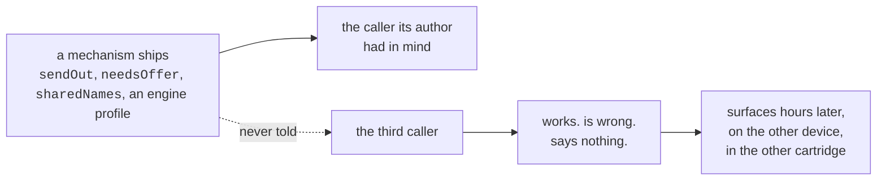

# What is proven, and what is not

[← crystal-pilot mobile](../README.md) · [Using it](USING.md) · [The interface](INTERFACE.md) · [Two devices](DEVICES.md) · [What is proven](PROVEN.md) · [Developing](DEVELOPING.md) · [The code](CODE.md)

The engineering log: what has actually been run and measured, what broke on
the way, and the two traps in the emulator core that cost the most time. Every
bullet here was watched happening rather than reasoned about.

---

## What has been run

Proven, and visible in [the screenshot on the front page](../README.md):

- a 2 MB Crystal ROM boots in the browser
- the symbol file parses to exactly the same symbols the Python version reads —
  58,456 of them from the build this was measured against, and the count is a
  property of that build rather than of either implementation: run both parsers
  over a newer `.sym` and they still agree with each other, at a different total
  with `wPartyMon2 - wPartyMon1 == 0x30` as expected
- **game state reads correctly**: `wMapGroup`/`wMapNumber` at `0xDCB5` return
  `24, 7` after the intro, matching the desktop pilot exactly
- synthetic input works — the intro was played through by the app, not by hand
- `wMapStatus == 2` distinguishes "the world is live" from "the party happens to
  be loaded", the same signal the desktop version needed
- ~~save states and battery saves are both available from the core~~ — **half
  of this was wrong, and nothing had ever called it to find out.** The battery
  save is readable, out of cartridge RAM, and is what `Download .sav` hands
  over. Save states can be *taken* — the library populates one once it has been
  started — but not put back: its `loadState` rejects even on its own saved
  states, so a state here is a snapshot you can never return to. That is why
  slots hold battery saves. See [Slots, and undoing a job](USING.md#slots-and-undoing-a-job)
- **a save this app wrote loads elsewhere**: saved in game, downloaded, opened in
  the desktop pilot under PyBoy, which read back the same Route 29 and
  `CYNDAQUIL Lv5 20/20` — then imported back in here, which loaded it
- **the collision map decodes correctly**: the same 48 tiles of PLAYERS_HOUSE_2F
  come out byte-for-byte identical to the desktop pilot's reading of the same
  room — two implementations, one in Python over PyBoy and one in JS over
  WasmBoy, agreeing exactly

- **a new game start to finish**: title screen, Oak's speech, your own choice of
  starter out of Elm's lab, and out to the grass on Route 29 in about a minute
- **a grind**: Lv5 to Lv7 in five battles, seven seconds
- **a hunt**: found a RATTATA after five encounters, running from the four it
  did not want

- **healing**: two places, and it works out which is nearer — Elm's computer in
  his lab, or the nurse in Cherrygrove's Pokémon Center — then comes back to
  where it was working with the party at full HP

### Catching, and the errand that gates it

**Catching is now proven too**, from a fresh ROM with nothing carried in:
starter, grind to Lv8 healing itself at Cherrygrove when it ran low, the egg
errand, five Poké Balls, back to Route 29, and `caught SENTRET Lv3 with 1 POKé
BALL` — party CYNDAQUIL and SENTRET, four balls left.

Getting there meant playing the errand the game actually gates balls behind. The
Mart wants a Pokédex; the only free ball on the ground is on Route 31, and the
road there is shut. Route 30's one-tile corridor north is filled by Youngster
Joey and two Rattata sprites, all three conditional on `EVENT_ROUTE_30_BATTLE` —
which is *clear* on a new game, so the objects are there until it gets set. It is
a deliberate roadblock, and returning the Mystery Egg is what lifts it.

Which makes Route 31 the long way round, because the same errand ends with
`giveitem POKE_BALL, 5` in Elm's lab, from a `coord_event` the player only has to
stand on. Mr. Pokémon's house is at Route 30 (17, 5), on the *east* side — the
half the roadblock does not touch. So `eggErrand` walks there, takes the egg,
heals, walks home through the rival battle in Cherrygrove, hands the egg to Elm
and steps onto the aide's tile.

None of that is navigable without the world graph, and most of it broke the first
time it was tried. What the errand taught, in order:

* **You cannot run from a trainer.** The pilot only knew how to flee, so it stood
  in the rival battle losing HP until something fainted. `wBattleMode` says which
  kind a battle is — 1 wild, 2 trainer — and trainers are fought now. Wild ones
  are still run from, because a walk that stopped to win every encounter would
  spend the party on Pokémon it never wanted.
* **A battle that has ended is not a battle that was won.** Whiting out ends one
  too, and reading that as a win let a grind report five straight victories with
  the party at 0 HP, then wake up in bed wondering why the map had changed.
* **A grind that cannot heal trains something to death.** Where a Pokémon Center
  *is* is map knowledge `tasks.js` deliberately does not carry, so the caller
  passes in a way to heal and the grind uses it instead of stopping.
* **Elm phones the moment you leave Mr. Pokémon's.** A script taking the controls
  reads as "refused", which a crossing treated as terrain and gave up on.
* **A doorway is not always across a room.** `through` walked with a budget sized
  for a lab; Mr. Pokémon's door is fifty tiles up a route, through grass.
* **`wCurItem` is written a frame after `wCurPocket`.** Acting on the stale value
  walked the cursor off the end of a one-item list — and the pack does not wrap,
  so DOWN past the last item sits on CANCEL forever.
* **The pack cannot open while text is still running.** `throwBall` was called
  straight after the encounter and pressed into the "wild SENTRET appeared"
  message, which reported as not being able to find the ball. `flee` had always
  waited for the menu; this had not.

### A second pass: the paths nobody had walked

A second pass, this time deliberately going after the paths that had never been
run rather than the one that had. Ten more, and the pattern in them is that the
happy path hid every one:

* **The grind could not sustain itself.** Pacing for an encounter wanders, and
  after a handful of battles the player is no longer standing in the grass -- so
  the next pace found nothing and the whole thing stopped after five battles
  claiming there was no grass, in the middle of a route covered in it. Worse, it
  wandered far enough to cross into Cherrygrove, where looking for grass is
  hopeless by definition. Grinding to Lv14 now takes 75 battles and recovers
  from wandering off four or five times on the way.
* **Healing stranded the grind it was meant to rescue.** `healUp` walked to
  Cherrygrove and stopped there -- a town, no grass -- so a grind that healed
  resumed in a place it could never find a fight. It walks back now.
* **A move with no PP was chosen forever.** The move menu does not open while a
  message is up, and the cursor reads 0 then; the code skipped move selection in
  that case and fell through to pressing A, which picked the first move -- the
  one with no PP -- producing the same message. Eighty-four "battles" in one
  grind were that single refusal going round. Confirming only when the cursor is
  actually on the intended move breaks it.
* **Out of PP was not a reason to heal**, though a Pokémon Center restores PP
  too, and the alternative is Struggle hurting the thing being trained.
* **A stalled grind spent its whole budget stalling.** Five unresolved battles in
  a row is a stall, not bad luck, and it stops now.
* **Stop did nothing.** The button sets a flag on `tasks`, and `bootstrap.js`
  never read it -- so during a bootstrap or the errand you watched it walk to
  Cherrygrove and back with no way out. Every long loop checks it now, and every
  walk is handed it so it stops between steps rather than at the end of a leg.
* **A stop was then reported as a failure** -- "could not leave Route 29 going
  RIGHT" -- which blames the map for a decision the user made.
* **The errand run twice walked the whole thing again and lied about it.** Forty
  seconds to Mr. Pokémon's and back, then "got POKé BALL x5" -- the same five
  from the first go. Its success test was "are there balls in the bag" rather
  than "did we gain any". The aide hands his over once, so having any at all
  means there is nothing to do.
* **The grind button never passed the healing hook it was given**, so the fix for
  healing existed and was wired to nothing.
* **`travelTo` reported "no way ... by edges"** using raw map numbers, after the
  graph had grown doors.

### A third pass: catching under pressure

A third pass went at catching under pressure -- filling a party rather than
taking one Pokémon -- and found that the single catch which had proved the
feature had been luck. Five balls could go in for nothing:

* **`menuIsLive` insisted on `wBattleMenuCursorPosition === 0`.** That register
  holds the action last chosen, not whether the menu is waiting: it is 0 until
  the first choice of a battle and keeps the choice afterwards. So the test
  matched only the opening turn of a battle and was false for every turn after.
  `awaitBattleMenu` therefore spent 150 presses and returned null, `flee` could
  not tell a refusal from an escape, and `watchThrow` could not see a Pokémon
  break free -- which is where the five balls went. Measured at a menu that was
  plainly live and taking input, it read 3. The 150-press ceiling in
  `awaitBattleMenu` had been raised from 40 to paper over this.
* **Then the fix over-corrected.** The cursor alone does not identify the battle
  menu, because the pack parks it at (1, 1) too -- so a ball in mid-air read as
  a fresh menu and the throw was abandoned while the game was still saying "used
  the POKé BALL". Which menu is *drawn* settles it: measured, the battle menu is
  34 items with its box at row 12, the pack is 5 items at row 1, and the pack
  mid-throw is 2 at row 0.
* **`wBalls` does not decrement until the battle ends.** A Pokémon can already
  be caught and the bag still read five. So `stats.spent`, computed from a
  mid-battle read, reported nonsense -- and an interim attempt to detect throws
  that never happened, by comparing ball counts, was built on the same false
  premise and had to come back out. Throws are counted as throws now, and every
  round's count matches the bag delta exactly.
* **Running out of balls mid-catch blamed the pack**, reporting it could not find
  a ball rather than saying it had used them all.

That left one thing that was the game being the game rather than a defect: a
full-health target genuinely resists a Poké Ball, and the pilot threw at
everything untouched. Three attempts, five balls, nothing caught. So it weakens
things now, which is the game's own tactic:

* `romdata` reads the **Moves** table out of the cartridge -- seven bytes an
  entry, effect at offset one and power at offset two -- because the point is to
  pick the *gentlest* attack. Leading with whatever is in slot one knocks out
  the thing being caught.
* Status moves are excluded by having no power at all, which is one half of the
  distinction: LEER would otherwise rank as the gentlest attack available and
  weaken nothing, forever.
* **Eleven moves lie about their power**, which is the other half. Gen 2
  computes their damage rather than scaling it, so it stores them at 0 or 1 --
  putting GUILLOTINE, HORN DRILL and FISSURE *ahead* of TACKLE when ranking
  ascending. Ask for the weakest damaging move and you get a one-hit KO. They
  are excluded by effect id, read out of the cartridge's own move table. This is
  not the same as "fixed damage": DRAGON RAGE really does store 40 and take 40,
  so it ranks correctly and stays in.
* **The pilot learns how hard it hits, and remembers it for the rest of the
  hunt.** A threshold on its own is not a safe place to stop -- against a Lv2
  RATTATA one swing carries it from above the line to zero, and a fainted
  Pokémon cannot be caught by anything. Measured: that is exactly what happened
  on the first version. So a knockout is itself a measurement, and every target
  afterwards whose HP is already inside that range gets thrown at rather than
  hit. Kept outside the per-encounter scope on purpose, because the one swing
  that cannot be guarded is the first one.
* Weakening spends no ball, so it is bounded -- otherwise a move that kept
  missing would loop for good with the ball budget never moving.

Result, from a fresh ROM in one run: **three caught, one ball each, no
knockouts**, then a grind of 46 battles won out of 46 with the party intact. An
earlier run caught four out of four for five balls. The same species before the
feature took five balls and caught nothing at all.

Two things had to be corrected on the way, both because a measurement disagreed
with what had been written down:

* Gen 2 does *not* mark fixed-damage moves with a power of 1, the way the first
  version of this assumed -- DRAGON_RAGE reads 40 and takes 40, so ranking by
  power sorts them about right anyway and no special case is needed.
* A chip that ends badly can leave the move menu open, and `menuIsLive` cannot
  tell that from the battle menu because they share the same box. The pack was
  then opened from inside the move list and the throw could not find a ball, so
  weakening now backs out before it throws.

### When the lead faints

Weakening also made a party bigger than one easy to have for the first time, and
that immediately turned up something that had been waiting all along: **the
pilot did not know what to do when the Pokémon on the field faints.** Gen 2 does
not offer a choice about it -- the lead goes down, the game asks "Which
POKéMON?" and waits -- and with a party of one it never came up, because the
battle simply ended. The first time a bigger party lost its lead, the pilot sat
in front of that prompt reporting a stuck battle for as long as it was allowed
to. Three separate things had to be right:

* **"No HP" and "no Pokémon on the field yet" read identically.** At "Wild
  PIDGEY appeared!" the battle mon is not loaded and both hp and maxHp are zero,
  so keying off hp alone fired at the start of every battle -- five stuck
  battles in four tenths of a second, having sent nothing out. It takes maxHp as
  well now.
* **That screen's cursor is not in memory anywhere I could find.** wMenuCursorY
  stays pinned at 1 on it, wPartyMenuCursor and wCurPartyMon never move, and
  diffing all 8 KB of work RAM across a press turns up 87 changed bytes with no
  index among them -- the arrow is drawn from sprite data. So it does not read
  the cursor: it steps down to the slot it wants, confirms, and checks whether
  something is actually on the field. Which is the better test regardless,
  because choosing a fainted Pokémon is *refused* with "There's no will to
  battle!" and no cursor reading would have predicted that.
* **The screen ignores the presses the battle menu takes.** At five frames every
  direction was swallowed, so every confirm landed on the fainted lead and the
  pilot was told no, repeatedly. It wants about twelve, *and* a pause between
  presses -- the prompt arrives with "CYNDAQUIL fainted!" still running and a
  direction sent into that is dropped. Pressed by hand with a gap between each
  one it worked first time, which is what pointed at the timing rather than the
  buttons.

### A fourth pass: the page itself

A fourth pass left the game logic alone and went at the page itself, which had
never been tested at all. The two worst things found all session were here:

* **Backgrounding the app killed the emulator for good.** The idle loop re-armed
  itself only from inside its own animation-frame callback, and a frame already
  pending when a page is hidden never arrives -- so the chain was simply lost.
  The loop died on the first background and the game stayed frozen ever after,
  including back in the foreground, where the only way out was a reload. It
  looks exactly like a crash and is not one: tasks kept working, because they
  step the emulator themselves. Measured: zero animation frames scheduled in
  three seconds by a page whose loop was supposedly running. It re-arms on every
  visibility change now, with a generation counter so ten transitions in a row
  leave one chain rather than ten -- checked, because two chains stepping the
  same core would be a worse bug than the one being fixed.
* **Any error in a task bricked the interface.** Each handler set a `running`
  flag, disabled its button and cleared both at the end -- which only happened
  if nothing threw. One exception and the button stayed disabled for good, the
  status sat frozen on "grinding to Lv13" with no error shown anywhere, and
  `running` stuck true so nothing else would start either. Indistinguishable, to
  the person holding the phone, from a task still working. The five handlers now
  share one `runTask` that owns the lifecycle in a `finally` and puts the error
  in the status bar; verified by making a task throw and watching the app carry
  on.
* **Tasks would run with no game started**, reporting "no way from map 0.0 to
  Route 30" -- honest, but not much help. They ask for a live world first.
* **The hunt button contradicted the screen.** Its label was only put back when
  something *had* been chosen and then stopped being available. Going indoors
  clears the choice and leaves the label reading "Nothing to hunt here"; coming
  back out to a route re-drew the four species but never took that back, so the
  button sat disabled directly under a list of things to hunt. Both the label
  and the enabled state are derived from what is chosen now, which is also what
  keeps `runTask` from lighting the button up after a grind with nothing picked.
* A step that never returns can no longer wedge the loop on its own either.

Verified working while looking, and worth saying so because each was a candidate:
the level stepper clamped to 2–100 (the stepper has since been replaced by
presets, for reasons in [The interface](INTERFACE.md)); keyboard input reaches the emulator
including two keys at once; the species list tracks the map and the in-game
clock; and a bag holding Ultra, Great and Poké Balls picks the Poké Ball — the
cheapest that will do, so a better ball is not spent on a Rattata by accident.

Two things went the other way and are worth recording as *not* bugs, because
both looked like one: the Catch button re-enables itself through `refreshBag`,
and the idle loop advancing nothing while the page is hidden is deliberate --
the animation-frame stand-in is clamped by the browser to about one tick a
second, which is there so the core's own waits finish, not to run a game.

* **Calibration can be confidently wrong, and that made crossings flaky.** The
  decode is checked against one tile — the one the player stands on — and one
  tile is not enough to pin an offset down. Step out of a door and the player is
  still *on* the warp mid-transition: the real offset does not match there, and
  one of the fallbacks can match by luck. `crossEdge` picks its candidate exits
  once, and taken during those few frames the edge it measured belonged to
  whatever map was still loaded, so every later attempt walked at tiles that had
  never been openings — failing without being wrong about anything it could see.
  The snapshot has to hold still now: same offset, same player tile, twice in a
  row. The candidates are also worked out after the approach rather than before
  it. Two failing crossings were caught in a log — both starting on a doorway,
  at Mr. Pokémon's and at the Pokémon Center — and both cross first time now,
  across two runs with no retries at all.
* **`findGrass` reported success from wherever it had been stopped.** Walking to
  grass walks *through* grass, so something jumps out on the way; it ran out of
  candidates and returned true standing three tiles clear of any. It checks the
  tile underfoot now.

## Nine audits, and how each defect was actually found

Everything above was watched happening. This section is the exception, and the
exception is the point of it: after the ROM-hack work shipped, nine passes went
looking for defects in code that already worked, and found twenty-six — plus
one a fix created on the way, which is in the table in italics because it is a
different kind of thing. None of them announced itself.

Six of those passes worked by **reading**, two by **measuring**, and the ninth
by **checking the claims the comments make**. Each change of method found what
the one before it was structurally bad at, which is the thread worth pulling
below.

The recurring shape is the same in all five:

Not one was a wrong line of code. Each was a correct mechanism wired to the
callers its author had in mind and not to the rest — and in every case the
mechanism was *younger* than the code that should have been reading it, which is
exactly why nothing failed.

| # | What was wrong | To see it happen | Found by |
| --- | --- | --- | --- |
| 1 | the engine profile reached `GameState` and none of the decisions made from it | one browser | reading |
| 1 | an unknown cartridge worked and explained none of its four absences | one browser | reading |
| 2 | `?title=` skipped the contract every other path went through | one browser | reading |
| 2 | the shared digest carried Crystal's wild tables, not the cartridge's | two devices | reading |
| 3 | the second press of *Watch* did nothing, and blamed the network | two devices | reading |
| 3 | *Join* failed in silence when the room could not open | two devices | reading |
| 3 | a tap-to-walk took the other device's pad away without saying so | two devices | reading |
| 3 | the digest went out before the title was known | two devices | reading |
| 4 | the battery was written into whichever cartridge record was there | two cartridges | reading |
| 4 | the kept save was installed into a cartridge that never wrote it | two cartridges | reading |
| 5 | the move list was read off the fainted lead, not the replacement | a party of two | reading |
| 5 | a knockout by the replacement was reported as a whiteout | a party of two | reading |
| 6 | fleeing never answered the "Which POKéMON?" prompt | a party of two | reading |
| 6 | nor did catching | a party of two | reading |
| 6 | three jobs described a whiteout as something else | a whiteout | reading |
| 6 | a grind walked for a Centre out of a battle it had not left | a stalled battle | reading |
| 6 | and paced there for ever if the Centre did not restore PP | a hack's Centre | reading |
| 6 | *and the fix for the prompt spun for ever* | a stubborn field | **a test, by hanging** |
| 7 | the two NIDORAN decoded to one name | a route with both | **measuring** |
| 7 | the map objects trusted an origin nothing checked | a hack's objects | measuring |
| 8 | a wrong START row was never closed before the next was tried | a wrong first guess | reading |
| 8 | the worker cached every same-origin GET, the ROM included | `?dev=1` and a worker | reading |
| 8 | and believed a captive portal's 200 | hotel wifi | reading |
| 9 | Stop was ignored for the length of a cutscene | pressing Stop | **checking a claim** |
| 9 | a thrown frame left a button held down for ever | a core that throws | reading |
| 9 | `saves.js` reached past the emulator wrapper | one browser | checking a claim |
| 9 | and a docstring said the app could not save | one browser | checking a claim |

Five things in that table are worth more than the individual rows.

**The last column is a ladder, and it is about situations rather than
hardware.** Everything reachable in the default one — one browser, one
cartridge, one Pokémon — was found first, then everything needing a second
device, a second cartridge, a second Pokémon. What it measures is how much of
the world you have to *arrange*, not how much you have to own: the fifth pass
needed no hardware at all, only a party with a corpse in slot one.

**Exactly one of the nineteen was caught by a check**, and only after the fix
had decided what to look for: the wiring group named the four modules still
importing constants that had just been deleted. One more was caught by a *test*,
and only because the test hung — the obvious `continue` for the party prompt
advanced nothing in a loop bounded by balls thrown. That is the honest weight to
give this repository's fifteen check groups and 145 tests: they hold a fix
down, and they catch the fix that is itself wrong. They do not find the fault.

**Measuring also rules things out, which is half of what it is for.** The
eighth pass put the world graph and the encounter tables through the same
treatment and found them exactly right: Route 29 really does trade PIDGEY and
SENTRET for HOOTHOOT after dark, entry for entry with the disassembly. One
anomaly looked like a bug for about a minute — Route 29 reporting a *third*
connection, north, where `world.js` says it produces two — and map 5.9 turned
out to be Route 46, which genuinely adjoins it. The module was right and its
note was merely partial. An anomaly is not a fault until it is checked.

**And the last column is the seventh pass's whole lesson.** Reading found
sixteen defects and could not have found the last two, because neither has a
*shape*. `decodeText` handles two letter ranges, the digits, a space and a
ligature and falls through to `?`; read it and it looks finished. `occupied()`
subtracts four and says in its own comment that the four is checked. Faults like
that are invisible to a reader and obvious to twenty lines that put the
cartridge's real data through the real code and print what comes out wrong —
which is how five species names and twelve item names turned up at once, having
survived six passes. It is now the cheapest audit here, because the cartridge is
already sitting in `dev/`.

**The two worst were silent data loss**, and both were doors the app opens by
itself. Every door a *person* opens was already locked and had been for
versions: the handoff refuses a room save whose tag differs, `loadSlot` refuses
a slot's, `describeSlot` draws *from a different ROM* where a date would go.
Both pass-four defects are on paths nobody presses — a record written inside
`install`, a battery restored at startup before anyone has touched anything. The
checks went where somebody was visibly making a choice, and not where the app
made the choice for them.

**Passes five and six are both sequels to
[When the lead faints](#when-the-lead-faints)** above, which is the single
richest source of defects in this log. `sendOut` was built there and works. What
it never reached, across two passes, was everything downstream of it: four
places that spell *the Pokémon on the field* as `party[0]`, and two of the three
loops that drive a battle, neither of which answered the prompt at all. Fleeing
spent its 150 presses hunting for a battle menu that was never coming and a hunt
stopped on *could not run from a PIDGEY*, with a healthy Pokémon in slot two.
There is an `onField` and a `coverFaint` now, so there is somewhere to change
each of them next time.

**The sixth pass is a different family from the first five.** Those were
about *identity* — which cartridge, which Pokémon, which device — and every one
was the pilot reading the wrong thing. The sixth went at the loops those reads
sit inside, and nothing there is misread: a prompt nobody answers, a branch
tried in the wrong order, a sentence that names the wrong event, and two loops
that terminate only by assumption. One of those assumptions is *a Pokémon Centre
restores PP*, which is true of Crystal and is not a fact about cartridges in
general — and one of three rungs on the ladder above that no cartridge on this
machine can produce.

**The eighth pass found a third family: a promise in a comment that nothing
kept.** All three of its defects are places where a sentence states the intended
behaviour and no code implements it — *a wrong guess opens the pack, which is
recoverable* (nothing recovered), and *the ROM and .sym are never in this cache*
(with `?dev=1` they were). That is a particular hazard **here**, because this
repository's comments are unusually load-bearing: a file that explains its own
reasoning at length reads as a description of what the code does, and an
aspirational sentence is indistinguishable from a descriptive one. Its last two
are also the first defects in eight passes that no test here can reach — a
service worker wants a browser and a secure context — so what is checked is the
path arithmetic and the behaviour is reasoned about, which the code walkthrough
says rather than implies.

**The ninth pass made the eighth's finding into a method, and then into a
check.** If a comment says *never*, *always* or *every*, it is a claim, and a
claim can be tested — so the pass was a grep for those words across every module
and then an afternoon of asking. Two claims held: `remember.js` really does put
every storage access through one accessor, and `taskbase.js`'s cancellation
really does reach every loop in *its own* family. Two did not, and the second is
the one worth remembering: `gb.js` opens with *the emulator, wrapped so the rest
of the app never touches WasmBoy directly*, and `saves.js` was calling
`gb.core._getCartridgeInfo()` and `gb.core.loadROM(...)`.

That sentence is now `check-app`'s fifteenth group. **A promise that can become a
check should; the ones that cannot — a service worker's behaviour, a cutscene's
length — should say so out loud instead.** Nine passes in, the remaining defects
are less in the code than in the distance between what it says about itself and
what it does, and that distance is measurable in one place now.

**The seventh found the one that was hurting people now.** The two NIDORAN
decoded to the same string, so the species picker drew two identical chips and
hunting for the one you picked stopped at the other; Route 35 and Route 36 both
carry the pair. Nothing about it needs a hack, a second device or an unusual
situation — only a route with both on it, and a person who wanted a particular
one.

## The part that had to be redesigned

The desktop pilot hangs its whole design on CPU hooks: the game's own routines
announce when they want input, so `BattleMenu` firing *is* the signal that the
battle menu opened. No browser Game Boy core offers breakpoints.

So the same questions are answered by watching memory instead:

| Question | Hook (desktop) | Polled address (here) |
| --- | --- | --- |
| is the battle menu up? | `BattleMenu` | `wMenuCursorX/Y` become 1..2 while `wBattleMenuCursorPosition` is still 0 |
| is the move menu up? | `MoveSelectionScreen` | `wMenuCursorY` is 1..4 during a battle |
| is a script running? | — | `wScriptMode != 0` |
| is the world live? | — | `wMapStatus == 2` |

What carries over unchanged is the hard-won lesson underneath: **read the live
cursor and step toward the target**. Gen 2 menus wrap, so counting presses from
an assumed starting position silently picks the wrong thing.

## Two traps worth knowing

Both cost real time here, and both fail quietly rather than loudly:

1. `_getWasmMemorySection(start, end)` does not reliably honour its range — it
   was observed returning the core's entire ~10 MB linear memory instead of the
   32 KB asked for. Index that as though it were the slice and every read is
   offset, producing plausible-looking rubbish rather than an error.
2. `_getWasmConstant('WORK_RAM_LOCATION')` returns `undefined` until a ROM is
   loaded. Fetch it during `config()` and every later read is silently empty.

`gbcore/gb.js` guards against both.
