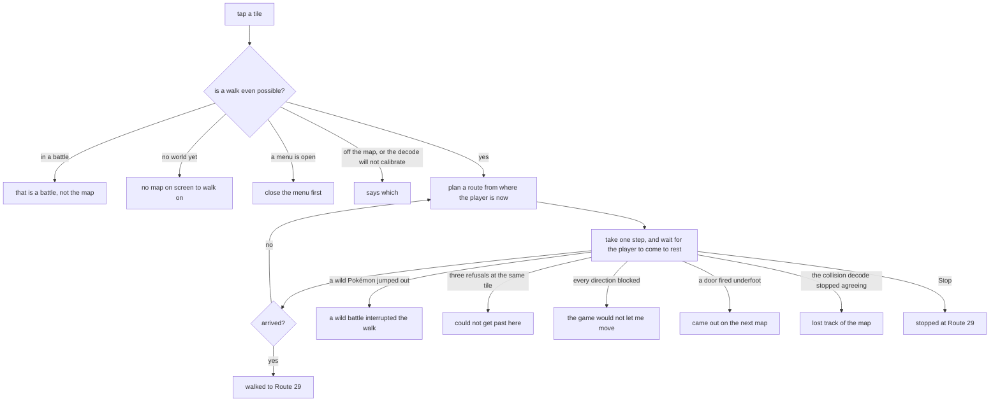
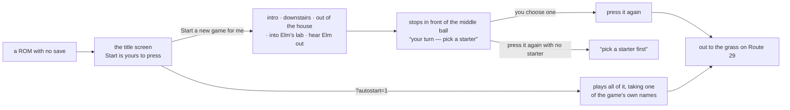

# Using it

[← crystal-pilot mobile](../README.md) · [Using it](USING.md) · [The interface](INTERFACE.md) · [Two devices](DEVICES.md) · [What is proven](PROVEN.md) · [Developing](DEVELOPING.md) · [The code](CODE.md)

How to play it by hand, how to send the pilot somewhere, and where your save
goes. For what the screen is made of rather than what it does, see
[The interface](INTERFACE.md).

---

## The first thing it asks

The app opens on one question — *what brings you here* — because there are three
answers and only one of them wants a file picker.

| door | what you need | where it takes you |
| --- | --- | --- |
| **I have the game files** | a `.gbc` and a `.sym` | the picker, then the game and the pilot |
| **Watch my other device** | five characters, and nothing else | the other device's screen, and its pad if it offers it |
| **I'm just looking** | nothing | what this is, and why it needs files only you can build |

The middle one is worth knowing about even if you have the files, because it is
the one people miss: **a device that is only watching needs no ROM.** Not a
smaller one, not a shared one — none. Load nothing on your phone, type the code
your laptop is showing, and the game appears on it.

If your files are already kept from a previous visit the question is never
asked; the app opens on the game, as it always has. Every door goes back in one
tap, so guessing wrong costs nothing.

To get the code: on the device that *has* the game, open Settings (the ⚙ in the
header) and press **Share**. It shows five characters. Type those on the other
device and press **Join** — then **Watch** when the button appears. What travels
and what never does is set out in
[Two devices, one game](DEVICES.md#what-leaves-the-device-and-when).

### What the two pickers refuse

Both file pickers check what they are given before the app builds anything on
it, and both say which check failed rather than failing later. The gates are
different because the two files fail differently — a wrong `.gbc` will not boot,
and a wrong `.sym` boots fine and then reads nonsense.

| you picked | it says | why |
| --- | --- | --- |
| a `.gbc` that will not open | *could not read NAME* | the phone handed back a file it cannot currently read. Usually an iCloud or Drive file that has been evicted with no network — open it in Files first |
| something that is not a cartridge | *NAME is not a Game Boy ROM* | the Nintendo logo at `$104` is missing, or the file is under 32KB. Every Game Boy ROM carries that logo; nothing else does |
| a `.sym` from somewhere else | *does not look like an rgblink .sym file* | no line reads `BB:AAAA name`, which is the only format rgblink writes |
| a `.sym` from another build | *missing N expected symbol(s)* | the names this app reads are not in it. Said now rather than mid-grind an hour later |
| a `.sym` with reads outside work RAM | *N symbol(s) this app reads are outside work RAM* | see below |

That last one is the quiet one, and it is the reason the gate is not simply
"are the names there". Everything the app knows about the running game comes
from one snapshot of work RAM, `$C000–$DFFF`, and a read reaches into that
snapshot by subtracting the base — so an address **outside** the window does not
fail, it returns `undefined`. Measured, with `wBattleMode` moved into HRAM:
`inBattle` became `undefined !== 0`, which is *true*, and the pilot believed it
was in a battle it could never leave. No message, no clue, and by the time
anything goes wrong the address is gone and only the rubbish it read is left.

A hack can legitimately move a variable there. So the table is checked for
placement as well as presence, and the two halves are strict about different
things: a name the app would like but cannot find only costs the feature that
wanted it — a hack that renamed its wild tables loses the species picker and
keeps everything else — but an address that cannot be read is never usable,
whoever asked for it.

## Controls

Eight on-screen buttons: the D-pad, A, B, Select and Start. **Press and hold** —
Gen 2 turns you before it walks you, so a tap in a new direction only turns you,
and each tap after that moves a single tile. Holding walks.


That is the app mid-hand-off: a ROM booted, the intro left alone for the player,
and LEFT held down — which is what the lit key means.

**The screenshots in this repository predate two rounds of layout work**, so
they show an older arrangement: the pad beneath a speed slider rather than at
the bottom of the page, four action buttons where there is now a ranked list of
offers, no status bar between the screen and the pad, and the old palette. The
controls themselves are unchanged. They want retaking on a real device, which is
also the only place the emulator picture can be captured — a backgrounded tab
does not paint the canvas, so a screenshot taken from a test harness has a black
rectangle where the game should be. The held state is read back from the
emulator's own set of held buttons, so pressing `Z` on a keyboard lights up the
same A button a thumb would.

The pad is at the bottom of the page and stays there. It and the screen are the
machine; everything else opens over them and closes again, which is why the
whole app now fits one viewport with nothing to scroll — see
[The interface](INTERFACE.md).

There is no TAB button. On the desktop pilot, TAB opens an in-game menu because
the only surface there is the emulator window; here the pilot's controls are
behind the status line, one tap away, so the game never has to be interrupted to
reach them. While a job is running the pad dims and stops taking input — it
would be fighting the pilot for the same joypad — and Stop sits on the status
line for as long as there is something to stop. The same dimming means "this pad
is not yours" when you are watching another device's screen in view-only mode;
see [Two devices](DEVICES.md#watching-it-on-the-other-device).

A keyboard works on the same page, which is what makes it testable on a desktop:

| Key | Button |
| --- | --- |
| Arrow keys | D-pad |
| `Z` or `A` | A |
| `X` or `S` | B |
| `Enter` | Start |
| `Shift` or `Backspace` | Select |

Buttons release on `pointerup`, `pointercancel`, `pointerleave` and on window
blur, so a direction cannot get stuck down after your thumb slides off the
button or you switch apps mid-press.

## Tap to walk

Tap anywhere on the screen and the pilot walks there.


That is a walk in progress: the ring is the tile that was tapped, the player is
five steps into the route, and the status says where it is going and where it
has got to.

The ring is placed from the *camera*, not from the player's coordinate, and the
difference is visible in that shot — it is drawn between tile boundaries because
the screen is mid-scroll. Measured frame by frame, the camera starts sliding at
frame 11 of a step and has moved the full 16 pixels by frame 22, but `wXCoord`
does not change until frame 23. A marker positioned from the coordinate
therefore holds still for almost the whole of every step while the world slides
out from under it, which looks exactly like the destination drifting away.
`wPlayerBGMapOffsetX/Y` is the camera itself and moves smoothly, so the marker
stays on its tile.

The overworld is drawn in 16×16 tiles, so the 160×144 screen is 10×9 of them and
the player is always the one at (4, 4) — the camera keeps them centred rather
than clamping at map edges. That makes a tap a map coordinate, and `gen2/collision.js`
turns the map into something you can search: Gen 2 keeps the loaded blocks in
`wOverworldMapBlocks` and the per-quadrant collision values in ROM at
`wTilesetCollisionAddress`, which together give the collision byte for any tile.
Ledges are one-way, so a route never plans a hop it could not walk back.

The decode is checked against the game rather than trusted. `wPlayerTileCollision`
is the collision of the tile the player is standing on, so every step compares
the two and stops if they disagree — a wrong decode does not throw, it silently
paths through walls. As a cross-check the same 48 tiles read here match the
desktop pilot's reading of the same room exactly.

Two things had to be learned again in the browser, because each produced a walk
that ended somewhere plausible but wrong:

- **Coordinates change when the game commits to a step, not when it finishes.**
  Returning then reports a tile the player has not reached, and the next press
  lands mid-stride — so every step performed the *previous* one. Steps now wait
  for the player to come to rest.
- **A path is a plan, and plans go stale.** Following one blindly meant a single
  missed step put every later step in the wrong place while the walk still
  reported success. The route is re-planned from where the player actually is,
  every step.

Tapping a door, staircase or cave walks onto it and goes through: those fire the
moment you step on them, and the transition takes a few frames longer than the
step, so the walk waits for it and reports the map it came out on rather than
the tile it left from. A tap is still a tile on the map in front of you — it
will not route you through a door to somewhere on another map.

It also distinguishes the ways a walk can end, because they mean different
things — and it says which one, rather than "gave up":



The one worth singling out is *the game refusing input at all* — walk downstairs
into Mom's script and every direction is blocked, which is not the map's fault
and should not be reported as one. Re-planning every step is what makes the
loop in that diagram safe: a plan is a plan, and a single missed step would
otherwise put every later step in the wrong place while the walk still reported
success.

## Starting a game is yours, not the pilot's

If the ROM has no save, the app boots it, hands you the buttons, and waits. It
does not play the intro for you.

That is deliberate. An auto-pilot can only answer a prompt by pressing A, and
the intro's NAME menu defaults to NEW NAME — which opens the letter grid, where
pressing A repeatedly spells `AAAAA`. Your character, your name. Until the world
is live the pilot has nothing to offer, and the offers list says so: the bar
reads *Press Start, then play until you are out in the world*, and the list fills
itself in the moment `wMapStatus` says there is a world to walk in.

Automated runs have nobody to press A, so they opt in with `?autostart=1`, and
even then they take one of the game's own names rather than typing one —
CHRIS/MAT/ALLAN/JON, or KRIS/AMANDA/JUANA/JODI, the four presets below NEW NAME,
which the game stores with no letter grid at all. The pilot steps the cursor down
to the first of them and confirms.

That menu is recognised by its **shape** rather than by its cursor: five items,
ten columns wide, drawn at the top of the screen. The cursor still holds
whatever the gender prompt left in it until the menu is actually drawn, so
reading the cursor picks a name before the menu exists. And the pick is latched
once, because nothing clears `wMenuData` when a menu closes — without the latch
the intro loop sits there re-choosing a name that has already been chosen,
forever.

The same reasoning applies one step further in, which is why **Start a new game
for me** is two presses rather than one. The first plays the intro, walks
downstairs, out of the house and into Elm's lab, hears Elm out so the three
balls go live, and stops with you standing in front of the middle one. Which
starter you want is the one real decision in the opening; a tool that plays the
boring parts should hand that back rather than answer it. The second press walks
out to the grass once you have chosen, and refuses with *pick a starter first*
if you have not.

**And the Pokémon keeps the name the game gives it**, which for twenty-eight
passes it did not. Taking a starter asks two questions — *Do you want CYNDAQUIL,
the fire POKéMON?*, where yes is right, and *Give a nickname to the CYNDAQUIL
you received?*, where no is — and pressing A through both walked into the letter
grid and spelled `AAAAAAAAAA`. Exactly the failure this section warns about for
*your* name, in the one place it was happening unwatched. The pilot presses B on
that question now, which is the game's own way of saying "keep the species
name", and nothing in this app could see the difference until it could read the
party screen.

It also tells you which ball is which, because the game does not: they are three
identical sprites, and the name only appears once you are already talking to
one. Left to right on the table is Cyndaquil, Totodile, Chikorita — read off
`ElmsLab.asm`, where they sit at x = 6, 7 and 8, and confirmed by picking each
one.

`boot.run(name)` still plays straight through when a starter is named, which is
what the automated runs use; `boot.run()` with nothing named is the hand-over.



The route is the desktop pilot's, and each leg says which map it expects to land
on rather than assuming, because a bootstrap that drifts off course ends up
mashing A at a wall. About a minute for the two presses together, and the point
of it is that everything else needs a party to be worth running.

## Grinding, and what the grass here can give

Pick a level, press Go, and the pilot fights wild Pokémon until the lead reaches
it. The presets are `+2`, `+5`, `Lv10` and `Lv20`, and the two relative ones are
relative to the lead's own level at the moment you press them.

**The row says what the grass here actually produces** — *CYNDAQUIL Lv15 → Lv20
· here: Lv2–3* — because that is the number that decides whether the job is a
minute or an afternoon. It is read out of your ROM's encounter table, which
stores a level beside every species and had never been read for it.

Route 29 gives **Lv2–3**, Route 30 **Lv3–4**, Route 31 **Lv4–5**. So a Lv15 Pokémon aimed at
Lv20 on Route 29 is fighting things worth almost nothing: measured, thirty-two
wins out of thirty-five battles bought two levels and ended in a knockout. When
your lead is above everything the map offers, the hint says so — *grinding here
will be slow — everything is below your lead*. It is not a refusal. It is the
fact, stated before you spend the afternoon rather than after.

A map with no grass says nothing about levels at all, rather than guessing: *no
wild Pokémon appear here* and *they are Lv2–3* are different answers and only one
of them is about levels.

**And when here is slow, it says where to go instead** — *slow here — Route 31
gives Lv4–5, three maps away*. That line is two things the app already knew
meeting for the first time: the levels each map's grass gives, read out of your
ROM, and the list of named maps the walk can reach from where you stand. A place
is worth naming when its grass tops out at or above the level being trained,
because that is the difference between a battle that pays and one that does not;
among those, the shortest walk wins. Measured on Route 29 with a Lv5 lead:
Route 30 gives Lv3–4 and is two maps away, Route 31 gives Lv4–5 and is three —
and Route 31 is the one named, because Lv4 is not enough for a Lv5 Pokémon.

When nothing reachable would be better it says only that, and names nowhere.
Pretending otherwise would be worse than saying less.

**It would rather you waited than walked.** The encounter table has three
blocks — morning, day and after dark — and the pilot now reads all three rather
than only the hour it is. Where another hour of the grass *under your feet* tops
out higher, that is the line you get: *slow here — this grass gives Lv6–9 after
dark*, and it comes ahead of any walk, however short, because waiting costs
nothing to get to.

On Crystal you will never see it, and that is worth knowing rather than
discovering. Measured on the cartridge: all three blocks of Route 29 give Lv2–3,
all three of Route 30 give Lv3–4, and all three of Route 31 give Lv4–5. **Only
the species change after dark, not the levels.** So on this game the walk is
still the answer; the line is there for a hack whose night grass is stronger, and
it is the same reading either way.

**It swings the hardest move it has, and heals when nothing left can win.** The
pilot reads your cartridge's move table, so it knows Razor Leaf hits harder than
Tackle and that Growl hits nothing at all. It used to take whichever move was
first in the list with PP left — which, once the first one ran dry, meant
grinding with Growl: measured, five battles in a row going nowhere and a party
at 3 HP out of 36, with a 55-power move untouched in slot three. And "out of PP"
now means out of PP that can actually win, so a Pokémon left with only Growl and
Reflect goes to a Center instead of standing there.

**A new move at a level-up is declined.** A Pokémon that already knows four
moves and levels into a fifth is asked whether to delete an older one, with
*yes* under the cursor — and the pilot presses a lot of buttons. Measured: a
Chikorita reached Lv15 and came out of the battle with Tackle replaced by
Poisonpowder, which nobody chose. The pilot now says no. It cannot know which of
your four moves you want, a declined move can be taught by hand later, and a
deleted one cannot.

Saying no takes **two** answers, which is the part that took two goes to get
right: the game then asks whether to *give up on learning it*, and that one
wants yes. Answering no to both loops between them, and a stray press
eventually lands on the delete prompt anyway — measured, four declines in a row
and the move replaced regardless.

**Evolution is allowed, and said out loud.** Grinding past an evolution level
evolves your Pokémon, which is what you would expect and what the game does.
What it used to do silently, it now reports — *CHIKORITA evolved into BAYLEEF* —
because every line after that point uses the new name, and a rename nobody
mentions reads as the pilot losing track of what it is training.

Measured end to end: **Lv5 to Lv17 in 192 seconds, 159 battles, 158 won, one
knockout healed through, one evolution, and all four original moves still in
place.**

### It drinks the potion mid-fight, rather than after

For twenty-three versions the pilot chose FIGHT every turn until something
dropped. A knockout costs half your money and puts you back at a Pokémon Center,
and the pilot was carrying potions through every one of them.

Now, when the Pokémon on the field falls under about a third of its HP, it opens
the pack and uses the cheapest thing that will mend it — a berry before a potion,
a potion before a super potion — and that *is* the turn, so the fight carries on
from there. Three items per battle at most: a fight that needs four is a fight
you should have run from.

**Measured on Route 29, grinding a Cyndaquil from Lv5 to Lv14:** 132 seconds, 79
battles, **79 won, no knockouts**, three items spent inside battles and three
walks to Cherrygrove. The same grind before this could do it, and used to come
back with a knockout in it.

**Out of PP is still a walk, and it has to be.** A potion mends HP and nothing
mends PP except a Pokémon Center, so when the pilot has no move left that can
win anything it goes. That is not a limitation to work around: it is the reason
the job knows when to stop asking.


**A knockout is healed and carried on from.** Grinding a Pokémon well above the
local wilds means it will eventually go down, and the pilot is handed a way to
heal and a budget of twelve trips. It used to use neither here: it reported *the
whole party fainted* and handed the job back, three runs in a row, with all
twelve trips unspent. Now it walks to a Center, comes back and keeps going, and
stops only when there is no way to heal or the budget is gone. The count of
knockouts comes back with the other numbers, because each one costs half your
money.

That give-up had a reason attached and the reason was wrong. The code said the
game had already moved you to a Pokémon Center — measured, it had not: the
player was standing on Route 29 with a fainted Pokémon and 0 HP.

## Hunting

Pick a species and the pilot walks the grass until it turns up, running from
everything else, then hands you the battle.

The list is only what that route has **at that hour**, which needs two things
the phone does not have a disassembly for. Both come out of the cartridge
instead: species names from `PokemonNames`, and the encounter tables from
`JohtoGrassWildMons`, whose layout is three blocks of seven — morning, day,
night. Checked against the desktop pilot's reading of the same tables: Route 29
gives HOPPIP, PIDGEY, SENTRET, RATTATA in the morning and HOOTHOOT, RATTATA
after dark, entry for entry.

Grass only, deliberately. The pilot walks; it does not surf, so a route's water
table is full of Pokémon it could pace the grass all day without meeting.

### The clock takes chips away, and now it says so

The list is rebuilt whenever the map changes **or the hour does**, because those
are the two moments *is it here?* has a new answer. Which meant a chip could
vanish on its own: pick HOOTHOOT on Route 29 at night, come back at noon, and it
is simply gone. Nothing was wrong and nothing was said, and it is the one change
to that list nobody made.

There is a line under the chips for it now. It reads *PIDGEY is here in the
morning, not now* when the clock has just taken your quarry, and *also here:
HOOTHOOT after dark* when it has not — two named, then *and 3 more* if the grass
has that much in it, and nothing at all where the hours are the same, which on
most maps they are not.

For four versions this paragraph ended *"the clock is the game's own, which is
the real one, so this is advice about your evening rather than something the
pilot can hurry along."* That was written down as a fact, never measured, and
**it is wrong** — the game's clock is an offset it keeps in your save, and the
pilot can move it. See [reaching the hour the grass is
hiding](#reaching-the-hour-the-grass-is-hiding).

Measured on Route 29 in the morning: the chips read HOPPIP, PIDGEY, SENTRET,
RATTATA with *also here: HOOTHOOT after dark* below them; after dark they read
HOOTHOOT, RATTATA, and with PIDGEY still chosen the line read *PIDGEY is here in
the morning, not now*.

**NIDORAN♀ and NIDORAN♂ are two chips, not one.** They read the same until the
character decoder learned the rest of the cartridge's alphabet — both came back
`NIDORAN?`, so Route 35 and Route 36 offered a pair of identical buttons and
hunting for the one you tapped stopped at the other. Four other species were
merely misspelt: FARFETCH'D, HO-OH and MR.MIME lost their punctuation the same
way. If you have a saved hunt from before v130 that reads `NIDORAN?`, pick it
again.

Catch does the same walking and then throws balls, counting them **out of the
bag** rather than trusting a tally — the two coming apart is the failure worth
catching, and the desktop pilot shipped exactly that bug once, reporting two
balls while three left the bag. It refuses up front if the party is full, since
the sixth catch would go to the PC. The nickname prompt is answered *no*: it
defaults to yes, and yes opens the letter grid, where anything that can only
press A spells AAAAA.

The species list is empty on a cartridge whose symbol file has no wild table at
all — a hack that renamed or dropped `JohtoGrassWildMons`, say. Hunting and
catching are the only two jobs that need it, so they are not offered and the log
says why; everything else works, because everything else reads the cartridge.

Item names come out of the ROM too, and they are not laid out like the species
names: `PokemonNames` is a fixed-width table, `ItemNames` is packed with `@`
between entries. Reading it at a stride drifts a character further out every
entry — ULTRA BALL came back as `LTRA BALL`, GREAT BALL as `AT BALL`.

Hunting is watched working: with a starter in tow on Route 29 it found a RATTATA
after five encounters, running from two PIDGEY and two SENTRET on the way. So is
catching, once `eggErrand` has been round for the balls.

Two bugs surfaced while measuring that, both from walking into people:

* **A single refused step could end a walk.** A tile that refused went into the
  avoid set for good. Where the only way through is one tile wide — Route 30's
  corridor north — banning it made the goal unreachable, so the walk gave up
  before the three-refusal counter could notice it was the same obstacle twice.
  Planning now falls back: around the obstacles, then without the object list,
  then without the refusals.
* **The collision map is terrain only**, so an NPC read as open floor and every
  plan walked into them. `CollisionMap.occupied` now reads `wMapObjects` — its
  coordinates are stored four higher than the map's own, checked against the
  player — and those tiles are preferred-against rather than treated as walls,
  because an object hidden by its event flag still has an entry. Its output
  matches the disassembly's `object_event` lists on Route 29 and Route 30, in
  order.

### And it tells you what the grass gave instead

A hunt or a catch that spends its whole budget used to report the count and
nothing else: *saw 200 encounters without catching SENTRET*. The pilot had been
counting every species it ran from the whole time, so both now finish the
sentence — *— this grass gives PIDGEY x8, RATTATA x3* — and the line under the
picker says the same thing in full. It is usually the answer to the question the
failure raises: you are on the wrong route for what you asked for.

Until the twenty-eighth pass only **Hunt** did this. Catch ran the same walk
through the same grass and threw the tally away.

## Reaching the hour the grass is hiding

A third of Johto's grass is behind the clock. HOOTHOOT is on Route 29 after
dark and simply not there at noon, and until now the app could tell you that
and nothing else.

The **Wait** row appears when the hour is hiding something here, and it carries
two buttons:

```
⏱  Wait     HOOTHOOT after dark                [Skip] [Wait]
```

It names the species you asked for if this map has it at another hour — the
same fact the line under the chips prints when a chip disappears — and
otherwise the hour that brings the most species this one does not, as *3 more
after dark*. Where the grass is the same all day there is no row.

**It is the last row on the list, deliberately.** Every other job runs the game
too, and running the game is the whole of what waiting does — so a grind is a
wait that comes back with levels, and this is only worth pressing when there is
nothing else to do where you are standing. *Run the list* follows the same
order, which means it will grind, duel and tidy up first and wait last, and
then the species it was waiting for is in the grass.

### Skip: move the game's clock

This is the quick one, and it works whatever your emulator does with time.

Gen 2 does not read the hour straight off the cartridge's clock — it adds an
offset that lives in **your save**, which is how the game lets you set the time
on hardware whose clock it cannot write. Skip edits that offset, re-seals the
save's checksum, and loads it back.

**What it costs is a restart.** Putting a save into the cartridge reloads the
ROM, so the pilot saves the game first and everything after that last save is
gone — which for a Skip pressed on its own is nothing, because saving is the
first thing it does. Afterwards it reads the clock back out of the game and
tells you what the game says, rather than what it meant to do.

It moves you by whole hours, lining the earliest hour you could be at onto the
start of the hour you want. That lands correctly most of the time and can fall
one block short — night is ten hours long and morning is only six — in which
case the row simply offers the rest and you press it again. Two presses at
worst.

The button is not there at all on a cartridge whose symbol file does not name
its time-of-day table, because then the app does not know when night starts and
will not guess.

### Wait: run the game to the hour

The patient one, and it keeps everything — nothing restarts, nothing is saved,
you can Stop at any point.

**The button says what it will cost you**, once the app has seen this device
run frames long enough to time it:

```
⏱  Wait     HOOTHOOT · night          [Skip] [Wait 13m]
```

That is a worst case rather than a guess, and it is made of two things the app
actually knows. The hours are exact: it reads which hours are night out of your
cartridge, and it knows which third of the day it is in, so *somewhere between
one and eight hours* is arithmetic rather than estimation — the number on the
button is the eight. The minutes are measured: the game counts its own time one
frame at a time whatever speed those frames arrive at, so an hour of game time
is 216,000 frames on any machine, and the only unknown is how fast **your**
device steps them. The app times that while it works.

Which is why the same wait is about a quarter of an hour on a laptop and closer
to three quarters on a phone, and why the button says nothing at all until
something has run — a number before then would be a guess, and a number on a
screen is believed.

Afterwards the job reports what it *actually* took, in game hours and in
minutes of yours, which is the only way that estimate ever gets checked.

It runs the game as fast as your device manages and watches the clock. Whether
*that* moves the hour depends on your emulator rather than on the cartridge, so
the job tells you which it turned out to be:

| it says | what happened |
| --- | --- |
| *it is night — 3.4h of game time in 2m* | the clock followed along; you are done |
| *still day after 10h of game time in 16m — this cartridge's clock does not follow the pilot* | press **Skip** instead |
| *the game did not advance at all* | nothing was running — paused, or stuck |

It gives up after **the longest wait your cartridge's own table allows, plus
two hours** — ten, if you are waiting for night from the daytime. That number
is chosen so that reaching it means something rather than being a timeout: a
clock the pilot could hurry along would have got there by the longest wait
there is.

Neither button takes an undo point — a clock change moves the time and nothing
else, and a slot taken before it would restore you to a moment whose only
difference is the one thing a save cannot carry back.

### Setting the clock from a computer

`tools/clock` does the same edit outside the app, against a `.sav` in `dev/`:

```bash
tools/clock                 # which hours are morning, day and night
tools/clock --save          # the clock offset your save is carrying
tools/clock --shift 8       # eight hours on, written to a new file
```

It never writes over the file it read, and it refuses a save whose checksum
already disagrees with its bytes.

## Catching with a full party

A caught Pokémon goes to the box when you already have six, and the pilot now
knows that. It reports where it went:

> **caught PIDGEY with 1 POKé BALL — sent to the box**

For five versions the app refused to try, on the reasoning that it could not
tell a boxed catch from one that got away — which was true, because the party
is the only thing it was watching and the party does not grow. It reads the
game's own message now: *"PIDGEY was sent to BILL's PC."*

The refusal still exists for a cartridge nobody has described, because that
phrase is written down per title, the same way the healing items are. It says
which fact is missing rather than pretending the job is impossible.

## The Pokédex: what it is made of, and what it will become

Tap a Pokémon in the party list and it opens.

```
CYNDAQUIL Lv13 ▴                                 35/37
 FIRE
 stat   now  DV  rolled          trained
 HP      37   2  ▬▭▭▭▭▭▭▭▭▭      ▬▭▭▭▭▭▭▭▭▭
 Atk     22  10  ▬▬▬▬▬▬▭▭▭▭      ▬▭▭▭▭▭▭▭▭▭
 Def     18   7  ▬▬▬▬▭▭▭▭▭▭      ▭▭▭▭▭▭▭▭▭▭
 Speed   25   3  ▬▬▭▭▭▭▭▭▭▭      ▬▭▭▭▭▭▭▭▭▭
 Sp.Atk  23  12  ▬▬▬▬▬▬▬▬▭▭      ▭▭▭▭▭▭▭▭▭▭
 Sp.Def  19  12  ▬▬▬▬▬▬▬▬▭▭      ▭▭▭▭▭▭▭▭▭▭
 knows  TACKLE 35 · LEER 30 · SMOKESCREEN 20 · EMBER 25
 next   QUICK ATTACK at Lv19 — 6 levels away
 becomes QUILAVA at Lv14 — 1 level away
 caught at Lv5 in NEW BARK TOWN at night
 friendship 70 · medium-slow growth
```

Everything there comes off your own cartridge — the party entry for the numbers
about *this* Pokémon, and the ROM's own tables for what the species does. None
of it is shipped with the app, so it is right for the build you are driving
even if that build is a hack that changed it.

**The two columns are the two things that made the stat.**

- **DV** — a number from 0 to 15 the game rolled when this Pokémon appeared,
  and never changes. Fifteen is as good as that stat can be; two is not. This
  is the thing people call an IV.
- **trained** — what it has earned by fighting, the thing people call an EV.
  It fills slowly on purpose: what actually reaches the stat is the *square
  root* of a counter that runs to 65535, so a Pokémon forty battles in has
  genuinely earned about a fortieth of what it can, and a bar that looked
  fuller would be flattering you.

Two things in there look wrong and are not. **The two special rows always show
the same DV and the same training** — Gen 2 rolls one Special value and grows
one Special counter, and spends both on the two stats, so they cannot differ.
And **a single-typed Pokémon says FIRE once**, not FIRE / FIRE, even though the
cartridge stores it twice.

**`next` and `becomes` are the grinding questions**, which is why they are the
two lines in bold. If you are about to set a grind target, this is where you
find out that six more levels buys a new move and one more buys an evolution.
A species that evolves by a stone, a trade or friendship says what it needs
instead of counting down, because there is nothing to count.

### The Pokédex, with or without a party

Under the party sits a second box, and it has two lists:

```
24 caught of 251 · 61 seen                        ▾
  [ Caught ][ All ]   [ 🔍 name or number ]
```

**Caught** is the game's own Pokédex, read out of the same memory the game
writes it to — so it counts what you caught on a different device and brought
over in a save, and it does not count anything the pilot merely walked past.

**All** is every species the cartridge has, and it needs nothing from your
game: no party, no catches, not even a game loaded. It is there for the
question a Pokédex is actually for — *what does this become, and when?* — asked
about something you are not carrying. Tap a name and you get what the cartridge
says about that species:

```
PIDGEY                              NORMAL / FLYING
 stat    base
 HP       40   ▬▬▬▭▭▭▭▭▭▭
 Atk      45   ▬▬▬▭▭▭▭▭▭▭
 …
 becomes  PIDGEOTTO at Lv18
 learns   Lv1 TACKLE · Lv5 SAND-ATTACK · Lv9 GUST · Lv15 QUICK ATTACK · …
```

Two things differ from the card you get by tapping a Pokémon in your party, and
both are the same reason: **there is no individual here.** The stats are the
species' *base* stats rather than one Pokémon's, drawn against 255 so the bars
compare between species — and there are no DV or training columns, because
nothing has rolled or earned anything. And you get the *whole* learnset instead
of "knows" and "next", because those two are facts about a Pokémon you are
levelling and this is not one.

**Or type instead of scrolling.** The box beside the two buttons filters
whichever list is showing, and the query decides what kind of question it is:
letters are a name and digits are a Pokédex number. `pid` gives you the three
Pidgey; `16` gives you Pidgey and the hundred-and-sixties, because a number
matches on its start so the list closes in as you type rather than jumping to
one entry and back.

Case does not matter and neither does the accent — `poke` finds `POKé`. The two
NIDORAN are the one deliberate exception: `nidoran` finds both, because folding
`♀` and `♂` together is what made them the same name once before and it is not
being undone. Ask for `nidoran♀` if you want the one.

Without a filter the list starts folded at twenty-four with a `+227 more` under
it, the same way the Travel picker does. Two hundred and fifty-one names is a
lot to scroll, and it is behind a deliberate tap rather than in your way.

If your cartridge's symbol file does not name the Pokédex flags, **Caught**
says so and **All** still works — that half is the ROM's rather than the save's.
See [what the two pickers refuse](#what-the-two-pickers-refuse): a thing the
app cannot read is a thing it does not claim, and the two halves cannot be read
by the same means.

## What the game is saying, while the pilot works

The status line under the screen has always shown the pilot's newest step —
*heading left*, *battle 3: won*. Under it now, in quotes, is what the **game**
is showing:

> *“Would you like to save the game?”*

It only appears when the game has been sitting on something for a second or
more, which is the useful case: a box the pilot cannot get past, a question you
would otherwise never see, a walk refusing a tile. While a job is flying through
battles the line stays empty — nothing is stuck, and the pilot's own step is the
thing to read.

This is also why failures read better now. *The pack never opened* said what the
pilot expected; it now says what was there instead — *the pack never opened —
the screen says: CHRIS turned on the PC*.

## Take: what the map is holding

Routes have things lying on them — item balls, and fruit trees you can pick from
— and walking past them is the easiest thing in the world to do. The **Take**
row counts what is on the map you are standing on: *one item ball and one fruit
tree*. Press it and the pilot walks to each in turn, nearest first, and tells you
what went into the bag: *picked up POTION, BERRY*.

Nothing about any particular route is written down in this app. The list is read
out of your cartridge — the map's own object list, filtered to the two sprites
that are not people — so it works the same on a map nobody has described.

**The row counts what is placed, not what is left**, and that is a limit worth
knowing rather than discovering. An item ball you have already emptied stays on
the map as far as the game's memory is concerned, so the row goes on offering it.
Press Take again and it says *nothing left to take here* — which is an answer,
not a failure, and the status dot stays green for it. The one thing that does
count as going wrong is a thing no walk can reach: *could not get to 1 of 2
here*.

Measured on Route 29, from where the pilot's own bootstrap leaves you: one press
picked up the POTION from the ball at the east end and a BERRY from the tree
thirty-five tiles west, in about forty seconds, running from whatever jumped out
on the way.

Fruit trees regrow, so they are worth coming back to. Item balls are not.

## Duel: fighting a trainer on purpose

Wild Pokémon barely pay. A trainer does, and until now this app could earn no
money at all — everything it could do collected or spent, and the shop had to
live off your starting ¥3000. The **Duel** row walks up to a trainer standing
near you and fights them, with the bag available the way a grind's battles are.

| The row says | Meaning |
| --- | --- |
| **one trainer nearby · ¥3,064 in hand** | somebody is close enough to walk to, and what you have now |
| **nobody here wants a battle** | nothing near you, and nothing further on either |
| **nobody fit to send out** | the whole party is at 0 HP — Heal is on the list above this one |
| **finish the battle first** | a battle is already on; Fight and Throw are by the pad |

And under the offers, when there is nobody near but the map has somebody:
*3 more trainers further along this map*. That sentence is the whole reason the
row says "nearby" rather than "here": **the game only loads an object once you
are close enough to draw it.** Standing at the south end of Route 30 the pilot
can see nobody at all, and twenty tiles north a trainer, a wanderer and an item
ball come into existence one after another. So the count is who you can actually
reach, and the hint is what tells you to keep walking.

Press it and the pilot picks the nearest, walks to whichever side of them is
open, faces them and presses A. What comes back is the purse:

> **won the battle, ¥64 — Lv5 to Lv6**

The money is how it knows. A trainer pays out when they lose and a wild Pokémon
never does, so the difference in your money is the one number that says the
battle was both a trainer's and won — the same rule the shop follows about
purchases. Measured on Route 30 against the Youngster at (2,28): ¥3000 → ¥3064,
and the lead's HP 19 → 15.

**Whether a trainer will fight is not knowable in advance.** Gen 2 leaves a
beaten trainer standing on the map for ever, with the same object type and the
same sight range as one who has never battled — so the pilot walks up, presses
A, and tells you what happened: *stood in front of them and no battle started —
already beaten?* That is an ordinary outcome, the same way an emptied item ball
is, and the pilot will not ask that trainer again on the same press. It tries
somebody else instead.

Two things worth knowing before you press it:

- **A trainer who sees you coming starts the battle themselves.** That is not
  the row failing; it is the duel starting early, and the pilot fights it.
- **Losing costs you.** A whiteout takes half your money and sends you to the
  last Pokémon Center. Heal first if the row above this one is offering to.

## It finds the Centers and the Marts itself

Heal used to walk to one of the two Pokémon Centers written into this app, and
Shop to one of the two Marts. Neither is a list any more: the pilot looks through
every door within three legs of where it stands and recognises what is behind
it. A Center is the room with the nurse behind her counter; a Mart is the room
with a clerk at the corner of his.

So from Violet City it finds Centers in **Route 32, Azalea Town, Ecruteak City
and Goldenrod City** and Marts in Azalea and Ecruteak, and it has never been
told about any of them. Heal goes to the nearest; Shop goes to the nearest
counter.

Two consequences worth knowing:

- **Elm's computer is still a special case**, and always will be. It is a
  healer no rule can recognise, and it is the only one you have before the
  Pokédex — so it stays written down, and a written-down place always wins over
  a found one.
- **The rule is deliberately narrow.** Thirteen of the game's twenty-six shop
  counters are department-store floors and kiosks laid out differently, and the
  pilot does not claim those. A wrong guess would walk it into a stranger's
  front room, which is worse than not offering.

## The pilot knows what everywhere is called

Travel used to offer the handful of places somebody had written into this app —
about ten — and call the rest *map 26.1*. It reads the cartridge's own names
now: every map in the game belongs to a **landmark**, which is the place with a
name on the town map, and the game carries a table of them.

So from Route 29 the list runs to two dozen entries: Cherrygrove City, Route 30,
Violet City, then DARK CAVE, ROUTE 32, SPROUT TOWER, BLACKTHORN CITY, TOHJO
FALLS, VIRIDIAN CITY. The ones in capitals are the game's own spelling; the ones
in mixed case are the few this app names itself, because a hand-written name is
sometimes better — *Elm's lab* rather than *NEW BARK TOWN*, which is the town the
lab is in.

One row per place, not per map: a city, its Mart and its Center all belong to the
city, so you get the city.

**Being on the list means the map graph can get there, not that the pilot can
walk it.** Route 46 is one leg north of Route 29 as far as the cartridge's map
data is concerned, and you cannot get up there from where the pilot stands — so
Travel will try, refuse that leg, and go round or tell you. That is the honest
version of a list this long.

## How far the pilot can go

Violet City is on the list now, with its Pokémon Center and its Mart — so
everything above works over a bigger map. Travel offers it; Heal walks to
whichever Center is nearer, which from Route 31 is Violet's and from Route 29 is
Cherrygrove's; Shop goes to the nearer counter.

None of that needed new machinery. The pilot's map graph has always reached most
of Johto — from Route 31 it finds sixty-odd maps within five legs — and what
limits it is which places have been **named**. Naming one is a handful of
coordinates read off the cartridge, which is what the profile in `titles/` is
for.

**If a walk says *up will not go — trying another way*, that is the pilot
working.** Route 29's map data says there is a route to the north, and there is,
but you cannot get up there from where the pilot stands — so it writes that leg
off and asks for a different way round. Before this it gave up and told you it
could not leave Route 29.

## Travel: take me somewhere else

Tap to walk moves you around the map you are standing on. **Travel** walks you
to a different one — through doors, off the edges of routes, across as much of
Johto as the cartridge joins up.

The list under the row is not written down anywhere. It is the map graph read
out of your ROM, filtered to the places this cartridge's profile has names for,
filtered again to the ones actually reachable from where you are standing, and
sorted so the nearest is first. Standing in Elm's lab it offers nine places and
says *downstairs · one map away*; walk downstairs and the list rebuilds without
*downstairs* in it and with *Elm's lab* added.

| it says | what that means |
| --- | --- |
| **pick a place below** | the row is waiting on a choice; the chips are under the offers |
| **Route 29 · two maps away** | the route the graph found is two legs long — a leg is a door or an edge |
| **nowhere named to walk to** | this cartridge has no named maps, so the row is not drawn at all |
| **finish the battle first** | walking needs the overworld |

Two things it deliberately does not do. It does not offer a place it cannot
reach — a chosen destination that goes out of range as you move stops being
chosen, because a button that would fail on being pressed is worse than no
button. And it does not offer numbers: a cartridge nobody has written a profile
for has no list here, the same way it has no scripted intro and no ball errand.

Like every job it takes an undo point first, so one press of **Undo** puts you
back where you started. If a leg fails it says which and where it stopped —
*could not leave Route 29 going LEFT — stopped at Route 29* — because a route
that gives up halfway leaves you somewhere you did not choose.

## Gym: going and winning a badge

Press **Gym** and the pilot heals, walks to the town, goes in, and fights its
way through. The row says who and how far — *FALKNER at Violet City · one leg*.

**A badge is the only thing that says a Gym was beaten**, and that is why this
row exists rather than the Duel row being enough. A Gym ends with the leader
beaten and the pilot standing in a room that looks like every other room it has
cleared, so counting battles would report *fought four, won four* about a run
that never got to the leader. The game writes the badge down; the pilot reads it.

Which means two things you can rely on:

* **A Gym you have already beaten stops being offered.** Not because the pilot
  remembers going — it reads your badge case.
* **A road a badge opens, opens.** The pilot writes off a road it was turned
  back from, and winning any badge throws away every write-off — so a walk it
  refused this morning is offered again the moment you have the badge for it.
  (Route 32 wants the badge *and* the Egg; see [when the game says
  no](#when-the-game-says-no-the-pilot-tells-you-what-it-said).)

### Two gyms are declared, and only one has been won

**Falkner** was fought on a real cartridge: healed, shopped, walked
Cherrygrove → Violet, cleared both Bird Keepers, beaten for ¥675, and the badge
read back out of the game's own memory afterwards.

**Bugsy** is declared and untested. Every fact about his gym — the town, the
room, the door, the tile he stands on, the badge bit — was read out of the
cartridge's own data rather than measured by walking in, and `check-app gyms`
holds all of it to the ROM. What has not happened is a pilot going there: the
road to Azalea needs the Egg, and taking the Egg is a conversation the pilot
does not have.

So if you get yourself to Azalea Town, Gym should work. It has not been watched
working, and this page would rather say so than let you find out.

The same caveat covers the Egg errand below: it is composed of walks and
presses this app has done thousands of times, its refusals are tested against
the aide's own script, and **nobody has watched it happen.** The Browser pane
it was built in could not boot a cartridge.

**It will not go in if it cannot heal first.** A Gym is several battles with no
Pokémon Center between them, so the pilot mends up on the way — and if it
cannot, it says so and stays out. Measured the first time this ran: a lead at 1
of 22, a heal that was turned back at the gate, and it walked in anyway and lost
the first battle. Losing costs half your money, so not going is the better
answer.

If it comes back with *no badge yet*, the rest of the sentence is the sweep's own
reason: nobody fit to send out, a battle lost, or nobody left to fight. A lost
one usually means levels — Grind is two rows up.

## Reading the rows

Each offer is a **glyph, a name, one line, and a button**. The glyph is there so
that after one session you stop reading the name — you find Heal by its shape.
The line says the thing only that row can say: Heal names *where*, because how
many are hurt is in the party line above it; Grind names the levels, because
whose levels is in the same place; Gym names the leader and the town.

**A dashed chip means the row is waiting on a choice you make.** Tap *Choose a
Pokémon* or *Choose a place* and it takes you to the list and puts the cursor on
the first option. The row used to say "pick something below" instead, which is
the same fact with the work left to you.

**A blue rail down the left is the row the pilot would do first.** It is
recomputed every second from what is actually true — somebody fainted, a species
picked, a trainer nearby — so it moves. It is a suggestion, not a restriction:
any offered row can be pressed.

**A greyed button means not now, and the line says why.** *finish the battle
first*, *no Poké Balls yet*, *nowhere named to walk to*. Those are not errors;
they are the row telling you what would change its mind.

Where you are and how much money you have live in the **header**, because they
are true of the whole app rather than of any one offer.

## Run the list: the whole list, in order

At the bottom of the offers is one more row: **Run the list**. It does what the
rail already suggests, and then keeps doing it — press the row the pilot would
have done first, read the situation again, press the next one. Up to eight jobs
on one press, which is where it stops by itself.

The row says where it starts before you press it — *starts with Heal* — and only
that, because what comes second is decided after the first one has moved
something. One heal changes which row leads.

**Two jobs are never taken this way, for two different reasons.** Travel needs a
destination, and that is your choice, not the app's. Hunt deliberately ends
*inside* a battle, which is the whole point of it — so it is not a step that
another step can follow. Catch is fair game, because it finishes the battle it
starts and the species is one you have already picked.

**Stop works throughout.** It stops the job under way *and* the sequence, which
are two different things: cancelling the job and then starting the next one a
moment later would be the worst possible answer to a press on Stop. The pad
stays dim between jobs for the same reason — there is another one coming.

It stops for one of five reasons, and says which:

| It says | Meaning |
| --- | --- |
| `nothing it can start on its own` | the list is empty, or everything left needs a choice from you |
| `Heal ran and changed nothing` | the job reported success and nothing moved — see below |
| `8 jobs is one press's worth` | the budget, not a problem |
| `4 jobs done, saved` | it finished, and the game is written down |
| `2 jobs done, but not saved` | it finished, and the save was refused — the bar above says why |
| *the job's own message* | something failed, and it already said why |
| `stopped` | you pressed Stop |

**It saves the game when it is done.** Up to eight jobs of progress live only
in the emulator until the game's own save writes them down, and a phone will
discard a background tab whenever it likes — so a sequence that got something
done ends with `START → SAVE → YES`, and says `4 jobs done, saved`. A sequence
that achieved nothing does not write anything, and a save that gets refused
says `but not saved` rather than pretending.

This does not take anything away from you. *Undo the last job* restores from a
slot the app takes **before** each job, which the game's own save does not
touch — so undoing still works exactly as it did.

**"Changed nothing" is the one worth understanding**, because it is what keeps
this from running for ever. After each job the app compares where you are, the
money, the badges, every party member's level and HP, and both pockets of the
bag. A job that reports success while all of that stands still did nothing,
whatever it said — *off to heal* with a full party walks to the Center, heals
nobody, and comes back pleased with itself. So the same job twice in a row with
nothing moved is where it hands back.

**It will spend money**, because Shop is on the list. Every job takes an undo
point first, the same as when you press it yourself, so *Undo the last job* on
the save card reaches the last one it ran.

## Clear: fighting everybody on this map

The Duel row has two buttons. **Fight** takes on whoever is in front of you.
**Clear** works through the whole map, and it only appears when there is more
than one person on it to work through — a second button that does what the first
does is a choice nobody can make well.

What it does between fights is the interesting part:

* **It goes and finds them.** Gen 2 only draws a character when you are close
  enough to see one, so "nobody here wants a battle" is often a fact about where
  you are standing. Clear reads the map's own list — which is there whether
  they are drawn or not — and walks over. Measured on Route 31: the trainer was
  seventeen tiles east and the pilot went and got them.
* **It mends out of the bag, and never walks to a Center.** A trip to a Center
  in the middle of this is a trip *off* the map the job is about, and you would
  come back to the next fight at whatever HP the journey left you. So the pocket
  is used and nothing else is.
* **It stops when the bag cannot help.** Somebody at 0 HP means the next fight
  is unwinnable, so it stops and says so, with Heal sitting right above it.
* **It stops if you lose.** Losing puts you at a Center, which is not this map.

Afterwards it says how many and how much: *beat 3 trainers, ¥312 — everyone on
this map*. That last clause is a claim, and it is only made when the map's list
could actually be read.

This is also the thing a Gym will need. Route 32 is shut until Falkner is
beaten, and beating Falkner means walking into a building and fighting everyone
in it.

## Healing: the bag first, then the walk

Press **Heal** and the pilot mends whoever is hurt. What it does about it now
depends on what you are carrying, and the row says which before you press it:

* *1 hurt · POTION in the bag* — it opens the pack and uses it, without moving.
* *1 hurt · nearest is Elm's lab* — nothing in the bag will do, so it walks.

The bag comes first because it is free. The walk is real work: from the east end
of Route 29 the nearer of the two healing places is 31 tiles away and the other
is 53, and a grind is allowed twelve round trips before it gives up. A POTION
already in your pocket costs none of that.

**Cheapest first.** A BERRY before a POTION, a POTION before a SUPER POTION, and
a FULL RESTORE last — the same rule the pilot already follows with Poké Balls,
which is never to spend the good one on something the cheap one would have done.
Berries are first because they are free and grow back on the trees the Take row
finds.

**Worst hurt first.** A party of two at 3/40 and 38/40 has one member the next
battle will lose and one it will not.

**A fainted Pokémon needs a Center, and the row says so.** A Potion does nothing
for a Pokémon at 0 HP in Gen 2, so a party with one in it gets the walk whatever
the bag holds — offering the bag would be a promise it cannot keep.

Measured on Route 29 with a Lv7 Cyndaquil at **6 of 24** and a bag of two
Potions and a Berry: **24 of 24, the Berry and one Potion spent, and the pilot
never left the tile it was standing on.**

Which items count is read from a list for your cartridge, so a hack that renamed
POTION loses this and keeps everything else — and gets it back the moment
somebody writes the name down.

### Out of PP, which is not the same as out of health

**A move with no PP left is a Pokémon that cannot win a fight**, and for a long
time the pilot could not tell the difference. Measured on Route 31: fifty
battles on a thirty-five-PP TACKLE, then a Lv2 Caterpie at 1 HP in a *trainer*
battle — which cannot be run from — and no move left that does any damage. The
pilot lowered the Caterpie's defence forty times and reported *stuck*.

It says the useful thing now:

> out of PP on anything that does damage — nothing else will work until that is
> dealt with

And **a grind fixes it by itself**, because a Pokémon Center restores PP as well
as HP: it walks there, comes back, and carries on. That trip counts against the
same budget as a knockout, so a grind that keeps running dry stops and tells
you rather than pacing for ever.

If you see the message outside a grind, the answer is a Center, or an Ether, or
a different Pokémon in front.

### The Gym tells you what is in it before you walk there

A Gym is two maps and a walk away, and until now the only way to find out
whether you could win was to go. The pilot reads the leader's party out of the
cartridge instead, and says the one thing that would have changed your mind:

> BUGSY tops out at Lv16 and your best is Lv9

Or, when levels are not the problem:

> nothing you carry can touch anything MORTY has

Morty's gym is four Ghosts, and a Normal-type move does **nothing at all** to
a Ghost. That is not a warning about being underlevelled — it stays true at
Lv50 — so it gets its own sentence, because *go and grind* would be the wrong
advice as well as the less useful one.

**It says nothing when you are ahead and can hurt everything in there.** That
is the good state, and a line telling you a job would work is exactly the
noise this list exists to replace.

**And it puts the right Pokémon in front before it goes.** Gen 2 sends out
slot one and asks nobody, so the order of your party decides the first battle
— and walking into Bugsy with a Chikorita leading while a Cyndaquil sits in
slot three is a fight lost before the door closes. The pilot opens the party
menu, moves the one that answers the *room* to the front, and says which:

> MON2 answers BUGSY better — moving it to the front

It scores the whole room rather than the leader's best Pokémon, because a Gym
is several battles in a row. It leaves the party alone when the right one is
already in front, or when two Pokémon score the same. And it will not send a
fainted one — though one hit point still counts, because one hit point is
still standing.

If the menu refuses for any reason it says so and goes in anyway, which is the
same judgement it makes about shopping first: walking in as you are beats not
going.

### And a battle you cannot touch, which no amount of PP fixes

A Normal-type move does **nothing at all** to a Ghost. Not less — nothing. So a
Pokémon whose only attacks are Normal, facing a Gastly in Sprout Tower, swings
with full PP while the Gastly's HP does not move, and the fight cannot end.

The pilot now reads the cartridge's own type chart, so it can tell on the first
turn instead of the fortieth:

> nothing this Pokémon carries can touch what it is facing

**If somebody else in the party can touch it, the pilot sends them out.** It
presses PKMN, walks to the slot, and confirms — and the one it picks is
whichever of them hits hardest against what is in front of it, because a
switch costs a turn and the thing coming in should be the thing that ends the
fight. Twice a battle at most: a switch hands the enemy a free attack, so a
pilot that switched on every poor matchup would take no turns at all.

**Otherwise a grind stops there rather than walking to a Center**, because a
Center does not teach a move. The remedy is then a different move or a Pokémon
that is not in this party, and both of those are yours to choose.

The same reading makes the pilot better at the fights it *can* win: it swings
the move that will actually land hardest rather than the one with the biggest
number in the table. On this cartridge those differ early — a Chikorita in
Sprout Tower does more with Tackle than with Razor Leaf, because Razor Leaf is
Grass and so is everything in there.

### When the game says no, the pilot tells you what it said

A place the pilot **found** in the cartridge can be somewhere the game will not
let you go yet, and no amount of map data says so. Standing on Route 32 with a
Center forty-eight tiles down the same route, Heal used to try eight times and
report *could not heal (stopped in ROUTE 32)* — which reads like the pilot's
walking is broken. It is not: two tiles into the walk a man says **"Wait up!
What's the hurry?"** and puts you back where you started.

So a walk that is turned back twice stops and quotes him:

> turned back on the way to ROUTE 32 — Wait up! / What's the hurry?

Two attempts instead of eight, and under a second instead of thirty. The same
thing covers anything else that stops you with words — a guard, a closed gate,
an NPC who wants a conversation first.

### And for the ones the pilot knows about, it says what to do

Quoting him is better than nothing and it is not much better, because *what's
the hurry* tells you nothing. This page used to answer the question for you —
"Route 32 is shut until you beat Falkner" — and that was **wrong**, measured
five times with the badge in hand and the man putting the player back every
time.

Here is what he actually wants, read out of the cartridge's own script rather
than guessed at:

| He checks | And if so |
| --- | --- |
| have you already been given the MIRACLE SEED? | he lets you by |
| do you have the **ZEPHYR BADGE**? | if not: *"Have you gone to the POKéMON GYM?"* |
| have you **taken the Egg** from Elm's aide? | if so: he hands over the SEED and lets you by |
| otherwise | *"Some guy wearing glasses was looking for you… he's waiting for you at the POKéMON CENTER."* |

So the road south out of Violet wants **both** the badge *and* the Egg — and
the Egg is the half nobody guesses, because the man never quite says it. Elm's
aide is standing in the Violet City Pokémon Center; talk to him and say yes.

Where a road is gated like this and the pilot knows it, the hint under the
offers says so before you go anywhere:

> ROUTE 32 wants the Egg from Elm's aide

and a walk that gets turned back reports the remedy instead of the quote:

> turned back — the Egg from Elm's aide — Violet's Pokémon Center

### And now it goes and gets it

**Errand** is the row for every scripted trip the pilot can make, and what it
is fetching is on the line: *the first Poké Balls* at the start of a game, *the
Egg from Elm's aide* once you have the badge. One row, because they are the
same shape of thing — and because of what the alternative cost. The ball errand
spent six versions as a second button on the Catch row, where *Run the list*
could not see it.

**Errand** — *the Egg from Elm's aide* — walks to Violet
City, in through the Pokémon Center door, up to the aide, and says yes. It sits
near the top of the list — above Grind and above Gym — because an errand is
**finite and a precondition**: run it once and it is gone, and until it is run
the place on the other side of the road cannot be reached at all. Grinding is
always available, so it can wait.

Which means **Run the list opens the road by itself.** Press it in Violet with
the badge in hand and the pilot fetches the Egg, and the walk south stops being
refused.

It says *the Egg is yours — ROUTE 32 is open* when the game has written the
event down, and nothing of the sort otherwise. The row is not the evidence and
neither is the aide: one who says yes and hands over nothing reads as a
refusal, the same way a Gym that ends without a badge does.

**Two things it will not do.** If your party is full it reports *the party is
full, so it was not handed over* and stops — the aide keeps the Egg, and
shuffling somebody into a box is not this errand's business. And it will not
guess: a road whose gate this build cannot read gets no row and no hint at all.

*(The pass before this said the pilot would never do this, because answering a
question is not walking. That was the wrong line — this app has answered
yes-or-no boxes since it could shop. What it will not decide is which starter
you want, because that is a choice with no right answer.)*

**And it says nothing at all if it cannot read the answer.** These gates are
bits in the game's own memory, found through the symbol file, so a cartridge
whose `.sym` does not name `wEventFlags` gets no hint rather than a guess. *I
do not know* dressed up as *it is shut* is the worst answer available.

**And it tries saying hello first.** A tile that stops you usually belongs to
somebody standing beside it, and the rest of what they have to say — the half
that checks a badge and hands something over — only happens when they are
spoken to. So before writing a road off, the pilot walks up to whoever is there
and lets them finish:

> having a word with whoever is at 19,8

Which is what the man at the top of Route 32 wanted all along. He asks whether
you have been to the Gym, and the script that asks it is not the script that
lets you past.

**And the pilot only needs telling once.** Having been turned back, it writes
that leg off and stops offering it — so the next press of Heal picks somewhere it
can actually get to. Standing on Route 32 with one hurt Pokémon and no badge:

* first press — *turned back on the way to ROUTE 32 — Wait up! / What's the hurry?*
* second press — **healed one Pokémon at Violet City**, in two seconds.

Which is the same thing Travel does. A place behind a leg the game refused comes
off the Travel list rather than being offered with a walking time that is a
fiction, and Shop stops claiming a mart is within reach when the road to it is
shut.

Two things about the remembering are worth knowing, because they are choices
rather than accidents:

* **It forgets the moment you win a badge** — any badge. The pilot has no way to
  know which badge opens which road, so it re-tries everything rather than
  guessing. Worst case that costs one walk that would not have worked.
* **It is the *road* it writes off, not the place.** Turned back at Route 32's
  southern edge, the pilot walked north and UNION CAVE was on the Travel list
  again — because from Route 36 it is reached a different way. A place is not
  written off for being behind one shut door.

The write-offs last as long as the tab does. Reload and the pilot will go and
find out again, which is the right way round: the game may have changed its
mind, and it is the only one who knows.

### When the heal was really a knockout

**A whiteout looks exactly like a successful trip to a Center**, and for a while
the pilot could not tell. Losing in Gen 2 mends your party, puts you at the last
Pokémon Center and takes half your money — so afterwards the HP is full and you
are standing in the town the pilot was walking to. It reported *healed one
Pokémon at Violet City* for a knockout that had cost ¥1,568.

The money is the only thing that gives it away, so that is what it watches now:

> knocked out on the way — the party is mended and it cost half the money (¥1568)

Travel says it too, because a whiteout drops you at a Center and the walk
carries on from there: it often still arrives, and *arrived* on its own would be
true and misleading.

If you see it, the party is fine and the wallet is not. It usually means the
lead was too hurt to be walking, which is what the Heal row's bag line is for.

### Poisoned is not "hurt", and the row says which

The pilot read your party's HP and nothing else for twenty-four versions, which
means a Pokémon at full health that happened to be **poisoned** read as
perfectly fine. It is not: poison takes HP off while you walk, so a grind or a
long journey with a poisoned lead is losing ground on every step — and the walk
to a Pokémon Center could kill the thing it was going to heal.

The Heal row names it now: *poisoned · ANTIDOTE in the bag*, or *paralysed ·
nearest is Elm's lab* when nothing you are carrying will do. Two of them reads
*2 poisoned*, and something asleep and something burned reads *2 asleep and
burned*.

**Cures come before potions**, because a potion spent before the antidote is a
potion spent into a leak. And the specific cure comes before the general one, so
a FULL HEAL is not spent on a poisoning an ANTIDOTE would have fixed — the same
rule the pilot follows with Poké Balls and with potions. Berries lead every
list, because Crystal grows them on the trees the Take row finds: there is a
PSNCUREBERRY on Route 30.

A fainted Pokémon has no status worth curing — the faint is the problem, and
only a Center answers that.

**One honest limit.** The five conditions are read from the byte the game keeps
them in, at an offset confirmed against the level and HP either side of it, and
the bit values come from the disassembly. But no *actual* poisoning has been
seen: getting one needs a wild Pokémon to land a status move, and a pilot that
one-shots everything on the route never gives it a turn. Sixty battles on Route
30 produced none. So this is read and reasoned rather than watched, and it is
written down that way.


## Two places to heal, when the bag will not do

Elm has a healing machine in his lab, and it works from the moment you take a
starter — `bg_event 2, 1` in `ElmsLab.asm`, gated on
`EVENT_GOT_A_POKEMON_FROM_ELM`, a yes/no and then `special HealParty`. No
Pokédex, no Pokémon Center, no fee. It is easy to miss, and the pilot used to
walk to Cherrygrove for everything.

Which of the two is nearer is not a fixed answer. Elm's lab is in New Bark, the
Center is in Cherrygrove, and Route 29 runs between them — so it flips depending
on which end of that route you are standing on, which happens to be the route
the pilot spends nearly all of its time on.

Counting legs of the world graph gets this wrong, and wrong in the common case.
By legs the Center is one hop from Route 29 and the lab is two, so the Center
wins everywhere. But a hop west means walking the whole sixty-tile width of the
route through grass, while the lab — from the eastern end, where the bootstrap
leaves you — is six tiles and a door. So the cost is the tiles to the edge the
route would actually leave by, plus a flat charge for each further leg.
Measured standing at x=53 of 60 on Route 29, that picks the lab at a cost of 31
against the Center's 53, and healing a fainted party took 1.8 seconds.

Below about x=25 the answer swings back to Cherrygrove, which is the point of
computing it rather than picking a favourite.

## Shop: buying more of what runs out

Everything the pilot could do until now used what it found — the potion in your
bag, the berry on the tree, the ball in the grass. **Shop** goes and buys.

The row says what you have and what it will get: *¥3,000 in hand · 4 more
potion*. Press it and the pilot walks to the nearest mart it has been told
about, in through the door, up to the counter, and buys until you have five —
then tells you what it cost: *bought 4 for 1200 — 1800 left*.

**Measured**, from where the pilot's own bootstrap leaves you on Route 29 with
¥3,000 and one potion: Cherrygrove and back to the counter, **five potions and
¥1,800**, in 49 seconds.

It buys one at a time on purpose. The quantity box in a Gen 2 mart counts
upward, and getting that wrong buys ninety-nine of something; buying one, four
times, cannot overshoot.

**And the money is finally on screen.** The pilot has been counting knockouts
since long before it could read your wallet — and a knockout in this game takes
**half of it**. That number is in the row now, which is the point: it is the one
thing you have a finite amount of.

Berries are skipped when shopping, because no mart sells them — they grow on the
trees the Take row finds. So the shop asks for the cheapest thing a shop
actually has.

A cartridge nobody has described has no mart written down, so the row says so
and is not offered — the same way it has no named maps and no scripted intro.

### It leaves the counter now

Worth knowing because the old behaviour cost money. A clerk whose box you close
puts another one up, so the pilot used to walk away from the counter with *"1
POKé BALL will be ¥200. OK?"* still on screen — and every job after that
pressed A through it, buying one at a time until the wallet was empty. ¥3000 to
¥100, and every walk in between failed with *could not get through to
Cherrygrove City*, blaming a door for a window.

If you ever see a job report *something is still on screen*, that is this guard
working: the pilot found a box in the way, backed out of it with B, and told you
rather than pressing into it.

## Saving, and getting the save off the phone

The pilot saves the game the way a person does — `START → SAVE → YES` — and
the `Export` row hands you the battery save as a file. Together those are what
lets a phone session leave the tab. That row says whether the file it would give
you is `up to date` or `not this session`, because a `.sav` is only as new as
the last time the game itself was saved: the answer is the row above it.

Saving is not done by writing SRAM, for two reasons. It cannot be: this core is
readable but not writable. And it should not be: a save the game did not make
itself is a save the game does not trust, because Crystal validates one by two
check bytes and a checksum it computes as it writes.

**Success is the battery changing, not the presses landing.** The desktop pilot
watches its `SaveGameData` hook fire; there are no hooks in a browser, so the
evidence here is the bytes — 32KB of cartridge RAM before and after, and a
committed save always moves them. Two things must hold: the bytes moved, *and*
what they now hold is a save the cartridge would load. The first alone accepts a
half-written battery; the second alone accepts a save that was already there
while this attempt did nothing.

**"Is there a save?" is the cartridge's own test**, `sCheckValue1 == 99 &&
sCheckValue2 == 127`, resolved out of the symbol file. Counting non-zero bytes
does *not* work, which is worth writing down because it is the obvious thing to
reach for: a battery that has never been saved to still reads five non-zero
bytes, so "any non-zero byte means there is a save" calls a blank cartridge
saved. That was the first version, and it reported a genuine first save as
though the game had already been saved.

Verified end to end, and across both halves of the project: the mobile app
played a new game to Route 29 with a Lv5 Cyndaquil, saved, and the resulting
32768 bytes were loaded in the *desktop* pilot under PyBoy, which read back
Route 29, `CYNDAQUIL Lv5 20/20`, Tackle and Leer. Two emulators, two
implementations, one save file.

`Import` brings one back the other way, so the desktop and the phone share a
game in both directions. The two rows sit together with their arrows pointing
opposite ways, which is the only thing that distinguishes them: they used to be
called *Download .sav* and *Load a .sav*, which to somebody skimming is the same
shape twice.

## Slots, and undoing a job

Three slots you pick, plus two the app writes for itself: an undo point before
every job it runs, and — only ever if a handoff has replaced your game — the
game it displaced. Five records in all, and `ALL_SLOTS` in `gbcore/saves.js` is the
list.

**Each one remembers which ROM it came from.** A save is written in the layout
of the build that wrote it, so bytes from another one load and are then
confidently wrong — worse than not loading at all. Point the app at a different
cartridge and a slot kept under the old one reads *from a different ROM* rather
than a place and a time, and Load refuses. Handing a save between your devices
has always worked this way; slots do now too, because they are the records that
outlive a ROM switch.

**A slot holds a battery save, not a machine state, and that decides what it
can do.** Keeping one saves the game first; loading one puts you back at that
save point. So a slot is a place, not a moment — and a job that runs *inside* a
battle cannot have an undo point at all, because the game cannot be saved
there. The interface says so rather than offering an undo that quietly does
something else.

That limit is the emulator's, not a preference. WasmBoy will *capture* a machine
state — `saveState()` returns all four memory regions populated, and persists
them — but it will not put one back: `loadState()` rejects with `undefined`,
measured on states the library created itself, fetched from its own IndexedDB,
handed to its own API, with every buffer the right length. A snapshot you can
never return to is no use as a slot, so slots are batteries instead.

Writing a battery is the one piece of cleverness here. The library keeps a
per-cartridge record in IndexedDB and reads `cartridgeRam` out of it when a ROM
loads, so putting a save in means writing that record and re-loading the ROM —
which is why loading a slot leaves you at the title screen's CONTINUE, driven
for you.

**Which record is *per cartridge*, and that matters if you have two.** The
library files each one under the ROM's own header bytes, and it writes nothing
until a battery is first persisted — so after playing one cartridge there is
exactly one record in there. If you then load a hack, or simply rebuild the
disassembly, that record is not yours: writing into it would put this game's
save where the other game's lives, and leave this cartridge with none. It is
matched by bytes now rather than taken because it happens to be the only one.

You will not see any of that working. You would only have seen it failing —
your first cartridge's save quietly replaced, and a Load here that said it had
restored a game while the screen never moved.

## When it all goes wrong

Three things the pilot can run into that end a job, and it now says which:

| it says | what happened | what to do |
| --- | --- | --- |
| **the whole party fainted** | a whiteout. Gen 2 has already moved you to the last Pokémon Center and taken half your money | nothing to undo — heal and go again |
| **could not run from a PIDGEY** | the escape was refused, and the party is fine | try again, or Fight it |
| **N battles in a row went nowhere** | the pilot has lost the thread of the fight — something is on screen it does not understand | look at the screen; press through whatever is there |

**Stop works during a cutscene too.** It always claimed to, and until v134 it
did not: the loop that taps through the game's own scenes — Mom's downstairs is
about 190 taps — checked whether you had pressed Stop once, when it started, and
then not again. Pressing Stop in the middle of a scene now stops it in the
middle of that scene.

**And it works during a tap-to-walk, which until v139 it could not.** The code
behind Stop has always reached walks as well as jobs — but the button was hidden
for the whole of every walk, because a walk deliberately does not dim the page
the way a job does, and hiding the button was part of the same switch. Two
sensible decisions that between them made the thing unpressable. Stop now
appears on its own during a walk, and a walk stopped while the route is still
being worked out does not take a step at all.

They used to be one message. A whiteout came back as *stopped at Lv13* from a
grind, as *could not run from a PIDGEY* from a hunt, and as *your lead fainted*
from a catch — three descriptions of the most consequential thing that can
happen while the pilot drives, none of which named it. A refused escape and a
fainted party want opposite responses from you, so telling them apart is the
whole point.

**Undo is still there after a whiteout**, and it is worth knowing: the undo
point is written before the job started, so it puts you back before the money
went.

## A note on updates

**The header shows which build you are running**, next to the app's name: the
version number on its own, and when the server has a newer one both numbers as
`v96 → v97` with an Update button beside them. That button is deliberately heavy-handed — it unregisters the service
worker, deletes every cache, and only then reloads — because a plain reload is
exactly what does not always work, and it is the sequence I ended up typing by
hand over and over while building this.

**It asks first if a game is loaded**, which it did not have to when it sat two
screens down in the settings card. Next to the app's name it is a thumb's width
from the title, and what it does is close the game. With the files kept, the
reload brings them and your last save back, so the cost is the current moment —
steps since you saved, a battle in progress. Without them it is that plus two
file pickers, and the question says which. With no ROM picked there is nothing
to lose, so it does not ask at all.

An earlier version of this paragraph said the battery save survives a reload on
its own. **It does not**, and that was worth measuring rather than assuming:
the emulator library persists a cartridge only when something asks it to, and
its own store held zero records after a save this app had verified byte for
byte. Saving then reloading lost the game. The save survives now because the
app keeps a copy itself — see below.

Measured again the pass after, from the other direction, because a verification
run needed to reload on purpose: the library's own store had **no record at all**
for the cartridge — not a stale one, not an empty one — after a game the app had
saved in-game and read back. A slot of ours was the only copy of it. Which also
says why loading a save asks you to bring the page to the front first: driven
from a hidden page the ROM does reload, and the game that comes up will not take
a single button press until something presses through the script it wakes in.
The refusal is doing its job even though what it says about animation frames is
only half the reason.

It is in the header because that is the one part of the app that is always
there. For three versions it lived in the settings card, which at the time did
not exist until a ROM and a symbol file were loaded — so answering "am I running
what I just deployed?" meant picking two files first, to read a number the page
knew on its first frame. Settings is reachable with no game now, for the same
reason one level down, and `check-app` asserts that too. `tools/check-app` now asserts the display is in the header,
because a version you cannot reach when you want it is much the same as not
having one.

The wording is short because that row is shared with the location and the speed
slider, and 375px does not fit a sentence. Up to date says nothing, so it says
nothing: the two states worth words are a newer version and a server that did
not answer.

The number lives in `gbcore/version.js`, so it is the identity of the code actually
running rather than of whatever the server has. That is the distinction that
makes the display useful: reading the version off the network tells you what is
deployed, which is not the question you are asking when a bug you saw fixed is
still in front of you. `tools/check-app` asserts that number matches the service
worker's cache name, because a version display that lies is worse than none.

<!-- covers: sw.js @ b5e0a6d435cb -->

The worker fetches **network first, falling back to the cache**. That is the
opposite of the usual offline-first advice, on purpose.

Cache-first looked like it worked and was wrong. A returning visitor got the
*previous* deploy's shell: the new worker installs and claims the page, but the
load already in flight had been answered from the old cache, so the app was
permanently one reload behind. Found on the deployed app, which served an
`index.html` from before the save card existed while serving the new `sw.js`
that listed it — so the save card simply was not there.

The staleness was the visible half. The dangerous half was mixing: the match
was not scoped to the current cache, and a module added in a new version is not
in the old cache at all, so it gets fetched fresh. Old HTML against new
JavaScript is a combination nobody has tested.

It still works with no network — that is what the fallback is for.

Two more things it now refuses to do, both of them ways a cache poisons itself.

**It only caches the shell.** It used to cache *every* same-origin GET, which
with `?dev=1` meant the 2MB ROM and the 1.8MB symbol file went into the one
cache this app promises never holds game data — and `activate` does not clear
them, because they are in the current version's cache rather than an old one.

**And a 200 is not proof.** Hotel and airline wifi answer every request with
their own login page and a 200, so caching on status alone overwrites
`index.html` and every module with that page — and the app stays broken after
the network comes back, because the poison is now the offline copy. Those
answers arrive *redirected*, which is what separates them from a real reply. A
500 or a 404 falls back to the cache for the same reason: a known-good copy of
a shell file beats a broken deploy.

**And it gets out of the way when it cannot help.** There is exactly one way a
service worker can leave an app worse off than not having one, and this file had
it: `caches.open` can reject — a private window, an origin whose site data the
browser has been told to block, a device out of quota — and that line sat outside
the error handling. So the whole response rejected and *every shell file failed
to load*, on a device where, with no worker registered at all, the app would have
worked perfectly. It now hands the request straight to the network in that case,
which is exactly what would have happened if the file had never been installed.

None of the above had a single test until v141, which is the uncomfortable part:
5KB of decisions that only show themselves on a bad network, two of them fixes
that had to be found by reading. The worker is now driven in a `vm` context
holding fakes for the four globals it uses — so the code under test is the
deployed file byte for byte — and each of those behaviours is pinned by a test
that fails when the guard it names is removed.
