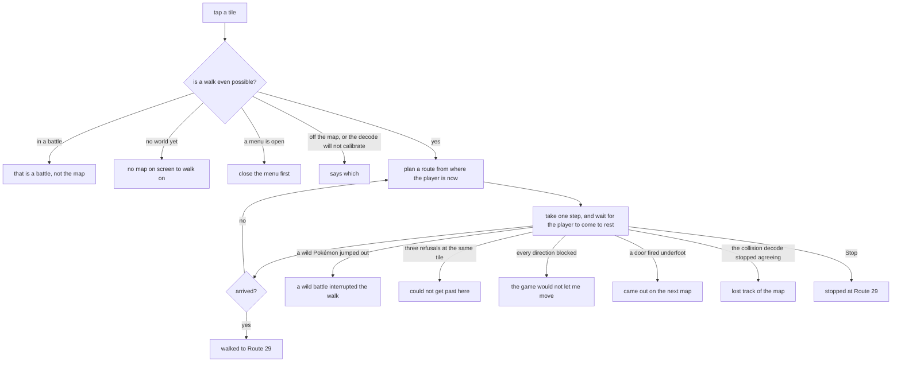
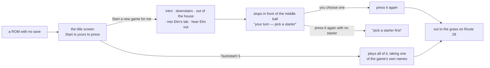

# Using it

[← crystal-pilot mobile](../README.md) · [Using it](USING.md) · [The interface](INTERFACE.md) · [Two devices](DEVICES.md) · [What is proven](PROVEN.md) · [Developing](DEVELOPING.md) · [The code](CODE.md)

How to play it by hand, how to send the pilot somewhere, and where your save
goes. For what the screen is made of rather than what it does, see
[The interface](INTERFACE.md).

---

## Controls

Eight on-screen buttons: the D-pad, A, B, Select and Start. **Press and hold** —
Gen 2 turns you before it walks you, so a tap in a new direction only turns you,
and each tap after that moves a single tile. Holding walks.

That is the app mid-hand-off: a ROM booted, the intro left alone for the player,
and LEFT held down — which is what the lit key means.

**The screenshots in this repository predate two rounds of layout work**, so
they show an older arrangement: the pad beneath a speed slider rather than at
the bottom of the page, four action buttons where there is now a ranked list of
offers, no status bar between the screen and the pad, and the old palette. The
controls themselves are unchanged. They want retaking on a real device, which is
also the only place the emulator picture can be captured — a backgrounded tab
does not paint the canvas, so a screenshot taken from a test harness has a black
rectangle where the game should be. The held state is read back from the
emulator's own set of held buttons, so pressing `Z` on a keyboard lights up the
same A button a thumb would.

The pad is at the bottom of the page and stays there. It and the screen are the
machine; everything else opens over them and closes again, which is why the
whole app now fits one viewport with nothing to scroll — see
[The interface](INTERFACE.md).

There is no TAB button. On the desktop pilot, TAB opens an in-game menu because
the only surface there is the emulator window; here the pilot's controls are
behind the status line, one tap away, so the game never has to be interrupted to
reach them. While a job is running the pad dims and stops taking input — it
would be fighting the pilot for the same joypad — and Stop sits on the status
line for as long as there is something to stop.

A keyboard works on the same page, which is what makes it testable on a desktop:

| Key | Button |
| --- | --- |
| Arrow keys | D-pad |
| `Z` or `A` | A |
| `X` or `S` | B |
| `Enter` | Start |
| `Shift` or `Backspace` | Select |

Buttons release on `pointerup`, `pointercancel`, `pointerleave` and on window
blur, so a direction cannot get stuck down after your thumb slides off the
button or you switch apps mid-press.

## Tap to walk

Tap anywhere on the screen and the pilot walks there.

That is a walk in progress: the ring is the tile that was tapped, the player is
five steps into the route, and the status says where it is going and where it
has got to.

The ring is placed from the *camera*, not from the player's coordinate, and the
difference is visible in that shot — it is drawn between tile boundaries because
the screen is mid-scroll. Measured frame by frame, the camera starts sliding at
frame 11 of a step and has moved the full 16 pixels by frame 22, but `wXCoord`
does not change until frame 23. A marker positioned from the coordinate
therefore holds still for almost the whole of every step while the world slides
out from under it, which looks exactly like the destination drifting away.
`wPlayerBGMapOffsetX/Y` is the camera itself and moves smoothly, so the marker
stays on its tile.

The overworld is drawn in 16×16 tiles, so the 160×144 screen is 10×9 of them and
the player is always the one at (4, 4) — the camera keeps them centred rather
than clamping at map edges. That makes a tap a map coordinate, and `app/collision.js`
turns the map into something you can search: Gen 2 keeps the loaded blocks in
`wOverworldMapBlocks` and the per-quadrant collision values in ROM at
`wTilesetCollisionAddress`, which together give the collision byte for any tile.
Ledges are one-way, so a route never plans a hop it could not walk back.

The decode is checked against the game rather than trusted. `wPlayerTileCollision`
is the collision of the tile the player is standing on, so every step compares
the two and stops if they disagree — a wrong decode does not throw, it silently
paths through walls. As a cross-check the same 48 tiles read here match the
desktop pilot's reading of the same room exactly.

Two things had to be learned again in the browser, because each produced a walk
that ended somewhere plausible but wrong:

- **Coordinates change when the game commits to a step, not when it finishes.**
  Returning then reports a tile the player has not reached, and the next press
  lands mid-stride — so every step performed the *previous* one. Steps now wait
  for the player to come to rest.
- **A path is a plan, and plans go stale.** Following one blindly meant a single
  missed step put every later step in the wrong place while the walk still
  reported success. The route is re-planned from where the player actually is,
  every step.

Tapping a door, staircase or cave walks onto it and goes through: those fire the
moment you step on them, and the transition takes a few frames longer than the
step, so the walk waits for it and reports the map it came out on rather than
the tile it left from. A tap is still a tile on the map in front of you — it
will not route you through a door to somewhere on another map.

It also distinguishes the ways a walk can end, because they mean different
things — and it says which one, rather than "gave up":

The one worth singling out is *the game refusing input at all* — walk downstairs
into Mom's script and every direction is blocked, which is not the map's fault
and should not be reported as one. Re-planning every step is what makes the
loop in that diagram safe: a plan is a plan, and a single missed step would
otherwise put every later step in the wrong place while the walk still reported
success.

## Starting a game is yours, not the pilot's

If the ROM has no save, the app boots it, hands you the buttons, and waits. It
does not play the intro for you.

That is deliberate. An auto-pilot can only answer a prompt by pressing A, and
the intro's NAME menu defaults to NEW NAME — which opens the letter grid, where
pressing A repeatedly spells `AAAAA`. Your character, your name. Until the world
is live the pilot has nothing to offer, and the offers list says so: the bar
reads *Press Start, then play until you are out in the world*, and the list fills
itself in the moment `wMapStatus` says there is a world to walk in.

Automated runs have nobody to press A, so they opt in with `?autostart=1`, and
even then they take one of the game's own names rather than typing one —
CHRIS/MAT/ALLAN/JON, or KRIS/AMANDA/JUANA/JODI, the four presets below NEW NAME,
which the game stores with no letter grid at all. The pilot steps the cursor down
to the first of them and confirms.

That menu is recognised by its **shape** rather than by its cursor: five items,
ten columns wide, drawn at the top of the screen. The cursor still holds
whatever the gender prompt left in it until the menu is actually drawn, so
reading the cursor picks a name before the menu exists. And the pick is latched
once, because nothing clears `wMenuData` when a menu closes — without the latch
the intro loop sits there re-choosing a name that has already been chosen,
forever.

The same reasoning applies one step further in, which is why **Start a new game
for me** is two presses rather than one. The first plays the intro, walks
downstairs, out of the house and into Elm's lab, hears Elm out so the three
balls go live, and stops with you standing in front of the middle one. Which
starter you want is the one real decision in the opening; a tool that plays the
boring parts should hand that back rather than answer it. The second press walks
out to the grass once you have chosen, and refuses with *pick a starter first*
if you have not.

It also tells you which ball is which, because the game does not: they are three
identical sprites, and the name only appears once you are already talking to
one. Left to right on the table is Cyndaquil, Totodile, Chikorita — read off
`ElmsLab.asm`, where they sit at x = 6, 7 and 8, and confirmed by picking each
one.

`boot.run(name)` still plays straight through when a starter is named, which is
what the automated runs use; `boot.run()` with nothing named is the hand-over.

The route is the desktop pilot's, and each leg says which map it expects to land
on rather than assuming, because a bootstrap that drifts off course ends up
mashing A at a wall. About a minute for the two presses together, and the point
of it is that everything else needs a party to be worth running.

## Hunting

Pick a species and the pilot walks the grass until it turns up, running from
everything else, then hands you the battle.

The list is only what that route has **at that hour**, which needs two things
the phone does not have a disassembly for. Both come out of the cartridge
instead: species names from `PokemonNames`, and the encounter tables from
`JohtoGrassWildMons`, whose layout is three blocks of seven — morning, day,
night. Checked against the desktop pilot's reading of the same tables: Route 29
gives HOPPIP, PIDGEY, SENTRET, RATTATA in the morning and HOOTHOOT, RATTATA
after dark, entry for entry.

Grass only, deliberately. The pilot walks; it does not surf, so a route's water
table is full of Pokémon it could pace the grass all day without meeting.

Catch does the same walking and then throws balls, counting them **out of the
bag** rather than trusting a tally — the two coming apart is the failure worth
catching, and the desktop pilot shipped exactly that bug once, reporting two
balls while three left the bag. It refuses up front if the party is full, since
the sixth catch would go to the PC. The nickname prompt is answered *no*: it
defaults to yes, and yes opens the letter grid, where anything that can only
press A spells AAAAA.

Item names come out of the ROM too, and they are not laid out like the species
names: `PokemonNames` is a fixed-width table, `ItemNames` is packed with `@`
between entries. Reading it at a stride drifts a character further out every
entry — ULTRA BALL came back as `LTRA BALL`, GREAT BALL as `AT BALL`.

Hunting is watched working: with a starter in tow on Route 29 it found a RATTATA
after five encounters, running from two PIDGEY and two SENTRET on the way. So is
catching, once `eggErrand` has been round for the balls.

Two bugs surfaced while measuring that, both from walking into people:

* **A single refused step could end a walk.** A tile that refused went into the
  avoid set for good. Where the only way through is one tile wide — Route 30's
  corridor north — banning it made the goal unreachable, so the walk gave up
  before the three-refusal counter could notice it was the same obstacle twice.
  Planning now falls back: around the obstacles, then without the object list,
  then without the refusals.
* **The collision map is terrain only**, so an NPC read as open floor and every
  plan walked into them. `CollisionMap.occupied` now reads `wMapObjects` — its
  coordinates are stored four higher than the map's own, checked against the
  player — and those tiles are preferred-against rather than treated as walls,
  because an object hidden by its event flag still has an entry. Its output
  matches the disassembly's `object_event` lists on Route 29 and Route 30, in
  order.

## Two places to heal

Elm has a healing machine in his lab, and it works from the moment you take a
starter — `bg_event 2, 1` in `ElmsLab.asm`, gated on
`EVENT_GOT_A_POKEMON_FROM_ELM`, a yes/no and then `special HealParty`. No
Pokédex, no Pokémon Center, no fee. It is easy to miss, and the pilot used to
walk to Cherrygrove for everything.

Which of the two is nearer is not a fixed answer. Elm's lab is in New Bark, the
Center is in Cherrygrove, and Route 29 runs between them — so it flips depending
on which end of that route you are standing on, which happens to be the route
the pilot spends nearly all of its time on.

Counting legs of the world graph gets this wrong, and wrong in the common case.
By legs the Center is one hop from Route 29 and the lab is two, so the Center
wins everywhere. But a hop west means walking the whole sixty-tile width of the
route through grass, while the lab — from the eastern end, where the bootstrap
leaves you — is six tiles and a door. So the cost is the tiles to the edge the
route would actually leave by, plus a flat charge for each further leg.
Measured standing at x=53 of 60 on Route 29, that picks the lab at a cost of 31
against the Center's 53, and healing a fainted party took 1.8 seconds.

Below about x=25 the answer swings back to Cherrygrove, which is the point of
computing it rather than picking a favourite.

## Saving, and getting the save off the phone

The pilot saves the game the way a person does — `START → SAVE → YES` — and
`Download .sav` hands you the battery save as a file. Together those are what
lets a phone session leave the tab.

Saving is not done by writing SRAM, for two reasons. It cannot be: this core is
readable but not writable. And it should not be: a save the game did not make
itself is a save the game does not trust, because Crystal validates one by two
check bytes and a checksum it computes as it writes.

**Success is the battery changing, not the presses landing.** The desktop pilot
watches its `SaveGameData` hook fire; there are no hooks in a browser, so the
evidence here is the bytes — 32KB of cartridge RAM before and after, and a
committed save always moves them. Two things must hold: the bytes moved, *and*
what they now hold is a save the cartridge would load. The first alone accepts a
half-written battery; the second alone accepts a save that was already there
while this attempt did nothing.

**"Is there a save?" is the cartridge's own test**, `sCheckValue1 == 99 &&
sCheckValue2 == 127`, resolved out of the symbol file. Counting non-zero bytes
does *not* work, which is worth writing down because it is the obvious thing to
reach for: a battery that has never been saved to still reads five non-zero
bytes, so "any non-zero byte means there is a save" calls a blank cartridge
saved. That was the first version, and it reported a genuine first save as
though the game had already been saved.

Verified end to end, and across both halves of the project: the mobile app
played a new game to Route 29 with a Lv5 Cyndaquil, saved, and the resulting
32768 bytes were loaded in the *desktop* pilot under PyBoy, which read back
Route 29, `CYNDAQUIL Lv5 20/20`, Tackle and Leer. Two emulators, two
implementations, one save file.

`Load a .sav` brings one back the other way, so the desktop and the phone share
a game in both directions.

## Slots, and undoing a job

Three slots you pick, plus two the app writes for itself: an undo point before
every job it runs, and — only ever if a handoff has replaced your game — the
game it displaced. Five records in all, and `ALL_SLOTS` in `app/saves.js` is the
list.

**A slot holds a battery save, not a machine state, and that decides what it
can do.** Keeping one saves the game first; loading one puts you back at that
save point. So a slot is a place, not a moment — and a job that runs *inside* a
battle cannot have an undo point at all, because the game cannot be saved
there. The interface says so rather than offering an undo that quietly does
something else.

That limit is the emulator's, not a preference. WasmBoy will *capture* a machine
state — `saveState()` returns all four memory regions populated, and persists
them — but it will not put one back: `loadState()` rejects with `undefined`,
measured on states the library created itself, fetched from its own IndexedDB,
handed to its own API, with every buffer the right length. A snapshot you can
never return to is no use as a slot, so slots are batteries instead.

Writing a battery is the one piece of cleverness here. The library keeps a
per-cartridge record in IndexedDB and reads `cartridgeRam` out of it when a ROM
loads, so putting a save in means writing that record and re-loading the ROM —
which is why loading a slot leaves you at the title screen's CONTINUE, driven
for you.

## A note on updates

**The header shows which build you are running**, next to the app's name: the
version number on its own, and when the server has a newer one both numbers as
`v96 → v97` with an Update button beside them. That button is deliberately heavy-handed — it unregisters the service
worker, deletes every cache, and only then reloads — because a plain reload is
exactly what does not always work, and it is the sequence I ended up typing by
hand over and over while building this.

**It asks first if a game is loaded**, which it did not have to when it sat two
screens down in the settings card. Next to the app's name it is a thumb's width
from the title, and what it does is close the game. With the files kept, the
reload brings them and your last save back, so the cost is the current moment —
steps since you saved, a battle in progress. Without them it is that plus two
file pickers, and the question says which. With no ROM picked there is nothing
to lose, so it does not ask at all.

An earlier version of this paragraph said the battery save survives a reload on
its own. **It does not**, and that was worth measuring rather than assuming:
the emulator library persists a cartridge only when something asks it to, and
its own store held zero records after a save this app had verified byte for
byte. Saving then reloading lost the game. The save survives now because the
app keeps a copy itself — see below.

It is in the header because that is the one part of the app that is always
there. For three versions it lived in the settings card, which at the time did
not exist until a ROM and a symbol file were loaded — so answering "am I running
what I just deployed?" meant picking two files first, to read a number the page
knew on its first frame. Settings is reachable with no game now, for the same
reason one level down, and `check-app` asserts that too. `tools/check-app` now asserts the display is in the header,
because a version you cannot reach when you want it is much the same as not
having one.

The wording is short because that row is shared with the location and the speed
slider, and 375px does not fit a sentence. Up to date says nothing, so it says
nothing: the two states worth words are a newer version and a server that did
not answer.

The number lives in `app/version.js`, so it is the identity of the code actually
running rather than of whatever the server has. That is the distinction that
makes the display useful: reading the version off the network tells you what is
deployed, which is not the question you are asking when a bug you saw fixed is
still in front of you. `tools/check-app` asserts that number matches the service
worker's cache name, because a version display that lies is worse than none.

The worker fetches **network first, falling back to the cache**. That is the
opposite of the usual offline-first advice, on purpose.

Cache-first looked like it worked and was wrong. A returning visitor got the
*previous* deploy's shell: the new worker installs and claims the page, but the
load already in flight had been answered from the old cache, so the app was
permanently one reload behind. Found on the deployed app, which served an
`index.html` from before the save card existed while serving the new `sw.js`
that listed it — so the save card simply was not there.

The staleness was the visible half. The dangerous half was mixing: the match
was not scoped to the current cache, and a module added in a new version is not
in the old cache at all, so it gets fetched fresh. Old HTML against new
JavaScript is a combination nobody has tested.

It still works with no network — that is what the fallback is for.
